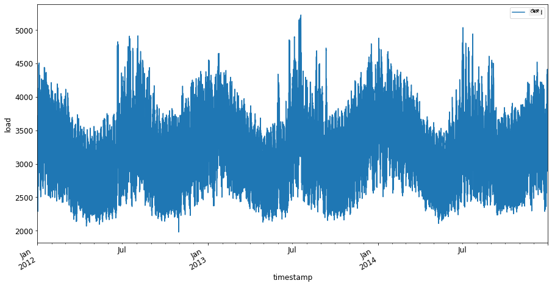
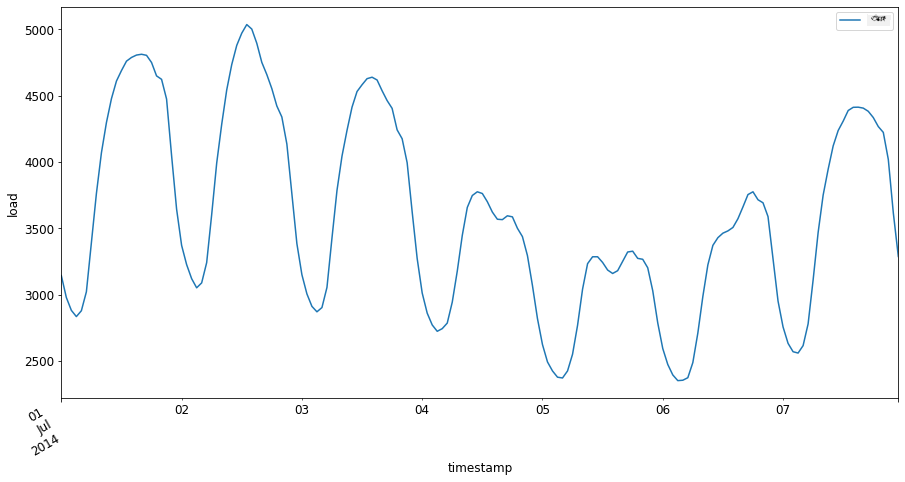

<!--
CO_OP_TRANSLATOR_METADATA:
{
  "original_hash": "662b509c39eee205687726636d0a8455",
  "translation_date": "2025-12-19T16:06:38+00:00",
  "source_file": "7-TimeSeries/1-Introduction/README.md",
  "language_code": "kn"
}
-->
# ಕಾಲ ಸರಣಿಗಳ ಭವಿಷ್ಯವಾಣಿ ಪರಿಚಯ


> ಸ್ಕೆಚ್‌ನೋಟ್ [ಟೊಮೊಮಿ ಇಮುರು](https://www.twitter.com/girlie_mac) ಅವರಿಂದ

ಈ ಪಾಠದಲ್ಲಿ ಮತ್ತು ಮುಂದಿನ ಪಾಠದಲ್ಲಿ, ನೀವು ಕಾಲ ಸರಣಿಗಳ ಭವಿಷ್ಯವಾಣಿ ಬಗ್ಗೆ ಸ್ವಲ್ಪ ತಿಳಿದುಕೊಳ್ಳುತ್ತೀರಿ, ಇದು ಎಂಎಲ್ ವಿಜ್ಞಾನಿಯ repertoire ನಲ್ಲಿ ಒಂದು ಆಸಕ್ತಿದಾಯಕ ಮತ್ತು ಮೌಲ್ಯಯುತ ಭಾಗವಾಗಿದೆ, ಆದರೆ ಇತರ ವಿಷಯಗಳಿಗಿಂತ ಸ್ವಲ್ಪ ಕಡಿಮೆ ಪರಿಚಿತವಾಗಿದೆ. ಕಾಲ ಸರಣಿಗಳ ಭವಿಷ್ಯವಾಣಿ ಒಂದು ರೀತಿಯ 'ಕ್ರಿಸ್ಟಲ್ ಬಾಲ್' ಆಗಿದೆ: ಬೆಲೆ ಮುಂತಾದ ಚರದ ಹಿಂದಿನ ಕಾರ್ಯಕ್ಷಮತೆಯ ಆಧಾರದ ಮೇಲೆ, ನೀವು ಅದರ ಭವಿಷ್ಯದ ಸಾಧ್ಯ ಮೌಲ್ಯವನ್ನು ಊಹಿಸಬಹುದು.

[](https://youtu.be/cBojo1hsHiI "ಕಾಲ ಸರಣಿಗಳ ಭವಿಷ್ಯವಾಣಿ ಪರಿಚಯ")

> 🎥 ಕಾಲ ಸರಣಿಗಳ ಭವಿಷ್ಯವಾಣಿ ಕುರಿತು ವೀಡಿಯೋಗಾಗಿ ಮೇಲಿನ ಚಿತ್ರವನ್ನು ಕ್ಲಿಕ್ ಮಾಡಿ

## [ಪೂರ್ವ-ಪಾಠ ಪ್ರಶ್ನೋತ್ತರ](https://ff-quizzes.netlify.app/en/ml/)

ಇದು ವ್ಯವಹಾರಕ್ಕೆ ನೇರವಾಗಿ ಅನ್ವಯಿಸುವ ಬೆಲೆ ನಿಗದಿ, ಇನ್ವೆಂಟರಿ ಮತ್ತು ಸರಬರಾಜು ಸರಪಳಿ ಸಮಸ್ಯೆಗಳಂತಹ ಸಮಸ್ಯೆಗಳಿಗೆ ನೇರ ಅನ್ವಯವಿರುವ ಉಪಯುಕ್ತ ಮತ್ತು ಆಸಕ್ತಿದಾಯಕ ಕ್ಷೇತ್ರವಾಗಿದೆ. ಭವಿಷ್ಯದ ಕಾರ್ಯಕ್ಷಮತೆಯನ್ನು ಉತ್ತಮವಾಗಿ ಊಹಿಸಲು ಹೆಚ್ಚಿನ ಒಳನೋಟಗಳನ್ನು ಪಡೆಯಲು ಡೀಪ್ ಲರ್ನಿಂಗ್ ತಂತ್ರಗಳನ್ನು ಬಳಸಲು ಪ್ರಾರಂಭಿಸಿದರೂ, ಕಾಲ ಸರಣಿಗಳ ಭವಿಷ್ಯವಾಣಿ ಕ್ಲಾಸಿಕ್ ಎಂಎಲ್ ತಂತ್ರಜ್ಞಾನಗಳಿಂದ ಬಹುಮಟ್ಟಿಗೆ ಪ್ರಭಾವಿತವಾಗಿರುವ ಕ್ಷೇತ್ರವಾಗಿಯೇ ಉಳಿದಿದೆ.

> ಪೆನ್ ಸ್ಟೇಟ್‌ನ ಉಪಯುಕ್ತ ಕಾಲ ಸರಣಿ ಪಠ್ಯಕ್ರಮವನ್ನು [ಇಲ್ಲಿ](https://online.stat.psu.edu/stat510/lesson/1) ಕಾಣಬಹುದು

## ಪರಿಚಯ

ನೀವು ಸಮಯದೊಂದಿಗೆ ಎಷ್ಟು ಬಾರಿ ಮತ್ತು ಎಷ್ಟು ಕಾಲ ಬಳಸಲಾಗುತ್ತದೆ ಎಂಬುದರ ಬಗ್ಗೆ ಡೇಟಾವನ್ನು ಒದಗಿಸುವ ಸ್ಮಾರ್ಟ್ ಪಾರ್ಕಿಂಗ್ ಮೀಟರ್‌ಗಳ ಸರಣಿಯನ್ನು ನಿರ್ವಹಿಸುತ್ತಿದ್ದೀರಿ ಎಂದು ಊಹಿಸೋಣ.

> ಮೀಟರ್‌ನ ಹಿಂದಿನ ಕಾರ್ಯಕ್ಷಮತೆಯ ಆಧಾರದ ಮೇಲೆ, ಸರಬರಾಜು ಮತ್ತು ಬೇಡಿಕೆಯ ನಿಯಮಗಳ ಪ್ರಕಾರ ಅದರ ಭವಿಷ್ಯದ ಮೌಲ್ಯವನ್ನು ನೀವು ಊಹಿಸಬಹುದಾದರೆ?

ನಿಮ್ಮ ಗುರಿಯನ್ನು ಸಾಧಿಸಲು ಯಾವಾಗ ಕ್ರಮ ಕೈಗೊಳ್ಳಬೇಕೆಂದು ನಿಖರವಾಗಿ ಊಹಿಸುವುದು ಕಾಲ ಸರಣಿಗಳ ಭವಿಷ್ಯವಾಣಿಯಿಂದ ಎದುರಿಸಬಹುದಾದ ಸವಾಲಾಗಿದೆ. ಜನರು ಪಾರ್ಕಿಂಗ್ ಸ್ಥಳ ಹುಡುಕುತ್ತಿರುವ ಸಮಯದಲ್ಲಿ ಹೆಚ್ಚು ಶುಲ್ಕ ವಿಧಿಸುವುದು ಅವರಿಗೆ ಸಂತೋಷಕರವಾಗುವುದಿಲ್ಲ, ಆದರೆ ಇದು ರಸ್ತೆಗಳ ಸ್ವಚ್ಛತೆಯನ್ನು ಕಾಪಾಡಲು ಆದಾಯವನ್ನು ಉತ್ಪಾದಿಸುವ ಖಚಿತ ಮಾರ್ಗವಾಗಿರುತ್ತದೆ!

ಕಾಲ ಸರಣಿ ಆಲ್ಗಾರಿಥಮ್‌ಗಳ ಕೆಲವು ಪ್ರಕಾರಗಳನ್ನು ಅನ್ವೇಷಿಸಿ, ಕೆಲವು ಡೇಟಾವನ್ನು ಸ್ವಚ್ಛಗೊಳಿಸಿ ಮತ್ತು ಸಿದ್ಧಪಡಿಸಲು ನೋಟ್ಬುಕ್ ಪ್ರಾರಂಭಿಸೋಣ. ನೀವು ವಿಶ್ಲೇಷಿಸುವ ಡೇಟಾ GEFCom2014 ಭವಿಷ್ಯವಾಣಿ ಸ್ಪರ್ಧೆಯಿಂದ ತೆಗೆದುಕೊಂಡಿದೆ. ಇದು 2012 ರಿಂದ 2014 ರವರೆಗೆ 3 ವರ್ಷಗಳ ಗಂಟೆಗಟ್ಟಲೆ ವಿದ್ಯುತ್ ಲೋಡ್ ಮತ್ತು ತಾಪಮಾನ ಮೌಲ್ಯಗಳನ್ನು ಒಳಗೊಂಡಿದೆ. ವಿದ್ಯುತ್ ಲೋಡ್ ಮತ್ತು ತಾಪಮಾನದ ಇತಿಹಾಸದ ಮಾದರಿಗಳನ್ನು ಆಧರಿಸಿ, ನೀವು ಭವಿಷ್ಯದ ವಿದ್ಯುತ್ ಲೋಡ್ ಮೌಲ್ಯಗಳನ್ನು ಊಹಿಸಬಹುದು.

ಈ ಉದಾಹರಣೆಯಲ್ಲಿ, ನೀವು ಇತಿಹಾಸದ ಲೋಡ್ ಡೇಟಾವನ್ನು ಮಾತ್ರ ಬಳಸಿಕೊಂಡು ಒಂದು ಕಾಲ ಹಂತವನ್ನು ಮುಂಚಿತವಾಗಿ ಊಹಿಸುವುದನ್ನು ಕಲಿಯುತ್ತೀರಿ. ಪ್ರಾರಂಭಿಸುವ ಮೊದಲು, ಆದರೆ, ಹಿನ್ನೆಲೆಯಲ್ಲಿರುವ ಪ್ರಕ್ರಿಯೆಯನ್ನು ಅರ್ಥಮಾಡಿಕೊಳ್ಳುವುದು ಉಪಯುಕ್ತ.

## ಕೆಲವು ವ್ಯಾಖ್ಯಾನಗಳು

'ಕಾಲ ಸರಣಿ' ಎಂಬ ಪದವನ್ನು ಎದುರಿಸಿದಾಗ, ಅದರ ಬಳಕೆಯನ್ನು ವಿವಿಧ ಸಂದರ್ಭಗಳಲ್ಲಿ ಅರ್ಥಮಾಡಿಕೊಳ್ಳಬೇಕಾಗುತ್ತದೆ.

🎓 **ಕಾಲ ಸರಣಿ**

ಗಣಿತದಲ್ಲಿ, "ಕಾಲ ಸರಣಿ ಎಂದರೆ ಸಮಯ ಕ್ರಮದಲ್ಲಿ ಸೂಚಿಸಲ್ಪಟ್ಟ (ಅಥವಾ ಪಟ್ಟಿ ಮಾಡಲಾದ ಅಥವಾ ಗ್ರಾಫ್ ಮಾಡಲಾದ) ಡೇಟಾ ಪಾಯಿಂಟ್‌ಗಳ ಸರಣಿ. ಸಾಮಾನ್ಯವಾಗಿ, ಕಾಲ ಸರಣಿ ಎಂದರೆ ಸಮಯದಲ್ಲಿ ಸಮಾನ ಅಂತರದ ಕ್ರಮವಾಗಿ ತೆಗೆದುಕೊಂಡ ಸರಣಿ." ಕಾಲ ಸರಣಿಯ ಉದಾಹರಣೆ ಎಂದರೆ [ಡೌ ಜೋನ್ಸ್ ಇಂಡಸ್ಟ್ರಿಯಲ್ ಅವರೆಜ್](https://wikipedia.org/wiki/Time_series) ನ ದೈನಂದಿನ ಮುಚ್ಚುವ ಮೌಲ್ಯ. ಕಾಲ ಸರಣಿ ಪ್ಲಾಟ್‌ಗಳು ಮತ್ತು ಸಾಂಖ್ಯಿಕ ಮಾದರೀಕರಣವನ್ನು ಸಿಗ್ನಲ್ ಪ್ರೊಸೆಸಿಂಗ್, ಹವಾಮಾನ ಭವಿಷ್ಯವಾಣಿ, ಭೂಕಂಪ ಭವಿಷ್ಯವಾಣಿ ಮತ್ತು ಇತರ ಕ್ಷೇತ್ರಗಳಲ್ಲಿ ಸಾಮಾನ್ಯವಾಗಿ ಕಾಣಬಹುದು, ಅಲ್ಲಿ ಘಟನೆಗಳು ಸಂಭವಿಸುತ್ತವೆ ಮತ್ತು ಡೇಟಾ ಪಾಯಿಂಟ್‌ಗಳನ್ನು ಸಮಯದೊಂದಿಗೆ ಪ್ಲಾಟ್ ಮಾಡಬಹುದು.

🎓 **ಕಾಲ ಸರಣಿ ವಿಶ್ಲೇಷಣೆ**

ಕಾಲ ಸರಣಿ ವಿಶ್ಲೇಷಣೆ ಎಂದರೆ ಮೇಲ್ಕಂಡ ಕಾಲ ಸರಣಿ ಡೇಟಾವನ್ನು ವಿಶ್ಲೇಷಿಸುವುದು. ಕಾಲ ಸರಣಿ ಡೇಟಾ ವಿಭಿನ್ನ ರೂಪಗಳನ್ನು ಹೊಂದಬಹುದು, ಉದಾಹರಣೆಗೆ 'ವಿರಾಮಿತ ಕಾಲ ಸರಣಿ' ಇದು ವಿರಾಮದ ಘಟನೆಗೆ ಮುಂಚೆ ಮತ್ತು ನಂತರದ ಕಾಲ ಸರಣಿಯ ಬೆಳವಣಿಗೆಯ ಮಾದರಿಗಳನ್ನು ಪತ್ತೆಹಚ್ಚುತ್ತದೆ. ಕಾಲ ಸರಣಿಗೆ ಬೇಕಾದ ವಿಶ್ಲೇಷಣೆ ಡೇಟಾದ ಸ್ವಭಾವದ ಮೇಲೆ ಅವಲಂಬಿತವಾಗಿದೆ. ಕಾಲ ಸರಣಿ ಡೇಟಾ ಸ್ವತಃ ಸಂಖ್ಯೆಗಳ ಅಥವಾ ಅಕ್ಷರಗಳ ಸರಣಿಯಾಗಿರಬಹುದು.

ನಿರ್ವಹಿಸಬೇಕಾದ ವಿಶ್ಲೇಷಣೆ ವಿವಿಧ ವಿಧಾನಗಳನ್ನು ಬಳಸುತ್ತದೆ, ಅವುಗಳಲ್ಲಿ ಫ್ರೀಕ್ವೆನ್ಸಿ-ಡೊಮೇನ್ ಮತ್ತು ಟೈಮ್-ಡೊಮೇನ್, ರೇಖೀಯ ಮತ್ತು ಅರೆಖೀಯ, ಮತ್ತು ಇನ್ನಷ್ಟು ಸೇರಿವೆ. ಈ ರೀತಿಯ ಡೇಟಾವನ್ನು ವಿಶ್ಲೇಷಿಸುವ ಅನೇಕ ಮಾರ್ಗಗಳ ಬಗ್ಗೆ [ಇಲ್ಲಿ](https://www.itl.nist.gov/div898/handbook/pmc/section4/pmc4.htm) ತಿಳಿದುಕೊಳ್ಳಿ.

🎓 **ಕಾಲ ಸರಣಿ ಭವಿಷ್ಯವಾಣಿ**

ಕಾಲ ಸರಣಿ ಭವಿಷ್ಯವಾಣಿ ಎಂದರೆ ಹಿಂದಿನ ಸಂಗ್ರಹಿತ ಡೇಟಾದ ಮಾದರಿಗಳನ್ನು ಆಧರಿಸಿ ಭವಿಷ್ಯದ ಮೌಲ್ಯಗಳನ್ನು ಊಹಿಸಲು ಮಾದರಿಯನ್ನು ಬಳಸುವುದು. ಕಾಲ ಸರಣಿ ಡೇಟಾವನ್ನು ಅನ್ವೇಷಿಸಲು ರಿಗ್ರೆಶನ್ ಮಾದರಿಗಳನ್ನು ಬಳಸಬಹುದು, ಸಮಯ ಸೂಚ್ಯಂಕಗಳನ್ನು x ಚರಗಳಾಗಿ ಗ್ರಾಫ್‌ನಲ್ಲಿ ಬಳಸಿಕೊಂಡು, ಆದರೆ ಇಂತಹ ಡೇಟಾವನ್ನು ವಿಶೇಷ ಮಾದರಿಗಳ ಮೂಲಕ ವಿಶ್ಲೇಷಿಸುವುದು ಉತ್ತಮ.

ಕಾಲ ಸರಣಿ ಡೇಟಾ ಕ್ರಮಬದ್ಧ ವೀಕ್ಷಣೆಗಳ ಪಟ್ಟಿ ಆಗಿದ್ದು, ರೇಖೀಯ ರಿಗ್ರೆಶನ್ ಮೂಲಕ ವಿಶ್ಲೇಷಿಸಬಹುದಾದ ಡೇಟಾದಂತೆ ಅಲ್ಲ. ಅತ್ಯಂತ ಸಾಮಾನ್ಯ ಮಾದರಿ ARIMA, ಇದು "ಆಟೋರೆಗ್ರೆಸಿವ್ ಇಂಟಿಗ್ರೇಟೆಡ್ ಮೂವಿಂಗ್ ಅವರೆಜ್" ಎಂಬ ಅಕ್ಷರಶಃ.

[ARIMA ಮಾದರಿಗಳು](https://online.stat.psu.edu/stat510/lesson/1/1.1) "ಸರಣಿಯ ಪ್ರಸ್ತುತ ಮೌಲ್ಯವನ್ನು ಹಿಂದಿನ ಮೌಲ್ಯಗಳು ಮತ್ತು ಹಿಂದಿನ ಊಹಾ ದೋಷಗಳಿಗೆ ಸಂಬಂಧಿಸುತ್ತದೆ." ಅವು ಸಮಯ-ಡೊಮೇನ್ ಡೇಟಾವನ್ನು ವಿಶ್ಲೇಷಿಸಲು ಅತ್ಯಂತ ಸೂಕ್ತವಾಗಿವೆ, ಅಲ್ಲಿ ಡೇಟಾ ಸಮಯದೊಂದಿಗೆ ಕ್ರಮಬದ್ಧವಾಗಿದೆ.

> ARIMA ಮಾದರಿಗಳ ಹಲವು ಪ್ರಕಾರಗಳಿವೆ, ಅವುಗಳ ಬಗ್ಗೆ ನೀವು [ಇಲ್ಲಿ](https://people.duke.edu/~rnau/411arim.htm) ತಿಳಿದುಕೊಳ್ಳಬಹುದು ಮತ್ತು ಮುಂದಿನ ಪಾಠದಲ್ಲಿ ಅವುಗಳ ಬಗ್ಗೆ ಸ್ಪರ್ಶಿಸುವಿರಿ.

ಮುಂದಿನ ಪಾಠದಲ್ಲಿ, ನೀವು [ಏಕಚರ ಕಾಲ ಸರಣಿ](https://itl.nist.gov/div898/handbook/pmc/section4/pmc44.htm) ಬಳಸಿ ARIMA ಮಾದರಿಯನ್ನು ನಿರ್ಮಿಸುವಿರಿ, ಇದು ಸಮಯದೊಂದಿಗೆ ಮೌಲ್ಯ ಬದಲಾಗುವ ಒಂದು ಚರವನ್ನು ಗಮನಿಸುತ್ತದೆ. ಈ ರೀತಿಯ ಡೇಟಾದ ಉದಾಹರಣೆ [ಈ ಡೇಟಾಸೆಟ್](https://itl.nist.gov/div898/handbook/pmc/section4/pmc4411.htm) ಆಗಿದ್ದು, ಇದು ಮಾಉನಾ ಲೋಆ ವೀಕ್ಷಣಾಲಯದಲ್ಲಿ ಮಾಸಿಕ CO2 ಸಾಂದ್ರತೆಯನ್ನು ದಾಖಲಿಸುತ್ತದೆ:

|  CO2   | YearMonth | Year  | Month |
| :----: | :-------: | :---: | :---: |
| 330.62 |  1975.04  | 1975  |   1   |
| 331.40 |  1975.13  | 1975  |   2   |
| 331.87 |  1975.21  | 1975  |   3   |
| 333.18 |  1975.29  | 1975  |   4   |
| 333.92 |  1975.38  | 1975  |   5   |
| 333.43 |  1975.46  | 1975  |   6   |
| 331.85 |  1975.54  | 1975  |   7   |
| 330.01 |  1975.63  | 1975  |   8   |
| 328.51 |  1975.71  | 1975  |   9   |
| 328.41 |  1975.79  | 1975  |  10   |
| 329.25 |  1975.88  | 1975  |  11   |
| 330.97 |  1975.96  | 1975  |  12   |

✅ ಈ ಡೇಟಾಸೆಟ್‌ನಲ್ಲಿ ಸಮಯದೊಂದಿಗೆ ಬದಲಾಗುವ ಚರವನ್ನು ಗುರುತಿಸಿ

## ಗಮನಿಸಬೇಕಾದ ಕಾಲ ಸರಣಿ ಡೇಟಾ ಲಕ್ಷಣಗಳು

ಕಾಲ ಸರಣಿ ಡೇಟಾವನ್ನು ನೋಡಿದಾಗ, ಅದರಲ್ಲಿ [ನಿರ್ದಿಷ್ಟ ಲಕ್ಷಣಗಳು](https://online.stat.psu.edu/stat510/lesson/1/1.1) ಇವೆಂದು ನೀವು ಗಮನಿಸಬಹುದು, ಅವುಗಳನ್ನು ಗಮನದಲ್ಲಿಟ್ಟುಕೊಂಡು ಅವುಗಳ ಮಾದರಿಗಳನ್ನು ಉತ್ತಮವಾಗಿ ಅರ್ಥಮಾಡಿಕೊಳ್ಳಲು ನೀವು ಅವುಗಳನ್ನು ತಗ್ಗಿಸಬೇಕಾಗಬಹುದು. ಕಾಲ ಸರಣಿ ಡೇಟಾವನ್ನು ನೀವು ವಿಶ್ಲೇಷಿಸಲು ಬಯಸುವ 'ಸಿಗ್ನಲ್' ಎಂದು ಪರಿಗಣಿಸಿದರೆ, ಈ ಲಕ್ಷಣಗಳನ್ನು 'ಶಬ್ದ' ಎಂದು ಭಾವಿಸಬಹುದು. ಈ 'ಶಬ್ದ' ಅನ್ನು ಕೆಲವು ಸಾಂಖ್ಯಿಕ ತಂತ್ರಗಳನ್ನು ಬಳಸಿ ಕಡಿಮೆ ಮಾಡಬೇಕಾಗಬಹುದು.

ಕಾಲ ಸರಣಿಯೊಂದಿಗೆ ಕೆಲಸ ಮಾಡಲು ನೀವು ತಿಳಿದುಕೊಳ್ಳಬೇಕಾದ ಕೆಲವು ಪರಿಕಲ್ಪನೆಗಳು ಇಲ್ಲಿವೆ:

🎓 **ಪ್ರವೃತ್ತಿಗಳು**

ಪ್ರವೃತ್ತಿಗಳು ಎಂದರೆ ಸಮಯದೊಂದಿಗೆ ಅಳೆಯಬಹುದಾದ ಏರಿಕೆ ಮತ್ತು ಇಳಿಕೆಗಳು. [ಇನ್ನಷ್ಟು ಓದಿ](https://machinelearningmastery.com/time-series-trends-in-python). ಕಾಲ ಸರಣಿಯ ಸನ್ನಿವೇಶದಲ್ಲಿ, ನಿಮ್ಮ ಕಾಲ ಸರಣಿಯಿಂದ ಪ್ರವೃತ್ತಿಗಳನ್ನು ಹೇಗೆ ಬಳಸುವುದು ಮತ್ತು ಅಗತ್ಯವಿದ್ದರೆ ತೆಗೆದುಹಾಕುವುದು.

🎓 **[ಹಂಗಾಮಿ ಪ್ರಭಾವ](https://machinelearningmastery.com/time-series-seasonality-with-python/)**

ಹಂಗಾಮಿ ಪ್ರಭಾವ ಎಂದರೆ ಹಬ್ಬದ ಸಮಯದ ವ್ಯಾಪಾರ ಹೆಚ್ಚಳದಂತಹ ನಿಯಮಿತ ಅಸ್ಥಿರತೆಗಳು. [ನೋಡಿ](https://itl.nist.gov/div898/handbook/pmc/section4/pmc443.htm) ವಿವಿಧ ರೀತಿಯ ಪ್ಲಾಟ್‌ಗಳು ಡೇಟಾದಲ್ಲಿ ಹಂಗಾಮಿ ಪ್ರಭಾವವನ್ನು ಹೇಗೆ ತೋರಿಸುತ್ತವೆ.

🎓 **ಅಸಾಮಾನ್ಯ ಮೌಲ್ಯಗಳು**

ಅಸಾಮಾನ್ಯ ಮೌಲ್ಯಗಳು ಸಾಮಾನ್ಯ ಡೇಟಾ ವ್ಯತ್ಯಾಸದಿಂದ ಬಹಳ ದೂರದಲ್ಲಿರುತ್ತವೆ.

🎓 **ದೀರ್ಘಾವಧಿ ಚಕ್ರ**

ಹಂಗಾಮಿ ಪ್ರಭಾವದಿಂದ ಸ್ವತಂತ್ರವಾಗಿ, ಡೇಟಾ ದೀರ್ಘಾವಧಿ ಚಕ್ರವನ್ನು ತೋರಿಸಬಹುದು, ಉದಾಹರಣೆಗೆ ಒಂದು ವರ್ಷಕ್ಕಿಂತ ಹೆಚ್ಚು ಕಾಲ ಇರುವ ಆರ್ಥಿಕ ಕುಸಿತ.

🎓 **ಸ್ಥಿರ ವ್ಯತ್ಯಾಸ**

ಸಮಯದೊಂದಿಗೆ, ಕೆಲವು ಡೇಟಾ ಸ್ಥಿರ ಅಸ್ಥಿರತೆಗಳನ್ನು ತೋರಿಸುತ್ತವೆ, ಉದಾಹರಣೆಗೆ ದಿನ ಮತ್ತು ರಾತ್ರಿ ಎನರ್ಜಿ ಬಳಕೆ.

🎓 **ಅಕಸ್ಮಾತ್ ಬದಲಾವಣೆಗಳು**

ಡೇಟಾ ಅಕಸ್ಮಾತ್ ಬದಲಾವಣೆಯನ್ನು ತೋರಿಸಬಹುದು, ಇದಕ್ಕೆ ಹೆಚ್ಚಿನ ವಿಶ್ಲೇಷಣೆ ಬೇಕಾಗಬಹುದು. ಉದಾಹರಣೆಗೆ COVID ಕಾರಣದಿಂದ ವ್ಯವಹಾರಗಳ ಅಕಸ್ಮಾತ್ ಮುಚ್ಚುವಿಕೆ ಡೇಟಾದಲ್ಲಿ ಬದಲಾವಣೆಗಳನ್ನುಂಟುಮಾಡಿತು.

✅ ಇಲ್ಲಿ [ನಮೂನಾ ಕಾಲ ಸರಣಿ ಪ್ಲಾಟ್](https://www.kaggle.com/kashnitsky/topic-9-part-1-time-series-analysis-in-python) ಇದೆ, ಇದು ಕೆಲವು ವರ್ಷಗಳ ಕಾಲ ದಿನನಿತ್ಯದ ಆಟದ ಕರೆನ್ಸಿ ಖರ್ಚನ್ನು ತೋರಿಸುತ್ತದೆ. ಈ ಡೇಟಾದಲ್ಲಿ ಮೇಲ್ಕಂಡ ಲಕ್ಷಣಗಳಲ್ಲಿ ಯಾವುದಾದರೂ ಗುರುತಿಸಬಹುದೇ?


## ಅಭ್ಯಾಸ - ವಿದ್ಯುತ್ ಬಳಕೆ ಡೇಟಾ ಮೂಲಕ ಪ್ರಾರಂಭಿಸುವುದು

ಹಿಂದಿನ ಬಳಕೆಯನ್ನು ಆಧರಿಸಿ ಭವಿಷ್ಯದ ವಿದ್ಯುತ್ ಬಳಕೆಯನ್ನು ಊಹಿಸಲು ಕಾಲ ಸರಣಿ ಮಾದರಿಯನ್ನು ರಚಿಸುವುದನ್ನು ಪ್ರಾರಂಭಿಸೋಣ.

> ಈ ಉದಾಹರಣೆಯ ಡೇಟಾ GEFCom2014 ಭವಿಷ್ಯವಾಣಿ ಸ್ಪರ್ಧೆಯಿಂದ ತೆಗೆದುಕೊಂಡಿದೆ. ಇದು 2012 ರಿಂದ 2014 ರವರೆಗೆ 3 ವರ್ಷಗಳ ಗಂಟೆಗಟ್ಟಲೆ ವಿದ್ಯುತ್ ಲೋಡ್ ಮತ್ತು ತಾಪಮಾನ ಮೌಲ್ಯಗಳನ್ನು ಒಳಗೊಂಡಿದೆ.
>
> ಟಾವ್ ಹಾಂಗ್, ಪಿಯೆರ್ರೆ ಪಿನ್ಸನ್, ಶು ಫಾನ್, ಹಮಿದ್ರೆಜಾ ಜರೆಪೌರ್, ಅಲ್ಬೆರ್ಟೋ ಟ್ರೊಕೊಲ್ಲಿ ಮತ್ತು ರಾಬ್ ಜೆ. ಹಿಂಡ್ಮನ್, "ಪ್ರಾಬಬಿಲಿಸ್ಟಿಕ್ ಎನರ್ಜಿ ಫೋರ್ಕಾಸ್ಟಿಂಗ್: ಗ್ಲೋಬಲ್ ಎನರ್ಜಿ ಫೋರ್ಕಾಸ್ಟಿಂಗ್ ಸ್ಪರ್ಧೆ 2014 ಮತ್ತು ಮುಂದಿನದು", ಇಂಟರ್‌ನ್ಯಾಷನಲ್ ಜರ್ನಲ್ ಆಫ್ ಫೋರ್ಕಾಸ್ಟಿಂಗ್, ವಾಲ್ಯೂಮ್ 32, ಸಂಖ್ಯೆ 3, ಪುಟಗಳು 896-913, ಜುಲೈ-ಸೆಪ್ಟೆಂಬರ್, 2016.

1. ಈ ಪಾಠದ `working` ಫೋಲ್ಡರ್‌ನಲ್ಲಿ _notebook.ipynb_ ಫೈಲ್ ತೆರೆಯಿರಿ. ಡೇಟಾ ಲೋಡ್ ಮತ್ತು ದೃಶ್ಯೀಕರಣಕ್ಕೆ ಸಹಾಯ ಮಾಡುವ ಲೈಬ್ರರಿಗಳನ್ನು ಸೇರಿಸುವುದರಿಂದ ಪ್ರಾರಂಭಿಸಿ

    ```python
    import os
    import matplotlib.pyplot as plt
    from common.utils import load_data
    %matplotlib inline
    ```

    ಗಮನಿಸಿ, ನೀವು ಒಳಗೊಂಡಿರುವ `common` ಫೋಲ್ಡರ್‌ನ ಫೈಲ್‌ಗಳನ್ನು ಬಳಸುತ್ತಿದ್ದೀರಿ, ಇದು ನಿಮ್ಮ ಪರಿಸರವನ್ನು ಸಿದ್ಧಪಡಿಸುತ್ತದೆ ಮತ್ತು ಡೇಟಾ ಡೌನ್‌ಲೋಡ್ ಮಾಡುವುದನ್ನು ನಿರ್ವಹಿಸುತ್ತದೆ.

2. ನಂತರ, `load_data()` ಮತ್ತು `head()` ಅನ್ನು ಕರೆಸಿ ಡೇಟಾವನ್ನು ಡೇಟಾಫ್ರೇಮ್ ಆಗಿ ಪರಿಶೀಲಿಸಿ:

    ```python
    data_dir = './data'
    energy = load_data(data_dir)[['load']]
    energy.head()
    ```

    ನೀವು ದಿನಾಂಕ ಮತ್ತು ಲೋಡ್ ಅನ್ನು ಪ್ರತಿನಿಧಿಸುವ ಎರಡು ಕಾಲಮ್‌ಗಳಿವೆ ಎಂದು ನೋಡಬಹುದು:

    |                     |  load  |
    | :-----------------: | :----: |
    | 2012-01-01 00:00:00 | 2698.0 |
    | 2012-01-01 01:00:00 | 2558.0 |
    | 2012-01-01 02:00:00 | 2444.0 |
    | 2012-01-01 03:00:00 | 2402.0 |
    | 2012-01-01 04:00:00 | 2403.0 |

3. ಈಗ, `plot()` ಅನ್ನು ಕರೆಸಿ ಡೇಟಾವನ್ನು ಪ್ಲಾಟ್ ಮಾಡಿ:

    ```python
    energy.plot(y='load', subplots=True, figsize=(15, 8), fontsize=12)
    plt.xlabel('timestamp', fontsize=12)
    plt.ylabel('load', fontsize=12)
    plt.show()
    ```

    

4. ಈಗ, 2014 ರ ಜುಲೈ ಮೊದಲ ವಾರವನ್ನು `[from date]: [to date]` ಮಾದರಿಯಲ್ಲಿ `energy` ಗೆ ಇನ್ಪುಟ್ ನೀಡುವ ಮೂಲಕ ಪ್ಲಾಟ್ ಮಾಡಿ:

    ```python
    energy['2014-07-01':'2014-07-07'].plot(y='load', subplots=True, figsize=(15, 8), fontsize=12)
    plt.xlabel('timestamp', fontsize=12)
    plt.ylabel('load', fontsize=12)
    plt.show()
    ```

    

    ಅದ್ಭುತವಾದ ಪ್ಲಾಟ್! ಈ ಪ್ಲಾಟ್‌ಗಳನ್ನು ನೋಡಿ ಮೇಲ್ಕಂಡ ಲಕ್ಷಣಗಳಲ್ಲಿ ಯಾವುದಾದರೂ ನೀವು ಗುರುತಿಸಬಹುದೇ? ಡೇಟಾವನ್ನು ದೃಶ್ಯೀಕರಿಸುವ ಮೂಲಕ ನಾವು ಏನು ಊಹಿಸಬಹುದು?

ಮುಂದಿನ ಪಾಠದಲ್ಲಿ, ನೀವು ARIMA ಮಾದರಿಯನ್ನು ರಚಿಸಿ ಕೆಲವು ಭವಿಷ್ಯವಾಣಿಗಳನ್ನು ಮಾಡುತ್ತೀರಿ.

---

## 🚀ಸವಾಲು

ಕಾಲ ಸರಣಿಗಳ ಭವಿಷ್ಯವಾಣಿಯಿಂದ ಲಾಭ ಪಡೆಯಬಹುದಾದ ಎಲ್ಲಾ ಕೈಗಾರಿಕೆಗಳು ಮತ್ತು ವಿಚಾರಣಾ ಕ್ಷೇತ್ರಗಳ ಪಟ್ಟಿಯನ್ನು ರಚಿಸಿ. ಈ ತಂತ್ರಗಳನ್ನು ಕಲೆಯಲ್ಲಿಯೂ ಅನ್ವಯಿಸಬಹುದೇ? ಆರ್ಥಿಕಶಾಸ್ತ್ರದಲ್ಲಿ? ಪರಿಸರಶಾಸ್ತ್ರದಲ್ಲಿ? ಚಿಲ್ಲರೆ ವ್ಯಾಪಾರದಲ್ಲಿ? ಕೈಗಾರಿಕೆಯಲ್ಲಿ? ಹಣಕಾಸಿನಲ್ಲಿ? ಇನ್ನೆಲ್ಲಿ?

## [ಪೋಸ್ಟ್-ಪಾಠ ಪ್ರಶ್ನೋತ್ತರ](https://ff-quizzes.netlify.app/en/ml/)

## ವಿಮರ್ಶೆ ಮತ್ತು ಸ್ವಯಂ ಅಧ್ಯಯನ

ಇಲ್ಲಿ ನಾವು ಅವುಗಳನ್ನು ಒಳಗೊಂಡಿಲ್ಲದಿದ್ದರೂ, ನ್ಯೂರಲ್ ನೆಟ್‌ವರ್ಕ್‌ಗಳನ್ನು ಕೆಲವೊಮ್ಮೆ ಕಾಲ ಸರಣಿ ಭವಿಷ್ಯವಾಣಿಯ ಕ್ಲಾಸಿಕ್ ವಿಧಾನಗಳನ್ನು ಸುಧಾರಿಸಲು ಬಳಸಲಾಗುತ್ತದೆ. ಅವುಗಳ ಬಗ್ಗೆ [ಈ ಲೇಖನದಲ್ಲಿ](https://medium.com/microsoftazure/neural-networks-for-forecasting-financial-and-economic-time-series-6aca370ff412) ಇನ್ನಷ್ಟು ಓದಿ

## ಹವಾಲೆ

[ಇನ್ನಷ್ಟು ಕಾಲ ಸರಣಿಗಳನ್ನು ದೃಶ್ಯೀಕರಿಸಿ](assignment.md)

---

<!-- CO-OP TRANSLATOR DISCLAIMER START -->
**ಅಸ್ವೀಕರಣ**:  
ಈ ದಸ್ತಾವೇಜು [Co-op Translator](https://github.com/Azure/co-op-translator) ಎಂಬ AI ಅನುವಾದ ಸೇವೆಯನ್ನು ಬಳಸಿ ಅನುವಾದಿಸಲಾಗಿದೆ. ನಾವು ಶುದ್ಧತೆಯತ್ತ ಪ್ರಯತ್ನಿಸುತ್ತಿದ್ದರೂ, ಸ್ವಯಂಚಾಲಿತ ಅನುವಾದಗಳಲ್ಲಿ ತಪ್ಪುಗಳು ಅಥವಾ ಅಸತ್ಯತೆಗಳು ಇರಬಹುದು ಎಂಬುದನ್ನು ದಯವಿಟ್ಟು ಗಮನಿಸಿ. ಮೂಲ ಭಾಷೆಯಲ್ಲಿರುವ ಮೂಲ ದಸ್ತಾವೇಜನ್ನು ಅಧಿಕೃತ ಮೂಲವೆಂದು ಪರಿಗಣಿಸಬೇಕು. ಪ್ರಮುಖ ಮಾಹಿತಿಗಾಗಿ, ವೃತ್ತಿಪರ ಮಾನವ ಅನುವಾದವನ್ನು ಶಿಫಾರಸು ಮಾಡಲಾಗುತ್ತದೆ. ಈ ಅನುವಾದ ಬಳಕೆಯಿಂದ ಉಂಟಾಗುವ ಯಾವುದೇ ತಪ್ಪು ಅರ್ಥಮಾಡಿಕೊಳ್ಳುವಿಕೆ ಅಥವಾ ತಪ್ಪು ವಿವರಣೆಗಳಿಗೆ ನಾವು ಹೊಣೆಗಾರರಾಗುವುದಿಲ್ಲ.
<!-- CO-OP TRANSLATOR DISCLAIMER END -->