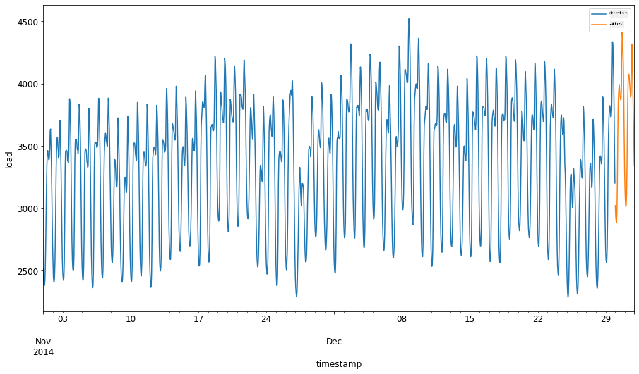
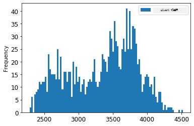

<!--
CO_OP_TRANSLATOR_METADATA:
{
  "original_hash": "917dbf890db71a322f306050cb284749",
  "translation_date": "2025-12-19T16:12:07+00:00",
  "source_file": "7-TimeSeries/2-ARIMA/README.md",
  "language_code": "kn"
}
-->
# ARIMA ಬಳಸಿ ಕಾಲ ಸರಣಿಯ ಭವಿಷ್ಯವಾಣಿ

ಹಿಂದಿನ ಪಾಠದಲ್ಲಿ, ನೀವು ಕಾಲ ಸರಣಿಯ ಭವಿಷ್ಯವಾಣಿ ಬಗ್ಗೆ ಸ್ವಲ್ಪ ತಿಳಿದುಕೊಂಡಿದ್ದೀರಿ ಮತ್ತು ಒಂದು ಡೇಟಾಸೆಟ್ ಅನ್ನು ಲೋಡ್ ಮಾಡಿದ್ದೀರಿ, ಅದು ಒಂದು ಕಾಲಾವಧಿಯಲ್ಲಿ ವಿದ್ಯುತ್ ಲೋಡ್‌ನ ಅಸ್ಥಿರತೆಯನ್ನು ತೋರಿಸುತ್ತದೆ.

[](https://youtu.be/IUSk-YDau10 "ARIMA ಗೆ ಪರಿಚಯ")

> 🎥 ಮೇಲಿನ ಚಿತ್ರವನ್ನು ಕ್ಲಿಕ್ ಮಾಡಿ ವೀಡಿಯೋ ನೋಡಿ: ARIMA ಮಾದರಿಗಳ ಸಂಕ್ಷಿಪ್ತ ಪರಿಚಯ. ಉದಾಹರಣೆ R ನಲ್ಲಿ ಮಾಡಲಾಗಿದೆ, ಆದರೆ ತತ್ವಗಳು ಸರ್ವತ್ರ ಅನ್ವಯವಾಗುತ್ತವೆ.

## [ಪೂರ್ವ-ಪಾಠ ಪ್ರಶ್ನೋತ್ತರ](https://ff-quizzes.netlify.app/en/ml/)

## ಪರಿಚಯ

ಈ ಪಾಠದಲ್ಲಿ, ನೀವು [ARIMA: *A*uto*R*egressive *I*ntegrated *M*oving *A*verage](https://wikipedia.org/wiki/Autoregressive_integrated_moving_average) ಬಳಸಿ ಮಾದರಿಗಳನ್ನು ನಿರ್ಮಿಸುವ ವಿಶೇಷ ವಿಧಾನವನ್ನು ಕಂಡುಹಿಡಿಯುತ್ತೀರಿ. ARIMA ಮಾದರಿಗಳು ವಿಶೇಷವಾಗಿ [ನಾನ್-ಸ್ಟೇಷನರಿ](https://wikipedia.org/wiki/Stationary_process) ಆಗಿರುವ ಡೇಟಾಗೆ ಹೊಂದಿಕೊಳ್ಳಲು ಸೂಕ್ತವಾಗಿವೆ.

## ಸಾಮಾನ್ಯ ತತ್ವಗಳು

ARIMA ಜೊತೆ ಕೆಲಸ ಮಾಡಲು, ನೀವು ತಿಳಿದುಕೊಳ್ಳಬೇಕಾದ ಕೆಲವು ತತ್ವಗಳಿವೆ:

- 🎓 **ಸ್ಟೇಷನರಿ**. ಸಾಂಖ್ಯಿಕ ದೃಷ್ಟಿಕೋನದಿಂದ, ಸ್ಟೇಷನರಿ ಎಂದರೆ ಕಾಲದಲ್ಲಿ ಸರಿದೂಗಿಸಿದಾಗ ಡೇಟಾದ ವಿತರಣೆಯು ಬದಲಾಗದಿರುವುದು. ನಾನ್-ಸ್ಟೇಷನರಿ ಡೇಟಾ ಎಂದರೆ, ವಿಶ್ಲೇಷಿಸಲು ಪರಿವರ್ತನೆ ಮಾಡಬೇಕಾದ ಪ್ರವೃತ್ತಿಗಳಿಂದ ಅಸ್ಥಿರತೆ ತೋರಿಸುತ್ತದೆ. ಉದಾಹರಣೆಗೆ, ಋತುವಿನ ಪ್ರಭಾವದಿಂದ ಡೇಟಾದಲ್ಲಿ ಅಸ್ಥಿರತೆ ಉಂಟಾಗಬಹುದು ಮತ್ತು ಅದನ್ನು 'seasonal-differencing' ಪ್ರಕ್ರಿಯೆಯಿಂದ ತೆಗೆದುಹಾಕಬಹುದು.

- 🎓 **[ಡಿಫರೆನ್ಸಿಂಗ್](https://wikipedia.org/wiki/Autoregressive_integrated_moving_average#Differencing)**. ಡಿಫರೆನ್ಸಿಂಗ್ ಎಂದರೆ, ನಾನ್-ಸ್ಟೇಷನರಿ ಡೇಟಾವನ್ನು ಅದರ ಅಸ್ಥಿರ ಪ್ರವೃತ್ತಿಯನ್ನು ತೆಗೆದುಹಾಕಿ ಸ್ಟೇಷನರಿ ಮಾಡಲು ಪರಿವರ್ತಿಸುವ ಪ್ರಕ್ರಿಯೆ. "ಡಿಫರೆನ್ಸಿಂಗ್ ಕಾಲ ಸರಣಿಯ ಮಟ್ಟದಲ್ಲಿ ಬದಲಾವಣೆಗಳನ್ನು ತೆಗೆದುಹಾಕುತ್ತದೆ, ಪ್ರವೃತ್ತಿ ಮತ್ತು ಋತುವಿನ ಅಸ್ಥಿರತೆಯನ್ನು ನಿವಾರಣೆ ಮಾಡುತ್ತದೆ ಮತ್ತು ಪರಿಣಾಮವಾಗಿ ಕಾಲ ಸರಣಿಯ ಸರಾಸರಿಯನ್ನು ಸ್ಥಿರಗೊಳಿಸುತ್ತದೆ." [ಶಿಕ್ಷಾಂಗ್ ಇತ್ಯಾದಿಗಳ ಪತ್ರಿಕೆ](https://arxiv.org/abs/1904.07632)

## ಕಾಲ ಸರಣಿಯ ಸನ್ನಿವೇಶದಲ್ಲಿ ARIMA

ARIMA ಭಾಗಗಳನ್ನು ವಿಶ್ಲೇಷಿಸಿ, ಅದು ಕಾಲ ಸರಣಿಯನ್ನು ಹೇಗೆ ಮಾದರಿಮಾಡಲು ಮತ್ತು ಭವಿಷ್ಯವಾಣಿ ಮಾಡಲು ಸಹಾಯ ಮಾಡುತ್ತದೆ ಎಂಬುದನ್ನು ತಿಳಿದುಕೊಳ್ಳೋಣ.

- **AR - AutoRegressive**. Autoregressive ಮಾದರಿಗಳು, ಹೆಸರಿನಂತೆ, ನಿಮ್ಮ ಡೇಟಾದ ಹಿಂದಿನ ಮೌಲ್ಯಗಳನ್ನು ವಿಶ್ಲೇಷಿಸಲು 'ಹಿಂದಕ್ಕೆ' ನೋಡುತ್ತವೆ ಮತ್ತು ಅವುಗಳ ಬಗ್ಗೆ ಊಹೆ ಮಾಡುತ್ತವೆ. ಈ ಹಿಂದಿನ ಮೌಲ್ಯಗಳನ್ನು 'ಲ್ಯಾಗ್'ಗಳು ಎಂದು ಕರೆಯುತ್ತಾರೆ. ಉದಾಹರಣೆಗೆ, ಪೆನ್ಸಿಲ್ ಮಾರಾಟದ ಮಾಸಿಕ ಡೇಟಾ. ಪ್ರತಿ ತಿಂಗಳ ಮಾರಾಟ ಮೊತ್ತವನ್ನು 'ವಿಕಸಿಸುತ್ತಿರುವ ಚರ' ಎಂದು ಪರಿಗಣಿಸಲಾಗುತ್ತದೆ. ಈ ಮಾದರಿ "ವಿಕಸಿಸುತ್ತಿರುವ ಚರವು ತನ್ನ ಸ್ವಂತ ಲ್ಯಾಗ್ (ಹಿಂದಿನ) ಮೌಲ್ಯಗಳ ಮೇಲೆ ರಿಗ್ರೆಶನ್ ಆಗುತ್ತದೆ." [ವಿಕಿಪೀಡಿಯ](https://wikipedia.org/wiki/Autoregressive_integrated_moving_average)

- **I - Integrated**. ARMA ಮಾದರಿಗಳಿಗಿಂತ ಭಿನ್ನವಾಗಿ, ARIMA ಯಲ್ಲಿರುವ 'I' ಅದರ *[ಒಕ್ಕೂಟ](https://wikipedia.org/wiki/Order_of_integration)* ಅಂಶವನ್ನು ಸೂಚಿಸುತ್ತದೆ. ಡಿಫರೆನ್ಸಿಂಗ್ ಹಂತಗಳನ್ನು ಅನ್ವಯಿಸುವ ಮೂಲಕ ಡೇಟಾ 'ಒಕ್ಕೂಟ' ಆಗುತ್ತದೆ ಮತ್ತು ನಾನ್-ಸ್ಟೇಷನರಿ ಅಸ್ಥಿರತೆಯನ್ನು ತೆಗೆದುಹಾಕುತ್ತದೆ.

- **MA - Moving Average**. ಈ ಮಾದರಿಯ [moving-average](https://wikipedia.org/wiki/Moving-average_model) ಅಂಶವು ಲ್ಯಾಗ್‌ಗಳ ಪ್ರಸ್ತುತ ಮತ್ತು ಹಿಂದಿನ ಮೌಲ್ಯಗಳನ್ನು ಗಮನಿಸಿ ನಿರ್ಧರಿಸಲಾದ ಔಟ್‌ಪುಟ್ ಚರವನ್ನು ಸೂಚಿಸುತ್ತದೆ.

ಮುಖ್ಯಾಂಶ: ARIMA ವಿಶೇಷ ರೀತಿಯ ಕಾಲ ಸರಣಿ ಡೇಟಾಗೆ ಅತ್ಯಂತ ಸಮೀಪವಾಗಿ ಹೊಂದಿಕೊಳ್ಳಲು ಬಳಸಲಾಗುತ್ತದೆ.

## ಅಭ್ಯಾಸ - ARIMA ಮಾದರಿ ನಿರ್ಮಿಸಿ

ಈ ಪಾಠದಲ್ಲಿ [_/working_](https://github.com/microsoft/ML-For-Beginners/tree/main/7-TimeSeries/2-ARIMA/working) ಫೋಲ್ಡರ್ ತೆರೆಯಿರಿ ಮತ್ತು [_notebook.ipynb_](https://github.com/microsoft/ML-For-Beginners/blob/main/7-TimeSeries/2-ARIMA/working/notebook.ipynb) ಫೈಲ್ ಅನ್ನು ಹುಡುಕಿ.

1. `statsmodels` ಪೈಥಾನ್ ಲೈಬ್ರರಿಯನ್ನು ಲೋಡ್ ಮಾಡಲು ನೋಟ್ಬುಕ್ ಅನ್ನು ರನ್ ಮಾಡಿ; ARIMA ಮಾದರಿಗಳಿಗೆ ಇದನ್ನು ನೀವು ಬಳಸುತ್ತೀರಿ.

1. ಅಗತ್ಯವಿರುವ ಲೈಬ್ರರಿಗಳನ್ನು ಲೋಡ್ ಮಾಡಿ

1. ಈಗ, ಡೇಟಾ ಪ್ಲಾಟ್ ಮಾಡಲು ಉಪಯುಕ್ತವಾದ ಇನ್ನಷ್ಟು ಲೈಬ್ರರಿಗಳನ್ನು ಲೋಡ್ ಮಾಡಿ:

    ```python
    import os
    import warnings
    import matplotlib.pyplot as plt
    import numpy as np
    import pandas as pd
    import datetime as dt
    import math

    from pandas.plotting import autocorrelation_plot
    from statsmodels.tsa.statespace.sarimax import SARIMAX
    from sklearn.preprocessing import MinMaxScaler
    from common.utils import load_data, mape
    from IPython.display import Image

    %matplotlib inline
    pd.options.display.float_format = '{:,.2f}'.format
    np.set_printoptions(precision=2)
    warnings.filterwarnings("ignore") # ಎಚ್ಚರಿಕೆ ಸಂದೇಶಗಳನ್ನು ನಿರ್ಲಕ್ಷಿಸಲು ಸೂಚಿಸಿ
    ```

1. `/data/energy.csv` ಫೈಲ್‌ನಿಂದ ಡೇಟಾವನ್ನು ಪಾಂಡಾಸ್ ಡೇಟಾಫ್ರೇಮ್‌ಗೆ ಲೋಡ್ ಮಾಡಿ ಮತ್ತು ನೋಡಿ:

    ```python
    energy = load_data('./data')[['load']]
    energy.head(10)
    ```

1. ಜನವರಿ 2012 ರಿಂದ ಡಿಸೆಂಬರ್ 2014 ರವರೆಗೆ ಲಭ್ಯವಿರುವ ಎಲ್ಲಾ ಎನರ್ಜಿ ಡೇಟಾವನ್ನು ಪ್ಲಾಟ್ ಮಾಡಿ. ಹಿಂದಿನ ಪಾಠದಲ್ಲಿ ನಾವು ಈ ಡೇಟಾವನ್ನು ನೋಡಿದ್ದೇವೆ, ಆದ್ದರಿಂದ ಯಾವುದೇ ಆಶ್ಚರ್ಯವಿಲ್ಲ:

    ```python
    energy.plot(y='load', subplots=True, figsize=(15, 8), fontsize=12)
    plt.xlabel('timestamp', fontsize=12)
    plt.ylabel('load', fontsize=12)
    plt.show()
    ```

    ಈಗ, ಮಾದರಿಯನ್ನು ನಿರ್ಮಿಸೋಣ!

### ತರಬೇತಿ ಮತ್ತು ಪರೀಕ್ಷಾ ಡೇಟಾಸೆಟ್‌ಗಳನ್ನು ರಚಿಸಿ

ನಿಮ್ಮ ಡೇಟಾ ಲೋಡ್ ಆದ ಮೇಲೆ, ಅದನ್ನು ತರಬೇತಿ ಮತ್ತು ಪರೀಕ್ಷಾ ಸೆಟ್‌ಗಳಾಗಿ ವಿಭಜಿಸಬಹುದು. ನೀವು ನಿಮ್ಮ ಮಾದರಿಯನ್ನು ತರಬೇತಿ ಸೆಟ್‌ನಲ್ಲಿ ತರಬೇತಿಮಾಡುತ್ತೀರಿ. ಸಾಮಾನ್ಯವಾಗಿ, ಮಾದರಿ ತರಬೇತಿ ಮುಗಿದ ನಂತರ, ನೀವು ಅದರ ನಿಖರತೆಯನ್ನು ಪರೀಕ್ಷಾ ಸೆಟ್ ಬಳಸಿ ಮೌಲ್ಯಮಾಪನ ಮಾಡುತ್ತೀರಿ. ಪರೀಕ್ಷಾ ಸೆಟ್ ತರಬೇತಿ ಸೆಟ್‌ನ ನಂತರದ ಕಾಲಾವಧಿಯನ್ನು ಒಳಗೊಂಡಿರಬೇಕು, ಇದರಿಂದ ಮಾದರಿ ಭವಿಷ್ಯದ ಕಾಲಾವಧಿಗಳಿಂದ ಮಾಹಿತಿ ಪಡೆಯುವುದಿಲ್ಲ.

1. 2014 ಸೆಪ್ಟೆಂಬರ್ 1 ರಿಂದ ಅಕ್ಟೋಬರ್ 31 ರವರೆಗೆ ಎರಡು ತಿಂಗಳ ಅವಧಿಯನ್ನು ತರಬೇತಿ ಸೆಟ್‌ಗೆ ಮೀಸಲಿಡಿ. ಪರೀಕ್ಷಾ ಸೆಟ್ 2014 ನವೆಂಬರ್ 1 ರಿಂದ ಡಿಸೆಂಬರ್ 31 ರವರೆಗೆ ಎರಡು ತಿಂಗಳ ಅವಧಿಯನ್ನು ಒಳಗೊಂಡಿರುತ್ತದೆ:

    ```python
    train_start_dt = '2014-11-01 00:00:00'
    test_start_dt = '2014-12-30 00:00:00'
    ```

    ಈ ಡೇಟಾ ದೈನಂದಿನ ಎನರ್ಜಿ ಬಳಕೆಯನ್ನು ಪ್ರತಿಬಿಂಬಿಸುವುದರಿಂದ, ಬಲವಾದ ಋತುವಿನ ಮಾದರಿಯಿದೆ, ಆದರೆ ಬಳಕೆ ಇತ್ತೀಚಿನ ದಿನಗಳ ಬಳಕೆಗೆ ಹೆಚ್ಚು ಸಮಾನವಾಗಿದೆ.

1. ವ್ಯತ್ಯಾಸಗಳನ್ನು ದೃಶ್ಯೀಕರಿಸಿ:

    ```python
    energy[(energy.index < test_start_dt) & (energy.index >= train_start_dt)][['load']].rename(columns={'load':'train'}) \
        .join(energy[test_start_dt:][['load']].rename(columns={'load':'test'}), how='outer') \
        .plot(y=['train', 'test'], figsize=(15, 8), fontsize=12)
    plt.xlabel('timestamp', fontsize=12)
    plt.ylabel('load', fontsize=12)
    plt.show()
    ```

    

    ಆದ್ದರಿಂದ, ಡೇಟಾವನ್ನು ತರಬೇತಿಗೆ ಸಾಪೇಕ್ಷವಾಗಿ ಸಣ್ಣ ಕಾಲಾವಧಿ ವಿಂಡೋ ಬಳಸುವುದು ಸಾಕಾಗುತ್ತದೆ.

    > ಟಿಪ್ಪಣಿ: ARIMA ಮಾದರಿಯನ್ನು ಹೊಂದಿಸಲು ನಾವು ಬಳಸುವ ಫಂಕ್ಷನ್ ಫಿಟಿಂಗ್ ಸಮಯದಲ್ಲಿ ಇನ್-ಸ್ಯಾಂಪಲ್ ಮಾನ್ಯತೆ ಬಳಸುತ್ತದೆ, ಆದ್ದರಿಂದ ನಾವು ಮಾನ್ಯತೆ ಡೇಟಾವನ್ನು ಹೊರತುಪಡಿಸುತ್ತೇವೆ.

### ತರಬೇತಿಗೆ ಡೇಟಾವನ್ನು ಸಿದ್ಧಪಡಿಸಿ

ಈಗ, ನಿಮ್ಮ ಡೇಟಾವನ್ನು ಫಿಲ್ಟರಿಂಗ್ ಮತ್ತು ಸ್ಕೇಲಿಂಗ್ ಮೂಲಕ ತರಬೇತಿಗೆ ಸಿದ್ಧಪಡಿಸಬೇಕು. ನೀವು ಬೇಕಾದ ಕಾಲಾವಧಿಗಳು ಮತ್ತು ಕಾಲಮ್‌ಗಳನ್ನು ಮಾತ್ರ ಒಳಗೊಂಡಂತೆ ಡೇಟಾಸೆಟ್ ಅನ್ನು ಫಿಲ್ಟರ್ ಮಾಡಿ, ಮತ್ತು ಡೇಟಾವನ್ನು 0,1 ನಡುವಿನ ಅಂತರಾಳದಲ್ಲಿ ಪ್ರಕ್ಷೇಪಿಸಲು ಸ್ಕೇಲ್ ಮಾಡಿ.

1. ಮೂಲ ಡೇಟಾಸೆಟ್ ಅನ್ನು ಮೇಲ್ಕಂಡ ಕಾಲಾವಧಿಗಳ ಪ್ರಕಾರ ಮತ್ತು 'load' ಮತ್ತು ದಿನಾಂಕ ಕಾಲಮ್‌ಗಳನ್ನು ಮಾತ್ರ ಒಳಗೊಂಡಂತೆ ಫಿಲ್ಟರ್ ಮಾಡಿ:

    ```python
    train = energy.copy()[(energy.index >= train_start_dt) & (energy.index < test_start_dt)][['load']]
    test = energy.copy()[energy.index >= test_start_dt][['load']]

    print('Training data shape: ', train.shape)
    print('Test data shape: ', test.shape)
    ```

    ಡೇಟಾದ ಆಕಾರವನ್ನು ನೋಡಬಹುದು:

    ```output
    Training data shape:  (1416, 1)
    Test data shape:  (48, 1)
    ```

1. ಡೇಟಾವನ್ನು (0, 1) ವ್ಯಾಪ್ತಿಯಲ್ಲಿ ಸ್ಕೇಲ್ ಮಾಡಿ.

    ```python
    scaler = MinMaxScaler()
    train['load'] = scaler.fit_transform(train)
    train.head(10)
    ```

1. ಮೂಲ ಮತ್ತು ಸ್ಕೇಲ್ಡ್ ಡೇಟಾವನ್ನು ದೃಶ್ಯೀಕರಿಸಿ:

    ```python
    energy[(energy.index >= train_start_dt) & (energy.index < test_start_dt)][['load']].rename(columns={'load':'original load'}).plot.hist(bins=100, fontsize=12)
    train.rename(columns={'load':'scaled load'}).plot.hist(bins=100, fontsize=12)
    plt.show()
    ```

    

    > ಮೂಲ ಡೇಟಾ

    

    > ಸ್ಕೇಲ್ಡ್ ಡೇಟಾ

1. ಈಗ ನೀವು ಸ್ಕೇಲ್ಡ್ ಡೇಟಾವನ್ನು ಕ್ಯಾಲಿಬ್ರೇಟ್ ಮಾಡಿದ್ದೀರಿ, ಪರೀಕ್ಷಾ ಡೇಟಾವನ್ನು ಸ್ಕೇಲ್ ಮಾಡಬಹುದು:

    ```python
    test['load'] = scaler.transform(test)
    test.head()
    ```

### ARIMA ಅನ್ನು ಅನುಷ್ಠಾನಗೊಳಿಸಿ

ARIMA ಅನ್ನು ಅನುಷ್ಠಾನಗೊಳಿಸುವ ಸಮಯ ಬಂದಿದೆ! ನೀವು ಈಗ ಮೊದಲು ಇನ್‌ಸ್ಟಾಲ್ ಮಾಡಿದ `statsmodels` ಲೈಬ್ರರಿಯನ್ನು ಬಳಸುತ್ತೀರಿ.

ಈಗ ನೀವು ಕೆಲವು ಹಂತಗಳನ್ನು ಅನುಸರಿಸಬೇಕು

   1. `SARIMAX()` ಅನ್ನು ಕರೆ ಮಾಡಿ ಮತ್ತು ಮಾದರಿ ಪ್ಯಾರಾಮೀಟರ್‌ಗಳು p, d, q ಮತ್ತು P, D, Q ಪ್ಯಾರಾಮೀಟರ್‌ಗಳನ್ನು ಪಾಸ್ ಮಾಡಿ.
   2. ತರಬೇತಿ ಡೇಟಾ ಮೇಲೆ ಮಾದರಿಯನ್ನು ಸಿದ್ಧಪಡಿಸಲು fit() ಫಂಕ್ಷನ್ ಅನ್ನು ಕರೆ ಮಾಡಿ.
   3. `forecast()` ಫಂಕ್ಷನ್ ಅನ್ನು ಕರೆ ಮಾಡಿ ಮತ್ತು ಭವಿಷ್ಯವಾಣಿ ಮಾಡಲು ಹಂತಗಳ ಸಂಖ್ಯೆ (ಹೋರೈಜನ್) ಅನ್ನು ಸೂಚಿಸಿ.

> 🎓 ಈ ಎಲ್ಲಾ ಪ್ಯಾರಾಮೀಟರ್‌ಗಳು ಏಕೆ? ARIMA ಮಾದರಿಯಲ್ಲಿ ಮೂರು ಪ್ಯಾರಾಮೀಟರ್‌ಗಳಿವೆ, ಅವು ಕಾಲ ಸರಣಿಯ ಪ್ರಮುಖ ಅಂಶಗಳನ್ನು ಮಾದರಿಮಾಡಲು ಸಹಾಯ ಮಾಡುತ್ತವೆ: ಋತುವಿನ ಪ್ರಭಾವ, ಪ್ರವೃತ್ತಿ ಮತ್ತು ಶಬ್ದ. ಈ ಪ್ಯಾರಾಮೀಟರ್‌ಗಳು:

`p`: ಮಾದರಿಯ ಸ್ವಯಂ-ಪ್ರತಿಗಾಮಿ ಅಂಶಕ್ಕೆ ಸಂಬಂಧಿಸಿದ ಪ್ಯಾರಾಮೀಟರ್, ಇದು *ಹಿಂದಿನ* ಮೌಲ್ಯಗಳನ್ನು ಒಳಗೊಂಡಿದೆ.
`d`: ಮಾದರಿಯ ಒಕ್ಕೂಟ ಭಾಗಕ್ಕೆ ಸಂಬಂಧಿಸಿದ ಪ್ಯಾರಾಮೀಟರ್, ಇದು ಕಾಲ ಸರಣಿಗೆ ಅನ್ವಯಿಸುವ *ಡಿಫರೆನ್ಸಿಂಗ್* (🎓 ಡಿಫರೆನ್ಸಿಂಗ್ ನೆನಪಿಸಿಕೊಳ್ಳಿ 👆) ಪ್ರಮಾಣವನ್ನು ಪ್ರಭಾವಿಸುತ್ತದೆ.
`q`: ಮಾದರಿಯ ಚಲಿಸುವ ಸರಾಸರಿ ಭಾಗಕ್ಕೆ ಸಂಬಂಧಿಸಿದ ಪ್ಯಾರಾಮೀಟರ್.

> ಟಿಪ್ಪಣಿ: ನಿಮ್ಮ ಡೇಟಾದಲ್ಲಿ ಋತುವಿನ ಅಂಶವಿದ್ದರೆ - ಇದರಲ್ಲಿ ಇದೆ - ನಾವು ಋತುವಿನ ARIMA ಮಾದರಿಯನ್ನು (SARIMA) ಬಳಸುತ್ತೇವೆ. ಆ ಸಂದರ್ಭದಲ್ಲಿ ನೀವು ಇನ್ನೊಂದು ಪ್ಯಾರಾಮೀಟರ್ ಸೆಟ್ ಅನ್ನು ಬಳಸಬೇಕು: `P`, `D`, ಮತ್ತು `Q` , ಅವು `p`, `d`, ಮತ್ತು `q` ನಂತೆ ಸಂಬಂಧಿಸಿದವು, ಆದರೆ ಮಾದರಿಯ ಋತುವಿನ ಅಂಶಗಳಿಗೆ ಸಂಬಂಧಿಸಿದವು.

1. ನಿಮ್ಮ ಇಚ್ಛಿತ ಹೋರೈಜನ್ ಮೌಲ್ಯವನ್ನು ಹೊಂದಿಸಿ. 3 ಗಂಟೆಗಳ ಪ್ರಯತ್ನ ಮಾಡೋಣ:

    ```python
    # ಮುಂದಿನ ಭವಿಷ್ಯವಾಣಿ ಮಾಡಲು ಹೆಜ್ಜೆಗಳ ಸಂಖ್ಯೆಯನ್ನು ನಿರ್ದಿಷ್ಟಪಡಿಸಿ
    HORIZON = 3
    print('Forecasting horizon:', HORIZON, 'hours')
    ```

    ARIMA ಮಾದರಿಯ ಪ್ಯಾರಾಮೀಟರ್‌ಗಳ ಉತ್ತಮ ಮೌಲ್ಯಗಳನ್ನು ಆಯ್ಕೆ ಮಾಡುವುದು ಸವಾಲಿನಾಯಕವಾಗಬಹುದು ಏಕೆಂದರೆ ಇದು ಸ್ವಲ್ಪ ವಿಷಯಾತ್ಮಕ ಮತ್ತು ಸಮಯ ತೆಗೆದುಕೊಳ್ಳುತ್ತದೆ. ನೀವು [`pyramid` ಲೈಬ್ರರಿಯಿಂದ](https://alkaline-ml.com/pmdarima/0.9.0/modules/generated/pyramid.arima.auto_arima.html) `auto_arima()` ಫಂಕ್ಷನ್ ಬಳಸುವುದನ್ನು ಪರಿಗಣಿಸಬಹುದು.

1. ಈಗಾಗಲೇ ಕೆಲವು ಕೈಯಿಂದ ಆಯ್ಕೆಗಳನ್ನು ಪ್ರಯತ್ನಿಸಿ ಉತ್ತಮ ಮಾದರಿಯನ್ನು ಹುಡುಕಿ.

    ```python
    order = (4, 1, 0)
    seasonal_order = (1, 1, 0, 24)

    model = SARIMAX(endog=train, order=order, seasonal_order=seasonal_order)
    results = model.fit()

    print(results.summary())
    ```

    ಫಲಿತಾಂಶಗಳ ಟೇಬಲ್ ಮುದ್ರಿತವಾಗುತ್ತದೆ.

ನೀವು ನಿಮ್ಮ ಮೊದಲ ಮಾದರಿಯನ್ನು ನಿರ್ಮಿಸಿದ್ದೀರಿ! ಈಗ ಅದನ್ನು ಮೌಲ್ಯಮಾಪನ ಮಾಡುವ ಮಾರ್ಗವನ್ನು ಕಂಡುಹಿಡಿಯಬೇಕು.

### ನಿಮ್ಮ ಮಾದರಿಯನ್ನು ಮೌಲ್ಯಮಾಪನ ಮಾಡಿ

ನಿಮ್ಮ ಮಾದರಿಯನ್ನು ಮೌಲ್ಯಮಾಪನ ಮಾಡಲು, ನೀವು 'walk forward' ಮಾನ್ಯತೆ ಎಂದು ಕರೆಯುವ ವಿಧಾನವನ್ನು ಅನುಸರಿಸಬಹುದು. ಪ್ರಾಯೋಗಿಕವಾಗಿ, ಕಾಲ ಸರಣಿ ಮಾದರಿಗಳನ್ನು ಪ್ರತಿ ಹೊಸ ಡೇಟಾ ಲಭ್ಯವಾಗುವಾಗ ಮರುತರಬೇತಿಮಾಡಲಾಗುತ್ತದೆ. ಇದರಿಂದ ಮಾದರಿ ಪ್ರತಿ ಕಾಲ ಹಂತದಲ್ಲಿ ಉತ್ತಮ ಭವಿಷ್ಯವಾಣಿ ಮಾಡಬಹುದು.

ಕಾಲ ಸರಣಿಯ ಆರಂಭದಿಂದ ಈ ತಂತ್ರವನ್ನು ಬಳಸಿ, ತರಬೇತಿ ಡೇಟಾ ಸೆಟ್‌ನಲ್ಲಿ ಮಾದರಿಯನ್ನು ತರಬೇತಿಮಾಡಿ. ನಂತರ ಮುಂದಿನ ಕಾಲ ಹಂತದ ಭವಿಷ್ಯವಾಣಿ ಮಾಡಿ. ಭವಿಷ್ಯವಾಣಿ ತಿಳಿದಿರುವ ಮೌಲ್ಯಕ್ಕೆ ವಿರುದ್ಧವಾಗಿ ಮೌಲ್ಯಮಾಪನ ಮಾಡಲಾಗುತ್ತದೆ. ನಂತರ ತರಬೇತಿ ಸೆಟ್ ಅನ್ನು ತಿಳಿದಿರುವ ಮೌಲ್ಯವನ್ನು ಸೇರಿಸಿ ವಿಸ್ತರಿಸಲಾಗುತ್ತದೆ ಮತ್ತು ಪ್ರಕ್ರಿಯೆಯನ್ನು ಪುನರಾವರ್ತಿಸಲಾಗುತ್ತದೆ.

> ಟಿಪ್ಪಣಿ: ನೀವು ತರಬೇತಿ ಸೆಟ್ ವಿಂಡೋವನ್ನು ಸ್ಥಿರವಾಗಿರಿಸಬೇಕು, ಇದರಿಂದ ಪ್ರತಿ ಬಾರಿ ಹೊಸ ವೀಕ್ಷಣೆಯನ್ನು ಸೇರಿಸುವಾಗ, ಆರಂಭದ ವೀಕ್ಷಣೆಯನ್ನು ತೆಗೆದುಹಾಕಬಹುದು ಮತ್ತು ತರಬೇತಿ ಹೆಚ್ಚು ಪರಿಣಾಮಕಾರಿಯಾಗುತ್ತದೆ.

ಈ ಪ್ರಕ್ರಿಯೆ ಮಾದರಿ ಪ್ರಾಯೋಗಿಕವಾಗಿ ಹೇಗೆ ಕಾರ್ಯನಿರ್ವಹಿಸುತ್ತದೆ ಎಂಬುದರ ಹೆಚ್ಚು ದೃಢವಾದ ಅಂದಾಜನ್ನು ನೀಡುತ್ತದೆ. ಆದರೆ, ಇದರಿಂದ ಅನೇಕ ಮಾದರಿಗಳನ್ನು ರಚಿಸುವ ಗಣನೆ ವೆಚ್ಚ ಬರುತ್ತದೆ. ಡೇಟಾ ಸಣ್ಣದಾಗಿದ್ದರೆ ಅಥವಾ ಮಾದರಿ ಸರಳವಾಗಿದ್ದರೆ ಇದು ಸ್ವೀಕಾರಾರ್ಹ, ಆದರೆ ದೊಡ್ಡ ಪ್ರಮಾಣದಲ್ಲಿ ಸಮಸ್ಯೆಯಾಗಬಹುದು.

Walk-forward ಮಾನ್ಯತೆ ಕಾಲ ಸರಣಿ ಮಾದರಿಯ ಮೌಲ್ಯಮಾಪನದ ಚಿನ್ನದ ಮಾನದಂಡವಾಗಿದೆ ಮತ್ತು ನಿಮ್ಮ ಸ್ವಂತ ಯೋಜನೆಗಳಿಗೆ ಶಿಫಾರಸು ಮಾಡಲಾಗಿದೆ.

1. ಪ್ರತಿ HORIZON ಹಂತಕ್ಕೆ ಪರೀಕ್ಷಾ ಡೇಟಾ ಪಾಯಿಂಟ್ ರಚಿಸಿ.

    ```python
    test_shifted = test.copy()

    for t in range(1, HORIZON+1):
        test_shifted['load+'+str(t)] = test_shifted['load'].shift(-t, freq='H')

    test_shifted = test_shifted.dropna(how='any')
    test_shifted.head(5)
    ```

    |            |          | load | load+1 | load+2 |
    | ---------- | -------- | ---- | ------ | ------ |
    | 2014-12-30 | 00:00:00 | 0.33 | 0.29   | 0.27   |
    | 2014-12-30 | 01:00:00 | 0.29 | 0.27   | 0.27   |
    | 2014-12-30 | 02:00:00 | 0.27 | 0.27   | 0.30   |
    | 2014-12-30 | 03:00:00 | 0.27 | 0.30   | 0.41   |
    | 2014-12-30 | 04:00:00 | 0.30 | 0.41   | 0.57   |

    ಡೇಟಾ ಅದರ ಹೋರೈಜನ್ ಪಾಯಿಂಟ್ ಪ್ರಕಾರ ಅಡ್ಡವಾಗಿ ಸರಿಸಲಾಗಿದೆ.

1. ಈ ಸ್ಲೈಡಿಂಗ್ ವಿಂಡೋ ವಿಧಾನವನ್ನು ಬಳಸಿ ಪರೀಕ್ಷಾ ಡೇಟಾದ ಉದ್ದದ ಲೂಪ್‌ನಲ್ಲಿ ಭವಿಷ್ಯವಾಣಿ ಮಾಡಿ:

    ```python
    %%time
    training_window = 720 # ತರಬೇತಿಗೆ 30 ದಿನಗಳು (720 ಗಂಟೆಗಳು) ಮೀಸಲಿಡಿ

    train_ts = train['load']
    test_ts = test_shifted

    history = [x for x in train_ts]
    history = history[(-training_window):]

    predictions = list()

    order = (2, 1, 0)
    seasonal_order = (1, 1, 0, 24)

    for t in range(test_ts.shape[0]):
        model = SARIMAX(endog=history, order=order, seasonal_order=seasonal_order)
        model_fit = model.fit()
        yhat = model_fit.forecast(steps = HORIZON)
        predictions.append(yhat)
        obs = list(test_ts.iloc[t])
        # ತರಬೇತಿ ವಿಂಡೋವನ್ನು ಸರಿಸಿ
        history.append(obs[0])
        history.pop(0)
        print(test_ts.index[t])
        print(t+1, ': predicted =', yhat, 'expected =', obs)
    ```

    ತರಬೇತಿ ನಡೆಯುತ್ತಿರುವುದನ್ನು ನೀವು ನೋಡಬಹುದು:

    ```output
    2014-12-30 00:00:00
    1 : predicted = [0.32 0.29 0.28] expected = [0.32945389435989236, 0.2900626678603402, 0.2739480752014323]

    2014-12-30 01:00:00
    2 : predicted = [0.3  0.29 0.3 ] expected = [0.2900626678603402, 0.2739480752014323, 0.26812891674127126]

    2014-12-30 02:00:00
    3 : predicted = [0.27 0.28 0.32] expected = [0.2739480752014323, 0.26812891674127126, 0.3025962399283795]
    ```

1. ಭವಿಷ್ಯವಾಣಿಗಳನ್ನು ನಿಜವಾದ ಲೋಡ್ ಜೊತೆಗೆ ಹೋಲಿಸಿ:

    ```python
    eval_df = pd.DataFrame(predictions, columns=['t+'+str(t) for t in range(1, HORIZON+1)])
    eval_df['timestamp'] = test.index[0:len(test.index)-HORIZON+1]
    eval_df = pd.melt(eval_df, id_vars='timestamp', value_name='prediction', var_name='h')
    eval_df['actual'] = np.array(np.transpose(test_ts)).ravel()
    eval_df[['prediction', 'actual']] = scaler.inverse_transform(eval_df[['prediction', 'actual']])
    eval_df.head()
    ```

    ಔಟ್‌ಪುಟ್
    |     |            | timestamp | h   | prediction | actual   |
    | --- | ---------- | --------- | --- | ---------- | -------- |
    | 0   | 2014-12-30 | 00:00:00  | t+1 | 3,008.74   | 3,023.00 |
    | 1   | 2014-12-30 | 01:00:00  | t+1 | 2,955.53   | 2,935.00 |
    | 2   | 2014-12-30 | 02:00:00  | t+1 | 2,900.17   | 2,899.00 |
    | 3   | 2014-12-30 | 03:00:00  | t+1 | 2,917.69   | 2,886.00 |
    | 4   | 2014-12-30 | 04:00:00  | t+1 | 2,946.99   | 2,963.00 |

    ಗಂಟೆಗಟ್ಟಲೆ ಡೇಟಾದ ಭವಿಷ್ಯವಾಣಿ ಮತ್ತು ನಿಜವಾದ ಲೋಡ್ ಅನ್ನು ಗಮನಿಸಿ. ಇದು ಎಷ್ಟು ನಿಖರವಾಗಿದೆ?

### ಮಾದರಿಯ ನಿಖರತೆಯನ್ನು ಪರಿಶೀಲಿಸಿ

ನಿಮ್ಮ ಮಾದರಿಯ ನಿಖರತೆಯನ್ನು ಎಲ್ಲಾ ಭವಿಷ್ಯವಾಣಿಗಳ ಮೇಲೆ ಸರಾಸರಿ ಶೇಕಡಾವಾರು ದೋಷ (MAPE) ಪರೀಕ್ಷಿಸುವ ಮೂಲಕ ಪರಿಶೀಲಿಸಿ.

> **🧮 ಗಣಿತವನ್ನು ತೋರಿಸಿ**
>
> 
>
>  [MAPE](https://www.linkedin.com/pulse/what-mape-mad-msd-time-series-allameh-statistics/) ಅನ್ನು ಮೇಲಿನ ಸೂತ್ರದಿಂದ ವ್ಯಾಖ್ಯಾನಿಸಲಾದ ಅನುಪಾತವಾಗಿ ಭವಿಷ್ಯವಾಣಿ ನಿಖರತೆಯನ್ನು ತೋರಿಸಲು ಬಳಸಲಾಗುತ್ತದೆ. actual<sub>t</sub> ಮತ್ತು predicted<sub>t</sub> ನಡುವಿನ ವ್ಯತ್ಯಾಸವನ್ನು actual<sub>t</sub> ಮೂಲಕ ಭಾಗಿಸಲಾಗುತ್ತದೆ. "ಈ ಲೆಕ್ಕಾಚಾರದಲ್ಲಿ ಪರಮ ಮೌಲ್ಯವನ್ನು ಪ್ರತಿ ಭವಿಷ್ಯವಾಣಿ ಸಮಯದ ಬಿಂದುವಿಗೆ ಸೇರಿಸಲಾಗುತ್ತದೆ ಮತ್ತು ಹೊಂದಿಸಿದ ಬಿಂದುಗಳ ಸಂಖ್ಯೆ n ಮೂಲಕ ಭಾಗಿಸಲಾಗುತ್ತದೆ." [wikipedia](https://wikipedia.org/wiki/Mean_absolute_percentage_error)

1. ಸಮೀಕರಣವನ್ನು ಕೋಡ್‌ನಲ್ಲಿ ವ್ಯಕ್ತಪಡಿಸಿ:

    ```python
    if(HORIZON > 1):
        eval_df['APE'] = (eval_df['prediction'] - eval_df['actual']).abs() / eval_df['actual']
        print(eval_df.groupby('h')['APE'].mean())
    ```

1. ಒಂದು ಹಂತದ MAPE ಅನ್ನು ಲೆಕ್ಕಹಾಕಿ:

    ```python
    print('One step forecast MAPE: ', (mape(eval_df[eval_df['h'] == 't+1']['prediction'], eval_df[eval_df['h'] == 't+1']['actual']))*100, '%')
    ```

    ಒಂದು ಹಂತದ ಭವಿಷ್ಯವಾಣಿ MAPE:  0.5570581332313952 %

1. ಬಹು ಹಂತದ ಭವಿಷ್ಯವಾಣಿ MAPE ಅನ್ನು ಮುದ್ರಿಸಿ:

    ```python
    print('Multi-step forecast MAPE: ', mape(eval_df['prediction'], eval_df['actual'])*100, '%')
    ```

    ```output
    Multi-step forecast MAPE:  1.1460048657704118 %
    ```

    ಒಳ್ಳೆಯ ಕಡಿಮೆ ಸಂಖ್ಯೆ ಉತ್ತಮ: MAPE 10 ಇರುವ ಭವಿಷ್ಯವಾಣಿ 10% ತಪ್ಪಿದೆ ಎಂದು ಪರಿಗಣಿಸಿ.

1. ಆದರೆ ಯಾವಾಗಲೂ ಹಾಗೆಯೇ, ಈ ರೀತಿಯ ನಿಖರತೆ ಅಳೆಯುವಿಕೆಯನ್ನು ದೃಶ್ಯವಾಗಿ ನೋಡುವುದು ಸುಲಭ, ಆದ್ದರಿಂದ ಅದನ್ನು ರೇಖಾಚಿತ್ರಗೊಳಿಸೋಣ:

    ```python
     if(HORIZON == 1):
        ## ಏಕ ಹಂತದ ಭವಿಷ್ಯವಾಣಿ ರೇಖಾಚಿತ್ರಣ
        eval_df.plot(x='timestamp', y=['actual', 'prediction'], style=['r', 'b'], figsize=(15, 8))

    else:
        ## ಬಹು ಹಂತದ ಭವಿಷ್ಯವಾಣಿ ರೇಖಾಚಿತ್ರಣ
        plot_df = eval_df[(eval_df.h=='t+1')][['timestamp', 'actual']]
        for t in range(1, HORIZON+1):
            plot_df['t+'+str(t)] = eval_df[(eval_df.h=='t+'+str(t))]['prediction'].values

        fig = plt.figure(figsize=(15, 8))
        ax = plt.plot(plot_df['timestamp'], plot_df['actual'], color='red', linewidth=4.0)
        ax = fig.add_subplot(111)
        for t in range(1, HORIZON+1):
            x = plot_df['timestamp'][(t-1):]
            y = plot_df['t+'+str(t)][0:len(x)]
            ax.plot(x, y, color='blue', linewidth=4*math.pow(.9,t), alpha=math.pow(0.8,t))

        ax.legend(loc='best')

    plt.xlabel('timestamp', fontsize=12)
    plt.ylabel('load', fontsize=12)
    plt.show()
    ```

    

🏆 ಅತ್ಯುತ್ತಮ ನಿಖರತೆಯೊಂದಿಗೆ ಮಾದರಿಯನ್ನು ತೋರಿಸುವ ಅತ್ಯಂತ ಚೆನ್ನಾದ ರೇಖಾಚಿತ್ರ. ಶುಭಾಶಯಗಳು!

---

## 🚀ಸವಾಲು

ಟೈಮ್ ಸೀರಿಸ್ ಮಾದರಿಯ ನಿಖರತೆಯನ್ನು ಪರೀಕ್ಷಿಸುವ ವಿಧಾನಗಳನ್ನು ಆಳವಾಗಿ ಅಧ್ಯಯನ ಮಾಡಿ. ಈ ಪಾಠದಲ್ಲಿ ನಾವು MAPE ಬಗ್ಗೆ ಸ್ಪರ್ಶಿಸಿದ್ದೇವೆ, ಆದರೆ ನೀವು ಬಳಸಬಹುದಾದ ಇತರ ವಿಧಾನಗಳಿವೆಯೇ? ಅವುಗಳನ್ನು ಸಂಶೋಧಿಸಿ ಮತ್ತು ಟಿಪ್ಪಣಿಗಳನ್ನು ಸೇರಿಸಿ. ಸಹಾಯಕ ದಾಖಲೆ [ಇಲ್ಲಿ](https://otexts.com/fpp2/accuracy.html) ಲಭ್ಯವಿದೆ

## [ಪಾಠೋತ್ತರ ಪ್ರಶ್ನೋತ್ತರ](https://ff-quizzes.netlify.app/en/ml/)

## ವಿಮರ್ಶೆ ಮತ್ತು ಸ್ವಯಂ ಅಧ್ಯಯನ

ಈ ಪಾಠವು ARIMA ಬಳಸಿ ಟೈಮ್ ಸೀರಿಸ್ ಭವಿಷ್ಯವಾಣಿಯ ಮೂಲಭೂತಗಳನ್ನು ಮಾತ್ರ ಸ್ಪರ್ಶಿಸುತ್ತದೆ. [ಈ ಸಂಗ್ರಹಾಲಯ](https://microsoft.github.io/forecasting/) ಮತ್ತು ಅದರ ವಿವಿಧ ಮಾದರಿ ಪ್ರಕಾರಗಳನ್ನು ಆಳವಾಗಿ ಅಧ್ಯಯನ ಮಾಡಿ ಟೈಮ್ ಸೀರಿಸ್ ಮಾದರಿಗಳನ್ನು ನಿರ್ಮಿಸುವ ಇತರ ವಿಧಾನಗಳನ್ನು ತಿಳಿದುಕೊಳ್ಳಲು ಸಮಯ ತೆಗೆದುಕೊಳ್ಳಿ.

## ನಿಯೋಜನೆ

[ಹೊಸ ARIMA ಮಾದರಿ](assignment.md)

---

<!-- CO-OP TRANSLATOR DISCLAIMER START -->
**ಅಸ್ವೀಕರಣ**:  
ಈ ದಸ್ತಾವೇಜು AI ಅನುವಾದ ಸೇವೆ [Co-op Translator](https://github.com/Azure/co-op-translator) ಬಳಸಿ ಅನುವಾದಿಸಲಾಗಿದೆ. ನಾವು ನಿಖರತೆಯಿಗಾಗಿ ಪ್ರಯತ್ನಿಸುತ್ತಿದ್ದರೂ, ಸ್ವಯಂಚಾಲಿತ ಅನುವಾದಗಳಲ್ಲಿ ದೋಷಗಳು ಅಥವಾ ಅಸತ್ಯತೆಗಳು ಇರಬಹುದು ಎಂದು ದಯವಿಟ್ಟು ಗಮನಿಸಿ. ಮೂಲ ಭಾಷೆಯಲ್ಲಿರುವ ಮೂಲ ದಸ್ತಾವೇಜನ್ನು ಅಧಿಕೃತ ಮೂಲವಾಗಿ ಪರಿಗಣಿಸಬೇಕು. ಮಹತ್ವದ ಮಾಹಿತಿಗಾಗಿ, ವೃತ್ತಿಪರ ಮಾನವ ಅನುವಾದವನ್ನು ಶಿಫಾರಸು ಮಾಡಲಾಗುತ್ತದೆ. ಈ ಅನುವಾದ ಬಳಕೆಯಿಂದ ಉಂಟಾಗುವ ಯಾವುದೇ ತಪ್ಪು ಅರ್ಥಮಾಡಿಕೊಳ್ಳುವಿಕೆ ಅಥವಾ ತಪ್ಪು ವಿವರಣೆಗಳಿಗೆ ನಾವು ಹೊಣೆಗಾರರಾಗುವುದಿಲ್ಲ.
<!-- CO-OP TRANSLATOR DISCLAIMER END -->