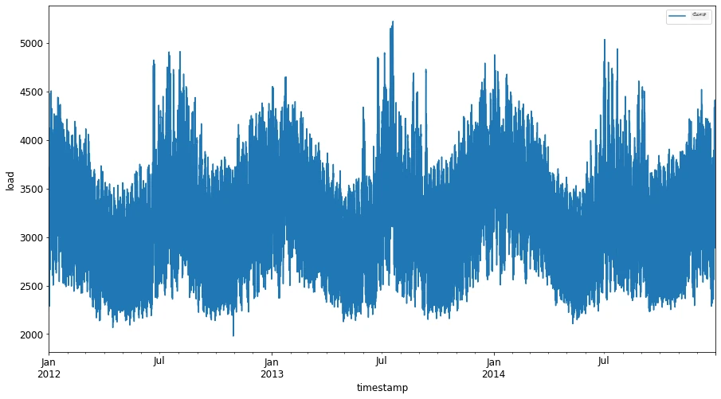
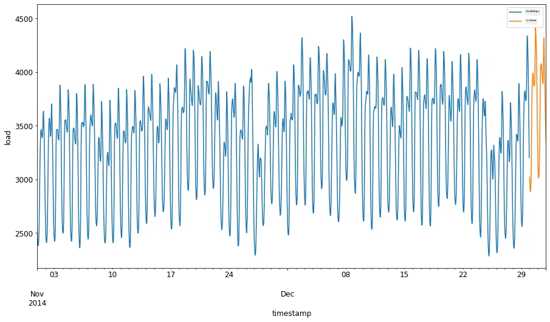
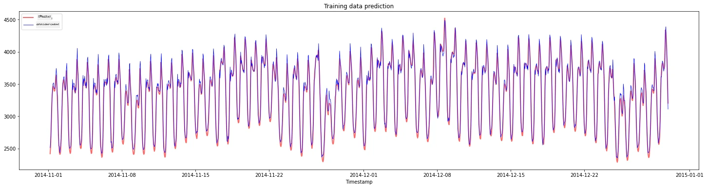
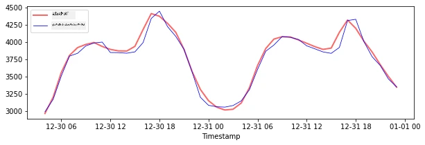
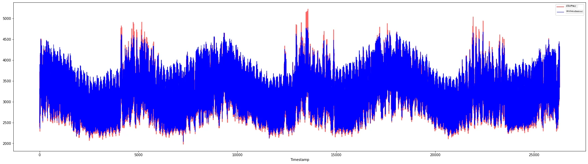

<!--
CO_OP_TRANSLATOR_METADATA:
{
  "original_hash": "482bccabe1df958496ea71a3667995cd",
  "translation_date": "2025-12-19T15:59:58+00:00",
  "source_file": "7-TimeSeries/3-SVR/README.md",
  "language_code": "kn"
}
-->
# ಸಮಯ ಸರಣಿ ಭವಿಷ್ಯವಾಣಿ ಸಹಾಯ ವಕ್ಟರ್ ರೆಗ್ರೆಸರ್‌ನೊಂದಿಗೆ

ಹಿಂದಿನ ಪಾಠದಲ್ಲಿ, ನೀವು ಸಮಯ ಸರಣಿ ಭವಿಷ್ಯವಾಣಿಗಾಗಿ ARIMA ಮಾದರಿಯನ್ನು ಹೇಗೆ ಬಳಸುವುದು ಎಂದು ಕಲಿತಿರಿ. ಈಗ ನೀವು ನಿರಂತರ ಡೇಟಾವನ್ನು ಭವಿಷ್ಯವಾಣಿ ಮಾಡಲು ಬಳಸುವ ರೆಗ್ರೆಸರ್ ಮಾದರಿ ಆಗಿರುವ Support Vector Regressor ಮಾದರಿಯನ್ನು ನೋಡಲಿದ್ದೀರಿ.

## [ಪೂರ್ವ-ಪಾಠ ಕ್ವಿಜ್](https://ff-quizzes.netlify.app/en/ml/) 

## ಪರಿಚಯ

ಈ ಪಾಠದಲ್ಲಿ, ನೀವು ರೆಗ್ರೆಷನ್‌ಗಾಗಿ [**SVM**: **S**ಪೋರ್ಟ್ **V**ೆಕ್ಟರ್ **M**ಶೀನ್](https://en.wikipedia.org/wiki/Support-vector_machine) ಬಳಸಿ ಮಾದರಿಗಳನ್ನು ನಿರ್ಮಿಸುವ ವಿಶೇಷ ವಿಧಾನವನ್ನು ಕಂಡುಹಿಡಿಯುತ್ತೀರಿ, ಅಥವಾ **SVR: Support Vector Regressor**.

### ಸಮಯ ಸರಣಿಯ ಸಂದರ್ಭದಲ್ಲಿ SVR [^1]

ಸಮಯ ಸರಣಿ ಭವಿಷ್ಯವಾಣಿಯಲ್ಲಿ SVR ಮಹತ್ವವನ್ನು ಅರ್ಥಮಾಡಿಕೊಳ್ಳುವ ಮೊದಲು, ನೀವು ತಿಳಿದುಕೊಳ್ಳಬೇಕಾದ ಕೆಲವು ಪ್ರಮುಖ ಸಂಪ್ರದಾಯಗಳು ಇಲ್ಲಿವೆ:

- **ರೆಗ್ರೆಷನ್:** ನಿರಂತರ ಮೌಲ್ಯಗಳನ್ನು ಭವಿಷ್ಯವಾಣಿ ಮಾಡಲು ನೀಡಲಾದ ಇನ್ಪುಟ್‌ಗಳ ಸೆಟ್‌ನಿಂದ ಸೂಪರ್ವೈಸ್ಡ್ ಲರ್ನಿಂಗ್ ತಂತ್ರ. ಆಲೋಚನೆ ಎಂದರೆ ಫೀಚರ್ ಸ್ಪೇಸ್‌ನಲ್ಲಿ ಅತಿ ಹೆಚ್ಚು ಡೇಟಾ ಪಾಯಿಂಟ್‌ಗಳನ್ನು ಹೊಂದಿರುವ ವಕ್ರರೇಖೆ (ಅಥವಾ ರೇಖೆ) ಅನ್ನು ಹೊಂದಿಸುವುದು. ಹೆಚ್ಚಿನ ಮಾಹಿತಿಗಾಗಿ [ಇಲ್ಲಿ ಕ್ಲಿಕ್ ಮಾಡಿ](https://en.wikipedia.org/wiki/Regression_analysis).
- **ಸಪೋರ್ಟ್ ವೆಕ್ಟರ್ ಮಷೀನ್ (SVM):** ವರ್ಗೀಕರಣ, ರೆಗ್ರೆಷನ್ ಮತ್ತು ಔಟ್‌ಲೈಯರ್ ಪತ್ತೆಗಾಗಿ ಬಳಸುವ ಒಂದು ವಿಧದ ಸೂಪರ್ವೈಸ್ಡ್ ಮಷೀನ್ ಲರ್ನಿಂಗ್ ಮಾದರಿ. ಈ ಮಾದರಿ ಫೀಚರ್ ಸ್ಪೇಸ್‌ನಲ್ಲಿ ಒಂದು ಹೈಪರ್ಪ್ಲೇನ್ ಆಗಿದ್ದು, ವರ್ಗೀಕರಣದಲ್ಲಿ ಇದು ಗಡಿಬಿಡಿ ಆಗಿ ಕಾರ್ಯನಿರ್ವಹಿಸುತ್ತದೆ ಮತ್ತು ರೆಗ್ರೆಷನ್‌ನಲ್ಲಿ ಅತ್ಯುತ್ತಮ ಹೊಂದಾಣಿಕೆಯ ರೇಖೆಯಾಗಿ ಕಾರ್ಯನಿರ್ವಹಿಸುತ್ತದೆ. SVM ನಲ್ಲಿ, ಸಾಮಾನ್ಯವಾಗಿ ಡೇಟಾಸೆಟ್ ಅನ್ನು ಹೆಚ್ಚಿನ ಆಯಾಮಗಳ ಸ್ಥಳಕ್ಕೆ ಪರಿವರ್ತಿಸಲು Kernel ಫಂಕ್ಷನ್ ಬಳಸಲಾಗುತ್ತದೆ, ಇದರಿಂದ ಅವುಗಳನ್ನು ಸುಲಭವಾಗಿ ವಿಭಜಿಸಬಹುದು. SVM ಗಳ ಬಗ್ಗೆ ಹೆಚ್ಚಿನ ಮಾಹಿತಿಗಾಗಿ [ಇಲ್ಲಿ ಕ್ಲಿಕ್ ಮಾಡಿ](https://en.wikipedia.org/wiki/Support-vector_machine).
- **ಸಪೋರ್ಟ್ ವೆಕ್ಟರ್ ರೆಗ್ರೆಸರ್ (SVR):** SVM ರ ಒಂದು ವಿಧ, ಅತಿ ಹೆಚ್ಚು ಡೇಟಾ ಪಾಯಿಂಟ್‌ಗಳನ್ನು ಹೊಂದಿರುವ ಅತ್ಯುತ್ತಮ ಹೊಂದಾಣಿಕೆಯ ರೇಖೆಯನ್ನು (SVM ನಲ್ಲಿ ಹೈಪರ್ಪ್ಲೇನ್) ಕಂಡುಹಿಡಿಯಲು.

### ಏಕೆ SVR? [^1]

ಹಿಂದಿನ ಪಾಠದಲ್ಲಿ ನೀವು ARIMA ಬಗ್ಗೆ ಕಲಿತಿರಿ, ಇದು ಸಮಯ ಸರಣಿ ಡೇಟಾವನ್ನು ಭವಿಷ್ಯವಾಣಿ ಮಾಡಲು ಅತ್ಯಂತ ಯಶಸ್ವಿ ಸಾಂಖ್ಯಿಕ ರೇಖೀಯ ವಿಧಾನವಾಗಿದೆ. ಆದರೆ, ಅನೇಕ ಸಂದರ್ಭಗಳಲ್ಲಿ, ಸಮಯ ಸರಣಿ ಡೇಟಾದಲ್ಲಿ *ಅರೇಖೀಯತೆ* ಇರುತ್ತದೆ, ಇದನ್ನು ರೇಖೀಯ ಮಾದರಿಗಳಿಂದ ನಕ್ಷೆ ಹಾಕಲಾಗುವುದಿಲ್ಲ. ಇಂತಹ ಸಂದರ್ಭಗಳಲ್ಲಿ, ರೆಗ್ರೆಷನ್ ಕಾರ್ಯಗಳಿಗೆ ಡೇಟಾದಲ್ಲಿನ ಅರೇಖೀಯತೆಯನ್ನು ಪರಿಗಣಿಸುವ SVM ಯ ಶಕ್ತಿ SVR ಅನ್ನು ಸಮಯ ಸರಣಿ ಭವಿಷ್ಯವಾಣಿಯಲ್ಲಿ ಯಶಸ್ವಿಯಾಗಿಸುತ್ತದೆ.

## ಅಭ್ಯಾಸ - SVR ಮಾದರಿಯನ್ನು ನಿರ್ಮಿಸಿ

ಡೇಟಾ ತಯಾರಿಕೆಗೆ ಮೊದಲ ಕೆಲವು ಹಂತಗಳು ಹಿಂದಿನ [ARIMA](https://github.com/microsoft/ML-For-Beginners/tree/main/7-TimeSeries/2-ARIMA) ಪಾಠದಂತೆಯೇ ಇವೆ.

ಈ ಪಾಠದಲ್ಲಿ [_/working_](https://github.com/microsoft/ML-For-Beginners/tree/main/7-TimeSeries/3-SVR/working) ಫೋಲ್ಡರ್ ತೆರೆಯಿರಿ ಮತ್ತು [_notebook.ipynb_](https://github.com/microsoft/ML-For-Beginners/blob/main/7-TimeSeries/3-SVR/working/notebook.ipynb) ಫೈಲ್ ಅನ್ನು ಹುಡುಕಿ.[^2]

1. ನೋಟ್ಬುಕ್ ಅನ್ನು ರನ್ ಮಾಡಿ ಮತ್ತು ಅಗತ್ಯವಿರುವ ಲೈಬ್ರರಿಗಳನ್ನು ಆಮದುಮಾಡಿ:  [^2]

   ```python
   import sys
   sys.path.append('../../')
   ```

   ```python
   import os
   import warnings
   import matplotlib.pyplot as plt
   import numpy as np
   import pandas as pd
   import datetime as dt
   import math
   
   from sklearn.svm import SVR
   from sklearn.preprocessing import MinMaxScaler
   from common.utils import load_data, mape
   ```

2. `/data/energy.csv` ಫೈಲ್‌ನಿಂದ ಡೇಟಾವನ್ನು ಪಾಂಡಾಸ್ ಡೇಟಾಫ್ರೇಮ್‌ಗೆ ಲೋಡ್ ಮಾಡಿ ಮತ್ತು ನೋಡಿ:  [^2]

   ```python
   energy = load_data('../../data')[['load']]
   ```

3. ಜನವರಿ 2012 ರಿಂದ ಡಿಸೆಂಬರ್ 2014 ರವರೆಗೆ ಲಭ್ಯವಿರುವ ಎಲ್ಲಾ ಎನರ್ಜಿ ಡೇಟಾವನ್ನು ಪ್ಲಾಟ್ ಮಾಡಿ: [^2]

   ```python
   energy.plot(y='load', subplots=True, figsize=(15, 8), fontsize=12)
   plt.xlabel('timestamp', fontsize=12)
   plt.ylabel('load', fontsize=12)
   plt.show()
   ```

   

   ಈಗ, ನಮ್ಮ SVR ಮಾದರಿಯನ್ನು ನಿರ್ಮಿಸೋಣ.

### ತರಬೇತಿ ಮತ್ತು ಪರೀಕ್ಷಾ ಡೇಟಾಸೆಟ್‌ಗಳನ್ನು ರಚಿಸಿ

ನಿಮ್ಮ ಡೇಟಾ ಈಗ ಲೋಡ್ ಆಗಿದೆ, ಆದ್ದರಿಂದ ನೀವು ಅದನ್ನು ತರಬೇತಿ ಮತ್ತು ಪರೀಕ್ಷಾ ಸೆಟ್‌ಗಳಾಗಿ ವಿಭಜಿಸಬಹುದು. ನಂತರ ನೀವು SVR ಗೆ ಅಗತ್ಯವಿರುವ ಸಮಯ-ಹಂತ ಆಧಾರಿತ ಡೇಟಾಸೆಟ್ ರಚಿಸಲು ಡೇಟಾವನ್ನು ಮರುರೂಪಗೊಳಿಸುವಿರಿ. ನೀವು ನಿಮ್ಮ ಮಾದರಿಯನ್ನು ತರಬೇತಿ ಸೆಟ್‌ನಲ್ಲಿ ತರಬೇತಿಮಾಡುತ್ತೀರಿ. ಮಾದರಿ ತರಬೇತಿ ಮುಗಿದ ನಂತರ, ನೀವು ಅದರ ನಿಖರತೆಯನ್ನು ತರಬೇತಿ ಸೆಟ್, ಪರೀಕ್ಷಾ ಸೆಟ್ ಮತ್ತು ನಂತರ ಸಂಪೂರ್ಣ ಡೇಟಾಸೆಟ್‌ನಲ್ಲಿ ಮೌಲ್ಯಮಾಪನ ಮಾಡುತ್ತೀರಿ. ಮಾದರಿ ಭವಿಷ್ಯದ ಸಮಯ ಅವಧಿಗಳಿಂದ ಮಾಹಿತಿ ಪಡೆಯದಂತೆ ಪರೀಕ್ಷಾ ಸೆಟ್ ತರಬೇತಿ ಸೆಟ್‌ನ ನಂತರದ ಅವಧಿಯನ್ನು ಒಳಗೊಂಡಿರಬೇಕು ಎಂದು ಖಚಿತಪಡಿಸಿಕೊಳ್ಳಬೇಕು [^2] (*ಒವರ್‌ಫಿಟಿಂಗ್* ಎಂದು ಕರೆಯಲ್ಪಡುವ ಪರಿಸ್ಥಿತಿ).

1. 2014 ಸೆಪ್ಟೆಂಬರ್ 1 ರಿಂದ ಅಕ್ಟೋಬರ್ 31 ರವರೆಗೆ ಎರಡು ತಿಂಗಳ ಅವಧಿಯನ್ನು ತರಬೇತಿ ಸೆಟ್‌ಗೆ ಮೀಸಲಿಡಿ. ಪರೀಕ್ಷಾ ಸೆಟ್ 2014 ನವೆಂಬರ್ 1 ರಿಂದ ಡಿಸೆಂಬರ್ 31 ರವರೆಗೆ ಎರಡು ತಿಂಗಳ ಅವಧಿಯನ್ನು ಒಳಗೊಂಡಿರುತ್ತದೆ: [^2]

   ```python
   train_start_dt = '2014-11-01 00:00:00'
   test_start_dt = '2014-12-30 00:00:00'
   ```

2. ವ್ಯತ್ಯಾಸಗಳನ್ನು ದೃಶ್ಯೀಕರಿಸಿ: [^2]

   ```python
   energy[(energy.index < test_start_dt) & (energy.index >= train_start_dt)][['load']].rename(columns={'load':'train'}) \
       .join(energy[test_start_dt:][['load']].rename(columns={'load':'test'}), how='outer') \
       .plot(y=['train', 'test'], figsize=(15, 8), fontsize=12)
   plt.xlabel('timestamp', fontsize=12)
   plt.ylabel('load', fontsize=12)
   plt.show()
   ```

   


### ತರಬೇತಿಗಾಗಿ ಡೇಟಾವನ್ನು ತಯಾರಿಸಿ

ಈಗ, ನಿಮ್ಮ ಡೇಟಾವನ್ನು ಫಿಲ್ಟರಿಂಗ್ ಮತ್ತು ಸ್ಕೇಲಿಂಗ್ ಮೂಲಕ ತರಬೇತಿಗಾಗಿ ತಯಾರಿಸಬೇಕಾಗಿದೆ. ನೀವು ಬೇಕಾದ ಕಾಲಾವಧಿಗಳು ಮತ್ತು ಕಾಲಮ್‌ಗಳನ್ನು ಮಾತ್ರ ಒಳಗೊಂಡಂತೆ ಡೇಟಾಸೆಟ್ ಅನ್ನು ಫಿಲ್ಟರ್ ಮಾಡಿ, ಮತ್ತು ಡೇಟಾ 0 ಮತ್ತು 1 ನಡುವಿನ ಅಂತರಾಳದಲ್ಲಿ ಪ್ರಕ್ಷೇಪಿತವಾಗುವಂತೆ ಸ್ಕೇಲ್ ಮಾಡಬೇಕು.

1. ಪ್ರಾರಂಭಿಕ ಡೇಟಾಸೆಟ್ ಅನ್ನು ಮೇಲ್ಕಂಡ ಕಾಲಾವಧಿಗಳನ್ನೂ ಮತ್ತು 'load' ಕಾಲಮ್ ಜೊತೆಗೆ ದಿನಾಂಕವನ್ನು ಮಾತ್ರ ಒಳಗೊಂಡಂತೆ ಫಿಲ್ಟರ್ ಮಾಡಿ: [^2]

   ```python
   train = energy.copy()[(energy.index >= train_start_dt) & (energy.index < test_start_dt)][['load']]
   test = energy.copy()[energy.index >= test_start_dt][['load']]
   
   print('Training data shape: ', train.shape)
   print('Test data shape: ', test.shape)
   ```

   ```output
   Training data shape:  (1416, 1)
   Test data shape:  (48, 1)
   ```
   
2. ತರಬೇತಿ ಡೇಟಾವನ್ನು (0, 1) ವ್ಯಾಪ್ತಿಯಲ್ಲಿ ಸ್ಕೇಲ್ ಮಾಡಿ: [^2]

   ```python
   scaler = MinMaxScaler()
   train['load'] = scaler.fit_transform(train)
   ```
   
4. ಈಗ, ಪರೀಕ್ಷಾ ಡೇಟಾವನ್ನು ಸ್ಕೇಲ್ ಮಾಡಿ: [^2]

   ```python
   test['load'] = scaler.transform(test)
   ```

### ಸಮಯ-ಹಂತಗಳೊಂದಿಗೆ ಡೇಟಾ ರಚಿಸಿ [^1]

SVR ಗಾಗಿ, ನೀವು ಇನ್ಪುಟ್ ಡೇಟಾವನ್ನು `[batch, timesteps]` ರೂಪಕ್ಕೆ ಪರಿವರ್ತಿಸುತ್ತೀರಿ. ಆದ್ದರಿಂದ, ನೀವು ಇತ್ತೀಚೆಗೆ ಇರುವ `train_data` ಮತ್ತು `test_data` ಅನ್ನು ಮರುರೂಪಗೊಳಿಸಿ, ಹೊಸ ಆಯಾಮವು ಸಮಯ ಹಂತಗಳನ್ನು ಸೂಚಿಸುತ್ತದೆ.

```python
# ನಂಪೈ ಅರೆಗಳಾಗಿ ಪರಿವರ್ತನೆ ಮಾಡಲಾಗುತ್ತಿದೆ
train_data = train.values
test_data = test.values
```

ಈ ಉದಾಹರಣೆಗೆ, ನಾವು `timesteps = 5` ಅನ್ನು ತೆಗೆದುಕೊಳ್ಳುತ್ತೇವೆ. ಆದ್ದರಿಂದ, ಮಾದರಿಗೆ ಇನ್ಪುಟ್‌ಗಳು ಮೊದಲ 4 ಸಮಯ ಹಂತಗಳ ಡೇಟಾಗಳಾಗಿದ್ದು, ಔಟ್‌ಪುಟ್ 5ನೇ ಸಮಯ ಹಂತದ ಡೇಟಾಗಿರುತ್ತದೆ.

```python
timesteps=5
```

ನೋಡಿದಂತೆ, ತರಬೇತಿ ಡೇಟಾವನ್ನು 2D ಟೆನ್ಸರ್‌ಗೆ ಪರಿವರ್ತಿಸುವ nested list comprehension:

```python
train_data_timesteps=np.array([[j for j in train_data[i:i+timesteps]] for i in range(0,len(train_data)-timesteps+1)])[:,:,0]
train_data_timesteps.shape
```

```output
(1412, 5)
```

ಪರೀಕ್ಷಾ ಡೇಟಾವನ್ನು 2D ಟೆನ್ಸರ್‌ಗೆ ಪರಿವರ್ತಿಸುವುದು:

```python
test_data_timesteps=np.array([[j for j in test_data[i:i+timesteps]] for i in range(0,len(test_data)-timesteps+1)])[:,:,0]
test_data_timesteps.shape
```

```output
(44, 5)
```

ತರಬೇತಿ ಮತ್ತು ಪರೀಕ್ಷಾ ಡೇಟಾದಿಂದ ಇನ್ಪುಟ್ ಮತ್ತು ಔಟ್‌ಪುಟ್‌ಗಳನ್ನು ಆಯ್ಕೆ ಮಾಡುವುದು:

```python
x_train, y_train = train_data_timesteps[:,:timesteps-1],train_data_timesteps[:,[timesteps-1]]
x_test, y_test = test_data_timesteps[:,:timesteps-1],test_data_timesteps[:,[timesteps-1]]

print(x_train.shape, y_train.shape)
print(x_test.shape, y_test.shape)
```

```output
(1412, 4) (1412, 1)
(44, 4) (44, 1)
```

### SVR ಅನ್ನು ಅನುಷ್ಠಾನಗೊಳಿಸಿ [^1]

ಈಗ, SVR ಅನ್ನು ಅನುಷ್ಠಾನಗೊಳಿಸುವ ಸಮಯ. ಈ ಅನುಷ್ಠಾನ ಕುರಿತು ಹೆಚ್ಚಿನ ಮಾಹಿತಿಗಾಗಿ, ನೀವು [ಈ ಡಾಕ್ಯುಮೆಂಟೇಶನ್](https://scikit-learn.org/stable/modules/generated/sklearn.svm.SVR.html) ಅನ್ನು ನೋಡಿ. ನಮ್ಮ ಅನುಷ್ಠಾನಕ್ಕಾಗಿ, ನಾವು ಈ ಹಂತಗಳನ್ನು ಅನುಸರಿಸುತ್ತೇವೆ:

  1. `SVR()` ಅನ್ನು ಕರೆಸಿ ಮತ್ತು ಮಾದರಿ ಹೈಪರ್‌ಪ್ಯಾರಾಮೀಟರ್‌ಗಳು kernel, gamma, c ಮತ್ತು epsilon ಅನ್ನು ಪಾಸ್ ಮಾಡಿ
  2. `fit()` ಫಂಕ್ಷನ್ ಅನ್ನು ಕರೆಸಿ ತರಬೇತಿ ಡೇಟಾಗೆ ಮಾದರಿಯನ್ನು ತಯಾರಿಸಿ
  3. `predict()` ಫಂಕ್ಷನ್ ಅನ್ನು ಕರೆಸಿ ಭವಿಷ್ಯವಾಣಿಗಳನ್ನು ಮಾಡಿ

ಈಗ ನಾವು SVR ಮಾದರಿಯನ್ನು ರಚಿಸುತ್ತೇವೆ. ಇಲ್ಲಿ ನಾವು [RBF kernel](https://scikit-learn.org/stable/modules/svm.html#parameters-of-the-rbf-kernel) ಅನ್ನು ಬಳಸುತ್ತೇವೆ ಮತ್ತು ಹೈಪರ್‌ಪ್ಯಾರಾಮೀಟರ್‌ಗಳು gamma, C ಮತ್ತು epsilon ಅನ್ನು ಕ್ರಮವಾಗಿ 0.5, 10 ಮತ್ತು 0.05 ಎಂದು ಹೊಂದಿಸುತ್ತೇವೆ.

```python
model = SVR(kernel='rbf',gamma=0.5, C=10, epsilon = 0.05)
```

#### ತರಬೇತಿ ಡೇಟಾದ ಮೇಲೆ ಮಾದರಿಯನ್ನು ಹೊಂದಿಸಿ [^1]

```python
model.fit(x_train, y_train[:,0])
```

```output
SVR(C=10, cache_size=200, coef0=0.0, degree=3, epsilon=0.05, gamma=0.5,
    kernel='rbf', max_iter=-1, shrinking=True, tol=0.001, verbose=False)
```

#### ಮಾದರಿ ಭವಿಷ್ಯವಾಣಿಗಳನ್ನು ಮಾಡಿ [^1]

```python
y_train_pred = model.predict(x_train).reshape(-1,1)
y_test_pred = model.predict(x_test).reshape(-1,1)

print(y_train_pred.shape, y_test_pred.shape)
```

```output
(1412, 1) (44, 1)
```

ನೀವು ನಿಮ್ಮ SVR ಅನ್ನು ನಿರ್ಮಿಸಿದ್ದೀರಿ! ಈಗ ಅದನ್ನು ಮೌಲ್ಯಮಾಪನ ಮಾಡೋಣ.

### ನಿಮ್ಮ ಮಾದರಿಯನ್ನು ಮೌಲ್ಯಮಾಪನ ಮಾಡಿ [^1]

ಮೌಲ್ಯಮಾಪನಕ್ಕಾಗಿ, ಮೊದಲು ನಾವು ಡೇಟಾವನ್ನು ಮೂಲ ಮಾಪಕಕ್ಕೆ ಮರುಸ್ಕೇಲ್ ಮಾಡುತ್ತೇವೆ. ನಂತರ, ಕಾರ್ಯಕ್ಷಮತೆಯನ್ನು ಪರಿಶೀಲಿಸಲು, ನಾವು ಮೂಲ ಮತ್ತು ಭವಿಷ್ಯವಾಣಿ ಮಾಡಿದ ಸಮಯ ಸರಣಿ ಪ್ಲಾಟ್ ಅನ್ನು ಚಿತ್ರಿಸುತ್ತೇವೆ ಮತ್ತು MAPE ಫಲಿತಾಂಶವನ್ನು ಮುದ್ರಿಸುತ್ತೇವೆ.

ಭವಿಷ್ಯವಾಣಿ ಮತ್ತು ಮೂಲ ಔಟ್‌ಪುಟ್ ಅನ್ನು ಸ್ಕೇಲ್ ಮಾಡಿ:

```python
# ಭವಿಷ್ಯವಾಣಿಗಳನ್ನು ಮಾಪನ ಮಾಡುವುದು
y_train_pred = scaler.inverse_transform(y_train_pred)
y_test_pred = scaler.inverse_transform(y_test_pred)

print(len(y_train_pred), len(y_test_pred))
```

```python
# ಮೂಲ ಮೌಲ್ಯಗಳನ್ನು ಮಾಪನಗೊಳಿಸುವುದು
y_train = scaler.inverse_transform(y_train)
y_test = scaler.inverse_transform(y_test)

print(len(y_train), len(y_test))
```

#### ತರಬೇತಿ ಮತ್ತು ಪರೀಕ್ಷಾ ಡೇಟಾದ ಮೇಲೆ ಮಾದರಿ ಕಾರ್ಯಕ್ಷಮತೆಯನ್ನು ಪರಿಶೀಲಿಸಿ [^1]

ನಮ್ಮ ಪ್ಲಾಟ್‌ನ x-ಅಕ್ಷದಲ್ಲಿ ತೋರಿಸಲು ಡೇಟಾಸೆಟ್‌ನಿಂದ ಟೈಮ್‌ಸ್ಟ್ಯಾಂಪ್‌ಗಳನ್ನು ತೆಗೆದುಕೊಳ್ಳುತ್ತೇವೆ. ನಾವು ಮೊದಲ ```timesteps-1``` ಮೌಲ್ಯಗಳನ್ನು ಮೊದಲ ಔಟ್‌ಪುಟ್‌ಗೆ ಇನ್ಪುಟ್ ಆಗಿ ಬಳಸುತ್ತಿದ್ದೇವೆ, ಆದ್ದರಿಂದ ಔಟ್‌ಪುಟ್‌ಗಾಗಿ ಟೈಮ್‌ಸ್ಟ್ಯಾಂಪ್‌ಗಳು ಅದರಿಂದ ನಂತರ ಪ್ರಾರಂಭವಾಗುತ್ತವೆ.

```python
train_timestamps = energy[(energy.index < test_start_dt) & (energy.index >= train_start_dt)].index[timesteps-1:]
test_timestamps = energy[test_start_dt:].index[timesteps-1:]

print(len(train_timestamps), len(test_timestamps))
```

```output
1412 44
```

ತರಬೇತಿ ಡೇಟಾದ ಭವಿಷ್ಯವಾಣಿಗಳನ್ನು ಪ್ಲಾಟ್ ಮಾಡಿ:

```python
plt.figure(figsize=(25,6))
plt.plot(train_timestamps, y_train, color = 'red', linewidth=2.0, alpha = 0.6)
plt.plot(train_timestamps, y_train_pred, color = 'blue', linewidth=0.8)
plt.legend(['Actual','Predicted'])
plt.xlabel('Timestamp')
plt.title("Training data prediction")
plt.show()
```



ತರಬೇತಿ ಡೇಟಾದ MAPE ಅನ್ನು ಮುದ್ರಿಸಿ

```python
print('MAPE for training data: ', mape(y_train_pred, y_train)*100, '%')
```

```output
MAPE for training data: 1.7195710200875551 %
```

ಪರೀಕ್ಷಾ ಡೇಟಾದ ಭವಿಷ್ಯವಾಣಿಗಳನ್ನು ಪ್ಲಾಟ್ ಮಾಡಿ

```python
plt.figure(figsize=(10,3))
plt.plot(test_timestamps, y_test, color = 'red', linewidth=2.0, alpha = 0.6)
plt.plot(test_timestamps, y_test_pred, color = 'blue', linewidth=0.8)
plt.legend(['Actual','Predicted'])
plt.xlabel('Timestamp')
plt.show()
```



ಪರೀಕ್ಷಾ ಡೇಟಾದ MAPE ಅನ್ನು ಮುದ್ರಿಸಿ

```python
print('MAPE for testing data: ', mape(y_test_pred, y_test)*100, '%')
```

```output
MAPE for testing data:  1.2623790187854018 %
```

🏆 ನೀವು ಪರೀಕ್ಷಾ ಡೇಟಾಸೆಟ್‌ನಲ್ಲಿ ಅತ್ಯುತ್ತಮ ಫಲಿತಾಂಶವನ್ನು ಪಡೆದಿದ್ದೀರಿ!

### ಸಂಪೂರ್ಣ ಡೇಟಾಸೆಟ್‌ನಲ್ಲಿ ಮಾದರಿ ಕಾರ್ಯಕ್ಷಮತೆಯನ್ನು ಪರಿಶೀಲಿಸಿ [^1]

```python
# ಲೋಡ್ ಮೌಲ್ಯಗಳನ್ನು numpy ಅರೆ ಆಗಿ ಹೊರತೆಗೆಯುವುದು
data = energy.copy().values

# ಮಾಪನ
data = scaler.transform(data)

# ಮಾದರಿ ಇನ್‌ಪುಟ್ ಅಗತ್ಯದ ಪ್ರಕಾರ 2D ಟೆನ್ಸರ್ ಗೆ ಪರಿವರ್ತಿಸುವುದು
data_timesteps=np.array([[j for j in data[i:i+timesteps]] for i in range(0,len(data)-timesteps+1)])[:,:,0]
print("Tensor shape: ", data_timesteps.shape)

# ಡೇಟಾದಿಂದ ಇನ್‌ಪುಟ್‌ಗಳು ಮತ್ತು ಔಟ್‌ಪುಟ್‌ಗಳನ್ನು ಆಯ್ಕೆ ಮಾಡುವುದು
X, Y = data_timesteps[:,:timesteps-1],data_timesteps[:,[timesteps-1]]
print("X shape: ", X.shape,"\nY shape: ", Y.shape)
```

```output
Tensor shape:  (26300, 5)
X shape:  (26300, 4) 
Y shape:  (26300, 1)
```

```python
# ಮಾದರಿ ಭವಿಷ್ಯವಾಣಿ ಮಾಡಿ
Y_pred = model.predict(X).reshape(-1,1)

# ವಿಲೋಮ ಮಾಪನ ಮತ್ತು ಆಕಾರ ಬದಲಿಸಿ
Y_pred = scaler.inverse_transform(Y_pred)
Y = scaler.inverse_transform(Y)
```

```python
plt.figure(figsize=(30,8))
plt.plot(Y, color = 'red', linewidth=2.0, alpha = 0.6)
plt.plot(Y_pred, color = 'blue', linewidth=0.8)
plt.legend(['Actual','Predicted'])
plt.xlabel('Timestamp')
plt.show()
```



```python
print('MAPE: ', mape(Y_pred, Y)*100, '%')
```

```output
MAPE:  2.0572089029888656 %
```


🏆 ಅತ್ಯುತ್ತಮ ಪ್ಲಾಟ್‌ಗಳು, ಉತ್ತಮ ನಿಖರತೆಯ ಮಾದರಿಯನ್ನು ತೋರಿಸುತ್ತಿವೆ. ಶುಭಾಶಯಗಳು!

---

## 🚀ಸವಾಲು

- ಮಾದರಿಯನ್ನು ರಚಿಸುವಾಗ ಹೈಪರ್‌ಪ್ಯಾರಾಮೀಟರ್‌ಗಳು (gamma, C, epsilon) ಅನ್ನು ಬದಲಾಯಿಸಿ ಮತ್ತು ಡೇಟಾದ ಮೇಲೆ ಮೌಲ್ಯಮಾಪನ ಮಾಡಿ ಯಾವ ಹೈಪರ್‌ಪ್ಯಾರಾಮೀಟರ್‌ಗಳ ಸೆಟ್ ಪರೀಕ್ಷಾ ಡೇಟಾದ ಮೇಲೆ ಉತ್ತಮ ಫಲಿತಾಂಶ ನೀಡುತ್ತದೆ ಎಂದು ನೋಡಿ. ಈ ಹೈಪರ್‌ಪ್ಯಾರಾಮೀಟರ್‌ಗಳ ಬಗ್ಗೆ ತಿಳಿಯಲು, ನೀವು [ಈ ಡಾಕ್ಯುಮೆಂಟೇಶನ್](https://scikit-learn.org/stable/modules/svm.html#parameters-of-the-rbf-kernel) ಅನ್ನು ನೋಡಿ.
- ಮಾದರಿಗಾಗಿ ವಿಭಿನ್ನ kernel ಫಂಕ್ಷನ್‌ಗಳನ್ನು ಪ್ರಯತ್ನಿಸಿ ಮತ್ತು ಅವುಗಳ ಕಾರ್ಯಕ್ಷಮತೆಯನ್ನು ಡೇಟಾಸೆಟ್‌ನಲ್ಲಿ ವಿಶ್ಲೇಷಿಸಿ. ಸಹಾಯಕ ಡಾಕ್ಯುಮೆಂಟೇಶನ್ [ಇಲ್ಲಿ](https://scikit-learn.org/stable/modules/svm.html#kernel-functions) ಲಭ್ಯವಿದೆ.
- ಭವಿಷ್ಯವಾಣಿ ಮಾಡಲು ಹಿಂದಕ್ಕೆ ನೋಡಲು ಮಾದರಿಗಾಗಿ `timesteps` ಗೆ ವಿಭಿನ್ನ ಮೌಲ್ಯಗಳನ್ನು ಪ್ರಯತ್ನಿಸಿ.

## [ಪೋಸ್ಟ್-ಪಾಠ ಕ್ವಿಜ್](https://ff-quizzes.netlify.app/en/ml/)

## ವಿಮರ್ಶೆ ಮತ್ತು ಸ್ವಯಂ ಅಧ್ಯಯನ

ಈ ಪಾಠವು ಸಮಯ ಸರಣಿ ಭವಿಷ್ಯವಾಣಿಗಾಗಿ SVR ಅನ್ವಯವನ್ನು ಪರಿಚಯಿಸುವುದಾಗಿತ್ತು. SVR ಬಗ್ಗೆ ಹೆಚ್ಚಿನ ಮಾಹಿತಿಗಾಗಿ, ನೀವು [ಈ ಬ್ಲಾಗ್](https://www.analyticsvidhya.com/blog/2020/03/support-vector-regression-tutorial-for-machine-learning/) ಅನ್ನು ನೋಡಿ. ಈ [scikit-learn ಡಾಕ್ಯುಮೆಂಟೇಶನ್](https://scikit-learn.org/stable/modules/svm.html) ಸಾಮಾನ್ಯವಾಗಿ SVM ಗಳ, [SVR ಗಳ](https://scikit-learn.org/stable/modules/svm.html#regression) ಮತ್ತು ಬಳಸಬಹುದಾದ ವಿವಿಧ [kernel ಫಂಕ್ಷನ್‌ಗಳು](https://scikit-learn.org/stable/modules/svm.html#kernel-functions) ಮತ್ತು ಅವುಗಳ ಪ್ಯಾರಾಮೀಟರ್‌ಗಳ ಕುರಿತು ಸಮಗ್ರ ವಿವರಣೆ ನೀಡುತ್ತದೆ.

## ನಿಯೋಜನೆ

[ಹೊಸ SVR ಮಾದರಿ](assignment.md)


## ಕ್ರೆಡಿಟ್‌ಗಳು


[^1]: ಈ ವಿಭಾಗದ ಪಠ್ಯ, ಕೋಡ್ ಮತ್ತು ಔಟ್‌ಪುಟ್ ಅನ್ನು [@AnirbanMukherjeeXD](https://github.com/AnirbanMukherjeeXD) ಕೊಡುಗೆ ನೀಡಿದ್ದಾರೆ
[^2]: ಈ ವಿಭಾಗದ ಪಠ್ಯ, ಕೋಡ್ ಮತ್ತು ಔಟ್‌ಪುಟ್ ಅನ್ನು [ARIMA](https://github.com/microsoft/ML-For-Beginners/tree/main/7-TimeSeries/2-ARIMA) ನಿಂದ ತೆಗೆದುಕೊಂಡಿದೆ

---

<!-- CO-OP TRANSLATOR DISCLAIMER START -->
**ಅಸ್ವೀಕರಣ**:  
ಈ ದಸ್ತಾವೇಜು AI ಅನುವಾದ ಸೇವೆ [Co-op Translator](https://github.com/Azure/co-op-translator) ಬಳಸಿ ಅನುವಾದಿಸಲಾಗಿದೆ. ನಾವು ನಿಖರತೆಯಿಗಾಗಿ ಪ್ರಯತ್ನಿಸುತ್ತಿದ್ದರೂ, ಸ್ವಯಂಚಾಲಿತ ಅನುವಾದಗಳಲ್ಲಿ ದೋಷಗಳು ಅಥವಾ ತಪ್ಪುಗಳು ಇರಬಹುದು ಎಂಬುದನ್ನು ದಯವಿಟ್ಟು ಗಮನಿಸಿ. ಮೂಲ ಭಾಷೆಯಲ್ಲಿರುವ ಮೂಲ ದಸ್ತಾವೇಜನ್ನು ಅಧಿಕೃತ ಮೂಲವೆಂದು ಪರಿಗಣಿಸಬೇಕು. ಮಹತ್ವದ ಮಾಹಿತಿಗಾಗಿ ವೃತ್ತಿಪರ ಮಾನವ ಅನುವಾದವನ್ನು ಶಿಫಾರಸು ಮಾಡಲಾಗುತ್ತದೆ. ಈ ಅನುವಾದ ಬಳಕೆಯಿಂದ ಉಂಟಾಗುವ ಯಾವುದೇ ತಪ್ಪು ಅರ್ಥಮಾಡಿಕೊಳ್ಳುವಿಕೆ ಅಥವಾ ತಪ್ಪು ವಿವರಣೆಗಳಿಗೆ ನಾವು ಹೊಣೆಗಾರರಾಗುವುದಿಲ್ಲ.
<!-- CO-OP TRANSLATOR DISCLAIMER END -->