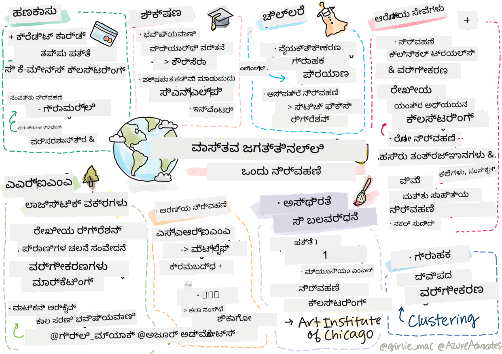

<!--
CO_OP_TRANSLATOR_METADATA:
{
  "original_hash": "83320d6b6994909e35d830cebf214039",
  "translation_date": "2025-12-19T15:08:34+00:00",
  "source_file": "9-Real-World/1-Applications/README.md",
  "language_code": "kn"
}
-->
# ಪೋಸ್ಟ್‌ಸ್ಕ್ರಿಪ್ಟ್: ನೈಜ ಜಗತ್ತಿನಲ್ಲಿ ಯಂತ್ರ ಅಧ್ಯಯನ

> ಸ್ಕೆಚ್‌ನೋಟ್: [ಟೊಮೊಮಿ ಇಮುರು](https://www.twitter.com/girlie_mac)

ಈ ಪಠ್ಯಕ್ರಮದಲ್ಲಿ, ನೀವು ತರಬೇತಿಗಾಗಿ ಡೇಟಾವನ್ನು ಸಿದ್ಧಪಡಿಸುವ ಮತ್ತು ಯಂತ್ರ ಅಧ್ಯಯನ ಮಾದರಿಗಳನ್ನು ರಚಿಸುವ ಅನೇಕ ವಿಧಾನಗಳನ್ನು ಕಲಿತಿದ್ದೀರಿ. ನೀವು ಶ್ರೇಣೀಕರಣ, ಗುಂಪುಬದ್ಧತೆ, ವರ್ಗೀಕರಣ, ನೈಸರ್ಗಿಕ ಭಾಷಾ ಪ್ರಕ್ರಿಯೆ ಮತ್ತು ಕಾಲ ಸರಣಿ ಮಾದರಿಗಳ ಸರಣಿಯನ್ನು ನಿರ್ಮಿಸಿದ್ದೀರಿ. ಅಭಿನಂದನೆಗಳು! ಈಗ, ನೀವು ಇದಕ್ಕೆ ಏನು ಉಪಯೋಗವಿದೆ ಎಂದು ಆಶ್ಚರ್ಯಪಡಬಹುದು... ಈ ಮಾದರಿಗಳ ನೈಜ ಜಗತ್ತಿನ ಅನ್ವಯಿಕೆಗಳು ಯಾವುವು?

ಕಂಪನಿಗಳಲ್ಲಿ ಹೆಚ್ಚಿನ ಆಸಕ್ತಿ ಆಕರ್ಷಿಸಿರುವುದು ಸಾಮಾನ್ಯವಾಗಿ ಡೀಪ್ ಲರ್ನಿಂಗ್ ಬಳಸುವ AI ಆಗಿದ್ದರೂ, ಶ್ರೇಣೀಕರಣ ಯಂತ್ರ ಅಧ್ಯಯನ ಮಾದರಿಗಳಿಗೆ ಇನ್ನೂ ಮೌಲ್ಯಯುತ ಅನ್ವಯಿಕೆಗಳಿವೆ. ನೀವು ಇವುಗಳಲ್ಲಿ ಕೆಲವು ಅನ್ವಯಿಕೆಗಳನ್ನು ಇಂದೇ ಬಳಸಬಹುದು! ಈ ಪಾಠದಲ್ಲಿ, ಎಂಟು ವಿಭಿನ್ನ ಕೈಗಾರಿಕೆಗಳು ಮತ್ತು ವಿಷಯ ಕ್ಷೇತ್ರಗಳು ಈ ಮಾದರಿಗಳನ್ನು ತಮ್ಮ ಅನ್ವಯಿಕೆಗಳನ್ನು ಹೆಚ್ಚು ಕಾರ್ಯಕ್ಷಮ, ನಂಬಿಕಯೋಗ್ಯ, ಬುದ್ಧಿವಂತ ಮತ್ತು ಬಳಕೆದಾರರಿಗೆ ಮೌಲ್ಯಯುತವಾಗಿಸಲು ಹೇಗೆ ಬಳಸುತ್ತವೆ ಎಂಬುದನ್ನು ನೀವು ಅನ್ವೇಷಿಸುವಿರಿ.

## [ಪೂರ್ವ-ಪಾಠ ಪರೀಕ್ಷೆ](https://ff-quizzes.netlify.app/en/ml/)

## 💰 ಹಣಕಾಸು

ಹಣಕಾಸು ಕ್ಷೇತ್ರವು ಯಂತ್ರ ಅಧ್ಯಯನಕ್ಕೆ ಅನೇಕ ಅವಕಾಶಗಳನ್ನು ಒದಗಿಸುತ್ತದೆ. ಈ ಕ್ಷೇತ್ರದ ಅನೇಕ ಸಮಸ್ಯೆಗಳು ಯಂತ್ರ ಅಧ್ಯಯನ ಬಳಸಿ ಮಾದರೀಕರಿಸಿ ಪರಿಹರಿಸಬಹುದಾಗಿದೆ.

### ಕ್ರೆಡಿಟ್ ಕಾರ್ಡ್ ಮೋಸ ಪತ್ತೆ

ನಾವು ಈ ಕೋರ್ಸ್‌ನಲ್ಲಿ ಮೊದಲು [ಕೆ-ಮೀನ್ಸ್ ಗುಂಪುಬದ್ಧತೆ](../../5-Clustering/2-K-Means/README.md) ಬಗ್ಗೆ ಕಲಿತಿದ್ದೇವೆ, ಆದರೆ ಇದನ್ನು ಕ್ರೆಡಿಟ್ ಕಾರ್ಡ್ ಮೋಸ ಸಂಬಂಧಿತ ಸಮಸ್ಯೆಗಳನ್ನು ಹೇಗೆ ಪರಿಹರಿಸಲು ಬಳಸಬಹುದು?

ಕೆ-ಮೀನ್ಸ್ ಗುಂಪುಬದ್ಧತೆ ಕ್ರೆಡಿಟ್ ಕಾರ್ಡ್ ಮೋಸ ಪತ್ತೆ ತಂತ್ರದಲ್ಲಿ **ಔಟ್‌ಲೈಯರ್ ಪತ್ತೆ** ಎಂದು ಕರೆಯಲ್ಪಡುವ ತಂತ್ರದಲ್ಲಿ ಸಹಾಯಕವಾಗುತ್ತದೆ. ಔಟ್‌ಲೈಯರ್‌ಗಳು ಅಥವಾ ಡೇಟಾ ಸೆಟ್‌ನ ವೀಕ್ಷಣೆಗಳಲ್ಲಿ ವ್ಯತ್ಯಾಸಗಳು, ಕ್ರೆಡಿಟ್ ಕಾರ್ಡ್ ಸಾಮಾನ್ಯವಾಗಿ ಬಳಸಲಾಗುತ್ತಿದೆಯೇ ಅಥವಾ ಏನಾದರೂ ಅಸಾಮಾನ್ಯವಾಗುತ್ತಿದೆಯೇ ಎಂದು ತಿಳಿಸುವುದಕ್ಕೆ ಸಹಾಯ ಮಾಡುತ್ತವೆ. ಕೆಳಗಿನ ಕಾಗದದಲ್ಲಿ ತೋರಿಸಿದಂತೆ, ನೀವು ಕೆ-ಮೀನ್ಸ್ ಗುಂಪುಬದ್ಧತೆ ಆಲ್ಗಾರಿದಮ್ ಬಳಸಿ ಕ್ರೆಡಿಟ್ ಕಾರ್ಡ್ ಡೇಟಾವನ್ನು ವರ್ಗೀಕರಿಸಿ, ಪ್ರತಿ ವ್ಯವಹಾರವನ್ನು ಅದು ಎಷ್ಟು ಔಟ್‌ಲೈಯರ್ ಆಗಿದೆ ಎಂಬುದರ ಆಧಾರದ ಮೇಲೆ ಗುಂಪಿಗೆ ನಿಯೋಜಿಸಬಹುದು. ನಂತರ, ಮೋಸ ಮತ್ತು ಕಾನೂನುಬದ್ಧ ವ್ಯವಹಾರಗಳಿಗಾಗಿ ಅತಿ ಅಪಾಯಕಾರಿಯಾದ ಗುಂಪುಗಳನ್ನು ಮೌಲ್ಯಮಾಪನ ಮಾಡಬಹುದು.
[ಉಲ್ಲೇಖ](https://citeseerx.ist.psu.edu/viewdoc/download?doi=10.1.1.680.1195&rep=rep1&type=pdf)

### ಸಂಪತ್ತು ನಿರ್ವಹಣೆ

ಸಂಪತ್ತು ನಿರ್ವಹಣೆಯಲ್ಲಿ, ವ್ಯಕ್ತಿ ಅಥವಾ ಸಂಸ್ಥೆ ತಮ್ಮ ಗ್ರಾಹಕರ ಪರವಾಗಿ ಹೂಡಿಕೆಗಳನ್ನು ನಿರ್ವಹಿಸುತ್ತಾರೆ. ಅವರ ಕೆಲಸವು ದೀರ್ಘಕಾಲಿಕವಾಗಿ ಸಂಪತ್ತನ್ನು ಉಳಿಸಿ ಬೆಳೆಯಿಸುವುದಾಗಿದೆ, ಆದ್ದರಿಂದ ಉತ್ತಮ ಪ್ರದರ್ಶನ ನೀಡುವ ಹೂಡಿಕೆಗಳನ್ನು ಆಯ್ಕೆ ಮಾಡುವುದು ಅತ್ಯಾವಶ್ಯಕ.

ನಿರ್ದಿಷ್ಟ ಹೂಡಿಕೆಯು ಹೇಗೆ ಕಾರ್ಯನಿರ್ವಹಿಸುತ್ತದೆ ಎಂಬುದನ್ನು ಅಂದಾಜಿಸಲು ಒಂದು ವಿಧಾನವು ಸಾಂಖ್ಯಿಕ ಶ್ರೇಣೀಕರಣ. [ರೇಖೀಯ ಶ್ರೇಣೀಕರಣ](../../2-Regression/1-Tools/README.md) ಒಂದು ಉಪಯುಕ್ತ ಸಾಧನವಾಗಿದೆ, ಇದು ನಿಧಿಯು ಕೆಲವು ಮಾನದಂಡದ ಹೋಲಿಕೆಯಲ್ಲಿ ಹೇಗೆ ಕಾರ್ಯನಿರ್ವಹಿಸುತ್ತದೆ ಎಂಬುದನ್ನು ಅರ್ಥಮಾಡಿಕೊಳ್ಳಲು ಸಹಾಯ ಮಾಡುತ್ತದೆ. ನಾವು ಶ್ರೇಣೀಕರಣದ ಫಲಿತಾಂಶಗಳು ಸಾಂಖ್ಯಿಕವಾಗಿ ಮಹತ್ವಪೂರ್ಣವೋ ಅಥವಾ ಗ್ರಾಹಕರ ಹೂಡಿಕೆಗಳಿಗೆ ಎಷ್ಟು ಪರಿಣಾಮ ಬೀರುತ್ತವೋ ಎಂದು ನಿರ್ಧರಿಸಬಹುದು. ನೀವು ಬಹುಶ್ರೇಣೀಕರಣ ಬಳಸಿ ನಿಮ್ಮ ವಿಶ್ಲೇಷಣೆಯನ್ನು ಇನ್ನಷ್ಟು ವಿಸ್ತರಿಸಬಹುದು, ಅಲ್ಲಿ ಹೆಚ್ಚುವರಿ ಅಪಾಯ ಅಂಶಗಳನ್ನು ಪರಿಗಣಿಸಬಹುದು. ನಿರ್ದಿಷ್ಟ ನಿಧಿಗೆ ಇದು ಹೇಗೆ ಕೆಲಸ ಮಾಡುತ್ತದೆ ಎಂಬ ಉದಾಹರಣೆಗೆ, ಕೆಳಗಿನ ಕಾಗದವನ್ನು ನೋಡಿ, ಇದು ಶ್ರೇಣೀಕರಣ ಬಳಸಿ ನಿಧಿ ಕಾರ್ಯಕ್ಷಮತೆಯನ್ನು ಮೌಲ್ಯಮಾಪನ ಮಾಡುತ್ತದೆ.
[ಉಲ್ಲೇಖ](http://www.brightwoodventures.com/evaluating-fund-performance-using-regression/)

## 🎓 ಶಿಕ್ಷಣ

ಶಿಕ್ಷಣ ಕ್ಷೇತ್ರವೂ ಯಂತ್ರ ಅಧ್ಯಯನ ಅನ್ವಯಿಸಲು ಬಹಳ ಆಸಕ್ತಿದಾಯಕ ಕ್ಷೇತ್ರವಾಗಿದೆ. ಪರೀಕ್ಷೆಗಳಲ್ಲಿ ಅಥವಾ ಪ್ರಬಂಧಗಳಲ್ಲಿ ನಕಲಿ ಪತ್ತೆ ಮಾಡುವುದು ಅಥವಾ ತಿದ್ದುಪಡಿ ಪ್ರಕ್ರಿಯೆಯಲ್ಲಿ ಅನೈಚ್ಛಿಕ ಅಥವಾ ಉದ್ದೇಶಿತ ಪಕ್ಷಪಾತವನ್ನು ನಿರ್ವಹಿಸುವಂತಹ ಸಮಸ್ಯೆಗಳು ಇವೆ.

### ವಿದ್ಯಾರ್ಥಿ ವರ್ತನೆ ಭವಿಷ್ಯವಾಣಿ

[ಕೋರ್ಸೆರಾ](https://coursera.com), ಒಂದು ಆನ್‌ಲೈನ್ ಮುಕ್ತ ಕೋರ್ಸ್ ಪೂರೈಕೆದಾರ, ತಮ್ಮ ತಂತ್ರಜ್ಞಾನ ಬ್ಲಾಗ್‌ನಲ್ಲಿ ಅನೇಕ ಎಂಜಿನಿಯರಿಂಗ್ ನಿರ್ಧಾರಗಳನ್ನು ಚರ್ಚಿಸುತ್ತಾರೆ. ಈ ಪ್ರಕರಣ ಅಧ್ಯಯನದಲ್ಲಿ, ಅವರು ಕಡಿಮೆ NPS (ನೆಟ್ ಪ್ರೊಮೋಟರ್ ಸ್ಕೋರ್) ರೇಟಿಂಗ್ ಮತ್ತು ಕೋರ್ಸ್ ಉಳಿಸುವಿಕೆ ಅಥವಾ ಬಿಟ್ಟುಹೋಗುವಿಕೆಗೆ ಯಾವುದೇ ಸಂಬಂಧವಿದೆಯೇ ಎಂದು ಅನ್ವೇಷಿಸಲು ಶ್ರೇಣೀಕರಣ ರೇಖೆಯನ್ನು ಚಿತ್ರಿಸಿದ್ದಾರೆ.
[ಉಲ್ಲೇಖ](https://medium.com/coursera-engineering/controlled-regression-quantifying-the-impact-of-course-quality-on-learner-retention-31f956bd592a)

### ಪಕ್ಷಪಾತ ಕಡಿಮೆ ಮಾಡುವುದು

[ಗ್ರಾಮ್ಮರ್ಲಿ](https://grammarly.com), ಒಂದು ಬರವಣಿಗೆ ಸಹಾಯಕ, ತನ್ನ ಉತ್ಪನ್ನಗಳಲ್ಲಿ ಸುಧಾರಿತ [ನೈಸರ್ಗಿಕ ಭಾಷಾ ಪ್ರಕ್ರಿಯೆ ವ್ಯವಸ್ಥೆಗಳನ್ನು](../../6-NLP/README.md) ಬಳಸುತ್ತದೆ. ಅವರು ತಮ್ಮ ತಂತ್ರಜ್ಞಾನ ಬ್ಲಾಗ್‌ನಲ್ಲಿ ಯಂತ್ರ ಅಧ್ಯಯನದಲ್ಲಿ ಲಿಂಗ ಪಕ್ಷಪಾತವನ್ನು ಹೇಗೆ ನಿರ್ವಹಿಸಿದರೋ ಎಂಬುದರ ಬಗ್ಗೆ ಆಸಕ್ತಿದಾಯಕ ಪ್ರಕರಣ ಅಧ್ಯಯನವನ್ನು ಪ್ರಕಟಿಸಿದ್ದಾರೆ, ಇದು ನಮ್ಮ [ಪರಿಚಯಾತ್ಮಕ ನ್ಯಾಯತೆಯ ಪಾಠದಲ್ಲಿ](../../1-Introduction/3-fairness/README.md) ನೀವು ಕಲಿತಿದ್ದೀರಿ.
[ಉಲ್ಲೇಖ](https://www.grammarly.com/blog/engineering/mitigating-gender-bias-in-autocorrect/)

## 👜 ಚಿಲ್ಲರೆ ವ್ಯಾಪಾರ

ಚಿಲ್ಲರೆ ವ್ಯಾಪಾರ ಕ್ಷೇತ್ರವು ಯಂತ್ರ ಅಧ್ಯಯನದಿಂದ ಬಹುಮಾನ ಪಡೆಯಬಹುದು, ಉತ್ತಮ ಗ್ರಾಹಕ ಪ್ರಯಾಣವನ್ನು ರಚಿಸುವುದರಿಂದ ಹಿಡಿದು ಸರಕಿನ ಸಂಗ್ರಹಣೆಯನ್ನು ಸೂಕ್ತ ರೀತಿಯಲ್ಲಿ ನಿರ್ವಹಿಸುವವರೆಗೆ.

### ಗ್ರಾಹಕ ಪ್ರಯಾಣ ವೈಯಕ್ತೀಕರಣ

ವೇಫೇರ್‌ನಲ್ಲಿ, ಮನೆ ಸಾಮಗ್ರಿಗಳನ್ನು ಮಾರುವ ಕಂಪನಿಯಲ್ಲಿ, ಗ್ರಾಹಕರಿಗೆ ಅವರ ರುಚಿ ಮತ್ತು ಅಗತ್ಯಗಳಿಗೆ ತಕ್ಕ ಸರಿಯಾದ ಉತ್ಪನ್ನಗಳನ್ನು ಕಂಡುಹಿಡಿಯಲು ಸಹಾಯ ಮಾಡುವುದು ಅತ್ಯಂತ ಮುಖ್ಯ. ಈ ಲೇಖನದಲ್ಲಿ, ಕಂಪನಿಯ ಎಂಜಿನಿಯರ್‌ಗಳು ಯಂತ್ರ ಅಧ್ಯಯನ ಮತ್ತು NLP ಅನ್ನು "ಗ್ರಾಹಕರಿಗೆ ಸರಿಯಾದ ಫಲಿತಾಂಶಗಳನ್ನು ತಲುಪಿಸಲು" ಹೇಗೆ ಬಳಸುತ್ತಾರೆ ಎಂದು ವಿವರಿಸಿದ್ದಾರೆ. ವಿಶೇಷವಾಗಿ, ಅವರ ಕ್ವೇರಿ ಇಂಟೆಂಟ್ ಎಂಜಿನ್ ಎಂಟಿಟಿ ಎಕ್ಸ್ಟ್ರಾಕ್ಷನ್, ವರ್ಗೀಕರಣ ತರಬೇತಿ, ಆಸ್ತಿ ಮತ್ತು ಅಭಿಪ್ರಾಯ ಎಕ್ಸ್ಟ್ರಾಕ್ಷನ್, ಮತ್ತು ಗ್ರಾಹಕ ವಿಮರ್ಶೆಗಳಲ್ಲಿ ಭಾವನೆ ಟ್ಯಾಗಿಂಗ್ ಅನ್ನು ಬಳಸುವಂತೆ ನಿರ್ಮಿಸಲಾಗಿದೆ. ಇದು ಆನ್‌ಲೈನ್ ಚಿಲ್ಲರೆ ವ್ಯಾಪಾರದಲ್ಲಿ NLP ಹೇಗೆ ಕೆಲಸ ಮಾಡುತ್ತದೆ ಎಂಬ ಕ್ಲಾಸಿಕ್ ಉದಾಹರಣೆ.
[ಉಲ್ಲೇಖ](https://www.aboutwayfair.com/tech-innovation/how-we-use-machine-learning-and-natural-language-processing-to-empower-search)

### ಸರಕಿನ ನಿರ್ವಹಣೆ

[ಸ್ಟಿಚ್ಫಿಕ್ಸ್](https://stitchfix.com) ಎಂಬ, ಗ್ರಾಹಕರಿಗೆ ಬಟ್ಟೆಗಳನ್ನು ಕಳುಹಿಸುವ ಬಾಕ್ಸ್ ಸೇವೆ, ಶಿಫಾರಸುಗಳು ಮತ್ತು ಸರಕಿನ ನಿರ್ವಹಣೆಗೆ ಯಂತ್ರ ಅಧ್ಯಯನವನ್ನು ಬಹಳಷ್ಟು ಅವಲಂಬಿಸಿದೆ. ಅವರ ಶೈಲಿಯ ತಂಡಗಳು ಮಾರಾಟ ತಂಡಗಳೊಂದಿಗೆ ಸಹಕರಿಸುತ್ತವೆ: "ನಮ್ಮ ಡೇಟಾ ವಿಜ್ಞಾನಿಗಳಲ್ಲಿ ಒಬ್ಬರು ಜನ್ಯ ಆಲ್ಗಾರಿದಮ್‌ನೊಂದಿಗೆ ಪ್ರಯೋಗ ಮಾಡಿ, ಇಂದಿನ ದಿನದಲ್ಲಿ ಇಲ್ಲದ ಯಶಸ್ವಿ ಬಟ್ಟೆಯನ್ನು ಭವಿಷ್ಯವಾಣಿ ಮಾಡಲು ಅದನ್ನು ಬಟ್ಟೆಗಳಿಗೆ ಅನ್ವಯಿಸಿದರು. ನಾವು ಅದನ್ನು ಮಾರಾಟ ತಂಡಕ್ಕೆ ತಂದುಕೊಟ್ಟಿದ್ದೇವೆ ಮತ್ತು ಈಗ ಅವರು ಅದನ್ನು ಉಪಕರಣವಾಗಿ ಬಳಸಬಹುದು."
[ಉಲ್ಲೇಖ](https://www.zdnet.com/article/how-stitch-fix-uses-machine-learning-to-master-the-science-of-styling/)

## 🏥 ಆರೋಗ್ಯ ಸೇವೆ

ಆರೋಗ್ಯ ಸೇವೆ ಕ್ಷೇತ್ರವು ಸಂಶೋಧನಾ ಕಾರ್ಯಗಳನ್ನು ಮತ್ತು ರೋಗಿಗಳನ್ನು ಮರುಪ್ರವೇಶಿಸುವಂತಹ ಲಾಜಿಸ್ಟಿಕ್ ಸಮಸ್ಯೆಗಳನ್ನು ಸುಧಾರಿಸಲು ಯಂತ್ರ ಅಧ್ಯಯನವನ್ನು ಬಳಸಬಹುದು.

### ಕ್ಲಿನಿಕಲ್ ಟ್ರಯಲ್‌ಗಳ ನಿರ್ವಹಣೆ

ಕ್ಲಿನಿಕಲ್ ಟ್ರಯಲ್‌ಗಳಲ್ಲಿ ವಿಷಕಾರಕತೆ ಔಷಧಿ ತಯಾರಕರಿಗೆ ಪ್ರಮುಖ ಚಿಂತೆ. ಎಷ್ಟು ವಿಷಕಾರಕತೆ ಸಹಿಸಬಹುದೆ? ಈ ಅಧ್ಯಯನದಲ್ಲಿ, ವಿವಿಧ ಕ್ಲಿನಿಕಲ್ ಟ್ರಯಲ್ ವಿಧಾನಗಳನ್ನು ವಿಶ್ಲೇಷಿಸಿ, ಕ್ಲಿನಿಕಲ್ ಟ್ರಯಲ್ ಫಲಿತಾಂಶಗಳ ಸಾಧ್ಯತೆಗಳನ್ನು ಭವಿಷ್ಯವಾಣಿ ಮಾಡಲು ಹೊಸ ವಿಧಾನವನ್ನು ಅಭಿವೃದ್ಧಿಪಡಿಸಲಾಗಿದೆ. ವಿಶೇಷವಾಗಿ, ಅವರು ರ್ಯಾಂಡಮ್ ಫಾರೆಸ್ಟ್ ಬಳಸಿ [ವರ್ಗೀಕರಣ](../../4-Classification/README.md) ಮಾಡಬಹುದಾದ ಮಾದರಿಯನ್ನು ರಚಿಸಿದ್ದಾರೆ, ಇದು ಔಷಧಿ ಗುಂಪುಗಳನ್ನು ವಿಭಜಿಸಲು ಸಹಾಯ ಮಾಡುತ್ತದೆ.
[ಉಲ್ಲೇಖ](https://www.sciencedirect.com/science/article/pii/S2451945616302914)

### ಆಸ್ಪತ್ರೆ ಮರುಪ್ರವೇಶ ನಿರ್ವಹಣೆ

ಆಸ್ಪತ್ರೆ ಸೇವೆ ದುಬಾರಿ, ವಿಶೇಷವಾಗಿ ರೋಗಿಗಳನ್ನು ಮರುಪ್ರವೇಶಿಸಬೇಕಾದಾಗ. ಈ ಕಾಗದವು ಯಂತ್ರ ಅಧ್ಯಯನ ಬಳಸಿ ಮರುಪ್ರವೇಶ ಸಾಧ್ಯತೆಯನ್ನು ಭವಿಷ್ಯವಾಣಿ ಮಾಡುವ ಕಂಪನಿಯ ಬಗ್ಗೆ ಚರ್ಚಿಸುತ್ತದೆ, [ಗುಂಪುಬದ್ಧತೆ](../../5-Clustering/README.md) ಆಲ್ಗಾರಿದಮ್‌ಗಳನ್ನು ಬಳಸಿಕೊಂಡು. ಈ ಗುಂಪುಗಳು ವಿಶ್ಲೇಷಕರಿಗೆ "ಸಾಮಾನ್ಯ ಕಾರಣವನ್ನು ಹಂಚಿಕೊಳ್ಳಬಹುದಾದ ಮರುಪ್ರವೇಶ ಗುಂಪುಗಳನ್ನು ಕಂಡುಹಿಡಿಯಲು" ಸಹಾಯ ಮಾಡುತ್ತವೆ.
[ಉಲ್ಲೇಖ](https://healthmanagement.org/c/healthmanagement/issuearticle/hospital-readmissions-and-machine-learning)

### ರೋಗ ನಿರ್ವಹಣೆ

ಇತ್ತೀಚಿನ ಮಹಾಮಾರಿ ಯಂತ್ರ ಅಧ್ಯಯನವು ರೋಗ ಹರಡುವಿಕೆಯನ್ನು ತಡೆಯಲು ಹೇಗೆ ಸಹಾಯ ಮಾಡಬಹುದು ಎಂಬುದರ ಮೇಲೆ ಬೆಳಕು ಚೆಲ್ಲಿದೆ. ಈ ಲೇಖನದಲ್ಲಿ, ನೀವು ARIMA, ಲಾಜಿಸ್ಟಿಕ್ ವಕ್ರಗಳು, ರೇಖೀಯ ಶ್ರೇಣೀಕರಣ ಮತ್ತು SARIMA ಬಳಕೆಯನ್ನು ಗುರುತಿಸಬಹುದು. "ಈ ಕೆಲಸವು ಈ ವೈರಸ್ ಹರಡುವಿಕೆಯನ್ನು ಲೆಕ್ಕಹಾಕಲು ಮತ್ತು ಹೀಗಾಗಿ ಸಾವುಗಳು, ಗುಣಮುಖತೆಗಳು ಮತ್ತು ದೃಢೀಕೃತ ಪ್ರಕರಣಗಳನ್ನು ಭವಿಷ್ಯವಾಣಿ ಮಾಡಲು ಪ್ರಯತ್ನವಾಗಿದೆ, ಇದರಿಂದ ನಾವು ಉತ್ತಮವಾಗಿ ಸಿದ್ಧರಾಗಲು ಮತ್ತು ಬದುಕಲು ಸಹಾಯವಾಗುತ್ತದೆ."
[ಉಲ್ಲೇಖ](https://www.ncbi.nlm.nih.gov/pmc/articles/PMC7979218/)

## 🌲 ಪರಿಸರ ಮತ್ತು ಹಸಿರು ತಂತ್ರಜ್ಞಾನ

ಪ್ರಕೃತಿ ಮತ್ತು ಪರಿಸರವು ಅನೇಕ ಸಂವೇದನಾಶೀಲ ವ್ಯವಸ್ಥೆಗಳನ್ನು ಒಳಗೊಂಡಿವೆ, ಅಲ್ಲಿ ಪ್ರಾಣಿಗಳು ಮತ್ತು ಪ್ರಕೃತಿಯ ನಡುವಿನ ಪರಸ್ಪರ ಕ್ರಿಯೆ ಮುಖ್ಯವಾಗುತ್ತದೆ. ಈ ವ್ಯವಸ್ಥೆಗಳನ್ನು ನಿಖರವಾಗಿ ಅಳೆಯುವುದು ಮತ್ತು ಏನಾದರೂ ಸಂಭವಿಸಿದರೆ, ಉದಾಹರಣೆಗೆ ಕಾಡು ಬೆಂಕಿ ಅಥವಾ ಪ್ರಾಣಿ ಜನಸಂಖ್ಯೆಯ ಕುಸಿತ, ಸೂಕ್ತವಾಗಿ ಕ್ರಮ ಕೈಗೊಳ್ಳುವುದು ಮುಖ್ಯ.

### ಕಾಡು ನಿರ್ವಹಣೆ

ನೀವು ಹಿಂದಿನ ಪಾಠಗಳಲ್ಲಿ [ರೀಇನ್ಫೋರ್ಸ್ಮೆಂಟ್ ಲರ್ನಿಂಗ್](../../8-Reinforcement/README.md) ಬಗ್ಗೆ ಕಲಿತಿದ್ದೀರಿ. ಇದು ಪ್ರಕೃತಿಯಲ್ಲಿ ಮಾದರಿಗಳನ್ನು ಭವಿಷ್ಯವಾಣಿ ಮಾಡಲು ಬಹಳ ಉಪಯುಕ್ತವಾಗಬಹುದು. ವಿಶೇಷವಾಗಿ, ಇದು ಕಾಡು ಬೆಂಕಿ ಮತ್ತು ಆಕ್ರಮಣಕಾರಿ ಪ್ರಭೇದಗಳ ಹರಡುವಿಕೆಯನ್ನು ಟ್ರ್ಯಾಕ್ ಮಾಡಲು ಬಳಸಬಹುದು. ಕೆನಡಾದಲ್ಲಿ, ಸಂಶೋಧಕರ ಗುಂಪು ರೀಇನ್ಫೋರ್ಸ್ಮೆಂಟ್ ಲರ್ನಿಂಗ್ ಬಳಸಿ ಉಪಗ್ರಹ ಚಿತ್ರಗಳಿಂದ ಕಾಡು ಬೆಂಕಿ ಗತಿಶೀಲತೆ ಮಾದರಿಗಳನ್ನು ನಿರ್ಮಿಸಿದ್ದಾರೆ. "ಸ್ಥಳೀಯವಾಗಿ ಹರಡುವ ಪ್ರಕ್ರಿಯೆ (SSP)" ಎಂಬ ನವೀನ ವಿಧಾನವನ್ನು ಬಳಸಿ, ಅವರು ಕಾಡು ಬೆಂಕಿಯನ್ನು "ಭೂದೃಶ್ಯದಲ್ಲಿ ಯಾವುದೇ ಸೆಲ್‌ನಲ್ಲಿ ಏಜೆಂಟ್" ಎಂದು ಕಲ್ಪಿಸಿದ್ದಾರೆ. "ಬೆಂಕಿ ಯಾವುದೇ ಸಮಯದಲ್ಲಿ ಉತ್ತರ, ದಕ್ಷಿಣ, ಪೂರ್ವ ಅಥವಾ ಪಶ್ಚಿಮಕ್ಕೆ ಹರಡಬಹುದು ಅಥವಾ ಹರಡದಿರಬಹುದು."

ಈ ವಿಧಾನವು ಸಾಮಾನ್ಯ RL ವ್ಯವಸ್ಥೆಯನ್ನು ತಿರುಗಿಸುತ್ತದೆ ಏಕೆಂದರೆ ಸಂಬಂಧಿತ ಮಾರ್ಕೋವ್ ನಿರ್ಧಾರ ಪ್ರಕ್ರಿಯೆಯ (MDP) ಗತಿಶೀಲತೆ ತಕ್ಷಣದ ಕಾಡು ಬೆಂಕಿ ಹರಡುವಿಕೆಗೆ ತಿಳಿದಿರುವ ಕಾರ್ಯವಾಗಿದೆ." ಈ ಗುಂಪು ಬಳಸಿದ ಕ್ಲಾಸಿಕ್ ಆಲ್ಗಾರಿದಮ್‌ಗಳ ಬಗ್ಗೆ ಹೆಚ್ಚಿನ ಮಾಹಿತಿಗಾಗಿ ಕೆಳಗಿನ ಲಿಂಕ್ ನೋಡಿ.
[ಉಲ್ಲೇಖ](https://www.frontiersin.org/articles/10.3389/fict.2018.00006/full)

### ಪ್ರಾಣಿಗಳ ಚಲನೆ ಸಂವೇದನೆ

ಡೀಪ್ ಲರ್ನಿಂಗ್ ಪ್ರಾಣಿಗಳ ಚಲನೆಗಳನ್ನು ದೃಶ್ಯವಾಗಿ ಟ್ರ್ಯಾಕ್ ಮಾಡುವಲ್ಲಿ ಕ್ರಾಂತಿ ತಂದಿದ್ದರೂ (ನೀವು ನಿಮ್ಮದೇ [ಪೋಲರ್ ಬೆರ್ ಟ್ರ್ಯಾಕರ್](https://docs.microsoft.com/learn/modules/build-ml-model-with-azure-stream-analytics/?WT.mc_id=academic-77952-leestott) ಅನ್ನು ಇಲ್ಲಿ ನಿರ್ಮಿಸಬಹುದು), ಕ್ಲಾಸಿಕ್ ಯಂತ್ರ ಅಧ್ಯಯನ ಈ ಕಾರ್ಯದಲ್ಲಿ ಇನ್ನೂ ಸ್ಥಾನ ಹೊಂದಿದೆ.

ಕೃಷಿ ಪ್ರಾಣಿಗಳ ಚಲನೆಗಳನ್ನು ಟ್ರ್ಯಾಕ್ ಮಾಡಲು ಸೆನ್ಸಾರ್‌ಗಳು ಮತ್ತು IoT ಈ ರೀತಿಯ ದೃಶ್ಯ ಪ್ರಕ್ರಿಯೆಯನ್ನು ಬಳಸುತ್ತವೆ, ಆದರೆ ಮೂಲಭೂತ ಯಂತ್ರ ಅಧ್ಯಯನ ತಂತ್ರಗಳು ಡೇಟಾ ಪೂರ್ವಸಿದ್ಧತೆಗೆ ಉಪಯುಕ್ತವಾಗಿವೆ. ಉದಾಹರಣೆಗೆ, ಈ ಕಾಗದದಲ್ಲಿ ಕುರಿಗಳ ಸ್ಥಿತಿಗಳನ್ನು ವಿವಿಧ ವರ್ಗೀಕರಣ ಆಲ್ಗಾರಿದಮ್‌ಗಳ ಬಳಕೆಯಿಂದ ಮೇಲ್ವಿಚಾರಣೆ ಮತ್ತು ವಿಶ್ಲೇಷಣೆ ಮಾಡಲಾಗಿದೆ. ನೀವು ಪುಟ 335 ರಲ್ಲಿ ROC ವಕ್ರವನ್ನು ಗುರುತಿಸಬಹುದು.
[ಉಲ್ಲೇಖ](https://druckhaus-hofmann.de/gallery/31-wj-feb-2020.pdf)

### ⚡️ ಶಕ್ತಿ ನಿರ್ವಹಣೆ

ನಮ್ಮ [ಕಾಲ ಸರಣಿ ಭವಿಷ್ಯವಾಣಿ](../../7-TimeSeries/README.md) ಪಾಠಗಳಲ್ಲಿ, ನಾವು ಸರಬರಾಜು ಮತ್ತು ಬೇಡಿಕೆಯನ್ನು ಅರ್ಥಮಾಡಿಕೊಂಡು ಪಟ್ಟಣಕ್ಕೆ ಆದಾಯ ತರುವ ಸ್ಮಾರ್ಟ್ ಪಾರ್ಕಿಂಗ್ ಮೀಟರ್‌ಗಳ ಕಲ್ಪನೆಯನ್ನು ಉಲ್ಲೇಖಿಸಿದ್ದೇವೆ. ಈ ಲೇಖನದಲ್ಲಿ, ಐರ್ಲೆಂಡ್‌ನಲ್ಲಿ ಸ್ಮಾರ್ಟ್ ಮೀಟರಿಂಗ್ ಆಧಾರಿತ ಭವಿಷ್ಯದ ಶಕ್ತಿ ಬಳಕೆಯನ್ನು ಭವಿಷ್ಯವಾಣಿ ಮಾಡಲು ಗುಂಪುಬದ್ಧತೆ, ಶ್ರೇಣೀಕರಣ ಮತ್ತು ಕಾಲ ಸರಣಿ ಭವಿಷ್ಯವಾಣಿ ಹೇಗೆ ಸಂಯೋಜಿತವಾಗಿವೆ ಎಂಬುದನ್ನು ವಿವರಿಸಲಾಗಿದೆ.
[ಉಲ್ಲೇಖ](https://www-cdn.knime.com/sites/default/files/inline-images/knime_bigdata_energy_timeseries_whitepaper.pdf)

## 💼 ವಿಮೆ

ವಿಮೆ ಕ್ಷೇತ್ರವು ಸಹ ಯಂತ್ರ ಅಧ್ಯಯನವನ್ನು ಬಳಸಿಕೊಂಡು ಆರ್ಥಿಕ ಮತ್ತು ಅಕ್ಟ್ಯೂರಿಯಲ್ ಮಾದರಿಗಳನ್ನು ರಚಿಸಿ ಸುಧಾರಿಸುತ್ತದೆ.

### ಅಸ್ಥಿರತೆ ನಿರ್ವಹಣೆ

ಮೆಟ್‌ಲೈಫ್, ಒಂದು ಜೀವ ವಿಮೆ ಪೂರೈಕೆದಾರ, ತಮ್ಮ ಆರ್ಥಿಕ ಮಾದರಿಗಳಲ್ಲಿನ ಅಸ್ಥಿರತೆಯನ್ನು ವಿಶ್ಲೇಷಿಸಿ ಕಡಿಮೆ ಮಾಡುವ ವಿಧಾನವನ್ನು ಮುಕ್ತವಾಗಿ ಹಂಚಿಕೊಳ್ಳುತ್ತದೆ. ಈ ಲೇಖನದಲ್ಲಿ ನೀವು ದ್ವಿಮೂಲಕ ಮತ್ತು ಕ್ರಮಬದ್ಧ ವರ್ಗೀಕರಣದ ದೃಶ್ಯೀಕರಣಗಳನ್ನು ಗಮನಿಸಬಹುದು. ನೀವು ಭವಿಷ್ಯವಾಣಿ ದೃಶ್ಯೀಕರಣಗಳನ್ನು ಕೂಡ ಕಂಡುಹಿಡಿಯುತ್ತೀರಿ.
[ಉಲ್ಲೇಖ](https://investments.metlife.com/content/dam/metlifecom/us/investments/insights/research-topics/macro-strategy/pdf/MetLifeInvestmentManagement_MachineLearnedRanking_070920.pdf)

## 🎨 ಕಲೆ, ಸಂಸ್ಕೃತಿ ಮತ್ತು ಸಾಹಿತ್ಯ

ಕಲೆಯಲ್ಲಿಯೂ, ಉದಾಹರಣೆಗೆ ಪತ್ರಿಕೋದ್ಯಮದಲ್ಲಿ, ಅನೇಕ ಆಸಕ್ತಿದಾಯಕ ಸಮಸ್ಯೆಗಳಿವೆ. ನಕಲಿ ಸುದ್ದಿಯನ್ನು ಪತ್ತೆಹಚ್ಚುವುದು ದೊಡ್ಡ ಸಮಸ್ಯೆ, ಏಕೆಂದರೆ ಇದು ಜನರ ಅಭಿಪ್ರಾಯವನ್ನು ಪ್ರಭಾವಿತಗೊಳಿಸುತ್ತದೆ ಮತ್ತು ಪ್ರಜಾಪ್ರಭುತ್ವಗಳನ್ನು ಕುಸಿತಗೊಳಿಸಬಹುದು. ಸಂಗ್ರಹಾಲಯಗಳು ಕೂಡ ವಸ್ತುಗಳ ನಡುವಿನ ಸಂಪರ್ಕಗಳನ್ನು ಕಂಡುಹಿಡಿಯುವುದರಿಂದ ಸಂಪನ್ಮೂಲ ಯೋಜನೆಗೆ ಯಂತ್ರ ಅಧ್ಯಯನದಿಂದ ಲಾಭ ಪಡೆಯಬಹುದು.

### ನಕಲಿ ಸುದ್ದಿ ಪತ್ತೆ

ಇಂದಿನ ಮಾಧ್ಯಮದಲ್ಲಿ ನಕಲಿ ಸುದ್ದಿಯನ್ನು ಪತ್ತೆಹಚ್ಚುವುದು ಬೆಕ್ಕು ಮತ್ತು ಇಲಿ ಆಟವಾಗಿದೆ. ಈ ಲೇಖನದಲ್ಲಿ, ಸಂಶೋಧಕರು ನಾವು ಕಲಿತ ಯಂತ್ರ ಅಧ್ಯಯನ ತಂತ್ರಗಳನ್ನು ಸಂಯೋಜಿಸಿ ಪರೀಕ್ಷಿಸಿ ಉತ್ತಮ ಮಾದರಿಯನ್ನು ನಿಯೋಜಿಸಬಹುದು ಎಂದು ಸೂಚಿಸಿದ್ದಾರೆ: "ಈ ವ್ಯವಸ್ಥೆ ನೈಸರ್ಗಿಕ ಭಾಷಾ ಪ್ರಕ್ರಿಯೆ ಆಧಾರಿತವಾಗಿದ್ದು, ಡೇಟಾದಿಂದ ಲಕ್ಷಣಗಳನ್ನು ತೆಗೆದುಹಾಕುತ್ತದೆ ಮತ್ತು ನಂತರ ಈ ಲಕ್ಷಣಗಳನ್ನು ನೈವ್ ಬೇಯ್ಸ್, ಸಪೋರ್ಟ್ ವೆಕ್ಟರ್ ಮಷೀನ್ (SVM), ರ್ಯಾಂಡಮ್ ಫಾರೆಸ್ಟ್ (RF), ಸ್ಟೋಚಾಸ್ಟಿಕ್ ಗ್ರೇಡಿಯಂಟ್ ಡಿಸೆಂಟ್ (SGD), ಮತ್ತು ಲಾಜಿಸ್ಟಿಕ್ ರಿಗ್ರೆಷನ್ (LR) ಮುಂತಾದ ಯಂತ್ರ ಅಧ್ಯಯನ ವರ್ಗೀಕರಣಗಳ ತರಬೇತಿಗೆ ಬಳಸಲಾಗುತ್ತದೆ."
[ಉಲ್ಲೇಖ](https://www.irjet.net/archives/V7/i6/IRJET-V7I6688.pdf)

ಈ ಲೇಖನವು ವಿಭಿನ್ನ ಯಂತ್ರ ಅಧ್ಯಯನ ಕ್ಷೇತ್ರಗಳನ್ನು ಸಂಯೋಜಿಸುವ ಮೂಲಕ ನಕಲಿ ಸುದ್ದಿಯ ಹರಡುವಿಕೆಯನ್ನು ತಡೆಯಲು ಮತ್ತು ನಿಜವಾದ ಹಾನಿಯನ್ನು ತಡೆಯಲು ಸಹಾಯ ಮಾಡುವ ಆಸಕ್ತಿದಾಯಕ ಫಲಿತಾಂಶಗಳನ್ನು ತರುತ್ತದೆ; ಈ ಸಂದರ್ಭದಲ್ಲಿ, COVID ಚಿಕಿತ್ಸೆಗಳ ಬಗ್ಗೆ ಹರಡುವ ಗಾಸಿಪ್‌ಗಳು ಹಿಂಸಾಚಾರಕ್ಕೆ ಪ್ರೇರಣೆ ನೀಡಿದವು.

### ಸಂಗ್ರಹಾಲಯ ಯಂತ್ರ ಅಧ್ಯಯನ

ಸಂಗ್ರಹಾಲಯಗಳು AI ಕ್ರಾಂತಿಯ ಮುಂಭಾಗದಲ್ಲಿವೆ, ಅಲ್ಲಿ ಸಂಗ್ರಹಗಳನ್ನು ವರ್ಗೀಕರಿಸುವುದು ಮತ್ತು ಡಿಜಿಟೈಸ್ ಮಾಡುವುದರಿಂದ ವಸ್ತುಗಳ ನಡುವಿನ ಸಂಪರ್ಕಗಳನ್ನು ಕಂಡುಹಿಡಿಯುವುದು ತಂತ್ರಜ್ಞಾನ ಅಭಿವೃದ್ಧಿಯೊಂದಿಗೆ ಸುಲಭವಾಗುತ್ತಿದೆ. [ಇನ್ ಕೋಡಿಸೆ ರೇಷಿಯೋ](https://www.sciencedirect.com/science/article/abs/pii/S0306457321001035#:~:text=1.,studies%20over%20large%20historical%20sources.) ಮುಂತಾದ ಯೋಜನೆಗಳು ವಾಟಿಕನ್ ಆರ್ಕೈವ್ಸ್ ಮುಂತಾದ ಅಪ್ರಾಪ್ಯ ಸಂಗ್ರಹಗಳ ರಹಸ್ಯಗಳನ್ನು ಅನಾವರಣಗೊಳಿಸಲು ಸಹಾಯ ಮಾಡುತ್ತಿವೆ. ಆದರೆ, ಸಂಗ್ರಹಾಲಯಗಳ ವ್ಯಾಪಾರ ಭಾಗವೂ ಯಂತ್ರ ಅಧ್ಯಯನ ಮಾದರಿಗಳಿಂದ ಲಾಭ ಪಡೆಯುತ್ತಿದೆ.

ಉದಾಹರಣೆಗೆ, ಚಿಕಾಗೋ ಆರ್ಟ್ ಇನ್ಸ್ಟಿಟ್ಯೂಟ್ ಮಾದರಿಗಳನ್ನು ನಿರ್ಮಿಸಿ ಪ್ರೇಕ್ಷಕರ ಆಸಕ್ತಿಯನ್ನು ಮತ್ತು ಅವರು ಪ್ರದರ್ಶನಗಳಿಗೆ ಯಾವಾಗ ಹಾಜರಾಗುತ್ತಾರೆ ಎಂಬುದನ್ನು ಭವಿಷ್ಯವಾಣಿ ಮಾಡುತ್ತದೆ. ಗುರಿಯು ಪ್ರತಿ ಬಾರಿ ಬಳಕೆದಾರರು ಸಂಗ್ರಹಾಲಯಕ್ಕೆ ಭೇಟಿ ನೀಡುವಾಗ ವೈಯಕ್ತಿಕ ಮತ್ತು ಸುಧಾರಿತ ಭೇಟಿ ಅನುಭವಗಳನ್ನು ಸೃಷ್ಟಿಸುವುದು. "2017 ಹಣಕಾಸು ವರ್ಷದಲ್ಲಿ, ಮಾದರಿ ಹಾಜರಾತಿ ಮತ್ತು ಪ್ರವೇಶಗಳನ್ನು 1 ಶೇಕಡಾ ನಿಖರತೆಯೊಳಗೆ ಭವಿಷ್ಯವಾಣಿ ಮಾಡಿತು ಎಂದು ಆಂಡ್ರ್ಯೂ ಸಿಮ್ನಿಕ್, ಚಿಕಾಗೋ ಆರ್ಟ್ ಇನ್ಸ್ಟಿಟ್ಯೂಟ್‌ನ ಹಿರಿಯ ಉಪಾಧ್ಯಕ್ಷರು ಹೇಳಿದ್ದಾರೆ."
[ಉಲ್ಲೇಖ](https://www.chicagobusiness.com/article/20180518/ISSUE01/180519840/art-institute-of-chicago-uses-data-to-make-exhibit-choices)

## 🏷 ಮಾರುಕಟ್ಟೆ

### ಗ್ರಾಹಕ ವಿಭಾಗೀಕರಣ

ಅತ್ಯಂತ ಪರಿಣಾಮಕಾರಿ ಮಾರುಕಟ್ಟೆ ತಂತ್ರಗಳು ವಿವಿಧ ಗುಂಪುಗಳ ಆಧಾರದ ಮೇಲೆ ಗ್ರಾಹಕರನ್ನು ವಿಭಿನ್ನ ರೀತಿಯಲ್ಲಿ ಗುರಿಯಾಗಿಸುತ್ತವೆ. ಈ ಲೇಖನದಲ್ಲಿ, ವಿಭಜಿತ ಮಾರುಕಟ್ಟೆಗೆ ಬೆಂಬಲ ನೀಡಲು ಗುಂಪುಬದ್ಧತೆ ಆಲ್ಗಾರಿದಮ್‌ಗಳ ಬಳಕೆಯನ್ನು ಚರ್ಚಿಸಲಾಗಿದೆ. ವಿಭಜಿತ ಮಾರುಕಟ್ಟೆ ಕಂಪನಿಗಳಿಗೆ ಬ್ರ್ಯಾಂಡ್ ಗುರುತನ್ನು ಸುಧಾರಿಸಲು, ಹೆಚ್ಚು ಗ್ರಾಹಕರಿಗೆ ತಲುಪಲು ಮತ್ತು ಹೆಚ್ಚು ಹಣ ಗಳಿಸಲು ಸಹಾಯ ಮಾಡುತ್ತದೆ.
[ಉಲ್ಲೇಖ](https://ai.inqline.com/machine-learning-for-marketing-customer-segmentation/)

## 🚀 ಸವಾಲು

ನೀವು ಈ ಪಠ್ಯಕ್ರಮದಲ್ಲಿ ಕಲಿತ ಕೆಲವು ತಂತ್ರಗಳನ್ನು ಉಪಯೋಗಿಸುವ ಮತ್ತೊಂದು ಕ್ಷೇತ್ರವನ್ನು ಗುರುತಿಸಿ, ಅದು ಯಂತ್ರ ಅಧ್ಯಯನವನ್ನು ಹೇಗೆ ಬಳಸುತ್ತದೆ ಎಂಬುದನ್ನು ಕಂಡುಹಿಡಿಯಿರಿ.
## [ಪೋಸ್ಟ್-ಲೆಕ್ಚರ್ ಕ್ವಿಜ್](https://ff-quizzes.netlify.app/en/ml/)

## ವಿಮರ್ಶೆ ಮತ್ತು ಸ್ವಯಂ ಅಧ್ಯಯನ

ವೇಫೇರ್ ಡೇಟಾ ಸೈನ್ಸ್ ತಂಡವು ತಮ್ಮ ಕಂಪನಿಯಲ್ಲಿ ಎಂಎಲ್ ಅನ್ನು ಹೇಗೆ ಬಳಸುತ್ತಾರೆ ಎಂಬುದರ ಬಗ್ಗೆ ಹಲವಾರು ಆಸಕ್ತಿದಾಯಕ ವೀಡಿಯೊಗಳನ್ನು ಹೊಂದಿದೆ. ಅದನ್ನು [ನೋಡುವುದು](https://www.youtube.com/channel/UCe2PjkQXqOuwkW1gw6Ameuw/videos) ಮೌಲ್ಯವಿದೆ!

## ನಿಯೋಜನೆ

[ಎಂಎಲ್ ಸ್ಕ್ಯಾವೆಂಜರ್ ಹಂಟ್](assignment.md)

---

<!-- CO-OP TRANSLATOR DISCLAIMER START -->
**ಅಸ್ವೀಕಾರ**:  
ಈ ದಸ್ತಾವೇಜು AI ಅನುವಾದ ಸೇವೆ [Co-op Translator](https://github.com/Azure/co-op-translator) ಬಳಸಿ ಅನುವಾದಿಸಲಾಗಿದೆ. ನಾವು ನಿಖರತೆಯಿಗಾಗಿ ಪ್ರಯತ್ನಿಸುತ್ತಿದ್ದರೂ, ಸ್ವಯಂಚಾಲಿತ ಅನುವಾದಗಳಲ್ಲಿ ತಪ್ಪುಗಳು ಅಥವಾ ಅಸತ್ಯತೆಗಳು ಇರಬಹುದು ಎಂದು ದಯವಿಟ್ಟು ಗಮನಿಸಿ. ಮೂಲ ಭಾಷೆಯಲ್ಲಿರುವ ಮೂಲ ದಸ್ತಾವೇಜನ್ನು ಅಧಿಕೃತ ಮೂಲವೆಂದು ಪರಿಗಣಿಸಬೇಕು. ಮಹತ್ವದ ಮಾಹಿತಿಗಾಗಿ, ವೃತ್ತಿಪರ ಮಾನವ ಅನುವಾದವನ್ನು ಶಿಫಾರಸು ಮಾಡಲಾಗುತ್ತದೆ. ಈ ಅನುವಾದ ಬಳಕೆಯಿಂದ ಉಂಟಾಗುವ ಯಾವುದೇ ತಪ್ಪು ಅರ್ಥಮಾಡಿಕೊಳ್ಳುವಿಕೆ ಅಥವಾ ತಪ್ಪು ವಿವರಣೆಗಳಿಗೆ ನಾವು ಹೊಣೆಗಾರರಾಗುವುದಿಲ್ಲ.
<!-- CO-OP TRANSLATOR DISCLAIMER END -->