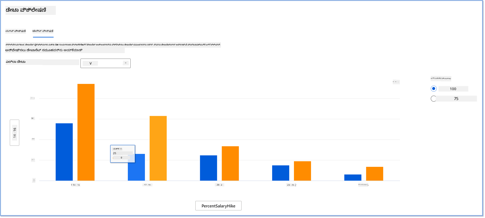
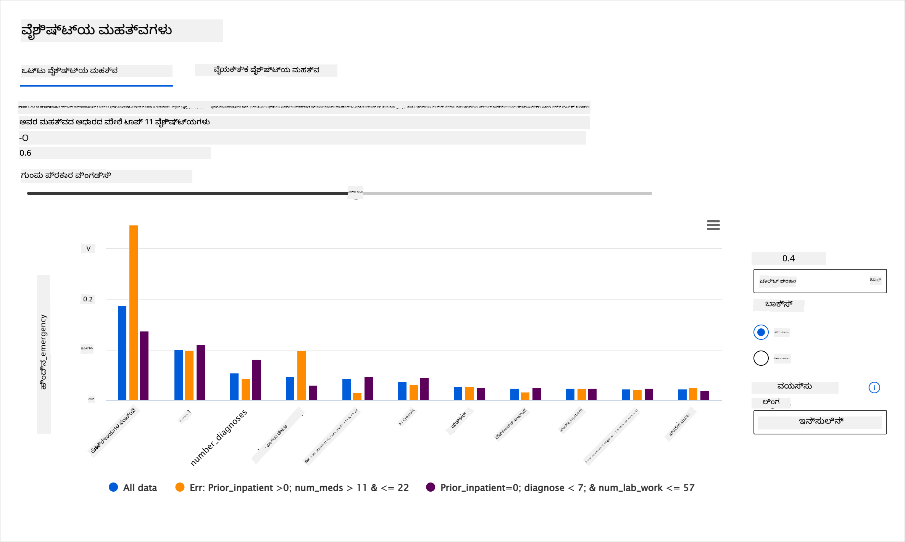

<!--
CO_OP_TRANSLATOR_METADATA:
{
  "original_hash": "df2b538e8fbb3e91cf0419ae2f858675",
  "translation_date": "2025-12-19T15:13:41+00:00",
  "source_file": "9-Real-World/2-Debugging-ML-Models/README.md",
  "language_code": "kn"
}
-->
# ಪೋಸ್ಟ್‌ಸ್ಕ್ರಿಪ್ಟ್: ಜವಾಬ್ದಾರಿಯುತ AI ಡ್ಯಾಶ್‌ಬೋರ್ಡ್ ಘಟಕಗಳನ್ನು ಬಳಸಿ ಯಂತ್ರ ಅಧ್ಯಯನದಲ್ಲಿ ಮಾದರಿ ಡಿಬಗಿಂಗ್

## [ಪೂರ್ವ-ಪಾಠ ಕ್ವಿಜ್](https://ff-quizzes.netlify.app/en/ml/)

## ಪರಿಚಯ

ಯಂತ್ರ ಅಧ್ಯಯನವು ನಮ್ಮ ದೈನಂದಿನ ಜೀವನವನ್ನು ಪ್ರಭಾವಿಸುತ್ತದೆ. AI ನಮ್ಮನ್ನು ವ್ಯಕ್ತಿಗಳಾಗಿ ಮತ್ತು ಸಮಾಜವಾಗಿ ಪ್ರಭಾವಿಸುವ ಆರೋಗ್ಯಸೇವೆ, ಹಣಕಾಸು, ಶಿಕ್ಷಣ ಮತ್ತು ಉದ್ಯೋಗದಂತಹ ಕೆಲವು ಅತ್ಯಂತ ಪ್ರಮುಖ ವ್ಯವಸ್ಥೆಗಳಲ್ಲಿ ತನ್ನ ಮಾರ್ಗವನ್ನು ಕಂಡುಕೊಳ್ಳುತ್ತಿದೆ. ಉದಾಹರಣೆಗೆ, ವ್ಯವಸ್ಥೆಗಳು ಮತ್ತು ಮಾದರಿಗಳು ದೈನಂದಿನ ನಿರ್ಧಾರ-ಮೇಕಿಂಗ್ ಕಾರ್ಯಗಳಲ್ಲಿ ಭಾಗವಹಿಸುತ್ತವೆ, ಉದಾಹರಣೆಗೆ ಆರೋಗ್ಯ ನಿರ್ಣಯಗಳು ಅಥವಾ ಮೋಸ ಪತ್ತೆ. ಪರಿಣಾಮವಾಗಿ, AI ಯಲ್ಲಿ ಪ್ರಗತಿಗಳು ಮತ್ತು ವೇಗವಾಗಿ ಸ್ವೀಕಾರವು ಬೆಳೆಯುತ್ತಿರುವ ಸಾಮಾಜಿಕ ನಿರೀಕ್ಷೆಗಳು ಮತ್ತು ನಿಯಂತ್ರಣಗಳೊಂದಿಗೆ ಎದುರಿಸುತ್ತಿವೆ. ನಾವು ನಿರಂತರವಾಗಿ AI ವ್ಯವಸ್ಥೆಗಳು ನಿರೀಕ್ಷೆಗಳನ್ನು ತಪ್ಪಿಸುತ್ತಿರುವ ಪ್ರದೇಶಗಳನ್ನು ನೋಡುತ್ತೇವೆ; ಅವು ಹೊಸ ಸವಾಲುಗಳನ್ನು ಹೊರತರುತ್ತವೆ; ಮತ್ತು ಸರ್ಕಾರಗಳು AI ಪರಿಹಾರಗಳನ್ನು ನಿಯಂತ್ರಿಸಲು ಪ್ರಾರಂಭಿಸುತ್ತಿವೆ. ಆದ್ದರಿಂದ, ಈ ಮಾದರಿಗಳನ್ನು ವಿಶ್ಲೇಷಿಸಿ ಎಲ್ಲರಿಗೂ ನ್ಯಾಯಸಮ್ಮತ, ನಂಬಿಕಯೋಗ್ಯ, ಒಳಗೊಂಡ, ಪಾರದರ್ಶಕ ಮತ್ತು ಹೊಣೆಗಾರಿಕೆಯ ಫಲಿತಾಂಶಗಳನ್ನು ಒದಗಿಸುವುದು ಮುಖ್ಯ.

ಈ ಪಠ್ಯಕ್ರಮದಲ್ಲಿ, ನಾವು ಮಾದರಿಯಲ್ಲಿ ಜವಾಬ್ದಾರಿಯುತ AI ಸಮಸ್ಯೆಗಳಿದ್ದರೆ ಅವುಗಳನ್ನು ಅಳೆಯಲು ಬಳಸಬಹುದಾದ ಪ್ರಾಯೋಗಿಕ ಸಾಧನಗಳನ್ನು ನೋಡುತ್ತೇವೆ. ಪರಂಪರাগত ಯಂತ್ರ ಅಧ್ಯಯನ ಡಿಬಗಿಂಗ್ ತಂತ್ರಗಳು ಸಾಮಾನ್ಯವಾಗಿ ಸಂಗ್ರಹಿತ ಶುದ್ಧತೆ ಅಥವಾ ಸರಾಸರಿ ದೋಷ ನಷ್ಟದಂತಹ ಪ್ರಮಾಣಾತ್ಮಕ ಲೆಕ್ಕಾಚಾರಗಳ ಮೇಲೆ ಆಧಾರಿತವಾಗಿರುತ್ತವೆ. ನೀವು ಈ ಮಾದರಿಗಳನ್ನು ನಿರ್ಮಿಸಲು ಬಳಸುತ್ತಿರುವ ಡೇಟಾದಲ್ಲಿ ಜಾತಿ, ಲಿಂಗ, ರಾಜಕೀಯ ದೃಷ್ಟಿಕೋನ, ಧರ್ಮ ಅಥವಾ ಇಂತಹ ಜನಾಂಗಗಳನ್ನು ಅಸಮಾನವಾಗಿ ಪ್ರತಿನಿಧಿಸುವಂತಹ ಕೆಲವು ಜನಾಂಗಗಳು ಇಲ್ಲದಿದ್ದರೆ ಏನಾಗಬಹುದು ಎಂದು ಕಲ್ಪಿಸಿ ನೋಡಿ. ಮಾದರಿಯ ಔಟ್‌ಪುಟ್ ಕೆಲವು ಜನಾಂಗವನ್ನು ಪ್ರಾಧಾನ್ಯ ನೀಡುವಂತೆ ವ್ಯಾಖ್ಯಾನಿಸಿದರೆ? ಇದು ಈ ಸಂವೇದನಾಶೀಲ ಲಕ್ಷಣ ಗುಂಪುಗಳ ಅತಿವ್ಯಕ್ತ ಅಥವಾ ಅಲ್ಪಪ್ರತಿನಿಧಾನವನ್ನು ಪರಿಚಯಿಸಬಹುದು, ಇದರಿಂದ ಮಾದರಿಯಿಂದ ನ್ಯಾಯ, ಒಳಗೊಂಡಿಕೆ ಅಥವಾ ನಂಬಿಕಯೋಗ್ಯತೆ ಸಮಸ್ಯೆಗಳು ಉಂಟಾಗಬಹುದು. ಮತ್ತೊಂದು ಕಾರಣವೆಂದರೆ, ಯಂತ್ರ ಅಧ್ಯಯನ ಮಾದರಿಗಳನ್ನು ಕಪ್ಪು ಪೆಟ್ಟಿಗೆಗಳು ಎಂದು ಪರಿಗಣಿಸಲಾಗುತ್ತದೆ, ಇದು ಮಾದರಿಯ ಭವಿಷ್ಯವಾಣಿ ಏಕೆ ಆಗುತ್ತದೆ ಎಂಬುದನ್ನು ಅರ್ಥಮಾಡಿಕೊಳ್ಳಲು ಮತ್ತು ವಿವರಿಸಲು ಕಷ್ಟವಾಗುತ್ತದೆ. ಈ ಎಲ್ಲವುಗಳು ಡೇಟಾ ವಿಜ್ಞಾನಿಗಳು ಮತ್ತು AI ಅಭಿವೃದ್ಧಿಪಡಿಸುವವರು ಸಮರ್ಪಕ ಸಾಧನಗಳಿಲ್ಲದೆ ಮಾದರಿಯ ನ್ಯಾಯತೆ ಅಥವಾ ನಂಬಿಕಯೋಗ್ಯತೆಯನ್ನು ಡಿಬಗ್ ಮತ್ತು ಅಳೆಯುವಾಗ ಎದುರಿಸುವ ಸವಾಲುಗಳಾಗಿವೆ.

ಈ ಪಾಠದಲ್ಲಿ, ನೀವು ನಿಮ್ಮ ಮಾದರಿಗಳನ್ನು ಡಿಬಗ್ ಮಾಡಲು ಕಲಿಯುತ್ತೀರಿ:

- **ದೋಷ ವಿಶ್ಲೇಷಣೆ**: ನಿಮ್ಮ ಡೇಟಾ ವಿತರಣದಲ್ಲಿ ಮಾದರಿಯು ಎಲ್ಲಿ ಹೆಚ್ಚಿನ ದೋಷ ದರಗಳನ್ನು ಹೊಂದಿದೆ ಎಂದು ಗುರುತಿಸಿ.
- **ಮಾದರಿ ಅವಲೋಕನ**: ವಿವಿಧ ಡೇಟಾ ಗುಂಪುಗಳ ನಡುವೆ ಹೋಲಿಕೆ ವಿಶ್ಲೇಷಣೆ ಮಾಡಿ ನಿಮ್ಮ ಮಾದರಿಯ ಕಾರ್ಯಕ್ಷಮತೆ ಅಳತೆಗಳಲ್ಲಿ ವ್ಯತ್ಯಾಸಗಳನ್ನು ಕಂಡುಹಿಡಿಯಿರಿ.
- **ಡೇಟಾ ವಿಶ್ಲೇಷಣೆ**: ನಿಮ್ಮ ಡೇಟಾದಲ್ಲಿ ಅತಿವ್ಯಕ್ತ ಅಥವಾ ಅಲ್ಪಪ್ರತಿನಿಧಾನ ಇರುವ ಸ್ಥಳಗಳನ್ನು ಪರಿಶೀಲಿಸಿ, ಇದು ನಿಮ್ಮ ಮಾದರಿಯನ್ನು ಒಂದು ಡೇಟಾ ಜನಾಂಗವನ್ನು ಇತರರಿಗಿಂತ ಪ್ರಾಧಾನ್ಯ ನೀಡಲು ತಿರುಗಿಸಬಹುದು.
- **ಲಕ್ಷಣ ಮಹತ್ವ**: ಜಾಗತಿಕ ಮಟ್ಟದಲ್ಲಿ ಅಥವಾ ಸ್ಥಳೀಯ ಮಟ್ಟದಲ್ಲಿ ನಿಮ್ಮ ಮಾದರಿಯ ಭವಿಷ್ಯವಾಣಿಗಳನ್ನು ಯಾವ ಲಕ್ಷಣಗಳು ಚಾಲನೆ ಮಾಡುತ್ತವೆ ಎಂದು ಅರ್ಥಮಾಡಿಕೊಳ್ಳಿ.

## ಪೂರ್ವಾಪೇಕ್ಷಿತ

ಪೂರ್ವಾಪೇಕ್ಷಿತವಾಗಿ, ದಯವಿಟ್ಟು [ಜವಾಬ್ದಾರಿಯುತ AI ಸಾಧನಗಳು ಅಭಿವೃದ್ಧಿಪಡಿಸುವವರಿಗೆ](https://www.microsoft.com/ai/ai-lab-responsible-ai-dashboard) ಎಂಬ ವಿಮರ್ಶೆಯನ್ನು ತೆಗೆದುಕೊಳ್ಳಿ

> 

## ದೋಷ ವಿಶ್ಲೇಷಣೆ

ಸರಾಸರಿ ಶುದ್ಧತೆ ಅಥವಾ ತಪ್ಪು ಭವಿಷ್ಯವಾಣಿಗಳ ಮೇಲೆ ಆಧಾರಿತ ಮಾದರಿ ಕಾರ್ಯಕ್ಷಮತೆ ಅಳತೆಗಳು ಸಾಮಾನ್ಯವಾಗಿ ಸರಿಯಾದ ಮತ್ತು ತಪ್ಪಾದ ಭವಿಷ್ಯವಾಣಿಗಳ ಲೆಕ್ಕಾಚಾರಗಳಾಗಿವೆ. ಉದಾಹರಣೆಗೆ, 0.001 ದೋಷ ನಷ್ಟದೊಂದಿಗೆ 89% ಶುದ್ಧತೆ ಹೊಂದಿರುವ ಮಾದರಿಯನ್ನು ಉತ್ತಮ ಕಾರ್ಯಕ್ಷಮತೆ ಎಂದು ಪರಿಗಣಿಸಬಹುದು. ದೋಷಗಳು ನಿಮ್ಮ ಮೂಲ ಡೇಟಾ ಸೆಟ್‌ನಲ್ಲಿ ಸಮಾನವಾಗಿ ವಿತರಿಸಲ್ಪಡುವುದಿಲ್ಲ. ನೀವು 89% ಮಾದರಿ ಶುದ್ಧತೆ ಅಂಕೆಯನ್ನು ಪಡೆಯಬಹುದು ಆದರೆ ಮಾದರಿ 42% ಸಮಯದಲ್ಲಿ ವಿಫಲವಾಗುತ್ತಿರುವ ಡೇಟಾದ ವಿಭಿನ್ನ ಪ್ರದೇಶಗಳನ್ನು ಕಂಡುಹಿಡಿಯಬಹುದು. ಈ ವಿಫಲತೆ ಮಾದರಿಯ ನ್ಯಾಯತೆ ಅಥವಾ ನಂಬಿಕಯೋಗ್ಯತೆ ಸಮಸ್ಯೆಗಳಿಗೆ ಕಾರಣವಾಗಬಹುದು. ಮಾದರಿ ಉತ್ತಮವಾಗಿ ಕಾರ್ಯನಿರ್ವಹಿಸುತ್ತಿರುವ ಅಥವಾ ಇಲ್ಲದಿರುವ ಪ್ರದೇಶಗಳನ್ನು ಅರ್ಥಮಾಡಿಕೊಳ್ಳುವುದು ಅತ್ಯಾವಶ್ಯಕ. ನಿಮ್ಮ ಮಾದರಿಯಲ್ಲಿ ಹೆಚ್ಚಿನ ತಪ್ಪುಗಳಿರುವ ಡೇಟಾ ಪ್ರದೇಶವು ಪ್ರಮುಖ ಡೇಟಾ ಜನಾಂಗವಾಗಬಹುದು.

RAI ಡ್ಯಾಶ್‌ಬೋರ್ಡ್‌ನ ದೋಷ ವಿಶ್ಲೇಷಣೆ ಘಟಕವು ವಿವಿಧ ಗುಂಪುಗಳಲ್ಲಿ ಮಾದರಿ ವಿಫಲತೆ ಹೇಗೆ ವಿತರಿಸಲಾಗಿದೆ ಎಂಬುದನ್ನು ಮರದ ದೃಶ್ಯೀಕರಣದೊಂದಿಗೆ ತೋರಿಸುತ್ತದೆ. ಇದು ನಿಮ್ಮ ಡೇಟಾ ಸೆಟ್‌ನಲ್ಲಿ ಹೆಚ್ಚಿನ ದೋಷ ದರ ಇರುವ ಲಕ್ಷಣಗಳು ಅಥವಾ ಪ್ರದೇಶಗಳನ್ನು ಗುರುತಿಸಲು ಉಪಯುಕ್ತವಾಗಿದೆ. ಹೆಚ್ಚಿನ ದೋಷಗಳು ಎಲ್ಲಿಂದ ಬರುತ್ತಿವೆ ಎಂದು ನೋಡಿಕೊಂಡು, ನೀವು ಮೂಲ ಕಾರಣವನ್ನು ಪರಿಶೀಲಿಸಲು ಪ್ರಾರಂಭಿಸಬಹುದು. ನೀವು ವಿಶ್ಲೇಷಣೆ ಮಾಡಲು ಡೇಟಾ ಗುಂಪುಗಳನ್ನು ರಚಿಸಬಹುದು. ಈ ಡೇಟಾ ಗುಂಪುಗಳು ಡಿಬಗಿಂಗ್ ಪ್ರಕ್ರಿಯೆಯಲ್ಲಿ ಸಹಾಯ ಮಾಡುತ್ತವೆ, ಏಕೆಂದರೆ ಒಂದು ಗುಂಪಿನಲ್ಲಿ ಮಾದರಿ ಕಾರ್ಯಕ್ಷಮತೆ ಉತ್ತಮವಾಗಿದ್ದರೆ ಮತ್ತೊಂದರಲ್ಲಿ ತಪ್ಪುಗಳಾಗಿರುವುದನ್ನು ತಿಳಿಯಲು.

ಮರ ನಕ್ಷೆಯ ದೃಶ್ಯ ಸೂಚಕಗಳು ಸಮಸ್ಯೆ ಪ್ರದೇಶಗಳನ್ನು ವೇಗವಾಗಿ ಕಂಡುಹಿಡಿಯಲು ಸಹಾಯ ಮಾಡುತ್ತವೆ. ಉದಾಹರಣೆಗೆ, ಮರದ ನೋಡ್‌ಗೆ ಹೆಚ್ಚು ಕಪ್ಪು ಕೆಂಪು ಬಣ್ಣ ಇದ್ದರೆ, ದೋಷ ದರ ಹೆಚ್ಚು ಇದೆ.

ಹೀಟ್ ಮ್ಯಾಪ್ ಮತ್ತೊಂದು ದೃಶ್ಯೀಕರಣ ಕಾರ್ಯಕ್ಷಮತೆ, ಬಳಕೆದಾರರು ಒಂದು ಅಥವಾ ಎರಡು ಲಕ್ಷಣಗಳನ್ನು ಬಳಸಿ ದೋಷ ದರವನ್ನು ಪರಿಶೀಲಿಸಲು ಬಳಸಬಹುದು, ಇದು ಸಂಪೂರ್ಣ ಡೇಟಾ ಸೆಟ್ ಅಥವಾ ಗುಂಪುಗಳಲ್ಲಿ ಮಾದರಿ ದೋಷಗಳಿಗೆ ಕಾರಣವಾದ ಅಂಶವನ್ನು ಕಂಡುಹಿಡಿಯಲು ಸಹಾಯ ಮಾಡುತ್ತದೆ.

ನೀವು ದೋಷ ವಿಶ್ಲೇಷಣೆಯನ್ನು ಬಳಸಬೇಕಾಗಿರುವಾಗ:

* ಮಾದರಿ ವಿಫಲತೆಗಳು ಡೇಟಾ ಸೆಟ್ ಮತ್ತು ವಿವಿಧ ಇನ್‌ಪುಟ್ ಮತ್ತು ಲಕ್ಷಣ ಆಯಾಮಗಳಲ್ಲಿ ಹೇಗೆ ವಿತರಿಸಲಾಗಿದೆ ಎಂಬುದನ್ನು ಆಳವಾಗಿ ಅರ್ಥಮಾಡಿಕೊಳ್ಳಿ.
* ಸಂಗ್ರಹಿತ ಕಾರ್ಯಕ್ಷಮತೆ ಅಳತೆಗಳನ್ನು ವಿಭಜಿಸಿ ತಪ್ಪು ಗುಂಪುಗಳನ್ನು ಸ್ವಯಂಚಾಲಿತವಾಗಿ ಕಂಡುಹಿಡಿದು ನಿಮ್ಮ ಗುರಿತಗೊಂಡ ಪರಿಹಾರ ಕ್ರಮಗಳನ್ನು ತಿಳಿಸಿ.

## ಮಾದರಿ ಅವಲೋಕನ

ಯಂತ್ರ ಅಧ್ಯಯನ ಮಾದರಿಯ ಕಾರ್ಯಕ್ಷಮತೆಯನ್ನು ಮೌಲ್ಯಮಾಪನ ಮಾಡಲು ಅದರ ವರ್ತನೆಯನ್ನು ಸಮಗ್ರವಾಗಿ ಅರ್ಥಮಾಡಿಕೊಳ್ಳುವುದು ಅಗತ್ಯ. ಇದು ದೋಷ ದರ, ಶುದ್ಧತೆ, ರಿಕಾಲ್, ಪ್ರೆಸಿಷನ್ ಅಥವಾ MAE (ಸರಾಸರಿ ಪರಮಾಣು ದೋಷ) ಮುಂತಾದ metrics ಗಳನ್ನು ಪರಿಶೀಲಿಸುವ ಮೂಲಕ ಸಾಧ್ಯ. ಒಂದು ಕಾರ್ಯಕ್ಷಮತೆ ಅಳತೆ ಉತ್ತಮವಾಗಿದ್ದರೂ, ಮತ್ತೊಂದು ಅಳತೆಯಲ್ಲಿ ತಪ್ಪುಗಳು ಬಹಿರಂಗವಾಗಬಹುದು. ಜೊತೆಗೆ, ಸಂಪೂರ್ಣ ಡೇಟಾ ಸೆಟ್ ಅಥವಾ ಗುಂಪುಗಳಲ್ಲಿ metrics ಗಳ ವ್ಯತ್ಯಾಸಗಳನ್ನು ಹೋಲಿಸುವುದು ಮಾದರಿ ಉತ್ತಮವಾಗಿ ಕಾರ್ಯನಿರ್ವಹಿಸುತ್ತಿರುವ ಅಥವಾ ಇಲ್ಲದಿರುವ ಸ್ಥಳಗಳನ್ನು ಬೆಳಗಿಸುತ್ತದೆ. ಇದು ವಿಶೇಷವಾಗಿ ಸಂವೇದನಾಶೀಲ ಮತ್ತು ಅಸಂವೇದನಾಶೀಲ ಲಕ್ಷಣಗಳ (ಉದಾ: ರೋಗಿಯ ಜಾತಿ, ಲಿಂಗ ಅಥವಾ ವಯಸ್ಸು) ನಡುವೆ ಮಾದರಿಯ ಕಾರ್ಯಕ್ಷಮತೆಯನ್ನು ನೋಡಲು ಮುಖ್ಯ, ಏಕೆಂದರೆ ಇದು ಮಾದರಿಯ ಅನ್ಯಾಯವನ್ನು ಬಹಿರಂಗಪಡಿಸಬಹುದು. ಉದಾಹರಣೆಗೆ, ಸಂವೇದನಾಶೀಲ ಲಕ್ಷಣಗಳಿರುವ ಗುಂಪಿನಲ್ಲಿ ಮಾದರಿ ಹೆಚ್ಚು ತಪ್ಪುಗಳನ್ನು ಮಾಡುತ್ತಿರುವುದು ಕಂಡುಬಂದರೆ, ಇದು ಮಾದರಿಯ ಅನ್ಯಾಯವನ್ನು ಸೂಚಿಸುತ್ತದೆ.

RAI ಡ್ಯಾಶ್‌ಬೋರ್ಡ್‌ನ ಮಾದರಿ ಅವಲೋಕನ ಘಟಕವು ಡೇಟಾ ಪ್ರತಿನಿಧಾನದ ಕಾರ್ಯಕ್ಷಮತೆ metrics ಗಳ ವಿಶ್ಲೇಷಣೆಯಲ್ಲಿ ಮಾತ್ರವಲ್ಲದೆ, ಬಳಕೆದಾರರಿಗೆ ವಿವಿಧ ಗುಂಪುಗಳ ನಡುವೆ ಮಾದರಿಯ ವರ್ತನೆಯನ್ನು ಹೋಲಿಸಲು ಸಹಾಯ ಮಾಡುತ್ತದೆ.

ಘಟಕದ ಲಕ್ಷಣ ಆಧಾರಿತ ವಿಶ್ಲೇಷಣೆ ಕಾರ್ಯಕ್ಷಮತೆ ಬಳಕೆದಾರರಿಗೆ ನಿರ್ದಿಷ್ಟ ಲಕ್ಷಣದ ಒಳಗಿನ ಡೇಟಾ ಉಪಗುಂಪುಗಳನ್ನು ಸಣ್ಣ ಮಟ್ಟದಲ್ಲಿ ಅನಾಮಲಿಗಳನ್ನು ಗುರುತಿಸಲು ಸಹಾಯ ಮಾಡುತ್ತದೆ. ಉದಾಹರಣೆಗೆ, ಡ್ಯಾಶ್‌ಬೋರ್ಡ್ ಸ್ವಯಂಚಾಲಿತವಾಗಿ ಬಳಕೆದಾರರು ಆಯ್ಕೆಮಾಡಿದ ಲಕ್ಷಣಕ್ಕೆ (ಉದಾ: *"time_in_hospital < 3"* ಅಥವಾ *"time_in_hospital >= 7"*) ಗುಂಪುಗಳನ್ನು ರಚಿಸುತ್ತದೆ. ಇದು ಬಳಕೆದಾರರಿಗೆ ದೊಡ್ಡ ಡೇಟಾ ಗುಂಪಿನಿಂದ ನಿರ್ದಿಷ್ಟ ಲಕ್ಷಣವನ್ನು ವಿಭಜಿಸಿ, ಅದು ಮಾದರಿಯ ತಪ್ಪು ಫಲಿತಾಂಶಗಳಿಗೆ ಪ್ರಮುಖ ಕಾರಣವಾಗಿದೆಯೇ ಎಂದು ನೋಡಲು ಸಹಾಯ ಮಾಡುತ್ತದೆ.

ಮಾದರಿ ಅವಲೋಕನ ಘಟಕವು ಎರಡು ವರ್ಗದ ವ್ಯತ್ಯಾಸ metrics ಗಳನ್ನು ಬೆಂಬಲಿಸುತ್ತದೆ:

**ಮಾದರಿ ಕಾರ್ಯಕ್ಷಮತೆಯಲ್ಲಿ ವ್ಯತ್ಯಾಸ**: ಈ metrics ಗಳ ಸೆಟ್ ಆಯ್ಕೆಮಾಡಲಾದ ಕಾರ್ಯಕ್ಷಮತೆ ಅಳತೆಯ ಮೌಲ್ಯಗಳಲ್ಲಿ ಉಪಗುಂಪುಗಳ ನಡುವೆ ವ್ಯತ್ಯಾಸ (ತಾರತಮ್ಯ) ಲೆಕ್ಕಹಾಕುತ್ತದೆ. ಕೆಲವು ಉದಾಹರಣೆಗಳು:

* ಶುದ್ಧತೆ ದರದಲ್ಲಿ ವ್ಯತ್ಯಾಸ
* ದೋಷ ದರದಲ್ಲಿ ವ್ಯತ್ಯಾಸ
* ಪ್ರೆಸಿಷನ್‌ನಲ್ಲಿ ವ್ಯತ್ಯಾಸ
* ರಿಕಾಲ್‌ನಲ್ಲಿ ವ್ಯತ್ಯಾಸ
* ಸರಾಸರಿ ಪರಮಾಣು ದೋಷ (MAE) ನಲ್ಲಿ ವ್ಯತ್ಯಾಸ

**ಆಯ್ಕೆ ದರದಲ್ಲಿ ವ್ಯತ್ಯಾಸ**: ಈ metric ಉಪಗುಂಪುಗಳ ನಡುವೆ ಆಯ್ಕೆ ದರ (ಅನುಕೂಲ ಭವಿಷ್ಯವಾಣಿ) ಯ ವ್ಯತ್ಯಾಸವನ್ನು ಹೊಂದಿದೆ. ಉದಾಹರಣೆಗೆ ಸಾಲ ಮಂಜೂರಾತಿ ದರಗಳಲ್ಲಿ ವ್ಯತ್ಯಾಸ. ಆಯ್ಕೆ ದರ ಎಂದರೆ ಪ್ರತಿ ವರ್ಗದಲ್ಲಿ 1 (ದ್ವಿಪದ ವರ್ಗೀಕರಣದಲ್ಲಿ) ಎಂದು ವರ್ಗೀಕರಿಸಲ್ಪಟ್ಟ ಡೇಟಾ ಅಂಶಗಳ ಭಾಗ ಅಥವಾ ಭವಿಷ್ಯವಾಣಿ ಮೌಲ್ಯಗಳ ವಿತರಣೆ (ರೆಗ್ರೆಷನ್‌ನಲ್ಲಿ).

## ಡೇಟಾ ವಿಶ್ಲೇಷಣೆ

> "ನೀವು ಡೇಟಾವನ್ನು ಸಾಕಷ್ಟು ಕಾಲ ಹಿಂಸಿಸಿದರೆ, ಅದು ಯಾವುದಕ್ಕೂ ಒಪ್ಪಿಕೊಳ್ಳುತ್ತದೆ" - ರೋನಾಲ್ಡ್ ಕೋಸ್

ಈ ಹೇಳಿಕೆ ತೀವ್ರವಾಗಿದ್ದರೂ, ಡೇಟಾವನ್ನು ಯಾವುದೇ ನಿರ್ಣಯವನ್ನು ಬೆಂಬಲಿಸಲು ಮರುರೂಪಗೊಳಿಸಬಹುದು ಎಂಬುದು ಸತ್ಯ. ಇಂತಹ ಮರುರೂಪಣೆಯು ಕೆಲವೊಮ್ಮೆ ಅನೈಚ್ಛಿಕವಾಗಿ ಸಂಭವಿಸಬಹುದು. ನಾವು ಮಾನವರಾಗಿ ಎಲ್ಲರೂ ಪೂರ್ವಗ್ರಹ ಹೊಂದಿದ್ದೇವೆ, ಮತ್ತು ನೀವು ಡೇಟಾದಲ್ಲಿ ಪೂರ್ವಗ್ರಹವನ್ನು ಪರಿಚಯಿಸುತ್ತಿದ್ದೀರಾ ಎಂದು ಜಾಗೃತಿಯಿಂದ ತಿಳಿದುಕೊಳ್ಳುವುದು ಕಷ್ಟ. AI ಮತ್ತು ಯಂತ್ರ ಅಧ್ಯಯನದಲ್ಲಿ ನ್ಯಾಯತೆಯನ್ನು ಖಚಿತಪಡಿಸುವುದು ಸಂಕೀರ್ಣ ಸವಾಲಾಗಿದೆ.

ಡೇಟಾ ಪರಂಪರাগত ಮಾದರಿ ಕಾರ್ಯಕ್ಷಮತೆ metrics ಗಾಗಿ ದೊಡ್ಡ ಅಂಧ ಪ್ರದೇಶವಾಗಿದೆ. ನೀವು ಹೆಚ್ಚಿನ ಶುದ್ಧತೆ ಅಂಕಗಳನ್ನು ಹೊಂದಿರಬಹುದು, ಆದರೆ ಇದು ನಿಮ್ಮ ಡೇಟಾ ಸೆಟ್‌ನಲ್ಲಿ ಇರುವ ಅಡಗಿದ ಪೂರ್ವಗ್ರಹವನ್ನು ಪ್ರತಿಬಿಂಬಿಸುವುದಿಲ್ಲ. ಉದಾಹರಣೆಗೆ, ಒಂದು ಕಂಪನಿಯ ಉದ್ಯೋಗಿಗಳ ಡೇಟಾ ಸೆಟ್‌ನಲ್ಲಿ 27% ಮಹಿಳೆಯರು ಕಾರ್ಯನಿರ್ವಹಣಾ ಹುದ್ದೆಗಳಲ್ಲಿ ಇದ್ದರೆ ಮತ್ತು 73% ಪುರುಷರು ಅದೇ ಹುದ್ದೆಯಲ್ಲಿ ಇದ್ದರೆ, ಈ ಡೇಟಾದ ಮೇಲೆ ತರಬೇತಿಗೊಂಡ ಉದ್ಯೋಗ ಜಾಹೀರಾತು AI ಮಾದರಿ ಹಿರಿಯ ಹುದ್ದೆಗಳಿಗಾಗಿ ಮುಖ್ಯವಾಗಿ ಪುರುಷರನ್ನು ಗುರಿಯಾಗಿಸಬಹುದು. ಈ ಅಸಮಾನತೆ ಮಾದರಿಯ ಭವಿಷ್ಯವಾಣಿಯನ್ನು ಒಂದು ಲಿಂಗಕ್ಕೆ ಪ್ರಾಧಾನ್ಯ ನೀಡುವಂತೆ ತಿರುಗಿಸಿದೆ. ಇದು AI ಮಾದರಿಯಲ್ಲಿ ಲಿಂಗ ಪೂರ್ವಗ್ರಹದ ನ್ಯಾಯತೆ ಸಮಸ್ಯೆಯನ್ನು ಬಹಿರಂಗಪಡಿಸುತ್ತದೆ.

RAI ಡ್ಯಾಶ್‌ಬೋರ್ಡ್‌ನ ಡೇಟಾ ವಿಶ್ಲೇಷಣೆ ಘಟಕವು ಡೇಟಾ ಸೆಟ್‌ನಲ್ಲಿ ಅತಿವ್ಯಕ್ತ ಮತ್ತು ಅಲ್ಪಪ್ರತಿನಿಧಾನ ಇರುವ ಪ್ರದೇಶಗಳನ್ನು ಗುರುತಿಸಲು ಸಹಾಯ ಮಾಡುತ್ತದೆ. ಇದು ಬಳಕೆದಾರರಿಗೆ ದೋಷಗಳು ಮತ್ತು ನ್ಯಾಯತೆ ಸಮಸ್ಯೆಗಳ ಮೂಲ ಕಾರಣವನ್ನು ಡೇಟಾ ಅಸಮಾನತೆಗಳಿಂದ ಅಥವಾ ನಿರ್ದಿಷ್ಟ ಡೇಟಾ ಗುಂಪಿನ ಪ್ರತಿನಿಧಾನದ ಕೊರತೆಯಿಂದ ಕಂಡುಹಿಡಿಯಲು ಸಹಾಯ ಮಾಡುತ್ತದೆ. ಇದು ಭವಿಷ್ಯವಾಣಿ ಮತ್ತು ನಿಜವಾದ ಫಲಿತಾಂಶಗಳ ಆಧಾರದ ಮೇಲೆ, ದೋಷ ಗುಂಪುಗಳು ಮತ್ತು ನಿರ್ದಿಷ್ಟ ಲಕ್ಷಣಗಳ ಆಧಾರದ ಮೇಲೆ ಡೇಟಾ ಸೆಟ್‌ಗಳನ್ನು ದೃಶ್ಯೀಕರಿಸಲು ಬಳಕೆದಾರರಿಗೆ ಸಾಮರ್ಥ್ಯ ನೀಡುತ್ತದೆ. ಕೆಲವೊಮ್ಮೆ ಅಲ್ಪಪ್ರತಿನಿಧಿತ ಡೇಟಾ ಗುಂಪನ್ನು ಕಂಡುಹಿಡಿಯುವುದರಿಂದ ಮಾದರಿ ಚೆನ್ನಾಗಿ ಕಲಿಯುತ್ತಿಲ್ಲ ಎಂದು ಬಹಿರಂಗವಾಗಬಹುದು, ಆದ್ದರಿಂದ ಹೆಚ್ಚಿನ ದೋಷಗಳು. ಡೇಟಾ ಪೂರ್ವಗ್ರಹ ಹೊಂದಿರುವ ಮಾದರಿ ಕೇವಲ ನ್ಯಾಯತೆ ಸಮಸ್ಯೆಯಲ್ಲ, ಅದು ಒಳಗೊಂಡ ಅಥವಾ ನಂಬಿಕಯೋಗ್ಯವಲ್ಲದ ಮಾದರಿಯನ್ನೂ ತೋರಿಸುತ್ತದೆ.

ನೀವು ಡೇಟಾ ವಿಶ್ಲೇಷಣೆಯನ್ನು ಬಳಸಬೇಕಾಗಿರುವಾಗ:

* ವಿಭಿನ್ನ ಫಿಲ್ಟರ್‌ಗಳನ್ನು ಆಯ್ಕೆಮಾಡಿ ನಿಮ್ಮ ಡೇಟಾವನ್ನು ವಿಭಿನ್ನ ಆಯಾಮಗಳಲ್ಲಿ (ಗುಂಪುಗಳಾಗಿ) ವಿಭಜಿಸಿ ನಿಮ್ಮ ಡೇಟಾ ಅಂಕಿಅಂಶಗಳನ್ನು ಅನ್ವೇಷಿಸಿ.
* ವಿಭಿನ್ನ ಗುಂಪುಗಳು ಮತ್ತು ಲಕ್ಷಣ ಗುಂಪುಗಳ ಮೂಲಕ ನಿಮ್ಮ ಡೇಟಾ ವಿತರಣೆಯನ್ನು ಅರ್ಥಮಾಡಿಕೊಳ್ಳಿ.
* ನ್ಯಾಯತೆ, ದೋಷ ವಿಶ್ಲೇಷಣೆ ಮತ್ತು ಕಾರಣಾತ್ಮಕತೆ (ಇತರ ಡ್ಯಾಶ್‌ಬೋರ್ಡ್ ಘಟಕಗಳಿಂದ ಪಡೆದ) ಸಂಬಂಧಿತ ನಿಮ್ಮ ಕಂಡುಹಿಡಿತಗಳು ನಿಮ್ಮ ಡೇಟಾ ವಿತರಣೆಯ ಫಲಿತಾಂಶವಾಗಿದೆಯೇ ಎಂದು ನಿರ್ಧರಿಸಿ.
* ಪ್ರತಿನಿಧಾನ ಸಮಸ್ಯೆಗಳು, ಲೇಬಲ್ ಶಬ್ದ, ಲಕ್ಷಣ ಶಬ್ದ, ಲೇಬಲ್ ಪೂರ್ವಗ್ರಹ ಮತ್ತು ಇತರ ಕಾರಣಗಳಿಂದ ಉಂಟಾಗುವ ದೋಷಗಳನ್ನು ತಗ್ಗಿಸಲು ಹೆಚ್ಚಿನ ಡೇಟಾವನ್ನು ಸಂಗ್ರಹಿಸುವ ಪ್ರದೇಶಗಳನ್ನು ನಿರ್ಧರಿಸಿ.

## ಮಾದರಿ ವಿವರಣೆ

ಯಂತ್ರ ಅಧ್ಯಯನ ಮಾದರಿಗಳು ಸಾಮಾನ್ಯವಾಗಿ ಕಪ್ಪು ಪೆಟ್ಟಿಗೆಗಳಾಗಿವೆ. ಯಾವ ಪ್ರಮುಖ ಡೇಟಾ ಲಕ್ಷಣಗಳು ಮಾದರಿಯ ಭವಿಷ್ಯವಾಣಿಯನ್ನು ಚಾಲನೆ ಮಾಡುತ್ತವೆ ಎಂಬುದನ್ನು ಅರ್ಥಮಾಡಿಕೊಳ್ಳುವುದು ಸವಾಲಾಗಿರುತ್ತದೆ. ಮಾದರಿ ಏಕೆ ನಿರ್ದಿಷ್ಟ ಭವಿಷ್ಯವಾಣಿ ಮಾಡುತ್ತದೆ ಎಂಬುದಕ್ಕೆ ಪಾರದರ್ಶಕತೆ ಒದಗಿಸುವುದು ಮುಖ್ಯ. ಉದಾಹರಣೆಗೆ, AI ವ್ಯವಸ್ಥೆ ಒಂದು ಮಧುಮೇಹ ರೋಗಿಯು 30 ದಿನಗಳಲ್ಲಿ ಆಸ್ಪತ್ರೆಗೆ ಮರುಪ್ರವೇಶಿಸುವ ಅಪಾಯದಲ್ಲಿದ್ದಾನೆ ಎಂದು ಭವಿಷ್ಯವಾಣಿ ಮಾಡಿದರೆ, ಅದರ ಭವಿಷ್ಯವಾಣಿಗೆ ಕಾರಣವಾದ ಬೆಂಬಲಿಸುವ ಡೇಟಾವನ್ನು ಒದಗಿಸಬೇಕು. ಬೆಂಬಲಿಸುವ ಡೇಟಾ ಸೂಚಕಗಳು ಪಾರದರ್ಶಕತೆಯನ್ನು ತರಲು ಸಹಾಯ ಮಾಡುತ್ತವೆ, ಇದರಿಂದ ವೈದ್ಯರು ಅಥವಾ ಆಸ್ಪತ್ರೆಗಳು ಚೆನ್ನಾಗಿ ತಿಳಿದ ನಿರ್ಧಾರಗಳನ್ನು ತೆಗೆದುಕೊಳ್ಳಬಹುದು. ಜೊತೆಗೆ, ವ್ಯಕ್ತಿಗತ ರೋಗಿಗೆ ಮಾದರಿ ಭವಿಷ್ಯವಾಣಿ ಮಾಡಿದ ಕಾರಣವನ್ನು ವಿವರಿಸುವುದು ಆರೋಗ್ಯ ನಿಯಮಾವಳಿಗಳೊಂದಿಗೆ ಹೊಣೆಗಾರಿಕೆಯನ್ನು ಒದಗಿಸುತ್ತದೆ. ಜನರ ಜೀವನವನ್ನು ಪ್ರಭಾವಿಸುವ ರೀತಿಯಲ್ಲಿ ಯಂತ್ರ ಅಧ್ಯಯನ ಮಾದರಿಗಳನ್ನು ಬಳಸುವಾಗ, ಮಾದರಿಯ ವರ್ತನೆಯನ್ನು ಏನು ಪ್ರಭಾವಿಸುತ್ತದೆ ಎಂಬುದನ್ನು ಅರ್ಥಮಾಡಿಕೊಳ್ಳುವುದು ಮತ್ತು ವಿವರಿಸುವುದು ಅತ್ಯಂತ ಮುಖ್ಯ. ಮಾದರಿ ವಿವರಣೆ ಮತ್ತು ವ್ಯಾಖ್ಯಾನವು ಕೆಳಗಿನ ಸಂದರ್ಭಗಳಲ್ಲಿ ಪ್ರಶ್ನೆಗಳಿಗೆ ಉತ್ತರ ನೀಡುತ್ತದೆ:

* ಮಾದರಿ ಡಿಬಗಿಂಗ್: ನನ್ನ ಮಾದರಿ ಈ ತಪ್ಪು ಮಾಡಿದ್ದು ಏಕೆ? ನಾನು ನನ್ನ ಮಾದರಿಯನ್ನು ಹೇಗೆ ಸುಧಾರಿಸಬಹುದು?
* ಮಾನವ-AI ಸಹಕಾರ: ನಾನು ಮಾದರಿಯ ನಿರ್ಧಾರಗಳನ್ನು ಹೇಗೆ ಅರ್ಥಮಾಡಿಕೊಳ್ಳಿ ಮತ್ತು ನಂಬಬಹುದು?
* ನಿಯಂತ್ರಣ ಅನುಕೂಲತೆ: ನನ್ನ ಮಾದರಿ ಕಾನೂನು ಅಗತ್ಯಗಳನ್ನು ಪೂರೈಸುತ್ತದೆಯೇ?

RAI ಡ್ಯಾಶ್‌ಬೋರ್ಡ್‌ನ ಲಕ್ಷಣ ಮಹತ್ವ ಘಟಕವು ನಿಮ್ಮನ್ನು ಡಿಬಗ್ ಮಾಡಲು ಮತ್ತು ಮಾದರಿ ಭವಿಷ್ಯವಾಣಿಗಳನ್ನು ಹೇಗೆ ಮಾಡುತ್ತದೆ ಎಂಬುದರ ಸಮಗ್ರ ಅರ್ಥವನ್ನು ಪಡೆಯಲು ಸಹಾಯ ಮಾಡುತ್ತದೆ. ಇದು ಯಂತ್ರ ಅಧ್ಯಯನ ವೃತ್ತಿಪರರು ಮತ್ತು ನಿರ್ಧಾರಗಾರರಿಗೆ ನಿಯಂತ್ರಣ ಅನುಕೂಲತೆಯಿಗಾಗಿ ಮಾದರಿಯ ವರ್ತನೆಯನ್ನು ಪ್ರಭಾವಿಸುವ ಲಕ್ಷಣಗಳನ್ನು ವಿವರಿಸಲು ಮತ್ತು ಸಾಕ್ಷ್ಯವನ್ನು ತೋರಿಸಲು ಉಪಯುಕ್ತ ಸಾಧನವಾಗಿದೆ. ನಂತರ, ಬಳಕೆದಾರರು ಜಾಗತಿಕ ಮತ್ತು ಸ್ಥಳೀಯ ವಿವರಣೆಗಳನ್ನು ಅನ್ವೇಷಿಸಿ ಯಾವ ಲಕ್ಷಣಗಳು ಮಾದರಿಯ ಭವಿಷ್ಯವಾಣಿಯನ್ನು ಚಾಲನೆ ಮಾಡುತ್ತವೆ ಎಂದು ಪರಿಶೀಲಿಸಬಹುದು. ಜಾಗತಿಕ ವಿವರಣೆಗಳು ಮಾದರಿಯ ಒಟ್ಟು ಭವಿಷ್ಯವಾಣಿಯನ್ನು ಪ್ರಭಾವಿಸಿದ ಪ್ರಮುಖ ಲಕ್ಷಣಗಳನ್ನು ಪಟ್ಟಿ ಮಾಡುತ್ತವೆ. ಸ್ಥಳೀಯ ವಿವರಣೆಗಳು ವ್ಯಕ್ತಿಗತ ಪ್ರಕರಣಕ್ಕೆ ಮಾದರಿ ಭವಿಷ್ಯವಾಣಿ ಮಾಡಿದ ಲಕ್ಷಣಗಳನ್ನು ತೋರಿಸುತ್ತವೆ. ಸ್ಥಳೀಯ ವಿವರಣೆಗಳನ್ನು ಮೌಲ್ಯಮಾಪನ ಮಾಡುವುದು ನಿರ್ದಿಷ್ಟ ಪ್ರಕರಣವನ್ನು ಡಿಬಗ್ ಅಥವಾ ಪರಿಶೀಲಿಸಲು ಸಹಾಯ ಮಾಡುತ್ತದೆ, ಏಕೆಂದರೆ ಇದು ಮಾದರಿ ಸರಿಯಾದ ಅಥವಾ ತಪ್ಪು ಭವಿಷ್ಯವಾಣಿ ಮಾಡಿದ ಕಾರಣವನ್ನು ಉತ್ತಮವಾಗಿ ಅರ್ಥಮಾಡಿಕೊಳ್ಳಲು ಸಹಾಯ ಮಾಡುತ್ತದೆ.

* ಜಾಗತಿಕ ವಿವರಣೆಗಳು: ಉದಾಹರಣೆಗೆ, ಮಧುಮೇಹ ಆಸ್ಪತ್ರೆ ಮರುಪ್ರವೇಶ ಮಾದರಿಯ ಒಟ್ಟು ವರ್ತನೆಯನ್ನು ಯಾವ ಲಕ್ಷಣಗಳು ಪ್ರಭಾವಿಸುತ್ತವೆ?
* ಸ್ಥಳೀಯ ವಿವರಣೆಗಳು: ಉದಾಹರಣೆಗೆ, 60 ವರ್ಷಕ್ಕಿಂತ ಮೇಲ್ಪಟ್ಟ ಮಧುಮೇಹ ರೋಗಿಯು 30 ದಿನಗಳಲ್ಲಿ ಮರುಪ್ರವೇಶಿಸುವ ಅಥವಾ ಮರುಪ್ರವೇಶಿಸದಿರುವ ಭವಿಷ್ಯವಾಣಿ ಮಾಡಿದ್ದು ಏಕೆ?

ವಿಭಿನ್ನ ಗುಂಪುಗಳಲ್ಲಿನ ಮಾದರಿ ಕಾರ್ಯಕ್ಷಮತೆಯನ್ನು ಪರಿಶೀಲಿಸುವ ಡಿಬಗಿಂಗ್ ಪ್ರಕ್ರಿಯೆಯಲ್ಲಿ, ಲಕ್ಷಣ ಮಹತ್ವವು ಗುಂಪುಗಳಲ್ಲಿ ಲಕ್ಷಣದ ಪ್ರಭಾವದ ಮಟ್ಟವನ್ನು ತೋರಿಸುತ್ತದೆ. ಇದು ಮಾದರಿಯ ತಪ್ಪು ಭವಿಷ್ಯವಾಣಿಗಳನ್ನು ಚಾಲನೆ ಮಾಡುವ ಲಕ್ಷಣದ ಪ್ರಭಾವದ ಮಟ್ಟವನ್ನು ಹೋಲಿಸುವಾಗ ಅನಾಮಲಿಗಳನ್ನು ಬಹಿರಂಗಪಡಿಸಲು ಸಹಾಯ ಮಾಡುತ್ತದೆ. ಲಕ್ಷಣ ಮಹತ್ವ ಘಟಕವು ಲಕ್ಷಣದ ಮೌಲ್ಯಗಳು ಮಾದರಿಯ ಫಲಿತಾಂಶವನ್ನು ಧನಾತ್ಮಕ ಅಥವಾ ಋಣಾತ್ಮಕವಾಗಿ ಪ್ರಭಾವಿಸಿದವು ಎಂದು ತೋರಿಸಬಹುದು. ಉದಾಹರಣೆಗೆ, ಮಾದರಿ ತಪ್ಪು ಭವಿಷ್ಯವಾಣಿ ಮಾಡಿದರೆ, ಈ ಘಟಕವು ನೀವು ಆ ಭವಿಷ್ಯವಾಣಿಯನ್ನು ಚಾಲನೆ ಮಾಡಿದ ಲಕ್ಷಣಗಳು ಅಥವಾ ಲಕ್ಷಣ ಮೌಲ್ಯಗಳನ್ನು ವಿವರಿಸಲು ಸಹಾಯ ಮಾಡುತ್ತದೆ. ಈ ಮಟ್ಟದ ವಿವರವು ಡಿಬಗಿಂಗ್ ಮಾತ್ರವಲ್ಲದೆ ಪರಿಶೀಲನೆ ಪರಿಸ್ಥಿತಿಗಳಲ್ಲಿ ಪಾರದರ್ಶಕತೆ ಮತ್ತು ಹೊಣೆಗಾರಿಕೆಯನ್ನು ಒದಗಿಸುತ್ತದೆ. ಕೊನೆಗೆ, ಈ ಘಟಕವು ನ್ಯಾಯತೆ ಸಮಸ್ಯೆಗಳನ್ನು ಗುರುತಿಸಲು ಸಹಾಯ ಮಾಡುತ್ತದೆ. ಉದಾಹರಣೆಗೆ, ಜಾತಿ ಅಥವಾ ಲಿಂಗದಂತಹ ಸಂವೇದನಾಶೀಲ ಲಕ್ಷಣವು ಮಾದರಿಯ ಭವಿಷ್ಯವಾಣಿಯನ್ನು ಹೆಚ್ಚು ಪ್ರಭಾವಿಸಿದರೆ, ಇದು ಮಾದರಿಯಲ್ಲಿ ಜಾತಿ ಅಥವಾ ಲಿಂಗ ಪೂರ್ವಗ್ರಹದ ಸೂಚನೆ ಆಗಬಹುದು.

ನೀವು ವಿವರಣಾತ್ಮಕತೆಯನ್ನು ಬಳಸಬೇಕಾಗಿರುವಾಗ:

* ನಿಮ್ಮ AI ವ್ಯವಸ್ಥೆಯ ಭವಿಷ್ಯವಾಣಿಗಳು ಎಷ್ಟು ನಂಬಿಕಯೋಗ್ಯವೋ ತಿಳಿದುಕೊಳ್ಳಲು ಯಾವ ಲಕ್ಷಣಗಳು ಭವಿಷ್ಯವಾಣಿಗೆ ಅತ್ಯಂತ ಮುಖ್ಯವೋ ಅರ್ಥಮಾಡಿಕೊಳ್ಳಿ.
* ಮೊದಲು ಅದನ್ನು ಅರ್ಥಮಾಡಿಕೊಂಡು ನಿಮ್ಮ ಮಾದರಿಯನ್ನು ಡಿಬಗ್ ಮಾಡಲು, ಮಾದರಿ ಆರೋಗ್ಯಕರ ಲಕ್ಷಣಗಳನ್ನು ಬಳಸುತ್ತಿದೆಯೇ ಅಥವಾ ತಪ್ಪು ಸಂಬಂಧಗಳನ್ನು ಮಾತ್ರ ಬಳಸುತ್ತಿದೆಯೇ ಎಂದು ಗುರುತಿಸಿ.
* ಸಂವೇದನಾಶೀಲ ಲಕ್ಷಣಗಳ ಮೇಲೆ ಅಥವಾ ಅವುಗಳಿಗೆ ಹೆಚ್ಚು ಸಂಬಂಧಿಸಿದ ಲಕ್ಷಣಗಳ ಮೇಲೆ ಆಧಾರಿತ ಭವಿಷ್ಯವಾಣಿಗಳನ್ನು ಮಾಡುತ್ತಿರುವುದರಿಂದ ಅನ್ಯಾಯದ ಮೂಲಗಳನ್ನು ಬಹಿರಂಗಪಡಿಸಿ.
* ಸ್ಥಳೀಯ ವಿವರಣೆಗಳನ್ನು ರಚಿಸಿ ನಿಮ್ಮ ಮಾದರಿಯ ನಿರ್ಧಾರಗಳಲ್ಲಿ ಬಳಕೆದಾರರ ನಂಬಿಕೆಯನ್ನು ನಿರ್ಮಿಸಿ.
* AI ವ್ಯವಸ್ಥೆಯ ನಿಯಂತ್ರಣ ಪರಿಶೀಲನೆಯನ್ನು ಪೂರ್ಣಗೊಳಿಸಿ, ಮಾದರಿಗಳನ್ನು ಮಾನವರ ಮೇಲೆ ಮಾದರಿ ನಿರ್ಧಾರಗಳ ಪ್ರಭಾವವನ್ನು ಪರಿಶೀಲಿಸಿ.

## ಸಮಾರೋಪ

ಎಲ್ಲಾ RAI ಡ್ಯಾಶ್‌ಬೋರ್ಡ್ ಘಟಕಗಳು ಯಂತ್ರ ಅಧ್ಯಯನ ಮಾದರಿಗಳನ್ನು ಸಮಾಜಕ್ಕೆ ಕಡಿಮೆ ಹಾನಿಕರ ಮತ್ತು ಹೆಚ್ಚು ನಂಬಿಕಯೋಗ್ಯವಾಗುವಂತೆ ನಿರ್ಮಿಸಲು ಸಹಾಯ ಮಾಡುವ ಪ್ರಾಯೋಗಿಕ ಸಾಧನಗಳಾಗಿವೆ. ಇದು ಮಾನವ ಹಕ್ಕುಗಳಿಗೆ ಹಾನಿ ತಡೆಯಲು; ಕೆಲವು ಗುಂಪುಗಳನ್ನು ಜೀವನಾವಕಾಶಗಳಿಂದ ಭೇದಭಾವ ಅಥವಾ ಹೊರತುಪಡಿಸುವುದನ್ನು ತಡೆಯಲು; ಮತ್ತು ದೈಹಿಕ ಅಥವಾ ಮಾನಸಿಕ ಗಾಯದ ಅಪಾಯವನ್ನು ಕಡಿಮೆ ಮಾಡಲು ಸಹಾಯ ಮಾಡುತ್ತದೆ. ಇದು ಸ್ಥಳೀಯ ವಿವರಣೆಗಳನ್ನು ರಚಿಸಿ ನಿಮ್ಮ ಮಾದರಿಯ ನಿರ್ಧಾರಗಳಲ್ಲಿ ನಂಬಿಕೆಯನ್ನು ನಿರ್ಮಿಸಲು ಸಹಾಯ ಮಾಡುತ್ತದೆ. ಕೆಲವು ಸಾಧ್ಯ ಹಾನಿಗಳನ್ನು ಈ ಕೆಳಗಿನಂತೆ ವರ್ಗೀಕರಿಸಬಹುದು:

- **ಹಂಚಿಕೆ**, ಉದಾಹರಣೆಗೆ ಲಿಂಗ ಅಥವಾ ಜಾತಿ ಒಂದರಿಗಿಂತ ಮತ್ತೊಂದರಿಗಿಂತ ಪ್ರಾಧಾನ್ಯ ನೀಡಿದರೆ.
- **ಸೇವೆಯ ಗುಣಮಟ್ಟ**. ನೀವು ಒಂದು ನಿರ್ದಿಷ್ಟ ಸಂದರ್ಭಕ್ಕಾಗಿ ಡೇಟಾವನ್ನು ತರಬೇತಿಗೊಳಿಸಿದರೆ ಆದರೆ ವಾಸ್ತವಿಕತೆ ಹೆಚ್ಚು ಸಂಕೀರ್ಣವಾಗಿದ್ದರೆ, ಅದು ದೌರ್ಬಲ್ಯಪೂರ್ಣ ಸೇವೆಗೆ ಕಾರಣವಾಗುತ್ತದೆ.
- **ಸ್ಟೀರಿಯೋಟೈಪಿಂಗ್**. ನಿರ್ದಿಷ್ಟ ಗುಂಪನ್ನು ಪೂರ್ವನಿಯೋಜಿತ ಗುಣಲಕ್ಷಣಗಳೊಂದಿಗೆ ಸಂಯೋಜಿಸುವುದು.
- **ನಿಂದನೆ**. ಅನ್ಯಾಯವಾಗಿ ವಿಮರ್ಶೆ ಮಾಡುವುದು ಮತ್ತು ಏನಾದರೂ ಅಥವಾ ಯಾರಾದರೂ ಲೇಬಲ್ ಮಾಡುವುದು.
- **ಅತಿಯಾದ ಅಥವಾ ಕಡಿಮೆ ಪ್ರತಿನಿಧಾನ**. ಒಂದು ನಿರ್ದಿಷ್ಟ ಗುಂಪು ನಿರ್ದಿಷ್ಟ ವೃತ್ತಿಯಲ್ಲಿ ಕಾಣಿಸಿಕೊಳ್ಳುವುದಿಲ್ಲ ಎಂಬ ಕಲ್ಪನೆ, ಮತ್ತು ಅದನ್ನು ಪ್ರೋತ್ಸಾಹಿಸುವ ಯಾವುದೇ ಸೇವೆ ಅಥವಾ ಕಾರ್ಯವು ಹಾನಿಗೆ ಕಾರಣವಾಗುತ್ತದೆ.

### ಅಜೂರ್ RAI ಡ್ಯಾಶ್‌ಬೋರ್ಡ್

[ಅಜೂರ್ RAI ಡ್ಯಾಶ್‌ಬೋರ್ಡ್](https://learn.microsoft.com/en-us/azure/machine-learning/concept-responsible-ai-dashboard?WT.mc_id=aiml-90525-ruyakubu) ಮುಕ್ತ ಮೂಲ ಸಾಧನಗಳ ಮೇಲೆ ನಿರ್ಮಿಸಲಾಗಿದೆ, ಇದನ್ನು ಪ್ರಮುಖ ಶೈಕ್ಷಣಿಕ ಸಂಸ್ಥೆಗಳು ಮತ್ತು ಮೈಕ್ರೋಸಾಫ್ಟ್ ಸೇರಿದಂತೆ ಸಂಸ್ಥೆಗಳು ಅಭಿವೃದ್ಧಿಪಡಿಸಿದ್ದವು, ಮತ್ತು ಡೇಟಾ ವಿಜ್ಞಾನಿಗಳು ಮತ್ತು AI ಅಭಿವೃದ್ಧಿಪಡಿಸುವವರು ಮಾದರಿ ವರ್ತನೆಯನ್ನು ಉತ್ತಮವಾಗಿ ಅರ್ಥಮಾಡಿಕೊಳ್ಳಲು, AI ಮಾದರಿಗಳಿಂದ ಅಕಾಮ್ಯ ಸಮಸ್ಯೆಗಳನ್ನು ಕಂಡುಹಿಡಿದು ನಿವಾರಿಸಲು ಸಹಾಯಕವಾಗಿವೆ.

- RAI ಡ್ಯಾಶ್‌ಬೋರ್ಡ್ [ಡಾಕ್ಯುಮೆಂಟೇಶನ್](https://learn.microsoft.com/en-us/azure/machine-learning/how-to-responsible-ai-dashboard?WT.mc_id=aiml-90525-ruyakubu) ಪರಿಶೀಲಿಸಿ ವಿಭಿನ್ನ ಘಟಕಗಳನ್ನು ಹೇಗೆ ಬಳಸುವುದು ಎಂದು ತಿಳಿಯಿರಿ.

- ಅಜೂರ್ ಮೆಷಿನ್ ಲರ್ನಿಂಗ್‌ನಲ್ಲಿ ಹೆಚ್ಚು ಜವಾಬ್ದಾರಿಯುತ AI ದೃಶ್ಯಾವಳಿಗಳನ್ನು ಡಿಬಗ್ ಮಾಡಲು ಕೆಲವು RAI ಡ್ಯಾಶ್‌ಬೋರ್ಡ್ [ನಮೂನಾ ನೋಟ್ಬುಕ್‌ಗಳು](https://github.com/Azure/RAI-vNext-Preview/tree/main/examples/notebooks) ಪರಿಶೀಲಿಸಿ.

---
## 🚀 ಸವಾಲು

ಸಾಂಖ್ಯಿಕ ಅಥವಾ ಡೇಟಾ ಪಾಕ್ಷಿಕತೆಗಳನ್ನು ಮೊದಲಿನಿಂದಲೇ ಪರಿಹರಿಸಲು, ನಾವು:

- ವ್ಯವಸ್ಥೆಗಳಲ್ಲಿ ಕೆಲಸ ಮಾಡುವ ಜನರ ನಡುವೆ ವೈವಿಧ್ಯಮಯ ಹಿನ್ನೆಲೆ ಮತ್ತು ದೃಷ್ಟಿಕೋನಗಳನ್ನು ಹೊಂದಿರಬೇಕು
- ನಮ್ಮ ಸಮಾಜದ ವೈವಿಧ್ಯತೆಯನ್ನು ಪ್ರತಿಬಿಂಬಿಸುವ ಡೇಟಾಸೆಟ್‌ಗಳಲ್ಲಿ ಹೂಡಿಕೆ ಮಾಡಬೇಕು
- ಪಾಕ್ಷಿಕತೆ ಸಂಭವಿಸಿದಾಗ ಅದನ್ನು ಪತ್ತೆಹಚ್ಚಲು ಮತ್ತು ಸರಿಪಡಿಸಲು ಉತ್ತಮ ವಿಧಾನಗಳನ್ನು ಅಭಿವೃದ್ಧಿಪಡಿಸಬೇಕು

ಮಾದರಿ ನಿರ್ಮಾಣ ಮತ್ತು ಬಳಕೆಯಲ್ಲಿ ಅನ್ಯಾಯ ಸ್ಪಷ್ಟವಾಗಿರುವ ನೈಜ ಜೀವನದ ದೃಶ್ಯಾವಳಿಗಳನ್ನು ಯೋಚಿಸಿ. ಇನ್ನೇನು ಪರಿಗಣಿಸಬೇಕು?

## [ಪಾಠೋತ್ತರ ಕ್ವಿಜ್](https://ff-quizzes.netlify.app/en/ml/)
## ವಿಮರ್ಶೆ ಮತ್ತು ಸ್ವಯಂ ಅಧ್ಯಯನ

ಈ ಪಾಠದಲ್ಲಿ, ನೀವು ಜವಾಬ್ದಾರಿಯುತ AI ಅನ್ನು ಮೆಷಿನ್ ಲರ್ನಿಂಗ್‌ನಲ್ಲಿ ಸೇರಿಸುವ ಕೆಲವು ಪ್ರಾಯೋಗಿಕ ಸಾಧನಗಳನ್ನು ಕಲಿತಿದ್ದೀರಿ.

ಈ ವಿಷಯಗಳಲ್ಲಿ ಇನ್ನಷ್ಟು ಆಳವಾಗಿ ತಿಳಿಯಲು ಈ ಕಾರ್ಯಾಗಾರವನ್ನು ವೀಕ್ಷಿಸಿ:

- ಜವಾಬ್ದಾರಿಯುತ AI ಡ್ಯಾಶ್‌ಬೋರ್ಡ್: Besmira Nushi ಮತ್ತು Mehrnoosh Sameki ಅವರಿಂದ RAI ಅನ್ನು ಪ್ರಾಯೋಗಿಕವಾಗಿ ಕಾರ್ಯಗತಗೊಳಿಸುವ ಒಟ್ಟು ಪರಿಹಾರ

> 🎥 ಮೇಲಿನ ಚಿತ್ರವನ್ನು ಕ್ಲಿಕ್ ಮಾಡಿ ವೀಡಿಯೋ ನೋಡಲು: Besmira Nushi ಮತ್ತು Mehrnoosh Sameki ಅವರಿಂದ ಜವಾಬ್ದಾರಿಯುತ AI ಡ್ಯಾಶ್‌ಬೋರ್ಡ್: RAI ಅನ್ನು ಪ್ರಾಯೋಗಿಕವಾಗಿ ಕಾರ್ಯಗತಗೊಳಿಸುವ ಒಟ್ಟು ಪರಿಹಾರ

ಜವಾಬ್ದಾರಿಯುತ AI ಮತ್ತು ಹೆಚ್ಚು ನಂಬಿಗಸ್ತ ಮಾದರಿಗಳನ್ನು ನಿರ್ಮಿಸುವ ಬಗ್ಗೆ ಇನ್ನಷ್ಟು ತಿಳಿಯಲು ಕೆಳಗಿನ ವಸ್ತುಗಳನ್ನು ಉಲ್ಲೇಖಿಸಿ:

- ಮೈಕ್ರೋಸಾಫ್ಟ್‌ನ RAI ಡ್ಯಾಶ್‌ಬೋರ್ಡ್ ಸಾಧನಗಳು ML ಮಾದರಿಗಳನ್ನು ಡಿಬಗ್ ಮಾಡಲು: [Responsible AI tools resources](https://aka.ms/rai-dashboard)

- ಜವಾಬ್ದಾರಿಯುತ AI ಟೂಲ್‌ಕಿಟ್ ಅನ್ವೇಷಿಸಿ: [Github](https://github.com/microsoft/responsible-ai-toolbox)

- ಮೈಕ್ರೋಸಾಫ್ಟ್‌ನ RAI ಸಂಪನ್ಮೂಲ ಕೇಂದ್ರ: [Responsible AI Resources – Microsoft AI](https://www.microsoft.com/ai/responsible-ai-resources?activetab=pivot1%3aprimaryr4)

- ಮೈಕ್ರೋಸಾಫ್ಟ್‌ನ FATE ಸಂಶೋಧನಾ ಗುಂಪು: [FATE: Fairness, Accountability, Transparency, and Ethics in AI - Microsoft Research](https://www.microsoft.com/research/theme/fate/)

## ನಿಯೋಜನೆ

[RAI ಡ್ಯಾಶ್‌ಬೋರ್ಡ್ ಅನ್ವೇಷಿಸಿ](assignment.md)

---

<!-- CO-OP TRANSLATOR DISCLAIMER START -->
**ಅಸ್ವೀಕಾರ**:  
ಈ ದಸ್ತಾವೇಜು AI ಅನುವಾದ ಸೇವೆ [Co-op Translator](https://github.com/Azure/co-op-translator) ಬಳಸಿ ಅನುವಾದಿಸಲಾಗಿದೆ. ನಾವು ನಿಖರತೆಯಿಗಾಗಿ ಪ್ರಯತ್ನಿಸುತ್ತಿದ್ದರೂ, ಸ್ವಯಂಚಾಲಿತ ಅನುವಾದಗಳಲ್ಲಿ ದೋಷಗಳು ಅಥವಾ ಅಸತ್ಯತೆಗಳು ಇರಬಹುದು ಎಂದು ದಯವಿಟ್ಟು ಗಮನಿಸಿ. ಮೂಲ ಭಾಷೆಯಲ್ಲಿರುವ ಮೂಲ ದಸ್ತಾವೇಜನ್ನು ಅಧಿಕೃತ ಮೂಲವಾಗಿ ಪರಿಗಣಿಸಬೇಕು. ಮಹತ್ವದ ಮಾಹಿತಿಗಾಗಿ, ವೃತ್ತಿಪರ ಮಾನವ ಅನುವಾದವನ್ನು ಶಿಫಾರಸು ಮಾಡಲಾಗುತ್ತದೆ. ಈ ಅನುವಾದ ಬಳಕೆಯಿಂದ ಉಂಟಾಗುವ ಯಾವುದೇ ತಪ್ಪು ಅರ್ಥಮಾಡಿಕೊಳ್ಳುವಿಕೆ ಅಥವಾ ತಪ್ಪು ವಿವರಣೆಗಳಿಗೆ ನಾವು ಹೊಣೆಗಾರರಾಗುವುದಿಲ್ಲ.
<!-- CO-OP TRANSLATOR DISCLAIMER END -->