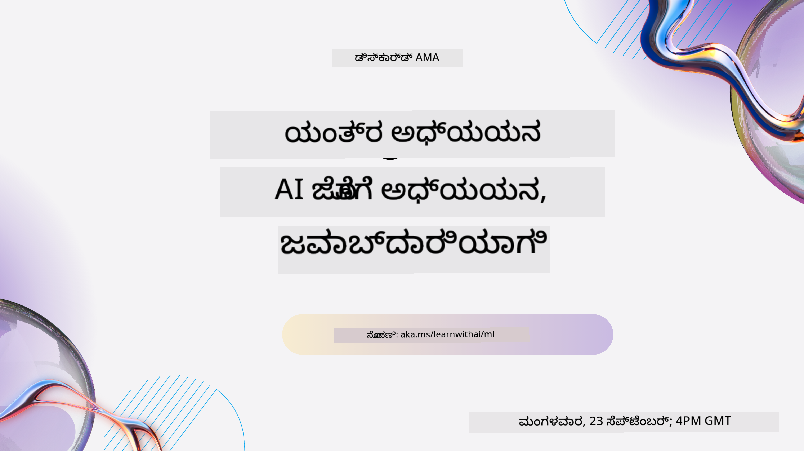
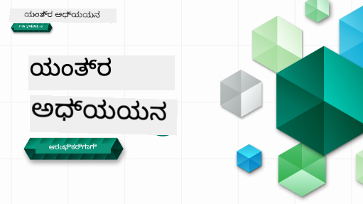

<!--
CO_OP_TRANSLATOR_METADATA:
{
  "original_hash": "c21bf667cfbd946f76fde049e31b07d0",
  "translation_date": "2025-12-25T02:43:09+00:00",
  "source_file": "README.md",
  "language_code": "kn"
}
-->

### 🌐 ಬಹುಭಾಷಾ ಬೆಂಬಲ

#### GitHub Action ಮೂಲಕ ಬೆಂಬಲ (ಸ್ವಯಂಚಾಲಿತ ಮತ್ತು ಸದಾ ನವೀಕೃತ)

<!-- CO-OP TRANSLATOR LANGUAGES TABLE START -->
[ಅರೇಬಿಕ್](../ar/README.md) | [ಬೆಂಗಾಲಿ](../bn/README.md) | [ಬಲ್ಗೇರಿಯನ್](../bg/README.md) | [ಬರ್ಮೀಸ್ (ಮ್ಯಾನ್ಮಾರ್)](../my/README.md) | [ಚೀನೀ (ಸರಳೀಕೃತ)](../zh/README.md) | [ಚೀನೀ (ಸಾಂಪ್ರದಾಯಿಕ, ಹಾಂಗ್ ಕಾಂಗ್)](../hk/README.md) | [ಚೀನೀ (ಸಾಂಪ್ರದಾಯಿಕ, ಮಕಾವ್)](../mo/README.md) | [ಚೀನೀ (ಸಾಂಪ್ರದಾಯಿಕ, ತೈವಾನ್)](../tw/README.md) | [ಕ್ರೋಯೇಟಿಯನ್](../hr/README.md) | [ಚೆಕ್](../cs/README.md) | [ಡ್ಯಾನಿಷ್](../da/README.md) | [ಡಚ್](../nl/README.md) | [ಎಸ್ಟೋನಿಯನ್](../et/README.md) | [ಫಿನ್ನಿಶ್](../fi/README.md) | [ಫ್ರೆಂಚ್](../fr/README.md) | [ಜರ್ಮನ್](../de/README.md) | [ಗ್ರೀಕ್](../el/README.md) | [ಹೀಬ್ರೂ](../he/README.md) | [ಹಿಂದಿ](../hi/README.md) | [ಹಂಗೇರಿಯನ್](../hu/README.md) | [ಇಂಡೋನೇಶಿಯನ್](../id/README.md) | [ಇಟಾಲಿಯನ್](../it/README.md) | [ಜಪಾನೀಸ್](../ja/README.md) | [ಕನ್ನಡ](./README.md) | [ಕೊರಿಯನ್](../ko/README.md) | [ಲಿಥುವೇನಿಯನ್](../lt/README.md) | [ಮಲಯ್](../ms/README.md) | [ಮಲಯಾಳಂ](../ml/README.md) | [ಮರಾಠಿ](../mr/README.md) | [ನೆಪಾಳಿ](../ne/README.md) | [ನೈಜೀರಿಯನ್ ಪಿಡ್ಗಿನ್](../pcm/README.md) | [ನಾರ್ವೇಜಿಯನ್](../no/README.md) | [ಪರ್ಸಿಯನ್ (ಫಾರ್ಸಿ)](../fa/README.md) | [ಪೋಲಿಷ್](../pl/README.md) | [ಪೋರ್ಟುಗೀಸ್ (ಬ್ರಜಿಲ್)](../br/README.md) | [ಪೋರ್ಟುಗೀಸ್ (ಪೋರ್ಟುಗಲ್)](../pt/README.md) | [ಪುಂಜಾಬಿ (ಗುರ್ಮುಕಿ)](../pa/README.md) | [ರೊಮೇನಿಯನ್](../ro/README.md) | [ರಶಿಯನ್](../ru/README.md) | [ಸೆರ್ಬಿಯನ್ (ಸಿರಿಲಿಕ್)](../sr/README.md) | [ಸ್ಲೋವಾಕ್](../sk/README.md) | [ಸ್ಲೋವೇನಿಯನ್](../sl/README.md) | [ಸ್ಪ್ಯಾನಿಷ್](../es/README.md) | [ಸ್ವಾಹಿಲಿ](../sw/README.md) | [ಸ್ವೀಡಿಷ್](../sv/README.md) | [ತಗಲೋಗ್ (ಫಿಲಿಪಿನೊ)](../tl/README.md) | [ತಮಿಳು](../ta/README.md) | [ತೆಲುಗು](../te/README.md) | [ಥಾಯ್](../th/README.md) | [ಟರ್ಕಿಷ್](../tr/README.md) | [ಉಕ್ರೇನಿಯನ್](../uk/README.md) | [ಉರ್ದು](../ur/README.md) | [ವಿಯಟ್ನಾಮೀಸ್](../vi/README.md)
<!-- CO-OP TRANSLATOR LANGUAGES TABLE END -->

#### ನಮ್ಮ ಸಮುದಾಯದಲ್ಲಿ ಸೇರಿ

ನಮ್ಮ ಬಳಿ Discord ನಲ್ಲಿ "AI ಜೊತೆ ಕಲಿಯಿರಿ" ಸರಣಿಯು ನಡೆಯುತ್ತಿದ್ದು, 18 - 30 ಸೆಪ್ಟೆಂಬರ್, 2025 ರವರೆಗೆ وڌيڪ ತಿಳಿಯಲು ಮತ್ತು ನಮ್ಮೊಡನೆ ಸೇರಲು [Learn with AI Series](https://aka.ms/learnwithai/discord) ಗೆ ಹಾಕಿಕೊಳ್ಳಿ. ನೀವು Data Science ಗಾಗಿ GitHub Copilot ಬಳಸುವ ಸಲಹೆಗಳು ಮತ್ತು ಟಿಪ್‌ಗಳನ್ನು ಪಡೆಯುತ್ತೀರಿ.

# ಆರಂಭಿಕರಿಗಾಗಿ ಮೆಷಿನ್ ಲರ್ನಿಂಗ್ - ಒಂದು ಪಠ್ಯಕ್ರಮ

> 🌍 ವಿಶ್ವದ ಸುತ್ತ ಪ್ರಯಾಣ ಮಾಡಿ, ನಾವು ಜಗತ್ತಿನ ಸಂಸ್ಕೃತಿಗಳ ಮೂಲಕ ಮೆಷಿನ್ ಲರ್ನಿಂಗ್ ಅನ್ನು ಅನ್ವೇಷಿಸುತ್ತೇವೆ 🌍

Microsoft ನ Cloud Advocates ತಂಡವು 12-ವಾರಗಳ, 26-ಪಾಠಗಳ ಪಠ್ಯಕ್ರಮವನ್ನು ನೀಡಲು ಸಂತೋಷವನ್ನು ಹೊಂದಿದೆ, ಇದು ಸಂಪೂರ್ಣವಾಗಿ **ಮೆಷಿನ್ ಲರ್ನಿಂಗ್** ಕುರಿತು ಇದೆ. ಈ ಪಠ್ಯಕ್ರಮದಲ್ಲಿ, ನೀವು ಕೆಲವೊಮ್ಮೆ "ಕ್ಲಾಸಿಕ್ ಮೆಷಿನ್ ಲರ್ನಿಂಗ್" ಎನ್ನುತ್ತಿರುವುದನ್ನು ಮತ್ತು ಮುಖ್ಯವಾಗಿ Scikit-learn ಲೈಬ್ರರಿಯನ್ನು ಬಳಸಿ ಮತ್ತು ಡೀಪ್ ಲರ್ನಿಂಗ್ ಅನ್ನು ತಪ್ಪಿಸಿ ಹೇಗೆ ಬಳಸುವುದೆಂಬುದನ್ನು ಕಲಿಯುತ್ತೀರಿ; ಡೀಪ್ ಲರ್ನಿಂಗ್ ನಮ್ಮ [AI for Beginners' curriculum](https://aka.ms/ai4beginners) ನಲ್ಲಿ ಕವರ್ ಮಾಡಲಾಗಿದೆ. ಈ ಪಾಠಗಳನ್ನು ನಮ್ಮ ['Data Science for Beginners' curriculum](https://aka.ms/ds4beginners) ಜೊತೆಯೂ ಜೋಡಿಸಬಹುದು.

ನಮ್ಮೊಡನೆ ಜಗತ್ತಿನ ಸುತ್ತ ಪ್ರಯಾಣ ಮಾಡಿ, ನಾವು ಈ ಕ್ಲಾಸಿಕ್ ತಂತ್ರಗಳನ್ನು ವಿಶ್ವದ ವಿವಿಧ ಪ್ರದೇಶಗಳಿಂದ ಬಂದ ಡೇಟಾ ಮೇಲೆ ಅನ್ವಯಿಸುತ್ತೇವೆ. ಪ್ರತಿ ಪಾಠದಲ್ಲಿಯೂ ಪೂರ್ವ-ಮತ್ತು ನಂತರದ ಪ್ರಶ್ನೋತ್ತರಗಳು, ಪಾಠವನ್ನು ಪೂರ್ಣಗೊಳಿಸಲು ಬರಹದ ನಿದರ್ಶನಗಳು, ಒಂದು ಪರಿಹಾರ, ಒಂದು ನೇಮಕಾತಿ, ಮತ್ತು ಇನ್ನಷ್ಟು ಇರುತ್ತದೆ. ನಮ್ಮ ಪ್ರಾಜೆಕ್ಟ್ ಆಧಾರಿತ ಪಠ್ಯಶೈಲಿಯು ನೀವು ನಿರ್ಮಿಸುವಾಗ ಕಲಿಯಲು ಅನುಕೂಲವಾಗುತ್ತದೆ — ಹೊಸ ನೈಪುಣ್ಯಗಳಿಗಾಗಿ ಇದು ಪರಿಣಾಮಕಾರಿಯಾಗಿ 'ಬಂದಿ' ಇರುತ್ತದೆ.

**✍️ ನಮ್ಮ ಲೇಖಕರಿಗೆ ಹೃತ್ಪೂರ್ವಕ ಧನ್ಯವಾದಗಳು** Jen Looper, Stephen Howell, Francesca Lazzeri, Tomomi Imura, Cassie Breviu, Dmitry Soshnikov, Chris Noring, Anirban Mukherjee, Ornella Altunyan, Ruth Yakubu ಮತ್ತು Amy Boyd

**🎨 ನಮ್ಮ ಚಿತ್ರಕರಿಗೆ ಧನ್ಯವಾದಗಳು** Tomomi Imura, Dasani Madipalli, ಮತ್ತು Jen Looper

**🙏 ವಿಶೇಷ ಧನ್ಯವಾದಗಳು 🙏 ನಮ್ಮ Microsoft Student Ambassador ಲೇಖಕರು, ವಿಮರ್ಶಕರು, ಮತ್ತು ವಿಷಯದ ಕೊಡುಗೆದಾರರಿಗೆ**, ವಿಶೇಷವಾಗಿ Rishit Dagli, Muhammad Sakib Khan Inan, Rohan Raj, Alexandru Petrescu, Abhishek Jaiswal, Nawrin Tabassum, Ioan Samuila, ಮತ್ತು Snigdha Agarwal

**🤩 ನಮ್ಮ R ಪಾಠಗಳಿಗಾಗಿ Microsoft Student Ambassadors Eric Wanjau, Jasleen Sondhi, ಮತ್ತು Vidushi Gupta ಅವರನ್ನು ಹೆಚ್ಚುವರಿ ಕೃತಜ್ಞತೆಗಳು!**

# ಪ್ರಾರಂಭಿಸುವುದು

ಈ ಹಂತಗಳನ್ನು ಅನುಸರಿಸಿ:
1. **ರಿಪೊ ಅನ್ನು Fork ಮಾಡಿ**: ಈ ಪುಟದ ಮೇಲ್ಭಾಗದ ಬಲಕೂನೆಯಲ್ಲಿ ಇರುವ "Fork" ಬಟನ್ ಮೇಲೆ ಕ್ಲಿಕ್ ಮಾಡಿ.
2. **ರಿಪೊನ್ನು ಕ್ಲೋನ್ ಮಾಡಿ**:   `git clone https://github.com/microsoft/ML-For-Beginners.git`

> [ಈ ಕೋರ್ಸ್‌ಗೆ ಸಂಬಂಧಿಸಿದ ಎಲ್ಲಾ ಹೆಚ್ಚುವರಿ ಸಂಪನ್ಮೂಲಗಳನ್ನು ಅವರ Microsoft Learn ಸಂಗ್ರಹದಲ್ಲಿ ಹುಡುಕಿ](https://learn.microsoft.com/en-us/collections/qrqzamz1nn2wx3?WT.mc_id=academic-77952-bethanycheum)

> 🔧 **ಸಹಾಯ ಬೇಕೇ?** ಸಂಕ್ರಿಯೆ, ಸೆಟಪ್, ಮತ್ತು ಪಾಠಗಳನ್ನು ಓಡಿಸುವ ಸಾಮಾನ್ಯ ಸಮಸ್ಯೆಗಳಿಗೆ ಪರಿಹಾರಗಳಿಗಾಗಿ ನಮ್ಮ [ಸಮಸ್ಯೆಗಳ ಪರಿಹಾರ ಮಾರ್ಗದರ್ಶಿ](TROUBLESHOOTING.md) ನೋಡಿ.

**[ವಿದ್ಯಾರ್ಥಿಗಳು](https://aka.ms/student-page)**, ಈ ಪಠ್ಯಕ್ರಮವನ್ನು ಬಳಸಲು, ಒಟ್ಟಿದ್ದ ರೆಪೊವನ್ನು ನಿಮ್ಮದೇ GitHub ಖಾತೆಗೆ fork ಮಾಡಿ ಮತ್ತು ವ್ಯಾಯಾಮಗಳನ್ನು தனಗೆ ಅಥವಾ ಗುಂಪಿನಲ್ಲಿ ಪೂರ್ಣಗೊಳಿಸಿ:

- ಒಂದು ಪೂರ್ವ ಉಪನ್ಯಾಸ ಕ್ವಿಜ್‌ನಿಂದ ಪ್ರಾರಂಭಿಸಿ.
- ಉಪನ್ಯಾಸವನ್ನು ಓದಿ ಮತ್ತು ಕಾರ್ಯವನ್ನು ಪೂರ್ಣಗೊಳಿಸಿ, ಪ್ರತಿ ಜ್ಞಾನ ಪರಿಶೀಲನೆಯಲ್ಲಿ ನಿಂತು ಚಿಂತಿಸಿ.
- ಪಾಠಗಳನ್ನು ಅರ್ಥಮಾಡಿಕೊಂಡು ಯೋಜನೆಗಳನ್ನು ಸೃಷ್ಟಿಸಲು ಪ್ರಯತ್ನಿಸಿ; ಪರಿಹಾರ ಕೋಡ್ `/solution` ಫೋಲ್ಡರ್‌ಗಳಲ್ಲಿ ದೊರಕುತ್ತದೆ.
- ಉಪನ್ಯಾಸದ ನಂತರದ ಕ್ವಿಜ್ ತೆಗೆದುಕೊಳ್ಳಿ.
- ಚಾಲೆಂಜ್ ಅನ್ನು ಪೂರ್ಣಗೊಳಿಸಿ.
- ನೇಮಕಾತಿಯನ್ನು ಪೂರ್ಣಗೊಳಿಸಿ.
- ಪಾಠ ಗುಂಪನ್ನು ಪೂರ್ಣಗೊಳಿಸಿದ ನಂತರ, [ಚರ್ಚಾ ಫಲಕ](https://github.com/microsoft/ML-For-Beginners/discussions) ಗೆ ಭೇಟಿ ನೀಡಿ ಮತ್ತು ಹೊಂದಿಕೆಯಾಗುವ PAT ರೂಬ್ರಿಕ್ ಅನ್ನು ಭರ್ತಿ ಮಾಡುವ ಮೂಲಕ "ಓದಲಿಡಿ" — ಹೀಗೆ ನಿಮ್ಮ ಕಲಿಕೆಯನ್ನು ಹಂಚಿಕೊಳ್ಳಿ. 'PAT' ಎಂಬುದು ಪ್ರಗತಿ ಮೌಲ್ಯಮಾಪನ ಸಾಧನ (Progress Assessment Tool) ಆಗಿದ್ದು, ನೀವು ನಿಮ್ಮ ಕಲಿಕೆಯನ್ನು ಹೆಚ್ಚಿಸಲು ಭರ್ತಿ ಮಾಡುವ ರೂಬ್ರಿಕ್ ಆಗಿದೆ. ನೀವು ಬೇರೆ PAT ಗಳಿಗೆ ಪ್ರತಿಕ್ರಿಯಿಸುವುದರ ಮೂಲಕ ಸಹ ಒಟ್ಟಾಗಿ ಕಲಿಯಬಹುದು.

> ಮುಂದಿನ ಅಧ್ಯಯನಕ್ಕಾಗಿ, ನಾವು ಈ [Microsoft Learn](https://docs.microsoft.com/en-us/users/jenlooper-2911/collections/k7o7tg1gp306q4?WT.mc_id=academic-77952-leestott) ಮಡ್ಯೂಲ್‌ಗಳು ಮತ್ತು ಕಲಿಯುವ ಪಥಗಳನ್ನು ಅನುಸರಿಸಲು ಶಿಫಾರಸು ಮಾಡುತ್ತೇವೆ.

**ಶಿಕ್ಷಕರಿಗೆ**, ಈ ಪಠ್ಯಕ್ರಮವನ್ನು ಹೇಗೆ ಬಳಸುವುದು ಎಂಬ ಕುರಿತು ನಾವು [ಕೆಲವು ಸಲಹೆಗಳನ್ನೊಳಗೊಂಡಿದ್ದೇವೆ](for-teachers.md).

---

## ವೀಡಿಯೋ ವಾಕ್‌ಥ್ರೂಗಳು

ಕೆಲವು ಪಾಠಗಳು ಸಂಕ್ಷಿಪ್ತ ವೀಡಿಯೊ ರೂಪದಲ್ಲಿ ಲಭ್ಯವಿವೆ. ನೀವು ಈವರೆಲ್ಲವನ್ನು ಪಾಠಗಳೊಳಗಾಗಿಯೇ ಕಾಣಬಹುದು, ಅಥವಾ ಕೆಳಗಿನ ಚಿತ್ರವನ್ನು ಕ್ಲಿಕ್ ಮಾಡಿ [ML for Beginners playlist on the Microsoft Developer YouTube channel](https://aka.ms/ml-beginners-videos) ನಲ್ಲಿ ನೋಡಿ.

---

## ತಂಡವನ್ನು ನೋಡಿ

**ಗಿಫ್:** [Mohit Jaisal](https://linkedin.com/in/mohitjaisal)

> 🎥 ಪ್ರಾಜೆಕ್ಟ್ ಮತ್ತು ಅದನ್ನು ರಚಿಸಿದ ಜನರ ಬಗ್ಗೆ ವಿಡಿಯೊನಿಗಾಗಿ ಮೇಲಿನ ಚಿತ್ರವನ್ನು ಕ್ಲಿಕ್ ಮಾಡಿ!

---

## ಪಠ್ಯಶಾಸ್ತ್ರ

ಈ ಪಠ್ಯಕ್ರಮವನ್ನು ರಚಿಸುವಾಗ ನಾವು ಎರಡು ಪಠ್ಯಶೈಲಿಯ ತತ್ವಗಳನ್ನು ಆಯ್ದುಕೊಂಡಿದ್ದೇವೆ: ಇದನ್ನು ಕೈಯೊಂದಿಗೇ ಮಾಡುವುದಾಗಿ (project-based) ಮತ್ತು ಅತಿ ಸಮೀಪದ ಪ್ರಶ್ನೆಗಳೊಂದಿಗೆ (frequent quizzes) ಇರಿಸುವುದು. ಜೊತೆಗೆ, ಈ ಪಠ್ಯಕ್ರಮಕ್ಕೆ ಸಾತತ್ಯಕ್ಕಾಗಿ ಒಂದೇ **ಥೀಮ್** ಅನ್ನು ಒಳಗೊಳಿಸಲಾಗಿದೆ.

ವಿಷಯವನ್ನು ಪ್ರಾಜೆಕ್ಟ್ಗಳೊಂದಿಗೆ ಹೊಂದಿಸುವ ಮೂಲಕ, ಪ್ರಕ್ರಿಯೆ ವಿದ್ಯಾರ್ಥಿಗಳಿಗೆ ಹೆಚ್ಚು ಆಕರ್ಷಕವಾಗುತ್ತದೆ ಮತ್ತು ಕಾನ್ಸೆಪ್ಟ್ಗಳನ್ನು ಉಳಿಸಿಕೊಂಡು ಹೋಗಲು ಸಹಾಯಮಾಡುತ್ತದೆ. ಇದಲ್ಲದೆ, ತರಗತಿಯ ಮೊದಲು ಕಡಿಮೆ-ರಿಸ್ಕ್ ಕ್ವಿಜ್ ವಿದ್ಯಾರ್ಥಿಗಾಗಿ ವಿಷಯವನ್ನು ಅಧ್ಯಯನಕ್ಕೆ ಮನೋಭಾವವನ್ನು ಸೃಷ್ಟಿಸುತ್ತದೆ, ಮತ್ತು ತರಗತಿಯ ನಂತರದ ಕ್ವಿಜ್ ಹೆಚ್ಚು tutuloya ಪುನರುತ್ಥಾನವನ್ನು ಖಚಿತಪಡಿಸುತ್ತದೆ. ಈ ಪಠ್ಯಕ್ರಮವು ಬಹುಮುಖ್ಯವಾಗಿ ಬದಲಾವಣೆಗಳಿಗೆ ಸೌಲಭ್ಯವನ್ನು ನೀಡಲು ಮತ್ತು ಮನರಂಜನೆಯನ್ನು ಒಳಗೊಂಡಿದೆ; ಸಂಪೂರ್ಣವಾಗಿ ಅಥವಾ ಭಾಗವಾಗಿ ತೆಗೆದುಕೊಳ್ಳಬಹುದು. ಪ್ರಾಜೆಕ್ಟ್ಗಳ ಪ್ರಾರಂಭ ಸಣ್ಣವಾಗಿದ್ದು, 12-ವಾರದ ಕೊನೆಯಲ್ಲಿ ಹೆಚ್ಚಾಗಿ ಸಂಕೀರ್ಣವಾಗುತ್ತವೆ. ಈ ಪಠ್ಯಕ್ರಮವು ವಾಸ್ತವಿಕ ಜಗತ್ತಿನ ಅನ್ವಯಿಕೆಗಳ ಮೇಲೆ ಒಂದು ಪರೋಕ್ಷವೂ ಒಳಗೊಂಡಿದೆ, ಇದು ಹೆಚ್ಚುವರಿ ಕ್ರೆಡಿಟ್ ಅಥವಾ ಚರ್ಚೆಯ ಆಧಾರವಾಗಿ ಬಳಸಿಕೊಳ್ಳಬಹುದು.

> ನಮ್ಮ [ಆचार ಸಂಹಿತೆ](CODE_OF_CONDUCT.md), [ಸಹಭಾಗಿತ್ವದ ಮಾರ್ಗದರ್ಶಿ](CONTRIBUTING.md), [ಅನುವಾದ ಮಾರ್ಗದರ್ಶಿ](TRANSLATIONS.md), ಮತ್ತು [ಸಮಸ್ಯೆಗಳ ಪರಿಹಾರ ಮಾರ್ಗದರ್ಶಿ](TROUBLESHOOTING.md) ಗಳನ್ನು ನೋಡಿ. ನಿಮ್ಮ ರಚನಾತ್ಮಕ ಪ್ರತಿಕ್ರಿಯೆಯನ್ನು ನಾವು ಸ್ವಾಗತಿಸುತ್ತೇವೆ!

## ಪ್ರತಿ ಪಾಠದಲ್ಲಿ ಇದಿದೆ

- ಐಚ್ಛಿಕ ಸ್ಕೆಚ್‌ನೋಟ್
- ಐಚ್ಛಿಕ ಸಹಾಯಕ ವೀಡಿಯೋ
- ವೀಡಿಯೋ ವಾಕ್‌ಥ್ರೂ (ಕೆಲವು ಪಾಠಗಳಿಗೆ ಮಾತ್ರ)
- [ಪೂರ್ವ-ಉಪನ್ಯಾಸ ವಾರ್ಮ್-ಅಪ್ ಕ್ವಿಜ್](https://ff-quizzes.netlify.app/en/ml/)
- ಬರಹದ ಪಾಠ
- ಪ್ರಾಜೆಕ್ಟ್ ಆಧಾರಿತ ಪಾಠಗಳಿಗಾಗಿ, ಪ್ರಾಜೆಕ್ಟ್ ನಿರ್ಮಿಸುವ ಕುರಿತಾಗಿ ದಪ್ಪ-ಹಂತದ ಮಾರ್ಗದರ್ಶನ
- ಜ್ಞಾನ ಪರಿಶೀಲನೆಗಳು
- ಚಾಲೆಂಜ್
- ಪೂರಕ ಓದು
- ನೇಮಕಾತಿ
- [ಉಪನ್ಯಾಸದ ನಂತರದ ಕ್ವಿಜ್](https://ff-quizzes.netlify.app/en/ml/)

> **ಭಾಷೆಗಳ ಬಗ್ಗೆ ಟಿಪ್ಪಣಿ**: ಈ ಪಾಠಗಳು ಮುಖ್ಯವಾಗಿ Python ನಲ್ಲಿ ಬರೆಯಲ್ಪಟ್ಟಿವೆ, ಆದರೆ ಬಹುತೇಕವು R ನಲ್ಲಿ ಸಹ ಲಭ್ಯವಿವೆ. R ಪಾಠವನ್ನು ಪೂರ್ಣಗೊಳಿಸಲು, `/solution` ಫೋಲ್ಡರ್‌ಗೆ ಹೋಗಿ R ಪಾಠಗಳನ್ನು ಹುಡುಕಿ. ಅವುಗಳಲ್ಲಿ `.rmd` ವಿಸ್ತರಣೆ ಇರುತ್ತದೆ, ಇದು **R Markdown** ಫೈಲ್ ಅನ್ನು ಸೂಚಿಸುತ್ತದೆ, ಇದು ಒಂದು `Markdown` ಡಾಕ್ಯುಮೆಂಟ್‌ನಲ್ಲಿ `code chunks` (R ಅಥವಾ ಇತರ ಭಾಷೆಗಳ) ಮತ್ತು `YAML header` ನ್ನು ತಾಳಮೇಳಗೊಳಿಸುವ ಹಾಗೆ ಸುಲಭವಾಗಿ ವ್ಯಾಖ್ಯಾನಿಸಬಹುದು. ಆದ್ದರಿಂದ, ಇದು ಡೇಟಾ ಸೈನ್ಸ್‌ಗಾಗಿ ಸಾಕ್ಷಾತ್ತಿನಲ್ಲಿ ಒಂದು ಉದಾಹರಣಾರ್ಹ ಬರಹದ ಫ್ರೇಮ್ವರ್ಕ್ ಆಗಿದೆ, ಏಕೆಂದರೆ ಇದು ನಿಮ್ಮ ಕೋಡ್, ಅದರ ಅವುಟ್ಪುಟ್, ಮತ್ತು ನಿಮ್ಮ ಯೋಚನೆಗಳನ್ನು Markdown ನಲ್ಲಿ ಬರೆದು ಸಂಯೋಜಿಸಲು ಸಹಾಯಮಾಡುತ್ತದೆ. ಜೊತೆಗೆ, R Markdown ಡಾಕ್ಯುಮೆಂಟ್‌ಗಳನ್ನು PDF, HTML, ಅಥವಾ Word ಮುಂತಾದ ಔಟ್‌ಪುಟ್ ಫಾರ್ಮ್ಯಾಟ್‌ಗಳಿಗೆ ರೆಂಡರ್ ಮಾಡಬಹುದು.

> **ಕ್ವಿಜ್‌ಗಳ ಬಗ್ಗೆ ಟಿಪ್ಪಣಿ**: ಎಲ್ಲಾ ಕ್ವಿಜ್‌ಗಳು [Quiz App folder](../../quiz-app) ನಲ್ಲಿ ಒಳಗೊಂಡಿವೆ, ಒಟ್ಟು 52 ಕ್ವಿಜ್‌ಗಳು, ಪ್ರತಿ ಒಂದರಲ್ಲಿ ಮೂರು ಪ್ರಶ್ನೆಗಳಿವೆ. ಅವು ಪಾಠಗಳಲ್ಲಿ ಲಿಂಕ್ ಮಾಡಲ್ಪಟ್ಟಿವೆ ಆದರೆ ಕ್ವಿಜ್ ಅಪ್ ಅನ್ನು ಲೋಕಲ್‌ನಲ್ಲಿ ಓಡಿಸಬಹುದು; ಲೋಕಲ್‌ನಲ್ಲಿ ಹೋಸ್ಟ್ ಅಥವಾ Azure ಗೆ ಡಿಪ್ಲಾಯ್ ಮಾಡುವ ಸೂಚನೆಗಳನ್ನು `quiz-app` ಫೋಲ್ಡರ್‌ನಲ್ಲಿ ಅನುಸರಿಸಿ.

| ಪಾಠ ಸಂಖ್ಯೆ |                             ವಿಷಯ                              |                   ಪಾಠ ಗುಂಪು                   | ಕಲಿಕೆಯ ಉದ್ದೇಶಗಳು                                                                                                             |                                                              ಲಿಂಕ್ ಮಾಡಲಾದ ಪಾಠ                                                               |                        ಲೇಖಕ                        |
| :-----------: | :------------------------------------------------------------: | :-------------------------------------------------: | ------------------------------------------------------------------------------------------------------------------------------- | :--------------------------------------------------------------------------------------------------------------------------------------: | :--------------------------------------------------: |
|      01       |                ಯಂತ್ರ ಕಲಿಕೆಗೆ ಪರಿಚಯ                |      [ಪರಿಚಯ](1-Introduction/README.md)       | ಯಂತ್ರ ಕಲಿಕೆಯ ಹಿಂದಿರುವ ಮೂಲ ತತ್ವಗಳನ್ನು ಕಲಿಯಿರಿ                                                                                |                                             [ಪಾಠ](1-Introduction/1-intro-to-ML/README.md)                                             |                       Muhammad                       |
|      02       |                ಯಂತ್ರ ಕಲಿಕೆಯ ಇತಿಹಾಸ                 |      [ಪರಿಚಯ](1-Introduction/README.md)       | ಈ ಕ್ಷೇತ್ರದ ಹಿಂದೆ ಇರುವ ಇತಿಹಾಸವನ್ನು ತಿಳಿಯಿರಿ                                                                                         |                                            [ಪಾಠ](1-Introduction/2-history-of-ML/README.md)                                            |                     Jen and Amy                      |
|      03       |                 ನ್ಯಾಯತೆ ಮತ್ತು ಯಂತ್ರ ಕಲಿಕೆ                  |      [ಪರಿಚಯ](1-Introduction/README.md)       | ವಿದ್ಯಾರ್ಥಿಗಳು ML ಮಾದರಿಗಳನ್ನು ನಿರ್ಮಿಸುವಾಗ ಮತ್ತು ಅನ್ವಯಿಸುವಾಗ ಪರಿಗಣಿಸಬೇಕಾದ ನ್ಯಾಯತೆಯನ್ನು ಸುತ್ತುವ ಪ್ರಮುಖ ತತ್ವಶಾಸ್ತ್ರೀಯ ವಿಚಾರಗಳು ಯಾವುವು? |                                              [ಪಾಠ](1-Introduction/3-fairness/README.md)                                               |                        Tomomi                        |
|      04       |                ಯಂತ್ರ ಕಲಿಕೆಯ ತಂತ್ರಗಳು                 |      [ಪರಿಚಯ](1-Introduction/README.md)       | ML ಸಂಶೋಧಕರು ML ಮಾದರಿಗಳನ್ನು ನಿರ್ಮಿಸಲು ಯಾವ ತಂತ್ರಗಳನ್ನು ಬಳಸುತ್ತಾರೆ?                                                                       |                                          [ಪಾಠ](1-Introduction/4-techniques-of-ML/README.md)                                           |                    Chris and Jen                     |
|      05       |                   ರಿಗ್ರೆಶನ್‌ಗೆ ಪರಿಚಯ                   |        [ರಿಗ್ರೆಶನ್](2-Regression/README.md)         | ರಿಗ್ರೆಶನ್ ಮಾದರಿಗಳಿಗಾಗಿ Python ಮತ್ತು Scikit-learn ಬಳಸಿ ಪ್ರಾರಂಭಿಸಿ                                                                  |         [Python](2-Regression/1-Tools/README.md) • [R](../../2-Regression/1-Tools/solution/R/lesson_1.html)         |      Jen • Eric Wanjau       |
|      06       |                ಉತ್ತರ ಅಮೆರಿಕದ ಕುಂಬಳಕಾಯಿ ಬೆಲೆಗಳು 🎃                |        [ರಿಗ್ರೆಶನ್](2-Regression/README.md)         | ML ಗೆ ಸಿದ್ಧತೆಗಾಗಿ ಡೇಟಾವನ್ನು ದೃಶ್ಯೀಕರಿಸಿ ಮತ್ತು ಶುಚಿಗೊಳಿಸಿ                                                                                  |          [Python](2-Regression/2-Data/README.md) • [R](../../2-Regression/2-Data/solution/R/lesson_2.html)          |      Jen • Eric Wanjau       |
|      07       |                ಉತ್ತರ ಅಮೆರಿಕದ ಕುಂಬಳಕಾಯಿ ಬೆಲೆಗಳು 🎃                |        [ರಿಗ್ರೆಶನ್](2-Regression/README.md)         | ರೇಖೀಯ ಮತ್ತು ಬಹುಪದ ರಿಗ್ರೆಶನ್ ಮಾದರಿಗಳನ್ನು ನಿರ್ಮಿಸಿ                                                                                   |        [Python](2-Regression/3-Linear/README.md) • [R](../../2-Regression/3-Linear/solution/R/lesson_3.html)        |      Jen and Dmitry • Eric Wanjau       |
|      08       |                ಉತ್ತರ ಅಮೆರಿಕದ ಕುಂಬಳಕಾಯಿ ಬೆಲೆಗಳು 🎃                |        [ರಿಗ್ರೆಶನ್](2-Regression/README.md)         | ಲಾಜಿಸ್ಟಿಕ್ ರಿಗ್ರೆಶನ್ ಮಾದರಿಯನ್ನು ನಿರ್ಮಿಸಿ                                                                                               |     [Python](2-Regression/4-Logistic/README.md) • [R](../../2-Regression/4-Logistic/solution/R/lesson_4.html)      |      Jen • Eric Wanjau       |
|      09       |                          ವೆಬ್ ಅಪ್ಲಿಕೇಶನ್ 🔌                          |           [ವೆಬ್ ಅಪ್ಲಿಕೇಶನ್](3-Web-App/README.md)            | ನಿಮ್ಮ ತರಬೇತುಗೊಂಡ ಮಾದರಿಯನ್ನು ಬಳಸಲು ಒಂದು ವೆಬ್ ಅಪ್ಲಿಕೇಶನ್ ನಿರ್ಮಿಸಿ                                                                                       |                                                 [Python](3-Web-App/1-Web-App/README.md)                                                  |                         Jen                          |
|      10       |                 ವರ್ಗೀಕರಣಕ್ಕೆ ಪರಿಚಯ                 |    [ವರ್ಗೀಕರಣ](4-Classification/README.md)     | ನಿಮ್ಮ ಡೇಟಾವನ್ನು ಶುಚಿಗೊಳಿಸಿ, ಸಿದ್ಧಮಾಡಿ ಮತ್ತು ದೃಶ್ಯೀಕರಿಸಿ; ವರ್ಗೀಕರಣಕ್ಕೆ ಪರಿಚಯ                                                            | [Python](4-Classification/1-Introduction/README.md) • [R](../../4-Classification/1-Introduction/solution/R/lesson_10.html)  | Jen and Cassie • Eric Wanjau |
|      11       |             ರುಚಿಕರ ಏಷ್ಯನ್ ಮತ್ತು ಭಾರತೀಯ ಪಾಕಶೈಲಿಗಳು 🍜             |    [ವರ್ಗೀಕರಣ](4-Classification/README.md)     | ವರ್ಗೀಕರಣ ಮಾದರಿಗಳಿಗೆ ಪರಿಚಯ                                                                                                     | [Python](4-Classification/2-Classifiers-1/README.md) • [R](../../4-Classification/2-Classifiers-1/solution/R/lesson_11.html) | Jen and Cassie • Eric Wanjau |
|      12       |             ರುಚಿಕರ ಏಷ್ಯನ್ ಮತ್ತು ಭಾರತೀಯ ಪಾಕಶೈಲಿಗಳು 🍜             |    [ವರ್ಗೀಕರಣ](4-Classification/README.md)     | ಹೆಚ್ಚು ವರ್ಗೀಕರಣ ಮಾದರಿಗಳು                                                                                                                | [Python](4-Classification/3-Classifiers-2/README.md) • [R](../../4-Classification/3-Classifiers-2/solution/R/lesson_12.html) | Jen and Cassie • Eric Wanjau |
|      13       |             ರುಚಿಕರ ಏಷ್ಯನ್ ಮತ್ತು ಭಾರತೀಯ ಪಾಕಶೈಲಿಗಳು 🍜             |    [ವರ್ಗೀಕರಣ](4-Classification/README.md)     | ನಿಮ್ಮ ಮಾದರಿಯನ್ನು ಬಳಸಿ ಶಿಫಾರಸು ಮಾಡುವ ವೆಬ್ ಅಪ್ಲಿಕೇಶನ್ ನಿರ್ಮಿಸಿ                                                                                    |                                              [Python](4-Classification/4-Applied/README.md)                                              |                         Jen                          |
|      14       |                   ಕ್ಲಸ್ಟರಿಂಗ್‌ಗೆ ಪರಿಚಯ                   |        [ಕ್ಲಸ್ಟರಿಂಗ್](5-Clustering/README.md)         | ನಿಮ್ಮ ಡೇಟಾವನ್ನು ಶುಚಿಗೊಳಿಸಿ, ಸಿದ್ಧಮಾಡಿ ಮತ್ತು ದೃಶ್ಯೀಕರಿಸಿ; ಕ್ಲಸ್ಟರಿಂಗ್‌ಗೆ ಪರಿಚಯ                                                                |         [Python](5-Clustering/1-Visualize/README.md) • [R](../../5-Clustering/1-Visualize/solution/R/lesson_14.html)         |      Jen • Eric Wanjau       |
|      15       |              ನ್ಯೈಜೀರಿಯಾದ ಸಂಗೀತದ ರುಚಿಗಳ ಅನ್ವೇಷಣೆ 🎧              |        [ಕ್ಲಸ್ಟರಿಂಗ್](5-Clustering/README.md)         | K-Means ಕ್ಲಸ್ಟರಿಂಗ್ ವಿಧಾನವನ್ನು ಅನ್ವೇಷಿಸಿ                                                                                           |           [Python](5-Clustering/2-K-Means/README.md) • [R](../../5-Clustering/2-K-Means/solution/R/lesson_15.html)           |      Jen • Eric Wanjau       |
|      16       |        ನೈಸರ್ಗಿಕ ಭಾಷಾ ಪ್ರಕ್ರಿಯೆಗೆ ಪರಿಚಯ ☕️         |   [ನೈಸರ್ಗಿಕ ಭಾಷಾ ಪ್ರಕ್ರಿಯೆ](6-NLP/README.md)    | ಒಂದು ಸರಳ ಬಾಟ್ ಅನ್ನು ನಿರ್ಮಿಸುವ ಮೂಲಕ NLP ಕುರಿತು ಮೂಲಭೂತ ವಿಷಯಗಳನ್ನು ಕಲಿಯಿರಿ                                                                             |                                             [Python](6-NLP/1-Introduction-to-NLP/README.md)                                              |                       Stephen                        |
|      17       |                      ಸಾಮಾನ್ಯ NLP ಕಾರ್ಯಗಳು ☕️                      |   [ನೈಸರ್ಗಿಕ ಭಾಷಾ ಪ್ರಕ್ರಿಯೆ](6-NLP/README.md)    | ಭಾಷಾ ರಚನೆಗಳನ್ನು ನಿರ್ವಹಿಸುವಾಗ ಅಗತ್ಯವಾಗುವ ಸಾಮಾನ್ಯ ಕಾರ್ಯಗಳನ್ನು ಅರ್ಥಮಾಡಿಕೊಳ್ಳುವ ಮೂಲಕ ನಿಮ್ಮ NLP ಜ್ಞಾನವನ್ನು ಗಾಢಗೊಳಿಸಿ                          |                                                    [Python](6-NLP/2-Tasks/README.md)                                                     |                       Stephen                        |
|      18       |             ಅನುವಾದ ಮತ್ತು ಭಾವನಾತ್ಮಕ ವಿಶ್ಲೇಷಣೆ ♥️              |   [ನೈಸರ್ಗಿಕ ಭಾಷಾ ಪ್ರಕ್ರಿಯೆ](6-NLP/README.md)    | ಜೇನ್ ಆಸ್ಟಿನ್ ಮೂಲಕ ಅನುವಾದ ಮತ್ತು ಭಾವನಾತ್ಮಕ ವಿಶ್ಲೇಷಣೆ                                                                             |                                            [Python](6-NLP/3-Translation-Sentiment/README.md)                                             |                       Stephen                        |
|      19       |                  ಯುರೋಪಿನ ರೊಮ್ಯಾಂಟಿಕ್ ಹೋಟೆಲ್ಗಳು ♥️                  |   [ನೈಸರ್ಗिक ಭಾಷಾ ಪ್ರಕ್ರಿಯೆ](6-NLP/README.md)    | ಹೋಟೆಲ್ ವಿಮರ್ಶೆಗಳೊಂದಿಗೆ ಭಾವನಾತ್ಮಕ ವಿಶ್ಲೇಷಣೆ 1                                                                                         |                                               [Python](6-NLP/4-Hotel-Reviews-1/README.md)                                                |                       Stephen                        |
|      20       |                  ಯುರೋಪಿನ ರೊಮ್ಯಾಂಟಿಕ್ ಹೋಟೆಲ್ಗಳು ♥️                  |   [ನೈಸರ್ಗಿಕ ಭಾಷಾ ಪ್ರಕ್ರಿಯೆ](6-NLP/README.md)    | ಹೋಟೆಲ್ ವಿಮರ್ಶೆಗಳೊಂದಿಗೆ ಭಾವನಾತ್ಮಕ ವಿಶ್ಲೇಷಣೆ 2                                                                                         |                                               [Python](6-NLP/5-Hotel-Reviews-2/README.md)                                                |                       Stephen                        |
|      21       |            ಟೈಮ್ ಸೀರೀಸ್ ಭವಿಷ್ಯಾನುಮಾನಕ್ಕೆ ಪರಿಚಯ             |        [ಟೈಮ್ ಸೀರೀಸ್](7-TimeSeries/README.md)        | ಟೈಮ್ ಸೀರೀಸ್ ಭವಿಷ್ಯಾನುಮಾನಕ್ಕೆ ಪರಿಚಯ                                                                                         |                                             [Python](7-TimeSeries/1-Introduction/README.md)                                              |                      Francesca                       |
|      22       | ⚡️ ವಿಶ್ವ ವಿದ್ಯುತ್ ಬಳಕೆ ⚡️ - ARIMA ಜೊತೆ ಟೈಮ್ ಸೀರೀಸ್ ಭವಿಷ್ಯಾನುಮಾನ |        [ಟೈಮ್ ಸೀರೀಸ್](7-TimeSeries/README.md)        | ARIMA ಬಳಸಿ ಟೈಮ್ ಸೀರೀಸ್ ಭವಿಷ್ಯಾನುಮಾನ                                                                                              |                                                 [Python](7-TimeSeries/2-ARIMA/README.md)                                                 |                      Francesca                       |
|      23       |  ⚡️ ವಿಶ್ವ ವಿದ್ಯುತ್ ಬಳಕೆ ⚡️ - SVR ಜೊತೆ ಟೈಮ್ ಸೀರೀಸ್ ಭವಿಷ್ಯಾನುಮಾನ  |        [ಟೈಮ್ ಸೀರೀಸ್](7-TimeSeries/README.md)        | Support Vector Regressor ಬಳಸಿ ಟೈಮ್ ಸೀರೀಸ್ ಭವಿಷ್ಯಾನುಮಾನ                                                                           |                                                  [Python](7-TimeSeries/3-SVR/README.md)                                                  |                       Anirban                        |
|      24       |             ಪ್ರೋತ್ಸಾಹಾತ್ಮಕ ಕಲಿಕೆಗೆ ಪರಿಚಯ             | [ಪ್ರೋತ್ಸಾಹಾತ್ಮಕ ಕಲಿಕೆ](8-Reinforcement/README.md) | Q-Learning ಬಳಸಿ ಪ್ರೋತ್ಸಾಹಾತ್ಮಕ ಕಲಿಕೆಯ ಪರಿಚಯ                                                                          |                                             [Python](8-Reinforcement/1-QLearning/README.md)                                              |                        Dmitry                        |
|      25       |                 ಪೀಟರ್‌ಗೆ ನರಿ ತಪ್ಪಿಸಲು ಸಹಾಯ ಮಾಡಿ! 🐺                  | [ಪ್ರೋತ್ಸಾಹಾತ್ಮಕ ಕಲಿಕೆ](8-Reinforcement/README.md) | ಪ್ರೋತ್ಸಾಹಾತ್ಮಕ ಕಲಿಕೆಯ Gym                                                                                                      |                                                [Python](8-Reinforcement/2-Gym/README.md)                                                 |                        Dmitry                        |
|  Postscript   |            ವಾಸ್ತವಿಕ ML ದೃಶ್ಯಗಳು ಮತ್ತು ಅನ್ವಯಿಕೆಗಳು            |      [ML in the Wild](9-Real-World/README.md)       | ಶಾಸ್ತ್ರೀಯ ML ನ ಆಸಕ್ತಿಕರ ಮತ್ತು ಬಹಿರಂಗವಾಗಿಸುವ ವಾಸ್ತವಿಕ ಅನ್ವಯಿಕೆಗಳು                                                               |                                             [ಪಾಠ](9-Real-World/1-Applications/README.md)                                              |                         Team                         |
|  Postscript   |            RAI ಡ್ಯಾಶ್‌ಬೋರ್ಡ್ ಬಳಸಿ ML ನಲ್ಲಿ ಮಾದರಿ ಡಿಬಗಿಂಗ್          |      [ML in the Wild](9-Real-World/README.md)       | Responsible AI ಡ್ಯಾಶ್‌ಬೋರ್ಡ್ ಘಟಕಗಳನ್ನು ಬಳಸಿಕೊಂಡು ಯಂತ್ರ ಕಲಿಕೆಯಲ್ಲಿ ಮಾದರಿ ಡಿಬಗಿಂಗ್                                                              |                                             [ಪಾಠ](9-Real-World/2-Debugging-ML-Models/README.md)                                              |                         Ruth Yakubu                       |

> [ಈ ಕೋರ್ಸಿನ ಎಲ್ಲಾ ಹೆಚ್ಚುವರಿ ಸಂಪನ್ಮೂಲಗಳನ್ನು ನಮ್ಮ Microsoft Learn ಸಂಗ್ರಹದಲ್ಲಿ ನೋಡಿ](https://learn.microsoft.com/en-us/collections/qrqzamz1nn2wx3?WT.mc_id=academic-77952-bethanycheum)

## ಆಫ್‌ಲೈನ್ ಪ್ರವೇಶ

ನೀವು ಈ ದಾಖಲೆಗಳನ್ನು ಆಫ್‌ಲೈನ್‌ನಲ್ಲಿ Docsify ಬಳಸಿ ಚಾಲನೆ ಮಾಡಬಹುದು. ಈ ರೆಪೊ ಅನ್ನು ಫೋರ್ಕ್ ಮಾಡಿ, [Docsify ಅನ್ನು ಸ್ಥಾಪಿಸಿ](https://docsify.js.org/#/quickstart) ನಿಮ್ಮ ಸ್ಥಳೀಯ ಯಂತ್ರದಲ್ಲಿ, ನಂತರ ಈ ರೆಪೊನ ರೂಟ್ ಫೋಲ್ಡರ್‌ನಲ್ಲಿ `docsify serve` ಟೈಪ್ ಮಾಡಿ. ವೆಬ್‌ಸೈಟ್ ನಿಮ್ಮ ಸ್ಥಳೀಯಹೋಸ್ಟ್‌ನಲ್ಲಿನ ಪೋರ್ಟ್ 3000 ಮೇಲೆ ಸೇವ್ ಆಗುತ್ತದೆ: `localhost:3000`.

## PDF ಗಳು

ಲಿಂಕ್‌ಗಳೊಂದಿಗೆ ಪಠ್ಯಕ್ರಮದ ಪಿಡಿಎಫ್ ಅನ್ನು [ಇಲ್ಲಿ](https://microsoft.github.io/ML-For-Beginners/pdf/readme.pdf) ಕಂಡುಹಿಡಿಯಿರಿ。

## 🎒 ಇತರ ಕೋರ್ಸ್‌ಗಳು 

ನಮ್ಮ ತಂಡ ಇತರ ಕೋರ್ಸ್‌ಗಳನ್ನು ಉಂಟುಮಾಡುತ್ತದೆ! ಪರಿಶೀಲಿಸಿ:

<!-- CO-OP TRANSLATOR OTHER COURSES START -->
### LangChain

---

### Azure / Edge / MCP / Agents

---
 
### Generative AI Series

[-9333EA?style=for-the-badge&labelColor=E5E7EB&color=9333EA)](https://github.com/microsoft/Generative-AI-for-beginners-dotnet?WT.mc_id=academic-105485-koreyst)
[-C084FC?style=for-the-badge&labelColor=E5E7EB&color=C084FC)](https://github.com/microsoft/generative-ai-for-beginners-java?WT.mc_id=academic-105485-koreyst)
[-E879F9?style=for-the-badge&labelColor=E5E7EB&color=E879F9)](https://github.com/microsoft/generative-ai-with-javascript?WT.mc_id=academic-105485-koreyst)

---
 
### ಮೂಲ ಕಲಿಕೆ

---
 
### Copilot ಸರಣಿ

<!-- CO-OP TRANSLATOR OTHER COURSES END -->

## ಸಹಾಯ ಪಡೆಯಿರಿ

AI ಅಪ್ಲಿಕೇಶನ್‌ಗಳನ್ನು ನಿರ್ಮಿಸುವಾಗ ನೀವು ಅಡಚಣೆಗೆ ತುತ್ತಾದರೆ ಅಥವಾ ಯಾವುದೇ ಪ್ರಶ್ನೆಗಳಿದ್ದರೆ. MCP ಕುರಿತು ಚರ್ಚೆಗಳಲ್ಲಿ ಇತರ ಕಲಿಯುವವರು ಮತ್ತು ಅನುಭವಿ ಡೆವಲಪರ್‌ಗಳ ಜೊತೆಗೆ ಸೇರಿ. ಇದು ಪ್ರಶ್ನೆಗಳನ್ನು ಸ್ವಾಗತಿಸುವ ಮತ್ತು ಜ್ಞಾನವನ್ನು ಮುಕ್ತವಾಗಿ ಹಂಚಿಕೊಳ್ಳುವ ಬೆಂಬಲಮಯ ಸಮುದಾಯವಾಗಿದೆ.

If you have product feedback or errors while building visit:

---

<!-- CO-OP TRANSLATOR DISCLAIMER START -->
ಅಸ್ವೀಕರಣ:

ಈ ದಸ್ತಾವೇಜನ್ನು ಕೃತಕ ಬುದ್ಧಿಮತ್ತೆ ಆಧಾರಿತ ಅನುವಾದ ಸೇವೆ [Co-op Translator](https://github.com/Azure/co-op-translator) ಬಳಸಿ ಅನುವಾದಿಸಲಾಗಿದೆ. ನಾವು ಶುದ್ಧತೆಗೆ ಪ್ರಯತ್ನಿಸಿದರೂ, ಸ್ವಯಂಚಾಲಿತ ಅನುವಾದಗಳಲ್ಲಿ ತಪ್ಪುಗಳು ಅಥವಾ ಅಸಮಂಜಸ್ಯತೆಗಳು ಇರಬಹುದು ಎಂದು ದಯವಿಟ್ಟು ಗಮನಿಸಿ. ಮೂಲ ಭಾಷೆಯಲ್ಲಿನ ಮೂಲ ದಸ್ತಾವೇಜನ್ನು ಅಧಿಕೃತ ಮೂಲವೆಂದು ಪರಿಗಣಿಸಲಾಗಬೇಕು. ಅತ್ಯಾವಶ್ಯಕ ಮಾಹಿತಿಗಾಗಿ, ವೃತ್ತಿಪರ ಮಾನವ ಅನುವಾದವನ್ನು ಶಿಫಾರಸು ಮಾಡಲಾಗುತ್ತದೆ. ಈ ಅನುವಾದವನ್ನು ಬಳಸುವುದರಿಂದ ಉಂಟಾಗುವ ಯಾವುದೇ ಅಸಮಂಜಸ್ಯತೆಗಳು ಅಥವಾ ತಪ್ಪಾದ ವ್ಯಾಖ್ಯಾನಗಳಿಗೆ ನಾವು ಹೊಣೆಗಾರರಾಗುವುದಿಲ್ಲ.
<!-- CO-OP TRANSLATOR DISCLAIMER END -->