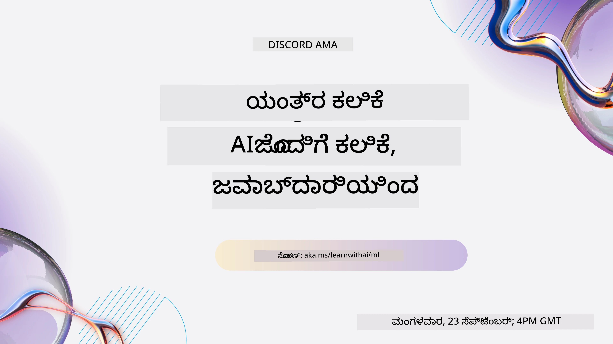
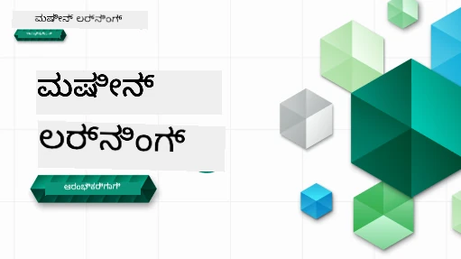

[](https://github.com/microsoft/ML-For-Beginners/blob/master/LICENSE)
[](https://GitHub.com/microsoft/ML-For-Beginners/graphs/contributors/)
[](https://GitHub.com/microsoft/ML-For-Beginners/issues/)
[](https://GitHub.com/microsoft/ML-For-Beginners/pulls/)
[](http://makeapullrequest.com)

[](https://GitHub.com/microsoft/ML-For-Beginners/watchers/)
[](https://GitHub.com/microsoft/ML-For-Beginners/network/)
[](https://GitHub.com/microsoft/ML-For-Beginners/stargazers/)

### 🌐 ಬಹುಭಾಷಾ ಬೆಂಬಲ

#### GitHub Action ಮೂಲಕ ಬೆಂಬಲಿತ (ಸ್ವಯಂಚಾಲಿತ ಮತ್ತು ಯಾವಾಗಲೂ ನವೀಕರಿಸಲಾಗುತ್ತದೆ)

<!-- CO-OP TRANSLATOR LANGUAGES TABLE START -->
[ಅರಬ್ಬಿ](../ar/README.md) | [ಬಾಂಗ್ಲಾ](../bn/README.md) | [ಬಲ್ಗೇರಿಯನ್](../bg/README.md) | [ಬರ್ಮೀಸ್ (ಮಯಾನ್ಮಾರ್)](../my/README.md) | [ಚೀನೀ (ಸರಳೀಕೃತ)](../zh-CN/README.md) | [ಚೀನೀ (ಪಾರಂಪರಿಕ, ಹಾಂಗ್ ಕಾಂಗ್)](../zh-HK/README.md) | [ಚೀನೀ (ಪಾರಂಪರಿಕ, ಮಾಕಾವು)](../zh-MO/README.md) | [ಚೀನೀ (ಪಾರಂಪರಿಕ, ತೈವಾನ್)](../zh-TW/README.md) | [ಕ್ರೋಶಿಯನ್](../hr/README.md) | [ಚೆಕ್](../cs/README.md) | [ಡೆನಿಷ್](../da/README.md) | [ಡಚ್](../nl/README.md) | [ಎಸ್ಟೋನಿಯನ್](../et/README.md) | [ಫಿನಿಷ್](../fi/README.md) | [ಫ್ರೆಂಚ್](../fr/README.md) | [ಜರ್ಮನ್](../de/README.md) | [ಗ್ರೀಕ್](../el/README.md) | [ಹಿಬ್ರೂ](../he/README.md) | [ಹಿಂದಿ](../hi/README.md) | [ಹಂಗೇರಿಯನ್](../hu/README.md) | [ಇಂಡೋನೇಶಿಯನ್](../id/README.md) | [ಇಟಾಲಿಯನ್](../it/README.md) | [ಜಪಾನೀಸ್](../ja/README.md) | [ಕನ್ನಡ](./README.md) | [ಖ್ಮೆರ‍್](../km/README.md) | [ಕೊರಿಯನ್](../ko/README.md) | [ಲಿಥುವೇನಿಯನ್](../lt/README.md) | [ಮಲಯ](../ms/README.md) | [ಮಲಯಾಳಂ](../ml/README.md) | [ಮರಾಠಿ](../mr/README.md) | [ನೆಪಾಳಿ](../ne/README.md) | [ನೈಜೀರಿಯನ್ ಪಿಡ್ಗಿನ್](../pcm/README.md) | [ನಾರ್ವೆಜಿಯನ್](../no/README.md) | [ಪರ್ಸಿಯನ್ (ಫಾರ್ಸಿ)](../fa/README.md) | [ಪೋಲಿಷ್](../pl/README.md) | [ಪೊರ್ಚುಗೀಸ್ (ಬ್ರೆಜಿಲ್)](../pt-BR/README.md) | [ಪೊರ್ಚುಗೀಸ್ (ಪೊರ್ಚುಗಲ್)](../pt-PT/README.md) | [ಪಂಜಾಬಿ (ಗುರುಮುಖಿ)](../pa/README.md) | [ರೊಮೇನಿಯನ್](../ro/README.md) | [ರಷ್ಯನ್](../ru/README.md) | [ಸರ್ಬಿಯನ್ (ಸಿರಿಲಿಕ್)](../sr/README.md) | [ಸ್ಲೋವಾಕ್](../sk/README.md) | [ಸ್ಲೋವೇನಿಯನ್](../sl/README.md) | [ಸ್ಪ್ಯಾನಿಷ್](../es/README.md) | [ಸ್ವಾಹಿಲಿ](../sw/README.md) | [ಸ್ವೀಡಿಷ್](../sv/README.md) | [ಟಾಗಾಲೋಗ್ (ಫಿಲಿಪಿನೋ)](../tl/README.md) | [ತನಿಳ್](../ta/README.md) | [ತೆಲುಗು](../te/README.md) | [ಥೈ](../th/README.md) | [ತುರ್ಕಿಶ್](../tr/README.md) | [ಉಕ್ರೇನಿಯನ್](../uk/README.md) | [ಉರ್ದು](../ur/README.md) | [ವಿಯೇಟ್ನಾಮೀಸ್](../vi/README.md)

> **ಸ್ಥಳೀಯವಾಗಿ ಕ್ಲೋನ್ ಮಾಡಲು ಇಚ್ಛಿಸುವಿರಾ?**
>
> ಈ ಸಂಗ್ರಹದಲ್ಲಿ 50+ ಭಾಷಾ ಭಾಷಾಂತರಗಳು ಸೇರಿವೆ ಇದು ಡೌನ್ಲೋಡ್ ಗಾತ್ರವನ್ನು ಬಹುಮಾನಪೂರ್ವಕವಾಗಿ ಹೆಚ್ಚಿಸುತ್ತದೆ. ಭಾಷಾಂತರಗಳಿಲ್ಲದೇ ಕ್ಲೋನ್ ಮಾಡಲು, ಸ್ಫೇರ್ ಚೆಕ್ಔಟ್ ಬಳಸಿ:
>
> **ಬ್ಯಾಶ್ / ಮ್ಯಾಕ್ಓಎಸ್ / ಲಿನಕ್ಸ್:**
> ```bash
> git clone --filter=blob:none --sparse https://github.com/microsoft/ML-For-Beginners.git
> cd ML-For-Beginners
> git sparse-checkout set --no-cone '/*' '!translations' '!translated_images'
> ```
>
> **CMD (ವಿಂಡೋಸ್):**
> ```cmd
> git clone --filter=blob:none --sparse https://github.com/microsoft/ML-For-Beginners.git
> cd ML-For-Beginners
> git sparse-checkout set --no-cone "/*" "!translations" "!translated_images"
> ```
>
> ಇದು ನಿಮಗೆ ಕೋರ್ಸ್ ಮುಗಿಸಲು ಬೇಕಾದ ಎಲ್ಲವನ್ನೂ ತುಂಬಾ ವೇಗದ ಡೌನ್ಲೋಡ್ ನಲ್ಲಿ ನೀಡುತ್ತದೆ.
<!-- CO-OP TRANSLATOR LANGUAGES TABLE END -->

#### ನಮ್ಮ ಸಮುದಾಯದಲ್ಲಿ ಸೇರುವಿರಿ

[](https://discord.gg/nTYy5BXMWG)

ನಮ್ಮ ಬಳಿ ಡಿಸ್ಕಾರ್ಡ್ "AI ಜೊತೆ ಕಲಿಯಿರಿ" ಸರಣಿಯಿದ್ದು, 2025 ಸೆಪ್ಟೆಂಬರ್ 18 ರಿಂದ 30 ರವರೆಗೆ ನೀವು [Learn with AI Series](https://aka.ms/learnwithai/discord) ನಲ್ಲಿ ಹೆಚ್ಚಿನ ವಿವರಗಳನ್ನು ತಿಳಿದುಕೊಳ್ಳಬಹುದು ಮತ್ತು ಭಾಗವಹಿಸಬಹುದು. ನೀವು GitHub Copilot ಅನ್ನು ಡೇಟಾ ವಿಜ್ಞಾನಕ್ಕಾಗಿ ಬಳಸದಾಯಿಸಲಾಗಿದೆ ಸುಲಭವಾಗಿ ಉಪಯೋಗಿಸುವ ಸಲಹೆಗಳು ಮತ್ತು ಟಿಪ್ಸ್ಗಳನ್ನು ಪಡೆಯುತ್ತೀರಿ.



# ಪ್ರಾರಂಭಿಕರಿಗಾಗಿ ಯಂತ್ರ ಕಲಿಕೆ - ಪಠ್ಯಕ್ರಮ

> 🌍 ಜಗತ್ತಿನ ಸಂಸ್ಕೃತಿಗಳ ಮೂಲಕ ಯಂತ್ರ ಕಲಿಕೆಯನ್ನು ಅನ್ವೇಷಿಸುವ ವಿಶ್ವ ಪ್ರವಾಸ 🌍

ಮೈಕ್ರೋಸಾಫ್ಟ್‌ನ ಕ್ಲೌಡ್ ಅಡ್ವೊಕೇಟ್ಸ್ 12 ವಾರಗಳ, 26 ಪಾಠಗಳ ಪಠ್ಯಕ್ರಮವನ್ನು “ಯಂತ್ರ ಕಲಿಕೆ” ಬಗ್ಗೆ ಸಂತೋಷದಿಂದ ನೀಡುತ್ತಿದ್ದಾರೆ. ಈ ಪಠ್ಯಕ್ರಮದಲ್ಲಿ, ನೀವು ಸಾಮಾನ್ಯವಾಗಿ "ಶಾಸ್ತ್ರೀಯ ಯಂತ್ರ ಕಲಿಕೆ" ಎಂದು ಕರೆಯುವ Scikit-learn ಗ್ರಂಥಾಲಯದ ಉಪಯೋಗದ ಮೂಲಕ ಕಲಿಯುವಿರಿ ಮತ್ತು ಆಳವಾದ ಕಲಿಕೆಯನ್ನು ತಪ್ಪಿಸಿಕೊಂಡಿರುತ್ತೀರಿ, ಅದನ್ನು ನಮ್ಮ [ಪ್ರಾರಂಭಿಕರಿಗಾಗಿ AI ಪಠ್ಯಕ್ರಮ](https://aka.ms/ai4beginners) ನಲ್ಲಿ ಒಳಗೊಂಡಿದೆ. ಈ ಪಠ್ಯಕ್ರಮವನ್ನು ನಮ್ಮ ['ಪ್ರಾರಂಭಿಕರಿಗಾಗಿ ಡೇಟಾ ವಿಜ್ಞಾನ' ಪಠ್ಯಕ್ರಮ](https://aka.ms/ds4beginners) ಜೊತೆಗೆ ಜೋಡಿಸಬಹುದು.

ಜಗತ್ತಿನ ವಿವಿಧ ಪ್ರದೇಶಗಳ ಡೇಟಾವನ್ನು ಬಳಸಿಕೊಂಡು ಈ ಶಾಸ್ತ್ರೀಯ ತಂತ್ರಗಳನ್ನು ಅನ್ವಯಿಸುವಂತೆ ನಮಗೊಡಿಸಿ ಪ್ರವಾಸ ಮಾಡಿರಿ. ಪ್ರತಿ ಪಾಠವು ಪೂರ್ವ ಮತ್ತು ನಂತರದ ಪ್ರಶ್ನೋತ್ತರಗಳನ್ನು, ಪಾಠ ಪೂರ್ಣಗೊಳ್ಳಲು ಹತ್ತಿರದ ಬರಹವನ್ನು, ಒಂದೊಂದು ಪರಿಹಾರವನ್ನು, ಒಂದು ಕಾರ್ಯವನ್ನು ಮತ್ತು ಇನ್ನಿತರವನ್ನು ಒಳಗೊಂಡಿದೆ. ನಮ್ಮ ಯೋಜನೆ ಆಧಾರಿತ ಶಿಕ್ಷಣ ಪದ್ಧತಿ ನಿಮ್ಮ ಕಲಿಕೆಯನ್ನು ನಿರ್ಮಿಸುತ್ತಾ ಕಲಿಯಲು ಸಹಾಯ ಮಾಡುತ್ತದೆ, ಇದು ಹೊಸ ಕೌಶಲ್ಯಗಳನ್ನು ಕಲಿತುಕೊಳ್ಳಲು ಸುದ್ಧ ಹೇಳಿಕೆಯಾಗಿದೆ.

**✍️ ನಮ್ಮ ಲೇಖಕರಿಗೆ ಹೃದಯದಿಂದ ಧನ್ಯವಾದಗಳು** ಜೆನ್ ಲೂಪರ್, ಸ್ಟೀಫನ್ ಹೌವೆಲ್, ಫ್ರಾನ್ಸೆಸ್ಕಾ ಲಾಜ್ಜೇರಿ, ತೊಮೊಮಿ ಇಮುರು, ಕ್ಯಾಸಿ ಬ್ರೆವಿಯೂ, ದ್ಮಿತ್ರಿ ಸೋಶ್ನಿಕೊವ್, ಕ್ರಿಸ್ ನೋರಿಂಗ್, ಅನಿರ್ಬಾನ್ ಮುಖರ್ಜಿ, ಓರ್ನೆಲ್ಲಾ ಅಲ್ಟುನಿಯನ್, ರೂತ್ ಯಾಕುಬು ಮತ್ತು ಎಮಿ ಬಾಯ್ಡ್

**🎨 ನಮ್ಮ ಚಿತ್ರಕಾರರಿಗೆ ಸಹ ಧನ್ಯವಾದಗಳು** ತೊಮೊಮಿ ಇಮುರು, ದಾಸಾನಿ ಮಡಿಪಳ್ಳಿ ಮತ್ತು ಜೆನ್ ಲೂಪರ್

**🙏 ವಿಶೇಷ ಧನ್ಯವಾದಗಳು 🙏 ನಮ್ಮ ಮೈಕ್ರೋಸಾಫ್ಟ್ ವಿದ್ಯಾರ್ಥಿ ರಾಯಭಾರು ಲೇಖಕರು, ವಿಮರ್ಶಕರು, ಮತ್ತು বিষয়ವಸ್ತು ಕೊಡುಗೈದವರು**, ವಿಶೇಷವಾಗಿ ರಿಷಿತ್ ದಾಗ್ಲಿ, ಮುಹಮ್ಮದ್ ಸಾಕಿಬ್ ಖಾನ್ ಇನಾನ್, ರೋಹನ್ ರಾಜ್, ಅಲೆಕ್ಸಾಂಡ್ರು ಪೆತ್ರೆಸ್ಕು, ಅಭಿಷೇಕ್ ಜೈಸ್ವಾಲ್, ನವ್ರಿನ್ ತಬಸ್ಸುಂ, ಐಯಾನ್ ಸಮುಇಲಾ, ಮತ್ತು ಸ್ನಿಗ್ಧಾ ಅಗರ್ವಾಲ್

**🤩 R ಪಾಠಗಳಿಗಾಗಿ ನಮ್ಮ ಮೈಕ್ರೋಸಾಫ್ಟ್ ವಿದ್ಯಾರ್ಥಿ ರಾಯಭಾರುಗಳ ಎರಿಕ್ ವಾಂಜೌ, ಜಸಲೀನ್ ಸೋಂಧಿ, ಮತ್ತು ವಿಡುಶಿ ಗುಪ್ತಾಗೆ ವಿಶೇಷ ಧನ್ಯವಾದಗಳು!**

# ಪ್ರಾರಂಭಿಸುವುದು

ಈ ಹಂತಗಳನ್ನು ಅನುಸರಿಸಿ:
1. **ಸಂಗ್ರಹವನ್ನು ಫೋರ್ಕ್ ಮಾಡಿ**: ಈ ಪುಟದ ಮೇಲ್ಭಾಗದ ಬಲಕಂಡಿಯಲ್ಲಿ "Fork" ಬಟನ್ ಮೇಲೆ ಕ್ಲಿಕ್ ಮಾಡಿ.
2. **ಸಂಗ್ರಹವನ್ನು ಕ್ಲೋನ್ ಮಾಡಿ**:   `git clone https://github.com/microsoft/ML-For-Beginners.git`

> 💡 **ತ್ವರಿತ ಪ್ರಾರಂಭ ಸಲಹೆ:** ಸ್ಥಳೀಯವಾಗಿ ಪೈಥಾನ್ ಅನ್ನು ಸೆಟ್ ಅಪ್ ಮಾಡದೆ ಬ್ರೌಸರ್‌ನಲ್ಲಿ ಪ್ರಾರಂಭಿಸಲು ಬಯಸುವಿರಾ? ನಿಮ್ಮ ಫೋರ್ಕ್‌ಗೆ ಕ್ಲೌಡ್ ಡೆವೆಲಪ್ಮೆಂಟ್ ಪರಿಸರವನ್ನು ರಚಿಸಲು [GitHub Codespaces](https://github.com/features/codespaces) ಬಳಸುವಿರಿ. ಹಸಿರು **ಕೋಡ್** ಮೆನುವನ್ನು ತೆರೆಯಿರಿ, **Codespaces** ಆಯ್ಕೆಮಾಡಿ ಮತ್ತು ಕೋಡ್ಸ್‌ಪೇಸ್ ರಚಿಸಿ; ಪ್ರತ್ಯೇಕ ಪಾಠದ ಅವಶ್ಯಕ ಲೈಬ್ರರಿಗಳನ್ನು ಆ ಒಳಗೆ ಇನ್ಸ್ಟಾಲ್ ಮಾಡಿರಿ.

> [ನಮ್ಮ Microsoft Learn ಸಂಗ್ರಹದಲ್ಲಿ ಈ ಕೋರ್ಸ್‌ಗೆ ಸಂಬಂಧಿಸಿದ ಎಲ್ಲಾ ಹೆಚ್ಚುವರಿ ಸಂಪನ್ಮೂಲಗಳನ್ನು ಕಂಡುಹಿಡಿಯಿರಿ](https://learn.microsoft.com/en-us/collections/qrqzamz1nn2wx3?WT.mc_id=academic-77952-bethanycheum)

> 🔧 **ಸಹಾಯ ಬೇಕೇ?** ಅನುಸ್ಥಾಪನೆ, ಸೆಟ್‌ಅಪ್, ಮತ್ತು ಪಾಠಗಳನ್ನು ಸರಿಯಾಗಿ ಚಾಲನೆಯೂ ಇಡುವುದು ಸಂಬಂಧಿಸಿದ ಸಾಮಾನ್ಯ ಸಮಸ್ಯೆಗಳಿಗೆ ಪರಿಹಾರಗಳಿಗಾಗಿ ನಮ್ಮ [ಟ್ರಬಲ್‌ಶೂಟಿಂಗ್ ಗೈಡ್](TROUBLESHOOTING.md) ಪರಿಶೀಲಿಸಿ.


**[ವಿದ್ಯಾರ್ಥಿಗಳು](https://aka.ms/student-page)**, ಈ ಪಠ್ಯಕ್ರಮವನ್ನು ಬಳಸಲು, ಸಂಪೂರ್ಣ ಸಂಗ್ರಹವನ್ನು ನಿಮ್ಮ ಸ್ವಂತ GitHub ಖಾತೆಗೆ ಫೋರ್ಕ್ ಮಾಡಿ ಮತ್ತು ಸ್ವತಃ ಅಥವಾ ಗುಂಪಿನಲ್ಲಿ ವ್ಯಾಯಾಮಗಳನ್ನು ಪೂರ್ಣಗೊಳಿಸಿ:

- ಪೂರ್ವ-ಪಾಠ ಕ್ವಿಜ್‌ನಿಂದ ಪ್ರಾರಂಭಿಸು.
- ಪಾಠವನ್ನು ಓದಿ ಮತ್ತು ಚಟುವಟಿಕೆಗಳನ್ನು ಪೂರ್ಣಗೊಳಿಸಿ, ಪ್ರತಿಯೊಂದು ಜ್ಞಾನ ಪರಿಶೀಲನೆಯಲ್ಲಿ ವಿರಾಮ ತೆಗೆದು ಚಿಂತನೆಯನ್ನೊಳಗೊಳ್ಳಿ.
- ಪರಿಹಾರ ಕೋಡ್ ಅನ್ನು ನಡೆಯಿಸಲು ಬದಲಿಗೆ ಪಾಠಗಳನ್ನು ಅರ್ಥಮಾಡಿಕೊಂಡು ಯೋಜನೆಗಳನ್ನು ರಚಿಸಲು ಪ್ರಯತ್ನಿಸು; ಆದರೂ ಆ ಕೋಡ್ ಪ್ರತಿ ಪ್ರಾಜೆಕ್ಟ್ ಆಧಾರಿತ ಪಾಠದ `/solution` ಫೋಲ್ಡರ್‌ಗಳಲ್ಲಿ ಲಭ್ಯವಿದೆ.
- ಪಾಠೋತ್ತರ ಕ್ವಿಜ್ ತೆಗೆದುಕೊಳ್ಳಿ.
- ಚಾಲೆಂಜ್ ಪೂರ್ಣಗೊಳಿಸಿ.
- ನಿಯೋಜನೆಯನ್ನು ಪೂರ್ಣಗೊಳಿಸಿ.
- ಪಾಠ ಗುಂಪು ಮುಗಿಸಿರುವ ನಂತರ, [ಚರ್ಚಾ ಫಲಕ](https://github.com/microsoft/ML-For-Beginners/discussions) ಗೆ ಭೇಟಿ ನೀಡಿ ಮತ್ತು ಸಂಬಂಧಿಸಿದ PAT ರೂಬ್ರಿಕ್ ತುಂಬಿ "ಬಾಹ್ಯವಾಗಿ ಕಲಿಯಿರಿ". 'PAT' ಎಂದರೆ ಮುಂದುವರಿಯುವ ಮೌಲ್ಯಮಾಪಕ ಸಾಧನ, ಇದು ನಿಮ್ಮ ಕಲಿಕೆಯನ್ನು ಹೆಚ್ಚು ಅಭಿವೃದ್ಧಿಪಡಿಸಲು ನಿಮ್ಮಿಂದ ತುಂಬಬೇಕಾದ ರೂಬ್ರಿಕ್ ಆಗಿದೆ. ನಾವು ಸೇರಿ ಕಲಿಯಲು ಇತರ PAT ಗಳಿಗೆ ಪ್ರತಿಕ್ರಿಯಿಸುವುದೂ ನೀವು ಮಾಡಬಹುದು.

> ಮುಂದಿನ ಅಧ್ಯಯನಕ್ಕಾಗಿ, ಈ [Microsoft Learn](https://docs.microsoft.com/en-us/users/jenlooper-2911/collections/k7o7tg1gp306q4?WT.mc_id=academic-77952-leestott) ಮಾಂಡ್ಯುಲ್ಗಳ ಮತ್ತು ಕಲಿಕೆ ಮಾರ್ಗಗಳನ್ನು ಅನುಸರಿಸಲು ಸೂಚಿಸುತ್ತೇವೆ.

**ಶಿಕ್ಷಕರಿಗೆ**, ಈ ಪಠ್ಯಕ್ರಮವನ್ನು ಬಳಸುವ ಬಗ್ಗೆ ಕೆಲವು [ಸೂಚನೆಗಳನ್ನು ಒಳಗೊಂಡಿದ್ದೇವೆ](for-teachers.md).

---

## ವೀಡಿಯೋ ವಾಕ್ತ್ರೂಢಗಳು

ಕೆಲವು ಪಾಠಗಳು ಸಣ್ಣ ವೀಡಿಯೋ ರೂಪದಲ್ಲಿ ಲಭ್ಯವಿವೆ. ಈ ಎಲ್ಲಾ ಪಾಠಗಳಲ್ಲಿಯೇ ಅಥವಾ [Microsoft Developer YouTube ಚಾನೆಲಿನ ML for Beginners ಪ್ಲೇಲಿಸ್ಟ್](https://aka.ms/ml-beginners-videos) ನಲ್ಲಿ ಕೆಳಗಿನ ಚಿತ್ರ ಕ್ಲಿಕ್ ಮಾಡುವ ಮೂಲಕ ನೋಡಬಹುದು.

[](https://aka.ms/ml-beginners-videos)

---

## ತಂಡವನ್ನು ಪರಿಚಯಿಸಿ

[](https://youtu.be/Tj1XWrDSYJU)

**ಗಿಫ್‌ನೊಂದಿಗೆ** [ಮೊಹಿತ್ ಜೈಸಾಲ್](https://linkedin.com/in/mohitjaisal)

> 🎥 ಯೋಜನೆಯ ಮತ್ತು ಅದರ ಸೃಷ್ಟಿಕರ್ತರ ಕುರಿತು ವೀಡಿಯೋವೊಂದಕ್ಕಾಗಿ ಮೇಲಿನ ಚಿತ್ರವನ್ನು ಕ್ಲಿಕ್ ಮಾಡಿ!

---

## ಪಾಠಶಾಸ್ತ್ರ

ಈ ಪಠ್ಯಕ್ರಮವನ್ನು ನಿರ್ಮಿಸುವಾಗ ನಾವು ಎರಡು ಪಾಠಶಾಸ್ತ್ರ ತತ್ವಗಳನ್ನು ಆಯ್ಕೆಮಾಡಿದ್ದೇವೆ: ಅದನ್ನು ಕೈಗಾರಿಕೆಯ **ಯೋಜನೆ ಆಧಾರಿತ**ವಾಗಿಸಲು ಮತ್ತು ಅದರಲ್ಲಿ **ತುಂಬಾ ಕ್ವಿಜ್ ‌ಗಳನ್ನು** ಸೇರಿಸಲು. ಈ ಪಠ್ಯಕ್ರಮವು ಹೊಂದಾಣಿಕೆಯ ನೀಡಲು ಸಾಮಾನ್ಯ **ಥೀಮ್** ಕೂಡ ಹೊಂದಿದೆ.

ವಿಷಯವನ್ನು ಯೋಜನೆಗಳೊಂದಿಗೆ ಹೊಂದಿಸುವುದರಿಂದ, ವಿದ್ಯಾರ್ಥಿಗಳಿಗೆ ಈ ಪ್ರಕ್ರಿಯೆ ಹೆಚ್ಚು ಆಕರ್ಷಕವಾಗುತ್ತದೆ ಮತ್ತು ಪರಿಕಲ್ಪನೆಗಳ ನೆನಪಿನ ಶಕ್ತಿ ಹೆಚ್ಚು ಹೆಚ್ಚಾಗುತ್ತದೆ. ಕ್ಲಾಸ್ ಮುಂಚೆಯೇ ಇರುವ ಕಡಿಮೆ-ಸಂಕಷ್ಟದ ಕ್ವಿಜ್ ವಿದ್ಯಾರ್ಥಿಯ ಕಲಿಕೆಯ ಉದ್ದೇಶವನ್ನು ಸ್ಥಾಪಿಸುತ್ತದೆ, ಮತ್ತು ಕ್ಲಾಸ್ ನಂತರದ ಕ್ವಿಜ್ ಹೆಚ್ಚುವರಿಯಾಗಿ ಉಳಿಸುವಿಕೆಯಾಗುತ್ತದೆ. ಈ ಪಠ್ಯಕ್ರಮವನ್ನು ನವೀನ ಮತ್ತು ಮನರಂಜನೀಯವಾಗಿಸಲು ವಿನ್ಯಾಸಗೊಳಿಸಲಾಗಿದೆ ಮತ್ತು ಇದು ಸಂಪೂರ್ಣವಾಗಿ ಅಥವಾ ಭಾಗಶಃ ಕೈಗೆತ್ತಿಕೊಳ್ಳಬಹುದು. ಯೋಜನೆಗಳ ಪ್ರಾರಂಭವು ಚಿಕ್ಕದಾಗಿದ್ದು, 12 ವಾರಗಳ ಸೈಕಲ್ ಕೊನೆಯಲ್ಲಿ ವಿಸ್ತಾರವಾಗುತ್ತದೆ. ಈ ಪಠ್ಯಕ್ರಮವೂ ಯಂತ್ರ ಕಲಿಕೆಯ ವಾಸ್ತವ ಜಗತ್ತಿನ ಅನ್ವಯಿಕೆಗಳ ಮೇಲೆ ಒಂದು ಪರಿಗಣನೆ ಹೊಂದಿದೆ, ಇದನ್ನು ಹೆಚ್ಚುವರಿ ಕ್ರೆಡಿಟ್ ಅಥವಾ ಚರ್ಚೆಯ ಆಧಾರವಾಗಿ ಬಳಸಬಹುದು.

> ನಮ್ಮ [ಕಟ್ಟುಪಾಡು ನಿಯಮಾವಳಿ](CODE_OF_CONDUCT.md), [ಹೊಂದಾಣಿಕೆ](CONTRIBUTING.md), [ಭಾಷಾಂತರಗಳು](..), ಮತ್ತು [ಟ್ರಬಲ್‌ಶೂಟಿಂಗ್](TROUBLESHOOTING.md) ಮಾರ್ಗಸೂಚಿಗಳನ್ನು ಗಮನಿಸಿ. ನಿಮ್ಮ ರಚನಾತ್ಮಕ ಪ್ರತಿಕ್ರಿಯೆಯನ್ನ ನಾವು ಸ್ವಾಗತಿಸುತ್ತೇವೆ!

## ಪ್ರತಿ ಪಾಠದಲ್ಲಿ ಒಳಗೊಂಡಿವೆ

- ಐಚ್ಛಿಕ ಸ್ಕೆಚ್ನೋಟ್
- ಐಚ್ಛಿಕ ಪೂರಕ ವೀಡಿಯೋ
- ವೀಡಿಯೋ ವಾಕ್ತ್ರೂಢ (ಕೆಲವು ಪಾಠಗಳಷ್ಟೇ ಮಾತ್ರ)
- [ಪೂರ್ವ-ಪಾಠ ವಾರ್ಮ್ ಅಪ್ ಕ್ವಿಜ್](https://ff-quizzes.netlify.app/en/ml/)
- ಬರೆದ ಪಾಠ
- ಯೋಜನೆ ಆಧಾರಿತ ಪಾಠಗಳಿಗೆ, ಯೋಜನೆಯನ್ನು ಹೇಗೆ ನಿರ್ಮಿಸುವುದು ಎಂಬ ಹಂತ-ಹಂತದ ಮಾರ್ಗದರ್ಶಿಗಳು
- ಜ್ಞಾನ ಪರಿಶೀಲನೆಗಳು
- ಒಂದು ಚಾಲೆಂಜ್
- ಪೂರಕ ಓದು
- ನಿಯೋಜನೆ
- [ಪೋಸ್ಟ್-ಪಾಠ ಕ್ವಿಜ್](https://ff-quizzes.netlify.app/en/ml/)

> **ಭಾಷೆಗಳ ಬಗ್ಗೆ ಟಿಪ್ಪಣಿ**: ಈ ಪಾಠಗಳು ಹೆಚ್ಚಿನವುವು ಪೈಥಾನ್‌ನಲ್ಲಿ ಬರೆದಿವೆ, ಆದರೆ ಅನೇಕವು R ನಲ್ಲಿ ಲಭ್ಯವಿವೆ. R ಪಾಠವನ್ನು ಪೂರ್ಣಗೊಳಿಸಲು `/solution` ಫೋಲ್ಡರ್‌ಗೆ ಹೋಗಿ ಮತ್ತು R ಪಾಠಗಳನ್ನು ಹುಡುಕಿ. ಅವುಗಳಿಗೆ .rmd ವಿಸ್ತರಣೆ ಇದೆ, ಇದು **R ಮಾರ್ಕ್‌ಡೌನ್** ಫೈಲ್ ಆಗಿದ್ದು `code chunks` (R ಅಥವಾ ಇತರ ಭಾಷೆಗಳ) ಮತ್ತು `YAML header` (PDF ಮುಂತಾದ ಫಾರ್ಮ್ಯಾಟ್ ಗಳು ಹೇಗೆ ಗುರುತಿಸಬೇಕೆಂದು ಮಾರ್ಗದರ್ಶನ ನೀಡುವದು) ಅನ್ನು ಒಳಗೊಂಡಿದೆ, ಇದು ಮಾರ್ಕ್‌ಡೌನ್ ಡಾಕ್ಯುಮೆಂಟ್ ಆಗಿದೆ. ಈ ಮೂಲಕ ನೀವು ನಿಮ್ಮ ಕೋಡ್, ಅದರ ಫಲಿತಾಂಶ ಮತ್ತು ನಿಮ್ಮ ಅಂಶಗಳನ್ನು ಮಾರ್ಕ್‌ಡೌನ್‌ನಲ್ಲಿ ಬರೆದು ಸಂಕಲನ ಮಾಡಬಹುದು. ಹೆಚ್ಚಾಗಿ, R ಮಾರ್ಕ್‌ಡೌನ್ ಡಾಕ್ಯುಮೆಂಟ್‌ಗಳು PDF, HTML ಅಥವಾ Word ಮುಂತಾದ ಫಾರ್ಮ್ಯಾಟ್‌ಗೆ ರೆಂಡರ್ ಮಾಡಬಹುದು.

> **ಕ್ವಿಜ್‌ಗಳ ಬಗ್ಗೆ ಟಿಪ್ಪಣಿ**: ಎಲ್ಲಾ ಕ್ವಿಜ್‌ಗಳು [ಕ್ವಿಜ್ ಆಪ್ ಫೋಲ್ಡರ್](../../quiz-app) ನಲ್ಲಿ ಲಭ್ಯವಿವೆ, ಒಟ್ಟು 52 ಕ್ವಿಜ್‌ಗಳು, ಪ್ರತಿ 3 ಪ್ರಶ್ನೆಗಳೊಂದಿಗೆ. ಅವು ಪಾಠಗಳಲ್ಲಿ ಲಿಂಕ್ ಆಗಿವೆ, ಆದರೆ ಕ್ವಿಜ್ ಆಪ್ ಸ್ಥಳೀಯವಾಗಿ ಚಲಾಯಿಸಬಹುದು; ಸ್ಥಳೀಯವಾಗಿ ಹೋಸ್ಟ್ ಮಾಡಲು ಅಥವಾ ಅಜೂರ್‌ಗೆ ಡಿಪ್ಲಾಯ್ ಮಾಡಲು `quiz-app` ಫೋಲ್ಡರ್‌ನ ಸೂಚನೆಗಳನ್ನು ಅನುಸರಿಸಿ.

| ಪಾಠ ಸಂಖ್ಯೆ |                             ವಿಷಯ                              |                   ಪಾಠ ಗುಂಪು                   | ಕಲಿಕೆಯ ಉದ್ದೇಶಗಳು                                                                                                             |                                                              ಲಿಂಕ್ ಮಾಡಿದ ಪಾಠ                                                               |                        ಲೇಖಕ                        |
| :-----------: | :------------------------------------------------------------: | :-------------------------------------------------: | ------------------------------------------------------------------------------------------------------------------------------- | :--------------------------------------------------------------------------------------------------------------------------------------: | :--------------------------------------------------: |
|      01       |                ಯಂತ್ರ ಕಲಿಕೆಗೆ ಪರಿಚಯ                |      [Introduction](1-Introduction/README.md)       | ಯಂತ್ರ ಕಲಿಕೆಯ ಹಿಂದೆ ಇರುವ ಮೂಲಭೂತ ধারণೆಗಳನ್ನು ಕಲಿಯಿರಿ                                                                                 |                                             [Lesson](1-Introduction/1-intro-to-ML/README.md)                                             |                       ಮಹಮ್ಮದ್                       |
|      02       |                ಯಂತ್ರ ಕಲಿಕೆಯ ಇತಿಹಾಸ                 |      [Introduction](1-Introduction/README.md)       | ಈ ಕ್ಷೇತ್ರದ ಹಿಂದೆ ಇರುವ ಇತಿಹಾಸವನ್ನು ಕಲಿಯಿರಿ                                                                                            |                                            [Lesson](1-Introduction/2-history-of-ML/README.md)                                            |                     ಜೆನ್ ಮತ್ತು ಎಮಿ                      |
|      03       |                 ನ್ಯಾಯತೀರ್ಥ ಮತ್ತು ಯಂತ್ರ ಕಲಿಕೆ                  |      [Introduction](1-Introduction/README.md)       | ಯಂತ್ರ ಕಲಿಕೆ ಮಾದರಿಗಳನ್ನು ನಿರ್ಮಿಸುವಾಗ ಮತ್ತು ಅನ್ವಯಿಸುವಾಗ ವಿದ್ಯಾರ್ಥಿಗಳು ಪರಿಗಣಿಸಲು ಬೇಕಾದ ಹೆಚ್ಚಿನ ತತ್ವಜ್ಞಾನವುಳ್ಳ ನ್ಯಾಯತೀರ್ಥ ಕುರಿತ ವಿಷಯಗಳು ಏನು? |                                              [Lesson](1-Introduction/3-fairness/README.md)                                               |                        ಟೊಮೊಮಿ                        |
|      04       |                ಯಂತ್ರ ಕಲಿಕೆ ತಂತ್ರಗಳು                 |      [Introduction](1-Introduction/README.md)       | ಯಂತ್ರ ಕಲಿಕೆ ಸಂಶೋಧಕರು ಯಂತ್ರ ಕಲಿಕೆ ಮಾದರಿಗಳನ್ನು ನಿರ್ಮಿಸುವಾಗ ಯಾವ ತಂತ್ರಗಳನ್ನು ಉಪಯೋಗಿಸುತ್ತಾರೆ?                                                                         |                                          [Lesson](1-Introduction/4-techniques-of-ML/README.md)                                           |                    ಕ್ರಿಸ್ ಮತ್ತು ಜೆನ್                     |
|      05       |                   ರಿಗ್ರೇಶನ್ ಗೆ ಪರಿಚಯ                   |        [Regression](2-Regression/README.md)         | ರಿಗ್ರೇಶನ್ ಮಾದರಿಗಳಿಗೆ ಪೈಥಾನ್ ಮತ್ತು ಸ್ಕೈಕಿಟ್-ಲರ್ನ್ ಉಪಯೋಗಿಸುವುದನ್ನು ಆರಂಭಿಸಿ                                                                  |         [Python](2-Regression/1-Tools/README.md) • [R](../../2-Regression/1-Tools/solution/R/lesson_1.html)         |      ಜೆನ್ • ಎರಿಕ್ ವಾಂಜಾಉ       |
|      06       |                ಉತ್ತರ ಅಮೇರಿಕನ್ ಪಂಪ್ಕಿನ್ ಬೆಲೆಗಳು 🎃                |        [Regression](2-Regression/README.md)         | ಯಂತ್ರ ಕಲಿಕೆಯ ಪೂರ್ವಭಾವಿಯಾಗಿ ಡೇಟಾವನ್ನು ದೃಶ್ಯೀಕರಣ ಮಾಡಿ ಮತ್ತು ಶುದ್ಧಗೊಳಿಸಿ                                                                                  |          [Python](2-Regression/2-Data/README.md) • [R](../../2-Regression/2-Data/solution/R/lesson_2.html)          |      ಜೆನ್ • ಎರಿಕ್ ವಾಂಜಾಉ       |
|      07       |                ಉತ್ತರ ಅಮೇರಿಕನ್ ಪಂಪ್ಕಿನ್ ಬೆಲೆಗಳು 🎃                |        [Regression](2-Regression/README.md)         | ರೇಖೀಯ ಮತ್ತು ಬಹುಪದ ರಿಗ್ರೇಶನ್ ಮಾದರಿಗಳನ್ನು ನಿರ್ಮಿಸಿ                                                                                   |        [Python](2-Regression/3-Linear/README.md) • [R](../../2-Regression/3-Linear/solution/R/lesson_3.html)        |      ಜೆನ್ ಮತ್ತು ಡಿಮಿಟ್ರಿ • ಎರಿಕ್ ವಾಂಜಾಉ       |
|      08       |                ಉತ್ತರ ಅಮೇರಿಕನ್ ಪಂಪ್ಕಿನ್ ಬೆಲೆಗಳು 🎃                |        [Regression](2-Regression/README.md)         | ಲಾಜಿಕ ಸ್ಟಿಕ್ ರಿಗ್ರೇಶನ್ ಮಾದರಿಯನ್ನು ನಿರ್ಮಿಸಿ                                                                                               |     [Python](2-Regression/4-Logistic/README.md) • [R](../../2-Regression/4-Logistic/solution/R/lesson_4.html)      |      ಜೆನ್ • ಎರಿಕ್ ವಾಂಜಾಉ       |
|      09       |                          ವೆಬ್ ಅಪ್ಲಿಕೇಶನ್ 🔌                          |           [Web App](3-Web-App/README.md)            | ನಿಮ್ಮ ತರಬೇತಿ ಪಡೆದ ಮಾದರಿಯನ್ನು ಬಳಸುವ ವೆಬ್ ಅಪ್ಲಿಕೇಶನ್ ನಿರ್ಮಿಸಿ                                                                                       |                                                 [Python](3-Web-App/1-Web-App/README.md)                                                  |                         ಜೆನ್                          |
|      10       |                 ವರ್ಗೀಕರಣಕ್ಕೆ ಪರಿಚಯ                 |    [Classification](4-Classification/README.md)     | ನಿಮ್ಮ ಡೇಟಾವನ್ನು ಶುದ್ಧಗೊಳಿಸಿ, ತಯಾರಿಸಿ ಮತ್ತು ದೃಶ್ಯೀಕರಿಸಿ; ವರ್ಗೀಕರಣಕ್ಕೆ ಪರಿಚಯ                                                           | [Python](4-Classification/1-Introduction/README.md) • [R](../../4-Classification/1-Introduction/solution/R/lesson_10.html)  | ಜೆನ್ ಮತ್ತು ಕ್ಯಾಸಿ • ಎರಿಕ್ ವಾಂಜಾಉ |
|      11       |             ರುಚಿಕರ ಏಷಿಯನ್ ಮತ್ತು ಭಾರತೀಯ ಆಹಾರಗಳು 🍜             |    [Classification](4-Classification/README.md)     | ವರ್ಗೀಕರಣಕಾರರಿಗೆ ಪರಿಚಯ                                                                                                     | [Python](4-Classification/2-Classifiers-1/README.md) • [R](../../4-Classification/2-Classifiers-1/solution/R/lesson_11.html) | ಜೆನ್ ಮತ್ತು ಕ್ಯಾಸಿ • ಎರಿಕ್ ವಾಂಜಾಉ |
|      12       |             ರುಚಿಕರ ಏಷಿಯನ್ ಮತ್ತು ಭಾರತೀಯ ಆಹಾರಗಳು 🍜             |    [Classification](4-Classification/README.md)     | ಇನ್ನಷ್ಟು ವರ್ಗೀಕರಣಕಾರಿಗಳು                                                                                                                | [Python](4-Classification/3-Classifiers-2/README.md) • [R](../../4-Classification/3-Classifiers-2/solution/R/lesson_12.html) | ಜೆನ್ ಮತ್ತು ಕ್ಯಾಸಿ • ಎರಿಕ್ ವಾಂಜಾಉ |
|      13       |             ರುಚಿಕರ ಏಷಿಯನ್ ಮತ್ತು ಭಾರತೀಯ ಆಹಾರಗಳು 🍜             |    [Classification](4-Classification/README.md)     | ನಿಮ್ಮ ಮಾದರಿಯನ್ನು ಉಪಯೋಗಿಸಿ ಶಿಫಾರಸು ಮಾಡುವ ವೆಬ್ ಅಪ್ಲಿಕೇಶನ್ ನಿರ್ಮಿಸಿ                                                                                    |                                              [Python](4-Classification/4-Applied/README.md)                                              |                         ಜೆನ್                          |
|      14       |                   ಗುಂಪುಗೊಳಿಸಲು ಪರಿಚಯ                   |        [Clustering](5-Clustering/README.md)         | ನಿಮ್ಮ ಡೇಟಾವನ್ನು ಶುದ್ಧಗೊಳಿಸಿ, ತಯಾರಿಸಿ ಮತ್ತು ದೃಶ್ಯೀಕರಿಸಿ; ಗುಂಪುಗೊಳಿಸುವಿಕೆಗೆ ಪರಿಚಯ                                                                |         [Python](5-Clustering/1-Visualize/README.md) • [R](../../5-Clustering/1-Visualize/solution/R/lesson_14.html)         |      ಜೆನ್ • ಎರಿಕ್ ವಾಂಜಾಉ       |
|      15       |              ನೈಜೀರಿಯನ್ ಸಂಗೀತ ರುಚಿಗಳ ಅನ್ವೇಷಣೆ 🎧              |        [Clustering](5-Clustering/README.md)         | K-ಮೀನ್ ಗುಂಪುಗೊಳಿಸುವಿಕೆ ವಿಧಾನವನ್ನು ಅನ್ವೇಷಿಸಿ                                                                                           |           [Python](5-Clustering/2-K-Means/README.md) • [R](../../5-Clustering/2-K-Means/solution/R/lesson_15.html)           |      ಜೆನ್ • ಎರಿಕ್ ವಾಂಜಾಉ       |
|      16       |        ನೈಸರ್ಗಿಕ ಭಾಷಾ ಸಂಸ್ಕರಣೆಗೆ ಪರಿಚಯ ☕️         |   [Natural language processing](6-NLP/README.md)    | ಸರಳ ಬಾಟ್ ರಚಿಸುವ ಮೂಲಕ NLP ಮೂಲಭೂತಗಳನ್ನು ಕಲಿಯಿರಿ                                                                             |                                             [Python](6-NLP/1-Introduction-to-NLP/README.md)                                              |                       ಸ್ಟೀفن                        |
|      17       |                      ಸಾಮಾನ್ಯ NLP ಕಾರ್ಯಗಳು ☕️                      |   [Natural language processing](6-NLP/README.md)    | ಭಾಷಾ ನಿರ್ಮಾಣಗಳನ್ನು ಹಸ್ತಪ್ರವೇಶ ಮಾಡುವಾಗ ಬೇಕಾಗುವ ಸಾಮಾನ್ಯ ಕಾರ್ಯಗಳನ್ನು ತಿಳಿದುಕೊಳ್ಳುವುದರಿಂದ ನಿಮ್ಮ NLP ಅರಿವನ್ನು ಆಳಗೊಳಿಸಿ                          |                                                    [Python](6-NLP/2-Tasks/README.md)                                                     |                       ಸ್ಟೀفن                        |
|      18       |             ಅನುವಾದ ಮತ್ತು ಭಾವ ವಿಶ್ಲೇಷಣೆ ♥️              |   [Natural language processing](6-NLP/README.md)    | ಜೇನ್ ಆಸ್ಟಿನ್ ಜೊತೆ ಅನುವಾದ ಮತ್ತು ಭಾವ ವಿಶ್ಲೇಷಣೆ                                                                             |                                            [Python](6-NLP/3-Translation-Sentiment/README.md)                                             |                       ಸ್ಟೀفن                        |
|      19       |                  ಯುರೋಪಿನ ಪ್ರಣಯ ಹೋಟೆಲುಗಳು ♥️                  |   [Natural language processing](6-NLP/README.md)    | ಹೋಟೆಲ್ ವಿಮರ್ಶೆಗಳೊಂದಿಗೆ ಭಾವ ವಿಶ್ಲೇಷಣೆ 1                                                                                         |                                               [Python](6-NLP/4-Hotel-Reviews-1/README.md)                                                |                       ಸ್ಟೀفن                        |
|      20       |                  ಯುರೋಪಿನ ಪ್ರಣಯ ಹೋಟೆಲುಗಳು ♥️                  |   [Natural language processing](6-NLP/README.md)    | ಹೋಟೆಲ್ ವಿಮರ್ಶೆಗಳೊಂದಿಗೆ ಭಾವ ವಿಶ್ಲೇಷಣೆ 2                                                                                         |                                               [Python](6-NLP/5-Hotel-Reviews-2/README.md)                                                |                       ಸ್ಟೀفن                        |
|      21       |            ಕಾಲಧ್ಯಾನ ಸರಣಿಗಳಿಗೆ ಪರಿಚಯ             |        [Time series](7-TimeSeries/README.md)        | ಕಾಲಧ್ಯಾನ ಸರಣಿಗಳ ಪೂರ್ವ ನುಡಿಯುವುದು                                                                                         |                                             [Python](7-TimeSeries/1-Introduction/README.md)                                              |                      ಫ್ರೆಸೀಸ್ಕಾ                       |
|      22       | ⚡️ ವಿಶ್ವ ವಿದ್ಯುತ್ ಉಪಯೋಗ ⚡️ - ARIMA ಹೊಂದಿರುವ ಕಾಲಧ್ಯಾನ |        [Time series](7-TimeSeries/README.md)        | ARIMA ಹೊಂದಿರುವ ಕಾಲಧ್ಯಾನ ಸರಣಿಗಳ ಪೂರ್ವ ನುಡಿಯುವುದು                                                                                              |                                                 [Python](7-TimeSeries/2-ARIMA/README.md)                                                 |                      ಫ್ರೆಸೀಸ್ಕಾ                       |
|      23       |  ⚡️ ವಿಶ್ವ ವಿದ್ಯುತ್ ಉಪಯೋಗ ⚡️ - SVR ಹೊಂದಿರುವ ಕಾಲಧ್ಯಾನ  |        [Time series](7-TimeSeries/README.md)        | ಸಪೋರ್ಟ್ ವೆಕ್ಟರ್ ರಿಗ್ರೇಶರ್ ಹೊಂದಿರುವ ಕಾಲಧ್ಯಾನ ಸರಣಿಗಳ ಪೂರ್ವ ನುಡಿಯುವುದು                                                                           |                                                  [Python](7-TimeSeries/3-SVR/README.md)                                                  |                       ಅನಿರ್ಬನ್                        |
|      24       |             ಬಲವರ್ಧನೆ ಕಲಿಕೆಗೆ ಪರಿಚಯ             | [Reinforcement learning](8-Reinforcement/README.md) | Q-ಲರ್ನಿಂಗ್ ಬಳಸಿ ಬಲವರ್ಧನೆ ಕಲಿಕೆಗೆ ಪರಿಚಯ                                                                          |                                             [Python](8-Reinforcement/1-QLearning/README.md)                                              |                        ಡಿಮಿಟ್ರಿ                        |
|      25       |                 ಪೀಟರ್ ನನ್ನು ಹುಲಿಯ tránhಿಸಿ! 🐺                  | [Reinforcement learning](8-Reinforcement/README.md) | ಬಲವರ್ಧನೆ ಕಲಿಕೆ ಜಿಮ್                                                                                                      |                                                [Python](8-Reinforcement/2-Gym/README.md)                                                 |                        ಡಿಮಿಟ್ರಿ                        |
|  Postscript   |            ನಿಜಜೀವಿ ಯಂತ್ರ ಕಲಿಕೆ ಸಂದರ್ಭಗಳು ಮತ್ತು ಅನ್ವಯಗಳು            |      [ML in the Wild](9-Real-World/README.md)       | ಶಾಸ್ತ್ರೀಯ ಯಂತ್ರ ಕಲಿಕೆಯ ಆಸಕ್ತಿಕರ ಮತ್ತು ಹಿನ್ನಲೆಗೊಳ್ಳುವ ನಿಜಜೀವಿ ಅನ್ವಯಗಳು                                                               |                                             [Lesson](9-Real-World/1-Applications/README.md)                                              |                         ತಂಡ                          |
|  Postscript   |            RAI ಡ್ಯಾಷ್ಟ್‌ ಬೋರ್ಡ್ ಬಳಸಿ ಯಂತ್ರ ಕಲಿಕೆಯಲ್ಲಿ ಮಾದರಿ ಡೀಬಗ್ಗಿಂಗ್            |      [ML in the Wild](9-Real-World/README.md)       | ಜವಾಬ್ದಾರಿದಾಯಕ AI ಡ್ಯಾಷ್‌ಬೋರ್ಡ್ ಅಂಶಗಳನ್ನು ಉಪಯೋಗಿಸಿ ಯಂತ್ರ ಕಲಿಕೆಯಲ್ಲಿ ಮಾದರಿ ಡೀಬಗ್ಗಿಂಗ್                                                              |                                             [Lesson](9-Real-World/2-Debugging-ML-Models/README.md)                                              |                     ರುತ್ ಯಾಕುಬು                      |

> [ಈ ಕೋರ್ಸ್ ಗೆ ಸಂಬಂಧಿಸಿದ ಎಲ್ಲ ಹೆಚ್ಚುವರಿ ಸಂಪನ್ಮೂಲಗಳನ್ನು ನಮ್ಮ Microsoft Learn ಸಂಗ್ರಹದಲ್ಲಿ ಹುಡುಕಿ](https://learn.microsoft.com/en-us/collections/qrqzamz1nn2wx3?WT.mc_id=academic-77952-bethanycheum)

## ಆಫ್‌ಲೈನ್ ಪ್ರವೇಶ

ನೀವು [Docsify](https://docsify.js.org/#/) ಉಪಯೋಗಿಸಿ ಈ ಡಾಕ್ಯುಮೆಂಟೇಶನ್ ಅನ್ನು ಆಫ್‌ಲೈನಲ್ಲೂ ನಡೆಸಬಹುದು. ಈ ರೆಪೋವನ್ನು ಫೋರ್ಕ್ ಮಾಡಿ, ನಿಮ್ಮ ಸ್ಥಳೀಯ ಯಂತ್ರದಲ್ಲಿ [Docsify ಅನ್ನು ಇನ್‌ಸ್ಟಾಲ್ ಮಾಡಿ](https://docsify.js.org/#/quickstart), ನಂತರ ಈ ರೆಪೋನ ರೂಟ್ ಫೋಲ್ಡರ್ ನಲ್ಲಿ `docsify serve` ಎಂದು ಟೈಪ್ ಮಾಡಿ. ವೆಬ್‌ಸೈಟ್ ನಿಮ್ಮ ಸ್ಥಳೀಯ ಸರ್ವರ್‌ನ 3000 ಪೋರ್ಟ್‌ನಲ್ಲಿ ಸರ್ವ್ ಆಗುತ್ತದೆ: `localhost:3000`.

## PDF ಗಳು

ಪಾಠಕ್ರಮದ ಲಿಂಕ್‌ಗಳೊಂದಿಗೆ PDF ಅನ್ನು ಇಲ್ಲಿ ಕಾಣಬಹುದು [ಇಲ್ಲಿ](https://microsoft.github.io/ML-For-Beginners/pdf/readme.pdf).


## 🎒 ಇತರೆ ಕೋರ್ಸ್‌ಗಳು 

ನಮ್ಮ ತಂಡ ಇತರೆ ಕೋರ್ಸ್‌ಗಳನ್ನು ನಿರ್ಮಿಸುತ್ತದೆ! ನೋಡಿ:

<!-- CO-OP TRANSLATOR OTHER COURSES START -->
### ಲ್ಯಾಂಗ್‌ಚೈನ್
[](https://aka.ms/langchain4j-for-beginners)
[](https://aka.ms/langchainjs-for-beginners?WT.mc_id=m365-94501-dwahlin)
[](https://github.com/microsoft/langchain-for-beginners?WT.mc_id=m365-94501-dwahlin)
---

### ಅಜೂರ್ / ಎಡ್ಜ್ / MCP / ಏಜೆಂಟ್ಗಳು
[](https://github.com/microsoft/AZD-for-beginners?WT.mc_id=academic-105485-koreyst)
[](https://github.com/microsoft/edgeai-for-beginners?WT.mc_id=academic-105485-koreyst)
[](https://github.com/microsoft/mcp-for-beginners?WT.mc_id=academic-105485-koreyst)
[](https://github.com/microsoft/ai-agents-for-beginners?WT.mc_id=academic-105485-koreyst)

---
 
### ಜನರೇಟಿವ್ AI ಸರಣಿ
[](https://github.com/microsoft/generative-ai-for-beginners?WT.mc_id=academic-105485-koreyst)
[-9333EA?style=for-the-badge&labelColor=E5E7EB&color=9333EA)](https://github.com/microsoft/Generative-AI-for-beginners-dotnet?WT.mc_id=academic-105485-koreyst)
[-C084FC?style=for-the-badge&labelColor=E5E7EB&color=C084FC)](https://github.com/microsoft/generative-ai-for-beginners-java?WT.mc_id=academic-105485-koreyst)
[-E879F9?style=for-the-badge&labelColor=E5E7EB&color=E879F9)](https://github.com/microsoft/generative-ai-with-javascript?WT.mc_id=academic-105485-koreyst)

---
 
### মূল ಕಲಿಕೆ
[](https://aka.ms/ml-beginners?WT.mc_id=academic-105485-koreyst)
[](https://aka.ms/datascience-beginners?WT.mc_id=academic-105485-koreyst)
[](https://aka.ms/ai-beginners?WT.mc_id=academic-105485-koreyst)
[](https://github.com/microsoft/Security-101?WT.mc_id=academic-96948-sayoung)
[](https://aka.ms/webdev-beginners?WT.mc_id=academic-105485-koreyst)
[](https://aka.ms/iot-beginners?WT.mc_id=academic-105485-koreyst)
[](https://github.com/microsoft/xr-development-for-beginners?WT.mc_id=academic-105485-koreyst)

---
 
### ಕೋಪೈಲಟ್ ಸರಣಿ
[](https://aka.ms/GitHubCopilotAI?WT.mc_id=academic-105485-koreyst)
[](https://github.com/microsoft/mastering-github-copilot-for-dotnet-csharp-developers?WT.mc_id=academic-105485-koreyst)
[](https://github.com/microsoft/CopilotAdventures?WT.mc_id=academic-105485-koreyst)
<!-- CO-OP TRANSLATOR OTHER COURSES END -->

## ಸಹಾಯ ಪಡೆಯುವುದು

ನೀವು ಯಂತ್ರ ಕಲಿಕೆಯನ್ನ ಅಥವಾ AI ಅಪ್ಲಿಕೇಶನಗಳನ್ನು ಕಲಿಯುತ್ತಲೇ ಅಥವಾ ನಿರ್ಮಿಸುತ್ತಾ ಇದ್ದಾಗ ಅಡೆತಡೆಗೊಳ್ಳುತ್ತೀರಾ ಅಥವಾ ಪ್ರಶ್ನೆಗಳಿದ್ದರೆ, ಚಿಂತಿಸಬೇಡಿ — ಸಹಾಯ ಲಭ್ಯವಿದೆ.

ನೀವು ಇತರ ಕಲಿಯುವವರ ಮತ್ತು ಅಭಿವೃದ್ಧಿಗಾರರ ಜೊತೆಗೆ ಚರ್ಚೆಗಳಲ್ಲಿ ಭಾಗವಹಿಸಬಹುದು, ಪ್ರಶ್ನೆಗಳನ್ನು ಕೇಳಬಹುದು ಮತ್ತು ನಿಮ್ಮ ಆಲೋಚನೆಗಳನ್ನು ಸಮುದಾಯದೊಡನೆ ಹಂಚಿಕೊಳ್ಳಬಹುದು.

- ಪ್ರಶ್ನೆಗಳನ್ನು ಕೇಳಲು ಮತ್ತು ಇತರರೊಂದಿಗೆ ಕಲಿಯಲು ಸಮುದಾಯದಲ್ಲಿ ಸೇರಿಕೊಳ್ಳಿ
- ಯಂತ್ರ ಕಲಿಕೆಯ ಧಾರಣೆಗಳು ಮತ್ತು ಯೋಜನಾ ಆಲೋಚನೆಗಳನ್ನು ಚರ್ಚಿಸಿ
- ಅನುಭವಿಶಾಲಿ ಅಭಿವೃದ್ಧಿಗಾರರಿಂದ ಮಾರ್ಗದರ್ಶನ ಪಡೆಯಿರಿ

ಸಹಾಯಕ ಸಮುದಾಯವು ನಿಮ್ಮ ನಿಪುಣತೆಗಳನ್ನು ತುಂಬಿಸಲು ಮತ್ತು ಸಮಸ್ಯೆಗಳನ್ನು ಬೇಗ ಬಗೆಹರಿಸಲು ಉತ್ತಮ ಮಾರ್ಗವಾಗಿದೆ.

[Microsoft Foundry Discord Community](https://discord.gg/nTYy5BXMWG)

ನೀವು ಬಗ್ಗುಗಳು, ದೋಷಗಳು ಕಂಡುಬಂದರೆ ಅಥವಾ ಸುಧಾರಣೆಗಳಿಗೆ ಸೂಚನೆಗಳಿದ್ದರೆ, ಈ ರೆಪೊನಲ್ಲಿ **Issue** ತೆರೆಯಬಹುದು ಮತ್ತು ಸಮಸ್ಯೆಯ ವರದಿ ಮಾಡಬಹುದು.

ಉತ್ಪನ್ನ ಪ್ರತಿಕ್ರಿಯೆಗಾಗಿ ಅಥವಾ ಈಗಿರುವ ಸಮುದಾಯ ಪೋಸ್ಟ್‌ಗಳನ್ನು ಹುಡುಕಲು, ಡೆವಲಪರ್ ಫೋರಂಗೆ ಭೇಟಿ ನೀಡಿ:

[](https://aka.ms/foundry/forum)

## ಹೆಚ್ಚುವರಿ ಕಲಿಕೆಯ ಸಲಹೆಗಳು

- ಉತ್ತಮ ಜ್ಞಾನಕ್ಕಾಗಿ ಪ್ರತಿ ಪಾಠದ ನಂತರ ನೋಟ್‌ಬುಕ್‌ಗಳನ್ನು ಪರಿಶೀಲಿಸಿ.
- ಸ್ವತಃ ಆಲ್ಗೋರಿದಮ್‌ಗಳನ್ನು ಅನುಷ್ಠಾನ ಮಾಡೋದಾಗಿ ಅಭ್ಯಾಸ ಮಾಡಿ.
- ಕಲಿತ ಶಾಸ್ತ್ರಗಳನ್ನು ಉಪಯೋಗಿಸಿ ನಿಜಜೀವಿ ಡೇಟಾ ಸೆಟ್‌ಗಳನ್ನು ಅನ್ವೇಷಿಸಿ.

---

<!-- CO-OP TRANSLATOR DISCLAIMER START -->
**ಅಸ್ವೀಕಾರ**:
ಈ ದಸ್ತಾವೇಜು AI ಅನುವಾದ ಸೇವೆ [Co-op Translator](https://github.com/Azure/co-op-translator) ಬಳಸಿ ಅನುವಾದಿಸಲಾಗಿದೆ. ನಾವು ನಿಖರತೆಯನ್ನು ಸಾಧಿಸಲು ಪ್ರಯತ್ನಿಸುತ್ತಿದ್ದರೂ, ದಯವಿಟ್ಟು ಗಮನಿಸಿ, ಸ್ವಯಂಚಾಲಿತ ಅನುವಾದಗಳಲ್ಲಿ ದೋಷಗಳು ಅಥವಾ ಅಸಡ್ಡೆಗಳು ಇರಬಹುದು. ಮೂಲ ಭಾಷೆಯಲ್ಲಿರುವ ಮೂಲ ದಸ್ತಾವೇಜು ಪ್ರಾಮಾಣಿಕ ಮೂಲವೆಂದು ಪರಿಗಣಿಸಬೇಕು. ಪ್ರಮುಖ ಮಾಹಿತಿಗಾಗಿ, ವೃತ್ತಿಪರ ಮಾನವ ಅನುವಾದವನ್ನು ಶಿಫಾರಸು ಮಾಡಲಾಗುತ್ತದೆ. ಈ ಅನುವಾದವನ್ನು ಬಳಸುವ ಮೂಲಕ ಉಂಟಾಗುವ ಯಾವುದೇ ತಪ್ಪು ಅರ್ಥಗಳ ಅಥವಾ ತಪ್ಪು ವ್ಯಾಖ್ಯಾನಗಳ ಬಗ್ಗೆ ನಾವು ಹೊಣೆಗಾರರಲ್ಲ.
<!-- CO-OP TRANSLATOR DISCLAIMER END -->