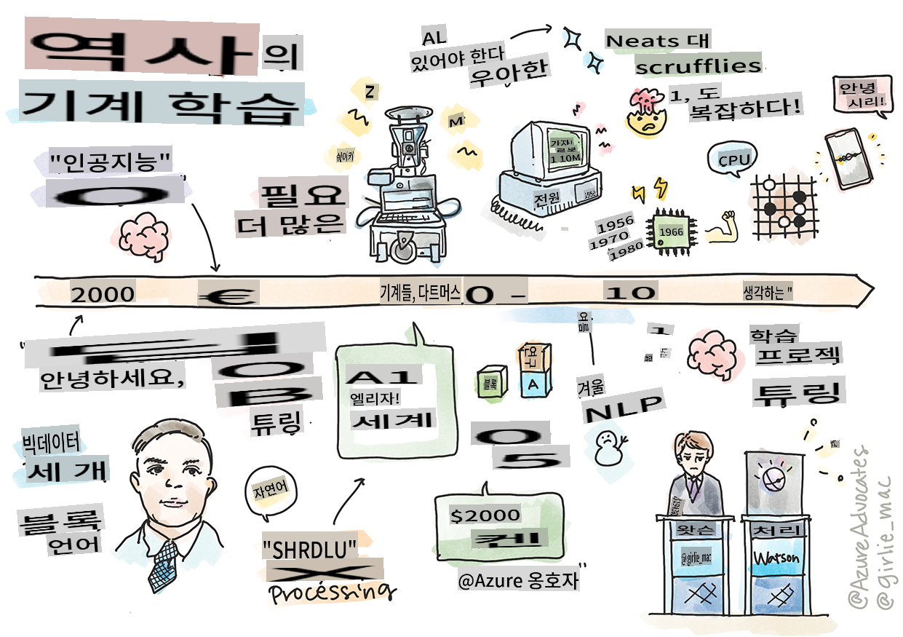
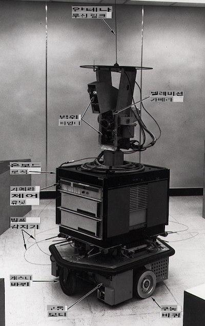
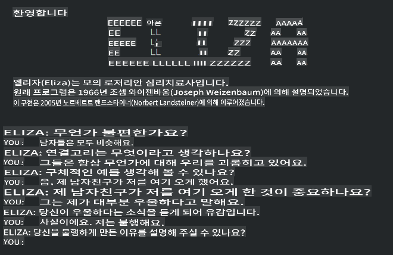

# 머신 러닝의 역사

> 스케치노트 by [Tomomi Imura](https://www.twitter.com/girlie_mac)

## [강의 전 퀴즈](https://gray-sand-07a10f403.1.azurestaticapps.net/quiz/3/)

---

> 🎥 위 이미지를 클릭하여 이 강의를 다룬 짧은 영상을 보세요.

이번 강의에서는 머신 러닝과 인공지능의 역사에서 중요한 이정표들을 살펴보겠습니다.

인공지능(AI) 분야의 역사는 머신 러닝의 역사와 밀접하게 얽혀 있습니다. 머신 러닝을 뒷받침하는 알고리즘과 계산상의 진보가 AI의 발전에 기여했기 때문입니다. 이 분야들이 1950년대에 독립된 연구 영역으로 구체화되기 시작했지만, 중요한 [알고리즘적, 통계적, 수학적, 계산적 및 기술적 발견](https://wikipedia.org/wiki/Timeline_of_machine_learning)은 이 시기 이전에도 존재했으며, 이 시기와 겹칩니다. 사실, 사람들은 [수백 년 동안](https://wikipedia.org/wiki/History_of_artificial_intelligence) 이 질문들에 대해 생각해왔습니다. 이 글은 '생각하는 기계'라는 아이디어의 역사적 지적 기초에 대해 논의합니다.

---
## 주목할 만한 발견들

- 1763, 1812 [베이즈 정리](https://wikipedia.org/wiki/Bayes%27_theorem)와 그 선행 이론들. 이 정리와 그 응용은 사전 지식을 기반으로 사건 발생 확률을 설명하는 추론의 기초가 됩니다.
- 1805 [최소 제곱법 이론](https://wikipedia.org/wiki/Least_squares) 프랑스 수학자 Adrien-Marie Legendre에 의해. 이 이론은 데이터 피팅에 도움을 줍니다.
- 1913 [마르코프 연쇄](https://wikipedia.org/wiki/Markov_chain), 러시아 수학자 Andrey Markov의 이름을 딴 것으로, 이전 상태를 기반으로 가능한 사건의 연속을 설명하는 데 사용됩니다.
- 1957 [퍼셉트론](https://wikipedia.org/wiki/Perceptron)은 미국 심리학자 Frank Rosenblatt가 발명한 선형 분류기의 일종으로, 딥러닝의 발전에 기초가 됩니다.

---

- 1967 [최근접 이웃](https://wikipedia.org/wiki/Nearest_neighbor)은 원래 경로를 맵핑하기 위해 설계된 알고리즘입니다. 머신 러닝 맥락에서는 패턴을 감지하는 데 사용됩니다.
- 1970 [역전파](https://wikipedia.org/wiki/Backpropagation)는 [순방향 신경망](https://wikipedia.org/wiki/Feedforward_neural_network)을 훈련시키는 데 사용됩니다.
- 1982 [순환 신경망](https://wikipedia.org/wiki/Recurrent_neural_network)은 순방향 신경망에서 파생된 인공 신경망으로, 시간 그래프를 생성합니다.

✅ 조금 더 연구해 보세요. 머신 러닝과 AI 역사에서 중요한 다른 날짜는 무엇인가요?

---
## 1950: 생각하는 기계

Alan Turing은 2019년 [대중 투표](https://wikipedia.org/wiki/Icons:_The_Greatest_Person_of_the_20th_Century)에서 20세기 최고의 과학자로 선정된 정말 놀라운 인물로, '생각할 수 있는 기계' 개념의 기초를 마련하는 데 기여한 것으로 인정받고 있습니다. 그는 이 개념에 대한 경험적 증거의 필요성과 반대 의견을 극복하기 위해 [튜링 테스트](https://www.bbc.com/news/technology-18475646)를 만들었습니다. 이 테스트는 우리의 NLP 강의에서 다룰 것입니다.

---
## 1956: 다트머스 여름 연구 프로젝트

"다트머스 여름 연구 프로젝트는 인공지능 분야의 중요한 사건이었으며," 여기서 '인공지능'이라는 용어가 만들어졌습니다 ([출처](https://250.dartmouth.edu/highlights/artificial-intelligence-ai-coined-dartmouth)).

> 학습이나 지능의 다른 모든 측면은 원칙적으로 매우 정확하게 설명될 수 있으며, 따라서 기계가 이를 모방할 수 있습니다.

---

주 연구자인 수학 교수 John McCarthy는 "학습이나 지능의 다른 모든 측면은 원칙적으로 매우 정확하게 설명될 수 있으며, 따라서 기계가 이를 모방할 수 있다"는 가설을 바탕으로 진행하고자 했습니다. 참가자 중에는 이 분야의 또 다른 거장인 Marvin Minsky도 포함되어 있었습니다.

이 워크숍은 "상징적 방법의 부상, 제한된 도메인에 초점을 맞춘 시스템(초기 전문가 시스템), 귀납적 시스템 대 연역적 시스템"과 같은 여러 논의를 시작하고 장려한 것으로 인정받고 있습니다. ([출처](https://wikipedia.org/wiki/Dartmouth_workshop)).

---
## 1956 - 1974: "황금기"

1950년대부터 1970년대 중반까지, AI가 많은 문제를 해결할 수 있을 것이라는 낙관주의가 높았습니다. 1967년, Marvin Minsky는 "한 세대 안에... '인공지능' 문제는 상당히 해결될 것"이라고 자신 있게 말했습니다. (Minsky, Marvin (1967), Computation: Finite and Infinite Machines, Englewood Cliffs, N.J.: Prentice-Hall)

자연어 처리 연구가 번성하고, 검색이 정교해지며 더 강력해졌으며, '마이크로 월드' 개념이 만들어져 단순한 작업이 평범한 언어 명령으로 완료될 수 있었습니다.

---

연구는 정부 기관의 풍부한 자금 지원을 받았고, 계산과 알고리즘에서 진보가 이루어졌으며, 지능형 기계의 프로토타입이 만들어졌습니다. 이러한 기계 중 일부는 다음과 같습니다:

* [Shakey 로봇](https://wikipedia.org/wiki/Shakey_the_robot), 지능적으로 작업을 수행할 방법을 결정할 수 있는 로봇.

    
    > 1972년의 Shakey

---

* Eliza, 초기 '채터봇'으로 사람들과 대화하고 원시적인 '치료사' 역할을 할 수 있었습니다. Eliza에 대해서는 NLP 강의에서 더 자세히 배울 것입니다.

    
    > 채터봇 Eliza의 한 버전

---

* "블록 세계"는 블록을 쌓고 정렬할 수 있는 마이크로 월드의 예로, 기계가 결정을 내리는 실험이 테스트될 수 있었습니다. [SHRDLU](https://wikipedia.org/wiki/SHRDLU)와 같은 라이브러리를 통해 구축된 진보는 언어 처리를 발전시키는 데 도움을 주었습니다.

    

    > 🎥 위 이미지를 클릭하여 비디오를 보세요: SHRDLU와 함께 하는 블록 세계

---
## 1974 - 1980: "AI 겨울"

1970년대 중반까지 '지능형 기계'를 만드는 복잡성이 과소평가되었고, 주어진 계산 능력으로 약속된 성과가 과장되었다는 것이 분명해졌습니다. 자금 지원이 중단되고, 이 분야에 대한 신뢰가 감소했습니다. 신뢰에 영향을 미친 몇 가지 문제는 다음과 같습니다:
---
- **제한 사항**. 계산 능력이 너무 제한적이었습니다.
- **조합 폭발**. 컴퓨터에 더 많은 요구가 있을수록 훈련해야 하는 매개변수의 양이 기하급수적으로 증가했지만, 계산 능력과 기능의 진화는 이에 따라오지 못했습니다.
- **데이터 부족**. 테스트, 개발 및 알고리즘을 개선하는 과정을 방해하는 데이터 부족이 있었습니다.
- **우리가 올바른 질문을 하고 있는가?**. 제기된 질문들 자체가 의문을 제기하기 시작했습니다. 연구자들은 접근 방식에 대한 비판에 직면하기 시작했습니다:
  - 튜링 테스트는 '중국 방 이론'과 같은 아이디어를 통해 의문이 제기되었습니다. 이 이론은 "디지털 컴퓨터를 프로그래밍하면 언어를 이해하는 것처럼 보이게 할 수 있지만 실제 이해를 생성할 수는 없다"고 주장했습니다. ([출처](https://plato.stanford.edu/entries/chinese-room/))
  - 사회에 인공지능을 도입하는 것의 윤리성, 예를 들어 "치료사" ELIZA와 같은 인공지능의 도입이 도전받았습니다.

---

동시에, 다양한 AI 학파가 형성되기 시작했습니다. ["깔끔한 AI" 대 "지저분한 AI"](https://wikipedia.org/wiki/Neats_and_scruffies) 관행 사이에 이분법이 형성되었습니다. _지저분한_ 연구실은 원하는 결과를 얻을 때까지 프로그램을 조정했습니다. _깔끔한_ 연구실은 "논리와 형식적인 문제 해결에 집중했습니다". ELIZA와 SHRDLU는 잘 알려진 _지저분한_ 시스템이었습니다. 1980년대에 ML 시스템의 재현 가능성을 요구하는 수요가 나타나면서, _깔끔한_ 접근 방식이 점차 앞서게 되었으며, 그 결과는 더 설명 가능했습니다.

---
## 1980년대 전문가 시스템

이 분야가 성장하면서, 그 이점이 비즈니스에 더 명확해졌고, 1980년대에는 '전문가 시스템'의 확산이 이루어졌습니다. "전문가 시스템은 최초로 진정으로 성공적인 인공지능(AI) 소프트웨어 형태 중 하나였습니다." ([출처](https://wikipedia.org/wiki/Expert_system)).

이러한 시스템은 실제로 _하이브리드_ 시스템으로, 비즈니스 요구 사항을 정의하는 규칙 엔진과 규칙 시스템을 활용하여 새로운 사실을 추론하는 추론 엔진으로 구성됩니다.

이 시기에는 신경망에 대한 관심도 증가했습니다.

---
## 1987 - 1993: AI '냉각기'

전문화된 전문가 시스템 하드웨어의 확산은 불행히도 지나치게 전문화되는 효과를 가져왔습니다. 개인용 컴퓨터의 등장도 이러한 대형, 전문화된 중앙 시스템과 경쟁했습니다. 컴퓨팅의 민주화가 시작되었으며, 이는 결국 빅 데이터의 현대적 폭발을 위한 길을 열었습니다.

---
## 1993 - 2011

이 시기는 데이터와 계산 능력의 부족으로 인해 이전에 발생한 문제를 해결할 수 있는 새로운 시대를 열었습니다. 데이터의 양은 급격히 증가하고 더 널리 이용 가능해졌으며, 특히 2007년경 스마트폰의 등장으로 인해 더 그렇습니다. 계산 능력은 기하급수적으로 확장되었고, 알고리즘도 함께 발전했습니다. 이 분야는 과거의 자유분방한 날들이 진정한 학문으로 구체화되면서 성숙해지기 시작했습니다.

---
## 현재

오늘날 머신 러닝과 AI는 우리 생활의 거의 모든 부분에 영향을 미칩니다. 이 시대는 이러한 알고리즘이 인간의 삶에 미칠 수 있는 위험과 잠재적 영향을 신중하게 이해할 필요가 있습니다. Microsoft의 Brad Smith는 "정보 기술은 프라이버시와 표현의 자유와 같은 기본적인 인권 보호의 핵심에 이르는 문제를 제기합니다. 이러한 문제는 이러한 제품을 만드는 기술 회사의 책임을 높이며, 우리의 견해로는 신중한 정부 규제와 허용 가능한 사용에 대한 규범의 개발을 요구합니다"라고 말했습니다. ([출처](https://www.technologyreview.com/2019/12/18/102365/the-future-of-ais-impact-on-society/)).

---

미래가 어떻게 될지는 아직 알 수 없지만, 이러한 컴퓨터 시스템과 그들이 실행하는 소프트웨어 및 알고리즘을 이해하는 것이 중요합니다. 이 커리큘럼이 여러분이 더 나은 이해를 얻고 스스로 결정을 내리는 데 도움이 되기를 바랍니다.

> 🎥 위 이미지를 클릭하여 비디오를 보세요: Yann LeCun이 이 강의에서 딥러닝의 역사를 논의합니다

---
## 🚀도전

이 역사적 순간 중 하나를 파고들어 그 뒤에 있는 사람들에 대해 더 알아보세요. 매혹적인 인물들이 있으며, 과학적 발견은 문화적 진공 상태에서 이루어진 것이 아닙니다. 무엇을 발견했나요?

## [강의 후 퀴즈](https://gray-sand-07a10f403.1.azurestaticapps.net/quiz/4/)

---
## 복습 및 자기 학습

여기 시청하고 들을 항목들이 있습니다:

[Amy Boyd가 AI의 진화를 논의하는 이 팟캐스트](http://runasradio.com/Shows/Show/739)

---

## 과제

[타임라인 만들기](assignment.md)

**면책 조항**:
이 문서는 기계 기반 AI 번역 서비스를 사용하여 번역되었습니다. 정확성을 위해 노력하고 있지만, 자동 번역에는 오류나 부정확성이 있을 수 있습니다. 원본 문서의 모국어 버전이 권위 있는 출처로 간주되어야 합니다. 중요한 정보의 경우, 전문적인 인간 번역을 권장합니다. 이 번역 사용으로 인해 발생하는 오해나 오역에 대해서는 책임을 지지 않습니다.