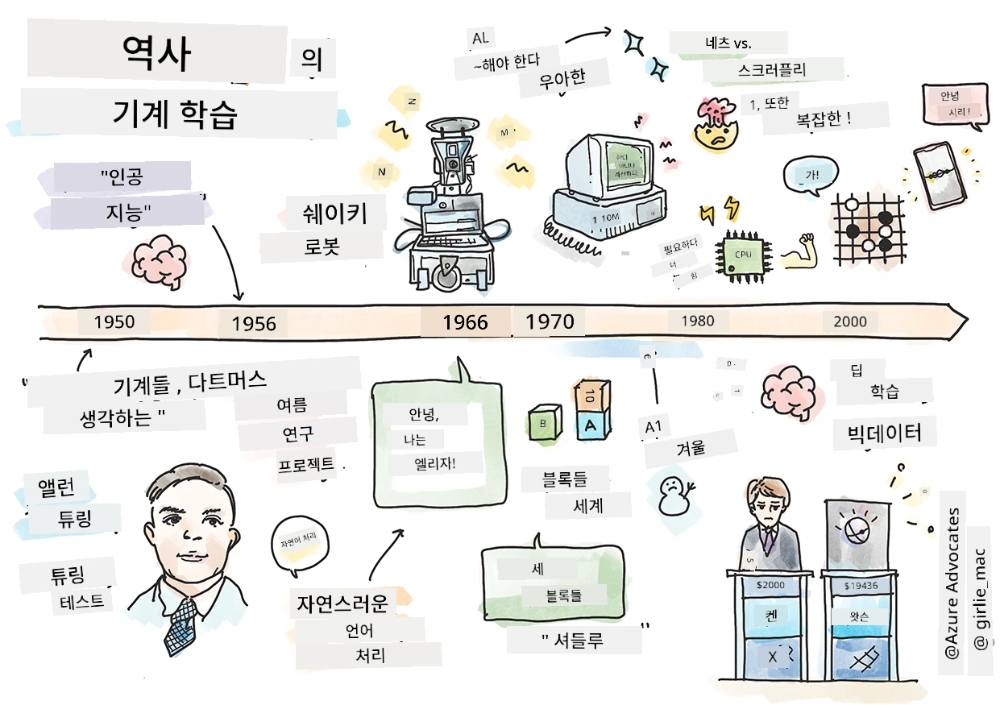
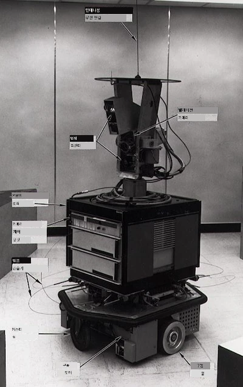
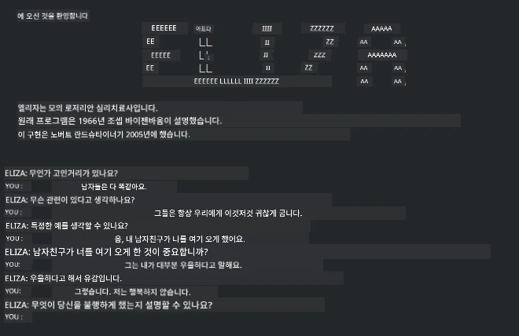

# 머신러닝의 역사

> 스케치노트: [Tomomi Imura](https://www.twitter.com/girlie_mac)

## [강의 전 퀴즈](https://ff-quizzes.netlify.app/en/ml/)

---

> 🎥 위 이미지를 클릭하면 이 강의를 다루는 짧은 영상을 볼 수 있습니다.

이 강의에서는 머신러닝과 인공지능 역사의 주요 이정표를 살펴봅니다.

인공지능(AI)이라는 분야의 역사는 머신러닝의 역사와 밀접하게 얽혀 있습니다. 머신러닝을 뒷받침하는 알고리즘과 계산적 진보가 AI 발전에 기여했기 때문입니다. 1950년대에 이들 분야가 별개의 학문 분야로 형성되기 시작했지만, 중요한 [알고리즘, 통계학, 수학, 계산 및 기술적 발견들](https://wikipedia.org/wiki/Timeline_of_machine_learning)은 그 이전과 겹친 시기에 이루어졌다는 점을 기억하는 것이 유용합니다. 사실, 사람들은 '생각하는 기계'라는 개념에 대해 [수백 년간](https://wikipedia.org/wiki/History_of_artificial_intelligence) 고민해왔습니다. 이 글은 그 개념의 역사적 지적 기반을 다룹니다.

---
## 주목할 만한 발견들

- 1763년, 1812년 [베이즈 정리](https://wikipedia.org/wiki/Bayes%27_theorem) 및 그 이전 공식들. 이 정리와 응용은 추론의 기초로, 사전 지식에 근거한 사건 발생 확률을 설명합니다.
- 1805년 프랑스 수학자 Adrien-Marie Legendre의 [최소제곱법 이론](https://wikipedia.org/wiki/Least_squares). 회귀 단원에서 배우는 이 이론은 데이터 적합에 도움을 줍니다.
- 1913년 러시아 수학자 Andrey Markov의 이름을 딴 [마르코프 연쇄](https://wikipedia.org/wiki/Markov_chain). 이전 상태 기반의 가능한 사건들의 순서를 설명하는 데 사용됩니다.
- 1957년 미국 심리학자 Frank Rosenblatt가 발명한 [퍼셉트론](https://wikipedia.org/wiki/Perceptron). 딥러닝 발전의 기초가 된 선형 분류기입니다.

---

- 1967년 [최근접 이웃 알고리즘](https://wikipedia.org/wiki/Nearest_neighbor). 원래 경로 탐색을 위해 설계되었으나, ML에서는 패턴 인식에 활용됩니다.
- 1970년 [역전파 알고리즘](https://wikipedia.org/wiki/Backpropagation). [피드포워드 신경망](https://wikipedia.org/wiki/Feedforward_neural_network) 학습에 사용됩니다.
- 1982년 [순환 신경망](https://wikipedia.org/wiki/Recurrent_neural_network). 피드포워드 신경망에서 파생되어 시계열 그래프를 만드는 인공 신경망입니다.

✅ 간단한 조사를 해보세요. 머신러닝과 AI 역사에서 중요한 다른 날짜는 무엇이 있나요?

---
## 1950년: 생각하는 기계

2019년 대중 투표에서 [20세기 최고의 과학자로 선정된](https://wikipedia.org/wiki/Icons:_The_Greatest_Person_of_the_20th_Century) 놀라운 인물 Alan Turing은 '생각할 수 있는 기계' 개념의 기초를 마련한 공로가 있습니다. 그는 이 개념의 실증적 증거를 필요로 했고, 이에 대한 반대자들과 맞서 싸웠으며, 우리 NLP 강의에서 다룰 [튜링 테스트](https://www.bbc.com/news/technology-18475646)를 고안했습니다.

---
## 1956년: 다트머스 여름 연구 프로젝트

"다트머스 인공지능 여름 연구 프로젝트는 인공지능 분야에 중요한 사건이었다"고 하며, 여기서 '인공지능'이라는 용어가 처음 만들어졌습니다 ([출처](https://250.dartmouth.edu/highlights/artificial-intelligence-ai-coined-dartmouth)).

> 학습의 모든 측면이나 지능의 다른 특성은 원칙적으로 너무나 정확하게 묘사할 수 있어, 기계가 이를 모방할 수 있다.

---

수학 교수 John McCarthy가 이끌었으며, "학습의 모든 측면이나 지능의 다른 특성은 원칙적으로 너무나 정확하게 묘사할 수 있어서 기계가 이를 모방할 수 있다"는 가설을 바탕으로 진행되었습니다. 참가자 중에는 분야의 또 다른 거장 Marvin Minsky도 있었습니다.

이 워크숍은 "기호 방법의 부상, 제한된 영역에 집중된 시스템(초기 전문가 시스템), 그리고 연역 시스템 대 귀납 시스템"과 같은 여러 논의를 촉진했다고 평가받습니다. ([출처](https://wikipedia.org/wiki/Dartmouth_workshop))

---
## 1956년 - 1974년: "황금기"

1950년대부터 70년대 중반까지, AI가 많은 문제를 해결할 수 있으리라는 낙관론이 높았습니다. 1967년, Marvin Minsky는 "한 세대 내에 '인공지능' 문제는 실질적으로 해결될 것"이라고 자신 있게 말했습니다. (Minsky, Marvin (1967), Computation: Finite and Infinite Machines, Englewood Cliffs, N.J.: Prentice-Hall)

자연어 처리 연구가 번창했고, 탐색 기술이 정제되고 강화되었으며, '마이크로 월드'라는 개념이 만들어져 간단한 작업을 평이한 언어 명령으로 수행했습니다.

---

연구는 정부 기관의 충분한 자금을 받았고, 계산 및 알고리즘 분야에서 진보가 이루어졌으며, 지능형 기계의 시제품들도 만들어졌습니다. 그 중 일부는 다음과 같습니다:

* [Shakey 로봇](https://wikipedia.org/wiki/Shakey_the_robot), '지능적으로' 작업 수행 방법을 결정하고 조작할 수 있었습니다.

    
    > 1972년의 Shakey

---

* 초기 '채터봇'인 엘리자(Eliza)는 사람과 대화를 나누고 원시적인 '치료사' 역할을 했습니다. NLP 강의에서 엘리자에 대해 더 배우게 될 것입니다.

    
    > 채팅봇 엘리자의 한 버전

---

* '블록 월드'는 블록을 쌓거나 분류하는 마이크로 월드의 예로서, 머신이 의사결정을 배우는 실험에 사용됐습니다. [SHRDLU](https://wikipedia.org/wiki/SHRDLU) 같은 라이브러리로 구축된 발전이 언어 처리를 추진했습니다.

    

    > 🎥 위 이미지를 클릭하면 SHRDLU와 블록 월드 영상이 재생됩니다.

---
## 1974년 - 1980년: "AI 겨울"

1970년대 중반 무렵, '지능형 기계'를 만드는 복잡성이 과소평가되었다는 점과 당시의 계산 능력으로 그 약속이 과장되었다는 점이 명백해졌습니다. 자금 지원이 줄어들고 분야에 대한 신뢰도 감소했습니다. 신뢰에 영향을 미친 문제는 다음과 같습니다:
---
- <strong>한계</strong>. 계산 능력이 너무 제한적이었습니다.
- **조합 폭발**. 컴퓨터에 더 많은 요구를 할수록 훈련되어야 할 매개변수 수가 기하급수적으로 증가했으나, 계산 능력과 기능은 그에 맞게 발전하지 못했습니다.
- **데이터 부족**. 알고리즘을 테스트, 개발, 정제하는 데 필요한 데이터가 부족했습니다.
- **우리가 올바른 질문을 하고 있는가?**. 질문 자체가 의심받기 시작했습니다. 연구자들은 다음과 같은 비판에 직면했습니다:
  - 튜링 테스트는 '중국어 방 이론' 등 여러 아이디어를 통해 의문시 되었는데, "디지털 컴퓨터의 프로그래밍이 언어를 이해하는 것처럼 보이게 할 수는 있지만 진정한 이해를 할 수는 없다"고 주장했습니다. ([출처](https://plato.stanford.edu/entries/chinese-room/))
  - '치료사' ELIZA와 같은 인공지능을 사회에 도입하는 윤리성도 도전받았습니다.

---

동시에 다양한 AI 학파가 형성되기 시작했습니다. ['깔끔한 AI'와 '엉성한 AI'](https://wikipedia.org/wiki/Neats_and_scruffies) 간 이분법이 확립되었습니다. _엉성한_ 연구소들은 원하는 결과를 얻을 때까지 프로그램을 여러 시간 동안 조정했습니다. _깔끔한_ 연구소들은 "논리와 공식적 문제 해결에 집중"했습니다. ELIZA와 SHRDLU는 잘 알려진 _엉성한_ 시스템이었습니다. 1980년대에 머신러닝 시스템을 재현 가능하도록 만드는 요구가 생기면서, _깔끔한_ 접근이 점차 주류가 되었는데, 그 결과가 더 설명 가능했기 때문입니다.

---
## 1980년대 전문가 시스템

분야가 성장하면서 비즈니스에 주는 이익이 명확해졌고, 1980년대에는 '전문가 시스템'이 확산되었습니다. "전문가 시스템은 인공지능(AI) 소프트웨어의 최초로 진정한 성공 사례 중 하나였다." ([출처](https://wikipedia.org/wiki/Expert_system))

이 유형의 시스템은 실제로 _하이브리드_로, 비즈니스 요구사항을 정의하는 룰 엔진과 룰 시스템을 이용해 새로운 사실을 추론하는 추론 엔진으로 구성되었습니다.

이 시대에는 신경망에 대한 관심도 높아졌습니다.

---
## 1987년 - 1993년: AI '냉각기'

전문화된 전문가 시스템 하드웨어의 확산은 너무 전문화되는 부작용이 있었습니다. 개인용 컴퓨터의 부상도 크고 전문화된 중앙집중식 시스템과 경쟁했습니다. 컴퓨팅의 민주화가 시작되었고, 이는 결국 현대 빅데이터 폭발의 길을 열었습니다.

---
## 1993년 - 2011년

이 시기는 데이터와 계산 능력 부족으로 인해 이전에 발생했던 문제들을 해결할 수 있는 새로운 시대였습니다. 데이터 양은 급격히 증가하고 더 널리 이용 가능해졌으며, 특히 2007년경 스마트폰의 등장으로 그러했습니다. 계산 능력은 기하급수적으로 확대되었고, 알고리즘도 함께 발전했습니다. 이 분야는 과거의 자유로운 시절에서 성숙한 학문으로 점차 자리 잡았습니다.

---
## 현재

오늘날 머신러닝과 AI는 우리 삶의 거의 모든 부분에 영향을 미칩니다. 이 시대는 이러한 알고리즘이 인간의 삶에 미칠 위험과 잠재적 영향을 신중히 이해할 필요가 있습니다. Microsoft의 Brad Smith가 말했듯이, "정보기술은 프라이버시와 표현의 자유 같은 기본 인권 보호의 핵심 문제를 야기합니다. 이러한 문제는 이 제품을 만드는 기술 기업에 대한 책임을 높이며, 신중한 정부 규제와 허용 가능한 사용에 관한 규범 개발을 요구합니다" ([출처](https://www.technologyreview.com/2019/12/18/102365/the-future-of-ais-impact-on-society/))

---

미래가 어떻게 될지는 지켜봐야 하지만, 이 컴퓨터 시스템과 그 위에서 작동하는 소프트웨어 및 알고리즘을 이해하는 것이 중요합니다. 이 커리큘럼이 여러분이 스스로 판단할 수 있도록 더 나은 이해를 돕길 바랍니다.

> 🎥 위 이미지를 클릭하면, Yann LeCun이 딥러닝 역사를 설명하는 강의를 볼 수 있습니다.

---
## 🚀도전 과제

역사적 순간 중 하나를 깊이 파고들어 그 배경에 있는 인물들에 대해 더 알아보세요. 흥미로운 인물들이 많으며, 어떤 과학적 발견도 문화적 진공 속에서 이루어진 적은 없습니다. 무엇을 발견하셨나요?

## [강의 후 퀴즈](https://ff-quizzes.netlify.app/en/ml/)

---
## 복습 및 자율 학습

시청하고 들을 항목들입니다:

[Amy Boyd가 AI 발전을 논의하는 팟캐스트](http://runasradio.com/Shows/Show/739)

---

## 과제

[타임라인 만들기](assignment.md)

---

<!-- CO-OP TRANSLATOR DISCLAIMER START -->
**면책 조항**:
이 문서는 AI 번역 서비스 [Co-op Translator](https://github.com/Azure/co-op-translator)를 사용하여 번역되었습니다. 정확성을 기하기 위해 노력하고 있으나, 자동 번역은 오류나 부정확한 부분이 있을 수 있음을 유의하시기 바랍니다. 원본 문서의 원어본이 권위 있는 자료로 간주되어야 합니다. 중요한 정보의 경우, 전문가의 인간 번역을 권장합니다. 이 번역 사용으로 인해 발생하는 오해나 잘못된 해석에 대해 당사는 책임을 지지 않습니다.
<!-- CO-OP TRANSLATOR DISCLAIMER END -->