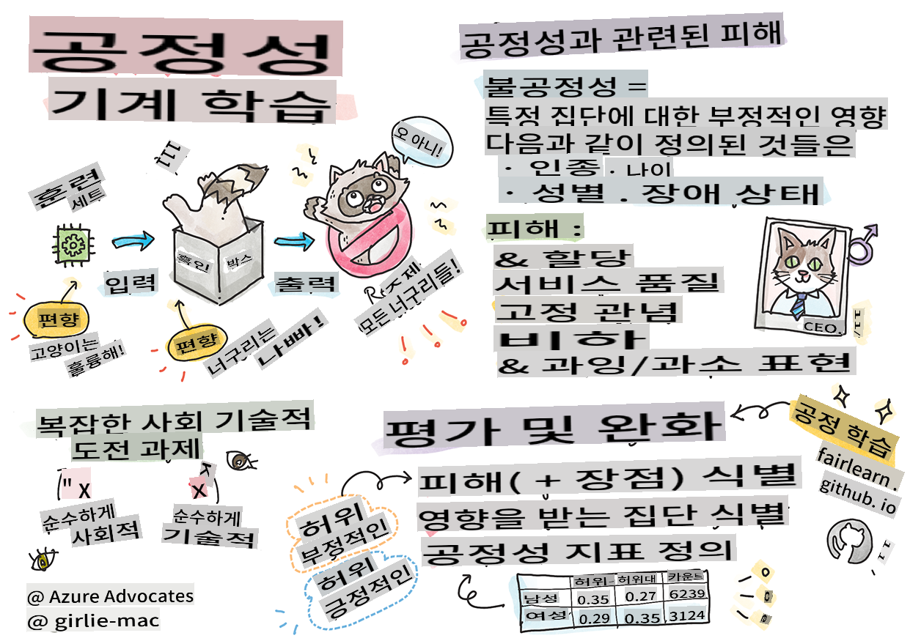
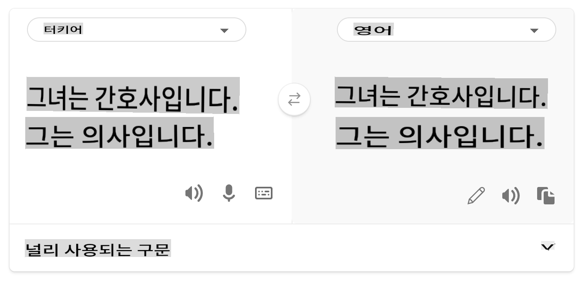

<!--
CO_OP_TRANSLATOR_METADATA:
{
  "original_hash": "8f819813b2ca08ec7b9f60a2c9336045",
  "translation_date": "2025-09-03T23:28:06+00:00",
  "source_file": "1-Introduction/3-fairness/README.md",
  "language_code": "ko"
}
-->
# 책임 있는 AI를 활용한 머신 러닝 솔루션 구축

> 스케치노트: [Tomomi Imura](https://www.twitter.com/girlie_mac)

## [강의 전 퀴즈](https://gray-sand-07a10f403.1.azurestaticapps.net/quiz/5/)

## 소개

이 커리큘럼에서는 머신 러닝이 우리의 일상생활에 어떤 영향을 미치고 있는지 알아보기 시작합니다. 현재도 시스템과 모델은 의료 진단, 대출 승인, 사기 탐지와 같은 일상적인 의사 결정 작업에 관여하고 있습니다. 따라서 이러한 모델이 신뢰할 수 있는 결과를 제공하기 위해 잘 작동하는 것이 중요합니다. 모든 소프트웨어 애플리케이션과 마찬가지로, AI 시스템은 기대에 미치지 못하거나 바람직하지 않은 결과를 초래할 수 있습니다. 그렇기 때문에 AI 모델의 행동을 이해하고 설명할 수 있는 것이 필수적입니다.

모델을 구축하는 데 사용하는 데이터가 인종, 성별, 정치적 견해, 종교와 같은 특정 인구 통계가 부족하거나 불균형적으로 대표되는 경우 어떤 일이 발생할 수 있을지 상상해 보세요. 모델의 출력이 특정 인구 통계를 선호하도록 해석된다면 애플리케이션에 어떤 영향을 미칠까요? 또한 모델이 부정적인 결과를 초래하여 사람들에게 해를 끼친다면 어떻게 될까요? AI 시스템의 행동에 대한 책임은 누구에게 있을까요? 이러한 질문들은 이 커리큘럼에서 탐구할 내용입니다.

이 강의에서 여러분은 다음을 배우게 됩니다:

- 머신 러닝에서 공정성의 중요성과 공정성 관련 피해에 대한 인식을 높입니다.
- 신뢰성과 안전성을 보장하기 위해 이상치와 특이한 시나리오를 탐구하는 실습에 익숙해집니다.
- 포괄적인 시스템을 설계하여 모두를 지원해야 하는 필요성을 이해합니다.
- 데이터와 사람들의 프라이버시와 보안을 보호하는 것이 얼마나 중요한지 탐구합니다.
- AI 모델의 행동을 설명하기 위해 투명성을 갖는 것이 얼마나 중요한지 확인합니다.
- AI 시스템에 대한 신뢰를 구축하기 위해 책임감이 필수적이라는 점을 인식합니다.

## 사전 요구 사항

사전 요구 사항으로 "책임 있는 AI 원칙" 학습 경로를 수강하고 아래의 주제에 대한 비디오를 시청하세요:

[학습 경로](https://docs.microsoft.com/learn/modules/responsible-ai-principles/?WT.mc_id=academic-77952-leestott)를 통해 책임 있는 AI에 대해 더 알아보세요.

> 🎥 위 이미지를 클릭하여 비디오를 시청하세요: Microsoft의 책임 있는 AI 접근 방식

## 공정성

AI 시스템은 모든 사람을 공정하게 대하고 유사한 그룹의 사람들에게 다른 방식으로 영향을 미치는 것을 피해야 합니다. 예를 들어, AI 시스템이 의료 치료, 대출 신청 또는 고용에 대한 지침을 제공할 때, 유사한 증상, 재정 상황 또는 전문 자격을 가진 모든 사람에게 동일한 권장 사항을 제공해야 합니다. 우리 각자는 인간으로서 우리의 결정과 행동에 영향을 미치는 내재된 편견을 가지고 있습니다. 이러한 편견은 우리가 AI 시스템을 훈련시키는 데 사용하는 데이터에서 드러날 수 있습니다. 이러한 조작은 때로는 의도치 않게 발생할 수 있습니다. 데이터를 통해 편견을 도입하고 있는지 의식적으로 알기 어려운 경우가 많습니다.

**“불공정성”**은 인종, 성별, 연령 또는 장애 상태와 같은 기준으로 정의된 특정 그룹에 대한 부정적인 영향 또는 “피해”를 포함합니다. 주요 공정성 관련 피해는 다음과 같이 분류할 수 있습니다:

- **할당**: 예를 들어, 특정 성별이나 민족이 다른 성별이나 민족보다 선호되는 경우.
- **서비스 품질**: 특정 시나리오에 대해 데이터를 훈련시켰지만 현실은 훨씬 더 복잡한 경우, 서비스 성능이 저하됩니다. 예를 들어, 어두운 피부를 가진 사람을 감지하지 못하는 손 비누 디스펜서. [참조](https://gizmodo.com/why-cant-this-soap-dispenser-identify-dark-skin-1797931773)
- **비난**: 부당하게 비판하거나 특정 대상이나 사람을 잘못 평가하는 경우. 예를 들어, 이미지 라벨링 기술이 어두운 피부를 가진 사람들의 이미지를 고릴라로 잘못 라벨링한 사례.
- **과잉 또는 과소 대표**: 특정 직업에서 특정 그룹이 보이지 않는다는 아이디어와 이를 계속 촉진하는 서비스나 기능이 피해를 초래하는 경우.
- **고정관념**: 특정 그룹을 미리 정해진 속성과 연관시키는 경우. 예를 들어, 영어와 터키어 간의 언어 번역 시스템이 성별과 관련된 고정관념으로 인해 부정확성을 가질 수 있습니다.

> 터키어로 번역

> 영어로 다시 번역

AI 시스템을 설계하고 테스트할 때, AI가 인간이 금지된 편향적이거나 차별적인 결정을 내리지 않도록 보장해야 합니다. AI와 머신 러닝에서 공정성을 보장하는 것은 여전히 복잡한 사회기술적 과제입니다.

### 신뢰성과 안전성

신뢰를 구축하려면 AI 시스템이 정상적이고 예상치 못한 조건에서도 신뢰할 수 있고 안전하며 일관성이 있어야 합니다. 특히 이상치 상황에서 AI 시스템이 다양한 상황에서 어떻게 행동할지 아는 것이 중요합니다. AI 솔루션을 구축할 때, AI 솔루션이 직면할 수 있는 다양한 상황을 처리하는 방법에 상당한 초점을 맞춰야 합니다. 예를 들어, 자율주행차는 사람들의 안전을 최우선으로 고려해야 합니다. 따라서 차량을 구동하는 AI는 밤, 폭풍우, 눈보라, 길을 건너는 아이들, 애완동물, 도로 공사 등 차량이 직면할 수 있는 모든 가능한 시나리오를 고려해야 합니다. AI 시스템이 다양한 조건을 신뢰할 수 있고 안전하게 처리할 수 있는 능력은 데이터 과학자나 AI 개발자가 시스템 설계 또는 테스트 중에 고려한 예상 수준을 반영합니다.

> [🎥 여기를 클릭하여 비디오를 시청하세요: ](https://www.microsoft.com/videoplayer/embed/RE4vvIl)

### 포괄성

AI 시스템은 모든 사람을 참여시키고 지원하도록 설계되어야 합니다. AI 시스템을 설계하고 구현할 때 데이터 과학자와 AI 개발자는 시스템에서 사람들을 의도치 않게 배제할 수 있는 잠재적 장애물을 식별하고 해결합니다. 예를 들어, 전 세계적으로 10억 명의 장애인이 있습니다. AI의 발전으로 인해 이들은 일상생활에서 더 쉽게 다양한 정보와 기회를 접할 수 있습니다. 장애물을 해결함으로써 모든 사람에게 혜택을 주는 더 나은 경험을 제공하는 AI 제품을 혁신하고 개발할 기회를 창출합니다.

> [🎥 여기를 클릭하여 비디오를 시청하세요: AI에서의 포괄성](https://www.microsoft.com/videoplayer/embed/RE4vl9v)

### 보안과 프라이버시

AI 시스템은 안전해야 하며 사람들의 프라이버시를 존중해야 합니다. 프라이버시, 정보 또는 생명을 위험에 빠뜨리는 시스템에 대한 신뢰는 낮아집니다. 머신 러닝 모델을 훈련할 때, 최상의 결과를 도출하기 위해 데이터를 활용합니다. 이를 수행하는 과정에서 데이터의 출처와 무결성을 고려해야 합니다. 예를 들어, 데이터가 사용자 제출 데이터인지 또는 공개적으로 이용 가능한 데이터인지 확인해야 합니다. 다음으로, 데이터를 처리하는 동안 기밀 정보를 보호하고 공격에 저항할 수 있는 AI 시스템을 개발하는 것이 중요합니다. AI가 점점 더 널리 사용됨에 따라 프라이버시를 보호하고 중요한 개인 및 비즈니스 정보를 안전하게 유지하는 것이 점점 더 중요하고 복잡해지고 있습니다. 프라이버시와 데이터 보안 문제는 AI에서 특히 주의 깊게 다뤄야 합니다. 데이터에 대한 접근은 AI 시스템이 사람들에 대한 정확하고 정보에 입각한 예측과 결정을 내리는 데 필수적이기 때문입니다.

> [🎥 여기를 클릭하여 비디오를 시청하세요: AI에서의 보안](https://www.microsoft.com/videoplayer/embed/RE4voJF)

- 업계는 GDPR(일반 데이터 보호 규정)과 같은 규정에 의해 크게 촉진된 프라이버시와 보안에서 상당한 발전을 이루었습니다.
- 그러나 AI 시스템에서는 시스템을 더 개인적이고 효과적으로 만들기 위해 더 많은 개인 데이터를 필요로 하는 것과 프라이버시 간의 긴장을 인정해야 합니다.
- 인터넷으로 연결된 컴퓨터의 탄생과 마찬가지로 AI와 관련된 보안 문제의 급증을 목격하고 있습니다.
- 동시에 AI가 보안을 개선하는 데 사용되는 사례도 있습니다. 예를 들어, 대부분의 현대적인 안티바이러스 스캐너는 오늘날 AI 휴리스틱에 의해 구동됩니다.
- 데이터 과학 프로세스가 최신 프라이버시 및 보안 관행과 조화를 이루도록 보장해야 합니다.

### 투명성

AI 시스템은 이해할 수 있어야 합니다. 투명성의 중요한 부분은 AI 시스템과 그 구성 요소의 행동을 설명하는 것입니다. AI 시스템에 대한 이해를 개선하려면 이해관계자가 시스템이 어떻게 작동하고 왜 작동하는지 이해하여 잠재적인 성능 문제, 안전 및 프라이버시 문제, 편향, 배제적 관행 또는 의도치 않은 결과를 식별할 수 있어야 합니다. 또한 AI 시스템을 사용하는 사람들은 시스템을 언제, 왜, 어떻게 사용하는지, 그리고 사용하는 시스템의 한계를 솔직하게 공개해야 한다고 믿습니다. 예를 들어, 은행이 소비자 대출 결정을 지원하기 위해 AI 시스템을 사용하는 경우, 결과를 검토하고 시스템의 권장 사항에 영향을 미치는 데이터를 이해하는 것이 중요합니다. 정부는 산업 전반에 걸쳐 AI를 규제하기 시작하고 있으므로 데이터 과학자와 조직은 AI 시스템이 규제 요구 사항을 충족하는지, 특히 바람직하지 않은 결과가 발생했을 때 이를 설명해야 합니다.

> [🎥 여기를 클릭하여 비디오를 시청하세요: AI에서의 투명성](https://www.microsoft.com/videoplayer/embed/RE4voJF)

- AI 시스템이 매우 복잡하기 때문에 시스템이 어떻게 작동하는지 이해하고 결과를 해석하기 어렵습니다.
- 이러한 이해 부족은 시스템이 관리, 운영 및 문서화되는 방식에 영향을 미칩니다.
- 더 중요한 것은 이러한 이해 부족이 시스템이 생성하는 결과를 사용하여 내리는 결정에 영향을 미친다는 점입니다.

### 책임감

AI 시스템을 설계하고 배포하는 사람들은 시스템이 어떻게 작동하는지에 대해 책임을 져야 합니다. 책임감의 필요성은 특히 얼굴 인식과 같은 민감한 기술을 사용할 때 중요합니다. 최근에는 실종 아동을 찾는 것과 같은 용도로 기술의 잠재력을 보는 법 집행 기관에서 얼굴 인식 기술에 대한 수요가 증가하고 있습니다. 그러나 이러한 기술은 특정 개인에 대한 지속적인 감시를 가능하게 함으로써 시민의 기본적인 자유를 위협할 수 있는 방식으로 정부에 의해 사용될 가능성이 있습니다. 따라서 데이터 과학자와 조직은 AI 시스템이 개인이나 사회에 미치는 영향에 대해 책임을 져야 합니다.

> 🎥 위 이미지를 클릭하여 비디오를 시청하세요: 얼굴 인식을 통한 대규모 감시에 대한 경고

결국, AI를 사회에 도입하는 첫 번째 세대로서 우리 세대가 직면한 가장 큰 질문 중 하나는 컴퓨터가 사람들에게 계속 책임을 질 수 있도록 하고 컴퓨터를 설계하는 사람들이 다른 모든 사람들에게 책임을 질 수 있도록 하는 방법입니다.

## 영향 평가

머신 러닝 모델을 훈련하기 전에 AI 시스템의 목적, 의도된 사용, 배포 위치 및 시스템과 상호작용할 사람들을 이해하기 위해 영향 평가를 수행하는 것이 중요합니다. 이는 시스템을 평가하는 리뷰어 또는 테스터가 잠재적 위험과 예상 결과를 식별할 때 고려해야 할 요소를 아는 데 도움이 됩니다.

영향 평가를 수행할 때 초점을 맞춰야 할 영역은 다음과 같습니다:

* **개인에 대한 부정적 영향**: 시스템 성능을 저해하는 제한 또는 요구 사항, 지원되지 않는 사용 또는 알려진 제한 사항을 인식하여 시스템이 개인에게 해를 끼칠 수 있는 방식으로 사용되지 않도록 보장합니다.
* **데이터 요구 사항**: 시스템이 데이터를 사용하는 방법과 위치를 이해하면 리뷰어가 고려해야 할 데이터 요구 사항(예: GDPR 또는 HIPPA 데이터 규정)을 탐구할 수 있습니다. 또한 데이터의 출처나 양이 훈련에 충분한지 검토합니다.
* **영향 요약**: 시스템 사용으로 인해 발생할 수 있는 잠재적 피해 목록을 수집합니다. ML 라이프사이클 전반에 걸쳐 식별된 문제가 완화되었거나 해결되었는지 검토합니다.
* **적용 가능한 목표**: 여섯 가지 핵심 원칙 각각에 대한 목표를 평가하고 목표가 충족되었는지, 그리고 어떤 격차가 있는지 확인합니다.

## 책임 있는 AI로 디버깅하기

소프트웨어 애플리케이션을 디버깅하는 것과 마찬가지로, AI 시스템을 디버깅하는 것은 시스템의 문제를 식별하고 해결하는 데 필요한 과정입니다. 시스템이 예상대로 또는 책임감 있게 작동하지 않는 이유에 영향을 미치는 많은 요인이 있습니다. 대부분의 전통적인 모델 성능 메트릭은 모델 성능의 정량적 집계로, 책임 있는 AI 원칙을 위반하는 방식을 분석하기에는 충분하지 않습니다. 게다가 머신 러닝 모델은 결과를 유도하는 요인을 이해하거나 실수를 했을 때 설명을 제공하기 어려운 블랙박스입니다. 이 과정에서 우리는 책임 있는 AI 대시보드를 사용하여 AI 시스템을 디버깅하는 방법을 배우게 됩니다. 대시보드는 데이터 과학자와 AI 개발자가 다음을 수행할 수 있는 포괄적인 도구를 제공합니다:

* **오류 분석**: 시스템의 공정성 또는 신뢰성에 영향을 미칠 수 있는 모델의 오류 분포를 식별합니다.
* **모델 개요**: 데이터 코호트 간의 모델 성능에서 불균형이 있는 곳을 발견합니다.
* **데이터 분석**: 데이터 분포를 이해하고 공정성, 포괄성 및 신뢰성 문제를 초래할 수 있는 데이터의 잠재적 편향을 식별합니다.
* **모델 해석 가능성**: 모델의 예측에 영향을 미치거나 영향을 주는 요인을 이해합니다. 이는 모델의 행동을 설명하는 데 중요하며, 투명성과 책임감을 위해 필요합니다.

## 🚀 도전 과제

피해가 처음부터 도입되지 않도록 하기 위해 우리는 다음을 수행해야 합니다:

- 시스템 작업에 참여하는 사람들 간에 다양한 배경과 관점을 확보합니다.
- 우리 사회의 다양성을 반영하는 데이터 세트에 투자합니다.
- 머신 러닝 라이프사이클 전반에 걸쳐 책임 있는 AI를 감지하고 수정하는 더 나은 방법을 개발합니다.

모델 구축 및 사용에서 모델의 신뢰할 수 없는 점이 드러나는 실제 시나리오를 생각해 보세요. 우리는 무엇을 더 고려해야 할까요?

## [강의 후 퀴즈](https://gray-sand-07a10f403.1.azurestaticapps.net/quiz/6/)
## 복습 및 자기 학습
이 수업에서는 머신 러닝에서 공정성과 불공정성 개념의 기본 사항을 배웠습니다.  

다음 워크숍을 시청하여 주제를 더 깊이 탐구하세요:  

- 책임 있는 AI를 추구하며: 원칙을 실천으로 옮기기 - Besmira Nushi, Mehrnoosh Sameki, Amit Sharma  

  

> 🎥 위 이미지를 클릭하면 Besmira Nushi, Mehrnoosh Sameki, Amit Sharma가 발표한 "RAI Toolbox: 책임 있는 AI를 구축하기 위한 오픈 소스 프레임워크" 영상을 볼 수 있습니다.  

또한 읽어보세요:  

- Microsoft의 RAI 리소스 센터: [Responsible AI Resources – Microsoft AI](https://www.microsoft.com/ai/responsible-ai-resources?activetab=pivot1%3aprimaryr4)  

- Microsoft의 FATE 연구 그룹: [FATE: 공정성, 책임성, 투명성, 윤리성 - Microsoft Research](https://www.microsoft.com/research/theme/fate/)  

RAI Toolbox:  

- [Responsible AI Toolbox GitHub 저장소](https://github.com/microsoft/responsible-ai-toolbox)  

Azure Machine Learning의 공정성을 보장하는 도구에 대해 읽어보세요:  

- [Azure Machine Learning](https://docs.microsoft.com/azure/machine-learning/concept-fairness-ml?WT.mc_id=academic-77952-leestott)  

## 과제  

[RAI Toolbox 탐색하기](assignment.md)  

---

**면책 조항**:  
이 문서는 AI 번역 서비스 [Co-op Translator](https://github.com/Azure/co-op-translator)를 사용하여 번역되었습니다. 정확성을 위해 최선을 다하고 있지만, 자동 번역에는 오류나 부정확성이 포함될 수 있습니다. 원본 문서를 해당 언어로 작성된 상태에서 권위 있는 자료로 간주해야 합니다. 중요한 정보의 경우, 전문적인 인간 번역을 권장합니다. 이 번역 사용으로 인해 발생하는 오해나 잘못된 해석에 대해 책임을 지지 않습니다.