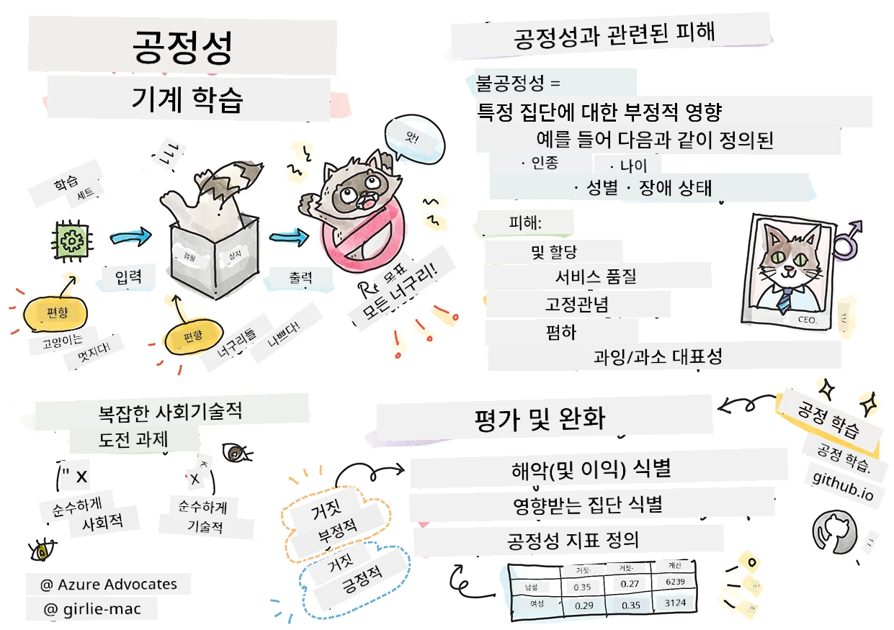
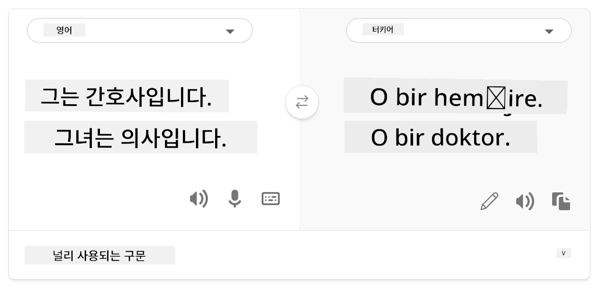
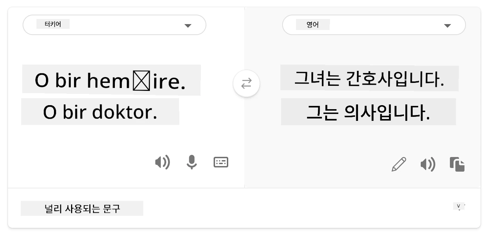
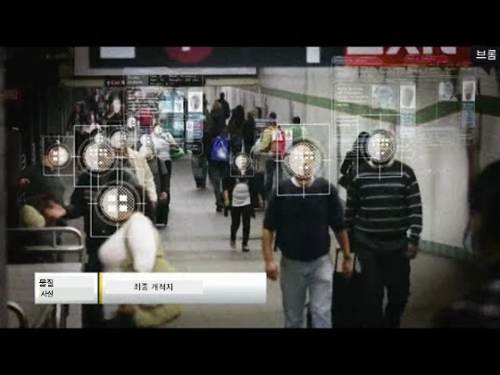

# 책임 있는 AI로 머신러닝 솔루션 구축하기
 

> 스케치노트 작성자: [Tomomi Imura](https://www.twitter.com/girlie_mac)

## [강의 전 퀴즈](https://ff-quizzes.netlify.app/en/ml/)
 
## 소개

이 교육과정에서는 머신러닝이 우리 일상에 어떻게 영향을 미치고 있는지를 알아보기 시작할 것입니다. 이미 시스템과 모델은 의료 진단, 대출 승인, 사기 탐지 등의 일상적 의사결정 업무에 관여하고 있습니다. 따라서 이러한 모델들이 신뢰할 수 있는 결과를 제공할 수 있도록 잘 작동하는 것이 중요합니다. 모든 소프트웨어 애플리케이션과 마찬가지로, AI 시스템도 기대에 미치지 못하거나 원치 않는 결과를 만들 수 있습니다. 그러므로 AI 모델의 동작을 이해하고 설명할 수 있는 능력은 필수적입니다.

모델을 만드는 데 사용하는 데이터가 인종, 성별, 정치적 견해, 종교 등 특정 인구 집단을 포함하지 않거나 한쪽에 치우쳐 있다면 어떤 일이 벌어질지 상상해 보십시오. 모델의 출력이 특정 인구 집단에 유리하게 해석된다면 어떻게 될까요? 그 결과는 해당 응용 프로그램에 어떤 영향을 미칠까요? 그리고 모델이 바람직하지 않은 결과를 내거나 사람들에게 해를 끼친다면 어떻게 될까요? AI 시스템의 행동에 누가 책임이 있을까요? 이러한 질문들을 이 교육과정에서 탐구할 것입니다.

이 수업에서는 다음을 배우게 됩니다:

- 머신러닝에서 공정성의 중요성과 공정성 관련 피해에 대한 인식을 높입니다.
- 신뢰성과 안전성을 보장하기 위해 이상치와 특이한 상황을 탐색하는 실습에 익숙해집니다.
- 모두를 포용하는 시스템 설계의 필요성을 이해합니다.
- 데이터와 사람들의 프라이버시 및 보안 보호의 중요성을 탐구합니다.
- AI 모델의 동작을 설명하기 위한 투명한 접근법(글라스 박스 방식)의 중요성을 확인합니다.
- AI 시스템에 대한 신뢰를 구축하기 위해 책임성이 필수적임을 인지합니다.

## 전제 조건

전제 조건으로 "책임 있는 AI 원칙" 학습 경로를 수강하고 아래 주제에 대한 동영상을 시청하시기 바랍니다:

다음 [학습 경로](https://docs.microsoft.com/learn/modules/responsible-ai-principles/?WT.mc_id=academic-77952-leestott)에서 책임 있는 AI에 대해 자세히 알아보세요.

> 🎥 위 이미지를 클릭하면 동영상 시청: Microsoft의 책임 있는 AI 접근법

## 공정성

AI 시스템은 모든 사람을 공정하게 대우하고 유사한 그룹의 사람들에게 다르게 영향을 미치는 일을 피해야 합니다. 예를 들어, AI 시스템이 의료 치료, 대출 신청, 고용에 대한 조언을 제공할 때 유사한 증상, 재정 상황, 전문 자격을 가진 사람들에게 동일한 권고를 해야 합니다. 우리 각자는 결정과 행동에 영향을 미치는 선천적인 편견을 지니고 있으며, 이러한 편견은 AI 시스템 학습에 사용되는 데이터에도 나타날 수 있습니다. 이런 편향은 때때로 의도치 않게 발생할 수 있으며, 데이터를 통해 편향을 의식적으로 인지하는 것은 종종 어렵습니다.

<strong>“불공정함”</strong>은 인종, 성별, 연령, 장애 상태 등 특정 집단에 부정적 영향을 미치는 해악을 의미합니다. 주요 공정성 관련 피해 유형은 다음과 같이 분류됩니다:

- <strong>할당</strong>: 예를 들어, 한 성별이나 민족이 다른 집단보다 선호되는 경우.
- **서비스 품질**: 특정 시나리오만 학습시켰으나 실제 상황은 더 복잡해 서비스 성능이 떨어질 때. 예로 어두운 피부색을 인식하지 못하는 손 세정제 디스펜서가 있습니다. [참고자료](https://gizmodo.com/why-cant-this-soap-dispenser-identify-dark-skin-1797931773)
- <strong>폄하</strong>: 부당하게 비판하거나 낙인을 찍는 행위. 예를 들어, 이미지 라벨링 기술이 어두운 피부색 사람들을 고릴라로 잘못 인식한 경우가 있습니다.
- **과대 또는 과소 대표**: 특정 그룹이 특정 직종에서 보이지 않거나 서비스가 이를 계속 촉진할 때 발생하는 피해.
- <strong>고정관념</strong>: 특정 집단에 미리 할당된 속성을 연결하는 행위. 예를 들어, 영어와 터키어 간 번역 시스템이 성별 고정관념에 기반한 단어로 인해 부정확할 수 있습니다.

> 터키어 번역

> 영어로 재번역

AI 시스템을 설계하고 테스트할 때 AI가 공정하며 편향되거나 차별적인 결정을 내리지 않도록 해야 합니다. 이는 인간에게도 금지된 행위입니다. AI와 머신러닝에서 공정성을 보장하는 것은 복잡한 사회기술적 도전 과제입니다.

### 신뢰성과 안전성

신뢰를 구축하려면 AI 시스템이 정상 및 예기치 않은 상황 모두에서 신뢰할 수 있고 안전하며 일관되어야 합니다. AI 시스템이 다양한 상황, 특히 이상치에서 어떻게 동작하는지 아는 것이 중요합니다. AI 솔루션을 구축할 때는 AI가 마주치게 될 다양한 상황을 다루는 데 많은 초점을 둬야 합니다. 예를 들어, 자율주행차는 사람들의 안전을 최우선으로 해야 합니다. 따라서 차량을 작동하는 AI는 야간, 폭풍우, 눈보라, 길을 가로지르는 아이들, 애완동물, 도로 공사 등 다양한 시나리오를 고려해야 합니다. AI 시스템이 다양한 조건을 얼마나 신뢰성 있고 안전하게 처리하는지는 데이터 과학자 또는 AI 개발자가 설계 및 테스트 시 어느 정도 예상했는지를 반영합니다.

> [🎥 영상 시청하려면 여기를 클릭하세요: ](https://www.microsoft.com/videoplayer/embed/RE4vvIl)

### 포용성

AI 시스템은 모두가 참여하고 권한을 갖도록 설계되어야 합니다. AI 시스템 설계 및 구현 시 데이터 과학자와 AI 개발자들은 사람들을 의도치 않게 제외할 수 있는 장벽을 식별하고 해결합니다. 전 세계적으로 10억 명의 장애인이 있습니다. AI 기술이 발전함에 따라 이들은 일상생활에서 정보와 기회에 더욱 쉽게 접근할 수 있게 되었습니다. 장벽을 해결함으로써 모두에게 혜택이 되는 더 나은 경험을 제공하는 AI 제품을 혁신하고 개발할 수 있는 기회를 창출합니다.

> [🎥 영상 시청하려면 여기를 클릭하세요: AI에서의 포용성](https://www.microsoft.com/videoplayer/embed/RE4vl9v)

### 보안 및 개인정보 보호

AI 시스템은 안전해야 하며 사람들의 프라이버시를 존중해야 합니다. 사람들은 개인정보, 정보 또는 생명이 위험에 처하는 시스템을 덜 신뢰합니다. 머신러닝 모델을 훈련할 때 최상의 결과를 내기 위해 데이터에 의존합니다. 이때 데이터 출처와 무결성을 고려해야 합니다. 예를 들어, 데이터가 사용자 제출 데이터인지 공개적으로 사용 가능한지 여부가 중요합니다. 또한, 데이터를 다룰 때 기밀 정보를 보호하고 공격에 저항하는 AI 시스템을 개발하는 것이 필수적입니다. AI가 보편화되면서 개인정보 보호와 중요한 개인 및 기업 정보 보안이 더욱 중요하고 복잡해졌습니다. AI의 정확한 예측과 결정을 위해 데이터 접근이 필수적이므로 프라이버시 및 데이터 보안 문제에 특별히 주의를 기울여야 합니다.

> [🎥 영상 시청하려면 여기를 클릭하세요: AI에서의 보안](https://www.microsoft.com/videoplayer/embed/RE4voJF)

- 업계 전반에서 GDPR(일반 데이터 보호 규정) 같은 규제 덕분에 프라이버시와 보안 분야에서 크게 발전해 왔습니다.
- 그러나 AI 시스템에서는 더 개인화되고 효율적인 시스템을 만들기 위해 더 많은 개인정보가 필요한 것과 프라이버시 사이의 긴장을 인식해야 합니다.
- 인터넷과 연결된 컴퓨터가 처음 등장했을 때처럼 AI 관련 보안 이슈도 급증하고 있습니다.
- 동시에 AI는 보안을 향상하는 데 사용되고 있습니다. 예를 들어, 오늘날 대부분의 최신 안티바이러스 스캐너는 AI 휴리스틱을 활용합니다.
- 데이터 과학 프로세스가 최신 프라이버시 및 보안 관행과 조화롭게 융합되도록 해야 합니다.

### 투명성
AI 시스템은 이해할 수 있어야 합니다. 투명성의 중요한 부분은 AI 시스템과 구성 요소의 동작을 설명하는 것입니다. AI 시스템의 이해도를 높이려면 이해관계자가 시스템이 어떻게 그리고 왜 동작하는지 파악하여 성능 문제, 안전 및 프라이버시 우려, 편향, 배제적 관행 또는 의도치 않은 결과를 식별할 수 있어야 합니다. 또한 AI 시스템을 사용하는 주체가 언제, 왜, 어떻게 AI를 배포하는지를 정직하고 솔직히 밝혀야 하며 사용 시스템의 한계도 알려야 한다고 믿습니다. 예를 들어, 은행이 소비자 대출 결정을 지원하기 위해 AI 시스템을 사용할 경우 결과를 검토하고 추천에 영향을 미치는 데이터가 무엇인지 이해하는 것이 중요합니다. 정부가 산업 전반에 AI 규제를 시작하고 있으므로 데이터 과학자와 조직은 AI 시스템이 규제 요구사항을 충족하는지, 특히 바람직하지 않은 결과가 발생했을 때 설명할 수 있어야 합니다.

> [🎥 영상 시청하려면 여기를 클릭하세요: AI에서의 투명성](https://www.microsoft.com/videoplayer/embed/RE4voJF)

- AI 시스템이 매우 복잡하여 작동 방식을 이해하고 결과를 해석하기 어렵습니다.
- 이러한 이해 부족은 시스템 관리, 운영 및 문서화 방식에 영향을 미칩니다.
- 더욱 중요하게는, 시스템이 만든 결과를 사용한 의사결정에 영향을 줍니다.

### 책임성
 
AI 시스템을 설계하고 배포하는 사람들은 그 시스템의 작동 방식에 책임을 져야 합니다. 특히 안면 인식 같은 민감한 기술을 사용할 때 책임성은 더욱 중요합니다. 최근 법 집행 기관들이 실종 아동 탐색 등에서 기술의 잠재력을 주목하며 안면 인식 기술에 대한 수요가 증가하고 있습니다. 그러나 정부가 특정 개인을 지속적으로 감시하는 등 시민의 기본 자유를 위협하는 데 사용할 수도 있습니다. 따라서 데이터 과학자와 조직은 AI 시스템이 개인 또는 사회에 미치는 영향에 책임을 져야 합니다.

> 🎥 위 이미지를 클릭하면 동영상 시청: 안면 인식 통한 대규모 감시에 대한 경고

결국 우리 세대, 즉 AI를 사회에 처음 도입하는 세대에게 가장 큰 질문 중 하나는 컴퓨터가 사람들에게 책임을 지도록 어떻게 보장할 것인가와 컴퓨터를 설계하는 사람들이 모두에게 책임을 지도록 어떻게 보장할 것인가입니다.

## 영향 평가

머신러닝 모델을 훈련하기 전에 AI 시스템의 목적, 의도된 사용, 배포 장소, 상호 작용할 대상 등을 이해하기 위해 영향 평가를 수행하는 것이 중요합니다. 이는 시스템을 평가하는 검토자 또는 테스터가 잠재적 위험과 예상 결과를 판단할 때 고려해야 할 요소를 파악하는 데 도움을 줍니다.

영향 평가 시 중점 영역은 다음과 같습니다:

* **개인에 대한 부정적 영향**: 제한이나 요구 사항, 지원되지 않는 사용, 알려진 제한 사항 등 시스템 성능을 저해하는 요소를 인지하여 개인에게 피해를 주는 방식으로 시스템이 사용되지 않도록 하는 것이 중요합니다.
* **데이터 요구 사항**: 시스템이 데이터를 어떻게 어디에서 사용할지 이해하면 검토자가 GDPR 또는 HIPAA 같은 데이터 규정과 같은 데이터 요구 사항을 고려할 수 있습니다. 또한 데이터 소스와 양이 훈련에 충분한지 평가합니다.
* **영향 요약**: 시스템 사용으로 발생할 수 있는 잠재적 피해 목록을 수집합니다. 머신러닝 라이프사이클 전반에 걸쳐 식별된 문제들이 경감되거나 해결되었는지 검토합니다.
* **각 원칙별 적용 가능한 목표**: 6가지 핵심 원칙 각자의 목표가 충족되는지, 부족한 점이 있는지 평가합니다.

## 책임 있는 AI로 디버깅하기

소프트웨어 애플리케이션을 디버깅하는 것과 마찬가지로 AI 시스템을 디버깅하는 것은 시스템 내 문제를 식별하고 해결하는 필수 과정입니다. 모델이 기대대로 또는 책임감 있게 작동하지 못하는 데 영향을 미치는 여러 요인이 있습니다. 대부분의 전통적인 모델 성능 지표는 모델 성능의 정량적 집계치에 불과하여 모델이 책임 있는 AI 원칙을 위반하는 방식을 분석하기에 충분하지 않습니다. 게다가 머신러닝 모델은 결과를 어떻게 도출하는지 이해하기 어려운 블랙박스이며, 오류가 발생할 때 설명하기 어렵습니다. 이 강의 후반부에서는 책임 있는 AI 대시보드를 사용하여 AI 시스템을 디버깅하는 방법을 배울 것입니다. 이 대시보드는 데이터 과학자와 AI 개발자가 다음과 같은 작업을 수행할 수 있는 전체적인 도구를 제공합니다:

* **오류 분석**: 시스템의 공정성 또는 신뢰성에 영향을 미칠 수 있는 모델 오류 분포를 식별합니다.
* **모델 개요**: 데이터 집단별 모델 성능 격차를 발견합니다.
* **데이터 분석**: 데이터 분포를 이해하고 공정성, 포용성, 신뢰성 문제를 일으킬 수 있는 편향을 식별합니다.
* **모델 해석 가능성**: 모델 예측에 영향을 주는 요소를 파악합니다. 이는 투명성과 책임성에 중요한 모델 동작 설명에 도움을 줍니다.

## 🚀 도전 과제
 
피해를 처음부터 예방하기 위해 우리는:

- 시스템 작업에 참여하는 사람들의 배경과 관점의 다양성을 확보해야 합니다.
- 사회의 다양성을 반영한 데이터셋에 투자해야 합니다.
- 책임 있는 AI가 발생했을 때 이를 탐지하고 수정하는 머신러닝 라이프사이클 전반에 걸친 더 나은 방법을 개발해야 합니다.

모델 구축과 사용에서 신뢰를 잃는 현실 사례를 생각해 보십시오. 또 무엇을 고려해야 할까요?

## [강의 후 퀴즈](https://ff-quizzes.netlify.app/en/ml/)

## 복습 및 자기주도 학습
 

이 수업에서는 머신러닝에서 공정성과 불공정성 개념의 기본을 배웠습니다.  
 
이 워크숍을 시청하여 주제를 더 깊이 파고들어 보세요: 

- 책임 있는 AI 추구: Besmira Nushi, Mehrnoosh Sameki, Amit Sharma가 전하는 원칙의 실천

> 🎥 위 이미지를 클릭하여 영상 보기: Besmira Nushi, Mehrnoosh Sameki, Amit Sharma가 전하는 책임 있는 AI 구축을 위한 오픈 소스 프레임워크 RAI Toolbox

또한, 다음을 읽어보세요: 

- Microsoft의 RAI 리소스 센터: [Responsible AI Resources – Microsoft AI](https://www.microsoft.com/ai/responsible-ai-resources?activetab=pivot1%3aprimaryr4) 

- Microsoft의 FATE 연구 그룹: [FATE: Fairness, Accountability, Transparency, and Ethics in AI - Microsoft Research](https://www.microsoft.com/research/theme/fate/) 

RAI Toolbox: 

- [Responsible AI Toolbox GitHub 저장소](https://github.com/microsoft/responsible-ai-toolbox)

Azure Machine Learning의 공정성 보장 도구에 대해 읽어보세요:

- [Azure Machine Learning](https://docs.microsoft.com/azure/machine-learning/concept-fairness-ml?WT.mc_id=academic-77952-leestott) 

## 과제

[RAI Toolbox 탐색하기](assignment.md)

---

<!-- CO-OP TRANSLATOR DISCLAIMER START -->
**면책 조항**:
이 문서는 AI 번역 서비스 [Co-op Translator](https://github.com/Azure/co-op-translator)를 사용하여 번역되었습니다. 정확성을 기하기 위해 노력하고 있으나, 자동 번역은 오류나 부정확한 부분이 있을 수 있음을 유의하시기 바랍니다. 원본 문서의 원어본이 권위 있는 자료로 간주되어야 합니다. 중요한 정보의 경우, 전문가의 인간 번역을 권장합니다. 이 번역 사용으로 인해 발생하는 오해나 잘못된 해석에 대해 당사는 책임을 지지 않습니다.
<!-- CO-OP TRANSLATOR DISCLAIMER END -->