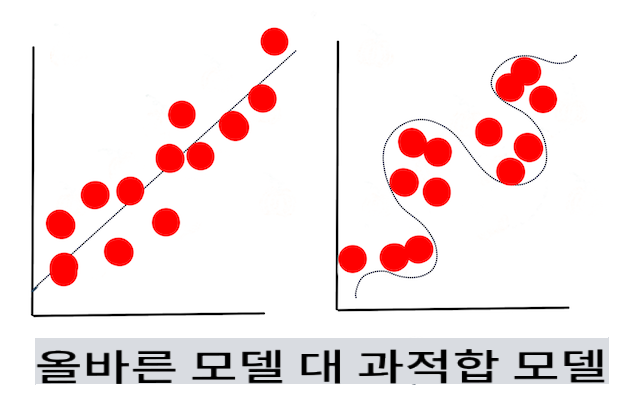

# 머신 러닝 기법

머신 러닝 모델과 그들이 사용하는 데이터를 구축하고 사용하는 과정은 다른 개발 워크플로우와는 매우 다릅니다. 이번 강의에서는 이 과정을 명확히 하고, 알아야 할 주요 기법들을 개괄할 것입니다. 여러분은:

- 머신 러닝을 뒷받침하는 과정을 높은 수준에서 이해할 것입니다.
- '모델', '예측', '훈련 데이터'와 같은 기본 개념을 탐구할 것입니다.

## [사전 퀴즈](https://gray-sand-07a10f403.1.azurestaticapps.net/quiz/7/)

> 🎥 위 이미지를 클릭하면 이 강의를 다루는 짧은 동영상을 볼 수 있습니다.

## 소개

높은 수준에서 보면, 머신 러닝(ML) 프로세스를 만드는 기술은 여러 단계로 구성됩니다:

1. **질문 결정**. 대부분의 ML 프로세스는 간단한 조건 프로그램이나 규칙 기반 엔진으로는 답할 수 없는 질문을 하는 것에서 시작합니다. 이러한 질문들은 종종 데이터 모음에 기반한 예측을 중심으로 합니다.
2. **데이터 수집 및 준비**. 질문에 답하려면 데이터가 필요합니다. 데이터의 품질과 양은 초기 질문에 얼마나 잘 답할 수 있는지를 결정합니다. 데이터를 시각화하는 것은 이 단계에서 중요한 측면입니다. 이 단계는 또한 모델을 구축하기 위해 데이터를 훈련과 테스트 그룹으로 나누는 것을 포함합니다.
3. **훈련 방법 선택**. 질문과 데이터의 특성에 따라, 데이터를 가장 잘 반영하고 정확한 예측을 할 수 있도록 모델을 훈련시키는 방법을 선택해야 합니다. 이 단계는 특정 전문 지식이 필요하고, 종종 상당한 양의 실험을 요구합니다.
4. **모델 훈련**. 훈련 데이터를 사용하여 다양한 알고리즘을 사용해 모델을 훈련시켜 데이터의 패턴을 인식하게 합니다. 모델은 데이터의 특정 부분을 더 잘 반영하기 위해 내부 가중치를 조정할 수 있습니다.
5. **모델 평가**. 수집된 데이터에서 이전에 본 적 없는 데이터(테스트 데이터)를 사용하여 모델의 성능을 평가합니다.
6. **매개변수 조정**. 모델의 성능을 기반으로 다른 매개변수나 변수를 사용하여 프로세스를 다시 실행할 수 있습니다.
7. **예측**. 새로운 입력을 사용하여 모델의 정확성을 테스트합니다.

## 어떤 질문을 할 것인가

컴퓨터는 데이터에서 숨겨진 패턴을 발견하는 데 특히 능숙합니다. 이 유틸리티는 조건 기반 규칙 엔진을 만들어 쉽게 답할 수 없는 특정 도메인에 대한 질문을 가진 연구자들에게 매우 유용합니다. 예를 들어, 보험업무에서 데이터 과학자는 흡연자와 비흡연자의 사망률에 대한 수작업 규칙을 만들 수 있습니다.

그러나 많은 다른 변수가 방정식에 들어오면, ML 모델은 과거 건강 기록을 기반으로 미래의 사망률을 예측하는 데 더 효율적일 수 있습니다. 더 즐거운 예로는, 특정 위치의 4월 날씨 예측을 위도, 경도, 기후 변화, 해양 근접성, 제트 스트림 패턴 등을 포함한 데이터를 기반으로 예측하는 것입니다.

✅ 이 [슬라이드 자료](https://www2.cisl.ucar.edu/sites/default/files/2021-10/0900%20June%2024%20Haupt_0.pdf)는 날씨 분석에서 ML을 사용하는 역사적 관점을 제공합니다.  

## 모델 구축 전 작업

모델을 구축하기 전에 완료해야 할 몇 가지 작업이 있습니다. 질문을 테스트하고 모델의 예측을 기반으로 가설을 형성하려면 여러 요소를 식별하고 구성해야 합니다.

### 데이터

질문에 확실히 답할 수 있으려면 적절한 유형의 충분한 데이터가 필요합니다. 이 시점에서 해야 할 두 가지 작업이 있습니다:

- **데이터 수집**. 데이터 분석의 공정성에 대한 이전 강의를 염두에 두고, 데이터를 신중하게 수집하십시오. 이 데이터의 출처, 내재된 편향성, 출처를 문서화하십시오.
- **데이터 준비**. 데이터 준비 과정에는 여러 단계가 있습니다. 다양한 출처에서 온 데이터를 통합하고 정규화해야 할 수도 있습니다. 문자열을 숫자로 변환하는 것과 같은 다양한 방법으로 데이터의 품질과 양을 개선할 수 있습니다([클러스터링](../../5-Clustering/1-Visualize/README.md)에서처럼). 원본 데이터를 기반으로 새로운 데이터를 생성할 수도 있습니다([분류](../../4-Classification/1-Introduction/README.md)에서처럼). 데이터를 정리하고 편집할 수도 있습니다([웹 앱](../../3-Web-App/README.md) 강의 전처럼). 마지막으로, 훈련 기술에 따라 데이터를 무작위로 섞어야 할 수도 있습니다.

✅ 데이터를 수집하고 처리한 후, 데이터의 형태가 의도한 질문에 답할 수 있는지 확인하십시오. [클러스터링](../../5-Clustering/1-Visualize/README.md) 강의에서 발견한 것처럼, 데이터가 주어진 작업에서 잘 작동하지 않을 수 있습니다!

### 특성과 목표

[특성](https://www.datasciencecentral.com/profiles/blogs/an-introduction-to-variable-and-feature-selection)은 데이터의 측정 가능한 속성입니다. 많은 데이터셋에서 '날짜', '크기', '색상'과 같은 열 머리글로 표현됩니다. 코드에서 보통 `X`으로 표현되는 특성 변수는 모델을 훈련시키기 위해 사용되는 입력 변수를 나타냅니다.

목표는 예측하려는 것입니다. 코드에서 보통 `y`으로 표현되는 목표는 데이터에 대해 묻고자 하는 질문의 답을 나타냅니다: 12월에 가장 저렴한 **색상의** 호박은 무엇일까요? 샌프란시스코에서 가장 좋은 부동산 **가격**을 가진 지역은 어디일까요? 때로는 목표를 레이블 속성이라고도 합니다.

### 특성 변수 선택

🎓 **특성 선택 및 특성 추출** 모델을 구축할 때 어떤 변수를 선택해야 할까요? 아마도 가장 성능이 좋은 모델을 위해 올바른 변수를 선택하는 특성 선택 또는 특성 추출 과정을 거치게 될 것입니다. 그러나 이들은 동일한 것이 아닙니다: "특성 추출은 원래 특성의 함수에서 새로운 특성을 생성하는 반면, 특성 선택은 특성의 하위 집합을 반환합니다." ([출처](https://wikipedia.org/wiki/Feature_selection))

### 데이터 시각화

데이터 과학자의 도구 키트에서 중요한 측면은 Seaborn이나 MatPlotLib과 같은 훌륭한 라이브러리를 사용하여 데이터를 시각화하는 능력입니다. 데이터를 시각적으로 표현하면 활용할 수 있는 숨겨진 상관관계를 발견할 수 있습니다. 시각화는 또한 편향이나 불균형 데이터를 발견하는 데 도움이 될 수 있습니다([분류](../../4-Classification/2-Classifiers-1/README.md)에서 발견한 것처럼).

### 데이터셋 분할

훈련 전에 데이터셋을 불균등한 크기로 나누어야 합니다. 그러나 여전히 데이터를 잘 대표해야 합니다.

- **훈련**. 이 부분은 모델을 훈련시키기 위해 맞추는 데이터셋입니다. 이 세트는 원래 데이터셋의 대부분을 구성합니다.
- **테스트**. 테스트 데이터셋은 원래 데이터에서 수집된 독립적인 데이터 그룹으로, 구축된 모델의 성능을 확인하는 데 사용됩니다.
- **검증**. 검증 세트는 모델의 하이퍼파라미터나 아키텍처를 조정하여 모델을 개선하는 데 사용하는 더 작은 독립적인 예제 그룹입니다. 데이터의 크기와 질문에 따라, 이 세트를 구축할 필요가 없을 수도 있습니다([시계열 예측](../../7-TimeSeries/1-Introduction/README.md)에서 언급한 것처럼).

## 모델 구축

훈련 데이터를 사용하여 다양한 알고리즘을 사용해 데이터를 **훈련**시켜 모델을 구축하는 것이 목표입니다. 모델을 훈련시키면 데이터를 노출하고, 발견된 패턴에 대해 가정을 하며, 이를 검증하고 수락하거나 거부합니다.

### 훈련 방법 결정

질문과 데이터의 특성에 따라 훈련 방법을 선택할 것입니다. 이 과정에서 [Scikit-learn의 문서](https://scikit-learn.org/stable/user_guide.html)를 탐색하며 다양한 방법을 살펴볼 수 있습니다. 경험에 따라 최적의 모델을 구축하기 위해 여러 방법을 시도해야 할 수도 있습니다. 데이터 과학자들이 모델의 성능을 평가하고, 정확도, 편향, 기타 품질 저하 문제를 확인하며, 적절한 훈련 방법을 선택하는 과정을 거칠 가능성이 높습니다.

### 모델 훈련

훈련 데이터를 갖춘 상태에서 모델을 '맞추기' 위해 준비가 되었습니다. 많은 ML 라이브러리에서 'model.fit'이라는 코드를 볼 수 있습니다 - 이때 특성 변수를 값 배열(보통 'X')로, 목표 변수를 (보통 'y')로 보냅니다.

### 모델 평가

훈련 과정이 완료되면(큰 모델을 훈련시키는 데 여러 번의 반복 또는 '에포크'가 필요할 수 있음), 테스트 데이터를 사용하여 모델의 품질을 평가할 수 있습니다. 이 데이터는 모델이 이전에 분석하지 않은 원래 데이터의 하위 집합입니다. 모델의 품질에 대한 메트릭 테이블을 출력할 수 있습니다.

🎓 **모델 피팅**

머신 러닝의 맥락에서 모델 피팅은 모델의 기본 함수가 익숙하지 않은 데이터를 분석하려는 시도로서의 정확성을 의미합니다.

🎓 **언더피팅**과 **오버피팅**은 모델의 품질을 저하시키는 일반적인 문제입니다. 모델이 충분히 잘 맞지 않거나 너무 잘 맞아 예측이 훈련 데이터와 너무 밀접하게 또는 너무 느슨하게 일치하는 경우가 있습니다. 오버피팅된 모델은 데이터의 세부 사항과 노이즈를 너무 잘 학습하여 훈련 데이터를 너무 잘 예측합니다. 언더피팅된 모델은 훈련 데이터나 아직 '보지 못한' 데이터를 정확히 분석하지 못하여 정확하지 않습니다.

> [Jen Looper](https://twitter.com/jenlooper)의 인포그래픽

## 매개변수 조정

초기 훈련이 완료되면 모델의 품질을 관찰하고 '하이퍼파라미터'를 조정하여 개선할 수 있는지 고려하십시오. 자세한 내용은 [문서](https://docs.microsoft.com/en-us/azure/machine-learning/how-to-tune-hyperparameters?WT.mc_id=academic-77952-leestott)를 참조하십시오.

## 예측

이제 완전히 새로운 데이터를 사용하여 모델의 정확성을 테스트할 수 있습니다. 모델을 생산에 사용하기 위해 웹 자산을 구축하는 '응용' ML 설정에서는 사용자 입력(예: 버튼 클릭)을 수집하여 변수를 설정하고 모델에 추론 또는 평가를 위해 보낼 수 있습니다.

이 강의에서는 데이터 과학자의 모든 제스처와 더불어, '풀 스택' ML 엔지니어가 되기 위한 여정을 진행하면서 준비, 구축, 테스트, 평가, 예측하는 방법을 발견할 것입니다.

---

## 🚀도전

ML 실무자의 단계를 반영하는 흐름도를 그리세요. 지금 과정에서 자신이 어디에 있는지, 어디에서 어려움을 겪을 것 같은지, 무엇이 쉬워 보이는지 예측해 보세요.

## [사후 퀴즈](https://gray-sand-07a10f403.1.azurestaticapps.net/quiz/8/)

## 복습 및 자기 학습

데이터 과학자들이 자신의 일상 업무에 대해 이야기하는 인터뷰를 온라인에서 검색해 보세요. [여기](https://www.youtube.com/watch?v=Z3IjgbbCEfs)에 하나가 있습니다.

## 과제

[데이터 과학자 인터뷰](assignment.md)

**면책 조항**:
이 문서는 기계 기반 AI 번역 서비스를 사용하여 번역되었습니다. 정확성을 위해 노력하고 있지만 자동 번역에는 오류나 부정확성이 있을 수 있습니다. 원어로 작성된 원본 문서를 권위 있는 자료로 간주해야 합니다. 중요한 정보에 대해서는 전문적인 인간 번역을 권장합니다. 이 번역 사용으로 인해 발생하는 오해나 잘못된 해석에 대해서는 책임을 지지 않습니다.