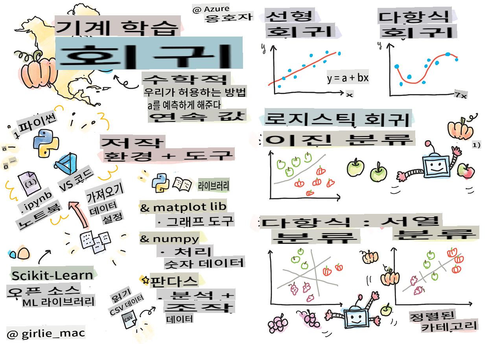
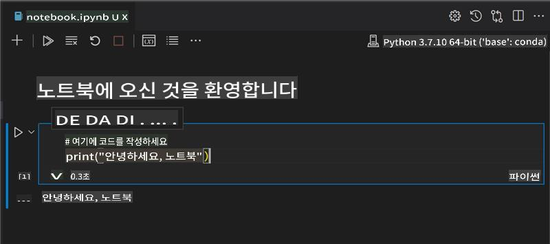
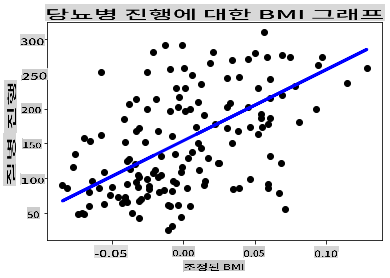

# Python과 Scikit-learn으로 회귀 모델 시작하기



> 스케치노트: [Tomomi Imura](https://www.twitter.com/girlie_mac)

## [강의 전 퀴즈](https://gray-sand-07a10f403.1.azurestaticapps.net/quiz/9/)

> ### [이 강의는 R에서도 제공됩니다!](../../../../2-Regression/1-Tools/solution/R/lesson_1.html)

## 소개

이 네 개의 강의에서, 회귀 모델을 구축하는 방법을 배우게 됩니다. 곧 이 모델들이 무엇을 하는지 설명할 것입니다. 하지만 그 전에, 과정을 시작하기 위해 필요한 도구들이 준비되었는지 확인하세요!

이 강의에서는 다음을 배우게 됩니다:

- 로컬 머신 러닝 작업을 위해 컴퓨터를 설정하는 방법.
- Jupyter 노트북을 사용하는 방법.
- Scikit-learn 설치 및 사용 방법.
- 실습을 통해 선형 회귀를 탐구하는 방법.

## 설치 및 설정

[](https://youtu.be/-DfeD2k2Kj0 "초보자를 위한 머신 러닝 - 머신 러닝 모델을 구축할 도구 준비")

> 🎥 위 이미지를 클릭하여 머신 러닝을 위해 컴퓨터를 설정하는 짧은 비디오를 시청하세요.

1. **Python 설치**. [Python](https://www.python.org/downloads/)이 컴퓨터에 설치되어 있는지 확인하세요. Python은 많은 데이터 과학 및 머신 러닝 작업에 사용됩니다. 대부분의 컴퓨터 시스템에는 이미 Python이 설치되어 있습니다. 일부 사용자에게 설정을 쉽게 해주는 [Python Coding Packs](https://code.visualstudio.com/learn/educators/installers?WT.mc_id=academic-77952-leestott)도 있습니다.

   하지만 Python의 일부 사용법은 특정 버전을 요구하는 경우가 있으므로, [가상 환경](https://docs.python.org/3/library/venv.html)에서 작업하는 것이 유용합니다.

2. **Visual Studio Code 설치**. 컴퓨터에 Visual Studio Code가 설치되어 있는지 확인하세요. 기본 설치를 위해 [Visual Studio Code 설치](https://code.visualstudio.com/) 지침을 따르세요. 이 강의에서는 Visual Studio Code에서 Python을 사용할 것이므로, [Python 개발을 위한 Visual Studio Code 설정](https://docs.microsoft.com/learn/modules/python-install-vscode?WT.mc_id=academic-77952-leestott) 방법을 익혀두는 것이 좋습니다.

   > 이 [Learn modules](https://docs.microsoft.com/users/jenlooper-2911/collections/mp1pagggd5qrq7?WT.mc_id=academic-77952-leestott) 컬렉션을 통해 Python에 익숙해지세요.
   >
   > [](https://youtu.be/yyQM70vi7V8 "Visual Studio Code로 Python 설정")
   >
   > 🎥 위 이미지를 클릭하여 Visual Studio Code 내에서 Python을 사용하는 비디오를 시청하세요.

3. **Scikit-learn 설치**. [이 지침](https://scikit-learn.org/stable/install.html)을 따라 Scikit-learn을 설치하세요. Python 3을 사용해야 하므로 가상 환경을 사용하는 것이 좋습니다. M1 Mac에 이 라이브러리를 설치하는 경우, 위 링크된 페이지에 특별한 지침이 있습니다.

4. **Jupyter Notebook 설치**. [Jupyter 패키지](https://pypi.org/project/jupyter/)를 설치해야 합니다.

## ML 작성 환경

**노트북**을 사용하여 Python 코드를 개발하고 머신 러닝 모델을 만들 것입니다. 이 파일 유형은 데이터 과학자들에게 흔히 사용되며, `.ipynb` 확장자로 식별할 수 있습니다.

노트북은 개발자가 코드를 작성하고 코드 주위에 주석을 추가하고 문서를 작성할 수 있는 대화형 환경을 제공합니다. 이는 실험적이거나 연구 지향적인 프로젝트에 매우 유용합니다.

[](https://youtu.be/7E-jC8FLA2E "초보자를 위한 머신 러닝 - 회귀 모델을 구축하기 위한 Jupyter 노트북 설정")

> 🎥 위 이미지를 클릭하여 이 연습을 진행하는 짧은 비디오를 시청하세요.

### 연습 - 노트북 사용하기

이 폴더에서 _notebook.ipynb_ 파일을 찾을 수 있습니다.

1. Visual Studio Code에서 _notebook.ipynb_ 파일을 엽니다.

   Python 3+로 Jupyter 서버가 시작됩니다. 노트북의 여러 부분에 `run`로 표시된 코드 조각이 있습니다. 재생 버튼 모양의 아이콘을 선택하여 코드 블록을 실행할 수 있습니다.

2. `md` 아이콘을 선택하고 약간의 마크다운과 다음 텍스트 **# Welcome to your notebook**을 추가합니다.

   다음으로, Python 코드를 추가합니다.

3. 코드 블록에 **print('hello notebook')**을 입력합니다.
4. 화살표를 선택하여 코드를 실행합니다.

   출력된 문장을 볼 수 있어야 합니다:

    ```output
    hello notebook
    ```



코드와 주석을 섞어서 노트북을 자체 문서화할 수 있습니다.

✅ 웹 개발자의 작업 환경과 데이터 과학자의 작업 환경이 얼마나 다른지 잠시 생각해보세요.

## Scikit-learn 시작하기

이제 로컬 환경에 Python이 설정되었고 Jupyter 노트북에 익숙해졌으므로, Scikit-learn에도 익숙해져 봅시다. Scikit-learn은 머신 러닝 작업을 수행하는 데 도움을 주는 [광범위한 API](https://scikit-learn.org/stable/modules/classes.html#api-ref)를 제공합니다.

그들의 [웹사이트](https://scikit-learn.org/stable/getting_started.html)에 따르면, "Scikit-learn은 지도 학습과 비지도 학습을 지원하는 오픈 소스 머신 러닝 라이브러리입니다. 또한 모델 적합, 데이터 전처리, 모델 선택 및 평가 등을 위한 다양한 도구를 제공합니다."

이 강의에서는 Scikit-learn과 다른 도구들을 사용하여 '전통적인 머신 러닝' 작업을 수행할 머신 러닝 모델을 구축할 것입니다. 우리는 신경망과 딥러닝을 일부러 피했으며, 이는 곧 출시될 'AI for Beginners' 커리큘럼에서 다룰 예정입니다.

Scikit-learn은 모델을 구축하고 평가하는 것을 간단하게 만듭니다. 주로 숫자 데이터를 사용하며 학습 도구로 사용할 수 있는 여러 가지 준비된 데이터셋을 포함하고 있습니다. 또한 학생들이 시도해볼 수 있는 사전 구축된 모델도 포함되어 있습니다. 기본 데이터를 사용하여 Scikit-learn으로 첫 번째 머신 러닝 모델을 구축하는 과정을 탐구해 봅시다.

## 연습 - 첫 번째 Scikit-learn 노트북

> 이 튜토리얼은 Scikit-learn 웹사이트의 [선형 회귀 예제](https://scikit-learn.org/stable/auto_examples/linear_model/plot_ols.html#sphx-glr-auto-examples-linear-model-plot-ols-py)에서 영감을 받았습니다.

[](https://youtu.be/2xkXL5EUpS0 "초보자를 위한 머신 러닝 - Python에서 첫 번째 선형 회귀 프로젝트")

> 🎥 위 이미지를 클릭하여 이 연습을 진행하는 짧은 비디오를 시청하세요.

이 강의와 관련된 _notebook.ipynb_ 파일에서 '쓰레기통' 아이콘을 눌러 모든 셀을 지웁니다.

이 섹션에서는 학습 목적으로 Scikit-learn에 내장된 작은 당뇨병 데이터셋을 사용할 것입니다. 당뇨병 환자를 위한 치료를 테스트하려고 한다고 가정해 봅시다. 머신 러닝 모델은 변수 조합을 기반으로 어떤 환자가 치료에 더 잘 반응할지 결정하는 데 도움을 줄 수 있습니다. 시각화된 매우 기본적인 회귀 모델조차도 이론적인 임상 시험을 조직하는 데 도움이 될 수 있는 변수에 대한 정보를 보여줄 수 있습니다.

✅ 다양한 회귀 방법이 있으며, 선택하는 방법은 찾고자 하는 답에 따라 다릅니다. 주어진 나이의 사람의 예상 키를 예측하려면, **숫자 값**을 찾고 있으므로 선형 회귀를 사용합니다. 특정 요리가 비건인지 아닌지를 알아내고 싶다면, **카테고리 할당**을 찾고 있으므로 로지스틱 회귀를 사용합니다. 로지스틱 회귀에 대해서는 나중에 더 배우게 될 것입니다. 데이터를 통해 물어볼 수 있는 질문들에 대해 생각해 보고, 어떤 방법이 더 적합할지 생각해 보세요.

이 작업을 시작해 봅시다.

### 라이브러리 가져오기

이 작업을 위해 몇 가지 라이브러리를 가져오겠습니다:

- **matplotlib**. [그래프 도구](https://matplotlib.org/)로 유용하며, 선 그래프를 만드는 데 사용할 것입니다.
- **numpy**. [numpy](https://numpy.org/doc/stable/user/whatisnumpy.html)는 Python에서 숫자 데이터를 처리하는 데 유용한 라이브러리입니다.
- **sklearn**. 이는 [Scikit-learn](https://scikit-learn.org/stable/user_guide.html) 라이브러리입니다.

작업을 도와줄 라이브러리를 가져옵니다.

1. 다음 코드를 입력하여 라이브러리를 가져옵니다:

   ```python
   import matplotlib.pyplot as plt
   import numpy as np
   from sklearn import datasets, linear_model, model_selection
   ```

   위에서는 `matplotlib`, `numpy` and you are importing `datasets`, `linear_model` and `model_selection` from `sklearn`. `model_selection` is used for splitting data into training and test sets.

### The diabetes dataset

The built-in [diabetes dataset](https://scikit-learn.org/stable/datasets/toy_dataset.html#diabetes-dataset) includes 442 samples of data around diabetes, with 10 feature variables, some of which include:

- age: age in years
- bmi: body mass index
- bp: average blood pressure
- s1 tc: T-Cells (a type of white blood cells)

✅ This dataset includes the concept of 'sex' as a feature variable important to research around diabetes. Many medical datasets include this type of binary classification. Think a bit about how categorizations such as this might exclude certain parts of a population from treatments.

Now, load up the X and y data.

> 🎓 Remember, this is supervised learning, and we need a named 'y' target.

In a new code cell, load the diabetes dataset by calling `load_diabetes()`. The input `return_X_y=True` signals that `X` will be a data matrix, and `y`가 회귀 대상이 될 것입니다.

1. 데이터 매트릭스의 모양과 첫 번째 요소를 보여주는 print 명령을 추가합니다:

    ```python
    X, y = datasets.load_diabetes(return_X_y=True)
    print(X.shape)
    print(X[0])
    ```

    응답으로 받는 것은 튜플입니다. 튜플의 두 번째 값을 각각 `X` and `y`에 할당하는 것입니다. [튜플에 대해 더 알아보기](https://wikipedia.org/wiki/Tuple).

    이 데이터는 442개의 항목으로 구성되어 있으며, 각 배열은 10개의 요소로 구성되어 있음을 알 수 있습니다:

    ```text
    (442, 10)
    [ 0.03807591  0.05068012  0.06169621  0.02187235 -0.0442235  -0.03482076
    -0.04340085 -0.00259226  0.01990842 -0.01764613]
    ```

    ✅ 데이터와 회귀 대상 간의 관계에 대해 잠시 생각해 보세요. 선형 회귀는 특성 X와 대상 변수 y 간의 관계를 예측합니다. 문서에서 당뇨병 데이터셋의 [대상](https://scikit-learn.org/stable/datasets/toy_dataset.html#diabetes-dataset)을 찾을 수 있습니까? 이 데이터셋은 주어진 대상에 대해 무엇을 나타내고 있습니까?

2. 다음으로, 데이터셋의 3번째 열을 선택하여 플롯할 부분을 선택합니다. `:` operator to select all rows, and then selecting the 3rd column using the index (2). You can also reshape the data to be a 2D array - as required for plotting - by using `reshape(n_rows, n_columns)`를 사용하여 이 작업을 수행할 수 있습니다. 파라미터 중 하나가 -1이면, 해당 차원이 자동으로 계산됩니다.

   ```python
   X = X[:, 2]
   X = X.reshape((-1,1))
   ```

   ✅ 언제든지 데이터를 출력하여 모양을 확인하세요.

3. 이제 플롯할 준비가 되었으므로, 머신이 이 데이터셋의 숫자 간의 논리적 분할을 결정하는 데 도움이 되는지 확인할 수 있습니다. 이를 위해 데이터(X)와 대상(y)을 테스트 및 훈련 세트로 분할해야 합니다. Scikit-learn에는 이를 수행하는 간단한 방법이 있습니다. 주어진 지점에서 테스트 데이터를 분할할 수 있습니다.

   ```python
   X_train, X_test, y_train, y_test = model_selection.train_test_split(X, y, test_size=0.33)
   ```

4. 이제 모델을 훈련할 준비가 되었습니다! 선형 회귀 모델을 로드하고 `model.fit()`을 사용하여 X 및 y 훈련 세트로 훈련합니다:

    ```python
    model = linear_model.LinearRegression()
    model.fit(X_train, y_train)
    ```

    ✅ `model.fit()` is a function you'll see in many ML libraries such as TensorFlow

5. Then, create a prediction using test data, using the function `predict()`를 사용하여 데이터 그룹 간의 선을 그릴 것입니다.

    ```python
    y_pred = model.predict(X_test)
    ```

6. 이제 데이터를 플롯으로 표시할 시간입니다. Matplotlib은 이 작업에 매우 유용한 도구입니다. 모든 X 및 y 테스트 데이터를 산점도로 만들고, 모델의 데이터 그룹 사이에서 가장 적절한 위치에 선을 그리기 위해 예측을 사용합니다.

    ```python
    plt.scatter(X_test, y_test,  color='black')
    plt.plot(X_test, y_pred, color='blue', linewidth=3)
    plt.xlabel('Scaled BMIs')
    plt.ylabel('Disease Progression')
    plt.title('A Graph Plot Showing Diabetes Progression Against BMI')
    plt.show()
    ```

   

   ✅ 여기서 무슨 일이 일어나고 있는지 잠시 생각해 보세요. 많은 작은 데이터 점들 사이에 직선이 그려져 있지만, 정확히 무엇을 하고 있습니까? 이 선을 사용하여 새로운, 보이지 않는 데이터 포인트가 플롯의 y축과 관련하여 어디에 맞아야 하는지 예측할 수 있는 방법을 볼 수 있습니까? 이 모델의 실용적인 사용을 말로 설명해 보세요.

축하합니다, 첫 번째 선형 회귀 모델을 구축하고, 이를 사용하여 예측을 생성하고, 플롯에 표시했습니다!

---
## 🚀도전

이 데이터셋의 다른 변수를 플롯해 보세요. 힌트: 이 줄을 편집하세요: `X = X[:,2]`. 이 데이터셋의 목표를 고려할 때, 당뇨병의 진행에 대해 무엇을 발견할 수 있습니까?
## [강의 후 퀴즈](https://gray-sand-07a10f403.1.azurestaticapps.net/quiz/10/)

## 복습 및 자습

이 튜토리얼에서는 단순 선형 회귀를 사용했으며, 단변량 또는 다변량 선형 회귀를 사용하지 않았습니다. 이 방법들 간의 차이점에 대해 조금 읽어보거나, [이 비디오](https://www.coursera.org/lecture/quantifying-relationships-regression-models/linear-vs-nonlinear-categorical-variables-ai2Ef)를 시청해 보세요.

회귀의 개념에 대해 더 읽어보고, 이 기법으로 어떤 종류의 질문에 답할 수 있는지 생각해 보세요. 이 [튜토리얼](https://docs.microsoft.com/learn/modules/train-evaluate-regression-models?WT.mc_id=academic-77952-leestott)을 통해 이해를 깊게 하세요.

## 과제

[다른 데이터셋](assignment.md)

**면책 조항**:
이 문서는 기계 기반 AI 번역 서비스를 사용하여 번역되었습니다. 정확성을 위해 노력하고 있지만, 자동 번역에는 오류나 부정확성이 있을 수 있습니다. 원본 문서의 원어를 권위 있는 자료로 간주해야 합니다. 중요한 정보에 대해서는 전문 인간 번역을 권장합니다. 이 번역의 사용으로 인해 발생하는 오해나 오역에 대해 당사는 책임을 지지 않습니다.