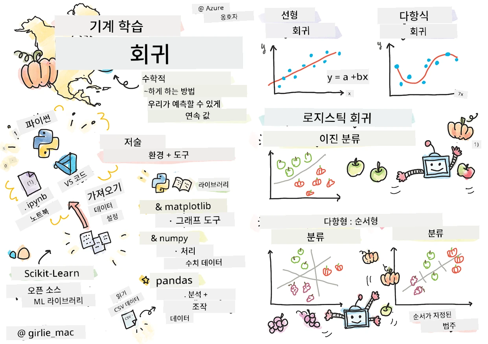
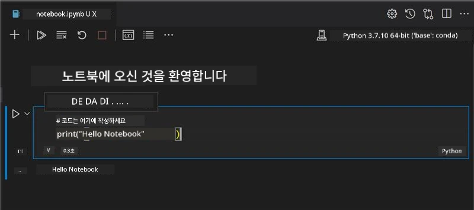
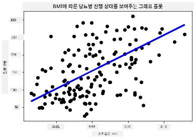

# 회귀 모델을 위한 Python과 Scikit-learn 시작하기



> 스케치노트 작성자 [Tomomi Imura](https://www.twitter.com/girlie_mac)

## [수업 전 퀴즈](https://ff-quizzes.netlify.app/en/ml/)

> ### [이 수업은 R로도 제공됩니다!](../../../../2-Regression/1-Tools/solution/R/lesson_1.html)

## 소개

이 네 개의 수업에서 회귀 모델을 어떻게 구축하는지 배우게 될 것입니다. 이것들이 무엇을 위한 것인지 곧 설명하겠습니다. 하지만 무엇을 하기에 앞서, 프로세스를 시작하기 위한 올바른 도구들이 갖추어져 있는지 확인하십시오!

이 수업에서는 다음을 배우게 됩니다:

- 컴퓨터를 로컬 머신러닝 작업을 위해 구성하는 방법.
- Jupyter 노트북 작업하기.
- 설치를 포함한 Scikit-learn 사용법.
- 실습을 통한 선형 회귀 탐색.

## 설치 및 구성

[](https://youtu.be/-DfeD2k2Kj0 "초보자를 위한 ML - 머신러닝 모델 구축 준비를 위한 도구 설정")

> 🎥 위 이미지를 클릭하면 컴퓨터를 ML용으로 구성하는 과정을 담은 짧은 영상이 나옵니다.

1. **Python 설치**. 컴퓨터에 [Python](https://www.python.org/downloads/)이 설치되어 있는지 확인하세요. 데이터 과학과 머신러닝 작업에 많이 사용됩니다. 대부분의 컴퓨터 시스템에는 이미 Python이 설치되어 있습니다. 일부 사용자들을 위해 설치를 쉽게 해주는 유용한 [Python 코딩 팩](https://code.visualstudio.com/learn/educators/installers?WT.mc_id=academic-77952-leestott)도 있습니다.

   하지만 Python 사용 용도에 따라 소프트웨어 버전이 다르게 요구될 수 있으므로, [가상 환경](https://docs.python.org/3/library/venv.html)에서 작업하는 것이 유용합니다.

2. **Visual Studio Code 설치**. 컴퓨터에 Visual Studio Code가 설치되어 있는지 확인하세요. 기본 설치를 위한 [Visual Studio Code 설치법](https://code.visualstudio.com/)을 따르세요. 이번 과정에서는 Visual Studio Code에서 Python을 사용할 것이므로, [Visual Studio Code에서 Python 개발 설정법](https://docs.microsoft.com/learn/modules/python-install-vscode?WT.mc_id=academic-77952-leestott)을 익히는 것도 좋습니다.

   > 이 [학습 모듈 모음](https://docs.microsoft.com/users/jenlooper-2911/collections/mp1pagggd5qrq7?WT.mc_id=academic-77952-leestott)을 통해 Python에 익숙해지세요.
   >
   > [](https://youtu.be/yyQM70vi7V8 "VS Code에서 Python 설정하기")
   >
   > 🎥 위 이미지를 클릭하면 VS Code 내에서 Python을 사용하는 영상이 나옵니다.

3. <strong>Scikit-learn 설치</strong>는 [이 안내](https://scikit-learn.org/stable/install.html)를 따르세요. Python 3를 사용해야 하므로 가상 환경 사용을 권장합니다. Mac M1에서 설치할 경우 위 링크 페이지에 특수 지침이 있습니다.

1. **Jupyter Notebook 설치**. [Jupyter 패키지](https://pypi.org/project/jupyter/)를 설치해야 합니다.

## 머신러닝 개발 환경

Python 코드 작성과 머신러닝 모델 생성에 <strong>노트북</strong>을 사용할 것입니다. 이 파일 유형은 데이터 과학자들이 흔히 쓰는 도구로 `.ipynb` 확장자를 가집니다.

노트북은 개발자가 코딩과 노트, 문서 작성을 같이 할 수 있는 대화형 환경으로, 실험적이거나 연구 중심 프로젝트에 매우 유용합니다.

[](https://youtu.be/7E-jC8FLA2E "초보자를 위한 ML - Jupyter 노트북 설정하여 회귀 모델 시작")

> 🎥 위 이미지를 클릭하면 이 실습 과정을 담은 짧은 영상이 나옵니다.

### 실습 - 노트북 작업

이 폴더에 _notebook.ipynb_ 파일이 있습니다.

1. Visual Studio Code에서 _notebook.ipynb_를 엽니다.

   Python 3+와 함께 Jupyter 서버가 시작됩니다. 노트북 내에서 `실행(run)` 가능한 코드 조각들을 볼 수 있습니다. 재생 버튼 모양 아이콘을 클릭해 코드 블록을 실행할 수 있습니다.

1. `md` 아이콘을 선택하고 마크다운 문법으로 다음 텍스트를 입력하세요: **# Welcome to your notebook**.

   이어서 Python 코드를 몇 줄 추가합니다.

1. 코드 블록에 **print('hello notebook')** 을 입력합니다.
1. 실행 화살표를 선택하여 코드를 실행하세요.

   출력문이 나타나는 것을 볼 수 있을 것입니다:

    ```output
    hello notebook
    ```



코드 사이에 주석을 넣어 노트북을 자가 문서화할 수 있습니다.

✅ 웹 개발자 작업 환경과 데이터 과학자의 작업 환경이 얼마나 다른지 잠시 생각해 보세요.

## Scikit-learn 시작하기

로컬 환경에 Python을 설치하고 Jupyter 노트북을 익혔다면, 이제 Scikit-learn도 편안하게 사용해 봅시다 (`sci`는 `science`의 발음과 같습니다). Scikit-learn은 머신러닝 작업에 도움이 되는 [광범위한 API](https://scikit-learn.org/stable/modules/classes.html#api-ref)를 제공합니다.

공식 [웹사이트](https://scikit-learn.org/stable/getting_started.html)에 따르면 "Scikit-learn은 감독 및 비감독 학습을 지원하는 오픈 소스 머신러닝 라이브러리입니다. 모델 적합, 데이터 전처리, 모델 선택 및 평가, 기타 다양한 유틸리티를 제공합니다."

이 과정에서 Scikit-learn과 기타 도구를 사용해 전통적인 머신러닝 작업을 수행하는 모델을 구축할 것입니다. 신경망과 딥러닝은 의도적으로 제외했으며, 향후 'AI for Beginners' 커리큘럼에서 자세히 다룰 예정입니다.

Scikit-learn은 모델을 쉽게 구축하고 평가할 수 있게 해 줍니다. 주로 수치 데이터를 사용하는 데 중점을 두며, 학습 도구로 사용할 몇 가지 준비된 데이터셋도 포함되어 있습니다. 학생들이 시도해볼 수 있는 사전 제작 모델도 있습니다. 먼저, 기본 데이터를 사용해 미리 포장된 데이터 로딩과 내장 추정기를 사용하는 기본 ML 모델 과정을 살펴봅시다.

## 실습 - 첫 번째 Scikit-learn 노트북

> 이 튜토리얼은 Scikit-learn 웹사이트의 [선형 회귀 예제](https://scikit-learn.org/stable/auto_examples/linear_model/plot_ols.html#sphx-glr-auto-examples-linear-model-plot-ols-py)에서 영감을 받았습니다.


[](https://youtu.be/2xkXL5EUpS0 "초보자를 위한 ML - Python에서 첫 선형 회귀 프로젝트")

> 🎥 위 이미지를 클릭하면 이 실습에 관한 짧은 영상이 나옵니다.

_notebook.ipynb_ 파일에서, 모든 셀을 '휴지통' 아이콘을 눌러 삭제하세요.

여기서는 학습 목적용으로 Scikit-learn에 내장된 당뇨병에 관한 작은 데이터셋을 사용합니다. 당뇨 환자 치료법을 평가해 보고자 한다고 가정해 보세요. 머신러닝 모델은 변수 조합에 근거해 어떤 환자가 치료에 더 잘 반응할지 예측하는 데 도움을 줄 수 있습니다. 시각화된 기본 회귀 모델조차, 이론적 임상시험 구성에 도움이 될 변수 정보를 보여줄 수 있습니다.

✅ 회귀 방법에는 여러 유형이 있으며 선택하는 방법은 찾고자 하는 답변에 달려 있습니다. 특정 연령대 사람의 예상 키를 예측하고 싶다면 선형 회귀를 사용합니다. 이는 **수치 값을** 찾기 때문입니다. 어떤 요리가 비건으로 분류되어야 하는지 알고 싶다면, **범주 할당** 문제이므로 로지스틱 회귀를 사용합니다. 로지스틱 회귀는 나중에 더 배울 것입니다. 데이터에 대해 질문할 수 있는 것들과 어떤 방법이 적절할지 잠시 생각해 보세요.

이제 이 작업을 시작해 봅시다.

### 라이브러리 가져오기

이 작업을 위해 일부 라이브러리를 불러오겠습니다:

- **matplotlib**. 유용한 [그래프 도구](https://matplotlib.org/)이며 선 그래프를 만드는 데 사용할 것입니다.
- **numpy**. [numpy](https://numpy.org/doc/stable/user/whatisnumpy.html)는 파이썬에서 수치 데이터를 다루는 데 유용한 라이브러리입니다.
- **sklearn**. 이것은 [Scikit-learn](https://scikit-learn.org/stable/user_guide.html) 라이브러리입니다.

작업을 돕기 위해 라이브러리를 임포트하세요.

1. 다음 코드를 입력하여 임포트합니다:

   ```python
   import matplotlib.pyplot as plt
   import numpy as np
   from sklearn import datasets, linear_model, model_selection
   ```

   위 코드는 `matplotlib`, `numpy`를 임포트하며, `sklearn`에서 `datasets`, `linear_model`, `model_selection`을 가져옵니다. `model_selection`은 데이터를 훈련 세트와 테스트 세트로 분할하는 데 사용됩니다.

### 당뇨병 데이터셋

내장된 [당뇨병 데이터셋](https://scikit-learn.org/stable/datasets/toy_dataset.html#diabetes-dataset)은 당뇨병 관련 442개의 샘플과 10개의 특성 변수를 포함합니다. 일부 변수는 다음과 같습니다:

- age: 나이(년 단위)
- bmi: 체질량 지수
- bp: 평균 혈압
- s1 tc: T-세포(백혈구의 일종)

✅ 이 데이터셋은 연구에 중요한 '성별'을 특성 변수로 포함합니다. 많은 의학 데이터셋에 이런 이진 분류가 포함되어 있습니다. 이런 분류 기준이 인구 일부를 치료 대상에서 제외할 수 있다는 점을 생각해보세요.

이제 X와 y 데이터를 불러옵니다.

> 🎓 이 것은 감독 학습이므로 'y' 타겟이 필요하다는 점을 기억하세요.

새로운 코드 셀에서 `load_diabetes()`를 호출해 당뇨병 데이터셋을 불러오세요. 입력값 `return_X_y=True`는 `X`가 데이터 매트릭스, `y`가 회귀 타겟임을 나타냅니다.

1. 데이터 매트릭스의 형태와 첫 번째 요소를 출력하는 코드를 추가합니다:

    ```python
    X, y = datasets.load_diabetes(return_X_y=True)
    print(X.shape)
    print(X[0])
    ```

    반환되는 값은 튜플입니다. 이 튜플의 처음 두 값을 각각 `X`와 `y`로 할당하는 것입니다. [튜플에 대해 더 알아보기](https://wikipedia.org/wiki/Tuple).

    이 데이터가 442 개의 항목으로 구성되며 각 항목은 10요소 배열임을 알 수 있습니다:

    ```text
    (442, 10)
    [ 0.03807591  0.05068012  0.06169621  0.02187235 -0.0442235  -0.03482076
    -0.04340085 -0.00259226  0.01990842 -0.01764613]
    ```

    ✅ 데이터와 회귀 타겟 간의 관계를 잠시 생각해보세요. 선형 회귀는 특성 X와 타겟 변수 y 간 관계를 예측합니다. 문서에서 당뇨병 데이터셋의 [타겟](https://scikit-learn.org/stable/datasets/toy_dataset.html#diabetes-dataset)을 찾을 수 있나요? 이 타겟을 고려할 때 이 데이터셋이 무엇을 보여주는지 생각해 보세요.

2. 다음으로, 데이터셋의 일부를 선택해 플로팅합니다. 데이터셋의 3번째 열을 선택하세요. `:` 연산자로 모든 행을 선택하고 인덱스 2로 3번째 열을 선택할 수 있습니다. 플로팅에 필요한 2D 배열로 변경하려면 `reshape(n_rows, n_columns)`를 사용하세요. 매개변수 중 하나가 -1이면 해당 차원이 자동 계산됩니다.

   ```python
   X = X[:, 2]
   X = X.reshape((-1,1))
   ```

   ✅ 데이터 모양을 확인하기 위해 언제든 출력해 보세요.

3. 이제 플로팅할 데이터가 준비되었으니, 머신이 이 데이터 숫자 사이에 논리적 구분을 짓도록 해봅니다. 이를 위해서는 데이터(X)와 타겟(y)을 테스트 세트와 학습 세트로 분할해야 합니다. Scikit-learn에는 이를 쉽게 하는 방법이 있습니다. 원하는 지점에서 테스트 데이터를 분할할 수 있습니다.

   ```python
   X_train, X_test, y_train, y_test = model_selection.train_test_split(X, y, test_size=0.33)
   ```

4. 이제 모델 학습 준비가 되었습니다! 선형 회귀 모델을 불러와 `model.fit()`으로 X와 y 학습 세트로 학습시킵니다:

    ```python
    model = linear_model.LinearRegression()
    model.fit(X_train, y_train)
    ```

    ✅ `model.fit()` 함수는 TensorFlow 등 많은 ML 라이브러리에서 공통으로 사용됩니다.

5. 그런 다음, `predict()` 함수를 이용해 테스트 데이터를 기반으로 예측을 만듭니다. 이를 통해 데이터 그룹 사이에 선을 그릴 수 있습니다.

    ```python
    y_pred = model.predict(X_test)
    ```

6. 이제 데이터를 그래프로 나타냅니다. Matplotlib은 이를 위해 매우 유용합니다. 모든 X와 y 테스트 데이터를 산점도로 나타내고, 모델의 데이터 그룹 간 가장 적절한 위치에 예측된 선을 그리세요.

    ```python
    plt.scatter(X_test, y_test,  color='black')
    plt.plot(X_test, y_pred, color='blue', linewidth=3)
    plt.xlabel('Scaled BMIs')
    plt.ylabel('Disease Progression')
    plt.title('A Graph Plot Showing Diabetes Progression Against BMI')
    plt.show()
    ```

   


   ✅ 여기서 무슨 일이 일어나고 있는지 조금 생각해 보세요. 여러 개의 작은 데이터 점을 통과하는 직선이 있는데, 정확히 무엇을 하고 있는 걸까요? 이 직선을 사용하여 새로운, 본 적 없는 데이터 포인트가 플롯의 y축과 어떤 관계를 맺어야 하는지 예측할 수 있어야 한다는 점을 볼 수 있나요? 이 모델의 실질적인 용도를 말로 표현해 보세요.

축하합니다, 첫 번째 선형 회귀 모델을 만들고, 이를 사용해 예측을 수행했으며, 플롯에 표시했습니다!

---
## 🚀도전 과제

이 데이터셋에서 다른 변수를 플로팅해 보세요. 힌트: 이 줄을 수정하세요: `X = X[:,2]`. 이 데이터셋의 목표 값을 고려할 때, 당뇨병이라는 질병의 진행에 대해 무엇을 발견할 수 있나요?
## [강의 후 퀴즈](https://ff-quizzes.netlify.app/en/ml/)

## 복습 & 자기 주도 학습

이 튜토리얼에서는 단순 선형 회귀를 다뤘으며, 단변량 또는 다중 선형 회귀와는 다릅니다. 이 방법들 간의 차이점에 대해 조금 읽어 보거나, [이 영상](https://www.coursera.org/lecture/quantifying-relationships-regression-models/linear-vs-nonlinear-categorical-variables-ai2Ef)을 참조하세요.

회귀 개념에 대해 더 읽고, 이 기법으로 어떤 질문들에 답할 수 있는지 생각해 보세요. 이해를 깊게 하려면 이 [튜토리얼](https://docs.microsoft.com/learn/modules/train-evaluate-regression-models?WT.mc_id=academic-77952-leestott)을 통해 학습해 보세요.

## 과제

[다른 데이터셋](assignment.md)

---

<!-- CO-OP TRANSLATOR DISCLAIMER START -->
**면책 조항**:
이 문서는 AI 번역 서비스 [Co-op Translator](https://github.com/Azure/co-op-translator)를 사용하여 번역되었습니다. 정확성을 기하기 위해 노력하고 있으나, 자동 번역은 오류나 부정확한 부분이 있을 수 있음을 유의하시기 바랍니다. 원본 문서의 원어본이 권위 있는 자료로 간주되어야 합니다. 중요한 정보의 경우, 전문가의 인간 번역을 권장합니다. 이 번역 사용으로 인해 발생하는 오해나 잘못된 해석에 대해 당사는 책임을 지지 않습니다.
<!-- CO-OP TRANSLATOR DISCLAIMER END -->