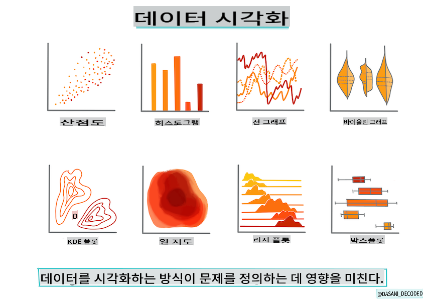
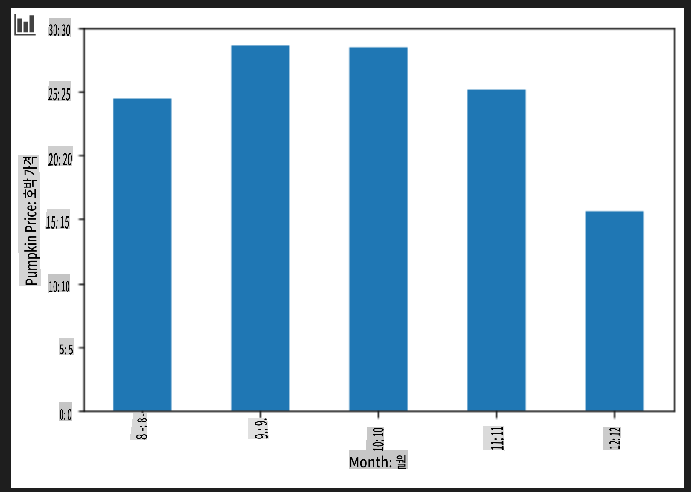

# Scikit-learn을 사용하여 회귀 모델 구축: 데이터 준비 및 시각화



인포그래픽 제작: [Dasani Madipalli](https://twitter.com/dasani_decoded)

## [사전 강의 퀴즈](https://gray-sand-07a10f403.1.azurestaticapps.net/quiz/11/)

> ### [이 강의는 R로도 제공됩니다!](../../../../2-Regression/2-Data/solution/R/lesson_2.html)

## 소개

이제 Scikit-learn을 사용하여 머신러닝 모델을 구축하기 위한 도구를 설정했으므로 데이터를 통해 질문을 시작할 준비가 되었습니다. 데이터를 다루고 ML 솔루션을 적용할 때, 데이터셋의 잠재력을 올바르게 해제하기 위해 올바른 질문을 하는 방법을 이해하는 것이 매우 중요합니다.

이 강의에서 배우게 될 내용:

- 모델 구축을 위해 데이터를 준비하는 방법.
- Matplotlib을 사용하여 데이터를 시각화하는 방법.

## 데이터에 올바른 질문하기

답을 얻고자 하는 질문은 어떤 유형의 ML 알고리즘을 사용할지를 결정합니다. 그리고 얻은 답변의 품질은 데이터의 특성에 크게 의존합니다.

이 강의에서 제공된 [데이터](https://github.com/microsoft/ML-For-Beginners/blob/main/2-Regression/data/US-pumpkins.csv)를 살펴보세요. 이 .csv 파일을 VS Code에서 열 수 있습니다. 빠르게 훑어보면 공백과 문자열 및 숫자 데이터의 혼합이 있음을 바로 알 수 있습니다. 또한 'Package'라는 이상한 열이 있는데, 여기에는 'sacks', 'bins' 등의 값이 혼합되어 있습니다. 사실, 이 데이터는 약간 엉망입니다.

[](https://youtu.be/5qGjczWTrDQ "ML for beginners - How to Analyze and Clean a Dataset")

> 🎥 위 이미지를 클릭하면 이 강의를 위해 데이터를 준비하는 과정을 보여주는 짧은 비디오를 볼 수 있습니다.

사실, 완전히 준비된 데이터셋을 즉시 사용할 수 있도록 제공받는 경우는 매우 드뭅니다. 이 강의에서는 표준 Python 라이브러리를 사용하여 원시 데이터셋을 준비하는 방법을 배울 것입니다. 또한 데이터를 시각화하는 다양한 기술을 배울 것입니다.

## 사례 연구: '호박 시장'

이 폴더의 루트 `data` 폴더에는 [US-pumpkins.csv](https://github.com/microsoft/ML-For-Beginners/blob/main/2-Regression/data/US-pumpkins.csv)라는 .csv 파일이 있습니다. 이 파일에는 도시별로 그룹화된 호박 시장에 대한 1757개의 데이터가 포함되어 있습니다. 이 데이터는 미국 농무부에서 배포한 [Specialty Crops Terminal Markets Standard Reports](https://www.marketnews.usda.gov/mnp/fv-report-config-step1?type=termPrice)에서 추출한 원시 데이터입니다.

### 데이터 준비

이 데이터는 공공 도메인에 있습니다. USDA 웹사이트에서 도시별로 여러 개의 파일로 다운로드할 수 있습니다. 너무 많은 파일을 피하기 위해, 모든 도시 데이터를 하나의 스프레드시트로 결합했습니다. 따라서 데이터를 약간 _준비_ 했습니다. 이제 데이터를 좀 더 자세히 살펴보겠습니다.

### 호박 데이터 - 초기 결론

이 데이터에 대해 무엇을 알 수 있나요? 이미 문자열, 숫자, 공백 및 이상한 값이 혼합되어 있음을 보았습니다.

회귀 기법을 사용하여 이 데이터에 어떤 질문을 할 수 있을까요? 예를 들어 "주어진 달에 판매되는 호박의 가격을 예측하세요"라는 질문을 생각해볼 수 있습니다. 데이터를 다시 살펴보면, 이 작업에 필요한 데이터 구조를 만들기 위해 몇 가지 변경이 필요합니다.

## 연습 - 호박 데이터 분석

[판다스(Pandas)](https://pandas.pydata.org/)를 사용하여 이 호박 데이터를 분석하고 준비해 봅시다. Pandas는 데이터를 다루기에 매우 유용한 도구입니다.

### 먼저, 누락된 날짜 확인

먼저 누락된 날짜를 확인해야 합니다:

1. 날짜를 월 형식으로 변환합니다(이 날짜는 미국 날짜 형식이므로 `MM/DD/YYYY` 형식입니다).
2. 월을 새 열에 추출합니다.

Visual Studio Code에서 _notebook.ipynb_ 파일을 열고 스프레드시트를 새로운 Pandas 데이터프레임에 가져옵니다.

1. `head()` 함수를 사용하여 처음 다섯 개의 행을 봅니다.

    ```python
    import pandas as pd
    pumpkins = pd.read_csv('../data/US-pumpkins.csv')
    pumpkins.head()
    ```

    ✅ 마지막 다섯 개의 행을 보려면 어떤 함수를 사용하시겠습니까?

1. 현재 데이터프레임에 누락된 데이터가 있는지 확인합니다:

    ```python
    pumpkins.isnull().sum()
    ```

    누락된 데이터가 있지만, 현재 작업에는 중요하지 않을 수 있습니다.

1. 데이터프레임을 더 쉽게 다루기 위해 필요한 열만 선택합니다. 아래의 경우 `loc` function which extracts from the original dataframe a group of rows (passed as first parameter) and columns (passed as second parameter). The expression `:`는 "모든 행"을 의미합니다.

    ```python
    columns_to_select = ['Package', 'Low Price', 'High Price', 'Date']
    pumpkins = pumpkins.loc[:, columns_to_select]
    ```

### 두 번째, 호박의 평균 가격 결정

주어진 달에 호박의 평균 가격을 결정하는 방법을 생각해 보세요. 이 작업을 위해 어떤 열을 선택하시겠습니까? 힌트: 세 개의 열이 필요합니다.

해결책: `Low Price` and `High Price` 열의 평균을 구하여 새 Price 열을 채우고, Date 열을 월만 표시하도록 변환합니다. 다행히도 위의 확인에 따르면 날짜나 가격에 누락된 데이터는 없습니다.

1. 평균을 계산하려면 다음 코드를 추가합니다:

    ```python
    price = (pumpkins['Low Price'] + pumpkins['High Price']) / 2

    month = pd.DatetimeIndex(pumpkins['Date']).month

    ```

   ✅ `print(month)`을 사용하여 원하는 데이터를 출력해 볼 수 있습니다.

2. 변환된 데이터를 새로운 Pandas 데이터프레임에 복사합니다:

    ```python
    new_pumpkins = pd.DataFrame({'Month': month, 'Package': pumpkins['Package'], 'Low Price': pumpkins['Low Price'],'High Price': pumpkins['High Price'], 'Price': price})
    ```

    데이터프레임을 출력하면 새로운 회귀 모델을 구축할 수 있는 깔끔하고 정돈된 데이터셋을 볼 수 있습니다.

### 잠깐! 이상한 점이 있습니다

`Package` column, pumpkins are sold in many different configurations. Some are sold in '1 1/9 bushel' measures, and some in '1/2 bushel' measures, some per pumpkin, some per pound, and some in big boxes with varying widths.

> Pumpkins seem very hard to weigh consistently

Digging into the original data, it's interesting that anything with `Unit of Sale` equalling 'EACH' or 'PER BIN' also have the `Package` type per inch, per bin, or 'each'. Pumpkins seem to be very hard to weigh consistently, so let's filter them by selecting only pumpkins with the string 'bushel' in their `Package` 열을 살펴보면 이상한 점이 있습니다.

1. 초기 .csv 가져오기 아래에 필터를 추가합니다:

    ```python
    pumpkins = pumpkins[pumpkins['Package'].str.contains('bushel', case=True, regex=True)]
    ```

    이제 데이터를 출력하면, 버셸 단위로 판매되는 호박의 약 415개의 행만 얻을 수 있습니다.

### 잠깐! 할 일이 하나 더 있습니다

버셸 양이 행마다 다르다는 것을 눈치채셨나요? 가격을 표준화하여 버셸 단위로 가격을 표시해야 합니다. 따라서 이를 표준화하기 위해 약간의 수학을 사용해야 합니다.

1. new_pumpkins 데이터프레임을 생성한 블록 뒤에 다음 줄을 추가합니다:

    ```python
    new_pumpkins.loc[new_pumpkins['Package'].str.contains('1 1/9'), 'Price'] = price/(1 + 1/9)

    new_pumpkins.loc[new_pumpkins['Package'].str.contains('1/2'), 'Price'] = price/(1/2)
    ```

✅ [The Spruce Eats](https://www.thespruceeats.com/how-much-is-a-bushel-1389308)에 따르면, 버셸의 무게는 생산물의 종류에 따라 다릅니다. 이는 부피 측정 단위입니다. "예를 들어, 토마토 한 버셸은 56파운드로 측정됩니다... 잎과 채소는 더 적은 무게로 더 많은 공간을 차지하므로, 시금치 한 버셸은 20파운드에 불과합니다." 이는 매우 복잡합니다! 버셸에서 파운드로의 변환을 신경 쓰지 말고, 대신 버셸 단위로 가격을 표시합시다. 그러나 호박의 버셸을 연구하면서 데이터의 특성을 이해하는 것이 얼마나 중요한지 알 수 있습니다!

이제 버셸 측정 단위를 기준으로 단위당 가격을 분석할 수 있습니다. 데이터를 한 번 더 출력하면 표준화된 것을 볼 수 있습니다.

✅ 반 버셸로 판매되는 호박이 매우 비싸다는 것을 눈치채셨나요? 그 이유를 알 수 있나요? 힌트: 작은 호박은 큰 호박보다 훨씬 비쌉니다. 이는 버셸당 많은 공간을 차지하지 않는 큰 파이 호박보다 작은 호박이 훨씬 더 많이 있기 때문입니다.

## 시각화 전략

데이터 과학자의 역할 중 하나는 자신이 작업하는 데이터의 품질과 특성을 보여주는 것입니다. 이를 위해 종종 흥미로운 시각화, 즉 플롯, 그래프, 차트를 생성하여 데이터의 다양한 측면을 보여줍니다. 이렇게 함으로써 시각적으로 관계와 격차를 쉽게 파악할 수 있습니다.

[](https://youtu.be/SbUkxH6IJo0 "ML for beginners - How to Visualize Data with Matplotlib")

> 🎥 위 이미지를 클릭하면 이 강의를 위해 데이터를 시각화하는 과정을 보여주는 짧은 비디오를 볼 수 있습니다.

시각화는 또한 데이터에 가장 적합한 머신러닝 기법을 결정하는 데 도움이 될 수 있습니다. 예를 들어, 선을 따르는 것처럼 보이는 산점도는 데이터가 선형 회귀 연습에 적합하다는 것을 나타냅니다.

Jupyter 노트북에서 잘 작동하는 데이터 시각화 라이브러리 중 하나는 [Matplotlib](https://matplotlib.org/)입니다 (이전 강의에서도 보았습니다).

> 데이터 시각화에 대한 더 많은 경험을 쌓으려면 [이 튜토리얼](https://docs.microsoft.com/learn/modules/explore-analyze-data-with-python?WT.mc_id=academic-77952-leestott)을 참조하세요.

## 연습 - Matplotlib 실험

방금 만든 새로운 데이터프레임을 표시하기 위해 몇 가지 기본 플롯을 만들어 보세요. 기본 선 그래프는 무엇을 보여줄까요?

1. 파일 상단의 Pandas 가져오기 아래에 Matplotlib을 가져옵니다:

    ```python
    import matplotlib.pyplot as plt
    ```

1. 전체 노트북을 다시 실행하여 새로 고칩니다.
1. 노트북 하단에 데이터를 박스로 플롯하는 셀을 추가합니다:

    ```python
    price = new_pumpkins.Price
    month = new_pumpkins.Month
    plt.scatter(price, month)
    plt.show()
    ```

    

    이 플롯이 유용한가요? 무엇이 놀랍나요?

    이 플롯은 주어진 달의 데이터 분포를 점으로 표시할 뿐이므로 특별히 유용하지 않습니다.

### 유용하게 만들기

유용한 데이터를 표시하려면 데이터를 그룹화해야 합니다. y축에 달을 표시하고 데이터 분포를 보여주는 플롯을 만들어 봅시다.

1. 그룹화된 막대 차트를 생성하는 셀을 추가합니다:

    ```python
    new_pumpkins.groupby(['Month'])['Price'].mean().plot(kind='bar')
    plt.ylabel("Pumpkin Price")
    ```

    

    이 데이터 시각화는 더 유용합니다! 9월과 10월에 호박의 가격이 가장 높다는 것을 나타내는 것 같습니다. 이는 예상과 일치하나요? 그 이유는 무엇인가요?

---

## 🚀도전 과제

Matplotlib이 제공하는 다양한 시각화 유형을 탐색해 보세요. 회귀 문제에 가장 적합한 유형은 무엇인가요?

## [강의 후 퀴즈](https://gray-sand-07a10f403.1.azurestaticapps.net/quiz/12/)

## 복습 및 자습

데이터를 시각화하는 다양한 방법을 살펴보세요. 사용할 수 있는 다양한 라이브러리를 목록화하고, 주어진 작업 유형에 가장 적합한 라이브러리를 기록하세요. 예를 들어 2D 시각화와 3D 시각화의 차이점을 조사해 보세요. 무엇을 발견하셨나요?

## 과제

[시각화 탐구](assignment.md)

**면책 조항**:
이 문서는 기계 기반 AI 번역 서비스를 사용하여 번역되었습니다. 정확성을 위해 노력하지만 자동 번역에는 오류나 부정확성이 있을 수 있습니다. 원본 문서의 원어가 권위 있는 출처로 간주되어야 합니다. 중요한 정보에 대해서는 전문적인 인간 번역을 권장합니다. 이 번역 사용으로 인해 발생하는 오해나 오역에 대해서는 책임지지 않습니다.