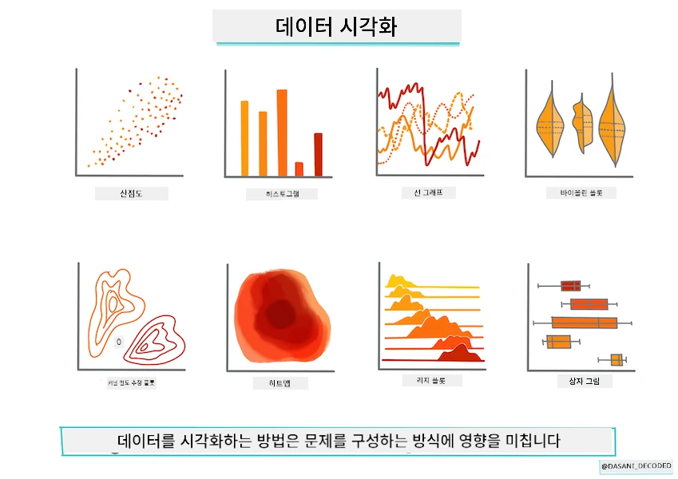
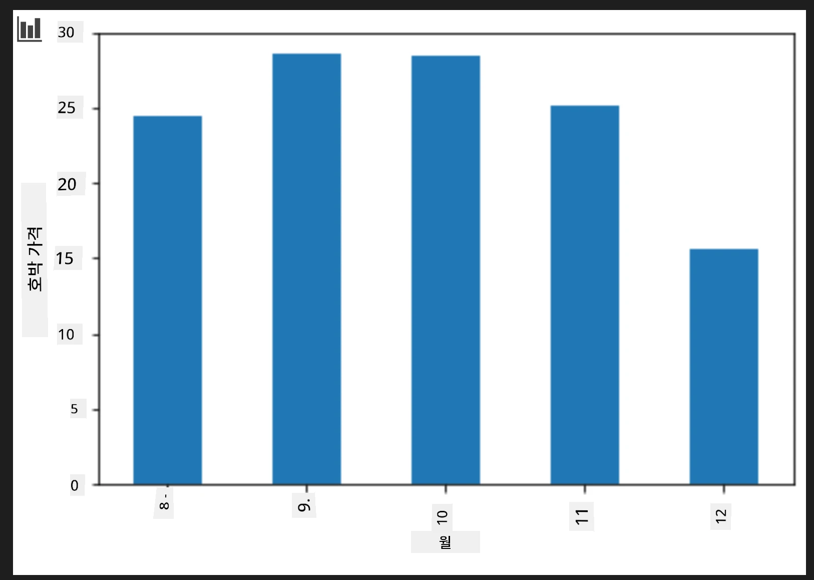
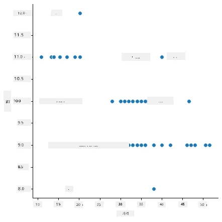
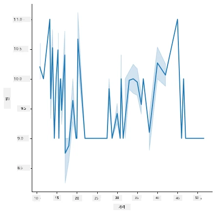
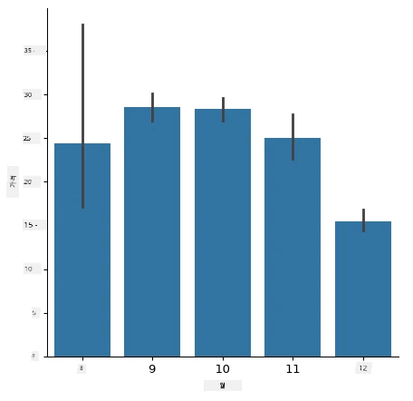
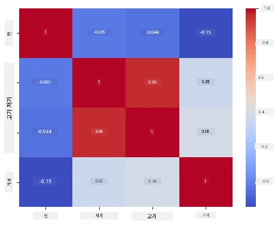

# Scikit-learn을 사용한 회귀 모델 구축: 데이터 준비 및 시각화



인포그래픽 제작자 [Dasani Madipalli](https://twitter.com/dasani_decoded)

## [강의 전 퀴즈](https://ff-quizzes.netlify.app/en/ml/)

> ### [이 강의는 R 버전도 있습니다!](../../../../2-Regression/2-Data/solution/R/lesson_2.html)

## 소개

이제 Scikit-learn을 사용해 머신러닝 모델 구축을 시작할 준비가 되었으니 데이터에 질문을 던질 준비가 되었습니다. 데이터를 다루고 ML 솔루션을 적용할 때, 데이터셋의 잠재력을 제대로 활용하려면 올바른 질문을 하는 방법을 이해하는 것이 매우 중요합니다.

이 강의에서 여러분은 다음을 배우게 됩니다:

- 모델 구축을 위한 데이터 준비 방법
- Matplotlib을 사용한 데이터 시각화 방법
- 더 표현력 있는 데이터 시각화를 위한 Seaborn 활용법

## 데이터에 올바른 질문하기

어떤 질문을 하느냐에 따라 사용할 ML 알고리즘 종류가 결정됩니다. 그리고 돌아오는 답변의 품질은 데이터의 특성에 크게 좌우됩니다.

이 강의에 제공된 [데이터](https://github.com/microsoft/ML-For-Beginners/blob/main/2-Regression/data/US-pumpkins.csv)를 살펴보세요. VS Code에서 이 .csv 파일을 열 수 있습니다. 빠르게 살펴봐도 빈칸과 문자열과 숫자 데이터가 혼합되어 있음을 알 수 있습니다. 'Package'라는 이상한 컬럼도 있는데, 여기 데이터는 'sacks', 'bins' 등 다양한 값이 혼합되어 있습니다. 실제로 데이터가 꽤 엉망입니다.

[](https://youtu.be/5qGjczWTrDQ "초보자를 위한 ML - 데이터셋 분석 및 정리 방법")

> 🎥 위 이미지 클릭 시 이 강의 데이터 준비 과정을 다룬 짧은 영상이 재생됩니다.

실제로 즉시 사용할 수 있는 완벽한 데이터셋을 제공받는 경우는 드뭅니다. 이 강의에서는 표준 Python 라이브러리를 사용해 원시 데이터셋을 준비하는 방법과 데이터를 시각화하는 다양한 기법을 배웁니다.

## 사례 연구: '호박 시장'

이 폴더에는 루트 `data` 폴더 내 [US-pumpkins.csv](https://github.com/microsoft/ML-For-Beginners/blob/main/2-Regression/data/US-pumpkins.csv)라는 1757행의 호박 시장 도시별 그룹화 데이터 CSV 파일이 있습니다. 이 데이터는 미국 농무부가 배포하는 [Specialty Crops Terminal Markets Standard Reports](https://www.marketnews.usda.gov/mnp/fv-report-config-step1?type=termPrice)에서 추출한 원시 데이터입니다.

### 데이터 준비

이 데이터는 퍼블릭 도메인 데이터입니다. USDA 웹사이트에서 도시별로 여러 개의 개별 파일로 다운로드 가능합니다. 파일 수가 너무 많지 않도록 모든 도시 데이터를 하나로 합쳐 _일부_ 데이터 준비를 이미 진행했습니다. 다음으로 데이터를 좀 더 자세히 살펴보겠습니다.

### 호박 데이터 - 초기 결론

데이터에서 무엇을 알아차렸나요? 문자열, 숫자, 빈칸 및 이상한 값들이 혼재되어 있음을 이미 보았습니다. 이를 이해해야 합니다.

회귀 분석 기법을 사용해 이 데이터에 어떤 질문을 던질 수 있을까요? 예를 들면 "특정 월에 판매되는 호박의 가격 예측하기" 같은 질문입니다. 데이터를 다시보면, 이 작업에 필요한 데이터 구조를 만들기 위해 수정해야 할 점들이 있습니다.
## 연습 문제 - 호박 데이터 분석하기

데이터를 다루기 위해 매우 유용한 도구인 [Pandas](https://pandas.pydata.org/) (`Python Data Analysis`의 약자)를 사용해 이 호박 데이터를 분석하고 준비해 봅시다.

### 먼저, 누락된 날짜 확인

누락된 날짜가 있는지 확인하는 단계부터 시작하세요:

1. 날짜를 월 포맷으로 변환 (미국식 날짜 `MM/DD/YYYY` 형식).
2. 월 정보를 새 열로 추출.

Visual Studio Code에서 _notebook.ipynb_ 파일을 열고 스프레드시트를 새 Pandas 데이터프레임으로 임포트 하세요.

1. `head()` 함수를 사용해 처음 다섯 행을 봅니다.

    ```python
    import pandas as pd
    pumpkins = pd.read_csv('../data/US-pumpkins.csv')
    pumpkins.head()
    ```

    ✅ 마지막 다섯 행을 보려면 어떤 함수를 사용하나요?

1. 현재 데이터프레임에 누락된 데이터가 있는지 확인:

    ```python
    pumpkins.isnull().sum()
    ```

    누락된 데이터가 있지만, 당면한 작업에 크게 지장 없을 수도 있습니다.

1. 작업하기 쉬운 데이터프레임을 만들기 위해 필요한 열만 선택하세요. `loc` 함수를 사용하면 원본 데이터프레임에서 행(첫 번째 매개변수)과 열(두 번째 매개변수)를 선택할 수 있습니다. 아래 `:` 는 "모든 행"을 의미합니다.

    ```python
    columns_to_select = ['Package', 'Low Price', 'High Price', 'Date']
    pumpkins = pumpkins.loc[:, columns_to_select]
    ```

### 두 번째로, 호박 평균 가격 결정

특정 월의 호박 평균 가격을 어떻게 구할지 생각해 봅시다. 어떤 열을 선택해야 할까요? 힌트: 3개의 열이 필요합니다.

해결책: `Low Price`와 `High Price` 열의 평균 값을 새 `Price` 열에 넣고, `Date` 열을 월 정보만 보여주도록 변환합니다. 다행히 위 확인에서 날짜나 가격에 누락된 데이터가 없었습니다.

1. 평균을 계산하는 코드를 추가하세요:

    ```python
    price = (pumpkins['Low Price'] + pumpkins['High Price']) / 2

    month = pd.DatetimeIndex(pumpkins['Date']).month

    ```

   ✅ 확인용으로 `print(month)` 등을 사용해 데이터를 출력해도 좋습니다.

2. 변환한 데이터를 새로운 Pandas 데이터프레임으로 복사하세요:

    ```python
    new_pumpkins = pd.DataFrame({'Month': month, 'Package': pumpkins['Package'], 'Low Price': pumpkins['Low Price'],'High Price': pumpkins['High Price'], 'Price': price})
    ```

    데이터프레임을 출력하면 깔끔하고 정돈된 새로운 데이터셋을 볼 수 있으며 이를 기반으로 회귀 모델을 구축할 수 있습니다.

### 잠깐! 이상한 점이 있습니다

`Package` 열을 보면 호박이 여러 형태로 판매됩니다. '1 1/9 bushel', '1/2 bushel' 단위로 팔리기도 하고, 개별 호박 단위, 파운드 단위, 크기가 다른 큰 상자 단위 등 다양합니다.

> 호박은 일관되게 무게를 재기 매우 어려운 것 같습니다

원본 데이터를 더 들여다보면 `Unit of Sale`이 'EACH' 또는 'PER BIN'인 항목은 `Package` 타입이 인치 단위, 빈 단위, 또는 'each'로 표시되어 있는 것을 알 수 있습니다. 호박은 정량적으로 무게 측정이 어렵기 때문에, `Package` 열에 'bushel' 문자열이 포함된 항목만 선택해 필터링해 보겠습니다.

1. 파일 상단, 초기 .csv 임포트 아래에 필터를 추가하세요:

    ```python
    pumpkins = pumpkins[pumpkins['Package'].str.contains('bushel', case=True, regex=True)]
    ```

    이제 데이터를 출력하면 약 415행 정도로 버쉘 단위 호박 데이터만 얻은 것을 볼 수 있습니다.

### 잠깐! 한 가지 작업이 더 필요합니다

버쉘 단위가 행마다 다름을 알았나요? 가격을 버쉘 단위로 표준화해야 하니, 수학적 계산을 통해 정규화하세요.

1. `new_pumpkins` 데이터프레임 생성 블록 다음에 아래 코드를 추가합니다:

    ```python
    new_pumpkins.loc[new_pumpkins['Package'].str.contains('1 1/9'), 'Price'] = price/(1 + 1/9)

    new_pumpkins.loc[new_pumpkins['Package'].str.contains('1/2'), 'Price'] = price/(1/2)
    ```

✅ [The Spruce Eats](https://www.thespruceeats.com/how-much-is-a-bushel-1389308)에 따르면 버쉘은 부피 단위이기 때문에 농산물 종류에 따라 무게가 다릅니다. "예를 들어 토마토 한 버쉘은 56파운드여야 합니다... 잎채소는 부피는 크지만 무게가 적어 시금치 한 버쉘은 20파운드에 불과합니다." 매우 복잡합니다! 버쉘-파운드 변환 대신 버쉘 단위로 가격을 책정합시다. 버쉘 단위 호박 연구는 데이터 특성을 이해하는 것이 얼마나 중요한지 보여줍니다!

이제 버쉘 단위 가격을 분석할 수 있습니다. 데이터를 한 번 더 출력해 보면 표준화된 모습을 확인할 수 있습니다.

✅ 반 버쉘 단위의 호박 가격이 매우 비싼 점 눈치 챘나요? 왜 그런지 이유를 생각해 보세요. 힌트: 작은 호박은 큰 호박보다 버쉘당 훨씬 비싸게 평가되며, 아마도 큰 빈 구멍이 있는 파이 호박으로 인해 버쉘당 개수가 훨씬 많기 때문입니다.

## 시각화 전략

데이터 과학자의 역할 중 하나는 자신이 다루는 데이터의 품질과 특성을 보여주는 것입니다. 이를 위해 다양한 시각화, 플롯, 그래프, 차트 등을 만들어 데이터의 여러 측면을 시각적으로 표현합니다. 이를 통해 데이터 간 관계나 누락된 부분을 쉽게 발견할 수 있습니다.

[](https://youtu.be/SbUkxH6IJo0 "초보자를 위한 ML - Matplotlib으로 데이터 시각화하기")

> 🎥 위 이미지를 클릭하면 이 강의 데이터 시각화 과정의 짧은 영상이 재생됩니다.

시각화는 데이터에 가장 적합한 머신러닝 기법을 결정하는 데에도 도움이 됩니다. 예를 들어 점들이 선을 따르는 산점도는 데이터가 선형 회귀 연습에 적합하다는 신호입니다.

Jupyter 노트북에서 잘 작동하는 데이터 시각화 라이브러리 중 하나가 [Matplotlib](https://matplotlib.org/)입니다 (이전 강의에서도 살펴봤습니다).

> 시각화 경험을 더 쌓으려면 [이 튜토리얼들](https://docs.microsoft.com/learn/modules/explore-analyze-data-with-python?WT.mc_id=academic-77952-leestott)을 참고하세요.

## 연습 문제 - Matplotlib 실험

방금 만든 새 데이터프레임을 보여주는 기본 플롯 몇 가지를 만들어 보세요. 기본 선형 플롯은 무엇을 보여줄까요?

1. 파일 상단, Pandas 임포트 아래에 Matplotlib을 임포트하세요:

    ```python
    import matplotlib.pyplot as plt
    ```

1. 노트북 전체를 다시 실행해 새로 고침하세요.
1. 노트북 하단에 셀을 추가해 다음과 같이 상자 그림을 그리세요:

    ```python
    price = new_pumpkins.Price
    month = new_pumpkins.Month
    plt.scatter(price, month)
    plt.show()
    ```

    

    이 플롯이 유용할까요? 무엇인가 놀랍게 느껴지나요?

    별로 유용하지 않습니다. 그저 월별 데이터가 점들로 퍼져 있는 모습만 보여줍니다.

### 유용하게 만들기

차트가 유용한 데이터를 보여주려면 데이터를 어떤 식으로든 그룹화해야 합니다. 이번에는 y축에 월을 표시하고 데이터 분포를 시각화하는 플롯을 만들어 보겠습니다.

1. 그룹화된 막대 그래프를 생성하는 셀을 추가하세요:

    ```python
    new_pumpkins.groupby(['Month'])['Price'].mean().plot(kind='bar')
    plt.ylabel("Pumpkin Price")
    ```

    

    더 유용한 시각화입니다! 9월과 10월에 호박 가격이 가장 높다는 점을 보여 줍니다. 예상과 부합하나요? 왜 그렇거나 왜 아닌가요?

## 연습 문제 - Seaborn 실험

Matplotlib은 강력하지만 세련된 차트를 만들려면 코드가 많을 수 있습니다. [Seaborn](https://seaborn.pydata.org/)은 Matplotlib 위에 구축된 통계적 데이터 시각화 라이브러리로, Pandas 데이터프레임과 바로 작동하고 매력적인 기본 스타일을 적용해 훨씬 적은 코드로 유용한 플롯을 만들 수 있습니다. Seaborn은 Matplotlib 객체를 반환하므로, 기존 Matplotlib 활용법을 그대로 이용해 결과를 세밀하게 조정할 수 있습니다.

> 아직 Seaborn이 설치되어 있지 않다면 `pip install seaborn`으로 설치하세요.

1. 노트북 상단, 다른 임포트 아래에 Seaborn을 임포트하세요. 보통 `sns` 별칭으로 임포트합니다:

    ```python
    import seaborn as sns
    ```

### 변수 관계를 보여주는 산점도

모델 구축 전에 데이터를 탐색하는 중요한 부분은 변수들 간 _관계_를 찾는 것입니다. [산점도](https://en.wikipedia.org/wiki/Scatter_plot)는 이 작업에 가장 좋은 도구 중 하나입니다: 점들이 선을 따르거나 패턴이 있으면 두 변수 간 상관관계가 있다는 뜻이며, 선형 회귀 모델에 적합할 수 있다는 좋은 신호입니다.

1. 이전에 만들었던 가격 대 월 산점도를, 이번에는 Seaborn의 [`relplot()`](https://seaborn.pydata.org/generated/seaborn.relplot.html) (관계형 플롯)을 사용해 데이터프레임 열을 바로 참조하여 다시 만드세요:

    ```python
    sns.relplot(x="Price", y="Month", data=new_pumpkins)
    ```

    

    열 이름과 데이터프레임을 전달하는 방법을 주목하세요. Seaborn이 자동으로 축 레이블을 처리합니다.

2. `kind="line"` 옵션을 전달하면 선형 플롯으로 전환할 수 있습니다. Seaborn은 선 주변에 신뢰 구간을 표시하는 음영 밴드도 그립니다:

    ```python
    sns.relplot(x="Price", y="Month", kind="line", data=new_pumpkins)
    ```

    

    이 데이터는 꽤 잡음이 있어서 선형 플롯이 가장 명확하진 않지만, Seaborn에서 차트 유형을 쉽게 변경할 수 있음을 보여 줍니다.

### 분포를 보여주는 막대 그래프


앞서 Matplotlib을 사용해 데이터를 수작업으로 그룹화하여 막대 그래프를 만들었습니다. Seaborn의 [`catplot()`](https://seaborn.pydata.org/generated/seaborn.catplot.html)(범주형 플롯)은 그룹화와 집계를 대신해 줄 수 있습니다. 기본값 `kind="bar"`는 각 범주의 평균과 신뢰 구간을 나타내는 검은 선을 함께 표시합니다.

1. 월별 평균 가격 막대 그래프를 만드세요:

    ```python
    sns.catplot(x="Month", y="Price", data=new_pumpkins, kind="bar")
    ```

    

    이는 Matplotlib에서 본 것과 일치합니다 — 가격은 9월과 10월에 정점에 달합니다 — 그러나 Seaborn은 각 월 내 가격이 얼마나 _변동_하는지도 시각화합니다.

### 상관관계를 보여주는 히트맵

산점도는 한 번에 두 변수만 비교합니다. 여러 숫자형 열이 있을 때는 [히트맵](https://en.wikipedia.org/wiki/Heat_map)을 사용하면 모든 열 쌍간 관계 강도를 한눈에 볼 수 있습니다. 이는 모델에 어떤 특성을 넣을지 선택하기 전 가장 상관성이 큰 특성을 찾는 흔한 방법이며 (그리고 이후 분류에서 혼동 행렬을 표시할 때도 같은 유형의 차트를 사용합니다).

1. Pandas로 상관 행렬을 만들고 Seaborn의 [`heatmap()`](https://seaborn.pydata.org/generated/seaborn.heatmap.html)으로 그립니다. `annot=True` 옵션은 각 셀에 상관값을 출력합니다:

    ```python
    correlations = new_pumpkins[['Month', 'Low Price', 'High Price', 'Price']].corr()
    sns.heatmap(correlations, annot=True, cmap="coolwarm")
    ```

    

    `1` (또는 `-1`)에 가까운 값은 열들이 강하게 _선형적으로_ 상관됨을 의미합니다. `Low Price`와 `High Price`가 거의 완벽히 상관되어 있음을 확인하세요. 한편 `Month`는 가격과 약한 선형 상관만 보여줍니다 — 위의 막대 그래프가 9월과 10월의 뚜렷한 계절 피크를 나타냈음에도 말이죠. 이것은 중요한 교훈입니다: 상관계수는 _직선_ 관계만 측정하므로 계절성이나 다른 비선형 패턴을 놓칠 수 있습니다. ✅ 어떤 열을 사용할지 결정하기 전에 왜 히트맵과 막대 그래프 같은 차트를 <em>함께</em> 보는 것이 유용할까요?

### Matplotlib 또는 Seaborn?

두 라이브러리 모두 익혀둘 가치가 있습니다:

- <strong>Matplotlib</strong>은 차트의 모든 요소를 정밀하게 제어할 수 있게 하며 거의 모든 다른 Python 그래프 라이브러리가 기반으로 삼고 있습니다.
- <strong>Seaborn</strong>은 통계 차트를 위한 고수준 함수와 매력적인 기본값을 제공하며 데이터프레임과 직접 작동하고 탐색적 데이터 분석에 더 빠른 경우가 많습니다.

일반적인 작업 흐름은 데이터를 빠르게 탐색할 때 Seaborn을 사용하고, 세부 사항을 조정해야 할 때 Matplotlib으로 내려가는 것입니다.

---

## 🚀도전 과제

Matplotlib과 Seaborn이 제공하는 다양한 시각화 유형을 탐색하세요. 어떤 유형이 회귀 문제에 가장 적합한가요?

## [강의 후 퀴즈](https://ff-quizzes.netlify.app/en/ml/)

## 복습 및 자기 공부

데이터를 시각화하는 다양한 방법을 살펴보세요. 사용 가능한 여러 라이브러리를 나열하고 2D 시각화와 3D 시각화 같은 작업 유형별로 어떤 것이 가장 적합한지 기록해보세요. 무엇을 발견하나요?

## 과제

[시각화 탐색하기](assignment.md)

---

<!-- CO-OP TRANSLATOR DISCLAIMER START -->
**면책 조항**:
이 문서는 AI 번역 서비스 [Co-op Translator](https://github.com/Azure/co-op-translator)를 사용하여 번역되었습니다. 정확성을 기하기 위해 노력하고 있으나, 자동 번역은 오류나 부정확한 부분이 있을 수 있음을 유의하시기 바랍니다. 원본 문서의 원어본이 권위 있는 자료로 간주되어야 합니다. 중요한 정보의 경우, 전문가의 인간 번역을 권장합니다. 이 번역 사용으로 인해 발생하는 오해나 잘못된 해석에 대해 당사는 책임을 지지 않습니다.
<!-- CO-OP TRANSLATOR DISCLAIMER END -->