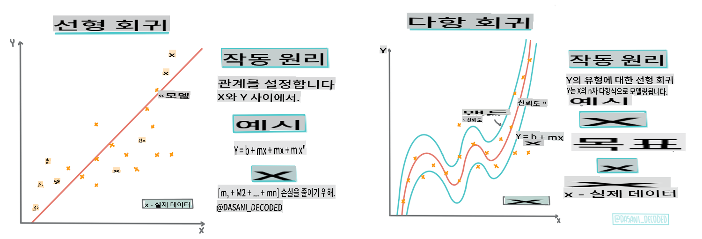

# Scikit-learn을 사용한 회귀 모델 구축: 네 가지 회귀 방법


> 인포그래픽 by [Dasani Madipalli](https://twitter.com/dasani_decoded)
## [강의 전 퀴즈](https://gray-sand-07a10f403.1.azurestaticapps.net/quiz/13/)

> ### [이 강의는 R로도 제공됩니다!](../../../../2-Regression/3-Linear/solution/R/lesson_3.html)
### 소개

지금까지 호박 가격 데이터셋을 사용하여 회귀가 무엇인지 탐구하고, Matplotlib을 사용하여 시각화하는 방법을 배웠습니다.

이제 머신러닝을 위한 회귀에 대해 더 깊이 탐구할 준비가 되었습니다. 시각화는 데이터를 이해하는 데 도움이 되지만, 머신러닝의 진정한 힘은 _모델 훈련_에서 나옵니다. 모델은 과거 데이터를 바탕으로 데이터 종속성을 자동으로 캡처하며, 이를 통해 모델이 보지 못한 새로운 데이터의 결과를 예측할 수 있습니다.

이번 강의에서는 _기본 선형 회귀_와 _다항 회귀_의 두 가지 회귀 유형과 이 기술들의 수학적 기초에 대해 배울 것입니다. 이 모델들은 다양한 입력 데이터를 바탕으로 호박 가격을 예측할 수 있게 해줍니다.

[](https://youtu.be/CRxFT8oTDMg "초보자를 위한 머신러닝 - 선형 회귀 이해하기")

> 🎥 위 이미지를 클릭하여 선형 회귀에 대한 짧은 비디오 개요를 확인하세요.

> 이 커리큘럼 전반에 걸쳐 최소한의 수학 지식을 가정하고, 다른 분야에서 온 학생들도 이해할 수 있도록 접근성을 높이기 위해 노트, 🧮 호출, 다이어그램 및 기타 학습 도구를 사용합니다.

### 선행 조건

현재까지 우리가 다루고 있는 호박 데이터의 구조에 익숙해야 합니다. 이 강의의 _notebook.ipynb_ 파일에 사전 로드 및 사전 정리된 데이터를 찾을 수 있습니다. 파일에서 호박 가격은 새로운 데이터 프레임에 부셸 단위로 표시됩니다. Visual Studio Code에서 이 노트북을 커널에서 실행할 수 있는지 확인하세요.

### 준비

이 데이터를 로드하여 질문을 할 수 있도록 상기하십시오.

- 호박을 사기에 가장 좋은 시기는 언제인가요?
- 미니어처 호박 한 상자의 가격은 얼마일까요?
- 반 부셸 바구니로 사야 하나요, 아니면 1 1/9 부셸 상자로 사야 하나요?
이 데이터를 계속 탐구해 봅시다.

이전 강의에서 Pandas 데이터 프레임을 생성하고 원래 데이터셋의 일부로 채워 부셸 단위로 가격을 표준화했습니다. 하지만 그렇게 함으로써 약 400개의 데이터 포인트만 수집할 수 있었고, 그것도 가을 달만 해당되었습니다.

이번 강의의 노트북에 사전 로드된 데이터를 확인해 보세요. 데이터는 사전 로드되어 있으며 초기 산점도는 월별 데이터를 보여줍니다. 데이터를 더 정리하면 데이터의 특성에 대해 더 자세히 알 수 있을지도 모릅니다.

## 선형 회귀선

1강에서 배운 것처럼, 선형 회귀 연습의 목표는 다음을 위해 선을 그릴 수 있는 것입니다:

- **변수 관계 표시**. 변수 간의 관계를 보여줍니다.
- **예측 수행**. 새로운 데이터 포인트가 그 선과의 관계에서 어디에 위치할지 정확하게 예측합니다.

이 유형의 선을 그리는 것은 **최소 제곱 회귀**에서 일반적입니다. '최소 제곱'이라는 용어는 회귀선 주변의 모든 데이터 포인트가 제곱되고 더해진다는 것을 의미합니다. 이상적으로는 최종 합계가 가능한 한 작아야 합니다. 왜냐하면 우리는 낮은 오류 수, 즉 `least-squares`을 원하기 때문입니다.

우리는 모든 데이터 포인트로부터의 누적 거리가 가장 적은 선을 모델링하고자 합니다. 또한 방향보다는 크기에 관심이 있기 때문에 항을 더하기 전에 제곱합니다.

> **🧮 수학을 보여줘** 
> 
> 이 선은 _최적 적합선_이라고 불리며, [방정식](https://en.wikipedia.org/wiki/Simple_linear_regression)으로 표현될 수 있습니다:
> 
> ```
> Y = a + bX
> ```
>
> `X` is the 'explanatory variable'. `Y` is the 'dependent variable'. The slope of the line is `b` and `a` is the y-intercept, which refers to the value of `Y` when `X = 0`. 
>
>
>
> First, calculate the slope `b`. Infographic by [Jen Looper](https://twitter.com/jenlooper)
>
> In other words, and referring to our pumpkin data's original question: "predict the price of a pumpkin per bushel by month", `X` would refer to the price and `Y` would refer to the month of sale. 
>
>
>
> Calculate the value of Y. If you're paying around $4, it must be April! Infographic by [Jen Looper](https://twitter.com/jenlooper)
>
> The math that calculates the line must demonstrate the slope of the line, which is also dependent on the intercept, or where `Y` is situated when `X = 0`.
>
> You can observe the method of calculation for these values on the [Math is Fun](https://www.mathsisfun.com/data/least-squares-regression.html) web site. Also visit [this Least-squares calculator](https://www.mathsisfun.com/data/least-squares-calculator.html) to watch how the numbers' values impact the line.

## Correlation

One more term to understand is the **Correlation Coefficient** between given X and Y variables. Using a scatterplot, you can quickly visualize this coefficient. A plot with datapoints scattered in a neat line have high correlation, but a plot with datapoints scattered everywhere between X and Y have a low correlation.

A good linear regression model will be one that has a high (nearer to 1 than 0) Correlation Coefficient using the Least-Squares Regression method with a line of regression.

✅ Run the notebook accompanying this lesson and look at the Month to Price scatterplot. Does the data associating Month to Price for pumpkin sales seem to have high or low correlation, according to your visual interpretation of the scatterplot? Does that change if you use more fine-grained measure instead of `Month`, eg. *day of the year* (i.e. number of days since the beginning of the year)?

In the code below, we will assume that we have cleaned up the data, and obtained a data frame called `new_pumpkins`, similar to the following:

ID | Month | DayOfYear | Variety | City | Package | Low Price | High Price | Price
---|-------|-----------|---------|------|---------|-----------|------------|-------
70 | 9 | 267 | PIE TYPE | BALTIMORE | 1 1/9 bushel cartons | 15.0 | 15.0 | 13.636364
71 | 9 | 267 | PIE TYPE | BALTIMORE | 1 1/9 bushel cartons | 18.0 | 18.0 | 16.363636
72 | 10 | 274 | PIE TYPE | BALTIMORE | 1 1/9 bushel cartons | 18.0 | 18.0 | 16.363636
73 | 10 | 274 | PIE TYPE | BALTIMORE | 1 1/9 bushel cartons | 17.0 | 17.0 | 15.454545
74 | 10 | 281 | PIE TYPE | BALTIMORE | 1 1/9 bushel cartons | 15.0 | 15.0 | 13.636364

> The code to clean the data is available in [`notebook.ipynb`](../../../../2-Regression/3-Linear/notebook.ipynb). We have performed the same cleaning steps as in the previous lesson, and have calculated `DayOfYear` 열을 다음 식을 사용하여 계산할 수 있습니다:

```python
day_of_year = pd.to_datetime(pumpkins['Date']).apply(lambda dt: (dt-datetime(dt.year,1,1)).days)
```

이제 선형 회귀의 수학적 배경을 이해했으니, 호박 패키지의 최적의 가격을 예측할 수 있는 회귀 모델을 만들어 봅시다. 휴일 호박 밭을 위해 호박을 사는 사람은 이 정보를 통해 호박 패키지 구매를 최적화할 수 있습니다.

## 상관 관계 찾기

[](https://youtu.be/uoRq-lW2eQo "초보자를 위한 머신러닝 - 상관 관계 찾기: 선형 회귀의 핵심")

> 🎥 위 이미지를 클릭하여 상관 관계에 대한 짧은 비디오 개요를 확인하세요.

이전 강의에서 다양한 달의 평균 가격이 다음과 같다는 것을 보았을 것입니다:


이는 어느 정도 상관 관계가 있음을 시사하며, `Month` and `Price`, or between `DayOfYear` and `Price`. Here is the scatter plot that shows the latter relationship:

 

Let's see if there is a correlation using the `corr` 함수를 사용하여 상관 관계를 확인해 볼 수 있습니다:

```python
print(new_pumpkins['Month'].corr(new_pumpkins['Price']))
print(new_pumpkins['DayOfYear'].corr(new_pumpkins['Price']))
```

상관 관계는 -0.15로 상당히 작아 보입니다. `Month` and -0.17 by the `DayOfMonth`, but there could be another important relationship. It looks like there are different clusters of prices corresponding to different pumpkin varieties. To confirm this hypothesis, let's plot each pumpkin category using a different color. By passing an `ax` parameter to the `scatter` 플로팅 함수를 사용하여 모든 포인트를 동일한 그래프에 플로팅할 수 있습니다:

```python
ax=None
colors = ['red','blue','green','yellow']
for i,var in enumerate(new_pumpkins['Variety'].unique()):
    df = new_pumpkins[new_pumpkins['Variety']==var]
    ax = df.plot.scatter('DayOfYear','Price',ax=ax,c=colors[i],label=var)
```

 

우리의 조사에 따르면 품종이 실제 판매 날짜보다 전체 가격에 더 큰 영향을 미치는 것으로 보입니다. 이는 막대 그래프로 확인할 수 있습니다:

```python
new_pumpkins.groupby('Variety')['Price'].mean().plot(kind='bar')
```

 

잠시 동안 '파이 타입'이라는 한 가지 호박 품종에만 집중하여 날짜가 가격에 미치는 영향을 확인해 봅시다:

```python
pie_pumpkins = new_pumpkins[new_pumpkins['Variety']=='PIE TYPE']
pie_pumpkins.plot.scatter('DayOfYear','Price') 
```
 

이제 `Price` and `DayOfYear` using `corr` function, we will get something like `-0.27` 사이의 상관 관계를 계산하면 예측 모델을 훈련시키는 것이 의미가 있음을 알 수 있습니다.

> 선형 회귀 모델을 훈련시키기 전에 데이터가 깨끗한지 확인하는 것이 중요합니다. 선형 회귀는 누락된 값과 잘 작동하지 않으므로 모든 빈 셀을 제거하는 것이 좋습니다:

```python
pie_pumpkins.dropna(inplace=True)
pie_pumpkins.info()
```

다른 접근 방식은 해당 열의 평균 값으로 빈 값을 채우는 것입니다.

## 단순 선형 회귀

[](https://youtu.be/e4c_UP2fSjg "초보자를 위한 머신러닝 - Scikit-learn을 사용한 선형 및 다항 회귀")

> 🎥 위 이미지를 클릭하여 선형 및 다항 회귀에 대한 짧은 비디오 개요를 확인하세요.

우리의 선형 회귀 모델을 훈련시키기 위해 **Scikit-learn** 라이브러리를 사용할 것입니다.

```python
from sklearn.linear_model import LinearRegression
from sklearn.metrics import mean_squared_error
from sklearn.model_selection import train_test_split
```

먼저 입력 값(특징)과 예상 출력(레이블)을 별도의 numpy 배열로 분리합니다:

```python
X = pie_pumpkins['DayOfYear'].to_numpy().reshape(-1,1)
y = pie_pumpkins['Price']
```

> 선형 회귀 패키지가 입력 데이터를 올바르게 이해할 수 있도록 입력 데이터에 `reshape`를 수행해야 했습니다. 선형 회귀는 각 배열 행이 입력 특징 벡터에 해당하는 2D 배열을 입력으로 기대합니다. 우리의 경우, 하나의 입력만 있기 때문에 N×1 형상의 배열이 필요합니다. 여기서 N은 데이터셋 크기입니다.

그런 다음 데이터를 훈련 및 테스트 데이터셋으로 분할하여 훈련 후 모델을 검증할 수 있습니다:

```python
X_train, X_test, y_train, y_test = train_test_split(X, y, test_size=0.2, random_state=0)
```

마지막으로 실제 선형 회귀 모델을 훈련시키는 것은 단 두 줄의 코드로 가능합니다. `LinearRegression` object, and fit it to our data using the `fit` 메서드를 정의합니다:

```python
lin_reg = LinearRegression()
lin_reg.fit(X_train,y_train)
```

`LinearRegression` object after `fit`-ting contains all the coefficients of the regression, which can be accessed using `.coef_` property. In our case, there is just one coefficient, which should be around `-0.017`. It means that prices seem to drop a bit with time, but not too much, around 2 cents per day. We can also access the intersection point of the regression with Y-axis using `lin_reg.intercept_` - it will be around `21`은 연초의 가격을 나타냅니다.

모델의 정확성을 확인하려면 테스트 데이터셋에서 가격을 예측한 다음, 예측 값과 예상 값이 얼마나 가까운지 측정할 수 있습니다. 이는 모든 예상 값과 예측 값의 제곱 차이의 평균인 평균 제곱 오차(MSE) 메트릭을 사용하여 수행할 수 있습니다.

```python
pred = lin_reg.predict(X_test)

mse = np.sqrt(mean_squared_error(y_test,pred))
print(f'Mean error: {mse:3.3} ({mse/np.mean(pred)*100:3.3}%)')
```

우리의 오류는 약 2 포인트로, 약 17%입니다. 그다지 좋지 않습니다. 모델 품질의 또 다른 지표는 **결정 계수**로, 다음과 같이 얻을 수 있습니다:

```python
score = lin_reg.score(X_train,y_train)
print('Model determination: ', score)
```
값이 0이면 모델이 입력 데이터를 고려하지 않고 *최악의 선형 예측기*로 작동하며, 이는 단순히 결과의 평균 값입니다. 값이 1이면 모든 예상 출력을 완벽하게 예측할 수 있음을 의미합니다. 우리의 경우 결정 계수는 약 0.06으로 상당히 낮습니다.

테스트 데이터와 회귀선을 함께 플로팅하여 우리의 경우 회귀가 어떻게 작동하는지 더 잘 볼 수 있습니다:

```python
plt.scatter(X_test,y_test)
plt.plot(X_test,pred)
```


## 다항 회귀

다른 유형의 선형 회귀는 다항 회귀입니다. 변수 간에 선형 관계가 있을 때가 있지만 - 호박의 부피가 클수록 가격이 높아지는 경우 - 때로는 이러한 관계를 평면이나 직선으로 그릴 수 없습니다.

✅ [다항 회귀를 사용할 수 있는 데이터의 더 많은 예시](https://online.stat.psu.edu/stat501/lesson/9/9.8)를 확인해 보세요.

날짜와 가격 간의 관계를 다시 한 번 살펴보세요. 이 산점도가 반드시 직선으로 분석되어야 할 것처럼 보이나요? 가격이 변동할 수 있지 않나요? 이 경우 다항 회귀를 시도해 볼 수 있습니다.

✅ 다항식은 하나 이상의 변수와 계수로 구성될 수 있는 수학적 표현입니다.

다항 회귀는 비선형 데이터를 더 잘 맞추기 위해 곡선을 만듭니다. 우리의 경우, 입력 데이터에 제곱 `DayOfYear` 변수를 포함하면, 연도의 특정 시점에 최소값을 가지는 포물선 곡선으로 데이터를 맞출 수 있습니다.

Scikit-learn에는 데이터 처리의 다양한 단계를 함께 결합할 수 있는 유용한 [파이프라인 API](https://scikit-learn.org/stable/modules/generated/sklearn.pipeline.make_pipeline.html?highlight=pipeline#sklearn.pipeline.make_pipeline)가 포함되어 있습니다. **파이프라인**은 **추정기**의 체인입니다. 우리의 경우, 모델에 다항 특징을 먼저 추가하고, 그 다음 회귀를 훈련시키는 파이프라인을 만들 것입니다:

```python
from sklearn.preprocessing import PolynomialFeatures
from sklearn.pipeline import make_pipeline

pipeline = make_pipeline(PolynomialFeatures(2), LinearRegression())

pipeline.fit(X_train,y_train)
```

`PolynomialFeatures(2)` means that we will include all second-degree polynomials from the input data. In our case it will just mean `DayOfYear`<sup>2</sup>, but given two input variables X and Y, this will add X<sup>2</sup>, XY and Y<sup>2</sup>. We may also use higher degree polynomials if we want.

Pipelines can be used in the same manner as the original `LinearRegression` object, i.e. we can `fit` the pipeline, and then use `predict` to get the prediction results. Here is the graph showing test data, and the approximation curve:


Using Polynomial Regression, we can get slightly lower MSE and higher determination, but not significantly. We need to take into account other features!

> You can see that the minimal pumpkin prices are observed somewhere around Halloween. How can you explain this? 

🎃 Congratulations, you just created a model that can help predict the price of pie pumpkins. You can probably repeat the same procedure for all pumpkin types, but that would be tedious. Let's learn now how to take pumpkin variety into account in our model!

## Categorical Features

In the ideal world, we want to be able to predict prices for different pumpkin varieties using the same model. However, the `Variety` column is somewhat different from columns like `Month`, because it contains non-numeric values. Such columns are called **categorical**.

[](https://youtu.be/DYGliioIAE0 "ML for beginners - Categorical Feature Predictions with Linear Regression")

> 🎥 Click the image above for a short video overview of using categorical features.

Here you can see how average price depends on variety:


To take variety into account, we first need to convert it to numeric form, or **encode** it. There are several way we can do it:

* Simple **numeric encoding** will build a table of different varieties, and then replace the variety name by an index in that table. This is not the best idea for linear regression, because linear regression takes the actual numeric value of the index, and adds it to the result, multiplying by some coefficient. In our case, the relationship between the index number and the price is clearly non-linear, even if we make sure that indices are ordered in some specific way.
* **One-hot encoding** will replace the `Variety` column by 4 different columns, one for each variety. Each column will contain `1` if the corresponding row is of a given variety, and `0` 그렇지 않으면. 이는 선형 회귀에서 네 개의 계수가 있으며, 각 호박 품종에 대해 하나씩, 해당 품종의 "시작 가격" (또는 "추가 가격")을 담당합니다.

다음 코드는 품종을 원-핫 인코딩하는 방법을 보여줍니다:

```python
pd.get_dummies(new_pumpkins['Variety'])
```

 ID | FAIRYTALE | MINIATURE | MIXED HEIRLOOM VARIETIES | PIE TYPE
----|-----------|-----------|--------------------------|----------
70 | 0 | 0 | 0 | 1
71 | 0 | 0 | 0 | 1
... | ... | ... | ... | ...
1738 | 0 | 1 | 0 | 0
1739 | 0 | 1 | 0 | 0
1740 | 0 | 1 | 0 | 0
1741 | 0 | 1 | 0 | 0
1742 | 0 | 1 | 0 | 0

원-핫 인코딩된 품종을 사용하여 선형 회귀를 훈련시키려면 `X` and `y` 데이터를 올바르게 초기화하기만 하면 됩니다:

```python
X = pd.get_dummies(new_pumpkins['Variety'])
y = new_pumpkins['Price']
```

나머지 코드는 선형 회귀를 훈련시키는 데 사용한 것과 동일합니다. 시도해 보면 평균 제곱 오차는 비슷하지만 결정 계수는 훨씬 높아집니다 (~77%). 더 정확한 예측을 위해서는 `Month` or `DayOfYear`. To get one large array of features, we can use `join`과 같은 숫자 특징뿐만 아니라 더 많은 범주형 특징을 고려할 수 있습니다:

```python
X = pd.get_dummies(new_pumpkins['Variety']) \
        .join(new_pumpkins['Month']) \
        .join(pd.get_dummies(new_pumpkins['City'])) \
        .join(pd.get_dummies(new_pumpkins['Package']))
y = new_pumpkins['Price']
```

여기에서는 `City` and `Package` 유형도 고려하여 MSE 2.84 (10%)와 결정 계수 0.94를 얻습니다!

## 모든 것을 종합하여

최고의 모델을 만들기 위해 위의 예제에서 사용한 결합된 (원-핫 인코딩된 범주형 + 숫자) 데이터를 사용하여 다항 회귀와 결합할 수 있습니다. 다음은 편의를 위해 전체 코드입니다:

```python
# set up training data
X = pd.get_dummies(new_pumpkins['Variety']) \
        .join(new_pumpkins['Month']) \
        .join(pd.get_dummies(new_pumpkins['City'])) \
        .join(pd.get_dummies(new_pumpkins['Package']))
y = new_pumpkins['Price']

# make train-test split
X_train, X_test, y_train, y_test = train_test_split(X, y, test_size=0.2, random_state=0)

# setup and train the pipeline
pipeline = make_pipeline(PolynomialFeatures(2), LinearRegression())
pipeline.fit(X_train,y_train)

# predict results for test data
pred = pipeline.predict(X_test)

# calculate MSE and determination
mse = np.sqrt(mean_squared_error(y_test,pred))
print(f'Mean error: {mse:3.3} ({mse/np.mean(pred)*100:3.3}%)')

score = pipeline.score(X_train,y_train)
print('Model determination: ', score)
```

이것은 거의 97%의 최고의 결정 계수를 제공하며, MSE=2.23 (~8% 예측 오류)을 제공합니다.

| 모델 | MSE | 결정 계수 |
|-------|-----|---------------|
| `DayOfYear` Linear | 2.77 (17.2%) | 0.07 |
| `DayOfYear` Polynomial | 2.73 (17.0%) | 0.08 |
| `Variety` 선형 | 5.24 (19.7%) | 0.77 |
| 모든 특징 선형 | 2.84 (10.5%) | 0.94 |
| 모든 특징 다항 | 2.23 (8.25%) | 0.97 |

🏆 잘하셨습니다! 한 강의에서 네 가지 회귀 모델을 만들었으며, 모델 품질을 97%까지 향상시켰습니다. 회귀에 대한 마지막 섹션에서는 범주를 결정하기 위해 로지스틱 회귀에 대해 배울 것입니다.

---
## 🚀도전

이 노트북에서 여러 다른 변수를 테스트하여 상관 관계가 모델 정확도와 어떻게 대응하는지 확인하세요.

## [강의 후 퀴즈](https://gray-sand-07a10f403.1.azurestaticapps.net/quiz/14/)

## 복습 및 자습

이번 강의에서는 선형 회귀에 대해 배웠습니다. 다른 중요한 회귀 유형도 있습니다. Stepwise, Ridge, Lasso 및 Elasticnet 기술에 대해 읽어보세요. 더 배우기 위해 좋은 과정은 [스탠포드 통계학 학습 과정](https://online.stanford.edu/courses/sohs-ystatslearning-statistical-learning)입니다.

## 과제

[모델 구축](assignment.md)

**면책 조항**:
이 문서는 기계 기반 AI 번역 서비스를 사용하여 번역되었습니다. 정확성을 위해 노력하지만, 자동 번역에는 오류나 부정확성이 있을 수 있음을 유의하시기 바랍니다. 원어로 작성된 원본 문서를 권위 있는 자료로 간주해야 합니다. 중요한 정보의 경우, 전문적인 인간 번역을 권장합니다. 이 번역 사용으로 인해 발생하는 오해나 잘못된 해석에 대해 우리는 책임을 지지 않습니다.