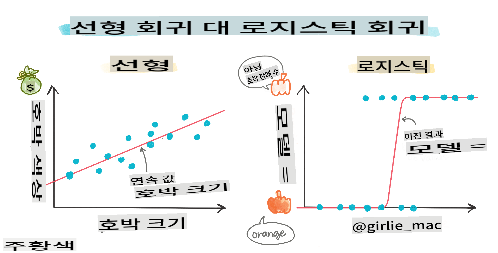
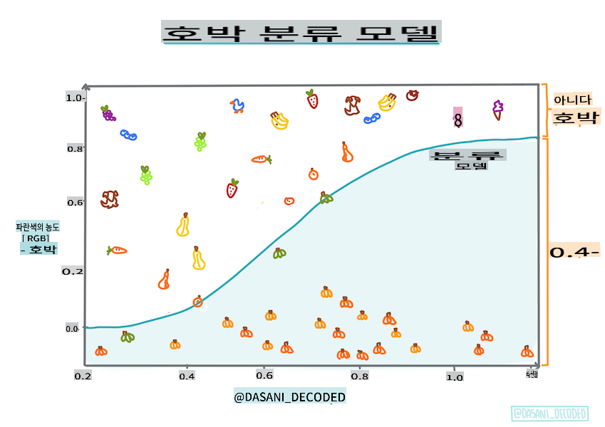
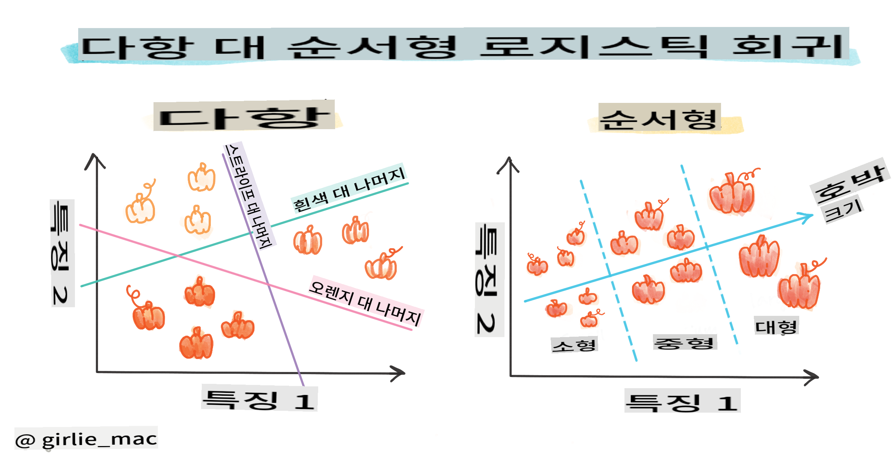
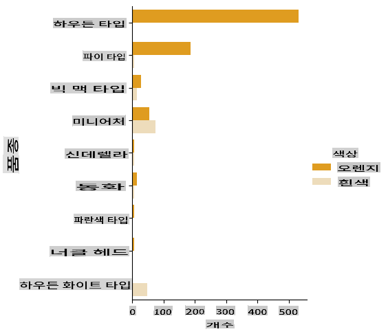
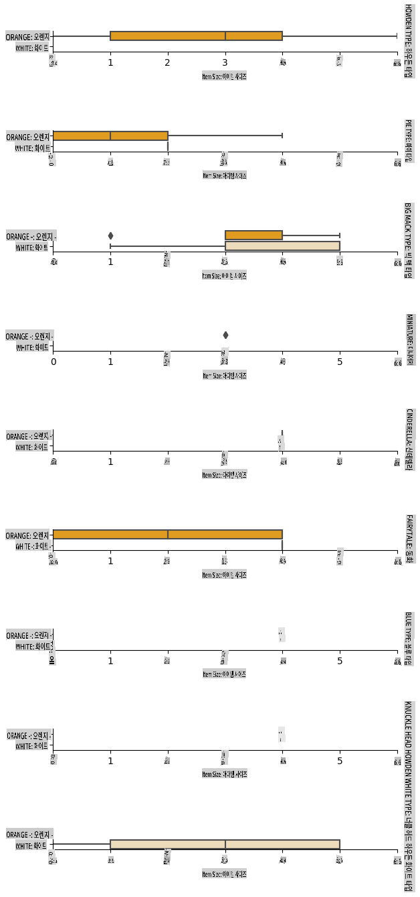
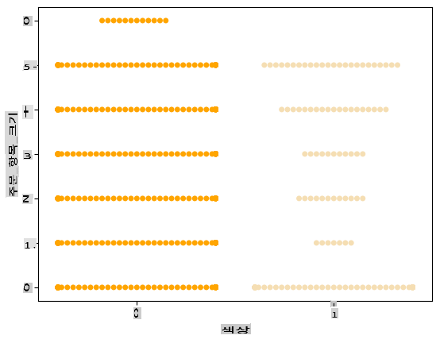

# 카테고리 예측을 위한 로지스틱 회귀



## [강의 전 퀴즈](https://gray-sand-07a10f403.1.azurestaticapps.net/quiz/15/)

> ### [이 강의는 R에서도 사용할 수 있습니다!](../../../../2-Regression/4-Logistic/solution/R/lesson_4.html)

## 소개

이제 고전적인 머신러닝 기법 중 하나인 회귀에 대한 마지막 강의로, 로지스틱 회귀를 살펴보겠습니다. 이 기법을 사용하여 이진 카테고리를 예측하는 패턴을 발견할 수 있습니다. 이 사탕이 초콜릿인가 아닌가? 이 질병이 전염성이 있는가 없는가? 이 고객이 이 제품을 선택할 것인가 아닌가?

이 강의에서는 다음을 배우게 됩니다:

- 데이터 시각화를 위한 새로운 라이브러리
- 로지스틱 회귀 기법

✅ 이 [학습 모듈](https://docs.microsoft.com/learn/modules/train-evaluate-classification-models?WT.mc_id=academic-77952-leestott)을 통해 이 회귀 기법에 대한 이해를 심화하세요.

## 전제 조건

호박 데이터를 다루면서, 이제 우리가 작업할 수 있는 이진 카테고리 하나가 있다는 것을 알게 되었습니다: `Color`.

이제 몇 가지 변수를 통해 _주어진 호박의 색상이 무엇일지_ (주황색 🎃 또는 흰색 👻) 예측하는 로지스틱 회귀 모델을 만들어 보겠습니다.

> 왜 회귀에 관한 강의에서 이진 분류에 대해 이야기하고 있을까요? 단지 언어적 편의를 위해서입니다. 로지스틱 회귀는 [실제로는 분류 방법](https://scikit-learn.org/stable/modules/linear_model.html#logistic-regression)이지만, 선형 기반입니다. 다음 강의 그룹에서 데이터를 분류하는 다른 방법에 대해 배워보세요.

## 질문 정의하기

우리의 목적을 위해, 이를 '흰색' 또는 '흰색이 아님'으로 표현하겠습니다. 데이터셋에 '줄무늬' 카테고리도 있지만, 인스턴스가 거의 없어서 사용하지 않겠습니다. 어쨌든 데이터셋에서 null 값을 제거하면 사라집니다.

> 🎃 재미있는 사실, 우리는 때때로 흰색 호박을 '유령' 호박이라고 부릅니다. 조각하기가 쉽지 않아서 주황색 호박만큼 인기가 많지 않지만, 멋지게 생겼습니다! 그래서 질문을 '유령' 또는 '유령이 아님'으로 다시 표현할 수도 있습니다. 👻

## 로지스틱 회귀에 대하여

로지스틱 회귀는 이전에 배운 선형 회귀와 몇 가지 중요한 면에서 다릅니다.

[](https://youtu.be/KpeCT6nEpBY "초보자를 위한 머신러닝 - 로지스틱 회귀 이해하기")

> 🎥 위 이미지를 클릭하여 로지스틱 회귀에 대한 짧은 비디오 개요를 확인하세요.

### 이진 분류

로지스틱 회귀는 선형 회귀와 동일한 기능을 제공하지 않습니다. 전자는 이진 카테고리("흰색 또는 흰색이 아님")에 대한 예측을 제공하는 반면, 후자는 예를 들어 호박의 출처와 수확 시기를 기준으로 _가격이 얼마나 오를지_와 같은 연속적인 값을 예측할 수 있습니다.


> 인포그래픽 by [Dasani Madipalli](https://twitter.com/dasani_decoded)

### 다른 분류들

다른 유형의 로지스틱 회귀도 있습니다. 다항 로지스틱 회귀와 서열 로지스틱 회귀가 있습니다:

- **다항 로지스틱 회귀**, 여러 카테고리가 있는 경우 - "주황색, 흰색, 줄무늬".
- **서열 로지스틱 회귀**, 순서가 있는 카테고리로, 결과를 논리적으로 정렬해야 하는 경우 유용합니다. 예를 들어, 호박을 크기(미니, 소, 중, 대, 특대, 초대형)로 정렬하는 경우.



### 변수들이 반드시 상관관계가 있을 필요는 없음

선형 회귀가 상관관계가 더 높은 변수들과 더 잘 작동했던 것을 기억하시나요? 로지스틱 회귀는 반대입니다 - 변수들이 일치할 필요가 없습니다. 이는 상관관계가 약한 이 데이터에 적합합니다.

### 많은 깨끗한 데이터가 필요함

로지스틱 회귀는 더 많은 데이터를 사용할수록 더 정확한 결과를 제공합니다. 우리의 작은 데이터셋은 이 작업에 최적화되어 있지 않으므로 유의하세요.

[](https://youtu.be/B2X4H9vcXTs "초보자를 위한 머신러닝 - 로지스틱 회귀를 위한 데이터 분석 및 준비")

> 🎥 위 이미지를 클릭하여 로지스틱 회귀를 위한 데이터 준비에 대한 짧은 비디오 개요를 확인하세요.

✅ 로지스틱 회귀에 적합한 데이터 유형을 생각해 보세요.

## 연습 - 데이터 정리하기

먼저 데이터를 조금 정리하고, null 값을 제거하고 일부 열만 선택합니다:

1. 다음 코드를 추가하세요:

    ```python
  
    columns_to_select = ['City Name','Package','Variety', 'Origin','Item Size', 'Color']
    pumpkins = full_pumpkins.loc[:, columns_to_select]

    pumpkins.dropna(inplace=True)
    ```

    새로운 데이터프레임을 항상 확인할 수 있습니다:

    ```python
    pumpkins.info
    ```

### 시각화 - 카테고리 플롯

이제 [시작 노트북](../../../../2-Regression/4-Logistic/notebook.ipynb)을 다시 열고 호박 데이터를 불러와서 몇 가지 변수를 포함하는 데이터셋을 유지하도록 정리했습니다. 이번에는 다른 라이브러리를 사용하여 데이터프레임을 시각화해 봅시다: [Seaborn](https://seaborn.pydata.org/index.html), 이는 이전에 사용한 Matplotlib 위에 구축되었습니다.

Seaborn은 데이터를 시각화하는 멋진 방법을 제공합니다. 예를 들어, 각 `Variety`와 `Color`의 데이터 분포를 카테고리 플롯으로 비교할 수 있습니다.

1. `catplot` function, using our pumpkin data `pumpkins`를 사용하여 각 호박 카테고리(주황색 또는 흰색)에 대한 색상 매핑을 지정하여 플롯을 만드세요:

    ```python
    import seaborn as sns
    
    palette = {
    'ORANGE': 'orange',
    'WHITE': 'wheat',
    }

    sns.catplot(
    data=pumpkins, y="Variety", hue="Color", kind="count",
    palette=palette, 
    )
    ```

    

    데이터를 관찰하여 Color 데이터가 Variety와 어떻게 관련되는지 확인할 수 있습니다.

    ✅ 이 카테고리 플롯을 통해 어떤 흥미로운 탐색을 상상할 수 있습니까?

### 데이터 전처리: 특성 및 라벨 인코딩
호박 데이터셋의 모든 열은 문자열 값을 포함합니다. 카테고리 데이터를 다루는 것은 사람에게는 직관적이지만 기계에게는 그렇지 않습니다. 머신러닝 알고리즘은 숫자와 잘 작동합니다. 따라서 인코딩은 데이터 전처리 단계에서 매우 중요한 단계입니다. 이는 카테고리 데이터를 숫자 데이터로 변환하여 정보를 잃지 않도록 합니다. 좋은 인코딩은 좋은 모델을 구축하는 데 도움이 됩니다.

특성 인코딩에는 두 가지 주요 유형의 인코더가 있습니다:

1. 순서형 인코더: 이는 순서형 변수에 적합합니다. 순서형 변수는 데이터가 논리적 순서를 따르는 카테고리 변수입니다. 예를 들어, 데이터셋의 `Item Size` 열입니다. 각 카테고리가 열의 순서에 따라 숫자로 표현되도록 매핑을 만듭니다.

    ```python
    from sklearn.preprocessing import OrdinalEncoder

    item_size_categories = [['sml', 'med', 'med-lge', 'lge', 'xlge', 'jbo', 'exjbo']]
    ordinal_features = ['Item Size']
    ordinal_encoder = OrdinalEncoder(categories=item_size_categories)
    ```

2. 카테고리 인코더: 이는 명목 변수에 적합합니다. 명목 변수는 데이터가 논리적 순서를 따르지 않는 카테고리 변수입니다. 데이터셋에서 `Item Size`를 제외한 모든 특성입니다. 이는 원-핫 인코딩으로, 각 카테고리가 이진 열로 표현됩니다: 인코딩된 변수는 호박이 해당 Variety에 속하면 1, 그렇지 않으면 0입니다.

    ```python
    from sklearn.preprocessing import OneHotEncoder

    categorical_features = ['City Name', 'Package', 'Variety', 'Origin']
    categorical_encoder = OneHotEncoder(sparse_output=False)
    ```
그런 다음, `ColumnTransformer`를 사용하여 여러 인코더를 하나의 단계로 결합하고 적절한 열에 적용합니다.

```python
    from sklearn.compose import ColumnTransformer
    
    ct = ColumnTransformer(transformers=[
        ('ord', ordinal_encoder, ordinal_features),
        ('cat', categorical_encoder, categorical_features)
        ])
    
    ct.set_output(transform='pandas')
    encoded_features = ct.fit_transform(pumpkins)
```
한편, 라벨을 인코딩하기 위해, scikit-learn의 `LabelEncoder` 클래스를 사용합니다. 이는 라벨을 0에서 n_classes-1(여기서는 0과 1) 사이의 값만 포함하도록 정규화하는 유틸리티 클래스입니다.

```python
    from sklearn.preprocessing import LabelEncoder

    label_encoder = LabelEncoder()
    encoded_label = label_encoder.fit_transform(pumpkins['Color'])
```
특성과 라벨을 인코딩한 후, 이를 새로운 데이터프레임 `encoded_pumpkins`에 병합할 수 있습니다.

```python
    encoded_pumpkins = encoded_features.assign(Color=encoded_label)
```
✅ `Item Size` column?

### Analyse relationships between variables

Now that we have pre-processed our data, we can analyse the relationships between the features and the label to grasp an idea of how well the model will be able to predict the label given the features.
The best way to perform this kind of analysis is plotting the data. We'll be using again the Seaborn `catplot` function, to visualize the relationships between `Item Size`,  `Variety`와 `Color`의 카테고리 플롯에 대해 순서형 인코더를 사용하는 장점은 무엇입니까? 데이터를 더 잘 플롯하기 위해 인코딩된 `Item Size` column and the unencoded `Variety` 열을 사용할 것입니다.

```python
    palette = {
    'ORANGE': 'orange',
    'WHITE': 'wheat',
    }
    pumpkins['Item Size'] = encoded_pumpkins['ord__Item Size']

    g = sns.catplot(
        data=pumpkins,
        x="Item Size", y="Color", row='Variety',
        kind="box", orient="h",
        sharex=False, margin_titles=True,
        height=1.8, aspect=4, palette=palette,
    )
    g.set(xlabel="Item Size", ylabel="").set(xlim=(0,6))
    g.set_titles(row_template="{row_name}")
```


### 스웜 플롯 사용하기

Color는 이진 카테고리(흰색 또는 흰색이 아님)이므로, 시각화를 위해 '특화된 접근 방식'이 필요합니다. 이 카테고리와 다른 변수 간의 관계를 시각화하는 다른 방법이 있습니다.

Seaborn 플롯을 사용하여 변수를 나란히 시각화할 수 있습니다.

1. 값의 분포를 보여주는 '스웜' 플롯을 시도해 보세요:

    ```python
    palette = {
    0: 'orange',
    1: 'wheat'
    }
    sns.swarmplot(x="Color", y="ord__Item Size", data=encoded_pumpkins, palette=palette)
    ```

    

**주의**: 위의 코드는 경고를 발생시킬 수 있습니다. Seaborn이 스웜 플롯에 많은 데이터 포인트를 나타내지 못하기 때문입니다. 가능한 해결책은 'size' 매개변수를 사용하여 마커의 크기를 줄이는 것입니다. 하지만 이는 플롯의 가독성에 영향을 미칠 수 있습니다.

> **🧮 수학을 보여주세요**
>
> 로지스틱 회귀는 [시그모이드 함수](https://wikipedia.org/wiki/Sigmoid_function)를 사용하여 '최대 가능성' 개념에 의존합니다. 플롯에서 '시그모이드 함수'는 'S' 모양처럼 보입니다. 이는 값을 0과 1 사이로 매핑합니다. 곡선은 '로지스틱 곡선'이라고도 합니다. 공식은 다음과 같습니다:
>
> 
>
> 여기서 시그모이드의 중간점은 x의 0 지점에 위치하고, L은 곡선의 최대 값이며, k는 곡선의 가파름을 나타냅니다. 함수의 결과가 0.5보다 크면 해당 라벨은 이진 선택의 '1'로 분류됩니다. 그렇지 않으면 '0'으로 분류됩니다.

## 모델 구축하기

이진 분류를 찾기 위한 모델을 구축하는 것은 Scikit-learn에서 놀랍도록 간단합니다.

[](https://youtu.be/MmZS2otPrQ8 "초보자를 위한 머신러닝 - 데이터 분류를 위한 로지스틱 회귀")

> 🎥 위 이미지를 클릭하여 선형 회귀 모델 구축에 대한 짧은 비디오 개요를 확인하세요.

1. 분류 모델에 사용할 변수를 선택하고 `train_test_split()`을 호출하여 학습 및 테스트 세트를 분할하세요:

    ```python
    from sklearn.model_selection import train_test_split
    
    X = encoded_pumpkins[encoded_pumpkins.columns.difference(['Color'])]
    y = encoded_pumpkins['Color']

    X_train, X_test, y_train, y_test = train_test_split(X, y, test_size=0.2, random_state=0)
    
    ```

2. 이제 학습 데이터를 사용하여 `fit()`을 호출하여 모델을 학습시키고 결과를 출력할 수 있습니다:

    ```python
    from sklearn.metrics import f1_score, classification_report 
    from sklearn.linear_model import LogisticRegression

    model = LogisticRegression()
    model.fit(X_train, y_train)
    predictions = model.predict(X_test)

    print(classification_report(y_test, predictions))
    print('Predicted labels: ', predictions)
    print('F1-score: ', f1_score(y_test, predictions))
    ```

    모델의 점수를 확인하세요. 약 1000개의 데이터 행만 있는 것을 고려하면 나쁘지 않습니다:

    ```output
                       precision    recall  f1-score   support
    
                    0       0.94      0.98      0.96       166
                    1       0.85      0.67      0.75        33
    
        accuracy                                0.92       199
        macro avg           0.89      0.82      0.85       199
        weighted avg        0.92      0.92      0.92       199
    
        Predicted labels:  [0 0 0 0 0 0 0 0 0 0 0 0 0 0 0 0 0 0 0 0 1 0 0 1 0 0 0 0 0 0 0 0 1 0 0 0 0
        0 0 0 0 0 1 0 1 0 0 1 0 0 0 0 0 1 0 1 0 1 0 1 0 0 0 0 0 0 0 0 0 0 0 0 0 0
        1 0 0 0 0 0 0 0 1 0 0 0 0 0 0 0 1 0 0 0 0 0 0 0 0 1 0 1 0 0 0 0 0 0 0 1 0
        0 0 0 0 0 0 0 0 0 0 0 0 0 0 0 0 0 0 0 0 0 1 0 0 0 0 0 0 0 0 1 0 0 0 1 1 0
        0 0 0 0 1 0 0 0 0 0 1 0 0 0 0 0 0 0 0 0 0 0 0 0 0 0 0 0 0 0 0 0 0 0 0 0 1
        0 0 0 1 0 0 0 0 0 0 0 0 1 1]
        F1-score:  0.7457627118644068
    ```

## 혼동 행렬을 통한 더 나은 이해

위에서 출력한 항목을 통해 점수 보고서를 얻을 수 있지만, [혼동 행렬](https://scikit-learn.org/stable/modules/model_evaluation.html#confusion-matrix)을 사용하여 모델의 성능을 더 쉽게 이해할 수 있습니다.

> 🎓 '[혼동 행렬](https://wikipedia.org/wiki/Confusion_matrix)'(또는 '오류 행렬')은 모델의 실제 vs. 거짓 긍정 및 부정을 나타내어 예측의 정확성을 측정하는 테이블입니다.

1. 혼동 행렬을 사용하려면 `confusion_matrix()`를 호출하세요:

    ```python
    from sklearn.metrics import confusion_matrix
    confusion_matrix(y_test, predictions)
    ```

    모델의 혼동 행렬을 확인하세요:

    ```output
    array([[162,   4],
           [ 11,  22]])
    ```

Scikit-learn에서 혼동 행렬의 행(축 0)은 실제 라벨이고 열(축 1)은 예측된 라벨입니다.

|       |   0   |   1   |
| :---: | :---: | :---: |
|   0   |  TN   |  FP   |
|   1   |  FN   |  TP   |

여기서 무슨 일이 일어나고 있는지 봅시다. 모델이 두 개의 이진 카테고리, '흰색'과 '흰색이 아님' 사이에서 호박을 분류하도록 요청받았다고 가정해 봅시다.

- 모델이 호박을 흰색이 아니라고 예측하고 실제로도 '흰색이 아님' 카테고리에 속하면 이를 참 부정이라고 부릅니다. 이는 왼쪽 상단 숫자로 표시됩니다.
- 모델이 호박을 흰색이라고 예측하고 실제로는 '흰색이 아님' 카테고리에 속하면 이를 거짓 부정이라고 부릅니다. 이는 왼쪽 하단 숫자로 표시됩니다.
- 모델이 호박을 흰색이 아니라고 예측하고 실제로는 '흰색' 카테고리에 속하면 이를 거짓 긍정이라고 부릅니다. 이는 오른쪽 상단 숫자로 표시됩니다.
- 모델이 호박을 흰색이라고 예측하고 실제로도 '흰색' 카테고리에 속하면 이를 참 긍정이라고 부릅니다. 이는 오른쪽 하단 숫자로 표시됩니다.

참 긍정과 참 부정의 숫자가 많고 거짓 긍정과 거짓 부정의 숫자가 적을수록 모델이 더 잘 작동한다고 할 수 있습니다.

혼동 행렬이 정확도와 재현율과 어떻게 관련이 있는지 봅시다. 위에서 출력된 분류 보고서는 정확도(0.85)와 재현율(0.67)을 보여줍니다.

정확도 = tp / (tp + fp) = 22 / (22 + 4) = 0.8461538461538461

재현율 = tp / (tp + fn) = 22 / (22 + 11) = 0.6666666666666666

✅ Q: 혼동 행렬에 따르면 모델의 성능은 어땠나요? A: 나쁘지 않습니다. 참 부정의 숫자가 많지만 거짓 부정도 몇 개 있습니다.

혼동 행렬의 TP/TN과 FP/FN 매핑을 통해 앞서 봤던 용어를 다시 살펴봅시다:

🎓 정확도: TP/(TP + FP) 검색된 인스턴스 중 관련 인스턴스의 비율 (예: 잘 라벨된 라벨)

🎓 재현율: TP/(TP + FN) 검색된 관련 인스턴스의 비율, 잘 라벨된지 여부와 관계없이

🎓 f1-score: (2 * 정확도 * 재현율)/(정확도 + 재현율) 정확도와 재현율의 가중 평균, 최상은 1, 최악은 0

🎓 지원: 검색된 각 라벨의 발생 수

🎓 정확도: (TP + TN)/(TP + TN + FP + FN) 샘플에 대해 정확하게 예측된 라벨의 비율.

🎓 매크로 평균: 라벨 불균형을 고려하지 않고 각 라벨에 대한 비가중 평균 메트릭 계산.

🎓 가중 평균: 각 라벨에 대한 비율을 고려하여 라벨 불균형을 고려하여 지원에 따라 가중치를 부여한 평균 메트릭 계산.

✅ 거짓 부정의 수를 줄이려면 어떤 메트릭을 주시해야 할지 생각해 보세요.

## 이 모델의 ROC 곡선 시각화

[](https://youtu.be/GApO575jTA0 "초보자를 위한 머신러닝 - ROC 곡선을 통한 로지스틱 회귀 성능 분석")

> 🎥 위 이미지를 클릭하여 ROC 곡선에 대한 짧은 비디오 개요를 확인하세요.

이제 'ROC' 곡선을 시각화해 봅시다:

```python
from sklearn.metrics import roc_curve, roc_auc_score
import matplotlib
import matplotlib.pyplot as plt
%matplotlib inline

y_scores = model.predict_proba(X_test)
fpr, tpr, thresholds = roc_curve(y_test, y_scores[:,1])

fig = plt.figure(figsize=(6, 6))
plt.plot([0, 1], [0, 1], 'k--')
plt.plot(fpr, tpr)
plt.xlabel('False Positive Rate')
plt.ylabel('True Positive Rate')
plt.title('ROC Curve')
plt.show()
```

Matplotlib을 사용하여 모델의 [수신 운영 특성](https://scikit-learn.org/stable/auto_examples/model_selection/plot_roc

**면책 조항**:
이 문서는 기계 기반 AI 번역 서비스를 사용하여 번역되었습니다. 정확성을 위해 노력하고 있지만 자동 번역에는 오류나 부정확성이 있을 수 있습니다. 원본 문서를 해당 언어로 작성된 상태에서 권위 있는 출처로 간주해야 합니다. 중요한 정보의 경우, 전문 인간 번역을 권장합니다. 이 번역 사용으로 인해 발생하는 오해나 오역에 대해 당사는 책임을 지지 않습니다.