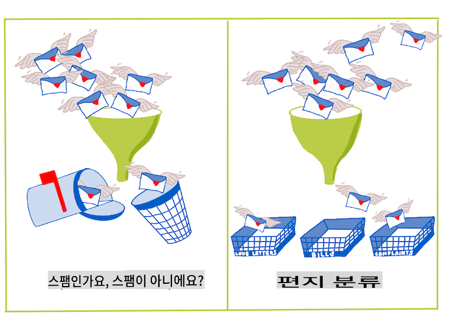
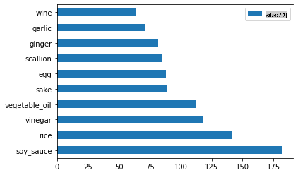
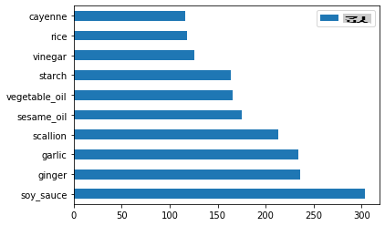
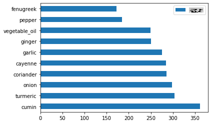
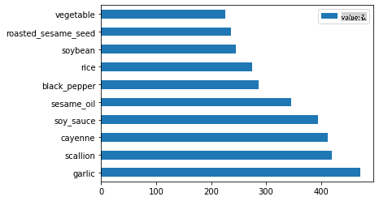

# 분류 소개

이 네 가지 강의에서, 여러분은 고전적인 머신 러닝의 근본적인 초점인 _분류_를 탐구할 것입니다. 아시아와 인도의 모든 훌륭한 요리에 관한 데이터셋을 사용하여 다양한 분류 알고리즘을 다룰 것입니다. 배가 고프시길 바랍니다!


> 이 강의에서 범아시아 요리를 축하하세요! 이미지 제공: [Jen Looper](https://twitter.com/jenlooper)

분류는 회귀 기법과 많은 공통점을 가진 [지도 학습](https://wikipedia.org/wiki/Supervised_learning)의 한 형태입니다. 머신 러닝이 데이터셋을 사용하여 값이나 이름을 예측하는 것이라면, 분류는 일반적으로 _이진 분류_와 _다중 클래스 분류_의 두 그룹으로 나뉩니다.

[](https://youtu.be/eg8DJYwdMyg "분류 소개")

> 🎥 위 이미지를 클릭하면 MIT의 John Guttag이 분류를 소개하는 비디오로 이동합니다.

기억하세요:

- **선형 회귀**는 변수 간의 관계를 예측하고 새로운 데이터 포인트가 그 선과의 관계에서 어디에 위치할지 정확하게 예측하는 데 도움을 줍니다. 예를 들어, _9월과 12월에 호박 가격이 얼마일지_ 예측할 수 있습니다.
- **로지스틱 회귀**는 "이진 카테고리"를 발견하는 데 도움을 줍니다: 이 가격대에서 _이 호박이 주황색인지 아닌지_?

분류는 데이터 포인트의 레이블이나 클래스를 결정하는 다양한 알고리즘을 사용합니다. 이 요리 데이터를 사용하여 재료 그룹을 관찰함으로써 원산지 요리를 결정할 수 있는지 살펴보겠습니다.

## [강의 전 퀴즈](https://gray-sand-07a10f403.1.azurestaticapps.net/quiz/19/)

> ### [이 강의는 R로도 제공됩니다!](../../../../4-Classification/1-Introduction/solution/R/lesson_10.html)

### 소개

분류는 머신 러닝 연구자와 데이터 과학자의 기본 활동 중 하나입니다. 이진 값의 기본 분류("이 이메일이 스팸인지 아닌지")부터 컴퓨터 비전을 사용한 복잡한 이미지 분류 및 세분화까지, 데이터를 클래스로 분류하고 질문하는 것은 항상 유용합니다.

과정을 더 과학적으로 설명하자면, 분류 방법은 입력 변수와 출력 변수 간의 관계를 매핑할 수 있는 예측 모델을 생성합니다.



> 분류 알고리즘이 처리할 이진 vs. 다중 클래스 문제. 인포그래픽 제공: [Jen Looper](https://twitter.com/jenlooper)

데이터를 정리하고 시각화하며 ML 작업을 준비하기 전에, 데이터를 분류하는 데 머신 러닝을 활용할 수 있는 다양한 방법에 대해 알아봅시다.

고전적인 머신 러닝을 사용한 분류는 [통계학](https://wikipedia.org/wiki/Statistical_classification)에서 유래하며, `smoker`, `weight`, `age`와 같은 특징을 사용하여 _X 질병 발병 가능성_을 결정합니다. 이전에 수행한 회귀 연습과 유사한 지도 학습 기법으로, 데이터는 라벨이 지정되고 ML 알고리즘은 이러한 라벨을 사용하여 데이터셋의 클래스(또는 '특징')를 분류하고 예측하여 그룹이나 결과에 할당합니다.

✅ 요리에 관한 데이터셋을 상상해보세요. 다중 클래스 모델은 어떤 질문에 답할 수 있을까요? 이진 모델은 어떤 질문에 답할 수 있을까요? 특정 요리가 호로파를 사용할 가능성이 있는지 결정하고 싶다면 어떻게 할까요? 별모양의 아니스, 아티초크, 콜리플라워, 고추냉이가 가득한 식료품 가방을 선물로 받았을 때 전형적인 인도 요리를 만들 수 있을까요?

[](https://youtu.be/GuTeDbaNoEU "Crazy mystery baskets")

> 🎥 위 이미지를 클릭하면 'Chopped' 쇼의 '미스터리 바구니'에서 셰프들이 무작위로 선택된 재료로 요리를 만드는 전제의 비디오로 이동합니다. 분명히 ML 모델이 도움이 되었을 것입니다!

## 안녕하세요 '분류기'

이 요리 데이터셋에 대해 우리가 묻고 싶은 질문은 실제로 **다중 클래스 질문**입니다. 여러 잠재적인 국가 요리가 있기 때문입니다. 재료의 묶음을 주어졌을 때, 이 많은 클래스 중 어느 것에 데이터가 맞을까요?

Scikit-learn은 문제를 해결하고자 하는 유형에 따라 데이터를 분류하는 데 사용할 수 있는 여러 알고리즘을 제공합니다. 다음 두 강의에서는 이러한 알고리즘 중 몇 가지에 대해 배울 것입니다.

## 연습 - 데이터 정리 및 균형 맞추기

이 프로젝트를 시작하기 전에 첫 번째 작업은 데이터를 정리하고 **균형을 맞추는 것**입니다. 이 폴더의 루트에 있는 빈 _notebook.ipynb_ 파일로 시작하세요.

첫 번째로 설치할 것은 [imblearn](https://imbalanced-learn.org/stable/)입니다. 이것은 데이터를 더 잘 균형 맞출 수 있게 해주는 Scikit-learn 패키지입니다(이 작업에 대해 곧 더 배울 것입니다).

1. `imblearn`를 설치하려면 `pip install`를 실행하세요:

    ```python
    pip install imblearn
    ```

1. 데이터를 가져오고 시각화하는 데 필요한 패키지를 가져오고, `imblearn`에서 `SMOTE`를 가져오세요.

    ```python
    import pandas as pd
    import matplotlib.pyplot as plt
    import matplotlib as mpl
    import numpy as np
    from imblearn.over_sampling import SMOTE
    ```

    이제 데이터를 가져올 준비가 되었습니다.

1. 데이터를 가져오는 다음 작업을 수행하세요:

    ```python
    df  = pd.read_csv('../data/cuisines.csv')
    ```

   `read_csv()` will read the content of the csv file _cusines.csv_ and place it in the variable `df`를 사용하세요.

1. 데이터의 모양을 확인하세요:

    ```python
    df.head()
    ```

   처음 다섯 줄은 다음과 같습니다:

    ```output
    |     | Unnamed: 0 | cuisine | almond | angelica | anise | anise_seed | apple | apple_brandy | apricot | armagnac | ... | whiskey | white_bread | white_wine | whole_grain_wheat_flour | wine | wood | yam | yeast | yogurt | zucchini |
    | --- | ---------- | ------- | ------ | -------- | ----- | ---------- | ----- | ------------ | ------- | -------- | --- | ------- | ----------- | ---------- | ----------------------- | ---- | ---- | --- | ----- | ------ | -------- |
    | 0   | 65         | indian  | 0      | 0        | 0     | 0          | 0     | 0            | 0       | 0        | ... | 0       | 0           | 0          | 0                       | 0    | 0    | 0   | 0     | 0      | 0        |
    | 1   | 66         | indian  | 1      | 0        | 0     | 0          | 0     | 0            | 0       | 0        | ... | 0       | 0           | 0          | 0                       | 0    | 0    | 0   | 0     | 0      | 0        |
    | 2   | 67         | indian  | 0      | 0        | 0     | 0          | 0     | 0            | 0       | 0        | ... | 0       | 0           | 0          | 0                       | 0    | 0    | 0   | 0     | 0      | 0        |
    | 3   | 68         | indian  | 0      | 0        | 0     | 0          | 0     | 0            | 0       | 0        | ... | 0       | 0           | 0          | 0                       | 0    | 0    | 0   | 0     | 0      | 0        |
    | 4   | 69         | indian  | 0      | 0        | 0     | 0          | 0     | 0            | 0       | 0        | ... | 0       | 0           | 0          | 0                       | 0    | 0    | 0   | 0     | 1      | 0        |
    ```

1. `info()`를 호출하여 이 데이터에 대한 정보를 얻으세요:

    ```python
    df.info()
    ```

    출력은 다음과 같습니다:

    ```output
    <class 'pandas.core.frame.DataFrame'>
    RangeIndex: 2448 entries, 0 to 2447
    Columns: 385 entries, Unnamed: 0 to zucchini
    dtypes: int64(384), object(1)
    memory usage: 7.2+ MB
    ```

## 연습 - 요리에 대해 배우기

이제 작업이 더 흥미로워집니다. 요리별 데이터 분포를 발견해 봅시다.

1. `barh()`를 호출하여 데이터를 막대로 플로팅하세요:

    ```python
    df.cuisine.value_counts().plot.barh()
    ```

    

    요리의 수는 유한하지만 데이터의 분포는 고르지 않습니다. 이를 수정할 수 있습니다! 그 전에 조금 더 탐색해 보세요.

1. 요리별로 사용 가능한 데이터 양을 찾아 출력하세요:

    ```python
    thai_df = df[(df.cuisine == "thai")]
    japanese_df = df[(df.cuisine == "japanese")]
    chinese_df = df[(df.cuisine == "chinese")]
    indian_df = df[(df.cuisine == "indian")]
    korean_df = df[(df.cuisine == "korean")]
    
    print(f'thai df: {thai_df.shape}')
    print(f'japanese df: {japanese_df.shape}')
    print(f'chinese df: {chinese_df.shape}')
    print(f'indian df: {indian_df.shape}')
    print(f'korean df: {korean_df.shape}')
    ```

    출력은 다음과 같습니다:

    ```output
    thai df: (289, 385)
    japanese df: (320, 385)
    chinese df: (442, 385)
    indian df: (598, 385)
    korean df: (799, 385)
    ```

## 재료 발견하기

이제 데이터를 더 깊이 파고들어 요리별 전형적인 재료가 무엇인지 알아볼 수 있습니다. 요리 간 혼동을 일으키는 반복 데이터를 정리해야 하므로, 이 문제에 대해 배워봅시다.

1. 재료 데이터프레임을 생성하는 `create_ingredient()` 함수를 Python에서 만드세요. 이 함수는 도움이 되지 않는 열을 제거하고 재료를 그 수에 따라 정렬하는 것으로 시작합니다:

    ```python
    def create_ingredient_df(df):
        ingredient_df = df.T.drop(['cuisine','Unnamed: 0']).sum(axis=1).to_frame('value')
        ingredient_df = ingredient_df[(ingredient_df.T != 0).any()]
        ingredient_df = ingredient_df.sort_values(by='value', ascending=False,
        inplace=False)
        return ingredient_df
    ```

   이제 이 함수를 사용하여 요리별 상위 10개의 가장 인기 있는 재료에 대한 아이디어를 얻을 수 있습니다.

1. `create_ingredient()` and plot it calling `barh()`를 호출하세요:

    ```python
    thai_ingredient_df = create_ingredient_df(thai_df)
    thai_ingredient_df.head(10).plot.barh()
    ```

    

1. 일본 요리에 대해 동일하게 수행하세요:

    ```python
    japanese_ingredient_df = create_ingredient_df(japanese_df)
    japanese_ingredient_df.head(10).plot.barh()
    ```

    

1. 중국 요리에 대해 동일하게 수행하세요:

    ```python
    chinese_ingredient_df = create_ingredient_df(chinese_df)
    chinese_ingredient_df.head(10).plot.barh()
    ```

    

1. 인도 요리를 플로팅하세요:

    ```python
    indian_ingredient_df = create_ingredient_df(indian_df)
    indian_ingredient_df.head(10).plot.barh()
    ```

    

1. 마지막으로 한국 요리를 플로팅하세요:

    ```python
    korean_ingredient_df = create_ingredient_df(korean_df)
    korean_ingredient_df.head(10).plot.barh()
    ```

    

1. 이제 `drop()`을 호출하여 서로 다른 요리 간 혼동을 일으키는 가장 일반적인 재료를 제거하세요:

   모두가 쌀, 마늘, 생강을 좋아합니다!

    ```python
    feature_df= df.drop(['cuisine','Unnamed: 0','rice','garlic','ginger'], axis=1)
    labels_df = df.cuisine #.unique()
    feature_df.head()
    ```

## 데이터셋 균형 맞추기

이제 데이터를 정리했으니, [SMOTE](https://imbalanced-learn.org/dev/references/generated/imblearn.over_sampling.SMOTE.html) - "Synthetic Minority Over-sampling Technique" -를 사용하여 균형을 맞추세요.

1. `fit_resample()`을 호출하세요. 이 전략은 보간을 통해 새로운 샘플을 생성합니다.

    ```python
    oversample = SMOTE()
    transformed_feature_df, transformed_label_df = oversample.fit_resample(feature_df, labels_df)
    ```

    데이터를 균형 맞춤으로써 분류 시 더 나은 결과를 얻을 수 있습니다. 이진 분류를 생각해보세요. 대부분의 데이터가 하나의 클래스인 경우, ML 모델은 단순히 그 클래스에 대한 데이터가 더 많기 때문에 그 클래스를 더 자주 예측할 것입니다. 데이터를 균형 맞추면 왜곡된 데이터를 제거하는 데 도움이 됩니다.

1. 이제 재료별 라벨 수를 확인할 수 있습니다:

    ```python
    print(f'new label count: {transformed_label_df.value_counts()}')
    print(f'old label count: {df.cuisine.value_counts()}')
    ```

    출력은 다음과 같습니다:

    ```output
    new label count: korean      799
    chinese     799
    indian      799
    japanese    799
    thai        799
    Name: cuisine, dtype: int64
    old label count: korean      799
    indian      598
    chinese     442
    japanese    320
    thai        289
    Name: cuisine, dtype: int64
    ```

    데이터는 깔끔하고 균형이 맞으며 매우 맛있습니다!

1. 마지막 단계는 균형 잡힌 데이터(라벨과 특징 포함)를 새로운 데이터프레임에 저장하여 파일로 내보내는 것입니다:

    ```python
    transformed_df = pd.concat([transformed_label_df,transformed_feature_df],axis=1, join='outer')
    ```

1. `transformed_df.head()` and `transformed_df.info()`를 사용하여 데이터를 한 번 더 확인하세요. 이 데이터를 저장하여 향후 강의에서 사용할 수 있습니다:

    ```python
    transformed_df.head()
    transformed_df.info()
    transformed_df.to_csv("../data/cleaned_cuisines.csv")
    ```

    이 새로운 CSV는 이제 루트 데이터 폴더에서 찾을 수 있습니다.

---

## 🚀도전

이 커리큘럼에는 여러 흥미로운 데이터셋이 포함되어 있습니다. `data` 폴더를 살펴보고 이진 또는 다중 클래스 분류에 적합한 데이터셋이 있는지 확인해 보세요. 이 데이터셋에 대해 어떤 질문을 할 수 있을까요?

## [강의 후 퀴즈](https://gray-sand-07a10f403.1.azurestaticapps.net/quiz/20/)

## 복습 및 자기 학습

SMOTE의 API를 탐색해 보세요. 어떤 사용 사례에 가장 적합할까요? 어떤 문제를 해결할 수 있을까요?

## 과제

[분류 방법 탐색](assignment.md)

**면책 조항**:
이 문서는 기계 기반 AI 번역 서비스를 사용하여 번역되었습니다. 우리는 정확성을 위해 노력하지만, 자동 번역에는 오류나 부정확성이 포함될 수 있습니다. 원어로 작성된 원본 문서를 권위 있는 자료로 간주해야 합니다. 중요한 정보의 경우, 전문적인 인간 번역을 권장합니다. 이 번역 사용으로 인해 발생하는 오해나 잘못된 해석에 대해 당사는 책임을 지지 않습니다.