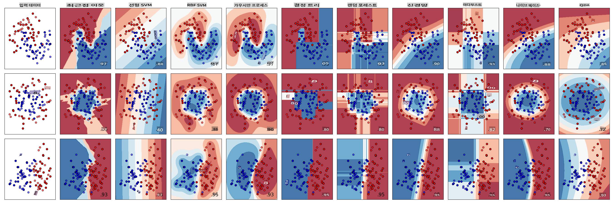
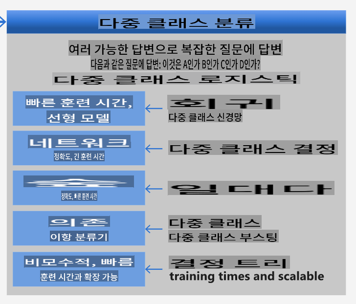

<!--
CO_OP_TRANSLATOR_METADATA:
{
  "original_hash": "9579f42e3ff5114c58379cc9e186a828",
  "translation_date": "2025-09-03T23:51:03+00:00",
  "source_file": "4-Classification/2-Classifiers-1/README.md",
  "language_code": "ko"
}
-->
# 요리 분류기 1

이 강의에서는 이전 강의에서 저장한 균형 잡히고 깨끗한 요리 데이터셋을 사용하게 됩니다.

이 데이터셋을 다양한 분류기와 함께 사용하여 _재료 그룹을 기반으로 특정 국가의 요리를 예측_합니다. 이를 통해 분류 작업에 알고리즘을 활용하는 방법에 대해 더 깊이 배우게 될 것입니다.

## [강의 전 퀴즈](https://gray-sand-07a10f403.1.azurestaticapps.net/quiz/21/)
# 준비

[Lesson 1](../1-Introduction/README.md)을 완료했다고 가정하고, _cleaned_cuisines.csv_ 파일이 이 네 개의 강의를 위해 루트 `/data` 폴더에 존재하는지 확인하세요.

## 연습 - 국가별 요리 예측하기

1. 이번 강의의 _notebook.ipynb_ 폴더에서 Pandas 라이브러리와 함께 해당 파일을 가져옵니다:

    ```python
    import pandas as pd
    cuisines_df = pd.read_csv("../data/cleaned_cuisines.csv")
    cuisines_df.head()
    ```

    데이터는 다음과 같이 보입니다:

|     | Unnamed: 0 | cuisine | almond | angelica | anise | anise_seed | apple | apple_brandy | apricot | armagnac | ... | whiskey | white_bread | white_wine | whole_grain_wheat_flour | wine | wood | yam | yeast | yogurt | zucchini |
| --- | ---------- | ------- | ------ | -------- | ----- | ---------- | ----- | ------------ | ------- | -------- | --- | ------- | ----------- | ---------- | ----------------------- | ---- | ---- | --- | ----- | ------ | -------- |
| 0   | 0          | indian  | 0      | 0        | 0     | 0          | 0     | 0            | 0       | 0        | ... | 0       | 0           | 0          | 0                       | 0    | 0    | 0   | 0     | 0      | 0        |
| 1   | 1          | indian  | 1      | 0        | 0     | 0          | 0     | 0            | 0       | 0        | ... | 0       | 0           | 0          | 0                       | 0    | 0    | 0   | 0     | 0      | 0        |
| 2   | 2          | indian  | 0      | 0        | 0     | 0          | 0     | 0            | 0       | 0        | ... | 0       | 0           | 0          | 0                       | 0    | 0    | 0   | 0     | 0      | 0        |
| 3   | 3          | indian  | 0      | 0        | 0     | 0          | 0     | 0            | 0       | 0        | ... | 0       | 0           | 0          | 0                       | 0    | 0    | 0   | 0     | 0      | 0        |
| 4   | 4          | indian  | 0      | 0        | 0     | 0          | 0     | 0            | 0       | 0        | ... | 0       | 0           | 0          | 0                       | 0    | 0    | 0   | 0     | 1      | 0        |
  

1. 이제 몇 가지 추가 라이브러리를 가져옵니다:

    ```python
    from sklearn.linear_model import LogisticRegression
    from sklearn.model_selection import train_test_split, cross_val_score
    from sklearn.metrics import accuracy_score,precision_score,confusion_matrix,classification_report, precision_recall_curve
    from sklearn.svm import SVC
    import numpy as np
    ```

1. X와 y 좌표를 두 개의 데이터프레임으로 나누어 훈련합니다. `cuisine`은 레이블 데이터프레임이 될 수 있습니다:

    ```python
    cuisines_label_df = cuisines_df['cuisine']
    cuisines_label_df.head()
    ```

    데이터는 다음과 같이 보일 것입니다:

    ```output
    0    indian
    1    indian
    2    indian
    3    indian
    4    indian
    Name: cuisine, dtype: object
    ```

1. `Unnamed: 0` 열과 `cuisine` 열을 `drop()`을 사용하여 제거합니다. 나머지 데이터를 훈련 가능한 특징으로 저장하세요:

    ```python
    cuisines_feature_df = cuisines_df.drop(['Unnamed: 0', 'cuisine'], axis=1)
    cuisines_feature_df.head()
    ```

    특징 데이터는 다음과 같이 보일 것입니다:

|      | almond | angelica | anise | anise_seed | apple | apple_brandy | apricot | armagnac | artemisia | artichoke |  ... | whiskey | white_bread | white_wine | whole_grain_wheat_flour | wine | wood |  yam | yeast | yogurt | zucchini |
| ---: | -----: | -------: | ----: | ---------: | ----: | -----------: | ------: | -------: | --------: | --------: | ---: | ------: | ----------: | ---------: | ----------------------: | ---: | ---: | ---: | ----: | -----: | -------: |
|    0 |      0 |        0 |     0 |          0 |     0 |            0 |       0 |        0 |         0 |         0 |  ... |       0 |           0 |          0 |                       0 |    0 |    0 |    0 |     0 |      0 |        0 | 0 |
|    1 |      1 |        0 |     0 |          0 |     0 |            0 |       0 |        0 |         0 |         0 |  ... |       0 |           0 |          0 |                       0 |    0 |    0 |    0 |     0 |      0 |        0 | 0 |
|    2 |      0 |        0 |     0 |          0 |     0 |            0 |       0 |        0 |         0 |         0 |  ... |       0 |           0 |          0 |                       0 |    0 |    0 |    0 |     0 |      0 |        0 | 0 |
|    3 |      0 |        0 |     0 |          0 |     0 |            0 |       0 |        0 |         0 |         0 |  ... |       0 |           0 |          0 |                       0 |    0 |    0 |    0 |     0 |      0 |        0 | 0 |
|    4 |      0 |        0 |     0 |          0 |     0 |            0 |       0 |        0 |         0 |         0 |  ... |       0 |           0 |          0 |                       0 |    0 |    0 |    0 |     0 |      1 |        0 | 0 |

이제 모델을 훈련할 준비가 되었습니다!

## 분류기 선택하기

데이터가 깨끗하고 훈련 준비가 되었으니, 어떤 알고리즘을 사용할지 결정해야 합니다.

Scikit-learn은 분류를 지도 학습(Supervised Learning)으로 분류하며, 이 범주에서 다양한 분류 방법을 제공합니다. [다양한 방법](https://scikit-learn.org/stable/supervised_learning.html)은 처음 보면 꽤 혼란스러울 수 있습니다. 다음 방법들은 모두 분류 기술을 포함합니다:

- 선형 모델(Linear Models)
- 서포트 벡터 머신(Support Vector Machines)
- 확률적 경사 하강법(Stochastic Gradient Descent)
- 최근접 이웃(Nearest Neighbors)
- 가우시안 프로세스(Gaussian Processes)
- 결정 트리(Decision Trees)
- 앙상블 방법(Ensemble methods, 투표 분류기 포함)
- 다중 클래스 및 다중 출력 알고리즘(다중 클래스 및 다중 레이블 분류, 다중 클래스-다중 출력 분류)

> [신경망을 사용하여 데이터를 분류](https://scikit-learn.org/stable/modules/neural_networks_supervised.html#classification)할 수도 있지만, 이는 이번 강의의 범위를 벗어납니다.

### 어떤 분류기를 선택할까?

그렇다면 어떤 분류기를 선택해야 할까요? 종종 여러 분류기를 실행해보고 좋은 결과를 찾는 것이 테스트 방법이 될 수 있습니다. Scikit-learn은 KNeighbors, SVC 두 가지 방식, GaussianProcessClassifier, DecisionTreeClassifier, RandomForestClassifier, MLPClassifier, AdaBoostClassifier, GaussianNB 및 QuadraticDiscriminationAnalysis를 비교한 [비교 자료](https://scikit-learn.org/stable/auto_examples/classification/plot_classifier_comparison.html)를 제공합니다. 결과는 시각화되어 있습니다:


> Scikit-learn 문서에서 생성된 플롯

> AutoML은 클라우드에서 이러한 비교를 실행하여 데이터에 가장 적합한 알고리즘을 선택할 수 있도록 문제를 깔끔하게 해결합니다. [여기](https://docs.microsoft.com/learn/modules/automate-model-selection-with-azure-automl/?WT.mc_id=academic-77952-leestott)에서 시도해보세요.

### 더 나은 접근법

무작위로 추측하는 것보다 더 나은 방법은 이 다운로드 가능한 [ML Cheat Sheet](https://docs.microsoft.com/azure/machine-learning/algorithm-cheat-sheet?WT.mc_id=academic-77952-leestott)를 따르는 것입니다. 여기에서 다중 클래스 문제에 대해 몇 가지 선택지가 있음을 알 수 있습니다:


> Microsoft의 알고리즘 치트 시트의 일부로, 다중 클래스 분류 옵션을 설명합니다.

✅ 이 치트 시트를 다운로드하여 출력하고 벽에 걸어두세요!

### 추론

제약 조건을 고려하여 다양한 접근 방식을 추론해 봅시다:

- **신경망은 너무 무겁다**. 깨끗하지만 최소한의 데이터셋과 로컬 노트북을 통해 훈련을 실행한다는 점을 고려할 때, 신경망은 이 작업에 너무 무겁습니다.
- **이진 분류기는 사용하지 않는다**. 이진 분류기를 사용하지 않으므로 one-vs-all은 제외됩니다.
- **결정 트리 또는 로지스틱 회귀가 적합할 수 있다**. 결정 트리가 적합할 수 있으며, 다중 클래스 데이터에 대해 로지스틱 회귀도 적합할 수 있습니다.
- **다중 클래스 부스팅 결정 트리는 다른 문제를 해결한다**. 다중 클래스 부스팅 결정 트리는 비모수적 작업, 예를 들어 순위를 생성하는 작업에 가장 적합하므로 우리에게는 적합하지 않습니다.

### Scikit-learn 사용하기

우리는 Scikit-learn을 사용하여 데이터를 분석할 것입니다. 그러나 Scikit-learn에서 로지스틱 회귀를 사용하는 방법은 여러 가지가 있습니다. 전달해야 할 [매개변수](https://scikit-learn.org/stable/modules/generated/sklearn.linear_model.LogisticRegression.html?highlight=logistic%20regressio#sklearn.linear_model.LogisticRegression)를 확인하세요.

본질적으로 두 가지 중요한 매개변수 - `multi_class`와 `solver` - 를 지정해야 합니다. Scikit-learn에 로지스틱 회귀를 수행하도록 요청할 때 이 두 가지가 필요합니다. `multi_class` 값은 특정 동작을 적용합니다. solver 값은 사용할 알고리즘을 나타냅니다. 모든 solver가 모든 `multi_class` 값과 함께 사용할 수 있는 것은 아닙니다.

문서에 따르면, 다중 클래스의 경우 훈련 알고리즘은:

- **one-vs-rest (OvR) 방식**을 사용합니다. `multi_class` 옵션이 `ovr`로 설정된 경우
- **교차 엔트로피 손실**을 사용합니다. `multi_class` 옵션이 `multinomial`로 설정된 경우 (`multinomial` 옵션은 현재 ‘lbfgs’, ‘sag’, ‘saga’, ‘newton-cg’ solver에서만 지원됩니다).

> 🎓 여기서 '방식'은 'ovr'(one-vs-rest) 또는 'multinomial'일 수 있습니다. 로지스틱 회귀는 본래 이진 분류를 지원하도록 설계되었기 때문에, 이러한 방식은 다중 클래스 분류 작업을 더 잘 처리할 수 있도록 합니다. [출처](https://machinelearningmastery.com/one-vs-rest-and-one-vs-one-for-multi-class-classification/)

> 🎓 'solver'는 "최적화 문제에서 사용할 알고리즘"으로 정의됩니다. [출처](https://scikit-learn.org/stable/modules/generated/sklearn.linear_model.LogisticRegression.html?highlight=logistic%20regressio#sklearn.linear_model.LogisticRegression).

Scikit-learn은 solver가 다양한 데이터 구조에서 발생하는 문제를 어떻게 처리하는지 설명하는 다음 표를 제공합니다:


## 연습 - 데이터 나누기

이전 강의에서 배운 로지스틱 회귀를 첫 번째 훈련 시도로 사용할 수 있습니다.
`train_test_split()`을 호출하여 데이터를 훈련 및 테스트 그룹으로 나누세요:

```python
X_train, X_test, y_train, y_test = train_test_split(cuisines_feature_df, cuisines_label_df, test_size=0.3)
```

## 연습 - 로지스틱 회귀 적용하기

다중 클래스 사례를 사용하고 있으므로 어떤 _방식_을 사용할지와 어떤 _solver_를 설정할지 선택해야 합니다. 다중 클래스 설정과 **liblinear** solver를 사용하여 LogisticRegression을 훈련하세요.

1. `multi_class`를 `ovr`로 설정하고 solver를 `liblinear`로 설정하여 로지스틱 회귀를 생성하세요:

    ```python
    lr = LogisticRegression(multi_class='ovr',solver='liblinear')
    model = lr.fit(X_train, np.ravel(y_train))
    
    accuracy = model.score(X_test, y_test)
    print ("Accuracy is {}".format(accuracy))
    ```

    ✅ 기본값으로 자주 설정되는 `lbfgs`와 같은 다른 solver를 시도해보세요.
> 참고로, 데이터가 필요할 때 Pandas [`ravel`](https://pandas.pydata.org/pandas-docs/stable/reference/api/pandas.Series.ravel.html) 함수를 사용하여 데이터를 평탄화하세요.
정확도가 **80%** 이상으로 좋습니다!

1. 데이터의 한 행(#50)을 테스트하여 이 모델의 작동을 확인할 수 있습니다:

    ```python
    print(f'ingredients: {X_test.iloc[50][X_test.iloc[50]!=0].keys()}')
    print(f'cuisine: {y_test.iloc[50]}')
    ```

    결과가 출력됩니다:

   ```output
   ingredients: Index(['cilantro', 'onion', 'pea', 'potato', 'tomato', 'vegetable_oil'], dtype='object')
   cuisine: indian
   ```

   ✅ 다른 행 번호를 시도하고 결과를 확인해 보세요.

1. 더 깊이 탐구하여 이 예측의 정확도를 확인할 수 있습니다:

    ```python
    test= X_test.iloc[50].values.reshape(-1, 1).T
    proba = model.predict_proba(test)
    classes = model.classes_
    resultdf = pd.DataFrame(data=proba, columns=classes)
    
    topPrediction = resultdf.T.sort_values(by=[0], ascending = [False])
    topPrediction.head()
    ```

    결과가 출력됩니다 - 인도 요리가 가장 높은 확률로 예측되었습니다:

    |          |        0 |
    | -------: | -------: |
    |   indian | 0.715851 |
    |  chinese | 0.229475 |
    | japanese | 0.029763 |
    |   korean | 0.017277 |
    |     thai | 0.007634 |

    ✅ 모델이 왜 이 요리가 인도 요리라고 확신하는지 설명할 수 있나요?

1. 회귀 수업에서 했던 것처럼 분류 보고서를 출력하여 더 많은 세부 정보를 확인하세요:

    ```python
    y_pred = model.predict(X_test)
    print(classification_report(y_test,y_pred))
    ```

    |              | precision | recall | f1-score | support |
    | ------------ | --------- | ------ | -------- | ------- |
    | chinese      | 0.73      | 0.71   | 0.72     | 229     |
    | indian       | 0.91      | 0.93   | 0.92     | 254     |
    | japanese     | 0.70      | 0.75   | 0.72     | 220     |
    | korean       | 0.86      | 0.76   | 0.81     | 242     |
    | thai         | 0.79      | 0.85   | 0.82     | 254     |
    | accuracy     | 0.80      | 1199   |          |         |
    | macro avg    | 0.80      | 0.80   | 0.80     | 1199    |
    | weighted avg | 0.80      | 0.80   | 0.80     | 1199    |

## 🚀도전 과제

이번 수업에서는 정리된 데이터를 사용하여 재료 목록을 기반으로 국가별 요리를 예측하는 머신 러닝 모델을 구축했습니다. Scikit-learn이 제공하는 다양한 데이터 분류 옵션을 읽어보며 시간을 가져보세요. 'solver' 개념을 더 깊이 탐구하여 내부적으로 어떤 일이 일어나는지 이해해 보세요.

## [강의 후 퀴즈](https://gray-sand-07a10f403.1.azurestaticapps.net/quiz/22/)

## 복습 및 자기 학습

[이 강의](https://people.eecs.berkeley.edu/~russell/classes/cs194/f11/lectures/CS194%20Fall%202011%20Lecture%2006.pdf)에서 로지스틱 회귀의 수학적 배경을 조금 더 깊이 탐구해 보세요.
## 과제 

[solver에 대해 공부하기](assignment.md)

---

**면책 조항**:  
이 문서는 AI 번역 서비스 [Co-op Translator](https://github.com/Azure/co-op-translator)를 사용하여 번역되었습니다. 정확성을 위해 최선을 다하고 있으나, 자동 번역에는 오류나 부정확성이 포함될 수 있습니다. 원본 문서를 해당 언어로 작성된 상태에서 권위 있는 자료로 간주해야 합니다. 중요한 정보의 경우, 전문적인 인간 번역을 권장합니다. 이 번역 사용으로 인해 발생하는 오해나 잘못된 해석에 대해 당사는 책임을 지지 않습니다.  