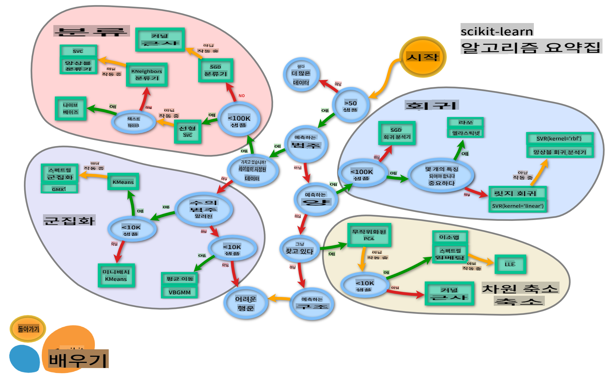

<!--
CO_OP_TRANSLATOR_METADATA:
{
  "original_hash": "808a71076f76ae8f5458862a8edd9215",
  "translation_date": "2025-09-03T23:58:30+00:00",
  "source_file": "4-Classification/3-Classifiers-2/README.md",
  "language_code": "ko"
}
-->
# 요리 분류기 2

이 두 번째 분류 수업에서는 숫자 데이터를 분류하는 더 많은 방법을 탐구합니다. 또한, 특정 분류기를 선택했을 때의 결과에 대해 배우게 됩니다.

## [강의 전 퀴즈](https://gray-sand-07a10f403.1.azurestaticapps.net/quiz/23/)

### 사전 요구사항

이전 수업을 완료하고, 이 4개 수업 폴더의 루트에 있는 `data` 폴더에 _cleaned_cuisines.csv_라는 정리된 데이터셋이 있다고 가정합니다.

### 준비

정리된 데이터셋을 _notebook.ipynb_ 파일에 로드하고, 이를 X와 y 데이터프레임으로 나누어 모델 구축 프로세스를 준비했습니다.

## 분류 지도

이전에 Microsoft의 치트 시트를 사용하여 데이터를 분류하는 다양한 옵션에 대해 배웠습니다. Scikit-learn은 이와 유사하지만 더 세부적인 치트 시트를 제공하여 추정기(분류기의 또 다른 용어)를 좁히는 데 도움을 줄 수 있습니다:


> 팁: [온라인에서 이 지도를 방문](https://scikit-learn.org/stable/tutorial/machine_learning_map/)하여 경로를 따라가며 문서를 읽어보세요.

### 계획

이 지도는 데이터를 명확히 이해한 후 경로를 따라가며 결정을 내리는 데 매우 유용합니다:

- 샘플이 50개 이상입니다.
- 카테고리를 예측하고 싶습니다.
- 라벨이 있는 데이터가 있습니다.
- 샘플이 100K 미만입니다.
- ✨ Linear SVC를 선택할 수 있습니다.
- 이것이 작동하지 않으면, 숫자 데이터가 있으므로
    - ✨ KNeighbors Classifier를 시도할 수 있습니다.
      - 이것이 작동하지 않으면 ✨ SVC와 ✨ Ensemble Classifiers를 시도할 수 있습니다.

이 경로를 따라가는 것은 매우 유용합니다.

## 연습 - 데이터 나누기

이 경로를 따라가며 필요한 라이브러리를 가져오는 것으로 시작해야 합니다.

1. 필요한 라이브러리를 가져오세요:

    ```python
    from sklearn.neighbors import KNeighborsClassifier
    from sklearn.linear_model import LogisticRegression
    from sklearn.svm import SVC
    from sklearn.ensemble import RandomForestClassifier, AdaBoostClassifier
    from sklearn.model_selection import train_test_split, cross_val_score
    from sklearn.metrics import accuracy_score,precision_score,confusion_matrix,classification_report, precision_recall_curve
    import numpy as np
    ```

1. 훈련 데이터와 테스트 데이터를 나누세요:

    ```python
    X_train, X_test, y_train, y_test = train_test_split(cuisines_feature_df, cuisines_label_df, test_size=0.3)
    ```

## Linear SVC 분류기

Support-Vector Clustering(SVC)는 Support-Vector Machines(SVM) ML 기술의 하위 기술입니다(아래에서 더 알아보세요). 이 방법에서는 라벨을 클러스터링하는 방법을 결정하기 위해 '커널'을 선택할 수 있습니다. 'C' 매개변수는 '정규화'를 의미하며 매개변수의 영향을 조정합니다. 커널은 [여러 가지](https://scikit-learn.org/stable/modules/generated/sklearn.svm.SVC.html#sklearn.svm.SVC) 중 하나를 선택할 수 있습니다. 여기서는 'linear'로 설정하여 Linear SVC를 활용합니다. 확률은 기본적으로 'false'로 설정되며, 여기서는 확률 추정을 수집하기 위해 'true'로 설정합니다. 데이터를 섞어 확률을 얻기 위해 랜덤 상태를 '0'으로 설정합니다.

### 연습 - Linear SVC 적용하기

분류기 배열을 생성하는 것으로 시작하세요. 테스트하면서 이 배열에 점진적으로 추가할 것입니다.

1. Linear SVC로 시작하세요:

    ```python
    C = 10
    # Create different classifiers.
    classifiers = {
        'Linear SVC': SVC(kernel='linear', C=C, probability=True,random_state=0)
    }
    ```

2. Linear SVC를 사용하여 모델을 훈련하고 보고서를 출력하세요:

    ```python
    n_classifiers = len(classifiers)
    
    for index, (name, classifier) in enumerate(classifiers.items()):
        classifier.fit(X_train, np.ravel(y_train))
    
        y_pred = classifier.predict(X_test)
        accuracy = accuracy_score(y_test, y_pred)
        print("Accuracy (train) for %s: %0.1f%% " % (name, accuracy * 100))
        print(classification_report(y_test,y_pred))
    ```

    결과는 꽤 좋습니다:

    ```output
    Accuracy (train) for Linear SVC: 78.6% 
                  precision    recall  f1-score   support
    
         chinese       0.71      0.67      0.69       242
          indian       0.88      0.86      0.87       234
        japanese       0.79      0.74      0.76       254
          korean       0.85      0.81      0.83       242
            thai       0.71      0.86      0.78       227
    
        accuracy                           0.79      1199
       macro avg       0.79      0.79      0.79      1199
    weighted avg       0.79      0.79      0.79      1199
    ```

## K-Neighbors 분류기

K-Neighbors는 ML 방법의 "이웃" 계열에 속하며, 지도 학습과 비지도 학습 모두에 사용할 수 있습니다. 이 방법에서는 미리 정의된 수의 포인트를 생성하고 데이터를 이러한 포인트 주변에 모아 일반화된 라벨을 예측할 수 있습니다.

### 연습 - K-Neighbors 분류기 적용하기

이전 분류기는 좋았고 데이터와 잘 작동했지만, 더 나은 정확도를 얻을 수 있을지도 모릅니다. K-Neighbors 분류기를 시도해보세요.

1. 분류기 배열에 한 줄을 추가하세요(Linear SVC 항목 뒤에 쉼표를 추가하세요):

    ```python
    'KNN classifier': KNeighborsClassifier(C),
    ```

    결과는 조금 더 나쁩니다:

    ```output
    Accuracy (train) for KNN classifier: 73.8% 
                  precision    recall  f1-score   support
    
         chinese       0.64      0.67      0.66       242
          indian       0.86      0.78      0.82       234
        japanese       0.66      0.83      0.74       254
          korean       0.94      0.58      0.72       242
            thai       0.71      0.82      0.76       227
    
        accuracy                           0.74      1199
       macro avg       0.76      0.74      0.74      1199
    weighted avg       0.76      0.74      0.74      1199
    ```

    ✅ [K-Neighbors](https://scikit-learn.org/stable/modules/neighbors.html#neighbors)에 대해 알아보세요.

## Support Vector 분류기

Support-Vector 분류기는 [Support-Vector Machine](https://wikipedia.org/wiki/Support-vector_machine) 계열의 ML 방법에 속하며, 분류 및 회귀 작업에 사용됩니다. SVM은 "훈련 예제를 공간의 포인트로 매핑"하여 두 카테고리 간의 거리를 최대화합니다. 이후 데이터는 이 공간에 매핑되어 카테고리를 예측할 수 있습니다.

### 연습 - Support Vector 분류기 적용하기

Support Vector 분류기를 사용하여 더 나은 정확도를 시도해보세요.

1. K-Neighbors 항목 뒤에 쉼표를 추가한 후 다음 줄을 추가하세요:

    ```python
    'SVC': SVC(),
    ```

    결과는 꽤 좋습니다!

    ```output
    Accuracy (train) for SVC: 83.2% 
                  precision    recall  f1-score   support
    
         chinese       0.79      0.74      0.76       242
          indian       0.88      0.90      0.89       234
        japanese       0.87      0.81      0.84       254
          korean       0.91      0.82      0.86       242
            thai       0.74      0.90      0.81       227
    
        accuracy                           0.83      1199
       macro avg       0.84      0.83      0.83      1199
    weighted avg       0.84      0.83      0.83      1199
    ```

    ✅ [Support-Vectors](https://scikit-learn.org/stable/modules/svm.html#svm)에 대해 알아보세요.

## Ensemble 분류기

이전 테스트가 꽤 좋았지만, 경로를 끝까지 따라가 봅시다. Random Forest와 AdaBoost라는 'Ensemble Classifiers'를 시도해보세요:

```python
  'RFST': RandomForestClassifier(n_estimators=100),
  'ADA': AdaBoostClassifier(n_estimators=100)
```

결과는 매우 좋습니다, 특히 Random Forest가:

```output
Accuracy (train) for RFST: 84.5% 
              precision    recall  f1-score   support

     chinese       0.80      0.77      0.78       242
      indian       0.89      0.92      0.90       234
    japanese       0.86      0.84      0.85       254
      korean       0.88      0.83      0.85       242
        thai       0.80      0.87      0.83       227

    accuracy                           0.84      1199
   macro avg       0.85      0.85      0.84      1199
weighted avg       0.85      0.84      0.84      1199

Accuracy (train) for ADA: 72.4% 
              precision    recall  f1-score   support

     chinese       0.64      0.49      0.56       242
      indian       0.91      0.83      0.87       234
    japanese       0.68      0.69      0.69       254
      korean       0.73      0.79      0.76       242
        thai       0.67      0.83      0.74       227

    accuracy                           0.72      1199
   macro avg       0.73      0.73      0.72      1199
weighted avg       0.73      0.72      0.72      1199
```

✅ [Ensemble Classifiers](https://scikit-learn.org/stable/modules/ensemble.html)에 대해 알아보세요.

이 ML 방법은 "여러 기본 추정기의 예측을 결합"하여 모델의 품질을 향상시킵니다. 우리의 예제에서는 Random Trees와 AdaBoost를 사용했습니다.

- [Random Forest](https://scikit-learn.org/stable/modules/ensemble.html#forest)는 평균화 방법으로, '결정 트리'의 '숲'을 생성하며 과적합을 방지하기 위해 무작위성을 추가합니다. n_estimators 매개변수는 트리의 수를 설정합니다.

- [AdaBoost](https://scikit-learn.org/stable/modules/generated/sklearn.ensemble.AdaBoostClassifier.html)는 데이터셋에 분류기를 맞추고, 동일한 데이터셋에 그 분류기의 복사본을 맞춥니다. 잘못 분류된 항목의 가중치에 초점을 맞추고, 다음 분류기의 적합성을 조정하여 수정합니다.

---

## 🚀도전 과제

이 기술들 각각은 조정할 수 있는 많은 매개변수를 가지고 있습니다. 각 기술의 기본 매개변수를 조사하고, 이러한 매개변수를 조정하면 모델 품질에 어떤 영향을 미칠지 생각해보세요.

## [강의 후 퀴즈](https://gray-sand-07a10f403.1.azurestaticapps.net/quiz/24/)

## 복습 및 자기 학습

이 수업에는 많은 전문 용어가 포함되어 있으니, [이 용어 목록](https://docs.microsoft.com/dotnet/machine-learning/resources/glossary?WT.mc_id=academic-77952-leestott)을 검토하며 시간을 가져보세요!

## 과제 

[매개변수 조정](assignment.md)

---

**면책 조항**:  
이 문서는 AI 번역 서비스 [Co-op Translator](https://github.com/Azure/co-op-translator)를 사용하여 번역되었습니다. 정확성을 위해 최선을 다하고 있으나, 자동 번역에는 오류나 부정확성이 포함될 수 있습니다. 원본 문서를 해당 언어로 작성된 상태에서 권위 있는 자료로 간주해야 합니다. 중요한 정보의 경우, 전문적인 인간 번역을 권장합니다. 이 번역 사용으로 인해 발생하는 오해나 잘못된 해석에 대해 당사는 책임을 지지 않습니다.  