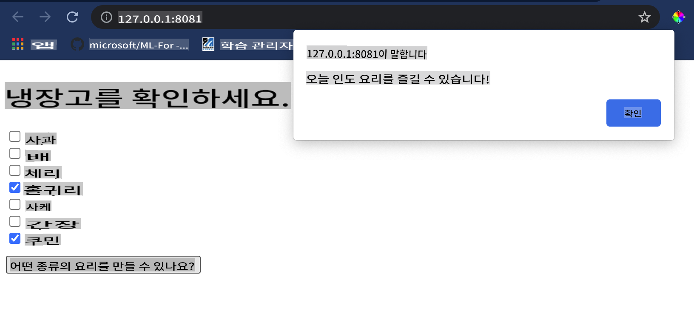

# 음식 추천 웹 앱 만들기

이 강의에서는 이전 강의에서 배운 몇 가지 기술과 이 시리즈에서 사용된 맛있는 음식 데이터셋을 활용하여 분류 모델을 구축할 것입니다. 또한, 저장된 모델을 사용하기 위해 Onnx의 웹 런타임을 활용한 작은 웹 앱을 만들 것입니다.

머신 러닝의 가장 유용한 실제 활용 중 하나는 추천 시스템을 구축하는 것입니다. 오늘 그 방향으로 첫 걸음을 내딛을 수 있습니다!

[](https://youtu.be/17wdM9AHMfg "Applied ML")

> 🎥 위 이미지를 클릭하면 비디오를 볼 수 있습니다: Jen Looper가 분류된 음식 데이터를 사용하여 웹 앱을 구축합니다

## [강의 전 퀴즈](https://gray-sand-07a10f403.1.azurestaticapps.net/quiz/25/)

이 강의에서 배울 내용:

- 모델을 구축하고 Onnx 모델로 저장하는 방법
- Netron을 사용하여 모델을 검사하는 방법
- 웹 앱에서 추론을 위해 모델을 사용하는 방법

## 모델 구축하기

적용된 ML 시스템을 구축하는 것은 비즈니스 시스템에서 이러한 기술을 활용하는 중요한 부분입니다. Onnx를 사용하여 웹 애플리케이션 내에서 모델을 사용할 수 있으며, 필요할 경우 오프라인에서도 사용할 수 있습니다.

[이전 강의](../../3-Web-App/1-Web-App/README.md)에서 UFO 목격에 관한 회귀 모델을 만들고, 이를 "피클"하여 Flask 앱에서 사용했습니다. 이 아키텍처는 매우 유용하지만, 풀스택 파이썬 앱이며, JavaScript 애플리케이션을 사용해야 할 수도 있습니다.

이 강의에서는 추론을 위한 기본 JavaScript 기반 시스템을 구축할 수 있습니다. 그러나 먼저 모델을 훈련하고 Onnx로 변환해야 합니다.

## 실습 - 분류 모델 훈련

먼저, 우리가 사용한 정제된 음식 데이터셋을 사용하여 분류 모델을 훈련합니다.

1. 유용한 라이브러리 가져오기:

    ```python
    !pip install skl2onnx
    import pandas as pd 
    ```

    Scikit-learn 모델을 Onnx 형식으로 변환하는 데 도움이 되는 '[skl2onnx](https://onnx.ai/sklearn-onnx/)'가 필요합니다.

1. 이전 강의에서 했던 것처럼 `read_csv()`를 사용하여 CSV 파일을 읽어 데이터를 처리합니다:

    ```python
    data = pd.read_csv('../data/cleaned_cuisines.csv')
    data.head()
    ```

1. 첫 두 개의 불필요한 열을 제거하고 나머지 데이터를 'X'로 저장합니다:

    ```python
    X = data.iloc[:,2:]
    X.head()
    ```

1. 라벨을 'y'로 저장합니다:

    ```python
    y = data[['cuisine']]
    y.head()
    
    ```

### 훈련 루틴 시작

우리는 정확도가 좋은 'SVC' 라이브러리를 사용할 것입니다.

1. Scikit-learn에서 적절한 라이브러리를 가져옵니다:

    ```python
    from sklearn.model_selection import train_test_split
    from sklearn.svm import SVC
    from sklearn.model_selection import cross_val_score
    from sklearn.metrics import accuracy_score,precision_score,confusion_matrix,classification_report
    ```

1. 훈련 세트와 테스트 세트를 분리합니다:

    ```python
    X_train, X_test, y_train, y_test = train_test_split(X,y,test_size=0.3)
    ```

1. 이전 강의에서 했던 것처럼 SVC 분류 모델을 구축합니다:

    ```python
    model = SVC(kernel='linear', C=10, probability=True,random_state=0)
    model.fit(X_train,y_train.values.ravel())
    ```

1. 이제 `predict()`를 호출하여 모델을 테스트합니다:

    ```python
    y_pred = model.predict(X_test)
    ```

1. 모델의 품질을 확인하기 위해 분류 보고서를 출력합니다:

    ```python
    print(classification_report(y_test,y_pred))
    ```

    이전에 봤던 것처럼 정확도가 좋습니다:

    ```output
                    precision    recall  f1-score   support
    
         chinese       0.72      0.69      0.70       257
          indian       0.91      0.87      0.89       243
        japanese       0.79      0.77      0.78       239
          korean       0.83      0.79      0.81       236
            thai       0.72      0.84      0.78       224
    
        accuracy                           0.79      1199
       macro avg       0.79      0.79      0.79      1199
    weighted avg       0.79      0.79      0.79      1199
    ```

### 모델을 Onnx로 변환하기

올바른 텐서 수를 사용하여 변환을 수행해야 합니다. 이 데이터셋에는 380개의 재료가 나열되어 있으므로 `FloatTensorType`에 그 숫자를 표기해야 합니다:

1. 380의 텐서 숫자를 사용하여 변환합니다.

    ```python
    from skl2onnx import convert_sklearn
    from skl2onnx.common.data_types import FloatTensorType
    
    initial_type = [('float_input', FloatTensorType([None, 380]))]
    options = {id(model): {'nocl': True, 'zipmap': False}}
    ```

1. onx를 생성하고 **model.onnx** 파일로 저장합니다:

    ```python
    onx = convert_sklearn(model, initial_types=initial_type, options=options)
    with open("./model.onnx", "wb") as f:
        f.write(onx.SerializeToString())
    ```

    > 참고로, 변환 스크립트에서 [옵션](https://onnx.ai/sklearn-onnx/parameterized.html)을 전달할 수 있습니다. 이 경우 'nocl'을 True로 설정하고 'zipmap'을 False로 설정했습니다. 이것은 분류 모델이므로 ZipMap을 제거할 옵션이 있습니다. ZipMap은 필요 없는 딕셔너리 목록을 생성합니다. `nocl` refers to class information being included in the model. Reduce your model's size by setting `nocl` to 'True'. 

Running the entire notebook will now build an Onnx model and save it to this folder.

## View your model

Onnx models are not very visible in Visual Studio code, but there's a very good free software that many researchers use to visualize the model to ensure that it is properly built. Download [Netron](https://github.com/lutzroeder/Netron) and  open your model.onnx file. You can see your simple model visualized, with its 380 inputs and classifier listed:


Netron is a helpful tool to view your models.

Now you are ready to use this neat model in a web app. Let's build an app that will come in handy when you look in your refrigerator and try to figure out which combination of your leftover ingredients you can use to cook a given cuisine, as determined by your model.

## Build a recommender web application

You can use your model directly in a web app. This architecture also allows you to run it locally and even offline if needed. Start by creating an `index.html` file in the same folder where you stored your `model.onnx` 파일입니다.

1. 이 파일 _index.html_에 다음 마크업을 추가합니다:

    ```html
    <!DOCTYPE html>
    <html>
        <header>
            <title>Cuisine Matcher</title>
        </header>
        <body>
            ...
        </body>
    </html>
    ```

1. 이제 `body` 태그 내에서 몇 가지 재료를 표시하는 체크박스 목록을 보여주는 약간의 마크업을 추가합니다:

    ```html
    <h1>Check your refrigerator. What can you create?</h1>
            <div id="wrapper">
                <div class="boxCont">
                    <input type="checkbox" value="4" class="checkbox">
                    <label>apple</label>
                </div>
            
                <div class="boxCont">
                    <input type="checkbox" value="247" class="checkbox">
                    <label>pear</label>
                </div>
            
                <div class="boxCont">
                    <input type="checkbox" value="77" class="checkbox">
                    <label>cherry</label>
                </div>
    
                <div class="boxCont">
                    <input type="checkbox" value="126" class="checkbox">
                    <label>fenugreek</label>
                </div>
    
                <div class="boxCont">
                    <input type="checkbox" value="302" class="checkbox">
                    <label>sake</label>
                </div>
    
                <div class="boxCont">
                    <input type="checkbox" value="327" class="checkbox">
                    <label>soy sauce</label>
                </div>
    
                <div class="boxCont">
                    <input type="checkbox" value="112" class="checkbox">
                    <label>cumin</label>
                </div>
            </div>
            <div style="padding-top:10px">
                <button onClick="startInference()">What kind of cuisine can you make?</button>
            </div> 
    ```

    각 체크박스에 값이 부여된 것을 확인하세요. 이는 데이터셋에 따라 재료가 있는 인덱스를 반영합니다. 예를 들어, 사과는 이 알파벳 순서 목록에서 다섯 번째 열에 있으므로 값은 '4'입니다. 인덱스는 0부터 시작합니다. 주어진 재료의 인덱스를 확인하려면 [ingredients spreadsheet](../../../../4-Classification/data/ingredient_indexes.csv)를 참조하세요.

    index.html 파일에서 작업을 계속하고, 최종 닫는 `</div>` 뒤에 모델을 호출하는 스크립트 블록을 추가합니다.

1. 먼저 [Onnx Runtime](https://www.onnxruntime.ai/)을 가져옵니다:

    ```html
    <script src="https://cdn.jsdelivr.net/npm/onnxruntime-web@1.9.0/dist/ort.min.js"></script> 
    ```

    > Onnx Runtime은 다양한 하드웨어 플랫폼에서 Onnx 모델을 실행할 수 있도록 최적화와 API를 제공합니다.

1. 런타임이 설정되면 호출할 수 있습니다:

    ```html
    <script>
        const ingredients = Array(380).fill(0);
        
        const checks = [...document.querySelectorAll('.checkbox')];
        
        checks.forEach(check => {
            check.addEventListener('change', function() {
                // toggle the state of the ingredient
                // based on the checkbox's value (1 or 0)
                ingredients[check.value] = check.checked ? 1 : 0;
            });
        });

        function testCheckboxes() {
            // validate if at least one checkbox is checked
            return checks.some(check => check.checked);
        }

        async function startInference() {

            let atLeastOneChecked = testCheckboxes()

            if (!atLeastOneChecked) {
                alert('Please select at least one ingredient.');
                return;
            }
            try {
                // create a new session and load the model.
                
                const session = await ort.InferenceSession.create('./model.onnx');

                const input = new ort.Tensor(new Float32Array(ingredients), [1, 380]);
                const feeds = { float_input: input };

                // feed inputs and run
                const results = await session.run(feeds);

                // read from results
                alert('You can enjoy ' + results.label.data[0] + ' cuisine today!')

            } catch (e) {
                console.log(`failed to inference ONNX model`);
                console.error(e);
            }
        }
               
    </script>
    ```

이 코드에서 여러 가지 일이 발생합니다:

1. 체크박스가 선택되었는지 여부에 따라 모델에 전송할 380개의 가능한 값(1 또는 0) 배열을 생성했습니다.
2. 체크박스 배열과 체크박스가 선택되었는지 여부를 결정하는 방법을 생성했습니다.
3. `init` function that is called when the application starts. When a checkbox is checked, the `ingredients` array is altered to reflect the chosen ingredient.
3. You created a `testCheckboxes` function that checks whether any checkbox was checked.
4. You use `startInference` function when the button is pressed and, if any checkbox is checked, you start inference.
5. The inference routine includes:
   1. Setting up an asynchronous load of the model
   2. Creating a Tensor structure to send to the model
   3. Creating 'feeds' that reflects the `float_input` input that you created when training your model (you can use Netron to verify that name)
   4. Sending these 'feeds' to the model and waiting for a response

## Test your application

Open a terminal session in Visual Studio Code in the folder where your index.html file resides. Ensure that you have [http-server](https://www.npmjs.com/package/http-server) installed globally, and type `http-server` 프롬프트에서 로컬호스트를 열어 웹 앱을 확인할 수 있습니다. 다양한 재료에 따라 추천되는 요리를 확인하세요:



축하합니다! 몇 가지 필드로 구성된 '추천' 웹 앱을 만들었습니다. 이 시스템을 확장하는 데 시간을 투자해 보세요!
## 🚀도전 과제

웹 앱이 매우 미니멀하므로 [ingredient_indexes](../../../../4-Classification/data/ingredient_indexes.csv) 데이터의 재료와 인덱스를 사용하여 계속 확장해 보세요. 어떤 맛 조합이 특정 국가 요리를 만드는 데 도움이 되는지 알아보세요.

## [강의 후 퀴즈](https://gray-sand-07a10f403.1.azurestaticapps.net/quiz/26/)

## 복습 및 자습

이 강의에서는 음식 재료를 위한 추천 시스템을 만드는 유용성에 대해 간단히 다루었지만, 이 ML 응용 분야는 예시가 매우 풍부합니다. 이러한 시스템이 어떻게 구축되는지에 대해 더 읽어보세요:

- https://www.sciencedirect.com/topics/computer-science/recommendation-engine
- https://www.technologyreview.com/2014/08/25/171547/the-ultimate-challenge-for-recommendation-engines/
- https://www.technologyreview.com/2015/03/23/168831/everything-is-a-recommendation/

## 과제

[새로운 추천 시스템 만들기](assignment.md)

**면책 조항**:
이 문서는 기계 기반 AI 번역 서비스를 사용하여 번역되었습니다. 정확성을 위해 노력하고 있지만, 자동 번역에는 오류나 부정확성이 포함될 수 있습니다. 원본 문서가 해당 언어로 작성된 경우 이를 권위 있는 출처로 간주해야 합니다. 중요한 정보에 대해서는 전문적인 인간 번역을 권장합니다. 이 번역을 사용하여 발생하는 오해나 오역에 대해서는 책임을 지지 않습니다.