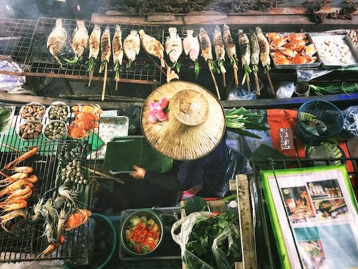

# 분류 시작하기

## 지역 주제: 맛있는 아시아 및 인도 요리 🍜

아시아와 인도에서는 음식 전통이 매우 다양하고 정말 맛있습니다! 그들의 재료를 이해하기 위해 지역 요리에 대한 데이터를 살펴보겠습니다.

> 사진 제공 <a href="https://unsplash.com/@changlisheng?utm_source=unsplash&utm_medium=referral&utm_content=creditCopyText">Lisheng Chang</a> on <a href="https://unsplash.com/s/photos/asian-food?utm_source=unsplash&utm_medium=referral&utm_content=creditCopyText">Unsplash</a>

## 배우게 될 내용

이 섹션에서는 이전에 공부한 회귀 분석을 바탕으로 다른 분류기를 사용하여 데이터를 더 잘 이해하는 방법을 배울 것입니다.

> 분류 모델 작업에 대해 배울 수 있는 유용한 저코드 도구가 있습니다. 이 작업을 위해 [Azure ML](https://docs.microsoft.com/learn/modules/create-classification-model-azure-machine-learning-designer/?WT.mc_id=academic-77952-leestott)을 시도해 보세요.

## 강의

1. [분류 소개](1-Introduction/README.md)
2. [추가 분류기](2-Classifiers-1/README.md)
3. [다른 분류기](3-Classifiers-2/README.md)
4. [적용된 ML: 웹 앱 구축](4-Applied/README.md)

## 저자 정보

"분류 시작하기"는 [Cassie Breviu](https://www.twitter.com/cassiebreviu)와 [Jen Looper](https://www.twitter.com/jenlooper)의 ♥️로 작성되었습니다.

맛있는 요리 데이터셋은 [Kaggle](https://www.kaggle.com/hoandan/asian-and-indian-cuisines)에서 제공되었습니다.

**면책 조항**:
이 문서는 기계 기반 AI 번역 서비스를 사용하여 번역되었습니다. 정확성을 위해 노력하지만, 자동 번역에는 오류나 부정확성이 있을 수 있음을 유의하시기 바랍니다. 원본 문서의 원어 버전이 권위 있는 출처로 간주되어야 합니다. 중요한 정보의 경우, 전문적인 인간 번역을 권장합니다. 이 번역의 사용으로 인해 발생하는 오해나 오역에 대해 당사는 책임을 지지 않습니다.