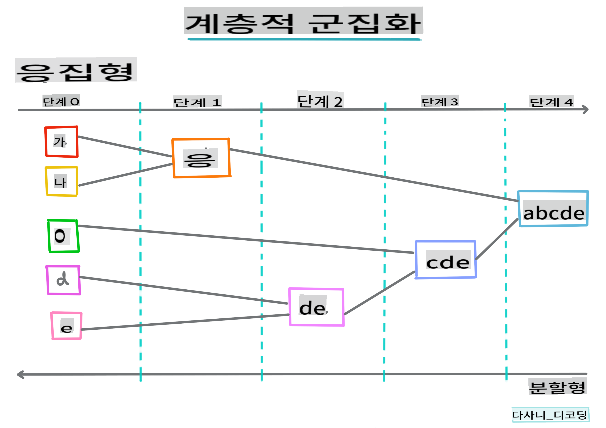
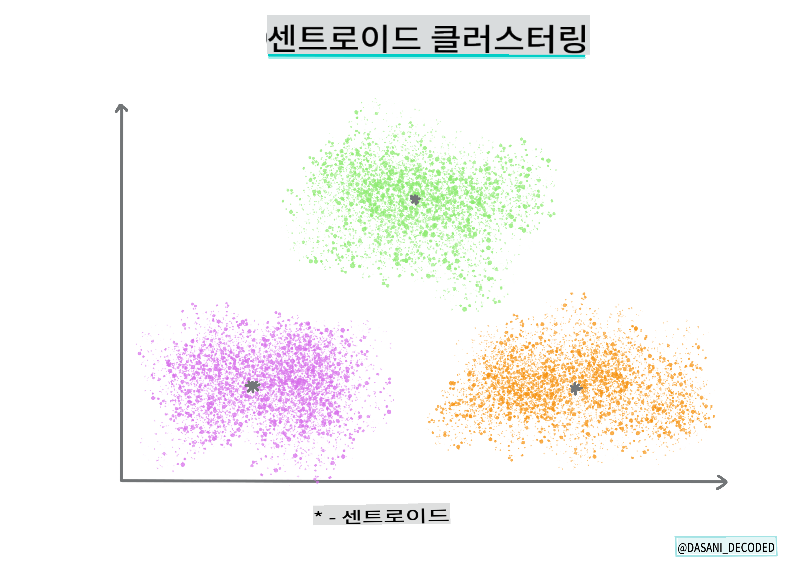

# 클러스터링 소개

클러스터링은 데이터셋이 라벨이 없거나 입력이 사전 정의된 출력과 일치하지 않는다고 가정하는 [비지도 학습](https://wikipedia.org/wiki/Unsupervised_learning)의 한 유형입니다. 다양한 알고리즘을 사용하여 라벨이 없는 데이터를 정리하고 데이터에서 인식된 패턴에 따라 그룹을 제공합니다.

[](https://youtu.be/ty2advRiWJM "No One Like You by PSquare")

> 🎥 위 이미지를 클릭하면 비디오로 이동합니다. 클러스터링을 통해 머신 러닝을 공부하는 동안, 나이지리아 댄스홀 트랙을 즐겨보세요 - 이것은 PSquare의 2014년 고평가된 곡입니다.
## [강의 전 퀴즈](https://gray-sand-07a10f403.1.azurestaticapps.net/quiz/27/)
### 소개

[클러스터링](https://link.springer.com/referenceworkentry/10.1007%2F978-0-387-30164-8_124)은 데이터 탐색에 매우 유용합니다. 나이지리아 관객들이 음악을 소비하는 방식에서 트렌드와 패턴을 발견하는 데 도움이 되는지 알아봅시다.

✅ 클러스터링의 사용에 대해 잠시 생각해보세요. 실제 생활에서 클러스터링은 빨래 더미가 있을 때 가족 구성원의 옷을 정리해야 할 때 발생합니다 🧦👕👖🩲. 데이터 과학에서는 사용자의 선호도를 분석하거나 라벨이 없는 데이터셋의 특성을 결정하려고 할 때 클러스터링이 발생합니다. 클러스터링은 일종의 혼란 속에서 질서를 찾는 데 도움을 줍니다, 마치 양말 서랍처럼요.

[](https://youtu.be/esmzYhuFnds "Introduction to Clustering")

> 🎥 위 이미지를 클릭하면 비디오로 이동합니다: MIT의 John Guttag이 클러스터링을 소개합니다.

전문 환경에서는 클러스터링을 사용하여 시장 세분화, 예를 들어 어떤 연령대가 어떤 품목을 구매하는지 등을 결정할 수 있습니다. 또 다른 용도는 데이터셋에서 사기를 감지하기 위해 클러스터링을 사용할 수 있습니다. 또는 의료 스캔에서 종양을 결정하는 데 클러스터링을 사용할 수 있습니다.

✅ 은행, 전자 상거래 또는 비즈니스 환경에서 '야생'에서 클러스터링을 어떻게 접했는지 잠시 생각해보세요.

> 🎓 흥미롭게도 클러스터 분석은 1930년대 인류학과 심리학 분야에서 시작되었습니다. 어떻게 사용되었을지 상상해보세요.

또는 검색 결과를 쇼핑 링크, 이미지 또는 리뷰 등으로 그룹화하는 데 사용할 수도 있습니다. 클러스터링은 큰 데이터셋을 줄이고 보다 세밀한 분석을 수행하고자 할 때 유용합니다. 따라서 이 기술은 다른 모델을 구축하기 전에 데이터를 학습하는 데 사용할 수 있습니다.

✅ 데이터가 클러스터로 조직되면 클러스터 ID를 할당하고, 이 기술은 데이터셋의 프라이버시를 유지할 때 유용할 수 있습니다. 더 드러나는 식별 가능한 데이터 대신 클러스터 ID로 데이터 포인트를 참조할 수 있습니다. 클러스터 ID를 다른 클러스터 요소 대신 식별하는 이유는 무엇일까요?

클러스터링 기술에 대한 이해를 심화하려면 이 [학습 모듈](https://docs.microsoft.com/learn/modules/train-evaluate-cluster-models?WT.mc_id=academic-77952-leestott)을 참조하세요.
## 클러스터링 시작하기

[Scikit-learn은 다양한](https://scikit-learn.org/stable/modules/clustering.html) 클러스터링 방법을 제공합니다. 선택하는 유형은 사용 사례에 따라 다릅니다. 문서에 따르면 각 방법에는 다양한 이점이 있습니다. Scikit-learn이 지원하는 방법과 적절한 사용 사례의 간단한 표는 다음과 같습니다:

| 방법 이름                     | 사용 사례                                                                |
| :--------------------------- | :--------------------------------------------------------------------- |
| K-Means                      | 일반 목적, 귀납적                                              |
| Affinity propagation         | 많은, 고르지 않은 클러스터, 귀납적                                      |
| Mean-shift                   | 많은, 고르지 않은 클러스터, 귀납적                                      |
| Spectral clustering          | 적은, 고른 클러스터, 전이적                                            |
| Ward hierarchical clustering | 많은, 제약된 클러스터, 전이적                                          |
| Agglomerative clustering     | 많은, 제약된, 비유클리드 거리, 전이적                                  |
| DBSCAN                       | 비평면 기하학, 고르지 않은 클러스터, 전이적                            |
| OPTICS                       | 비평면 기하학, 가변 밀도의 고르지 않은 클러스터, 전이적               |
| Gaussian mixtures            | 평면 기하학, 귀납적                                                    |
| BIRCH                        | 이상값이 있는 큰 데이터셋, 귀납적                                      |

> 🎓 클러스터를 만드는 방법은 데이터 포인트를 그룹으로 모으는 방식과 관련이 많습니다. 일부 용어를 살펴봅시다:
>
> 🎓 ['전이적' vs. '귀납적'](https://wikipedia.org/wiki/Transduction_(machine_learning))
> 
> 전이적 추론은 특정 테스트 케이스에 매핑되는 관찰된 훈련 사례에서 파생됩니다. 귀납적 추론은 일반적인 규칙에 매핑되는 훈련 사례에서 파생되며, 그런 다음 테스트 케이스에 적용됩니다.
> 
> 예를 들어, 라벨이 부분적으로 있는 데이터셋이 있다고 상상해보세요. 일부는 '레코드', 일부는 'CD', 일부는 비어 있습니다. 당신의 작업은 빈 곳에 라벨을 제공하는 것입니다. 귀납적 접근 방식을 선택하면 '레코드'와 'CD'를 찾는 모델을 훈련하고 라벨이 없는 데이터에 그 라벨을 적용합니다. 이 접근 방식은 실제로 '카세트'인 것을 분류하는 데 어려움을 겪을 것입니다. 전이적 접근 방식은 이 알려지지 않은 데이터를 보다 효과적으로 처리하며, 유사한 항목을 함께 그룹화한 다음 그룹에 라벨을 적용합니다. 이 경우 클러스터는 '둥근 음악 물건'과 '사각 음악 물건'을 반영할 수 있습니다.
> 
> 🎓 ['비평면' vs. '평면' 기하학](https://datascience.stackexchange.com/questions/52260/terminology-flat-geometry-in-the-context-of-clustering)
> 
> 수학 용어에서 파생된 비평면 vs. 평면 기하학은 '평면'([유클리드](https://wikipedia.org/wiki/Euclidean_geometry)) 또는 '비평면'(비유클리드) 기하학적 방법으로 점 사이의 거리를 측정하는 것을 말합니다.
>
>'평면'은 유클리드 기하학을 의미하고, '비평면'은 비유클리드 기하학을 의미합니다. 기하학이 머신 러닝과 무슨 관련이 있을까요? 두 분야 모두 수학에 뿌리를 두고 있기 때문에 클러스터 내 점 사이의 거리를 측정하는 공통된 방법이 필요하며, 이는 데이터의 성격에 따라 '평면' 또는 '비평면' 방식으로 측정될 수 있습니다. [유클리드 거리](https://wikipedia.org/wiki/Euclidean_distance)는 두 점 사이의 선분 길이로 측정됩니다. [비유클리드 거리](https://wikipedia.org/wiki/Non-Euclidean_geometry)는 곡선을 따라 측정됩니다. 데이터가 시각화되었을 때 평면에 존재하지 않는 것처럼 보이면 이를 처리하기 위해 특수 알고리즘이 필요할 수 있습니다.
>

> 인포그래픽 by [Dasani Madipalli](https://twitter.com/dasani_decoded)
> 
> 🎓 ['거리'](https://web.stanford.edu/class/cs345a/slides/12-clustering.pdf)
> 
> 클러스터는 점 사이의 거리를 나타내는 거리 행렬로 정의됩니다. 이 거리는 몇 가지 방법으로 측정될 수 있습니다. 유클리드 클러스터는 점 값의 평균으로 정의되며, '중심점' 또는 중심점을 포함합니다. 거리는 중심점까지의 거리로 측정됩니다. 비유클리드 거리는 '클러스트로이드'로 참조되며, 이는 다른 점에 가장 가까운 점입니다. 클러스트로이드는 여러 가지 방법으로 정의될 수 있습니다.
> 
> 🎓 ['제약된'](https://wikipedia.org/wiki/Constrained_clustering)
> 
> [제약된 클러스터링](https://web.cs.ucdavis.edu/~davidson/Publications/ICDMTutorial.pdf)은 이 비지도 방법에 '반지도 학습'을 도입합니다. 점 사이의 관계는 '연결할 수 없음' 또는 '연결해야 함'으로 표시되어 데이터셋에 일부 규칙이 강제됩니다.
>
>예를 들어, 알고리즘이 라벨이 없거나 반라벨이 있는 데이터 배치에서 자유롭게 작동하면 생성된 클러스터의 품질이 낮을 수 있습니다. 위 예에서 클러스터는 '둥근 음악 물건', '사각 음악 물건', '삼각형 물건' 및 '쿠키'를 그룹화할 수 있습니다. 일부 제약 조건이나 규칙("항목은 플라스틱으로 만들어져야 합니다", "항목은 음악을 재생할 수 있어야 합니다")이 주어지면 알고리즘이 더 나은 선택을 하도록 '제약'할 수 있습니다.
> 
> 🎓 '밀도'
> 
> '노이즈'가 많은 데이터는 '밀도가 높다'고 간주됩니다. 각 클러스터 내 점 사이의 거리는 더 밀집되거나 '혼잡한' 것으로 나타날 수 있으며, 따라서 이 데이터는 적절한 클러스터링 방법으로 분석해야 합니다. [이 기사](https://www.kdnuggets.com/2020/02/understanding-density-based-clustering.html)는 불균일한 클러스터 밀도가 있는 노이즈 데이터셋을 탐색하기 위해 K-Means 클러스터링과 HDBSCAN 알고리즘을 사용하는 차이점을 설명합니다.

## 클러스터링 알고리즘

클러스터링 알고리즘은 100개 이상 있으며, 그 사용은 데이터의 특성에 따라 달라집니다. 주요 알고리즘을 몇 가지 논의해 봅시다:

- **계층적 클러스터링**. 객체가 먼 객체보다 가까운 객체와의 근접성에 따라 분류되면, 클러스터는 다른 객체와의 거리로 인해 형성됩니다. Scikit-learn의 응집형 클러스터링은 계층적입니다.

   
   > 인포그래픽 by [Dasani Madipalli](https://twitter.com/dasani_decoded)

- **중심점 클러스터링**. 이 인기 있는 알고리즘은 'k' 또는 형성할 클러스터 수를 선택한 후, 알고리즘이 클러스터의 중심점을 결정하고 그 주위에 데이터를 모읍니다. [K-means 클러스터링](https://wikipedia.org/wiki/K-means_clustering)은 중심점 클러스터링의 인기 있는 버전입니다. 중심점은 가장 가까운 평균에 의해 결정되므로 이름이 붙여졌습니다. 클러스터에서의 제곱 거리가 최소화됩니다.

   
   > 인포그래픽 by [Dasani Madipalli](https://twitter.com/dasani_decoded)

- **분포 기반 클러스터링**. 통계 모델링에 기반한 분포 기반 클러스터링은 데이터 포인트가 클러스터에 속할 확률을 결정하고 이에 따라 할당합니다. 가우시안 혼합 방법이 이 유형에 속합니다.

- **밀도 기반 클러스터링**. 데이터 포인트는 밀도, 즉 서로 주위에 그룹화된 정도에 따라 클러스터에 할당됩니다. 그룹에서 멀리 떨어진 데이터 포인트는 이상치 또는 노이즈로 간주됩니다. DBSCAN, Mean-shift 및 OPTICS는 이 유형의 클러스터링에 속합니다.

- **그리드 기반 클러스터링**. 다차원 데이터셋의 경우, 그리드가 생성되고 데이터는 그리드의 셀 사이에 분할되어 클러스터가 생성됩니다.

## 실습 - 데이터 클러스터링

클러스터링 기술은 적절한 시각화에 크게 도움을 받으므로, 음악 데이터를 시각화하는 것으로 시작합시다. 이 실습은 이 데이터의 특성에 가장 효과적으로 사용할 클러스터링 방법을 결정하는 데 도움이 됩니다.

1. 이 폴더의 [_notebook.ipynb_](https://github.com/microsoft/ML-For-Beginners/blob/main/5-Clustering/1-Visualize/notebook.ipynb) 파일을 엽니다.

1. 좋은 데이터 시각화를 위해 `Seaborn` 패키지를 가져옵니다.

    ```python
    !pip install seaborn
    ```

1. [_nigerian-songs.csv_](https://github.com/microsoft/ML-For-Beginners/blob/main/5-Clustering/data/nigerian-songs.csv)에서 노래 데이터를 추가합니다. 노래에 대한 일부 데이터를 포함하는 데이터프레임을 로드합니다. 라이브러리를 가져오고 데이터를 덤프하여 이 데이터를 탐색할 준비를 합니다:

    ```python
    import matplotlib.pyplot as plt
    import pandas as pd
    
    df = pd.read_csv("../data/nigerian-songs.csv")
    df.head()
    ```

    데이터의 첫 몇 줄을 확인합니다:

    |     | name                     | album                        | artist              | artist_top_genre | release_date | length | popularity | danceability | acousticness | energy | instrumentalness | liveness | loudness | speechiness | tempo   | time_signature |
    | --- | ------------------------ | ---------------------------- | ------------------- | ---------------- | ------------ | ------ | ---------- | ------------ | ------------ | ------ | ---------------- | -------- | -------- | ----------- | ------- | -------------- |
    | 0   | Sparky                   | Mandy & The Jungle           | Cruel Santino       | alternative r&b  | 2019         | 144000 | 48         | 0.666        | 0.851        | 0.42   | 0.534            | 0.11     | -6.699   | 0.0829      | 133.015 | 5              |
    | 1   | shuga rush               | EVERYTHING YOU HEARD IS TRUE | Odunsi (The Engine) | afropop          | 2020         | 89488  | 30         | 0.71         | 0.0822       | 0.683  | 0.000169         | 0.101    | -5.64    | 0.36        | 129.993 | 3              |
    | 2   | LITT!                    | LITT!                        | AYLØ                | indie r&b        | 2018         | 207758 | 40         | 0.836        | 0.272        | 0.564  | 0.000537         | 0.11     | -7.127   | 0.0424      | 130.005 | 4              |
    | 3   | Confident / Feeling Cool | Enjoy Your Life              | Lady Donli          | nigerian pop     | 2019         | 175135 | 14         | 0.894        | 0.798        | 0.611  | 0.000187         | 0.0964   | -4.961   | 0.113       | 111.087 | 4              |
    | 4   | wanted you               | rare.                        | Odunsi (The Engine) | afropop          | 2018         | 152049 | 25         | 0.702        | 0.116        | 0.833  | 0.91             | 0.348    | -6.044   | 0.0447      | 105.115 | 4              |

1. `info()`를 호출하여 데이터프레임에 대한 정보를 얻습니다:

    ```python
    df.info()
    ```

   출력은 다음과 같습니다:

    ```output
    <class 'pandas.core.frame.DataFrame'>
    RangeIndex: 530 entries, 0 to 529
    Data columns (total 16 columns):
     #   Column            Non-Null Count  Dtype  
    ---  ------            --------------  -----  
     0   name              530 non-null    object 
     1   album             530 non-null    object 
     2   artist            530 non-null    object 
     3   artist_top_genre  530 non-null    object 
     4   release_date      530 non-null    int64  
     5   length            530 non-null    int64  
     6   popularity        530 non-null    int64  
     7   danceability      530 non-null    float64
     8   acousticness      530 non-null    float64
     9   energy            530 non-null    float64
     10  instrumentalness  530 non-null    float64
     11  liveness          530 non-null    float64
     12  loudness          530 non-null    float64
     13  speechiness       530 non-null    float64
     14  tempo             530 non-null    float64
     15  time_signature    530 non-null    int64  
    dtypes: float64(8), int64(4), object(4)
    memory usage: 66.4+ KB
    ```

1. `isnull()`을 호출하여 null 값을 이중 확인하고 합계가 0인지 확인합니다:

    ```python
    df.isnull().sum()
    ```

    좋아 보입니다:

    ```output
    name                0
    album               0
    artist              0
    artist_top_genre    0
    release_date        0
    length              0
    popularity          0
    danceability        0
    acousticness        0
    energy              0
    instrumentalness    0
    liveness            0
    loudness            0
    speechiness         0
    tempo               0
    time_signature      0
    dtype: int64
    ```

1. 데이터를 설명합니다:

    ```python
    df.describe()
    ```

    |       | release_date | length      | popularity | danceability | acousticness | energy   | instrumentalness | liveness | loudness  | speechiness | tempo      | time_signature |
    | ----- | ------------ | ----------- | ---------- | ------------ | ------------ | -------- | ---------------- | -------- | --------- | ----------- | ---------- | -------------- |
    | count | 530          | 530         | 530        | 530          | 530          | 530      | 530              | 530      | 530       | 530         | 530        | 530            |
    | mean  | 2015.390566  | 222298.1698 | 17.507547  | 0.741619     | 0.265412     | 0.760623 | 0.016305         | 0.147308 | -4.953011 | 0.130748    | 116.487864 | 3.986792       |
    | std   | 3.131688     | 39696.82226 | 18.992212  | 0.117522     | 0.208342     | 0.148533 | 0.090321         | 0.123588 | 2.464186  | 0.092
## [강의 후 퀴즈](https://gray-sand-07a10f403.1.azurestaticapps.net/quiz/28/)

## 복습 및 자습

클러스터링 알고리즘을 적용하기 전에, 우리가 배운 것처럼 데이터셋의 특성을 이해하는 것이 좋습니다. 이 주제에 대해 더 읽어보세요 [여기](https://www.kdnuggets.com/2019/10/right-clustering-algorithm.html)

[이 유용한 기사](https://www.freecodecamp.org/news/8-clustering-algorithms-in-machine-learning-that-all-data-scientists-should-know/)는 다양한 클러스터링 알고리즘이 다양한 데이터 형태에서 어떻게 동작하는지 안내합니다.

## 과제

[클러스터링을 위한 다른 시각화 연구하기](assignment.md)

**면책 조항**:
이 문서는 기계 기반 AI 번역 서비스를 사용하여 번역되었습니다. 정확성을 위해 노력하고 있지만 자동 번역에는 오류나 부정확성이 있을 수 있습니다. 원어로 작성된 원본 문서를 권위 있는 자료로 간주해야 합니다. 중요한 정보의 경우, 전문적인 인간 번역을 권장합니다. 이 번역 사용으로 인해 발생하는 오해나 잘못된 해석에 대해 당사는 책임을 지지 않습니다.