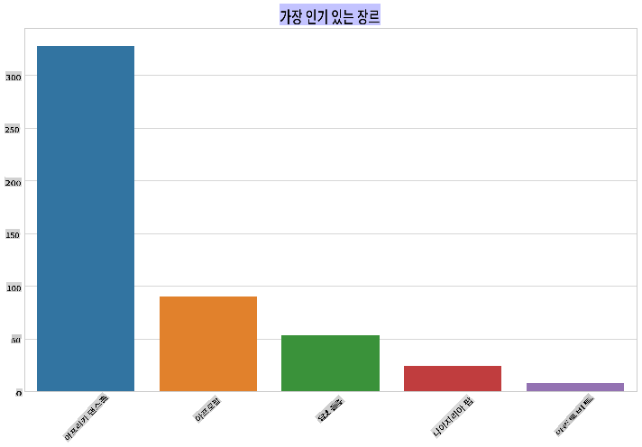
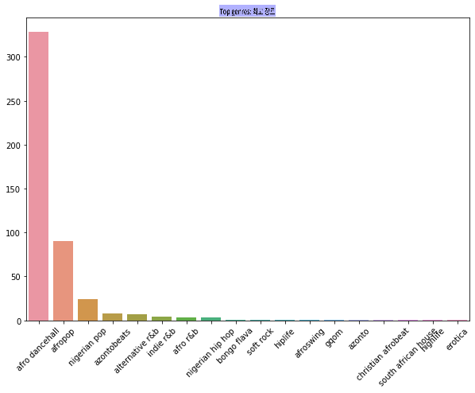
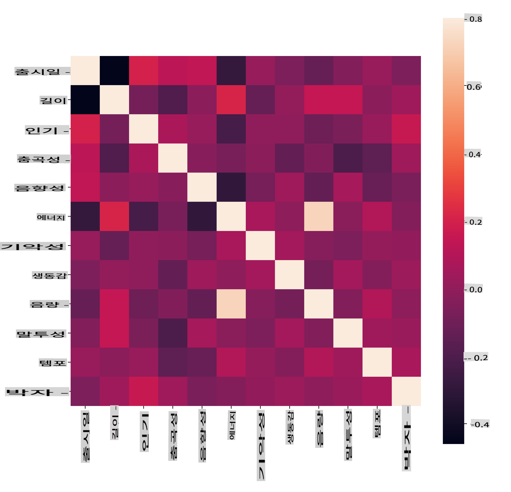
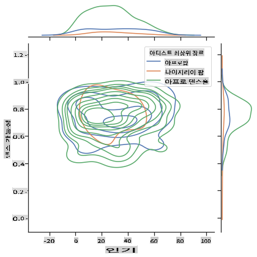
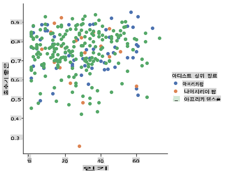

<!--
CO_OP_TRANSLATOR_METADATA:
{
  "original_hash": "0ab69b161efd7a41d325ee28b29415d7",
  "translation_date": "2025-09-03T23:01:47+00:00",
  "source_file": "5-Clustering/1-Visualize/README.md",
  "language_code": "ko"
}
-->
# 클러스터링 소개

클러스터링은 데이터셋이 라벨링되지 않았거나 입력값이 미리 정의된 출력값과 연결되지 않은 상태를 가정하는 [비지도 학습](https://wikipedia.org/wiki/Unsupervised_learning)의 한 유형입니다. 다양한 알고리즘을 사용하여 라벨링되지 않은 데이터를 분류하고 데이터에서 감지된 패턴에 따라 그룹을 제공합니다.

[](https://youtu.be/ty2advRiWJM "PSquare의 No One Like You")

> 🎥 위 이미지를 클릭하면 비디오를 볼 수 있습니다. 클러스터링을 활용한 머신 러닝을 공부하는 동안, 나이지리아 댄스홀 음악을 즐겨보세요. 이는 PSquare가 2014년에 발표한 높은 평가를 받은 곡입니다.

## [강의 전 퀴즈](https://gray-sand-07a10f403.1.azurestaticapps.net/quiz/27/)

### 소개

[클러스터링](https://link.springer.com/referenceworkentry/10.1007%2F978-0-387-30164-8_124)은 데이터 탐색에 매우 유용합니다. 나이지리아 청중들이 음악을 소비하는 방식에서 트렌드와 패턴을 발견할 수 있는지 살펴봅시다.

✅ 클러스터링의 활용 사례에 대해 잠시 생각해보세요. 현실 세계에서 클러스터링은 빨래 더미를 가족 구성원의 옷으로 분류해야 할 때 발생합니다 🧦👕👖🩲. 데이터 과학에서는 사용자의 선호도를 분석하거나 라벨링되지 않은 데이터셋의 특성을 결정하려고 할 때 클러스터링이 발생합니다. 클러스터링은 혼란을 이해하는 데 도움을 주는 방법으로, 마치 양말 서랍을 정리하는 것과 같습니다.

[](https://youtu.be/esmzYhuFnds "클러스터링 소개")

> 🎥 위 이미지를 클릭하면 비디오를 볼 수 있습니다: MIT의 John Guttag가 클러스터링을 소개합니다.

전문적인 환경에서는 클러스터링을 사용하여 시장 세분화와 같은 것을 결정할 수 있습니다. 예를 들어, 어떤 연령대가 어떤 아이템을 구매하는지 알아내는 것입니다. 또 다른 활용 사례는 이상 탐지로, 신용카드 거래 데이터셋에서 사기를 감지하는 데 사용할 수 있습니다. 또는 의료 스캔 데이터에서 종양을 식별하는 데 클러스터링을 사용할 수도 있습니다.

✅ 은행, 전자상거래 또는 비즈니스 환경에서 '야생'에서 클러스터링을 접한 경험이 있는지 잠시 생각해보세요.

> 🎓 흥미롭게도 클러스터 분석은 1930년대 인류학과 심리학 분야에서 시작되었습니다. 당시에는 어떻게 사용되었을지 상상해보세요.

또는 검색 결과를 그룹화하는 데 사용할 수도 있습니다. 예를 들어 쇼핑 링크, 이미지 또는 리뷰로 그룹화하는 것입니다. 클러스터링은 대규모 데이터셋을 축소하고 더 세부적인 분석을 수행하려는 경우에 유용하며, 이를 통해 다른 모델을 구축하기 전에 데이터에 대해 배울 수 있습니다.

✅ 데이터가 클러스터로 정리되면 클러스터 ID를 할당할 수 있습니다. 이 기술은 데이터셋의 프라이버시를 보호할 때 유용합니다. 더 드러나는 식별 가능한 데이터 대신 클러스터 ID로 데이터 포인트를 참조할 수 있습니다. 클러스터 ID를 사용하여 클러스터의 다른 요소 대신 식별하는 이유를 생각해볼 수 있나요?

클러스터링 기술에 대한 이해를 심화하려면 [Learn 모듈](https://docs.microsoft.com/learn/modules/train-evaluate-cluster-models?WT.mc_id=academic-77952-leestott)을 확인하세요.

## 클러스터링 시작하기

[Scikit-learn은 다양한 방법](https://scikit-learn.org/stable/modules/clustering.html)을 제공하여 클러스터링을 수행할 수 있습니다. 선택한 방법은 사용 사례에 따라 달라집니다. 문서에 따르면 각 방법은 다양한 이점을 가지고 있습니다. Scikit-learn에서 지원하는 방법과 적합한 사용 사례를 간단히 정리한 표는 다음과 같습니다:

| 방법 이름                     | 사용 사례                                                               |
| :--------------------------- | :--------------------------------------------------------------------- |
| K-Means                      | 일반적인 목적, 귀납적                                                 |
| Affinity propagation         | 많은, 불균형 클러스터, 귀납적                                         |
| Mean-shift                   | 많은, 불균형 클러스터, 귀납적                                         |
| Spectral clustering          | 적은, 균형 클러스터, 전이적                                           |
| Ward hierarchical clustering | 많은, 제한된 클러스터, 전이적                                         |
| Agglomerative clustering     | 많은, 제한된, 비유클리드 거리, 전이적                                 |
| DBSCAN                       | 비평면 기하학, 불균형 클러스터, 전이적                                |
| OPTICS                       | 비평면 기하학, 밀도가 가변적인 불균형 클러스터, 전이적                |
| Gaussian mixtures            | 평면 기하학, 귀납적                                                  |
| BIRCH                        | 이상값이 있는 대규모 데이터셋, 귀납적                                 |

> 🎓 클러스터를 생성하는 방법은 데이터 포인트를 그룹으로 모으는 방식과 밀접한 관련이 있습니다. 몇 가지 용어를 살펴봅시다:
>
> 🎓 ['전이적' vs. '귀납적'](https://wikipedia.org/wiki/Transduction_(machine_learning))
> 
> 전이적 추론은 특정 테스트 사례에 매핑된 관찰된 학습 사례에서 도출됩니다. 귀납적 추론은 일반적인 규칙에 매핑된 학습 사례에서 도출되며, 그런 다음 테스트 사례에 적용됩니다.
> 
> 예: 데이터셋이 부분적으로 라벨링된 상태라고 가정해봅시다. 일부는 '레코드', 일부는 'CD', 일부는 공백입니다. 공백에 라벨을 제공하는 것이 당신의 작업입니다. 귀납적 접근법을 선택하면 '레코드'와 'CD'를 찾는 모델을 학습시키고, 라벨링되지 않은 데이터에 이러한 라벨을 적용합니다. 이 접근법은 실제로 '카세트'인 항목을 분류하는 데 어려움을 겪을 것입니다. 반면에 전이적 접근법은 유사한 항목을 그룹화한 다음 그룹에 라벨을 적용하여 이러한 미지의 데이터를 더 효과적으로 처리합니다. 이 경우 클러스터는 '둥근 음악 물건'과 '네모난 음악 물건'을 반영할 수 있습니다.
> 
> 🎓 ['비평면' vs. '평면' 기하학](https://datascience.stackexchange.com/questions/52260/terminology-flat-geometry-in-the-context-of-clustering)
> 
> 수학적 용어에서 파생된 비평면 vs. 평면 기하학은 클러스터 내의 점들 간의 거리를 '평면'([유클리드](https://wikipedia.org/wiki/Euclidean_geometry)) 또는 '비평면'(비유클리드) 기하학적 방법으로 측정하는 것을 의미합니다.
>
>'평면'은 유클리드 기하학(일부는 '평면' 기하학으로 가르침)과 관련되며, '비평면'은 비유클리드 기하학과 관련됩니다. 기하학이 머신 러닝과 어떤 관련이 있을까요? 두 분야 모두 수학에 뿌리를 두고 있기 때문에 클러스터 내의 점들 간의 거리를 측정하는 공통 방법이 필요하며, 데이터의 특성에 따라 '평면' 또는 '비평면' 방식으로 측정할 수 있습니다. [유클리드 거리](https://wikipedia.org/wiki/Euclidean_distance)는 두 점 사이의 선분 길이로 측정됩니다. [비유클리드 거리](https://wikipedia.org/wiki/Non-Euclidean_geometry)는 곡선을 따라 측정됩니다. 데이터가 시각화되었을 때 평면에 존재하지 않는 것처럼 보인다면, 이를 처리하기 위해 특수 알고리즘을 사용해야 할 수 있습니다.
>

> 인포그래픽 제공: [Dasani Madipalli](https://twitter.com/dasani_decoded)
> 
> 🎓 ['거리'](https://web.stanford.edu/class/cs345a/slides/12-clustering.pdf)
> 
> 클러스터는 거리 행렬, 즉 점들 간의 거리로 정의됩니다. 이 거리는 몇 가지 방법으로 측정될 수 있습니다. 유클리드 클러스터는 점 값의 평균으로 정의되며, '중심점' 또는 중심점을 포함합니다. 거리는 따라서 그 중심점까지의 거리로 측정됩니다. 비유클리드 거리는 '클러스트로이드', 즉 다른 점들에 가장 가까운 점으로 측정됩니다. 클러스트로이드는 다양한 방식으로 정의될 수 있습니다.
> 
> 🎓 ['제약'](https://wikipedia.org/wiki/Constrained_clustering)
> 
> [제약 클러스터링](https://web.cs.ucdavis.edu/~davidson/Publications/ICDMTutorial.pdf)은 이 비지도 방법에 '반지도 학습'을 도입합니다. 점들 간의 관계는 '연결 불가' 또는 '연결 필수'로 표시되어 데이터셋에 일부 규칙이 강제됩니다.
>
>예: 알고리즘이 라벨링되지 않았거나 반라벨링된 데이터 배치에서 자유롭게 작동하도록 설정되면 생성된 클러스터는 품질이 낮을 수 있습니다. 위의 예에서 클러스터는 '둥근 음악 물건', '네모난 음악 물건', '삼각형 물건', '쿠키'를 그룹화할 수 있습니다. 일부 제약 조건이나 규칙("항목은 플라스틱으로 만들어져야 한다", "항목은 음악을 생성할 수 있어야 한다")이 주어지면 알고리즘이 더 나은 선택을 하도록 도울 수 있습니다.
> 
> 🎓 '밀도'
> 
> '노이즈가 많은' 데이터는 '밀도가 높다'고 간주됩니다. 각 클러스터 내의 점들 간의 거리는 더 밀도가 높거나 낮은 것으로 판명될 수 있으며, 따라서 이러한 데이터는 적절한 클러스터링 방법으로 분석해야 합니다. [이 기사](https://www.kdnuggets.com/2020/02/understanding-density-based-clustering.html)는 불균형 클러스터 밀도가 있는 노이즈 데이터셋을 탐색하기 위해 K-Means 클러스터링과 HDBSCAN 알고리즘을 사용하는 차이를 보여줍니다.

## 클러스터링 알고리즘

클러스터링 알고리즘은 100개 이상 있으며, 사용은 데이터의 특성에 따라 달라집니다. 주요 알고리즘 몇 가지를 살펴봅시다:

- **계층적 클러스터링**. 객체가 멀리 떨어진 객체보다 가까운 객체와의 근접성에 따라 분류되면, 클러스터는 다른 객체와의 거리로 형성됩니다. Scikit-learn의 집계 클러스터링은 계층적입니다.

   
   > 인포그래픽 제공: [Dasani Madipalli](https://twitter.com/dasani_decoded)

- **중심점 클러스터링**. 이 인기 있는 알고리즘은 'k', 즉 형성할 클러스터 수를 선택한 후, 알고리즘이 클러스터의 중심점을 결정하고 해당 점 주위에 데이터를 모읍니다. [K-평균 클러스터링](https://wikipedia.org/wiki/K-means_clustering)은 중심점 클러스터링의 인기 있는 버전입니다. 중심은 가장 가까운 평균에 의해 결정되며, 따라서 이름이 붙여졌습니다. 클러스터에서의 제곱 거리가 최소화됩니다.

   
   > 인포그래픽 제공: [Dasani Madipalli](https://twitter.com/dasani_decoded)

- **분포 기반 클러스터링**. 통계 모델링에 기반하여, 분포 기반 클러스터링은 데이터 포인트가 클러스터에 속할 확률을 결정하고 이에 따라 할당합니다. 가우시안 혼합 방법은 이 유형에 속합니다.

- **밀도 기반 클러스터링**. 데이터 포인트는 밀도, 즉 서로 주위에 그룹화된 정도에 따라 클러스터에 할당됩니다. 그룹에서 멀리 떨어진 데이터 포인트는 이상값 또는 노이즈로 간주됩니다. DBSCAN, Mean-shift 및 OPTICS는 이 유형의 클러스터링에 속합니다.

- **그리드 기반 클러스터링**. 다차원 데이터셋의 경우, 그리드를 생성하고 데이터를 그리드의 셀로 나누어 클러스터를 생성합니다.

## 실습 - 데이터 클러스터링

클러스터링 기술은 적절한 시각화에 크게 도움을 받으므로, 음악 데이터를 시각화하는 것으로 시작해봅시다. 이 실습은 데이터의 특성에 가장 효과적으로 사용할 클러스터링 방법을 결정하는 데 도움을 줄 것입니다.

1. 이 폴더의 [_notebook.ipynb_](https://github.com/microsoft/ML-For-Beginners/blob/main/5-Clustering/1-Visualize/notebook.ipynb) 파일을 엽니다.

1. 데이터 시각화를 위해 `Seaborn` 패키지를 가져옵니다.

    ```python
    !pip install seaborn
    ```

1. [_nigerian-songs.csv_](https://github.com/microsoft/ML-For-Beginners/blob/main/5-Clustering/data/nigerian-songs.csv)에서 노래 데이터를 추가합니다. 노래에 대한 데이터를 포함한 데이터프레임을 로드합니다. 라이브러리를 가져오고 데이터를 출력하여 탐색할 준비를 합니다:

    ```python
    import matplotlib.pyplot as plt
    import pandas as pd
    
    df = pd.read_csv("../data/nigerian-songs.csv")
    df.head()
    ```

    데이터의 첫 몇 줄을 확인합니다:

    |     | name                     | album                        | artist              | artist_top_genre | release_date | length | popularity | danceability | acousticness | energy | instrumentalness | liveness | loudness | speechiness | tempo   | time_signature |
    | --- | ------------------------ | ---------------------------- | ------------------- | ---------------- | ------------ | ------ | ---------- | ------------ | ------------ | ------ | ---------------- | -------- | -------- | ----------- | ------- | -------------- |
    | 0   | Sparky                   | Mandy & The Jungle           | Cruel Santino       | alternative r&b  | 2019         | 144000 | 48         | 0.666        | 0.851        | 0.42   | 0.534            | 0.11     | -6.699   | 0.0829      | 133.015 | 5              |
    | 1   | shuga rush               | EVERYTHING YOU HEARD IS TRUE | Odunsi (The Engine) | afropop          | 2020         | 89488  | 30         | 0.71         | 0.0822       | 0.683  | 0.000169         | 0.101    | -5.64    | 0.36        | 129.993 | 3              |
| 2   | LITT!                    | LITT!                        | AYLØ                | indie r&b        | 2018         | 207758 | 40         | 0.836        | 0.272        | 0.564  | 0.000537         | 0.11     | -7.127   | 0.0424      | 130.005 | 4              |
| 3   | Confident / Feeling Cool | Enjoy Your Life              | Lady Donli          | nigerian pop     | 2019         | 175135 | 14         | 0.894        | 0.798        | 0.611  | 0.000187         | 0.0964   | -4.961   | 0.113       | 111.087 | 4              |
| 4   | wanted you               | rare.                        | Odunsi (The Engine) | afropop          | 2018         | 152049 | 25         | 0.702        | 0.116        | 0.833  | 0.91             | 0.348    | -6.044   | 0.0447      | 105.115 | 4              |

1. 데이터프레임에 대한 정보를 얻으려면 `info()`를 호출하세요:

    ```python
    df.info()
    ```

   출력은 다음과 같습니다:

    ```output
    <class 'pandas.core.frame.DataFrame'>
    RangeIndex: 530 entries, 0 to 529
    Data columns (total 16 columns):
     #   Column            Non-Null Count  Dtype  
    ---  ------            --------------  -----  
     0   name              530 non-null    object 
     1   album             530 non-null    object 
     2   artist            530 non-null    object 
     3   artist_top_genre  530 non-null    object 
     4   release_date      530 non-null    int64  
     5   length            530 non-null    int64  
     6   popularity        530 non-null    int64  
     7   danceability      530 non-null    float64
     8   acousticness      530 non-null    float64
     9   energy            530 non-null    float64
     10  instrumentalness  530 non-null    float64
     11  liveness          530 non-null    float64
     12  loudness          530 non-null    float64
     13  speechiness       530 non-null    float64
     14  tempo             530 non-null    float64
     15  time_signature    530 non-null    int64  
    dtypes: float64(8), int64(4), object(4)
    memory usage: 66.4+ KB
    ```

1. `isnull()`을 호출하고 합계가 0인지 확인하여 null 값을 다시 확인하세요:

    ```python
    df.isnull().sum()
    ```

    좋아 보입니다:

    ```output
    name                0
    album               0
    artist              0
    artist_top_genre    0
    release_date        0
    length              0
    popularity          0
    danceability        0
    acousticness        0
    energy              0
    instrumentalness    0
    liveness            0
    loudness            0
    speechiness         0
    tempo               0
    time_signature      0
    dtype: int64
    ```

1. 데이터를 설명하세요:

    ```python
    df.describe()
    ```

    |       | release_date | length      | popularity | danceability | acousticness | energy   | instrumentalness | liveness | loudness  | speechiness | tempo      | time_signature |
    | ----- | ------------ | ----------- | ---------- | ------------ | ------------ | -------- | ---------------- | -------- | --------- | ----------- | ---------- | -------------- |
    | count | 530          | 530         | 530        | 530          | 530          | 530      | 530              | 530      | 530       | 530         | 530        | 530            |
    | mean  | 2015.390566  | 222298.1698 | 17.507547  | 0.741619     | 0.265412     | 0.760623 | 0.016305         | 0.147308 | -4.953011 | 0.130748    | 116.487864 | 3.986792       |
    | std   | 3.131688     | 39696.82226 | 18.992212  | 0.117522     | 0.208342     | 0.148533 | 0.090321         | 0.123588 | 2.464186  | 0.092939    | 23.518601  | 0.333701       |
    | min   | 1998         | 89488       | 0          | 0.255        | 0.000665     | 0.111    | 0                | 0.0283   | -19.362   | 0.0278      | 61.695     | 3              |
    | 25%   | 2014         | 199305      | 0          | 0.681        | 0.089525     | 0.669    | 0                | 0.07565  | -6.29875  | 0.0591      | 102.96125  | 4              |
    | 50%   | 2016         | 218509      | 13         | 0.761        | 0.2205       | 0.7845   | 0.000004         | 0.1035   | -4.5585   | 0.09795     | 112.7145   | 4              |
    | 75%   | 2017         | 242098.5    | 31         | 0.8295       | 0.403        | 0.87575  | 0.000234         | 0.164    | -3.331    | 0.177       | 125.03925  | 4              |
    | max   | 2020         | 511738      | 73         | 0.966        | 0.954        | 0.995    | 0.91             | 0.811    | 0.582     | 0.514       | 206.007    | 5              |

> 🤔 클러스터링은 라벨이 없는 데이터를 필요로 하지 않는 비지도 학습 방법인데, 왜 라벨이 있는 데이터를 보여주고 있을까요? 데이터 탐색 단계에서는 유용하지만, 클러스터링 알고리즘이 작동하는 데 필수적이지는 않습니다. 열 헤더를 제거하고 열 번호로 데이터를 참조해도 됩니다.

데이터의 일반적인 값을 살펴보세요. 인기(popularity)가 '0'일 수 있다는 점에 주목하세요. 이는 순위가 없는 곡을 나타냅니다. 이를 곧 제거해 보겠습니다.

1. 바 플롯을 사용하여 가장 인기 있는 장르를 찾아보세요:

    ```python
    import seaborn as sns
    
    top = df['artist_top_genre'].value_counts()
    plt.figure(figsize=(10,7))
    sns.barplot(x=top[:5].index,y=top[:5].values)
    plt.xticks(rotation=45)
    plt.title('Top genres',color = 'blue')
    ```

    

✅ 더 많은 상위 값을 보고 싶다면, 상위 `[:5]`를 더 큰 값으로 변경하거나 제거하여 모두 확인하세요.

참고로, 상위 장르가 'Missing'으로 표시되면 Spotify에서 이를 분류하지 않았다는 의미이므로 이를 제거합시다.

1. 누락된 데이터를 필터링하여 제거하세요:

    ```python
    df = df[df['artist_top_genre'] != 'Missing']
    top = df['artist_top_genre'].value_counts()
    plt.figure(figsize=(10,7))
    sns.barplot(x=top.index,y=top.values)
    plt.xticks(rotation=45)
    plt.title('Top genres',color = 'blue')
    ```

    이제 장르를 다시 확인하세요:

    

1. 이 데이터셋에서 상위 세 장르가 압도적으로 많습니다. `afro dancehall`, `afropop`, `nigerian pop`에 집중하고, 데이터셋에서 인기 값이 0인 항목(데이터셋에서 인기가 분류되지 않았으며 우리의 목적에 맞지 않는 노이즈로 간주될 수 있음)을 제거하세요:

    ```python
    df = df[(df['artist_top_genre'] == 'afro dancehall') | (df['artist_top_genre'] == 'afropop') | (df['artist_top_genre'] == 'nigerian pop')]
    df = df[(df['popularity'] > 0)]
    top = df['artist_top_genre'].value_counts()
    plt.figure(figsize=(10,7))
    sns.barplot(x=top.index,y=top.values)
    plt.xticks(rotation=45)
    plt.title('Top genres',color = 'blue')
    ```

1. 데이터가 특별히 강하게 상관관계가 있는지 빠르게 테스트하세요:

    ```python
    corrmat = df.corr(numeric_only=True)
    f, ax = plt.subplots(figsize=(12, 9))
    sns.heatmap(corrmat, vmax=.8, square=True)
    ```

    

    `energy`와 `loudness` 사이에만 강한 상관관계가 있으며, 이는 예상할 수 있는 결과입니다. 일반적으로 큰 소리의 음악은 에너지가 높기 때문입니다. 그 외에는 상관관계가 비교적 약합니다. 클러스터링 알고리즘이 이 데이터를 어떻게 처리할지 흥미로울 것입니다.

    > 🎓 상관관계가 인과관계를 의미하지는 않는다는 점을 기억하세요! 우리는 상관관계의 증거는 있지만 인과관계의 증거는 없습니다. [재미있는 웹사이트](https://tylervigen.com/spurious-correlations)는 이 점을 강조하는 시각 자료를 제공합니다.

이 데이터셋에서 곡의 인기도와 춤추기 쉬운 정도(danceability)에 대한 수렴이 있나요? FacetGrid를 보면 장르에 상관없이 동심원이 나타나는 것을 확인할 수 있습니다. 나이지리아의 취향이 이 장르에서 특정 수준의 춤추기 쉬운 정도로 수렴하는 것일까요?

✅ 다른 데이터 포인트(예: energy, loudness, speechiness)와 더 많은 음악 장르를 시도해 보세요. 무엇을 발견할 수 있나요? `df.describe()` 테이블을 살펴보고 데이터 포인트의 일반적인 분포를 확인하세요.

### 연습 - 데이터 분포

이 세 장르가 인기도와 춤추기 쉬운 정도에 대한 인식에서 유의미하게 다른가요?

1. 상위 세 장르의 데이터 분포를 주어진 x축과 y축에 따라 조사하세요.

    ```python
    sns.set_theme(style="ticks")
    
    g = sns.jointplot(
        data=df,
        x="popularity", y="danceability", hue="artist_top_genre",
        kind="kde",
    )
    ```

    동심원이 일반적인 수렴 지점을 중심으로 나타나는 것을 발견할 수 있습니다. 이는 데이터 포인트의 분포를 보여줍니다.

    > 🎓 이 예제는 연속 확률 밀도 곡선을 사용하여 데이터를 나타내는 KDE(커널 밀도 추정) 그래프를 사용합니다. 이는 여러 분포를 다룰 때 데이터를 해석하는 데 유용합니다.

    일반적으로 세 장르는 인기도와 춤추기 쉬운 정도 측면에서 느슨하게 정렬됩니다. 이 느슨하게 정렬된 데이터에서 클러스터를 결정하는 것은 도전 과제가 될 것입니다:

    

1. 산점도를 생성하세요:

    ```python
    sns.FacetGrid(df, hue="artist_top_genre", height=5) \
       .map(plt.scatter, "popularity", "danceability") \
       .add_legend()
    ```

    동일한 축의 산점도는 유사한 수렴 패턴을 보여줍니다.

    

일반적으로 클러스터링을 위해 산점도를 사용하여 데이터 클러스터를 표시할 수 있으므로 이러한 유형의 시각화를 마스터하는 것이 매우 유용합니다. 다음 강의에서는 이 필터링된 데이터를 사용하여 k-means 클러스터링을 통해 흥미로운 방식으로 겹치는 그룹을 발견할 것입니다.

---

## 🚀도전 과제

다음 강의를 준비하면서, 프로덕션 환경에서 발견하고 사용할 수 있는 다양한 클러스터링 알고리즘에 대한 차트를 만들어 보세요. 클러스터링이 해결하려는 문제는 무엇인가요?

## [강의 후 퀴즈](https://gray-sand-07a10f403.1.azurestaticapps.net/quiz/28/)

## 복습 및 자기 학습

클러스터링 알고리즘을 적용하기 전에, 데이터셋의 특성을 이해하는 것이 좋습니다. 이 주제에 대해 더 알아보세요 [여기](https://www.kdnuggets.com/2019/10/right-clustering-algorithm.html).

[이 유용한 기사](https://www.freecodecamp.org/news/8-clustering-algorithms-in-machine-learning-that-all-data-scientists-should-know/)는 다양한 데이터 모양에 따라 다양한 클러스터링 알고리즘이 어떻게 작동하는지 설명합니다.

## 과제

[클러스터링을 위한 다른 시각화 방법 조사하기](assignment.md)

---

**면책 조항**:  
이 문서는 AI 번역 서비스 [Co-op Translator](https://github.com/Azure/co-op-translator)를 사용하여 번역되었습니다. 정확성을 위해 최선을 다하고 있으나, 자동 번역에는 오류나 부정확성이 포함될 수 있습니다. 원본 문서의 원어 버전을 권위 있는 자료로 간주해야 합니다. 중요한 정보의 경우, 전문 번역가에 의한 번역을 권장합니다. 이 번역 사용으로 인해 발생할 수 있는 오해나 잘못된 해석에 대해 당사는 책임을 지지 않습니다.  