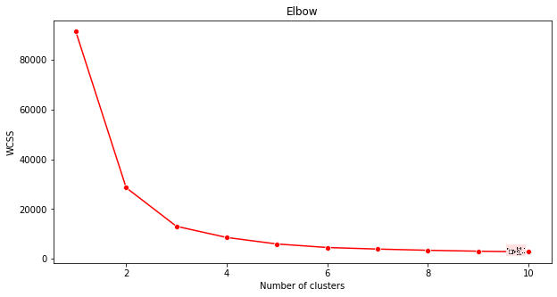

# K-Means 클러스터링

## [Pre-lecture quiz](https://gray-sand-07a10f403.1.azurestaticapps.net/quiz/29/)

이 강의에서는 Scikit-learn과 이전에 가져온 나이지리아 음악 데이터셋을 사용하여 클러스터를 만드는 방법을 배웁니다. 우리는 클러스터링을 위한 K-Means의 기본 사항을 다룰 것입니다. 이전 강의에서 배운 것처럼, 클러스터를 다루는 방법에는 여러 가지가 있으며 사용 방법은 데이터에 따라 다릅니다. 가장 일반적인 클러스터링 기술인 K-Means를 시도해 보겠습니다. 시작해볼까요!

배울 용어들:

- 실루엣 점수
- 엘보우 방법
- 관성
- 분산

## 소개

[K-Means 클러스터링](https://wikipedia.org/wiki/K-means_clustering)은 신호 처리 분야에서 파생된 방법입니다. 일련의 관찰을 사용하여 데이터를 'k' 클러스터로 나누고 분할하는 데 사용됩니다. 각 관찰은 주어진 데이터 포인트를 가장 가까운 '평균' 또는 클러스터의 중심점에 그룹화하는 역할을 합니다.

클러스터는 점(또는 '씨앗')과 해당 영역을 포함하는 [보로노이 다이어그램](https://wikipedia.org/wiki/Voronoi_diagram)으로 시각화할 수 있습니다.


> 인포그래픽 by [Jen Looper](https://twitter.com/jenlooper)

K-Means 클러스터링 과정은 [세 단계로 실행됩니다](https://scikit-learn.org/stable/modules/clustering.html#k-means):

1. 알고리즘은 데이터셋에서 샘플링하여 k-개의 중심점을 선택합니다. 이후 반복합니다:
    1. 각 샘플을 가장 가까운 중심점에 할당합니다.
    2. 이전 중심점에 할당된 모든 샘플의 평균 값을 취하여 새로운 중심점을 만듭니다.
    3. 그런 다음 새로운 중심점과 이전 중심점의 차이를 계산하고 중심점이 안정화될 때까지 반복합니다.

K-Means를 사용할 때의 한 가지 단점은 'k', 즉 중심점의 수를 설정해야 한다는 것입니다. 다행히도 '엘보우 방법'은 'k'의 좋은 시작 값을 추정하는 데 도움이 됩니다. 곧 시도해 보겠습니다.

## 전제 조건

이 강의의 [_notebook.ipynb_](https://github.com/microsoft/ML-For-Beginners/blob/main/5-Clustering/2-K-Means/notebook.ipynb) 파일에서 작업할 것입니다. 이 파일에는 이전 강의에서 수행한 데이터 가져오기 및 초기 정리가 포함되어 있습니다.

## 연습 - 준비

노래 데이터를 다시 한 번 살펴보세요.

1. 각 열에 대해 `boxplot()`를 호출하여 박스플롯을 생성합니다:

    ```python
    plt.figure(figsize=(20,20), dpi=200)
    
    plt.subplot(4,3,1)
    sns.boxplot(x = 'popularity', data = df)
    
    plt.subplot(4,3,2)
    sns.boxplot(x = 'acousticness', data = df)
    
    plt.subplot(4,3,3)
    sns.boxplot(x = 'energy', data = df)
    
    plt.subplot(4,3,4)
    sns.boxplot(x = 'instrumentalness', data = df)
    
    plt.subplot(4,3,5)
    sns.boxplot(x = 'liveness', data = df)
    
    plt.subplot(4,3,6)
    sns.boxplot(x = 'loudness', data = df)
    
    plt.subplot(4,3,7)
    sns.boxplot(x = 'speechiness', data = df)
    
    plt.subplot(4,3,8)
    sns.boxplot(x = 'tempo', data = df)
    
    plt.subplot(4,3,9)
    sns.boxplot(x = 'time_signature', data = df)
    
    plt.subplot(4,3,10)
    sns.boxplot(x = 'danceability', data = df)
    
    plt.subplot(4,3,11)
    sns.boxplot(x = 'length', data = df)
    
    plt.subplot(4,3,12)
    sns.boxplot(x = 'release_date', data = df)
    ```

    이 데이터는 약간 시끄럽습니다: 각 열을 박스플롯으로 관찰함으로써 이상치를 확인할 수 있습니다.

    

데이터셋을 통해 이러한 이상치를 제거할 수 있지만, 그렇게 하면 데이터가 매우 최소화될 것입니다.

1. 이제 클러스터링 연습에 사용할 열을 선택하세요. 유사한 범위를 가진 열을 선택하고 `artist_top_genre` 열을 숫자 데이터로 인코딩하세요:

    ```python
    from sklearn.preprocessing import LabelEncoder
    le = LabelEncoder()
    
    X = df.loc[:, ('artist_top_genre','popularity','danceability','acousticness','loudness','energy')]
    
    y = df['artist_top_genre']
    
    X['artist_top_genre'] = le.fit_transform(X['artist_top_genre'])
    
    y = le.transform(y)
    ```

1. 이제 몇 개의 클러스터를 타겟으로 할지 선택해야 합니다. 데이터셋에서 3개의 노래 장르를 추출했으므로 3개를 시도해 보겠습니다:

    ```python
    from sklearn.cluster import KMeans
    
    nclusters = 3 
    seed = 0
    
    km = KMeans(n_clusters=nclusters, random_state=seed)
    km.fit(X)
    
    # Predict the cluster for each data point
    
    y_cluster_kmeans = km.predict(X)
    y_cluster_kmeans
    ```

데이터프레임의 각 행에 대해 예측된 클러스터(0, 1 또는 2)가 포함된 배열이 출력됩니다.

1. 이 배열을 사용하여 '실루엣 점수'를 계산합니다:

    ```python
    from sklearn import metrics
    score = metrics.silhouette_score(X, y_cluster_kmeans)
    score
    ```

## 실루엣 점수

실루엣 점수가 1에 가까운지 확인하세요. 이 점수는 -1에서 1까지 변하며, 점수가 1이면 클러스터가 밀집되고 다른 클러스터와 잘 분리된 것을 의미합니다. 0에 가까운 값은 샘플이 이웃 클러스터의 결정 경계에 매우 가까운 중첩된 클러스터를 나타냅니다. [(출처)](https://dzone.com/articles/kmeans-silhouette-score-explained-with-python-exam)

우리의 점수는 **.53**으로 중간에 위치합니다. 이는 데이터가 이 유형의 클러스터링에 특히 적합하지 않음을 나타내지만 계속 진행해 보겠습니다.

### 연습 - 모델 구축

1. `KMeans`를 가져오고 클러스터링 과정을 시작합니다.

    ```python
    from sklearn.cluster import KMeans
    wcss = []
    
    for i in range(1, 11):
        kmeans = KMeans(n_clusters = i, init = 'k-means++', random_state = 42)
        kmeans.fit(X)
        wcss.append(kmeans.inertia_)
    
    ```

    여기에는 설명할 부분이 몇 가지 있습니다.

    > 🎓 range: 클러스터링 과정의 반복 횟수

    > 🎓 random_state: "중심점 초기화를 위한 난수 생성 결정." [출처](https://scikit-learn.org/stable/modules/generated/sklearn.cluster.KMeans.html#sklearn.cluster.KMeans)

    > 🎓 WCSS: "클러스터 내 제곱합"은 클러스터 내의 모든 점이 클러스터 중심점에서 평균적으로 얼마나 떨어져 있는지를 측정합니다. [출처](https://medium.com/@ODSC/unsupervised-learning-evaluating-clusters-bd47eed175ce).

    > 🎓 관성: K-Means 알고리즘은 클러스터가 내부적으로 얼마나 일관된지를 측정하는 '관성'을 최소화하기 위해 중심점을 선택하려고 합니다. [출처](https://scikit-learn.org/stable/modules/clustering.html). 값은 각 반복에서 wcss 변수에 추가됩니다.

    > 🎓 k-means++: [Scikit-learn](https://scikit-learn.org/stable/modules/clustering.html#k-means)에서는 'k-means++' 최적화를 사용할 수 있습니다. 이는 중심점을 서로 멀리 떨어진 곳에 초기화하여 무작위 초기화보다 더 나은 결과를 얻을 수 있습니다.

### 엘보우 방법

이전에 3개의 노래 장르를 타겟으로 했기 때문에 3개의 클러스터를 선택해야 한다고 추측했습니다. 하지만 정말 그럴까요?

1. '엘보우 방법'을 사용하여 확인해 보세요.

    ```python
    plt.figure(figsize=(10,5))
    sns.lineplot(x=range(1, 11), y=wcss, marker='o', color='red')
    plt.title('Elbow')
    plt.xlabel('Number of clusters')
    plt.ylabel('WCSS')
    plt.show()
    ```

    이전 단계에서 생성한 `wcss` 변수를 사용하여 엘보우의 '굽힘'을 나타내는 차트를 생성합니다. 이는 최적의 클러스터 수를 나타냅니다. 아마도 **3**일 것입니다!

    

## 연습 - 클러스터 표시

1. 이번에는 3개의 클러스터를 설정하고 클러스터를 산점도로 표시합니다:

    ```python
    from sklearn.cluster import KMeans
    kmeans = KMeans(n_clusters = 3)
    kmeans.fit(X)
    labels = kmeans.predict(X)
    plt.scatter(df['popularity'],df['danceability'],c = labels)
    plt.xlabel('popularity')
    plt.ylabel('danceability')
    plt.show()
    ```

1. 모델의 정확도를 확인합니다:

    ```python
    labels = kmeans.labels_
    
    correct_labels = sum(y == labels)
    
    print("Result: %d out of %d samples were correctly labeled." % (correct_labels, y.size))
    
    print('Accuracy score: {0:0.2f}'. format(correct_labels/float(y.size)))
    ```

    이 모델의 정확도는 그다지 좋지 않으며, 클러스터의 모양이 그 이유를 암시합니다.

    

    이 데이터는 너무 불균형하고, 상관관계가 적으며, 열 값 간의 분산이 너무 커서 잘 클러스터링되지 않습니다. 사실, 형성된 클러스터는 아마도 우리가 위에서 정의한 세 가지 장르 카테고리에 의해 크게 영향을 받거나 왜곡되었을 것입니다. 이것은 학습 과정이었습니다!

    Scikit-learn의 문서에서는 이 모델처럼 클러스터가 잘 구분되지 않는 모델은 '분산' 문제를 가지고 있다고 볼 수 있습니다:

    
    > 인포그래픽 from Scikit-learn

## 분산

분산은 "평균에서 제곱된 차이의 평균"으로 정의됩니다 [(출처)](https://www.mathsisfun.com/data/standard-deviation.html). 이 클러스터링 문제의 맥락에서 이는 데이터셋의 숫자가 평균에서 너무 많이 벗어나는 경향이 있음을 의미합니다.

✅ 이 문제를 해결할 수 있는 모든 방법을 생각해볼 좋은 순간입니다. 데이터를 조금 더 조정할까요? 다른 열을 사용할까요? 다른 알고리즘을 사용할까요? 힌트: 데이터를 [스케일링](https://www.mygreatlearning.com/blog/learning-data-science-with-k-means-clustering/)하여 정규화하고 다른 열을 테스트해 보세요.

> 이 '[분산 계산기](https://www.calculatorsoup.com/calculators/statistics/variance-calculator.php)'를 사용하여 개념을 조금 더 이해해 보세요.

---

## 🚀도전 과제

이 노트북을 사용하여 매개변수를 조정하는 데 시간을 할애하세요. 데이터를 더 정리(예: 이상치 제거)하여 모델의 정확도를 향상시킬 수 있나요? 특정 데이터 샘플에 더 많은 가중치를 부여할 수 있습니다. 더 나은 클러스터를 만들기 위해 무엇을 할 수 있을까요?

힌트: 데이터를 스케일링해 보세요. 노트북에 데이터 열이 범위 면에서 서로 더 비슷하게 보이도록 표준 스케일링을 추가하는 주석 코드가 있습니다. 실루엣 점수가 낮아지더라도 엘보우 그래프의 '굽힘'이 부드러워집니다. 이는 데이터가 스케일링되지 않은 상태에서는 분산이 적은 데이터가 더 많은 가중치를 가지게 되기 때문입니다. 이 문제에 대해 더 읽어보세요 [여기](https://stats.stackexchange.com/questions/21222/are-mean-normalization-and-feature-scaling-needed-for-k-means-clustering/21226#21226).

## [Post-lecture quiz](https://gray-sand-07a10f403.1.azurestaticapps.net/quiz/30/)

## 복습 및 자습

[K-Means 시뮬레이터](https://user.ceng.metu.edu.tr/~akifakkus/courses/ceng574/k-means/)를 살펴보세요. 이 도구를 사용하여 샘플 데이터 포인트를 시각화하고 중심점을 결정할 수 있습니다. 데이터의 무작위성, 클러스터 수 및 중심점 수를 편집할 수 있습니다. 이 도구가 데이터가 어떻게 그룹화될 수 있는지 이해하는 데 도움이 되나요?

또한 [스탠포드의 K-Means 핸드아웃](https://stanford.edu/~cpiech/cs221/handouts/kmeans.html)을 살펴보세요.

## 과제

[다른 클러스터링 방법 시도](assignment.md)

**면책 조항**:
이 문서는 기계 기반 AI 번역 서비스를 사용하여 번역되었습니다. 정확성을 위해 노력하고 있지만, 자동 번역에는 오류나 부정확성이 포함될 수 있습니다. 원본 문서의 본래 언어가 권위 있는 출처로 간주되어야 합니다. 중요한 정보에 대해서는 전문적인 인간 번역을 권장합니다. 이 번역 사용으로 인해 발생하는 오해나 오역에 대해 당사는 책임을 지지 않습니다.