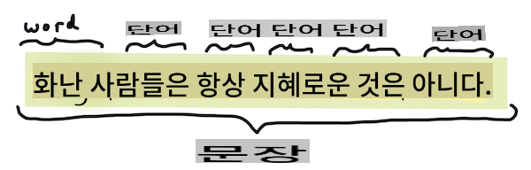
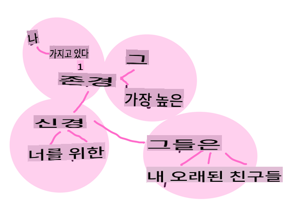
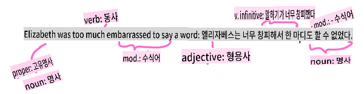

# 일반적인 자연어 처리 작업 및 기법

대부분의 *자연어 처리* 작업에서는 처리할 텍스트를 분해하고, 검토하며, 그 결과를 규칙 및 데이터 세트와 교차 참조하여 저장해야 합니다. 이러한 작업을 통해 프로그래머는 텍스트에서 _의미_나 _의도_, 또는 단순히 _용어와 단어의 빈도_를 도출할 수 있습니다.

## [사전 강의 퀴즈](https://gray-sand-07a10f403.1.azurestaticapps.net/quiz/33/)

텍스트를 처리하는 데 사용되는 일반적인 기법을 알아봅시다. 이러한 기법을 기계 학습과 결합하면 대량의 텍스트를 효율적으로 분석할 수 있습니다. 그러나 이러한 작업에 ML을 적용하기 전에, NLP 전문가가 직면하는 문제를 이해해 봅시다.

## NLP에서 공통적으로 수행하는 작업

텍스트를 분석하는 방법에는 여러 가지가 있습니다. 수행할 수 있는 작업이 있으며, 이러한 작업을 통해 텍스트를 이해하고 결론을 도출할 수 있습니다. 보통 이러한 작업은 순서대로 수행됩니다.

### 토큰화

아마도 대부분의 NLP 알고리즘이 처음 해야 할 일은 텍스트를 토큰 또는 단어로 분할하는 것입니다. 이는 간단해 보이지만, 구두점과 다른 언어의 단어 및 문장 구분자를 고려해야 하기 때문에 까다로울 수 있습니다. 여러 가지 방법을 사용하여 경계를 결정해야 할 수도 있습니다.


> **Pride and Prejudice**의 문장을 토큰화. 인포그래픽: [Jen Looper](https://twitter.com/jenlooper)

### 임베딩

[단어 임베딩](https://wikipedia.org/wiki/Word_embedding)은 텍스트 데이터를 수치적으로 변환하는 방법입니다. 임베딩은 유사한 의미를 가진 단어나 함께 사용되는 단어가 함께 클러스터링되도록 합니다.


> "I have the highest respect for your nerves, they are my old friends." - **Pride and Prejudice**의 문장에 대한 단어 임베딩. 인포그래픽: [Jen Looper](https://twitter.com/jenlooper)

✅ [이 흥미로운 도구](https://projector.tensorflow.org/)를 사용하여 단어 임베딩을 실험해보세요. 단어를 클릭하면 유사한 단어의 클러스터가 나타납니다: 'toy'는 'disney', 'lego', 'playstation', 'console'과 클러스터를 형성합니다.

### 구문 분석 및 품사 태깅

토큰화된 각 단어는 명사, 동사 또는 형용사 등 품사로 태깅될 수 있습니다. 문장 `the quick red fox jumped over the lazy brown dog`는 fox = 명사, jumped = 동사로 품사 태깅될 수 있습니다.



> **Pride and Prejudice**의 문장을 구문 분석. 인포그래픽: [Jen Looper](https://twitter.com/jenlooper)

구문 분석은 문장에서 어떤 단어들이 서로 관련되어 있는지 인식하는 것입니다 - 예를 들어 `the quick red fox jumped`는 형용사-명사-동사 시퀀스로 `lazy brown dog` 시퀀스와는 별개입니다.  

### 단어 및 구문 빈도

대량의 텍스트를 분석할 때 유용한 절차는 관심 있는 모든 단어 또는 구문의 사전을 작성하고 얼마나 자주 나타나는지를 기록하는 것입니다. 구문 `the quick red fox jumped over the lazy brown dog`는 the의 단어 빈도가 2입니다.

단어의 빈도를 세는 예제 텍스트를 살펴봅시다. Rudyard Kipling의 시 The Winners에는 다음과 같은 구절이 있습니다:

```output
What the moral? Who rides may read.
When the night is thick and the tracks are blind
A friend at a pinch is a friend, indeed,
But a fool to wait for the laggard behind.
Down to Gehenna or up to the Throne,
He travels the fastest who travels alone.
```

구문 빈도는 대소문자를 구분하거나 구분하지 않을 수 있으므로, 구문 `a friend` has a frequency of 2 and `the` has a frequency of 6, and `travels`의 빈도는 2입니다.

### N-그램

텍스트는 일정 길이의 단어 시퀀스로 분할될 수 있습니다. 단일 단어 (유니그램), 두 단어 (바이그램), 세 단어 (트라이그램) 또는 임의의 수의 단어 (N-그램)로 분할할 수 있습니다.

예를 들어 `the quick red fox jumped over the lazy brown dog`는 n-그램 점수 2로 다음과 같은 n-그램을 생성합니다:

1. the quick 
2. quick red 
3. red fox
4. fox jumped 
5. jumped over 
6. over the 
7. the lazy 
8. lazy brown 
9. brown dog

이것을 문장 위에 슬라이딩 박스로 시각화하면 더 쉽게 이해할 수 있습니다. 여기서 각 문장에서 n-그램이 굵게 표시됩니다:

1.   <u>**the quick red**</u> fox jumped over the lazy brown dog
2.   the **<u>quick red fox</u>** jumped over the lazy brown dog
3.   the quick **<u>red fox jumped</u>** over the lazy brown dog
4.   the quick red **<u>fox jumped over</u>** the lazy brown dog
5.   the quick red fox **<u>jumped over the</u>** lazy brown dog
6.   the quick red fox jumped **<u>over the lazy</u>** brown dog
7.   the quick red fox jumped over <u>**the lazy brown**</u> dog
8.   the quick red fox jumped over the **<u>lazy brown dog</u>**


> N-그램 값 3: 인포그래픽: [Jen Looper](https://twitter.com/jenlooper)

### 명사구 추출

대부분의 문장에는 주어나 목적어 역할을 하는 명사가 있습니다. 영어에서는 종종 'a', 'an' 또는 'the'가 앞에 붙어 있는 것으로 식별할 수 있습니다. 문장의 의미를 이해하려고 할 때 명사구를 추출하여 주어나 목적어를 식별하는 것은 NLP에서 일반적인 작업입니다.

✅ "I cannot fix on the hour, or the spot, or the look or the words, which laid the foundation. It is too long ago. I was in the middle before I knew that I had begun." 문장에서 명사구를 식별할 수 있습니까?

문장 `the quick red fox jumped over the lazy brown dog`에는 2개의 명사구가 있습니다: **quick red fox**와 **lazy brown dog**.

### 감정 분석

문장이나 텍스트는 얼마나 *긍정적*인지 또는 *부정적*인지 감정 분석을 할 수 있습니다. 감정은 *극성*과 *객관성/주관성*으로 측정됩니다. 극성은 -1.0에서 1.0 (부정적에서 긍정적)까지 측정되고, 객관성/주관성은 0.0에서 1.0 (가장 객관적인 것에서 가장 주관적인 것)까지 측정됩니다.

✅ 나중에 기계 학습을 사용하여 감정을 결정하는 다양한 방법을 배우겠지만, 한 가지 방법은 인간 전문가가 긍정적 또는 부정적으로 분류한 단어와 구문의 목록을 가지고 텍스트에 그 모델을 적용하여 극성 점수를 계산하는 것입니다. 이러한 방식이 어떤 상황에서는 잘 작동하고 다른 상황에서는 덜 작동하는 이유를 알 수 있습니까?

### 굴절

굴절은 단어를 취해 단어의 단수형 또는 복수형을 얻을 수 있게 합니다.

### 표제어 추출

*표제어*는 한 세트의 단어에 대한 기본 단어나 중심 단어입니다. 예를 들어 *flew*, *flies*, *flying*은 동사 *fly*의 표제어입니다.

NLP 연구자에게 유용한 데이터베이스도 있습니다. 특히:

### WordNet

[WordNet](https://wordnet.princeton.edu/)은 여러 언어의 모든 단어에 대한 동의어, 반의어 및 기타 많은 세부 정보를 포함하는 데이터베이스입니다. 번역기, 맞춤법 검사기 또는 언어 도구를 만들 때 매우 유용합니다.

## NLP 라이브러리

다행히도 이러한 기법을 직접 구축할 필요는 없습니다. 자연어 처리나 기계 학습에 전문적이지 않은 개발자도 접근할 수 있도록 해주는 훌륭한 Python 라이브러리가 많이 있습니다. 다음 수업에서는 이러한 라이브러리의 더 많은 예를 포함하고 있지만, 여기서는 다음 작업에 도움이 되는 몇 가지 유용한 예를 배웁니다.

### 연습 - `TextBlob` library

Let's use a library called TextBlob as it contains helpful APIs for tackling these types of tasks. TextBlob "stands on the giant shoulders of [NLTK](https://nltk.org) and [pattern](https://github.com/clips/pattern), and plays nicely with both." It has a considerable amount of ML embedded in its API.

> Note: A useful [Quick Start](https://textblob.readthedocs.io/en/dev/quickstart.html#quickstart) guide is available for TextBlob that is recommended for experienced Python developers 

When attempting to identify *noun phrases*, TextBlob offers several options of extractors to find noun phrases. 

1. Take a look at `ConllExtractor` 사용하기

    ```python
    from textblob import TextBlob
    from textblob.np_extractors import ConllExtractor
    # import and create a Conll extractor to use later 
    extractor = ConllExtractor()
    
    # later when you need a noun phrase extractor:
    user_input = input("> ")
    user_input_blob = TextBlob(user_input, np_extractor=extractor)  # note non-default extractor specified
    np = user_input_blob.noun_phrases                                    
    ```

    > 여기서 무슨 일이 벌어지고 있나요? [ConllExtractor](https://textblob.readthedocs.io/en/dev/api_reference.html?highlight=Conll#textblob.en.np_extractors.ConllExtractor)는 "ConLL-2000 학습 코퍼스로 훈련된 청크 파싱을 사용하는 명사구 추출기"입니다. ConLL-2000은 2000년 계산 언어 학습에 관한 회의를 의미합니다. 매년 이 회의에서는 까다로운 NLP 문제를 해결하기 위한 워크숍을 개최했으며, 2000년에는 명사 청킹이 주제였습니다. 모델은 Wall Street Journal을 기반으로 훈련되었으며, "섹션 15-18을 학습 데이터(211727 토큰)로 사용하고 섹션 20을 테스트 데이터(47377 토큰)로 사용"했습니다. 사용된 절차는 [여기](https://www.clips.uantwerpen.be/conll2000/chunking/)에서 확인할 수 있으며, [결과](https://ifarm.nl/erikt/research/np-chunking.html)는 여기에서 확인할 수 있습니다.

### 도전 과제 - NLP로 봇 개선하기

이전 수업에서 매우 간단한 Q&A 봇을 만들었습니다. 이제 입력된 텍스트의 감정을 분석하고 그에 맞는 응답을 출력하여 Marvin을 조금 더 공감할 수 있게 만드세요. 또한 `noun_phrase`를 식별하고 이에 대해 질문하세요.

더 나은 대화형 봇을 구축할 때의 단계:

1. 사용자가 봇과 상호작용하는 방법에 대한 지침 출력
2. 루프 시작 
   1. 사용자 입력 수락
   2. 사용자가 종료를 요청했으면 종료
   3. 사용자 입력을 처리하고 적절한 감정 응답 결정
   4. 감정에서 명사구가 감지되면 복수형으로 만들고 해당 주제에 대해 더 많은 입력 요청
   5. 응답 출력
3. 단계 2로 돌아가기

TextBlob을 사용하여 감정을 결정하는 코드 스니펫은 다음과 같습니다. 감정 응답의 *그라데이션*은 네 가지뿐입니다 (원하는 경우 더 추가할 수 있습니다):

```python
if user_input_blob.polarity <= -0.5:
  response = "Oh dear, that sounds bad. "
elif user_input_blob.polarity <= 0:
  response = "Hmm, that's not great. "
elif user_input_blob.polarity <= 0.5:
  response = "Well, that sounds positive. "
elif user_input_blob.polarity <= 1:
  response = "Wow, that sounds great. "
```

다음은 샘플 출력을 안내하는 예제입니다 (사용자 입력은 >로 시작하는 줄에 있습니다):

```output
Hello, I am Marvin, the friendly robot.
You can end this conversation at any time by typing 'bye'
After typing each answer, press 'enter'
How are you today?
> I am ok
Well, that sounds positive. Can you tell me more?
> I went for a walk and saw a lovely cat
Well, that sounds positive. Can you tell me more about lovely cats?
> cats are the best. But I also have a cool dog
Wow, that sounds great. Can you tell me more about cool dogs?
> I have an old hounddog but he is sick
Hmm, that's not great. Can you tell me more about old hounddogs?
> bye
It was nice talking to you, goodbye!
```

이 작업에 대한 가능한 솔루션은 [여기](https://github.com/microsoft/ML-For-Beginners/blob/main/6-NLP/2-Tasks/solution/bot.py)에 있습니다.

✅ 지식 점검

1. 공감하는 응답이 실제로 봇이 사용자를 이해하는 것처럼 '속일' 수 있다고 생각하십니까?
2. 명사구를 식별하는 것이 봇을 더 '믿을 수 있게' 만듭니까?
3. 문장에서 '명사구'를 추출하는 것이 유용한 이유는 무엇입니까?

---

이전 지식 점검에서 봇을 구현하고 친구에게 테스트해보세요. 친구를 속일 수 있나요? 봇을 더 '믿을 수 있게' 만들 수 있나요?

## 🚀도전 과제

이전 지식 점검에서 작업을 선택하고 이를 구현해보세요. 친구에게 봇을 테스트해보세요. 친구를 속일 수 있나요? 봇을 더 '믿을 수 있게' 만들 수 있나요?

## [강의 후 퀴즈](https://gray-sand-07a10f403.1.azurestaticapps.net/quiz/34/)

## 복습 및 자습

다음 몇 강의에서는 감정 분석에 대해 더 배울 것입니다. [KDNuggets](https://www.kdnuggets.com/tag/nlp)의 기사와 같은 자료를 통해 이 흥미로운 기법을 연구해보세요.

## 과제 

[봇이 대화하게 만들기](assignment.md)

**면책 조항**:
이 문서는 기계 기반 AI 번역 서비스를 사용하여 번역되었습니다. 정확성을 위해 노력하지만, 자동 번역에는 오류나 부정확성이 있을 수 있음을 유의하시기 바랍니다. 원어로 작성된 원본 문서가 권위 있는 출처로 간주되어야 합니다. 중요한 정보의 경우, 전문적인 인간 번역을 권장합니다. 이 번역 사용으로 인해 발생하는 오해나 오역에 대해 당사는 책임을 지지 않습니다.