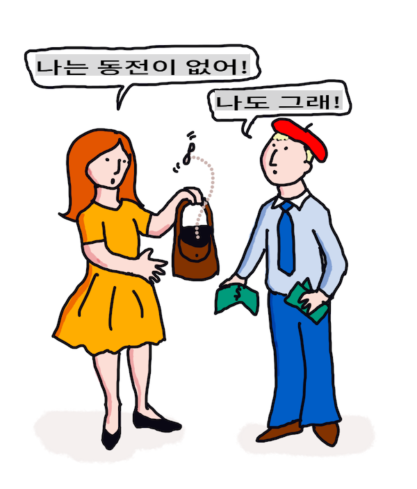

# 번역 및 감정 분석을 위한 ML

이전 수업에서 `TextBlob`을 사용하여 기본 봇을 만드는 방법을 배웠습니다. 이 라이브러리는 기본 NLP 작업(명사 구 추출 등)을 수행하기 위해 ML을 백그라운드에서 활용합니다. 컴퓨터 언어학에서 또 다른 중요한 과제는 한 언어로 말하거나 쓰인 문장을 다른 언어로 정확하게 _번역_하는 것입니다.

## [강의 전 퀴즈](https://gray-sand-07a10f403.1.azurestaticapps.net/quiz/35/)

번역은 수천 개의 언어가 존재하고 각 언어마다 매우 다른 문법 규칙이 있을 수 있기 때문에 매우 어려운 문제입니다. 한 가지 접근 방식은 영어와 같은 한 언어의 공식 문법 규칙을 비언어 종속 구조로 변환한 다음 이를 다시 다른 언어로 변환하는 것입니다. 이 접근 방식에서는 다음 단계를 따릅니다:

1. **식별**. 입력 언어의 단어를 명사, 동사 등으로 식별하거나 태그를 지정합니다.
2. **번역 생성**. 각 단어를 목표 언어 형식으로 직접 번역합니다.

### 예문, 영어에서 아일랜드어로

영어로 된 문장 _I feel happy_는 다음 순서로 세 단어입니다:

- **주어** (I)
- **동사** (feel)
- **형용사** (happy)

하지만 아일랜드어에서는 같은 문장이 매우 다른 문법 구조를 가지고 있습니다 - "*happy*" 또는 "*sad*"와 같은 감정은 *당신 위에* 있는 것으로 표현됩니다.

영어 문장 `I feel happy`을 아일랜드어로 번역하면 `Tá athas orm`가 됩니다. 문자 그대로 번역하면 `Happy is upon me`가 됩니다.

아일랜드어 화자가 영어로 번역할 때 `I feel happy`라고 말할 것입니다. 이는 문장의 의미를 이해하고 있기 때문이지, 단어와 문장 구조가 다르기 때문은 아닙니다.

아일랜드어 문장의 공식 순서는 다음과 같습니다:

- **동사** (Tá 또는 is)
- **형용사** (athas, 또는 happy)
- **주어** (orm, 또는 upon me)

## 번역

단순한 번역 프로그램은 문장 구조를 무시하고 단어만 번역할 수 있습니다.

✅ 성인이 되어 제2 외국어(또는 제3 외국어 이상)를 배운 적이 있다면, 모국어로 생각하고 개념을 단어 단위로 머릿속에서 번역한 다음 번역을 말하기 시작했을 것입니다. 이는 단순한 번역 컴퓨터 프로그램이 하는 것과 유사합니다. 유창해지기 위해서는 이 단계를 넘어서는 것이 중요합니다!

단순한 번역은 나쁜(때로는 웃긴) 오역을 초래할 수 있습니다: `I feel happy`은 아일랜드어로 문자 그대로 번역하면 `Mise bhraitheann athas`가 됩니다. 이는 문자 그대로 `me feel happy`를 의미하며 유효한 아일랜드어 문장이 아닙니다. 영어와 아일랜드어는 인접한 두 섬에서 사용되는 언어임에도 불구하고, 매우 다른 문법 구조를 가지고 있는 다른 언어입니다.

> 아일랜드어 언어 전통에 관한 비디오를 [여기](https://www.youtube.com/watch?v=mRIaLSdRMMs)에서 시청할 수 있습니다.

### 머신러닝 접근 방식

지금까지는 자연어 처리를 위한 공식 규칙 접근 방식에 대해 배웠습니다. 또 다른 접근 방식은 단어의 의미를 무시하고 _대신 머신러닝을 사용하여 패턴을 감지하는 것_입니다. 이는 원본 언어와 목표 언어 모두에서 많은 텍스트(코퍼스) 또는 텍스트들(코퍼라)이 있는 경우 번역에 유용할 수 있습니다.

예를 들어, 1813년에 제인 오스틴이 쓴 잘 알려진 영어 소설 *Pride and Prejudice*를 생각해 보세요. 이 책을 영어와 *프랑스어*로 된 인간 번역본에서 상담하면, 한 언어에서 다른 언어로 *관용적으로* 번역된 구문을 감지할 수 있습니다. 잠시 후에 그렇게 할 것입니다.

예를 들어, 영어 문구 `I have no money`가 프랑스어로 문자 그대로 번역되면 `Je n'ai pas de monnaie`가 될 수 있습니다. "Monnaie"는 까다로운 프랑스어 '거짓 동의어'로, 'money'와 'monnaie'는 동의어가 아닙니다. 인간이 더 나은 번역을 하면 `Je n'ai pas d'argent`가 될 수 있습니다. 이는 '잔돈'이라는 'monnaie'의 의미보다는 돈이 없다는 의미를 더 잘 전달하기 때문입니다.



> 이미지 제공: [Jen Looper](https://twitter.com/jenlooper)

충분한 인간 번역본이 있는 ML 모델이 있다면, 두 언어 모두의 전문가 인간 번역자가 이전에 번역한 텍스트에서 공통 패턴을 식별하여 번역의 정확성을 향상시킬 수 있습니다.

### 연습 - 번역

`TextBlob`을 사용하여 문장을 번역할 수 있습니다. **Pride and Prejudice**의 유명한 첫 문장을 시도해 보세요:

```python
from textblob import TextBlob

blob = TextBlob(
    "It is a truth universally acknowledged, that a single man in possession of a good fortune, must be in want of a wife!"
)
print(blob.translate(to="fr"))

```

`TextBlob`은 "C'est une vérité universellement reconnue, qu'un homme célibataire en possession d'une bonne fortune doit avoir besoin d'une femme!"라는 번역을 꽤 잘 해냅니다.

TextBlob의 번역이 사실 1932년 V. Leconte와 Ch. Pressoir의 프랑스어 번역본보다 훨씬 정확하다고 주장할 수 있습니다:

"C'est une vérité universelle qu'un célibataire pourvu d'une belle fortune doit avoir envie de se marier, et, si peu que l'on sache de son sentiment à cet egard, lorsqu'il arrive dans une nouvelle résidence, cette idée est si bien fixée dans l'esprit de ses voisins qu'ils le considèrent sur-le-champ comme la propriété légitime de l'une ou l'autre de leurs filles."

이 경우, ML이 반영된 번역이 원래 저자의 말을 불필요하게 추가하는 인간 번역자보다 더 나은 작업을 수행합니다.

> 여기서 무슨 일이 일어나고 있나요? 그리고 TextBlob이 번역에 뛰어난 이유는 무엇인가요? 사실, TextBlob은 백그라운드에서 Google 번역을 사용하고 있으며, 이는 수백만 개의 구문을 분석하여 작업에 가장 적합한 문자열을 예측할 수 있는 정교한 AI입니다. 여기에는 수동 작업이 없으며 `blob.translate`를 사용하려면 인터넷 연결이 필요합니다.

---

## 감정 분석

감정 분석은 주어진 텍스트가 긍정적인지 부정적인지를 결정하는 것입니다. 이는 트윗, 영화 리뷰 또는 점수와 의견이 포함된 다른 텍스트에서 수동으로 긍정적 및 부정적 텍스트를 수집하여 수행할 수 있습니다. 그런 다음 NLP 기술을 사용하여 의견과 점수를 분석하여 패턴을 찾을 수 있습니다(예: 긍정적인 영화 리뷰는 부정적인 영화 리뷰보다 'Oscar worthy'라는 구문이 더 자주 나타나고, 긍정적인 레스토랑 리뷰는 'gourmet'라는 단어가 'disgusting'보다 더 자주 나타남).

> ⚖️ **예시**: 정치인의 사무실에서 일하고 있고 새로운 법안이 논의 중이라면, 지지하거나 반대하는 이메일을 사무실에 보낼 수 있습니다. 이메일이 많다면 모두 읽으려면 압도될 수 있습니다. 봇이 모든 이메일을 읽고 이해하여 각 이메일이 어떤 쪽에 속하는지 알려준다면 좋지 않을까요?
> 
> 이를 달성하는 한 가지 방법은 머신러닝을 사용하는 것입니다. 모델을 *반대* 이메일의 일부와 *찬성* 이메일의 일부로 훈련시킬 것입니다. 모델은 *반대* 또는 *찬성* 이메일에 더 자주 나타나는 특정 단어와 패턴을 연관시키겠지만, 내용은 이해하지 못하고 단지 특정 단어와 패턴이 *반대* 또는 *찬성* 이메일에 더 자주 나타난다는 것만 이해할 것입니다. 모델을 훈련에 사용하지 않은 이메일로 테스트하여 동일한 결론에 도달하는지 확인할 수 있습니다. 모델의 정확성에 만족하면 미래의 이메일을 각 이메일을 읽지 않고도 처리할 수 있습니다.

✅ 이전 수업에서 사용한 프로세스와 유사한가요?

## 연습 - 감정 문장

감정은 -1에서 1까지의 *극성*으로 측정되며, -1은 가장 부정적인 감정이고 1은 가장 긍정적인 감정입니다. 감정은 또한 0(객관성)에서 1(주관성)까지의 점수로 측정됩니다.

제인 오스틴의 *Pride and Prejudice*를 다시 한 번 살펴보세요. 텍스트는 [Project Gutenberg](https://www.gutenberg.org/files/1342/1342-h/1342-h.htm)에서 사용할 수 있습니다. 아래 샘플은 책의 첫 번째와 마지막 문장의 감정을 분석하고 감정 극성과 주관성/객관성 점수를 표시하는 짧은 프로그램을 보여줍니다.

다음 작업에서는 `sentiment`를 결정하기 위해 `TextBlob` 라이브러리를 사용해야 합니다(자체 감정 계산기를 작성할 필요는 없습니다).

```python
from textblob import TextBlob

quote1 = """It is a truth universally acknowledged, that a single man in possession of a good fortune, must be in want of a wife."""

quote2 = """Darcy, as well as Elizabeth, really loved them; and they were both ever sensible of the warmest gratitude towards the persons who, by bringing her into Derbyshire, had been the means of uniting them."""

sentiment1 = TextBlob(quote1).sentiment
sentiment2 = TextBlob(quote2).sentiment

print(quote1 + " has a sentiment of " + str(sentiment1))
print(quote2 + " has a sentiment of " + str(sentiment2))
```

다음과 같은 출력을 볼 수 있습니다:

```output
It is a truth universally acknowledged, that a single man in possession of a good fortune, must be in want # of a wife. has a sentiment of Sentiment(polarity=0.20952380952380953, subjectivity=0.27142857142857146)

Darcy, as well as Elizabeth, really loved them; and they were
     both ever sensible of the warmest gratitude towards the persons
      who, by bringing her into Derbyshire, had been the means of
      uniting them. has a sentiment of Sentiment(polarity=0.7, subjectivity=0.8)
```

## 챌린지 - 감정 극성 확인

*Pride and Prejudice*에서 절대적으로 긍정적인 문장이 절대적으로 부정적인 문장보다 더 많은지 감정 극성을 사용하여 결정하는 것이 과제입니다. 이 작업에서는 극성 점수가 1 또는 -1인 경우 절대적으로 긍정적 또는 부정적이라고 가정할 수 있습니다.

**단계:**

1. Project Gutenberg에서 [Pride and Prejudice](https://www.gutenberg.org/files/1342/1342-h/1342-h.htm)의 사본을 .txt 파일로 다운로드합니다. 파일 시작과 끝의 메타데이터를 제거하고 원본 텍스트만 남깁니다.
2. 파일을 Python에서 열고 내용을 문자열로 추출합니다.
3. 책 문자열을 사용하여 TextBlob을 만듭니다.
4. 루프에서 책의 각 문장을 분석합니다.
   1. 극성이 1 또는 -1인 경우 해당 문장을 긍정적 또는 부정적 메시지의 배열 또는 목록에 저장합니다.
5. 마지막으로 모든 긍정적 문장과 부정적 문장(별도로) 및 각 문장의 수를 출력합니다.

여기 샘플 [솔루션](https://github.com/microsoft/ML-For-Beginners/blob/main/6-NLP/3-Translation-Sentiment/solution/notebook.ipynb)이 있습니다.

✅ 지식 점검

1. 감정은 문장에서 사용된 단어를 기반으로 하지만, 코드가 단어를 *이해*하나요?
2. 감정 극성이 정확하다고 생각하나요, 즉 점수에 *동의*하나요?
   1. 특히 다음 문장의 절대 **긍정적** 극성에 동의하나요 아니면 동의하지 않나요?
      * “What an excellent father you have, girls!” said she, when the door was shut.
      * “Your examination of Mr. Darcy is over, I presume,” said Miss Bingley; “and pray what is the result?” “I am perfectly convinced by it that Mr. Darcy has no defect.
      * How wonderfully these sort of things occur!
      * I have the greatest dislike in the world to that sort of thing.
      * Charlotte is an excellent manager, I dare say.
      * “This is delightful indeed!
      * I am so happy!
      * Your idea of the ponies is delightful.
   2. 다음 3문장은 절대적으로 긍정적인 감정으로 평가되었지만, 자세히 읽어보면 긍정적인 문장이 아닙니다. 감정 분석이 왜 긍정적이라고 생각했을까요?
      * Happy shall I be, when his stay at Netherfield is over!” “I wish I could say anything to comfort you,” replied Elizabeth; “but it is wholly out of my power.
      * If I could but see you as happy!
      * Our distress, my dear Lizzy, is very great.
   3. 다음 문장의 절대 **부정적** 극성에 동의하나요 아니면 동의하지 않나요?
      - Everybody is disgusted with his pride.
      - “I should like to know how he behaves among strangers.” “You shall hear then—but prepare yourself for something very dreadful.
      - The pause was to Elizabeth’s feelings dreadful.
      - It would be dreadful!

✅ 제인 오스틴의 열렬한 팬이라면 그녀가 종종 책을 통해 영국 리젠시 사회의 더 우스꽝스러운 측면을 비판하는 것을 이해할 것입니다. *Pride and Prejudice*의 주인공 엘리자베스 베넷은 예리한 사회 관찰자이며(저자와 마찬가지로) 그녀의 언어는 종종 미묘하게 표현됩니다. 심지어 이야기의 사랑 관심사인 미스터 다아시는 엘리자베스의 장난스럽고 놀리는 언어 사용을 지적합니다: "I have had the pleasure of your acquaintance long enough to know that you find great enjoyment in occasionally professing opinions which in fact are not your own."

---

## 🚀챌린지

사용자 입력에서 다른 기능을 추출하여 Marvin을 더 개선할 수 있나요?

## [강의 후 퀴즈](https://gray-sand-07a10f403.1.azurestaticapps.net/quiz/36/)

## 복습 및 자습

텍스트에서 감정을 추출하는 방법은 여러 가지가 있습니다. 이 기술을 사용할 수 있는 비즈니스 응용 프로그램을 생각해 보세요. 어떻게 잘못될 수 있는지 생각해 보세요. [Azure Text Analysis](https://docs.microsoft.com/azure/cognitive-services/Text-Analytics/how-tos/text-analytics-how-to-sentiment-analysis?tabs=version-3-1?WT.mc_id=academic-77952-leestott)와 같은 정교한 기업용 시스템에 대해 자세히 읽어보세요. 위의 Pride and Prejudice 문장을 테스트하여 미묘함을 감지할 수 있는지 확인해 보세요.

## 과제

[Poetic license](assignment.md)

**면책 조항**:
이 문서는 기계 기반 AI 번역 서비스를 사용하여 번역되었습니다. 정확성을 위해 노력하고 있지만 자동 번역에는 오류나 부정확성이 있을 수 있습니다. 원어로 작성된 원본 문서를 권위 있는 출처로 간주해야 합니다. 중요한 정보의 경우, 전문적인 인간 번역을 권장합니다. 이 번역의 사용으로 인해 발생하는 오해나 오역에 대해 당사는 책임을 지지 않습니다.