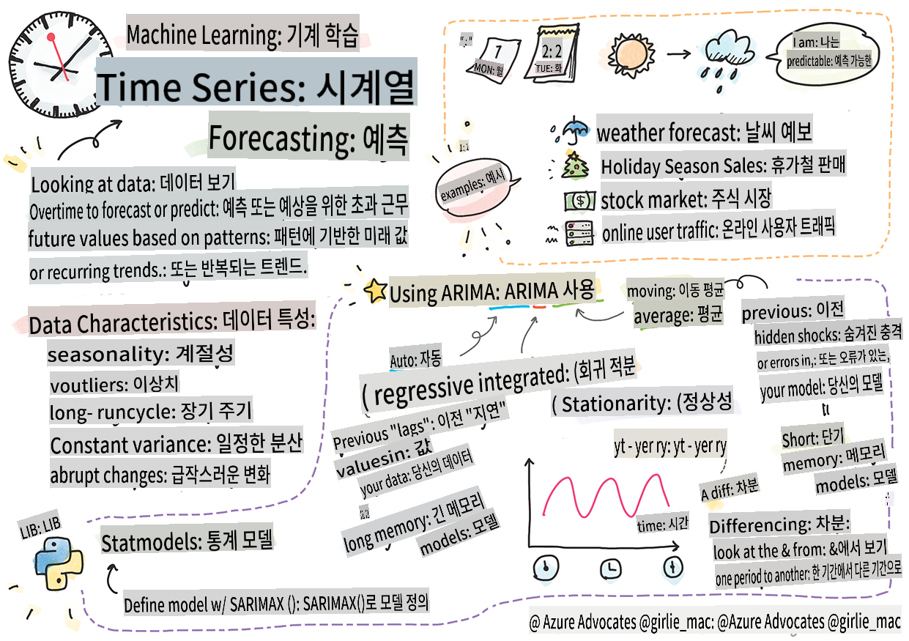
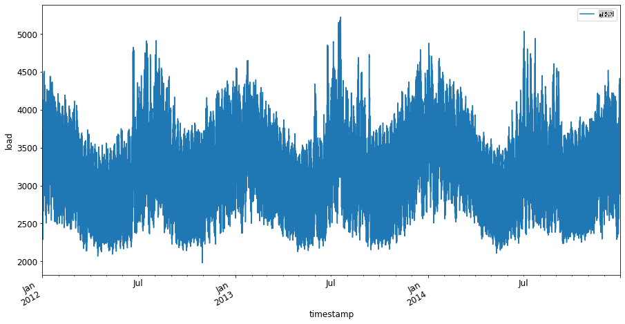

# 시계열 예측 소개



> 스케치노트 by [Tomomi Imura](https://www.twitter.com/girlie_mac)

이번 강의와 다음 강의에서는 시계열 예측에 대해 배우게 됩니다. 시계열 예측은 가격과 같은 변수의 과거 성과를 기반으로 미래의 잠재적 가치를 예측할 수 있는 흥미롭고 가치 있는 ML 과학자의 레퍼토리 중 하나입니다.

[](https://youtu.be/cBojo1hsHiI "시계열 예측 소개")

> 🎥 위 이미지를 클릭하면 시계열 예측에 관한 비디오를 볼 수 있습니다.

## [강의 전 퀴즈](https://gray-sand-07a10f403.1.azurestaticapps.net/quiz/41/)

시계열 예측은 가격 책정, 재고 관리, 공급망 문제 등 실제 비즈니스 문제에 직접 적용할 수 있어 유용하고 흥미로운 분야입니다. 딥러닝 기법이 더 나은 예측 성능을 얻기 위해 사용되기 시작했지만, 시계열 예측은 여전히 고전적인 ML 기법에 의해 크게 영향을 받습니다.

> Penn State의 유용한 시계열 커리큘럼은 [여기](https://online.stat.psu.edu/stat510/lesson/1)에서 찾을 수 있습니다.

## 소개

스마트 주차 미터기를 관리하면서 이들이 얼마나 자주 사용되고 얼마나 오랫동안 사용되는지에 대한 데이터를 제공한다고 가정해 봅시다.

> 만약 미터기의 과거 성과를 기반으로 공급과 수요의 법칙에 따라 미래 가치를 예측할 수 있다면 어떨까요?

목표를 달성하기 위해 언제 행동해야 할지를 정확하게 예측하는 것은 시계열 예측으로 해결할 수 있는 도전 과제입니다. 사람들이 주차 자리를 찾을 때 바쁜 시간에 더 많은 요금을 부과하는 것은 불쾌할 수 있지만, 이는 도로를 청소하기 위한 수익을 창출하는 확실한 방법이 될 것입니다!

시계열 알고리즘의 종류를 탐구하고 데이터를 정리하고 준비하는 노트북을 시작해 봅시다. 분석할 데이터는 GEFCom2014 예측 대회에서 가져온 것입니다. 2012년부터 2014년까지 3년간의 시간별 전기 부하 및 온도 값을 포함하고 있습니다. 전기 부하 및 온도의 역사적 패턴을 바탕으로 미래의 전기 부하 값을 예측할 수 있습니다.

이 예제에서는 역사적 부하 데이터만을 사용하여 한 단계 앞을 예측하는 방법을 배웁니다. 시작하기 전에, 무슨 일이 일어나고 있는지 이해하는 것이 유용합니다.

## 몇 가지 정의

'시계열'이라는 용어를 접할 때 여러 다른 맥락에서 사용되는 것을 이해해야 합니다.

🎓 **시계열**

수학에서 "시계열은 시간 순서로 색인화(또는 나열 또는 그래프화)된 데이터 포인트의 시리즈입니다. 가장 일반적으로, 시계열은 시간의 연속적으로 동일한 간격에서 취한 일련의 데이터입니다." 시계열의 예로는 [다우 존스 산업 평균](https://wikipedia.org/wiki/Time_series)의 일일 종가가 있습니다. 시계열 플롯 및 통계 모델링의 사용은 신호 처리, 날씨 예측, 지진 예측 등 이벤트가 발생하고 데이터 포인트가 시간에 따라 플로팅될 수 있는 분야에서 자주 접할 수 있습니다.

🎓 **시계열 분석**

시계열 분석은 위에서 언급한 시계열 데이터를 분석하는 것입니다. 시계열 데이터는 '중단된 시계열'과 같은 다양한 형태를 취할 수 있으며, 이는 중단 이벤트 전후의 시계열 진화를 감지합니다. 시계열에 필요한 분석 유형은 데이터의 특성에 따라 다릅니다. 시계열 데이터 자체는 숫자나 문자 시리즈 형태로 나타날 수 있습니다.

수행할 분석은 주파수 도메인 및 시간 도메인, 선형 및 비선형 등을 포함한 다양한 방법을 사용합니다. 이러한 유형의 데이터를 분석하는 여러 방법에 대해 [자세히 알아보기](https://www.itl.nist.gov/div898/handbook/pmc/section4/pmc4.htm).

🎓 **시계열 예측**

시계열 예측은 과거에 발생한 데이터를 기반으로 미래 값을 예측하기 위해 모델을 사용하는 것입니다. 회귀 모델을 사용하여 시계열 데이터를 탐색할 수 있지만, 시간 지수를 x 변수로 플로팅하는 경우 이러한 데이터는 특별한 유형의 모델을 사용하여 분석하는 것이 가장 좋습니다.

시계열 데이터는 선형 회귀로 분석할 수 있는 데이터와 달리 순서가 있는 관찰 목록입니다. 가장 일반적인 것은 "자기회귀 이동평균 통합"을 의미하는 ARIMA입니다.

[ARIMA 모델](https://online.stat.psu.edu/stat510/lesson/1/1.1)은 "현재 시리즈 값을 과거 값 및 과거 예측 오류와 관련짓습니다." 이러한 모델은 시간이 지남에 따라 데이터가 순서대로 나열되는 시간 도메인 데이터를 분석하는 데 가장 적합합니다.

> 여러 유형의 ARIMA 모델이 있으며, 이에 대해 [여기](https://people.duke.edu/~rnau/411arim.htm)에서 배울 수 있으며, 다음 강의에서 다룰 것입니다.

다음 강의에서는 [단변량 시계열](https://itl.nist.gov/div898/handbook/pmc/section4/pmc44.htm)을 사용하여 ARIMA 모델을 구축할 것입니다. 단변량 시계열은 시간이 지남에 따라 값이 변하는 하나의 변수에 중점을 둡니다. 이 유형의 데이터의 예로는 Mauna Loa Observatory에서 월별 CO2 농도를 기록한 [이 데이터셋](https://itl.nist.gov/div898/handbook/pmc/section4/pmc4411.htm)이 있습니다:

|  CO2   | YearMonth | Year  | Month |
| :----: | :-------: | :---: | :---: |
| 330.62 |  1975.04  | 1975  |   1   |
| 331.40 |  1975.13  | 1975  |   2   |
| 331.87 |  1975.21  | 1975  |   3   |
| 333.18 |  1975.29  | 1975  |   4   |
| 333.92 |  1975.38  | 1975  |   5   |
| 333.43 |  1975.46  | 1975  |   6   |
| 331.85 |  1975.54  | 1975  |   7   |
| 330.01 |  1975.63  | 1975  |   8   |
| 328.51 |  1975.71  | 1975  |   9   |
| 328.41 |  1975.79  | 1975  |  10   |
| 329.25 |  1975.88  | 1975  |  11   |
| 330.97 |  1975.96  | 1975  |  12   |

✅ 이 데이터셋에서 시간이 지남에 따라 변하는 변수를 식별하십시오.

## 고려해야 할 시계열 데이터 특성

시계열 데이터를 살펴볼 때, 이를 더 잘 이해하기 위해 고려해야 할 [특정 특성](https://online.stat.psu.edu/stat510/lesson/1/1.1)이 있음을 알 수 있습니다. 시계열 데이터를 분석하고자 하는 '신호'로 간주하면, 이러한 특성은 '노이즈'로 생각할 수 있습니다. 통계 기법을 사용하여 이러한 특성 중 일부를 상쇄하여 '노이즈'를 줄이는 것이 종종 필요합니다.

시계열을 작업할 때 알아야 할 몇 가지 개념은 다음과 같습니다:

🎓 **추세**

추세는 시간에 따라 측정 가능한 증가 및 감소로 정의됩니다. [더 읽어보기](https://machinelearningmastery.com/time-series-trends-in-python). 시계열의 맥락에서 추세를 사용하고 필요하다면 추세를 제거하는 방법에 관한 것입니다.

🎓 **[계절성](https://machinelearningmastery.com/time-series-seasonality-with-python/)**

계절성은 예를 들어, 판매에 영향을 미칠 수 있는 휴가 시즌과 같은 주기적인 변동으로 정의됩니다. 데이터에서 계절성을 표시하는 다양한 유형의 플롯을 [살펴보십시오](https://itl.nist.gov/div898/handbook/pmc/section4/pmc443.htm).

🎓 **이상치**

이상치는 표준 데이터 분산에서 멀리 떨어져 있습니다.

🎓 **장기 주기**

계절성과는 독립적으로, 데이터는 1년 이상 지속되는 경제 침체와 같은 장기 주기를 표시할 수 있습니다.

🎓 **일정한 분산**

시간이 지남에 따라 일부 데이터는 낮과 밤의 에너지 사용량과 같은 일정한 변동을 표시합니다.

🎓 **급격한 변화**

데이터는 추가 분석이 필요한 급격한 변화를 표시할 수 있습니다. 예를 들어, COVID로 인한 사업체의 갑작스러운 폐쇄는 데이터에 변화를 일으켰습니다.

✅ [샘플 시계열 플롯](https://www.kaggle.com/kashnitsky/topic-9-part-1-time-series-analysis-in-python)을 확인하여 몇 년 동안의 일일 인게임 통화 사용량을 보여줍니다. 이 데이터에서 위에 나열된 특성 중 일부를 식별할 수 있습니까?


## 연습 - 전력 사용량 데이터로 시작하기

과거 사용량을 기반으로 미래 전력 사용량을 예측하는 시계열 모델을 만들어 봅시다.

> 이 예제의 데이터는 GEFCom2014 예측 대회에서 가져온 것입니다. 2012년부터 2014년까지 3년간의 시간별 전기 부하 및 온도 값을 포함하고 있습니다.
>
> Tao Hong, Pierre Pinson, Shu Fan, Hamidreza Zareipour, Alberto Troccoli 및 Rob J. Hyndman, "Probabilistic energy forecasting: Global Energy Forecasting Competition 2014 and beyond", International Journal of Forecasting, vol.32, no.3, pp 896-913, July-September, 2016.

1. 이 강의의 `working` 폴더에서 _notebook.ipynb_ 파일을 엽니다. 데이터를 로드하고 시각화하는 데 도움이 될 라이브러리를 추가하는 것부터 시작하십시오.

    ```python
    import os
    import matplotlib.pyplot as plt
    from common.utils import load_data
    %matplotlib inline
    ```

    포함된 `common` folder which set up your environment and handle downloading the data.

2. Next, examine the data as a dataframe calling `load_data()` and `head()` 파일을 사용하고 있음을 유의하십시오:

    ```python
    data_dir = './data'
    energy = load_data(data_dir)[['load']]
    energy.head()
    ```

    날짜와 부하를 나타내는 두 개의 열이 있음을 알 수 있습니다:

    |                     |  load  |
    | :-----------------: | :----: |
    | 2012-01-01 00:00:00 | 2698.0 |
    | 2012-01-01 01:00:00 | 2558.0 |
    | 2012-01-01 02:00:00 | 2444.0 |
    | 2012-01-01 03:00:00 | 2402.0 |
    | 2012-01-01 04:00:00 | 2403.0 |

3. 이제 `plot()`을 호출하여 데이터를 플로팅합니다:

    ```python
    energy.plot(y='load', subplots=True, figsize=(15, 8), fontsize=12)
    plt.xlabel('timestamp', fontsize=12)
    plt.ylabel('load', fontsize=12)
    plt.show()
    ```

    

4. 이제 2014년 7월 첫 주를 입력으로 제공하여 플로팅합니다 `energy` in `[from date]: [to date]` 패턴을 사용합니다:

    ```python
    energy['2014-07-01':'2014-07-07'].plot(y='load', subplots=True, figsize=(15, 8), fontsize=12)
    plt.xlabel('timestamp', fontsize=12)
    plt.ylabel('load', fontsize=12)
    plt.show()
    ```

    

    멋진 플롯입니다! 이 플롯을 살펴보고 위에 나열된 특성 중 일부를 식별할 수 있는지 확인하십시오. 데이터를 시각화하여 무엇을 추측할 수 있을까요?

다음 강의에서는 ARIMA 모델을 만들어 예측을 수행할 것입니다.

---

## 🚀도전 과제

시계열 예측이 도움이 될 수 있는 모든 산업 및 연구 분야의 목록을 작성해 보세요. 예술, 경제학, 생태학, 소매업, 산업, 금융 등에서 이러한 기법의 응용을 생각할 수 있습니까? 어디에서 사용할 수 있을까요?

## [강의 후 퀴즈](https://gray-sand-07a10f403.1.azurestaticapps.net/quiz/42/)

## 복습 및 자기 학습

여기서는 다루지 않겠지만, 신경망은 때때로 시계열 예측의 고전적인 방법을 강화하는 데 사용됩니다. [이 기사](https://medium.com/microsoftazure/neural-networks-for-forecasting-financial-and-economic-time-series-6aca370ff412)에서 자세히 읽어보세요.

## 과제

[더 많은 시계열 시각화](assignment.md)

**면책 조항**:
이 문서는 기계 기반 AI 번역 서비스를 사용하여 번역되었습니다. 정확성을 위해 노력하고 있지만, 자동 번역에는 오류나 부정확성이 포함될 수 있습니다. 원어로 작성된 원본 문서를 권위 있는 출처로 간주해야 합니다. 중요한 정보의 경우, 전문 인간 번역을 권장합니다. 이 번역 사용으로 인해 발생하는 오해나 잘못된 해석에 대해 당사는 책임을 지지 않습니다.