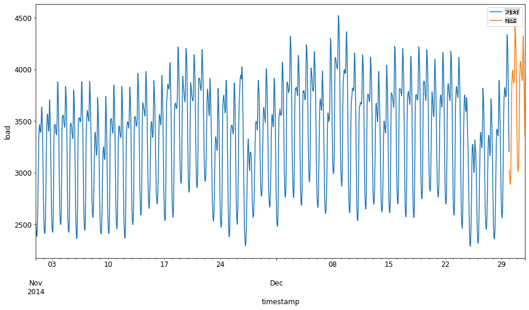
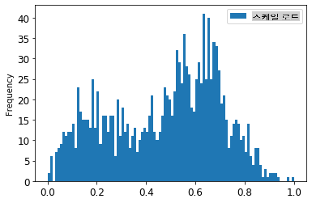

<!--
CO_OP_TRANSLATOR_METADATA:
{
  "original_hash": "2f400075e003e749fdb0d6b3b4787a99",
  "translation_date": "2025-09-03T22:43:26+00:00",
  "source_file": "7-TimeSeries/2-ARIMA/README.md",
  "language_code": "ko"
}
-->
# ARIMA를 활용한 시계열 예측

이전 강의에서 시계열 예측에 대해 간단히 배우고 특정 기간 동안 전력 부하의 변동을 보여주는 데이터를 로드했습니다.

[](https://youtu.be/IUSk-YDau10 "ARIMA 소개")

> 🎥 위 이미지를 클릭하면 ARIMA 모델에 대한 간단한 소개 영상을 볼 수 있습니다. 예제는 R로 작성되었지만 개념은 보편적입니다.

## [강의 전 퀴즈](https://gray-sand-07a10f403.1.azurestaticapps.net/quiz/43/)

## 소개

이번 강의에서는 [ARIMA: *A*uto*R*egressive *I*ntegrated *M*oving *A*verage](https://wikipedia.org/wiki/Autoregressive_integrated_moving_average)를 사용하여 모델을 구축하는 특정 방법을 알아봅니다. ARIMA 모델은 특히 [비정상성(non-stationarity)](https://wikipedia.org/wiki/Stationary_process)을 보이는 데이터를 분석하는 데 적합합니다.

## 일반적인 개념

ARIMA를 사용하려면 알아야 할 몇 가지 개념이 있습니다:

- 🎓 **정상성(Stationarity)**. 통계적 관점에서 정상성은 시간이 지나도 분포가 변하지 않는 데이터를 의미합니다. 반면, 비정상 데이터는 분석을 위해 변환해야 하는 트렌드로 인해 변동을 보입니다. 예를 들어 계절성은 데이터에 변동을 일으킬 수 있으며 '계절 차분(seasonal-differencing)' 과정을 통해 제거할 수 있습니다.

- 🎓 **[차분(Differencing)](https://wikipedia.org/wiki/Autoregressive_integrated_moving_average#Differencing)**. 차분은 비정상 데이터를 정상 데이터로 변환하여 일정하지 않은 트렌드를 제거하는 과정을 의미합니다. "차분은 시계열의 수준 변화(trend와 계절성)를 제거하여 평균을 안정화합니다." [Shixiong et al의 논문](https://arxiv.org/abs/1904.07632)

## 시계열에서의 ARIMA

ARIMA의 구성 요소를 분해하여 시계열 데이터를 모델링하고 예측하는 데 어떻게 도움이 되는지 알아봅시다.

- **AR - 자기회귀(AutoRegressive)**. 자기회귀 모델은 이름에서 알 수 있듯이 데이터의 이전 값을 분석하고 이에 대한 가정을 세우기 위해 '과거'를 살펴봅니다. 이러한 이전 값은 '시차(lags)'라고 불립니다. 예를 들어, 연필의 월별 판매 데이터를 보여주는 경우 각 월의 판매 총계는 데이터셋에서 '진화 변수(evolving variable)'로 간주됩니다. 이 모델은 "관심 있는 진화 변수가 자신의 시차(즉, 이전 값)에 대해 회귀된다는" 방식으로 구축됩니다. [wikipedia](https://wikipedia.org/wiki/Autoregressive_integrated_moving_average)

- **I - 적분(Integrated)**. 'ARMA' 모델과 달리 ARIMA의 'I'는 *[적분](https://wikipedia.org/wiki/Order_of_integration)* 측면을 나타냅니다. 비정상성을 제거하기 위해 차분 단계를 적용하여 데이터를 '적분'합니다.

- **MA - 이동 평균(Moving Average)**. [이동 평균](https://wikipedia.org/wiki/Moving-average_model) 측면은 현재 및 과거 시차 값을 관찰하여 출력 변수를 결정하는 것을 의미합니다.

결론: ARIMA는 시계열 데이터의 특별한 형태에 최대한 근접하게 모델을 맞추는 데 사용됩니다.

## 실습 - ARIMA 모델 구축

이 강의의 [_/working_](https://github.com/microsoft/ML-For-Beginners/tree/main/7-TimeSeries/2-ARIMA/working) 폴더를 열고 [_notebook.ipynb_](https://github.com/microsoft/ML-For-Beginners/blob/main/7-TimeSeries/2-ARIMA/working/notebook.ipynb) 파일을 찾으세요.

1. `statsmodels` Python 라이브러리를 로드하세요. ARIMA 모델에 필요합니다.

1. 필요한 라이브러리를 로드하세요.

1. 이제 데이터를 시각화하는 데 유용한 몇 가지 추가 라이브러리를 로드하세요:

    ```python
    import os
    import warnings
    import matplotlib.pyplot as plt
    import numpy as np
    import pandas as pd
    import datetime as dt
    import math

    from pandas.plotting import autocorrelation_plot
    from statsmodels.tsa.statespace.sarimax import SARIMAX
    from sklearn.preprocessing import MinMaxScaler
    from common.utils import load_data, mape
    from IPython.display import Image

    %matplotlib inline
    pd.options.display.float_format = '{:,.2f}'.format
    np.set_printoptions(precision=2)
    warnings.filterwarnings("ignore") # specify to ignore warning messages
    ```

1. `/data/energy.csv` 파일에서 데이터를 Pandas 데이터프레임으로 로드하고 확인하세요:

    ```python
    energy = load_data('./data')[['load']]
    energy.head(10)
    ```

1. 2012년 1월부터 2014년 12월까지의 모든 에너지 데이터를 시각화하세요. 이전 강의에서 본 데이터이므로 놀랄 필요는 없습니다:

    ```python
    energy.plot(y='load', subplots=True, figsize=(15, 8), fontsize=12)
    plt.xlabel('timestamp', fontsize=12)
    plt.ylabel('load', fontsize=12)
    plt.show()
    ```

    이제 모델을 구축해봅시다!

### 학습 및 테스트 데이터셋 생성

이제 데이터를 로드했으니 학습 및 테스트 세트로 분리할 수 있습니다. 학습 세트에서 모델을 학습시킨 후, 테스트 세트를 사용하여 모델의 정확도를 평가합니다. 모델이 미래 시점의 정보를 얻지 않도록 테스트 세트가 학습 세트보다 나중의 기간을 포함해야 합니다.

1. 2014년 9월 1일부터 10월 31일까지의 두 달 기간을 학습 세트로 할당하세요. 테스트 세트는 2014년 11월 1일부터 12월 31일까지의 두 달 기간을 포함합니다:

    ```python
    train_start_dt = '2014-11-01 00:00:00'
    test_start_dt = '2014-12-30 00:00:00'
    ```

    이 데이터는 에너지의 일일 소비를 반영하므로 강한 계절적 패턴이 있지만, 소비는 최근 며칠의 소비와 가장 유사합니다.

1. 차이를 시각화하세요:

    ```python
    energy[(energy.index < test_start_dt) & (energy.index >= train_start_dt)][['load']].rename(columns={'load':'train'}) \
        .join(energy[test_start_dt:][['load']].rename(columns={'load':'test'}), how='outer') \
        .plot(y=['train', 'test'], figsize=(15, 8), fontsize=12)
    plt.xlabel('timestamp', fontsize=12)
    plt.ylabel('load', fontsize=12)
    plt.show()
    ```

    

    따라서 데이터를 학습시키는 데 비교적 작은 시간 창을 사용하는 것이 충분할 것입니다.

    > 참고: ARIMA 모델을 적합시키는 데 사용하는 함수는 적합 과정에서 샘플 내 검증을 사용하므로 검증 데이터를 생략합니다.

### 학습을 위한 데이터 준비

이제 데이터를 필터링하고 스케일링하여 학습을 준비해야 합니다. 필요한 기간과 열만 포함하도록 원본 데이터를 필터링하고, 데이터를 0과 1 사이의 범위로 투영하여 스케일링합니다.

1. 원본 데이터셋을 필터링하여 각 세트에 필요한 기간과 'load' 열 및 날짜만 포함하세요:

    ```python
    train = energy.copy()[(energy.index >= train_start_dt) & (energy.index < test_start_dt)][['load']]
    test = energy.copy()[energy.index >= test_start_dt][['load']]

    print('Training data shape: ', train.shape)
    print('Test data shape: ', test.shape)
    ```

    데이터의 형태를 확인할 수 있습니다:

    ```output
    Training data shape:  (1416, 1)
    Test data shape:  (48, 1)
    ```

1. 데이터를 (0, 1) 범위로 스케일링하세요.

    ```python
    scaler = MinMaxScaler()
    train['load'] = scaler.fit_transform(train)
    train.head(10)
    ```

1. 원본 데이터와 스케일링된 데이터를 시각화하세요:

    ```python
    energy[(energy.index >= train_start_dt) & (energy.index < test_start_dt)][['load']].rename(columns={'load':'original load'}).plot.hist(bins=100, fontsize=12)
    train.rename(columns={'load':'scaled load'}).plot.hist(bins=100, fontsize=12)
    plt.show()
    ```

    

    > 원본 데이터

    

    > 스케일링된 데이터

1. 이제 스케일링된 데이터를 보정했으므로 테스트 데이터를 스케일링할 수 있습니다:

    ```python
    test['load'] = scaler.transform(test)
    test.head()
    ```

### ARIMA 구현

이제 ARIMA를 구현할 시간입니다! 이전에 설치한 `statsmodels` 라이브러리를 사용합니다.

다음 단계를 따라야 합니다:

   1. `SARIMAX()`를 호출하고 모델 매개변수(p, d, q 및 P, D, Q)를 전달하여 모델을 정의합니다.
   2. `fit()` 함수를 호출하여 학습 데이터를 준비합니다.
   3. `forecast()` 함수를 호출하고 예측할 단계 수(`horizon`)를 지정하여 예측을 수행합니다.

> 🎓 이러한 매개변수는 무엇을 위한 것인가요? ARIMA 모델에는 시계열의 주요 측면(계절성, 트렌드, 노이즈)을 모델링하는 데 도움이 되는 3가지 매개변수가 있습니다:

`p`: 모델의 자기회귀 측면과 관련된 매개변수로, *과거* 값을 포함합니다.
`d`: 모델의 적분 부분과 관련된 매개변수로, 시계열에 적용할 *차분*의 양에 영향을 미칩니다.
`q`: 모델의 이동 평균 부분과 관련된 매개변수입니다.

> 참고: 데이터에 계절적 측면이 있는 경우(이 데이터는 계절적 측면이 있음), 계절 ARIMA 모델(SARIMA)을 사용합니다. 이 경우 `p`, `d`, `q`와 동일한 연관성을 설명하지만 모델의 계절적 구성 요소에 해당하는 `P`, `D`, `Q` 매개변수를 사용해야 합니다.

1. 선호하는 horizon 값을 설정하세요. 3시간을 시도해봅시다:

    ```python
    # Specify the number of steps to forecast ahead
    HORIZON = 3
    print('Forecasting horizon:', HORIZON, 'hours')
    ```

    ARIMA 모델의 매개변수 값을 선택하는 것은 주관적이고 시간이 많이 걸릴 수 있습니다. [`pyramid` 라이브러리](https://alkaline-ml.com/pmdarima/0.9.0/modules/generated/pyramid.arima.auto_arima.html)의 `auto_arima()` 함수를 사용하는 것을 고려할 수 있습니다.

1. 현재는 몇 가지 수동 선택을 시도하여 적합한 모델을 찾으세요.

    ```python
    order = (4, 1, 0)
    seasonal_order = (1, 1, 0, 24)

    model = SARIMAX(endog=train, order=order, seasonal_order=seasonal_order)
    results = model.fit()

    print(results.summary())
    ```

    결과 테이블이 출력됩니다.

첫 번째 모델을 구축했습니다! 이제 이를 평가하는 방법을 찾아야 합니다.

### 모델 평가

모델을 평가하려면 이른바 `walk forward` 검증을 수행할 수 있습니다. 실제로 시계열 모델은 새로운 데이터가 제공될 때마다 재학습됩니다. 이를 통해 모델은 각 시간 단계에서 최상의 예측을 수행할 수 있습니다.

이 기술을 사용하여 시계열의 시작점에서 학습 데이터 세트로 모델을 학습시킵니다. 그런 다음 다음 시간 단계에 대한 예측을 수행합니다. 예측은 알려진 값과 비교하여 평가됩니다. 그런 다음 학습 세트가 알려진 값을 포함하도록 확장되고 이 과정이 반복됩니다.

> 참고: 학습 세트 창을 고정하여 더 효율적으로 학습할 수 있습니다. 새로운 관측값을 학습 세트에 추가할 때마다 세트의 시작점에서 관측값을 제거하세요.

이 과정은 모델이 실제로 어떻게 작동할지에 대한 더 강력한 추정을 제공합니다. 그러나 많은 모델을 생성해야 하는 계산 비용이 발생합니다. 데이터가 작거나 모델이 간단한 경우에는 허용되지만, 규모가 커지면 문제가 될 수 있습니다.

Walk-forward 검증은 시계열 모델 평가의 금표준이며, 여러분의 프로젝트에서도 권장됩니다.

1. 각 HORIZON 단계에 대해 테스트 데이터 포인트를 생성하세요.

    ```python
    test_shifted = test.copy()

    for t in range(1, HORIZON+1):
        test_shifted['load+'+str(t)] = test_shifted['load'].shift(-t, freq='H')

    test_shifted = test_shifted.dropna(how='any')
    test_shifted.head(5)
    ```

    |            |          | load | load+1 | load+2 |
    | ---------- | -------- | ---- | ------ | ------ |
    | 2014-12-30 | 00:00:00 | 0.33 | 0.29   | 0.27   |
    | 2014-12-30 | 01:00:00 | 0.29 | 0.27   | 0.27   |
    | 2014-12-30 | 02:00:00 | 0.27 | 0.27   | 0.30   |
    | 2014-12-30 | 03:00:00 | 0.27 | 0.30   | 0.41   |
    | 2014-12-30 | 04:00:00 | 0.30 | 0.41   | 0.57   |

    데이터는 horizon 포인트에 따라 수평으로 이동됩니다.

1. 테스트 데이터에 대해 이 슬라이딩 윈도우 접근 방식을 사용하여 테스트 데이터 길이 크기의 루프에서 예측을 수행하세요:

    ```python
    %%time
    training_window = 720 # dedicate 30 days (720 hours) for training

    train_ts = train['load']
    test_ts = test_shifted

    history = [x for x in train_ts]
    history = history[(-training_window):]

    predictions = list()

    order = (2, 1, 0)
    seasonal_order = (1, 1, 0, 24)

    for t in range(test_ts.shape[0]):
        model = SARIMAX(endog=history, order=order, seasonal_order=seasonal_order)
        model_fit = model.fit()
        yhat = model_fit.forecast(steps = HORIZON)
        predictions.append(yhat)
        obs = list(test_ts.iloc[t])
        # move the training window
        history.append(obs[0])
        history.pop(0)
        print(test_ts.index[t])
        print(t+1, ': predicted =', yhat, 'expected =', obs)
    ```

    학습 과정을 확인할 수 있습니다:

    ```output
    2014-12-30 00:00:00
    1 : predicted = [0.32 0.29 0.28] expected = [0.32945389435989236, 0.2900626678603402, 0.2739480752014323]

    2014-12-30 01:00:00
    2 : predicted = [0.3  0.29 0.3 ] expected = [0.2900626678603402, 0.2739480752014323, 0.26812891674127126]

    2014-12-30 02:00:00
    3 : predicted = [0.27 0.28 0.32] expected = [0.2739480752014323, 0.26812891674127126, 0.3025962399283795]
    ```

1. 실제 부하와 예측값을 비교하세요:

    ```python
    eval_df = pd.DataFrame(predictions, columns=['t+'+str(t) for t in range(1, HORIZON+1)])
    eval_df['timestamp'] = test.index[0:len(test.index)-HORIZON+1]
    eval_df = pd.melt(eval_df, id_vars='timestamp', value_name='prediction', var_name='h')
    eval_df['actual'] = np.array(np.transpose(test_ts)).ravel()
    eval_df[['prediction', 'actual']] = scaler.inverse_transform(eval_df[['prediction', 'actual']])
    eval_df.head()
    ```

    출력
    |     |            | timestamp | h   | prediction | actual   |
    | --- | ---------- | --------- | --- | ---------- | -------- |
    | 0   | 2014-12-30 | 00:00:00  | t+1 | 3,008.74   | 3,023.00 |
    | 1   | 2014-12-30 | 01:00:00  | t+1 | 2,955.53   | 2,935.00 |
    | 2   | 2014-12-30 | 02:00:00  | t+1 | 2,900.17   | 2,899.00 |
    | 3   | 2014-12-30 | 03:00:00  | t+1 | 2,917.69   | 2,886.00 |
    | 4   | 2014-12-30 | 04:00:00  | t+1 | 2,946.99   | 2,963.00 |

    시간별 데이터의 예측값을 실제 부하와 비교하세요. 얼마나 정확한가요?

### 모델 정확도 확인

모든 예측에 대해 평균 절대 백분율 오차(MAPE)를 테스트하여 모델의 정확도를 확인하세요.
> **🧮 수학을 보여주세요**
>
> 
>
> [MAPE](https://www.linkedin.com/pulse/what-mape-mad-msd-time-series-allameh-statistics/)는 위의 공식으로 정의된 비율로 예측 정확도를 나타냅니다. 실제 값과 예측 값의 차이는 실제 값으로 나누어집니다.  
> "이 계산에서 절대값은 모든 예측된 시점에 대해 합산되고, 적합된 점의 수 n으로 나누어집니다." [wikipedia](https://wikipedia.org/wiki/Mean_absolute_percentage_error)
1. 코드로 방정식 표현하기:

    ```python
    if(HORIZON > 1):
        eval_df['APE'] = (eval_df['prediction'] - eval_df['actual']).abs() / eval_df['actual']
        print(eval_df.groupby('h')['APE'].mean())
    ```

1. 한 단계의 MAPE 계산하기:

    ```python
    print('One step forecast MAPE: ', (mape(eval_df[eval_df['h'] == 't+1']['prediction'], eval_df[eval_df['h'] == 't+1']['actual']))*100, '%')
    ```

    한 단계 예측 MAPE:  0.5570581332313952 %

1. 다단계 예측 MAPE 출력하기:

    ```python
    print('Multi-step forecast MAPE: ', mape(eval_df['prediction'], eval_df['actual'])*100, '%')
    ```

    ```output
    Multi-step forecast MAPE:  1.1460048657704118 %
    ```

    낮은 숫자가 좋습니다: MAPE가 10이라면 예측이 10% 정도 벗어났다는 것을 의미합니다.

1. 하지만 항상 그렇듯이, 이런 정확도 측정은 시각적으로 보는 것이 더 쉽습니다. 이를 그래프로 그려봅시다:

    ```python
     if(HORIZON == 1):
        ## Plotting single step forecast
        eval_df.plot(x='timestamp', y=['actual', 'prediction'], style=['r', 'b'], figsize=(15, 8))

    else:
        ## Plotting multi step forecast
        plot_df = eval_df[(eval_df.h=='t+1')][['timestamp', 'actual']]
        for t in range(1, HORIZON+1):
            plot_df['t+'+str(t)] = eval_df[(eval_df.h=='t+'+str(t))]['prediction'].values

        fig = plt.figure(figsize=(15, 8))
        ax = plt.plot(plot_df['timestamp'], plot_df['actual'], color='red', linewidth=4.0)
        ax = fig.add_subplot(111)
        for t in range(1, HORIZON+1):
            x = plot_df['timestamp'][(t-1):]
            y = plot_df['t+'+str(t)][0:len(x)]
            ax.plot(x, y, color='blue', linewidth=4*math.pow(.9,t), alpha=math.pow(0.8,t))

        ax.legend(loc='best')

    plt.xlabel('timestamp', fontsize=12)
    plt.ylabel('load', fontsize=12)
    plt.show()
    ```

    

🏆 매우 훌륭한 그래프입니다. 정확도가 좋은 모델을 보여주고 있네요. 잘하셨습니다!

---

## 🚀도전 과제

시간 시계열 모델의 정확도를 테스트하는 다양한 방법을 탐구해보세요. 이번 강의에서는 MAPE에 대해 다뤘지만, 다른 방법도 있을까요? 이를 조사하고 주석을 달아보세요. 도움이 될 만한 문서는 [여기](https://otexts.com/fpp2/accuracy.html)에서 찾을 수 있습니다.

## [강의 후 퀴즈](https://gray-sand-07a10f403.1.azurestaticapps.net/quiz/44/)

## 복습 및 자기 학습

이번 강의에서는 ARIMA를 사용한 시간 시계열 예측의 기본만 다룹니다. [이 저장소](https://microsoft.github.io/forecasting/)와 다양한 모델 유형을 탐구하여 시간 시계열 모델을 구축하는 다른 방법을 배우며 지식을 심화해보세요.

## 과제

[새로운 ARIMA 모델](assignment.md)

---

**면책 조항**:  
이 문서는 AI 번역 서비스 [Co-op Translator](https://github.com/Azure/co-op-translator)를 사용하여 번역되었습니다. 정확성을 위해 최선을 다하고 있으나, 자동 번역에는 오류나 부정확성이 포함될 수 있습니다. 원본 문서의 원어 버전을 신뢰할 수 있는 권위 있는 자료로 간주해야 합니다. 중요한 정보의 경우, 전문적인 인간 번역을 권장합니다. 이 번역 사용으로 인해 발생하는 오해나 잘못된 해석에 대해 책임을 지지 않습니다.