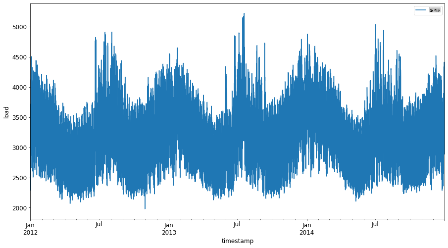
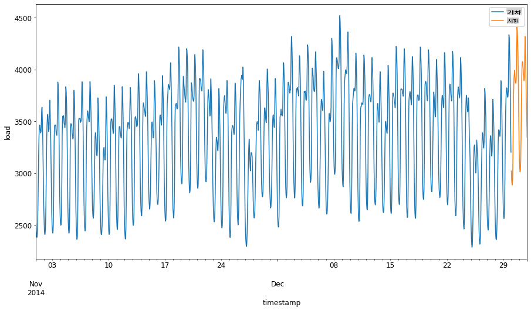
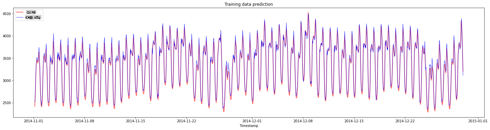
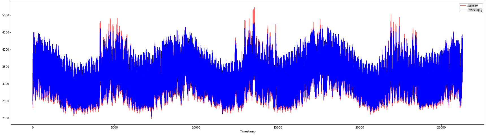

# 서포트 벡터 회귀 모델을 사용한 시계열 예측

이전 강의에서 ARIMA 모델을 사용하여 시계열 예측을 하는 방법을 배웠습니다. 이번에는 연속 데이터를 예측하는 데 사용되는 회귀 모델인 서포트 벡터 회귀 모델을 살펴보겠습니다.

## [사전 퀴즈](https://gray-sand-07a10f403.1.azurestaticapps.net/quiz/51/)

## 소개

이번 강의에서는 회귀를 위한 [**SVM**: **S**upport **V**ector **M**achine](https://en.wikipedia.org/wiki/Support-vector_machine), 즉 **SVR: Support Vector Regressor** 모델을 구축하는 방법을 알아보겠습니다.

### 시계열에서의 SVR [^1]

시계열 예측에서 SVR의 중요성을 이해하기 전에 알아야 할 몇 가지 중요한 개념이 있습니다:

- **회귀:** 주어진 입력 집합에서 연속 값을 예측하는 지도 학습 기술입니다. 아이디어는 피처 공간에서 최대한 많은 데이터 포인트를 포함하는 곡선(또는 선)을 맞추는 것입니다. [여기를 클릭](https://en.wikipedia.org/wiki/Regression_analysis)하여 더 많은 정보를 확인하세요.
- **서포트 벡터 머신 (SVM):** 분류, 회귀 및 이상치 감지에 사용되는 지도 학습 모델의 한 유형입니다. 모델은 피처 공간의 초평면이며, 분류의 경우 경계로 작용하고 회귀의 경우 최적의 선으로 작용합니다. SVM에서는 일반적으로 커널 함수를 사용하여 데이터셋을 더 높은 차원의 공간으로 변환하여 쉽게 분리할 수 있게 합니다. [여기를 클릭](https://en.wikipedia.org/wiki/Support-vector_machine)하여 SVM에 대한 더 많은 정보를 확인하세요.
- **서포트 벡터 회귀 (SVR):** SVM의 한 유형으로, 최대한 많은 데이터 포인트를 포함하는 최적의 선(이 경우 SVM의 초평면)을 찾습니다.

### 왜 SVR인가요? [^1]

지난 강의에서 시계열 데이터를 예측하는 데 매우 성공적인 통계적 선형 방법인 ARIMA에 대해 배웠습니다. 그러나 많은 경우 시계열 데이터에는 선형 모델로 매핑할 수 없는 *비선형성*이 포함되어 있습니다. 이러한 경우, 회귀 작업에서 데이터의 비선형성을 고려할 수 있는 SVM의 능력이 시계열 예측에서 SVR을 성공적으로 만듭니다.

## 실습 - SVR 모델 구축

데이터 준비를 위한 첫 번째 몇 단계는 [ARIMA](https://github.com/microsoft/ML-For-Beginners/tree/main/7-TimeSeries/2-ARIMA) 강의와 동일합니다.

이번 강의의 [_/working_](https://github.com/microsoft/ML-For-Beginners/tree/main/7-TimeSeries/3-SVR/working) 폴더를 열고 [_notebook.ipynb_](https://github.com/microsoft/ML-For-Beginners/blob/main/7-TimeSeries/3-SVR/working/notebook.ipynb) 파일을 찾으세요.[^2]

1. 노트북을 실행하고 필요한 라이브러리를 가져옵니다: [^2]

   ```python
   import sys
   sys.path.append('../../')
   ```

   ```python
   import os
   import warnings
   import matplotlib.pyplot as plt
   import numpy as np
   import pandas as pd
   import datetime as dt
   import math
   
   from sklearn.svm import SVR
   from sklearn.preprocessing import MinMaxScaler
   from common.utils import load_data, mape
   ```

2. `/data/energy.csv` 파일에서 데이터를 Pandas 데이터프레임으로 로드하고 확인합니다: [^2]

   ```python
   energy = load_data('../../data')[['load']]
   ```

3. 2012년 1월부터 2014년 12월까지의 모든 에너지 데이터를 플로팅합니다: [^2]

   ```python
   energy.plot(y='load', subplots=True, figsize=(15, 8), fontsize=12)
   plt.xlabel('timestamp', fontsize=12)
   plt.ylabel('load', fontsize=12)
   plt.show()
   ```

   

   이제, SVR 모델을 구축해봅시다.

### 학습 및 테스트 데이터셋 생성

이제 데이터를 로드했으므로 학습 세트와 테스트 세트로 분리할 수 있습니다. 그런 다음 SVR에 필요한 시계열 기반 데이터셋을 만들기 위해 데이터를 재구성합니다. 모델을 학습 세트에 대해 학습시키고, 학습이 끝나면 학습 세트, 테스트 세트 및 전체 데이터셋에 대한 정확도를 평가하여 전체 성능을 확인합니다. 모델이 미래의 시간대를 미리 알지 못하도록 하기 위해 테스트 세트가 학습 세트 이후의 기간을 포함하도록 해야 합니다[^2] (이를 *과적합*이라고 합니다).

1. 2014년 9월 1일부터 10월 31일까지의 두 달 기간을 학습 세트에 할당합니다. 테스트 세트는 2014년 11월 1일부터 12월 31일까지의 두 달 기간을 포함합니다: [^2]

   ```python
   train_start_dt = '2014-11-01 00:00:00'
   test_start_dt = '2014-12-30 00:00:00'
   ```

2. 차이점을 시각화합니다: [^2]

   ```python
   energy[(energy.index < test_start_dt) & (energy.index >= train_start_dt)][['load']].rename(columns={'load':'train'}) \
       .join(energy[test_start_dt:][['load']].rename(columns={'load':'test'}), how='outer') \
       .plot(y=['train', 'test'], figsize=(15, 8), fontsize=12)
   plt.xlabel('timestamp', fontsize=12)
   plt.ylabel('load', fontsize=12)
   plt.show()
   ```

   

### 학습을 위한 데이터 준비

이제 데이터를 필터링하고 스케일링하여 학습을 위한 데이터를 준비해야 합니다. 데이터셋을 필요한 기간과 열만 포함하도록 필터링하고, 데이터를 0,1 구간으로 투영하기 위해 스케일링합니다.

1. 원본 데이터셋을 앞서 언급한 기간별로 필터링하고 필요한 열 'load'와 날짜만 포함합니다: [^2]

   ```python
   train = energy.copy()[(energy.index >= train_start_dt) & (energy.index < test_start_dt)][['load']]
   test = energy.copy()[energy.index >= test_start_dt][['load']]
   
   print('Training data shape: ', train.shape)
   print('Test data shape: ', test.shape)
   ```

   ```output
   Training data shape:  (1416, 1)
   Test data shape:  (48, 1)
   ```
   
2. 학습 데이터를 (0, 1) 범위로 스케일링합니다: [^2]

   ```python
   scaler = MinMaxScaler()
   train['load'] = scaler.fit_transform(train)
   ```
   
4. 이제 테스트 데이터를 스케일링합니다: [^2]

   ```python
   test['load'] = scaler.transform(test)
   ```

### 시계열 기반 데이터 생성 [^1]

SVR을 위해 입력 데이터를 `[batch, timesteps]`. So, you reshape the existing `train_data` and `test_data` 형태로 변환하여 시계열을 나타내는 새로운 차원을 추가합니다.

```python
# Converting to numpy arrays
train_data = train.values
test_data = test.values
```

이 예제에서는 `timesteps = 5`를 사용합니다. 따라서 모델의 입력은 처음 4개의 시계열 데이터이며, 출력은 5번째 시계열 데이터가 됩니다.

```python
timesteps=5
```

중첩된 리스트 내포를 사용하여 학습 데이터를 2D 텐서로 변환합니다:

```python
train_data_timesteps=np.array([[j for j in train_data[i:i+timesteps]] for i in range(0,len(train_data)-timesteps+1)])[:,:,0]
train_data_timesteps.shape
```

```output
(1412, 5)
```

테스트 데이터를 2D 텐서로 변환합니다:

```python
test_data_timesteps=np.array([[j for j in test_data[i:i+timesteps]] for i in range(0,len(test_data)-timesteps+1)])[:,:,0]
test_data_timesteps.shape
```

```output
(44, 5)
```

학습 및 테스트 데이터에서 입력과 출력을 선택합니다:

```python
x_train, y_train = train_data_timesteps[:,:timesteps-1],train_data_timesteps[:,[timesteps-1]]
x_test, y_test = test_data_timesteps[:,:timesteps-1],test_data_timesteps[:,[timesteps-1]]

print(x_train.shape, y_train.shape)
print(x_test.shape, y_test.shape)
```

```output
(1412, 4) (1412, 1)
(44, 4) (44, 1)
```

### SVR 구현 [^1]

이제 SVR을 구현할 시간입니다. 이 구현에 대해 더 알고 싶다면 [이 문서](https://scikit-learn.org/stable/modules/generated/sklearn.svm.SVR.html)를 참조하세요. 우리의 구현에서는 다음 단계를 따릅니다:

  1. `SVR()` and passing in the model hyperparameters: kernel, gamma, c and epsilon
  2. Prepare the model for the training data by calling the `fit()` function
  3. Make predictions calling the `predict()` 함수를 호출하여 모델을 정의합니다.

이제 SVR 모델을 만듭니다. 여기서는 [RBF 커널](https://scikit-learn.org/stable/modules/svm.html#parameters-of-the-rbf-kernel)을 사용하고, 하이퍼파라미터 gamma, C 및 epsilon을 각각 0.5, 10 및 0.05로 설정합니다.

```python
model = SVR(kernel='rbf',gamma=0.5, C=10, epsilon = 0.05)
```

#### 학습 데이터에 모델 적합 [^1]

```python
model.fit(x_train, y_train[:,0])
```

```output
SVR(C=10, cache_size=200, coef0=0.0, degree=3, epsilon=0.05, gamma=0.5,
    kernel='rbf', max_iter=-1, shrinking=True, tol=0.001, verbose=False)
```

#### 모델 예측 수행 [^1]

```python
y_train_pred = model.predict(x_train).reshape(-1,1)
y_test_pred = model.predict(x_test).reshape(-1,1)

print(y_train_pred.shape, y_test_pred.shape)
```

```output
(1412, 1) (44, 1)
```

SVR을 구축했습니다! 이제 이를 평가해야 합니다.

### 모델 평가 [^1]

평가를 위해 먼저 데이터를 원래 스케일로 되돌립니다. 그런 다음 성능을 확인하기 위해 원본 및 예측된 시계열 플롯을 그리고, MAPE 결과도 출력합니다.

예측된 데이터와 원본 데이터를 스케일링합니다:

```python
# Scaling the predictions
y_train_pred = scaler.inverse_transform(y_train_pred)
y_test_pred = scaler.inverse_transform(y_test_pred)

print(len(y_train_pred), len(y_test_pred))
```

```python
# Scaling the original values
y_train = scaler.inverse_transform(y_train)
y_test = scaler.inverse_transform(y_test)

print(len(y_train), len(y_test))
```

#### 학습 및 테스트 데이터에서 모델 성능 확인 [^1]

데이터셋에서 타임스탬프를 추출하여 플롯의 x축에 표시합니다. 첫 번째 ```timesteps-1``` 값을 첫 번째 출력의 입력으로 사용하고 있으므로 출력의 타임스탬프는 그 이후부터 시작됩니다.

```python
train_timestamps = energy[(energy.index < test_start_dt) & (energy.index >= train_start_dt)].index[timesteps-1:]
test_timestamps = energy[test_start_dt:].index[timesteps-1:]

print(len(train_timestamps), len(test_timestamps))
```

```output
1412 44
```

학습 데이터에 대한 예측을 플롯합니다:

```python
plt.figure(figsize=(25,6))
plt.plot(train_timestamps, y_train, color = 'red', linewidth=2.0, alpha = 0.6)
plt.plot(train_timestamps, y_train_pred, color = 'blue', linewidth=0.8)
plt.legend(['Actual','Predicted'])
plt.xlabel('Timestamp')
plt.title("Training data prediction")
plt.show()
```



학습 데이터에 대한 MAPE 출력

```python
print('MAPE for training data: ', mape(y_train_pred, y_train)*100, '%')
```

```output
MAPE for training data: 1.7195710200875551 %
```

테스트 데이터에 대한 예측을 플롯합니다

```python
plt.figure(figsize=(10,3))
plt.plot(test_timestamps, y_test, color = 'red', linewidth=2.0, alpha = 0.6)
plt.plot(test_timestamps, y_test_pred, color = 'blue', linewidth=0.8)
plt.legend(['Actual','Predicted'])
plt.xlabel('Timestamp')
plt.show()
```


테스트 데이터에 대한 MAPE 출력

```python
print('MAPE for testing data: ', mape(y_test_pred, y_test)*100, '%')
```

```output
MAPE for testing data:  1.2623790187854018 %
```

🏆 테스트 데이터셋에서 매우 좋은 결과를 얻었습니다!

### 전체 데이터셋에서 모델 성능 확인 [^1]

```python
# Extracting load values as numpy array
data = energy.copy().values

# Scaling
data = scaler.transform(data)

# Transforming to 2D tensor as per model input requirement
data_timesteps=np.array([[j for j in data[i:i+timesteps]] for i in range(0,len(data)-timesteps+1)])[:,:,0]
print("Tensor shape: ", data_timesteps.shape)

# Selecting inputs and outputs from data
X, Y = data_timesteps[:,:timesteps-1],data_timesteps[:,[timesteps-1]]
print("X shape: ", X.shape,"\nY shape: ", Y.shape)
```

```output
Tensor shape:  (26300, 5)
X shape:  (26300, 4) 
Y shape:  (26300, 1)
```

```python
# Make model predictions
Y_pred = model.predict(X).reshape(-1,1)

# Inverse scale and reshape
Y_pred = scaler.inverse_transform(Y_pred)
Y = scaler.inverse_transform(Y)
```

```python
plt.figure(figsize=(30,8))
plt.plot(Y, color = 'red', linewidth=2.0, alpha = 0.6)
plt.plot(Y_pred, color = 'blue', linewidth=0.8)
plt.legend(['Actual','Predicted'])
plt.xlabel('Timestamp')
plt.show()
```



```python
print('MAPE: ', mape(Y_pred, Y)*100, '%')
```

```output
MAPE:  2.0572089029888656 %
```

🏆 매우 정확한 모델을 보여주는 멋진 플롯입니다. 잘했습니다!

---

## 🚀도전 과제

- 모델을 생성할 때 하이퍼파라미터(gamma, C, epsilon)를 조정하고 데이터를 평가하여 테스트 데이터에서 가장 좋은 결과를 제공하는 하이퍼파라미터 세트를 찾아보세요. 이러한 하이퍼파라미터에 대해 더 알고 싶다면 [여기](https://scikit-learn.org/stable/modules/svm.html#parameters-of-the-rbf-kernel) 문서를 참조하세요.
- 모델에 대해 다른 커널 함수를 사용해보고 데이터셋에서 그 성능을 분석해보세요. 도움이 되는 문서는 [여기](https://scikit-learn.org/stable/modules/svm.html#kernel-functions)에서 찾을 수 있습니다.
- 모델이 예측을 위해 돌아보는 `timesteps` 값을 다르게 설정해보세요.

## [강의 후 퀴즈](https://gray-sand-07a10f403.1.azurestaticapps.net/quiz/52/)

## 복습 및 자기 학습

이번 강의에서는 시계열 예측을 위한 SVR의 적용을 소개했습니다. SVR에 대해 더 알고 싶다면 [이 블로그](https://www.analyticsvidhya.com/blog/2020/03/support-vector-regression-tutorial-for-machine-learning/)를 참조하세요. 이 [scikit-learn 문서](https://scikit-learn.org/stable/modules/svm.html)는 일반적인 SVM, [SVR](https://scikit-learn.org/stable/modules/svm.html#regression) 및 사용할 수 있는 다양한 [커널 함수](https://scikit-learn.org/stable/modules/svm.html#kernel-functions)와 그 매개변수에 대한 보다 포괄적인 설명을 제공합니다.

## 과제

[새로운 SVR 모델](assignment.md)

## 공로

[^1]: 이 섹션의 텍스트, 코드 및 출력은 [@AnirbanMukherjeeXD](https://github.com/AnirbanMukherjeeXD)가 기여했습니다.
[^2]: 이 섹션의 텍스트, 코드 및 출력은 [ARIMA](https://github.com/microsoft/ML-For-Beginners/tree/main/7-TimeSeries/2-ARIMA)에서 가져왔습니다.

**면책 조항**:
이 문서는 기계 기반 AI 번역 서비스를 사용하여 번역되었습니다. 정확성을 위해 노력하고 있지만, 자동 번역에는 오류나 부정확성이 포함될 수 있습니다. 원어로 작성된 원본 문서를 권위 있는 자료로 간주해야 합니다. 중요한 정보의 경우, 전문 인간 번역을 권장합니다. 이 번역의 사용으로 인해 발생하는 오해나 오역에 대해서는 책임을 지지 않습니다.