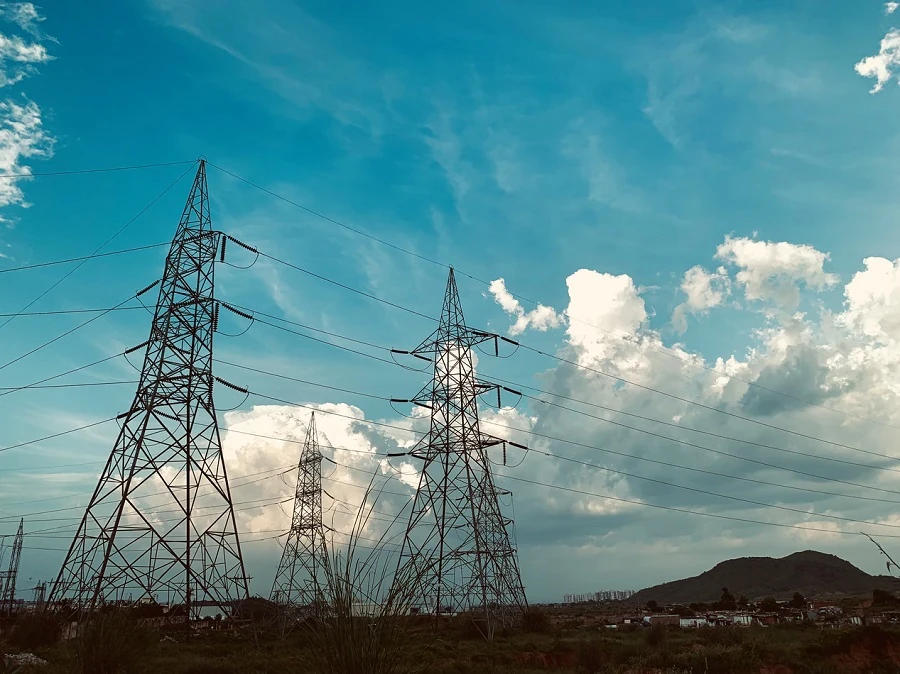

# 시계열 예측 소개

시계열 예측이란 무엇일까요? 과거의 추세를 분석하여 미래의 사건을 예측하는 것입니다.

## 지역 주제: 전 세계 전기 사용량 ✨

이 두 수업에서는 기계 학습 분야에서는 다소 덜 알려져 있지만 산업 및 비즈니스 응용 분야 등에서 매우 가치 있는 시계열 예측을 소개합니다. 신경망을 사용하여 이러한 모델의 유용성을 향상시킬 수 있지만, 과거를 기반으로 미래 성능을 예측하는 모델로서 고전적인 기계 학습의 관점에서 공부할 것입니다.

우리의 지역 초점은 전 세계 전기 사용량으로, 과거 부하 패턴을 기반으로 미래 전력 사용량을 예측하는 것에 대해 배우기에 흥미로운 데이터셋입니다. 이러한 예측이 비즈니스 환경에서 얼마나 유용할 수 있는지 알 수 있습니다.

라자스탄 도로의 전기 탑 사진, [Peddi Sai hrithik](https://unsplash.com/@shutter_log?utm_source=unsplash&utm_medium=referral&utm_content=creditCopyText) 제공, [Unsplash](https://unsplash.com/s/photos/electric-india?utm_source=unsplash&utm_medium=referral&utm_content=creditCopyText)

## 수업 목록

1. [시계열 예측 소개](1-Introduction/README.md)
2. [ARIMA 시계열 모델 구축](2-ARIMA/README.md)
3. [시계열 예측을 위한 서포트 벡터 회귀 모델 구축](3-SVR/README.md)

## 크레딧

"시계열 예측 소개"는 ⚡️ [Francesca Lazzeri](https://twitter.com/frlazzeri)와 [Jen Looper](https://twitter.com/jenlooper)에 의해 작성되었습니다. 노트북은 처음에 Francesca Lazzeri가 작성한 [Azure "Deep Learning For Time Series" 저장소](https://github.com/Azure/DeepLearningForTimeSeriesForecasting)에 온라인으로 공개되었습니다. SVR 수업은 [Anirban Mukherjee](https://github.com/AnirbanMukherjeeXD)이 작성했습니다.

---

<!-- CO-OP TRANSLATOR DISCLAIMER START -->
**면책 조항**:
이 문서는 AI 번역 서비스 [Co-op Translator](https://github.com/Azure/co-op-translator)를 사용하여 번역되었습니다. 정확성을 기하기 위해 노력하고 있으나, 자동 번역은 오류나 부정확한 부분이 있을 수 있음을 유의하시기 바랍니다. 원본 문서의 원어본이 권위 있는 자료로 간주되어야 합니다. 중요한 정보의 경우, 전문가의 인간 번역을 권장합니다. 이 번역 사용으로 인해 발생하는 오해나 잘못된 해석에 대해 당사는 책임을 지지 않습니다.
<!-- CO-OP TRANSLATOR DISCLAIMER END -->