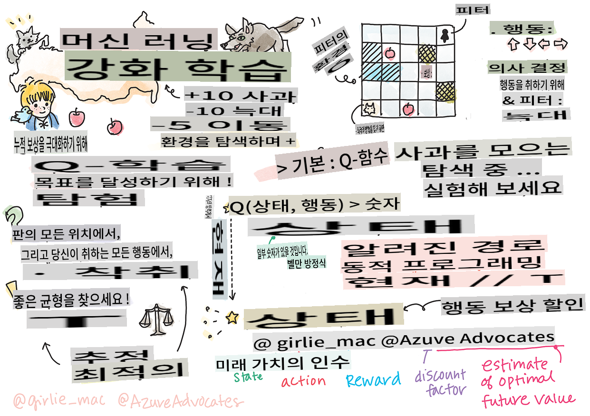

# 강화 학습과 Q-러닝 소개


> 스케치노트: [Tomomi Imura](https://www.twitter.com/girlie_mac)

강화 학습에는 에이전트, 몇 가지 상태, 그리고 상태별로 실행할 수 있는 행동 집합이라는 세 가지 중요한 개념이 있습니다. 특정 상태에서 행동을 실행하면 에이전트는 보상을 받습니다. 다시 슈퍼 마리오 게임을 상상해 보세요. 당신은 마리오입니다. 게임 레벨에 있으며, 절벽 가장자리에 서 있습니다. 당신 위에는 동전이 있습니다. 당신이 마리오로서 특정 위치에 있는 상태가 바로 당신의 상태입니다. 오른쪽으로 한 걸음 이동하는 행동을 하면 절벽 아래로 떨어지게 되어 낮은 점수를 받게 됩니다. 그러나 점프 버튼을 누르면 점수를 얻고 살아남을 수 있습니다. 이것은 긍정적인 결과이며, 긍정적인 점수를 받을 수 있습니다.

강화 학습과 시뮬레이터(게임)를 사용하여 게임을 최대한 오래 살아남고 최대한 많은 점수를 얻기 위해 게임을 하는 방법을 배울 수 있습니다.

[](https://www.youtube.com/watch?v=lDq_en8RNOo)

> 🎥 위 이미지를 클릭하여 Dmitry가 강화 학습에 대해 이야기하는 것을 들어보세요.

## [강의 전 퀴즈](https://gray-sand-07a10f403.1.azurestaticapps.net/quiz/45/)

## 사전 준비 및 설정

이번 강의에서는 파이썬 코드로 실험을 해보겠습니다. 이 강의의 Jupyter Notebook 코드를 컴퓨터나 클라우드에서 실행할 수 있어야 합니다.

[강의 노트북](https://github.com/microsoft/ML-For-Beginners/blob/main/8-Reinforcement/1-QLearning/notebook.ipynb)을 열어 이 강의를 따라가며 빌드할 수 있습니다.

> **참고:** 클라우드에서 이 코드를 열 경우, 노트북 코드에서 사용되는 [`rlboard.py`](https://github.com/microsoft/ML-For-Beginners/blob/main/8-Reinforcement/1-QLearning/rlboard.py) 파일도 가져와야 합니다. 이 파일을 노트북과 동일한 디렉토리에 추가하세요.

## 소개

이번 강의에서는 러시아 작곡가 [Sergei Prokofiev](https://en.wikipedia.org/wiki/Sergei_Prokofiev)의 음악 동화 **[Peter and the Wolf](https://en.wikipedia.org/wiki/Peter_and_the_Wolf)**에서 영감을 받아, Peter가 환경을 탐험하고 맛있는 사과를 모으고 늑대를 피하는 방법을 **강화 학습**을 사용해 알아보겠습니다.

**강화 학습**(RL)은 여러 실험을 통해 **에이전트**가 특정 **환경**에서 최적의 행동을 배우게 하는 학습 기술입니다. 이 환경에서 에이전트는 **보상 함수**로 정의된 **목표**를 가지고 있어야 합니다.

## 환경

간단하게 Peter의 세계를 `width` x `height` 크기의 정사각형 보드로 생각해봅시다:


이 보드의 각 셀은 다음 중 하나일 수 있습니다:

* **땅**, Peter와 다른 생물들이 걸을 수 있는 곳.
* **물**, 당연히 걸을 수 없는 곳.
* **나무** 또는 **풀**, 쉴 수 있는 곳.
* **사과**, Peter가 먹기 위해 찾고 싶어하는 것.
* **늑대**, 위험하므로 피해야 하는 것.

이 환경과 작업하기 위한 코드를 포함하는 별도의 파이썬 모듈 [`rlboard.py`](https://github.com/microsoft/ML-For-Beginners/blob/main/8-Reinforcement/1-QLearning/rlboard.py)이 있습니다. 이 코드는 개념 이해에 중요하지 않으므로 모듈을 가져와 샘플 보드를 생성하는 데 사용하겠습니다 (코드 블록 1):

```python
from rlboard import *

width, height = 8,8
m = Board(width,height)
m.randomize(seed=13)
m.plot()
```

이 코드는 위와 유사한 환경 그림을 출력해야 합니다.

## 행동과 정책

우리 예제에서 Peter의 목표는 늑대와 다른 장애물을 피하면서 사과를 찾는 것입니다. 이를 위해 그는 사과를 찾을 때까지 주위를 돌아다닐 수 있습니다.

따라서 어떤 위치에서든 다음 행동 중 하나를 선택할 수 있습니다: 위, 아래, 왼쪽, 오른쪽.

이 행동들을 사전으로 정의하고 해당 좌표 변경 쌍에 매핑하겠습니다. 예를 들어, 오른쪽으로 이동하는 것은 (`R`) would correspond to a pair `(1,0)`. (코드 블록 2):

```python
actions = { "U" : (0,-1), "D" : (0,1), "L" : (-1,0), "R" : (1,0) }
action_idx = { a : i for i,a in enumerate(actions.keys()) }
```

요약하면, 이 시나리오의 전략과 목표는 다음과 같습니다:

- **전략**은 이른바 **정책**으로 정의됩니다. 정책은 주어진 상태에서 행동을 반환하는 함수입니다. 우리의 경우 문제의 상태는 플레이어의 현재 위치를 포함한 보드로 나타납니다.

- **목표**는 강화 학습을 통해 문제를 효율적으로 해결할 수 있는 좋은 정책을 배우는 것입니다. 그러나 기준선으로서 가장 간단한 정책인 **랜덤 워크**를 고려해보겠습니다.

## 랜덤 워크

먼저 랜덤 워크 전략을 구현하여 문제를 해결해 보겠습니다. 랜덤 워크에서는 허용된 행동 중에서 다음 행동을 무작위로 선택하여 사과에 도달할 때까지 진행합니다 (코드 블록 3).

1. 아래 코드를 사용하여 랜덤 워크를 구현하세요:

    ```python
    def random_policy(m):
        return random.choice(list(actions))
    
    def walk(m,policy,start_position=None):
        n = 0 # number of steps
        # set initial position
        if start_position:
            m.human = start_position 
        else:
            m.random_start()
        while True:
            if m.at() == Board.Cell.apple:
                return n # success!
            if m.at() in [Board.Cell.wolf, Board.Cell.water]:
                return -1 # eaten by wolf or drowned
            while True:
                a = actions[policy(m)]
                new_pos = m.move_pos(m.human,a)
                if m.is_valid(new_pos) and m.at(new_pos)!=Board.Cell.water:
                    m.move(a) # do the actual move
                    break
            n+=1
    
    walk(m,random_policy)
    ```

    `walk` 호출은 실행 경로의 길이를 반환해야 하며, 이는 실행마다 다를 수 있습니다.

1. 여러 번(예: 100번) 걷기 실험을 실행하고 결과 통계를 출력하세요 (코드 블록 4):

    ```python
    def print_statistics(policy):
        s,w,n = 0,0,0
        for _ in range(100):
            z = walk(m,policy)
            if z<0:
                w+=1
            else:
                s += z
                n += 1
        print(f"Average path length = {s/n}, eaten by wolf: {w} times")
    
    print_statistics(random_policy)
    ```

    경로의 평균 길이가 약 30-40 단계로, 이는 사과까지의 평균 거리가 약 5-6 단계임을 고려하면 꽤 많은 것입니다.

    또한 랜덤 워크 동안 Peter의 움직임이 어떻게 보이는지 확인할 수 있습니다:

    

## 보상 함수

정책을 더 지능적으로 만들기 위해 어떤 이동이 "더 나은지" 이해해야 합니다. 이를 위해 목표를 정의해야 합니다.

목표는 **보상 함수**로 정의할 수 있으며, 각 상태에 대해 일부 점수 값을 반환합니다. 숫자가 클수록 보상 함수가 더 좋습니다. (코드 블록 5)

```python
move_reward = -0.1
goal_reward = 10
end_reward = -10

def reward(m,pos=None):
    pos = pos or m.human
    if not m.is_valid(pos):
        return end_reward
    x = m.at(pos)
    if x==Board.Cell.water or x == Board.Cell.wolf:
        return end_reward
    if x==Board.Cell.apple:
        return goal_reward
    return move_reward
```

보상 함수의 흥미로운 점은 대부분의 경우, *게임이 끝날 때만 실질적인 보상을 받는다는 것*입니다. 이는 알고리즘이 "좋은" 단계들을 기억하고, 긍정적인 보상으로 이어지는 단계들의 중요성을 높여야 함을 의미합니다. 마찬가지로 나쁜 결과로 이어지는 모든 이동은 억제해야 합니다.

## Q-러닝

여기서 논의할 알고리즘은 **Q-러닝**입니다. 이 알고리즘에서 정책은 **Q-테이블**이라고 불리는 함수(또는 데이터 구조)로 정의됩니다. 이는 주어진 상태에서 각 행동의 "좋음"을 기록합니다.

Q-테이블이라고 불리는 이유는 테이블 또는 다차원 배열로 표현하는 것이 편리하기 때문입니다. 우리의 보드가 `width` x `height` 크기이므로, Q-테이블을 `width` x `height` x `len(actions)` 형태의 numpy 배열로 표현할 수 있습니다: (코드 블록 6)

```python
Q = np.ones((width,height,len(actions)),dtype=np.float)*1.0/len(actions)
```

모든 Q-테이블 값을 동일한 값으로 초기화하는데, 이 경우 0.25입니다. 이는 모든 상태에서 모든 이동이 동일하게 좋다는 것을 의미하므로 "랜덤 워크" 정책에 해당합니다. Q-테이블을 `plot` function in order to visualize the table on the board: `m.plot(Q)`.


In the center of each cell there is an "arrow" that indicates the preferred direction of movement. Since all directions are equal, a dot is displayed.

Now we need to run the simulation, explore our environment, and learn a better distribution of Q-Table values, which will allow us to find the path to the apple much faster.

## Essence of Q-Learning: Bellman Equation

Once we start moving, each action will have a corresponding reward, i.e. we can theoretically select the next action based on the highest immediate reward. However, in most states, the move will not achieve our goal of reaching the apple, and thus we cannot immediately decide which direction is better.

> Remember that it is not the immediate result that matters, but rather the final result, which we will obtain at the end of the simulation.

In order to account for this delayed reward, we need to use the principles of **[dynamic programming](https://en.wikipedia.org/wiki/Dynamic_programming)**, which allow us to think about out problem recursively.

Suppose we are now at the state *s*, and we want to move to the next state *s'*. By doing so, we will receive the immediate reward *r(s,a)*, defined by the reward function, plus some future reward. If we suppose that our Q-Table correctly reflects the "attractiveness" of each action, then at state *s'* we will chose an action *a* that corresponds to maximum value of *Q(s',a')*. Thus, the best possible future reward we could get at state *s* will be defined as `max`<sub>a'</sub>*Q(s',a')* (maximum here is computed over all possible actions *a'* at state *s'*).

This gives the **Bellman formula** for calculating the value of the Q-Table at state *s*, given action *a*:


Here γ is the so-called **discount factor** that determines to which extent you should prefer the current reward over the future reward and vice versa.

## Learning Algorithm

Given the equation above, we can now write pseudo-code for our learning algorithm:

* Initialize Q-Table Q with equal numbers for all states and actions
* Set learning rate α ← 1
* Repeat simulation many times
   1. Start at random position
   1. Repeat
        1. Select an action *a* at state *s*
        2. Execute action by moving to a new state *s'*
        3. If we encounter end-of-game condition, or total reward is too small - exit simulation  
        4. Compute reward *r* at the new state
        5. Update Q-Function according to Bellman equation: *Q(s,a)* ← *(1-α)Q(s,a)+α(r+γ max<sub>a'</sub>Q(s',a'))*
        6. *s* ← *s'*
        7. Update the total reward and decrease α.

## Exploit vs. explore

In the algorithm above, we did not specify how exactly we should choose an action at step 2.1. If we are choosing the action randomly, we will randomly **explore** the environment, and we are quite likely to die often as well as explore areas where we would not normally go. An alternative approach would be to **exploit** the Q-Table values that we already know, and thus to choose the best action (with higher Q-Table value) at state *s*. This, however, will prevent us from exploring other states, and it's likely we might not find the optimal solution.

Thus, the best approach is to strike a balance between exploration and exploitation. This can be done by choosing the action at state *s* with probabilities proportional to values in the Q-Table. In the beginning, when Q-Table values are all the same, it would correspond to a random selection, but as we learn more about our environment, we would be more likely to follow the optimal route while allowing the agent to choose the unexplored path once in a while.

## Python implementation

We are now ready to implement the learning algorithm. Before we do that, we also need some function that will convert arbitrary numbers in the Q-Table into a vector of probabilities for corresponding actions.

1. Create a function `probs()`에 전달할 수 있습니다:

    ```python
    def probs(v,eps=1e-4):
        v = v-v.min()+eps
        v = v/v.sum()
        return v
    ```

    초기 상태에서 모든 벡터 구성 요소가 동일할 때 0으로 나누는 것을 피하기 위해 원래 벡터에 몇 개의 `eps`를 추가합니다.

5000번의 실험을 통해 학습 알고리즘을 실행합니다. 이는 **에포크**라고도 합니다: (코드 블록 8)
```python
    for epoch in range(5000):
    
        # Pick initial point
        m.random_start()
        
        # Start travelling
        n=0
        cum_reward = 0
        while True:
            x,y = m.human
            v = probs(Q[x,y])
            a = random.choices(list(actions),weights=v)[0]
            dpos = actions[a]
            m.move(dpos,check_correctness=False) # we allow player to move outside the board, which terminates episode
            r = reward(m)
            cum_reward += r
            if r==end_reward or cum_reward < -1000:
                lpath.append(n)
                break
            alpha = np.exp(-n / 10e5)
            gamma = 0.5
            ai = action_idx[a]
            Q[x,y,ai] = (1 - alpha) * Q[x,y,ai] + alpha * (r + gamma * Q[x+dpos[0], y+dpos[1]].max())
            n+=1
```

이 알고리즘을 실행한 후 Q-테이블은 각 단계에서 다양한 행동의 매력을 정의하는 값으로 업데이트되어야 합니다. Q-테이블을 시각화하여 각 셀에서 이동 방향을 가리키는 벡터를 그려볼 수 있습니다. 간단히 화살표 머리 대신 작은 원을 그립니다.

## 정책 확인

Q-테이블은 각 상태에서 각 행동의 "매력도"를 나열하므로 이를 사용하여 우리 세계에서 효율적인 탐색을 정의하는 것이 매우 쉽습니다. 가장 간단한 경우, Q-테이블 값이 가장 높은 행동을 선택할 수 있습니다: (코드 블록 9)

```python
def qpolicy_strict(m):
        x,y = m.human
        v = probs(Q[x,y])
        a = list(actions)[np.argmax(v)]
        return a

walk(m,qpolicy_strict)
```

> 위 코드를 여러 번 시도해보면 가끔 "멈추는" 것을 발견할 수 있으며, 이 경우 노트북에서 STOP 버튼을 눌러 중단해야 합니다. 이는 최적의 Q-값 측면에서 두 상태가 서로를 가리키는 상황이 발생할 수 있기 때문에 에이전트가 무한히 그 상태 사이를 이동하게 되는 경우 발생합니다.

## 🚀챌린지

> **과제 1:** `walk` function to limit the maximum length of path by a certain number of steps (say, 100), and watch the code above return this value from time to time.

> **Task 2:** Modify the `walk` function so that it does not go back to the places where it has already been previously. This will prevent `walk` from looping, however, the agent can still end up being "trapped" in a location from which it is unable to escape.

## Navigation

A better navigation policy would be the one that we used during training, which combines exploitation and exploration. In this policy, we will select each action with a certain probability, proportional to the values in the Q-Table. This strategy may still result in the agent returning back to a position it has already explored, but, as you can see from the code below, it results in a very short average path to the desired location (remember that `print_statistics`가 시뮬레이션을 100번 실행하도록 수정하세요: (코드 블록 10)

```python
def qpolicy(m):
        x,y = m.human
        v = probs(Q[x,y])
        a = random.choices(list(actions),weights=v)[0]
        return a

print_statistics(qpolicy)
```

이 코드를 실행한 후에는 이전보다 훨씬 짧은 평균 경로 길이, 약 3-6 정도를 얻을 수 있어야 합니다.

## 학습 과정 조사

앞서 언급했듯이, 학습 과정은 문제 공간 구조에 대한 획득한 지식을 탐색하고 탐구하는 것 사이의 균형입니다. 학습 결과(목표에 도달하기 위한 짧은 경로를 찾는 에이전트의 능력)가 향상되었지만, 학습 과정 중 평균 경로 길이가 어떻게 변하는지 관찰하는 것도 흥미롭습니다:

학습 내용을 요약하면 다음과 같습니다:

- **평균 경로 길이 증가**. 처음에는 평균 경로 길이가 증가하는 것을 볼 수 있습니다. 이는 환경에 대해 아무것도 모를 때 나쁜 상태, 물 또는 늑대에 갇힐 가능성이 높기 때문입니다. 더 많이 배우고 이 지식을 사용하기 시작하면 환경을 더 오래 탐색할 수 있지만, 여전히 사과가 어디 있는지 잘 모릅니다.

- **더 많이 배울수록 경로 길이 감소**. 충분히 배우면 에이전트가 목표를 달성하기 쉬워지고 경로 길이가 줄어들기 시작합니다. 그러나 여전히 탐색을 계속하고 있기 때문에 종종 최적의 경로에서 벗어나 새로운 옵션을 탐색하여 경로가 최적보다 길어집니다.

- **길이가 갑자기 증가**. 이 그래프에서 볼 수 있듯이 어느 순간 경로 길이가 갑자기 증가합니다. 이는 과정의 확률적 특성을 나타내며, Q-테이블 계수를 새로운 값으로 덮어써서 "망칠" 수 있음을 나타냅니다. 이는 학습이 끝날 때쯤 학습률을 줄여 Q-테이블 값을 작은 값으로만 조정하는 방식으로 최소화해야 합니다.

전체적으로 학습 과정의 성공과 품질은 학습률, 학습률 감소, 할인 계수와 같은 매개 변수에 크게 의존합니다. 이러한 매개 변수는 **하이퍼파라미터**라고 하며, **파라미터**와 구분됩니다. 파라미터는 훈련 중 최적화하는 값입니다(예: Q-테이블 계수). 최적의 하이퍼파라미터 값을 찾는 과정을 **하이퍼파라미터 최적화**라고 하며, 이는 별도의 주제를 다룰 가치가 있습니다.

## [강의 후 퀴즈](https://gray-sand-07a10f403.1.azurestaticapps.net/quiz/46/)

## 과제 
[더 현실적인 세계](assignment.md)

**면책 조항**:
이 문서는 기계 기반 AI 번역 서비스를 사용하여 번역되었습니다. 정확성을 위해 노력하고 있지만 자동 번역에는 오류나 부정확성이 포함될 수 있습니다. 원본 문서의 모국어 버전이 권위 있는 출처로 간주되어야 합니다. 중요한 정보의 경우 전문적인 인간 번역을 권장합니다. 이 번역 사용으로 인해 발생하는 오해나 오역에 대해 당사는 책임을 지지 않습니다.