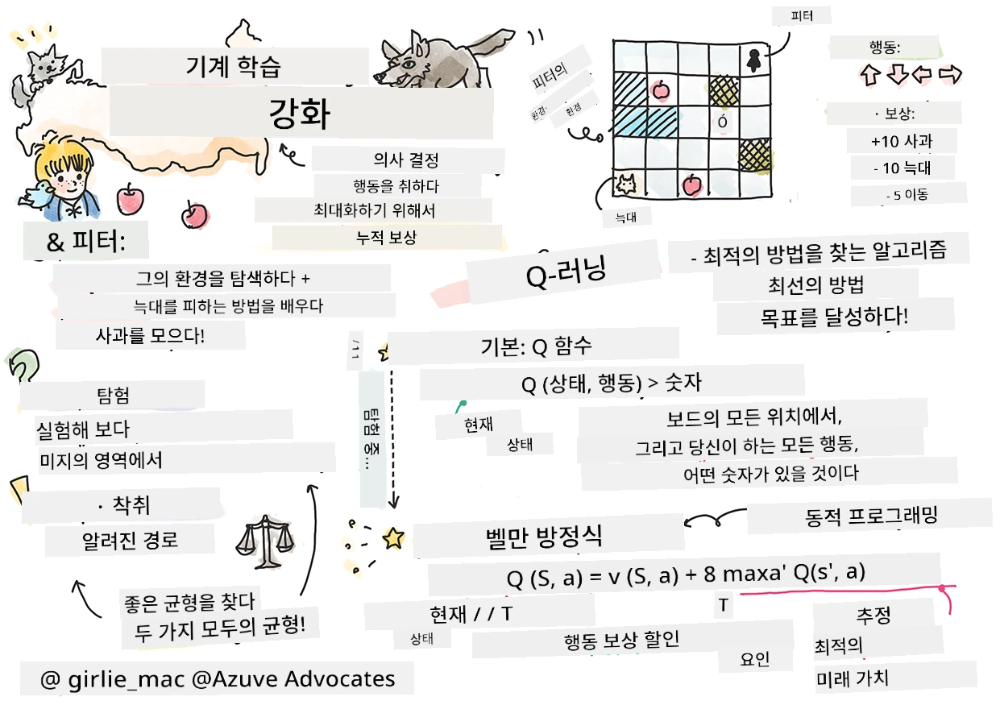
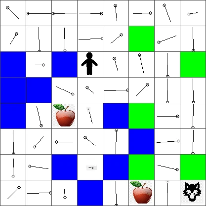

# 강화 학습과 Q-러닝 소개


> 스케치노트 작성자 [Tomomi Imura](https://www.twitter.com/girlie_mac)

강화 학습은 세 가지 중요한 개념을 포함합니다: 에이전트, 상태들, 그리고 각 상태별 행동 집합입니다. 지정된 상태에서 행동을 실행함으로써 에이전트는 보상을 받습니다. 다시 슈퍼 마리오 게임을 상상해 보십시오. 당신은 마리오이고, 게임 레벨 안에서 절벽 옆에 서 있습니다. 위에는 동전이 있습니다. 당신이 마리오이고, 게임 레벨에서 특정 위치에 있는 것이 ... 바로 당신의 상태입니다. 오른쪽으로 한 걸음 움직이는 것(행동)은 절벽 밖으로 떨어지게 하여 낮은 점수를 받을 것입니다. 하지만 점프 버튼을 누르면 점수를 얻고 살아남게 됩니다. 이것은 긍정적인 결과이며 긍정적인 숫자 점수를 부여해야 합니다.

강화 학습과 시뮬레이터(게임)를 사용하여 보상을 극대화하는 방법, 즉 생존하고 많은 점수를 얻는 방법을 배울 수 있습니다.

[](https://www.youtube.com/watch?v=lDq_en8RNOo)

> 🎥 위 이미지를 클릭하여 Dmitry가 강화 학습에 대해 이야기하는 내용을 들어보세요

## [수업 전 퀴즈](https://ff-quizzes.netlify.app/en/ml/)

## 전제 조건 및 설정

이 수업에서는 Python 코드를 실험해 볼 것입니다. 여러분은 이 수업의 Jupyter Notebook 코드를 컴퓨터나 클라우드 어디서든 실행할 수 있어야 합니다.

[수업 노트북](https://github.com/microsoft/ML-For-Beginners/blob/main/8-Reinforcement/1-QLearning/notebook.ipynb)을 열고 이 수업을 따라가며 코드를 작성할 수 있습니다.

> **참고:** 클라우드에서 이 코드를 여는 경우, 노트북 코드에서 사용되는 [`rlboard.py`](https://github.com/microsoft/ML-For-Beginners/blob/main/8-Reinforcement/1-QLearning/rlboard.py) 파일도 받아서 노트북과 같은 디렉터리에 두어야 합니다.

## 소개

이 수업에서는 러시아 작곡가 [Sergei Prokofiev](https://en.wikipedia.org/wiki/Sergei_Prokofiev)의 음악 동화에서 영감을 받은 **[피터와 늑대](https://en.wikipedia.org/wiki/Peter_and_the_Wolf)** 세계를 탐험합니다. 강화 학습을 사용하여 피터가 환경을 탐험하고 맛있는 사과를 모으며 늑대를 피하도록 할 것입니다.

**강화 학습**(Reinforcement Learning, RL)은 많은 실험을 통해 어떤 <strong>환경</strong>에서 <strong>에이전트</strong>의 최적 행동을 학습하는 기법입니다. 이 환경에서 에이전트는 일정한 <strong>보상 함수</strong>로 정의되는 <strong>목표</strong>를 가져야 합니다.

## 환경

간단히 하기 위해 피터의 세계를 `가로` x `세로` 크기의 정사각형 보드로 생각해 봅시다:


이 보드의 각 칸(cell)은 다음 중 하나일 수 있습니다:

* **땅(ground)**, 피터와 다른 생물이 걸을 수 있는 곳.
* **물(water)**, 당연히 걸을 수 없는 곳.
* **나무(tree)** 또는 **풀(grass)**, 쉴 수 있는 장소.
* **사과(apple)**, 피터가 자신을 먹일 수 있게 찾아 기뻐할 것.
* **늑대(wolf)**, 위험하며 피해야 할 존재.

별도의 Python 모듈 [`rlboard.py`](https://github.com/microsoft/ML-For-Beginners/blob/main/8-Reinforcement/1-QLearning/rlboard.py)가 이 환경을 다루는 코드를 포함합니다. 이 코드는 개념 이해에 중요하지 않으므로 모듈을 불러와 샘플 보드를 만드는 데 사용하겠습니다 (코드 블록 1):

```python
from rlboard import *

width, height = 8,8
m = Board(width,height)
m.randomize(seed=13)
m.plot()
```

이 코드는 위와 유사한 환경 그림을 출력할 것입니다.

## 행동과 정책

예제에서 피터의 목표는 늑대를 피하면서 사과를 찾는 것입니다. 이를 위해 피터는 사과를 찾을 때까지 걸어 다닐 수 있습니다.

따라서 어떤 위치에서도 위, 아래, 왼쪽, 오른쪽 중 하나의 행동을 선택할 수 있습니다.

이 행동들을 사전(dictionary)으로 정의하고, 각각에 해당하는 좌표 변화 쌍에 매핑할 것입니다. 예를 들어, 오른쪽으로 이동하는 것(`R`)은 `(1,0)` 쌍에 해당합니다. (코드 블록 2):

```python
actions = { "U" : (0,-1), "D" : (0,1), "L" : (-1,0), "R" : (1,0) }
action_idx = { a : i for i,a in enumerate(actions.keys()) }
```

요약하자면, 이 시나리오의 전략과 목표는 다음과 같습니다:

- <strong>전략</strong>은 에이전트(피터)의 행동 방침인 <strong>정책(policy)</strong>으로 정의됩니다. 정책은 주어진 상태에서 취할 행동을 반환하는 함수입니다. 여기서 문제의 상태는 현재 플레이어 위치를 포함한 보드로 표현됩니다.

- <strong>목표</strong>는 결국 강화 학습이 효과적으로 문제를 해결할 수 있는 좋은 정책을 배우는 것입니다. 그러나 기본적으로는 <strong>무작위 걷기(random walk)</strong>라는 가장 단순한 정책을 고려합니다.

## 무작위 걷기

먼저 무작위 걷기 전략을 구현하여 문제를 해결해 봅시다. 무작위 걷기는 허용된 행동 중에서 무작위로 다음 행동을 선택하며 사과에 도달할 때까지 진행됩니다 (코드 블록 3).

1. 아래 코드를 사용해 무작위 걷기를 구현합니다:

    ```python
    def random_policy(m):
        return random.choice(list(actions))
    
    def walk(m,policy,start_position=None):
        n = 0 # 단계 수
        # 초기 위치 설정
        if start_position:
            m.human = start_position 
        else:
            m.random_start()
        while True:
            if m.at() == Board.Cell.apple:
                return n # 성공!
            if m.at() in [Board.Cell.wolf, Board.Cell.water]:
                return -1 # 늑대에게 잡아먹히거나 익사함
            while True:
                a = actions[policy(m)]
                new_pos = m.move_pos(m.human,a)
                if m.is_valid(new_pos) and m.at(new_pos)!=Board.Cell.water:
                    m.move(a) # 실제 이동 수행
                    break
            n+=1
    
    walk(m,random_policy)
    ```

    `walk` 호출은 실행마다 다를 수 있는 경로 길이를 반환해야 합니다.

1. 걷기 실험을 여러 번(예: 100회) 수행하고 결과 통계를 출력합니다 (코드 블록 4):

    ```python
    def print_statistics(policy):
        s,w,n = 0,0,0
        for _ in range(100):
            z = walk(m,policy)
            if z<0:
                w+=1
            else:
                s += z
                n += 1
        print(f"Average path length = {s/n}, eaten by wolf: {w} times")
    
    print_statistics(random_policy)
    ```

    평균 경로 길이는 30-40걸음 정도로 상당히 긴 편이며, 가장 가까운 사과까지 평균 거리가 약 5-6걸음이라는 점을 고려하면 꽤 많습니다.

    무작위 걷기 중 피터의 움직임도 볼 수 있습니다:

    

## 보상 함수

정책을 더 똑똑하게 만들기 위해서는 어떤 움직임이 다른 것보다 "더 좋다"는 것을 이해해야 합니다. 이를 위해 목표를 정의해야 합니다.

목표는 각 상태에 대해 점수를 반환하는 <strong>보상 함수(reward function)</strong>로 정의할 수 있습니다. 숫자가 클수록 좋은 보상을 나타냅니다. (코드 블록 5)

```python
move_reward = -0.1
goal_reward = 10
end_reward = -10

def reward(m,pos=None):
    pos = pos or m.human
    if not m.is_valid(pos):
        return end_reward
    x = m.at(pos)
    if x==Board.Cell.water or x == Board.Cell.wolf:
        return end_reward
    if x==Board.Cell.apple:
        return goal_reward
    return move_reward
```

보상 함수에 대한 흥미로운 점은 대부분의 경우 <em>게임 끝에서만 실질적인 보상을 받는다는 것</em>입니다. 이는 알고리즘이 긍정적인 결과로 이어지는 “좋은” 단계를 기억하고 중요도를 높여야 하며, 반대로 나쁜 결과로 이어지는 모든 움직임을 억제해야 함을 의미합니다.

## Q-러닝

여기서 논의할 알고리즘은 <strong>Q-러닝</strong>이라고 불립니다. 이 알고리즘에서 정책은 <strong>Q-테이블</strong>이라 불리는 함수(또는 데이터 구조)로 정의됩니다. 이는 주어진 상태에서 각 행동의 "좋음" 정도를 기록합니다.

Q-테이블이라고 하는 이유는 이를 표나 다차원 배열 형식으로 표현하는 것이 편리하기 때문입니다. 보드 크기가 `가로` x `세로`이므로, Q-테이블은 `가로` x `세로` x `동작 수` 모양의 numpy 배열로 나타낼 수 있습니다: (코드 블록 6)

```python
Q = np.ones((width,height,len(actions)),dtype=np.float)*1.0/len(actions)
```

모든 Q-테이블 값들을 동일한 값, 여기서는 0.25로 초기화한 것을 볼 수 있습니다. 이는 각 상태의 모든 동작이 동일하게 좋은 무작위 걷기 정책과 대응됩니다. Q-테이블을 `plot` 함수에 전달하여 보드에 시각화할 수 있습니다: `m.plot(Q)`.


각 칸 중앙에는 선호하는 이동 방향을 나타내는 "화살표"가 있습니다. 모든 방향이 같으므로 점(dot)으로 표시됩니다.

이제 시뮬레이션을 실행하여 환경을 탐험하고 Q-테이블 값을 더 나은 분포로 학습하여 사과로 가는 경로를 훨씬 빠르게 찾을 수 있게 할 것입니다.

## Q-러닝의 핵심: 벨만 방정식

움직이기 시작하면 각 행동에는 즉각적인 보상이 따릅니다. 이론적으로는 가장 높은 즉각 보상에 따라 다음 행동을 선택할 수 있습니다. 그러나 대부분의 상태에서 이 움직임만으로는 사과에 도달할 수 없으므로 어떤 방향이 더 좋은지 즉시 결정할 수 없습니다.

> 즉각적인 결과가 중요한 것이 아니라, 시뮬레이션 끝에서 얻는 최종 결과가 중요하다는 점을 기억하세요.

지연된 보상을 고려하기 위해서는 문제를 재귀적으로 생각할 수 있게 하는 **[동적 프로그래밍](https://en.wikipedia.org/wiki/Dynamic_programming)** 원리를 사용해야 합니다.

현재 상태를 <em>s</em>라고 하고 다음 상태를 <em>s'</em>로 이동한다고 가정합시다. 이렇게 하면 보상 함수로 정의된 즉각 보상 <em>r(s,a)</em>와 일부 미래 보상을 받습니다. 만약 우리가 Q-테이블을 각 행동의 "매력도"를 정확히 반영한다고 가정하면, 상태 <em>s'</em>에서 우리는 최대 *Q(s',a')* 값을 갖는 행동 <em>a</em>를 선택할 것입니다. 따라서 상태 <em>s</em>에서 얻을 수 있는 최상의 미래 보상은 `max`<sub>a'</sub><em>Q(s',a')</em>로 정의됩니다 (최대값은 상태 <em>s'</em>에서 가능한 모든 행동 <em>a'</em>에 대해 계산).

이것이 상태 <em>s</em>에서 행동 <em>a</em>에 대한 Q-테이블 값을 계산하는 **벨만 방정식(Bellman equation)** 입니다:


여기서 γ는 현재 보상과 미래 보상 중 어느 쪽을 더 선호할지 결정하는 이른바 **할인율(discount factor)** 입니다.

## 학습 알고리즘

위 방정식을 바탕으로 학습 알고리즘에 대한 의사 코드를 작성할 수 있습니다:

* 모든 상태와 행동에 대해 동일한 값으로 Q-테이블 Q 초기화
* 학습률 α ← 1로 설정
* 시뮬레이션을 여러 번 반복 실행
   1. 임의 위치에서 시작
   1. 반복
        1. 상태 <em>s</em>에서 행동 *a* 선택
        2. 이동하여 새로운 상태 <em>s'</em>로 행동 실행
        3. 게임 종료 조건을 만나거나 총 보상이 너무 작으면 시뮬레이션 종료
        4. 새 상태에서 보상 *r* 계산
        5. 벨만 방정식에 따라 Q 함수 업데이트: *Q(s,a)* ← *(1-α)Q(s,a)+α(r+γ max<sub>a'</sub>Q(s',a'))*
        6. *s* ← *s'*
        7. 총 보상 업데이트 및 α 감소

## 탐험(Explore) 대 착취(Exploit)

위 알고리즘에서 2.1 단계에서 행동을 어떻게 선택할지 명시하지 않았습니다. 만약 행동을 무작위로 선택한다면, 환경을 무작위로 <strong>탐험</strong>하여 자주 죽을 가능성이 있고 평소 가지 않을 곳도 탐험할 것입니다. 반면에 이미 알고 있는 Q-테이블 값을 <strong>착취</strong>하여 가장 좋은 행동(더 높은 Q-테이블 값)을 선택하면 다른 상태를 탐험하지 못하고 최적 해결책을 찾지 못할 수 있습니다.

따라서 탐험과 착취 사이에 균형을 맞추는 것이 최선입니다. 이는 상태 <em>s</em>에서의 행동 선택을 Q-테이블 값에 비례하는 확률로 하여 구현할 수 있습니다. 처음에 Q-테이블 값이 모두 동일하면 무작위 선택과 같지만, 학습이 진행될수록 최적 경로를 따르면서도 가끔씩 미탐험 경로를 선택할 수 있습니다.

## 파이썬 구현

이제 학습 알고리즘을 구현할 준비가 되었습니다. 그 전에 Q-테이블의 임의 숫자를 해당 동작의 확률 벡터로 변환하는 함수가 필요합니다.

1. 함수 `probs()`를 만듭니다:

    ```python
    def probs(v,eps=1e-4):
        v = v-v.min()+eps
        v = v/v.sum()
        return v
    ```

    초기 상태에서 벡터의 모든 성분이 동일하기 때문에 0으로 나누는 오류를 피하기 위해 원래 벡터에 몇 개의 `eps`를 더합니다.

5000번의 실험, 즉 <strong>epoch</strong>을 통해 학습 알고리즘을 실행합니다: (코드 블록 8)
```python
    for epoch in range(5000):
    
        # 초기 지점 선택
        m.random_start()
        
        # 이동 시작
        n=0
        cum_reward = 0
        while True:
            x,y = m.human
            v = probs(Q[x,y])
            a = random.choices(list(actions),weights=v)[0]
            dpos = actions[a]
            m.move(dpos,check_correctness=False) # 플레이어가 보드 밖으로 이동할 수 있도록 허용하며, 이 경우 에피소드가 종료됩니다
            r = reward(m)
            cum_reward += r
            if r==end_reward or cum_reward < -1000:
                lpath.append(n)
                break
            alpha = np.exp(-n / 10e5)
            gamma = 0.5
            ai = action_idx[a]
            Q[x,y,ai] = (1 - alpha) * Q[x,y,ai] + alpha * (r + gamma * Q[x+dpos[0], y+dpos[1]].max())
            n+=1
```

이 알고리즘 실행 후, Q-테이블은 각 단계에서 다양한 행동의 매력도를 정의하는 값들로 업데이트됩니다. Q-테이블을 시각화하여 각 칸에 원하는 이동 방향을 향하는 벡터를 그려볼 수 있습니다. 단순화를 위해 화살촉 대신 작은 원을 그립니다.



## 정책 확인

Q-테이블이 각 상태별로 행동의 "매력도"를 나열하므로, 이를 활용해 우리 세계에서 효율적인 길 찾기가 가능합니다. 가장 간단하게는 가장 높은 Q-테이블 값에 해당하는 행동을 선택할 수 있습니다: (코드 블록 9)

```python
def qpolicy_strict(m):
        x,y = m.human
        v = probs(Q[x,y])
        a = list(actions)[np.argmax(v)]
        return a

walk(m,qpolicy_strict)
```


> 위 코드를 여러 번 실행해 보면, 때때로 "멈추는" 현상이 발생하며, 이를 중단하려면 노트북에서 STOP 버튼을 눌러야 한다는 것을 알 수 있습니다. 이는 두 상태가 최적의 Q-Value 관점에서 서로 "가리키는" 상황이 있을 수 있기 때문이며, 이 경우 에이전트가 무한히 그 상태들 사이를 오가게 됩니다.

## 🚀도전 과제

> **과제 1:** `walk` 함수를 수정하여 경로의 최대 길이를 일정한 단계 수(예: 100단계)로 제한하고, 위 코드가 때때로 이 값을 반환하는 것을 확인하세요.

> **과제 2:** `walk` 함수를 수정하여 이전에 방문했던 장소로 다시 가지 않도록 하세요. 이렇게 하면 `walk`가 무한 루프에 빠지는 것을 방지할 수 있지만, 에이전트가 빠져나올 수 없는 위치에 "갇힐" 수 있습니다.

## 내비게이션

더 나은 내비게이션 정책은 훈련 중에 사용한, 탐사와 활용을 결합한 방법입니다. 이 정책에서는 Q-테이블 값에 비례하는 확률로 각 행동을 선택합니다. 이 전략은 여전히 에이전트가 이미 탐험한 위치로 돌아올 수 있지만, 아래 코드에서 볼 수 있듯이 기대 위치까지의 평균 경로가 매우 짧아집니다(`print_statistics`가 시뮬레이션을 100번 실행함을 기억하세요): (code block 10)

```python
def qpolicy(m):
        x,y = m.human
        v = probs(Q[x,y])
        a = random.choices(list(actions),weights=v)[0]
        return a

print_statistics(qpolicy)
```

이 코드를 실행하면 이전보다 훨씬 짧은 평균 경로 길이(3~6 범위)를 얻을 수 있습니다.

## 학습 과정 조사

앞서 언급했듯이 학습 과정은 탐색과 문제 공간 구조에 대한 습득 지식의 활용 사이의 균형입니다. 학습의 결과(에이전트가 목표까지 짧은 경로를 찾도록 돕는 능력)가 향상된 것을 보았는데, 학습 과정 동안 평균 경로 길이가 어떻게 변하는지 관찰하는 것도 흥미롭습니다:


학습 내용을 요약하면 다음과 같습니다:

- **평균 경로 길이가 증가한다**. 처음에는 평균 경로 길이가 증가합니다. 이는 환경에 대해 아무것도 모를 때, 물 또는 늑대와 같은 나쁜 상태에 갇힐 가능성이 크기 때문입니다. 더 많이 학습하고 이 지식을 사용함에 따라 환경을 더 오래 탐색할 수 있지만, 사과 위치를 아직 잘 모릅니다.

- **학습이 진행될수록 경로 길이가 감소한다**. 충분히 학습하면 에이전트가 목표에 도달하기 쉬워지고 경로 길이가 감소하기 시작합니다. 그러나 여전히 탐색 가능성이 열려 있어 종종 최적 경로에서 벗어나 새 경로를 탐색하며 경로가 최적보다 길어질 수 있습니다.

- **길이가 갑자기 증가한다**. 그래프에서 볼 수 있듯이 어느 시점에서는 길이가 갑자기 증가합니다. 이는 과정의 확률적 특성을 나타내고, Q-테이블 계수를 새 값으로 덮어쓰며 "망칠" 수 있음을 의미합니다. 이상적으로는 학습률을 낮춰(예: 학습 후반부에서는 Q-테이블 값을 약간만 조정) 이를 최소화해야 합니다.

전반적으로 학습 성공과 품질은 학습률, 학습률 감소, 할인율과 같은 매개변수에 크게 의존합니다. 이러한 매개변수는 훈련 중 최적화하는 매개변수(예: Q-테이블 계수)와 구분하기 위해 <strong>하이퍼파라미터</strong>라고 불리며, 최적의 하이퍼파라미터 값을 찾는 과정을 <strong>하이퍼파라미터 최적화</strong>라고 하며 별도의 주제를 필요로 합니다.

## [강의 후 퀴즈](https://ff-quizzes.netlify.app/en/ml/)

## 과제
[더 현실적인 세계](assignment.md)

---

<!-- CO-OP TRANSLATOR DISCLAIMER START -->
**면책 조항**:
이 문서는 AI 번역 서비스 [Co-op Translator](https://github.com/Azure/co-op-translator)를 사용하여 번역되었습니다. 정확성을 기하기 위해 노력하고 있으나, 자동 번역은 오류나 부정확한 부분이 있을 수 있음을 유의하시기 바랍니다. 원본 문서의 원어본이 권위 있는 자료로 간주되어야 합니다. 중요한 정보의 경우, 전문가의 인간 번역을 권장합니다. 이 번역 사용으로 인해 발생하는 오해나 잘못된 해석에 대해 당사는 책임을 지지 않습니다.
<!-- CO-OP TRANSLATOR DISCLAIMER END -->