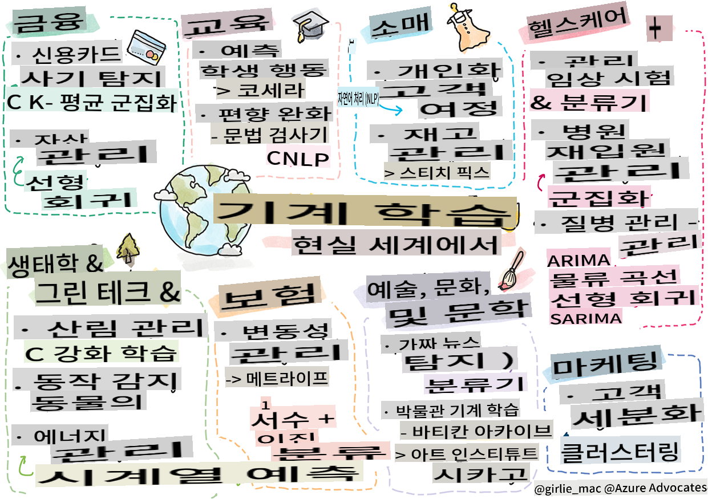

<!--
CO_OP_TRANSLATOR_METADATA:
{
  "original_hash": "20f18ff565638be615df4174858e4a7f",
  "translation_date": "2025-09-03T23:16:35+00:00",
  "source_file": "9-Real-World/1-Applications/README.md",
  "language_code": "ko"
}
-->
# 후속: 실제 세계에서의 머신 러닝

> 스케치노트 제공: [Tomomi Imura](https://www.twitter.com/girlie_mac)

이 커리큘럼에서 여러분은 데이터를 학습용으로 준비하고 머신 러닝 모델을 만드는 다양한 방법을 배웠습니다. 회귀, 클러스터링, 분류, 자연어 처리, 시계열 모델 등 고전적인 모델을 연속적으로 구축해왔습니다. 축하합니다! 이제 여러분은 이러한 모델들이 실제로 어떤 용도로 사용되는지 궁금할 것입니다. 

산업에서 AI에 대한 관심이 높아지고 있지만, 이는 주로 딥러닝을 활용하는 경우가 많습니다. 그럼에도 불구하고 고전적인 머신 러닝 모델은 여전히 가치 있는 응용 분야를 가지고 있습니다. 사실, 여러분은 이미 이러한 응용 분야를 사용하고 있을지도 모릅니다! 이번 레슨에서는 8개의 다양한 산업 및 주제 분야에서 이러한 모델들이 어떻게 애플리케이션을 더 성능 좋고, 신뢰할 수 있으며, 지능적이고, 사용자에게 가치 있게 만드는 데 사용되는지 탐구할 것입니다.

## [강의 전 퀴즈](https://gray-sand-07a10f403.1.azurestaticapps.net/quiz/49/)

## 💰 금융

금융 분야는 머신 러닝을 활용할 수 있는 많은 기회를 제공합니다. 이 분야의 많은 문제는 ML을 사용하여 모델링하고 해결할 수 있습니다.

### 신용카드 사기 탐지

이 과정에서 [k-means 클러스터링](../../5-Clustering/2-K-Means/README.md)에 대해 배웠지만, 이를 신용카드 사기와 관련된 문제를 해결하는 데 어떻게 사용할 수 있을까요?

k-means 클러스터링은 **이상치 탐지**라는 신용카드 사기 탐지 기술에서 유용하게 사용됩니다. 데이터 세트에 대한 관찰에서의 이상치 또는 편차는 신용카드가 정상적으로 사용되고 있는지 아니면 비정상적인 활동이 있는지를 알려줍니다. 아래 링크된 논문에서 보여지듯이, k-means 클러스터링 알고리즘을 사용하여 신용카드 데이터를 정렬하고 각 거래를 이상치 정도에 따라 클러스터에 할당할 수 있습니다. 그런 다음, 가장 위험한 클러스터를 평가하여 사기 거래와 합법적인 거래를 구분할 수 있습니다.
[참고](https://citeseerx.ist.psu.edu/viewdoc/download?doi=10.1.1.680.1195&rep=rep1&type=pdf)

### 자산 관리

자산 관리에서는 개인 또는 회사가 고객을 대신하여 투자를 관리합니다. 이들의 목표는 장기적으로 자산을 유지하고 성장시키는 것이므로, 성과가 좋은 투자를 선택하는 것이 중요합니다.

특정 투자 성과를 평가하는 한 가지 방법은 통계적 회귀를 사용하는 것입니다. [선형 회귀](../../2-Regression/1-Tools/README.md)는 펀드가 특정 벤치마크에 대해 어떻게 성과를 내는지 이해하는 데 유용한 도구입니다. 또한 회귀 결과가 통계적으로 유의미한지, 즉 고객의 투자에 얼마나 영향을 미칠지를 추론할 수 있습니다. 추가 위험 요소를 고려하여 다중 회귀를 사용하여 분석을 확장할 수도 있습니다. 특정 펀드에 대해 이 방법이 어떻게 작동하는지에 대한 예시는 아래 논문에서 확인할 수 있습니다.
[참고](http://www.brightwoodventures.com/evaluating-fund-performance-using-regression/)

## 🎓 교육

교육 분야는 머신 러닝을 적용할 수 있는 매우 흥미로운 영역입니다. 시험이나 에세이에서 부정행위를 감지하거나, 의도적이든 아니든 교정 과정에서의 편향을 관리하는 등의 흥미로운 문제를 해결할 수 있습니다.

### 학생 행동 예측

온라인 공개 강좌 제공업체인 [Coursera](https://coursera.com)는 많은 엔지니어링 결정을 논의하는 훌륭한 기술 블로그를 운영합니다. 이 사례 연구에서, 그들은 낮은 NPS(Net Promoter Score) 평가와 강좌 유지 또는 중도 탈락 간의 상관관계를 탐구하기 위해 회귀선을 그렸습니다.
[참고](https://medium.com/coursera-engineering/controlled-regression-quantifying-the-impact-of-course-quality-on-learner-retention-31f956bd592a)

### 편향 완화

[Grammarly](https://grammarly.com)는 철자 및 문법 오류를 확인하는 글쓰기 도우미로, 제품 전반에 걸쳐 정교한 [자연어 처리 시스템](../../6-NLP/README.md)을 사용합니다. 그들은 기술 블로그에서 머신 러닝에서의 성별 편향을 어떻게 처리했는지에 대한 흥미로운 사례 연구를 발표했습니다. 이는 [공정성 소개 레슨](../../1-Introduction/3-fairness/README.md)에서 배운 내용과 관련이 있습니다.
[참고](https://www.grammarly.com/blog/engineering/mitigating-gender-bias-in-autocorrect/)

## 👜 소매

소매 분야는 고객 여정을 개선하거나 재고를 최적화하는 등 다양한 방식으로 ML의 혜택을 받을 수 있습니다.

### 고객 여정 개인화

가구와 같은 가정용품을 판매하는 Wayfair에서는 고객이 자신의 취향과 필요에 맞는 제품을 찾도록 돕는 것이 중요합니다. 이 기사에서 회사의 엔지니어들은 ML과 NLP를 사용하여 "고객에게 적합한 결과를 제공"하는 방법을 설명합니다. 특히, 그들의 Query Intent Engine은 고객 리뷰에서 엔티티 추출, 분류기 학습, 자산 및 의견 추출, 감정 태깅을 사용하도록 설계되었습니다. 이는 온라인 소매에서 NLP가 작동하는 고전적인 사례입니다.
[참고](https://www.aboutwayfair.com/tech-innovation/how-we-use-machine-learning-and-natural-language-processing-to-empower-search)

### 재고 관리

[StitchFix](https://stitchfix.com)와 같은 혁신적이고 민첩한 회사는 추천 및 재고 관리를 위해 ML을 많이 활용합니다. 그들의 스타일링 팀은 상품 팀과 협력합니다. 실제로 "한 데이터 과학자가 유전 알고리즘을 의류에 적용하여 오늘날 존재하지 않는 성공적인 의류를 예측했습니다. 이를 상품 팀에 제공하여 도구로 사용할 수 있게 했습니다."
[참고](https://www.zdnet.com/article/how-stitch-fix-uses-machine-learning-to-master-the-science-of-styling/)

## 🏥 의료

의료 분야는 연구 작업을 최적화하거나 환자 재입원 관리, 질병 확산 방지와 같은 물류 문제를 해결하기 위해 ML을 활용할 수 있습니다.

### 임상 시험 관리

임상 시험에서의 독성은 제약 회사들에게 주요 관심사입니다. 얼마나 많은 독성이 허용 가능한가요? 이 연구에서는 다양한 임상 시험 방법을 분석하여 임상 시험 결과를 예측할 확률을 예측하는 새로운 접근법을 개발했습니다. 특히, 랜덤 포레스트를 사용하여 그룹 간 약물을 구분할 수 있는 [분류기](../../4-Classification/README.md)를 생성했습니다.
[참고](https://www.sciencedirect.com/science/article/pii/S2451945616302914)

### 병원 재입원 관리

병원 치료는 비용이 많이 들며, 특히 환자가 재입원해야 할 경우 더욱 그렇습니다. 이 논문에서는 [클러스터링](../../5-Clustering/README.md) 알고리즘을 사용하여 재입원 가능성을 예측하는 회사에 대해 논의합니다. 이러한 클러스터는 분석가들이 "공통 원인을 공유할 수 있는 재입원 그룹을 발견"하는 데 도움을 줍니다.
[참고](https://healthmanagement.org/c/healthmanagement/issuearticle/hospital-readmissions-and-machine-learning)

### 질병 관리

최근 팬데믹은 머신 러닝이 질병 확산을 막는 데 어떻게 도움을 줄 수 있는지에 대한 많은 관심을 불러일으켰습니다. 이 기사에서는 ARIMA, 로지스틱 곡선, 선형 회귀, SARIMA의 사용을 확인할 수 있습니다. "이 연구는 바이러스 확산 속도를 계산하고 사망, 회복, 확진 사례를 예측하여 더 나은 준비와 생존을 돕기 위한 시도입니다."
[참고](https://www.ncbi.nlm.nih.gov/pmc/articles/PMC7979218/)

## 🌲 생태 및 친환경 기술

자연과 생태는 동물과 자연 간의 상호작용이 초점이 되는 민감한 시스템으로 구성됩니다. 이러한 시스템을 정확히 측정하고, 산불이나 동물 개체수 감소와 같은 일이 발생했을 때 적절히 대응하는 것이 중요합니다.

### 산림 관리

이전 레슨에서 [강화 학습](../../8-Reinforcement/README.md)에 대해 배웠습니다. 이는 자연에서 패턴을 예측하는 데 매우 유용할 수 있습니다. 특히, 산불 및 침입종 확산과 같은 생태학적 문제를 추적하는 데 사용할 수 있습니다. 캐나다의 한 연구팀은 위성 이미지를 사용하여 산불 동역학 모델을 구축하기 위해 강화 학습을 사용했습니다. 혁신적인 "공간적 확산 과정(SSP)"을 사용하여 산불을 "풍경의 어느 셀에서든 에이전트"로 간주했습니다. "화재가 특정 위치에서 특정 시점에 취할 수 있는 행동 세트는 북쪽, 남쪽, 동쪽, 서쪽으로 확산하거나 확산하지 않는 것을 포함합니다."

이 접근법은 해당 마르코프 결정 과정(MDP)의 동역학이 즉각적인 산불 확산에 대한 알려진 함수라는 점에서 일반적인 RL 설정을 뒤집습니다. 아래 링크에서 이 그룹이 사용한 고전 알고리즘에 대해 자세히 읽어보세요.
[참고](https://www.frontiersin.org/articles/10.3389/fict.2018.00006/full)

### 동물의 움직임 감지

딥러닝은 동물 움직임을 시각적으로 추적하는 데 혁신을 가져왔지만(여기에서 [북극곰 추적기](https://docs.microsoft.com/learn/modules/build-ml-model-with-azure-stream-analytics/?WT.mc_id=academic-77952-leestott)를 직접 만들어볼 수 있습니다), 고전적인 ML은 여전히 이 작업에서 중요한 역할을 합니다.

농장 동물의 움직임을 추적하는 센서와 IoT는 이러한 유형의 시각적 처리를 활용하지만, 더 기본적인 ML 기술은 데이터를 전처리하는 데 유용합니다. 예를 들어, 이 논문에서는 다양한 분류기 알고리즘을 사용하여 양의 자세를 모니터링하고 분석했습니다. 페이지 335에서 ROC 곡선을 확인할 수 있습니다.
[참고](https://druckhaus-hofmann.de/gallery/31-wj-feb-2020.pdf)

### ⚡️ 에너지 관리

[시계열 예측](../../7-TimeSeries/README.md)에 대한 레슨에서, 공급과 수요를 이해하여 도시의 수익을 창출하는 스마트 주차 미터 개념을 언급했습니다. 이 기사는 클러스터링, 회귀 및 시계열 예측을 결합하여 스마트 미터링을 기반으로 아일랜드의 미래 에너지 사용을 예측하는 방법을 자세히 설명합니다.
[참고](https://www-cdn.knime.com/sites/default/files/inline-images/knime_bigdata_energy_timeseries_whitepaper.pdf)

## 💼 보험

보험 분야는 ML을 사용하여 실행 가능한 금융 및 보험 모델을 구축하고 최적화하는 또 다른 분야입니다.

### 변동성 관리

생명 보험 제공업체인 MetLife는 금융 모델에서 변동성을 분석하고 완화하는 방법을 공개적으로 공유합니다. 이 기사에서는 이진 및 서열 분류 시각화를 확인할 수 있습니다. 또한 예측 시각화도 발견할 수 있습니다.
[참고](https://investments.metlife.com/content/dam/metlifecom/us/investments/insights/research-topics/macro-strategy/pdf/MetLifeInvestmentManagement_MachineLearnedRanking_070920.pdf)

## 🎨 예술, 문화, 문학

예술 분야, 예를 들어 저널리즘에서는 많은 흥미로운 문제가 있습니다. 가짜 뉴스를 감지하는 것은 큰 문제로, 이는 사람들의 의견에 영향을 미치고 심지어 민주주의를 위협할 수 있음이 입증되었습니다. 박물관도 유물 간의 연결을 찾거나 자원 계획을 세우는 데 ML을 활용할 수 있습니다.

### 가짜 뉴스 감지

가짜 뉴스를 감지하는 것은 오늘날 미디어에서 고양이와 쥐의 게임이 되었습니다. 이 기사에서 연구자들은 우리가 공부한 여러 ML 기술을 결합하여 시스템을 테스트하고 최적의 모델을 배포할 것을 제안합니다. "이 시스템은 데이터를 기반으로 특징을 추출하기 위해 자연어 처리를 사용하며, 그런 다음 이러한 특징은 Naive Bayes, Support Vector Machine (SVM), Random Forest (RF), Stochastic Gradient Descent (SGD), Logistic Regression(LR)과 같은 머신 러닝 분류기를 학습시키는 데 사용됩니다."
[참고](https://www.irjet.net/archives/V7/i6/IRJET-V7I6688.pdf)

이 기사는 다양한 ML 도메인을 결합하여 가짜 뉴스가 확산되고 실제 피해를 초래하는 것을 막는 데 도움이 되는 흥미로운 결과를 생성할 수 있음을 보여줍니다. 이 경우, COVID 치료에 대한 소문이 폭력적인 군중 행동을 유발한 것이 계기가 되었습니다.

### 박물관 ML

박물관은 컬렉션을 디지털화하고 유물 간의 연결을 찾는 것이 기술 발전으로 인해 점점 더 쉬워지면서 AI 혁명의 최전선에 있습니다. [In Codice Ratio](https://www.sciencedirect.com/science/article/abs/pii/S0306457321001035#:~:text=1.,studies%20over%20large%20historical%20sources.)와 같은 프로젝트는 바티칸 기록 보관소와 같은 접근할 수 없는 컬렉션의 신비를 풀어주는 데 도움을 주고 있습니다. 하지만 박물관의 비즈니스 측면도 ML 모델의 혜택을 받습니다.

예를 들어, 시카고 아트 인스티튜트는 관객들이 무엇에 관심이 있는지, 언제 전시회를 방문할지를 예측하는 모델을 구축했습니다. 목표는 사용자가 박물관을 방문할 때마다 개별화되고 최적화된 방문 경험을 제공하는 것입니다. "2017 회계연도 동안, 이 모델은 참석 및 입장 예측에서 1% 이내의 정확도를 기록했습니다."라고 Andrew Simnick, 시카고 아트 인스티튜트의 수석 부사장이 말합니다.
[참고](https://www.chicagobusiness.com/article/20180518/ISSUE01/180519840/art-institute-of-chicago-uses-data-to-make-exhibit-choices)

## 🏷 마케팅

### 고객 세분화

가장 효과적인 마케팅 전략은 다양한 그룹에 따라 고객을 다르게 타겟팅하는 것입니다. 이 기사에서는 차별화된 마케팅을 지원하기 위해 클러스터링 알고리즘의 사용에 대해 논의합니다. 차별화된 마케팅은 기업이 브랜드 인지도를 높이고, 더 많은 고객에게 도달하며, 더 많은 수익을 창출하는 데 도움을 줍니다.
[참고](https://ai.inqline.com/machine-learning-for-marketing-customer-segmentation/)

## 🚀 도전
다른 분야를 찾아보고, 이 커리큘럼에서 배운 기술 중 일부가 해당 분야에서 어떻게 활용되는지 알아보세요.

## [강의 후 퀴즈](https://gray-sand-07a10f403.1.azurestaticapps.net/quiz/50/)

## 복습 및 자기 학습

Wayfair 데이터 과학 팀은 자사에서 ML을 어떻게 활용하는지에 대한 흥미로운 동영상을 여러 개 제공합니다. [한번 살펴보세요](https://www.youtube.com/channel/UCe2PjkQXqOuwkW1gw6Ameuw/videos)!

## 과제

[ML 스캐빈저 헌트](assignment.md)

---

**면책 조항**:  
이 문서는 AI 번역 서비스 [Co-op Translator](https://github.com/Azure/co-op-translator)를 사용하여 번역되었습니다. 정확성을 위해 최선을 다하고 있지만, 자동 번역에는 오류나 부정확성이 포함될 수 있습니다. 원본 문서의 원어 버전이 권위 있는 출처로 간주되어야 합니다. 중요한 정보의 경우, 전문적인 인간 번역을 권장합니다. 이 번역 사용으로 인해 발생하는 오해나 잘못된 해석에 대해 책임을 지지 않습니다.