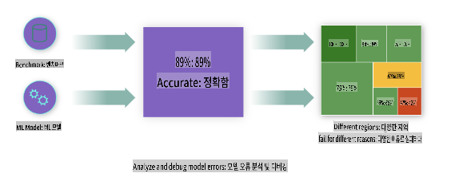
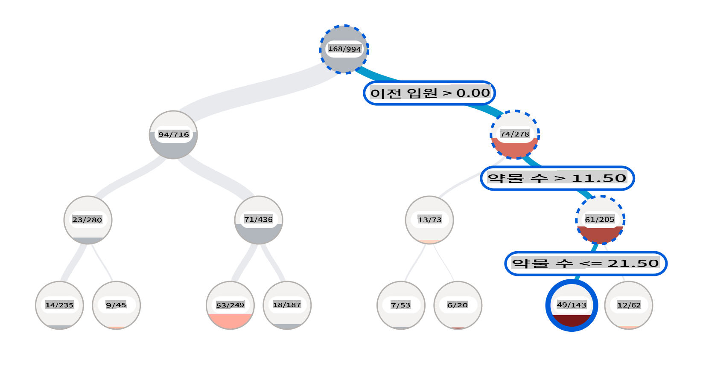
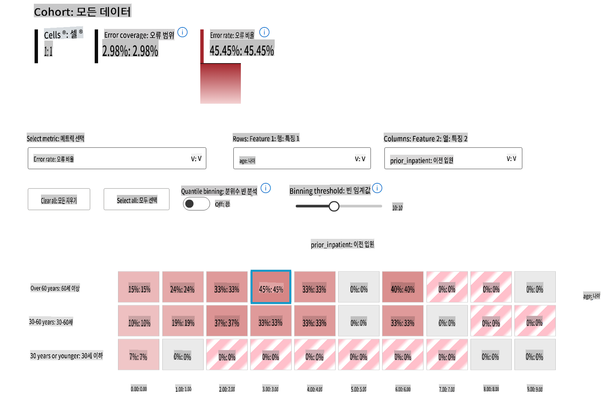
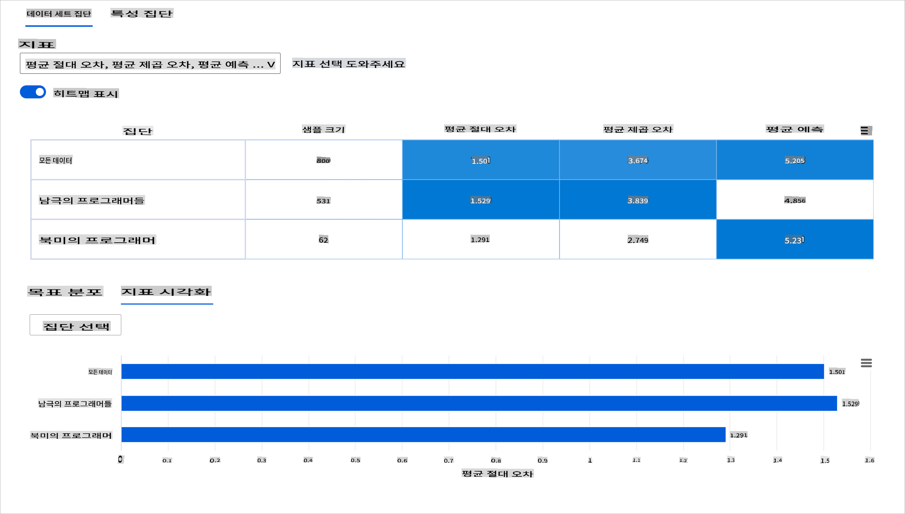
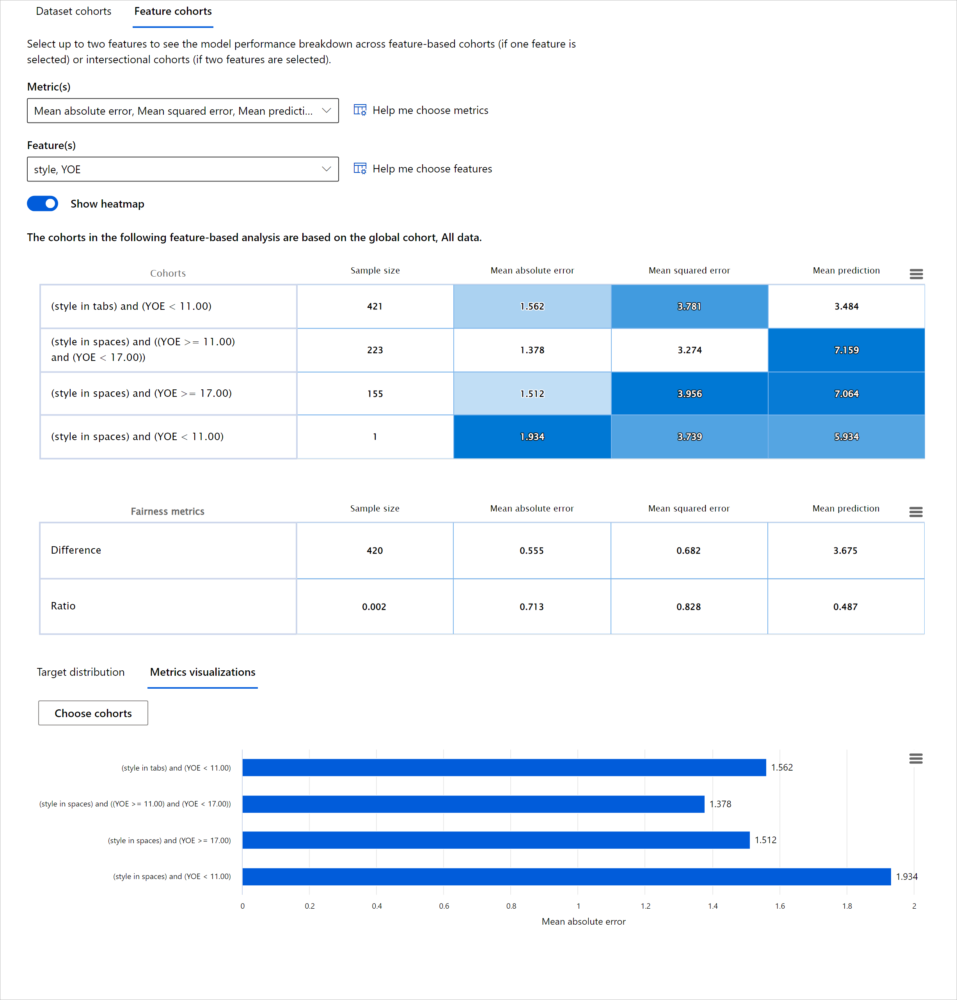
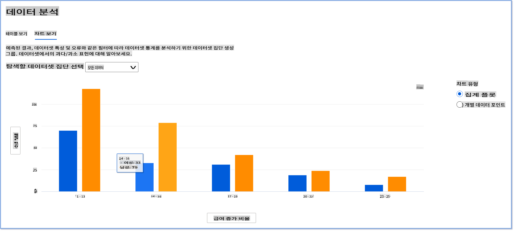
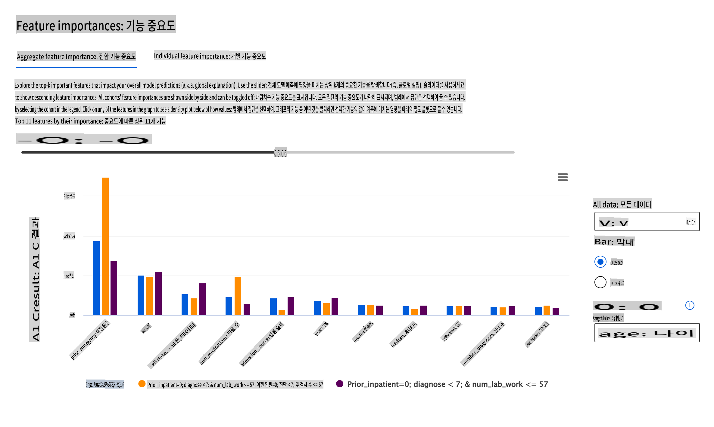
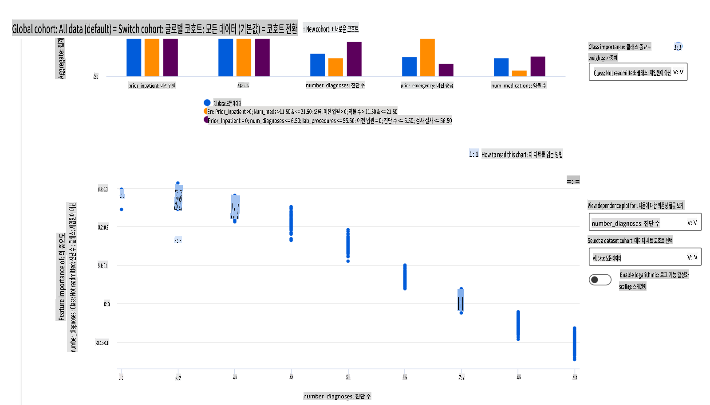

# 후기: 책임 있는 AI 대시보드 구성 요소를 사용한 머신러닝 모델 디버깅

## [사전 강의 퀴즈](https://gray-sand-07a10f403.1.azurestaticapps.net/quiz/5/)

## 소개

머신러닝은 우리의 일상 생활에 큰 영향을 미칩니다. AI는 의료, 금융, 교육, 고용 등 개인과 사회에 영향을 미치는 중요한 시스템에 점점 더 많이 도입되고 있습니다. 예를 들어, 시스템과 모델은 의료 진단이나 사기 탐지와 같은 일상적인 의사 결정 작업에 관여하고 있습니다. 결과적으로, AI의 발전과 가속화된 채택은 진화하는 사회적 기대와 증가하는 규제에 대응하고 있습니다. 우리는 AI 시스템이 기대에 미치지 못하는 영역을 지속적으로 보고 있으며, 새로운 도전 과제를 노출하고 정부는 AI 솔루션을 규제하기 시작했습니다. 따라서 이러한 모델이 공정하고 신뢰할 수 있으며 포괄적이고 투명하며 책임 있는 결과를 제공하는지 분석하는 것이 중요합니다.

이 교육 과정에서는 모델에 책임 있는 AI 문제가 있는지 평가할 수 있는 실용적인 도구를 살펴보겠습니다. 전통적인 머신러닝 디버깅 기술은 주로 집계된 정확도나 평균 오류 손실과 같은 정량적 계산에 기반합니다. 이러한 모델을 구축하는 데 사용하는 데이터에 인종, 성별, 정치적 견해, 종교 등 특정 인구 통계가 부족하거나 불균형적으로 대표되는 경우 어떤 일이 발생할 수 있는지 상상해보세요. 모델의 출력이 특정 인구 통계를 선호하도록 해석되면 어떻게 될까요? 이는 민감한 특성 그룹의 과잉 또는 과소 대표를 초래하여 모델의 공정성, 포괄성 또는 신뢰성 문제를 일으킬 수 있습니다. 또 다른 요소는 머신러닝 모델이 블랙박스로 간주되어 모델의 예측을 무엇이 주도하는지 이해하고 설명하기 어렵다는 점입니다. 이러한 모든 문제는 모델의 공정성이나 신뢰성을 디버깅하고 평가할 적절한 도구가 없을 때 데이터 과학자와 AI 개발자가 직면하는 도전 과제입니다.

이 수업에서는 다음을 통해 모델을 디버깅하는 방법을 배울 것입니다:

- **오류 분석**: 데이터 분포에서 모델의 오류율이 높은 위치를 식별합니다.
- **모델 개요**: 다른 데이터 코호트 간의 비교 분석을 수행하여 모델의 성능 지표에서 차이를 발견합니다.
- **데이터 분석**: 데이터가 과잉 또는 과소 대표되는 위치를 조사하여 모델이 한 데이터 인구 통계를 다른 데이터 인구 통계보다 선호하도록 왜곡될 수 있는지 조사합니다.
- **특성 중요도**: 글로벌 수준 또는 로컬 수준에서 모델의 예측을 주도하는 특성을 이해합니다.

## 전제 조건

전제 조건으로, [개발자를 위한 책임 있는 AI 도구](https://www.microsoft.com/ai/ai-lab-responsible-ai-dashboard)를 검토해 주세요.

> 

## 오류 분석

정확도를 측정하는 데 사용되는 전통적인 모델 성능 지표는 주로 올바른 예측과 잘못된 예측에 기반한 계산입니다. 예를 들어, 모델이 89%의 정확도를 가지고 오류 손실이 0.001인 경우 좋은 성능으로 간주될 수 있습니다. 오류는 기본 데이터 세트에서 균일하게 분포되지 않는 경우가 많습니다. 89%의 모델 정확도 점수를 얻었지만 모델이 42%의 시간 동안 실패하는 데이터의 다른 영역을 발견할 수 있습니다. 특정 데이터 그룹의 이러한 실패 패턴의 결과는 공정성 또는 신뢰성 문제로 이어질 수 있습니다. 모델이 잘 수행되는 영역과 그렇지 않은 영역을 이해하는 것이 중요합니다. 모델의 부정확성이 많은 데이터 영역은 중요한 데이터 인구 통계일 수 있습니다.

RAI 대시보드의 오류 분석 구성 요소는 트리 시각화를 통해 다양한 코호트에서 모델 실패가 어떻게 분포되는지 보여줍니다. 이는 데이터 세트에서 높은 오류율을 가진 특성이나 영역을 식별하는 데 유용합니다. 모델의 부정확성이 대부분 어디에서 발생하는지 확인하여 근본 원인을 조사하기 시작할 수 있습니다. 또한 분석을 수행하기 위해 데이터 코호트를 생성할 수 있습니다. 이러한 데이터 코호트는 모델 성능이 한 코호트에서는 좋지만 다른 코호트에서는 오류가 발생하는 이유를 파악하는 데 도움이 됩니다.

트리 맵의 시각적 지표는 문제 영역을 더 빨리 찾는 데 도움이 됩니다. 예를 들어, 트리 노드가 더 짙은 빨간색일수록 오류율이 높습니다.

히트 맵은 사용자가 전체 데이터 세트 또는 코호트에서 모델 오류의 기여자를 찾기 위해 하나 또는 두 개의 특성을 사용하여 오류율을 조사하는 데 사용할 수 있는 또 다른 시각화 기능입니다.

오류 분석을 사용해야 할 때:

* 데이터 세트와 여러 입력 및 특성 차원에서 모델 실패가 어떻게 분포되는지 깊이 이해합니다.
* 집계 성능 지표를 분해하여 목표로 하는 완화 단계를 알리기 위해 자동으로 오류 코호트를 발견합니다.

## 모델 개요

머신러닝 모델의 성능을 평가하려면 모델의 행동에 대한 전체적인 이해가 필요합니다. 이를 위해 오류율, 정확도, 재현율, 정밀도 또는 MAE(Mean Absolute Error)와 같은 여러 지표를 검토하여 성능 지표 간의 차이를 찾을 수 있습니다. 하나의 성능 지표는 훌륭해 보일 수 있지만 다른 지표에서 부정확성이 드러날 수 있습니다. 또한 전체 데이터 세트 또는 코호트 간의 지표를 비교하면 모델이 잘 수행되는지 여부를 확인하는 데 도움이 됩니다. 이는 특히 민감한 특성(예: 환자의 인종, 성별 또는 나이)과 비민감한 특성 간의 모델 성능을 확인하여 모델이 가질 수 있는 잠재적인 불공정성을 발견하는 데 중요합니다. 예를 들어, 민감한 특성을 가진 코호트에서 모델이 더 많은 오류를 일으킨다는 것을 발견하면 모델이 가질 수 있는 잠재적인 불공정성을 드러낼 수 있습니다.

RAI 대시보드의 모델 개요 구성 요소는 데이터 코호트의 성능 지표를 분석하는 데 도움이 될 뿐만 아니라 사용자가 다양한 코호트 간의 모델 행동을 비교할 수 있는 기능을 제공합니다.

구성 요소의 특성 기반 분석 기능을 사용하여 특정 특성 내의 데이터 하위 그룹을 좁혀서 세부 수준에서 이상 현상을 식별할 수 있습니다. 예를 들어, 대시보드는 사용자가 선택한 특성(예: *"time_in_hospital < 3"* 또는 *"time_in_hospital >= 7"*)에 대해 자동으로 코호트를 생성하는 내장 인텔리전스를 가지고 있습니다. 이를 통해 사용자는 더 큰 데이터 그룹에서 특정 특성을 분리하여 모델의 오류 결과를 주도하는 주요 영향을 미치는지 확인할 수 있습니다.

모델 개요 구성 요소는 두 가지 클래스의 차이 지표를 지원합니다:

**모델 성능의 차이**: 이 지표 세트는 데이터 하위 그룹 간에 선택한 성능 지표 값의 차이(차이)를 계산합니다. 몇 가지 예는 다음과 같습니다:

* 정확도 비율의 차이
* 오류율의 차이
* 정밀도의 차이
* 재현율의 차이
* 평균 절대 오차(MAE)의 차이

**선택 비율의 차이**: 이 지표는 하위 그룹 간의 선택 비율(유리한 예측)의 차이를 포함합니다. 예를 들어, 대출 승인 비율의 차이입니다. 선택 비율은 각 클래스의 데이터 포인트 비율을 1(이진 분류)로 분류하거나 예측 값의 분포(회귀)를 의미합니다.

## 데이터 분석

> "데이터를 충분히 고문하면 무엇이든 자백할 것입니다" - Ronald Coase

이 말은 극단적으로 들리지만, 데이터는 어떤 결론을 뒷받침하기 위해 조작될 수 있다는 점에서 사실입니다. 이러한 조작은 때때로 의도하지 않게 발생할 수 있습니다. 인간으로서 우리는 모두 편견을 가지고 있으며 데이터를 다룰 때 편견을 도입하는 시점을 의식적으로 아는 것은 종종 어렵습니다. AI와 머신러닝에서 공정성을 보장하는 것은 여전히 복잡한 과제입니다.

데이터는 전통적인 모델 성능 지표에 큰 맹점이 있습니다. 높은 정확도 점수를 가지고 있을 수 있지만, 이는 데이터 세트에 있을 수 있는 근본적인 데이터 편향을 항상 반영하지는 않습니다. 예를 들어, 회사의 임원직에 있는 여성 비율이 27%이고 남성 비율이 73%인 직원 데이터 세트가 있다면, 이 데이터를 학습한 직업 광고 AI 모델은 주로 남성 청중을 대상으로 고위직을 광고할 수 있습니다. 데이터의 이러한 불균형은 모델의 예측을 한 성별에 유리하게 왜곡시켰습니다. 이는 AI 모델에 성별 편향이 있는 공정성 문제를 드러냅니다.

RAI 대시보드의 데이터 분석 구성 요소는 데이터 세트에서 과잉 및 과소 대표되는 영역을 식별하는 데 도움이 됩니다. 이는 데이터 불균형이나 특정 데이터 그룹의 대표 부족으로 인해 발생한 오류와 공정성 문제의 근본 원인을 진단하는 데 도움이 됩니다. 이를 통해 사용자는 예측 및 실제 결과, 오류 그룹 및 특정 특성을 기반으로 데이터 세트를 시각화할 수 있습니다. 때로는 대표되지 않은 데이터 그룹을 발견하면 모델이 잘 학습하지 못하고 높은 부정확성을 초래한다는 것을 알 수 있습니다. 데이터 편향이 있는 모델은 공정성 문제일 뿐만 아니라 모델이 포괄적이거나 신뢰할 수 없음을 나타냅니다.

데이터 분석을 사용해야 할 때:

* 다양한 필터를 선택하여 데이터를 다양한 차원(코호트라고도 함)으로 분할하여 데이터 세트 통계를 탐색합니다.
* 다양한 코호트 및 특성 그룹 간에 데이터 세트의 분포를 이해합니다.
* 공정성, 오류 분석 및 인과 관계와 관련된 결과가 데이터 세트의 분포로 인한 것인지 여부를 결정합니다.
* 대표 문제, 레이블 노이즈, 특성 노이즈, 레이블 편향 및 유사한 요인으로 인해 발생하는 오류를 완화하기 위해 데이터를 수집할 영역을 결정합니다.

## 모델 해석 가능성

머신러닝 모델은 블랙박스로 간주되는 경우가 많습니다. 모델의 예측을 주도하는 주요 데이터 특성을 이해하는 것은 어려울 수 있습니다. 모델이 특정 예측을 하는 이유에 대한 투명성을 제공하는 것이 중요합니다. 예를 들어, AI 시스템이 당뇨병 환자가 30일 이내에 병원에 재입원할 위험이 있다고 예측하는 경우, 예측에 기여한 데이터를 제공해야 합니다. 지원 데이터를 제공하면 임상의나 병원이 잘-informed된 결정을 내리는 데 도움이 됩니다. 또한, 개별 환자에 대한 모델의 예측 이유를 설명할 수 있는 것은 건강 규제와의 책임성을 가능하게 합니다. 사람들의 삶에 영향을 미치는 방식으로 머신러닝 모델을 사용할 때 모델의 행동에 영향을 미치는 요소를 이해하고 설명하는 것이 중요합니다. 모델 해석 가능성과 해석 가능성은 다음과 같은 시나리오에서 질문에 답하는 데 도움이 됩니다:

* 모델 디버깅: 내 모델이 왜 이 실수를 했을까? 내 모델을 어떻게 개선할 수 있을까?
* 인간-AI 협업: 모델의 결정을 어떻게 이해하고 신뢰할 수 있을까?
* 규제 준수: 내 모델이 법적 요구 사항을 충족하는가?

RAI 대시보드의 특성 중요도 구성 요소는 모델이 예측을 어떻게 수행하는지 디버깅하고 포괄적으로 이해하는 데 도움이 됩니다. 또한 머신러닝 전문가와 의사 결정자가 모델의 행동에 영향을 미치는 특성을 설명하고 증거를 제공하는 데 유용한 도구입니다. 다음으로, 사용자는 글로벌 및 로컬 설명을 모두 탐색하여 모델의 예측을 주도하는 특성을 확인할 수 있습니다. 글로벌 설명은 모델의 전체 예측에 영향을 미친 주요 특성을 나열합니다. 로컬 설명은 개별 사례에 대한 모델의 예측을 이끈 특성을 표시합니다. 로컬 설명을 평가하는 기능은 특정 사례를 디버깅하거나 감사하는 데도 유용하여 모델이 정확하거나 부정확한 예측을 한 이유를 더 잘 이해하고 해석할 수 있습니다.

* 글로벌 설명: 예를 들어, 당뇨병 병원 재입원 모델의 전체 행동에 영향을 미치는 특성은 무엇인가?
* 로컬 설명: 예를 들어, 왜 60세 이상의 당뇨병 환자가 이전에 병원에 입원한 적이 있는 경우 30일 이내에 재입원하거나 재입원하지 않을 것으로 예측되었는가?

다양한 코호트에서 모델의 성능을 검사하는 디버깅 과정에서 특성 중요도는 코호트 간의 특성의 영향 수준을 보여줍니다. 이는 모델의 오류 예측을 주도하는 특성의 영향 수준을 비교할 때 이상 현상을 드러내는 데 도움이 됩니다. 특성 중요도 구성 요소는 특성의 값이 모델의 결과에 긍정적이거나 부정적으로 영향을 미쳤는지 보여줄 수 있습니다. 예를 들어, 모델이 부정확한 예측을 한 경우, 구성 요소는 예측을 주도한 특성이나 특성 값을 자세히 조사하고 식별할 수 있는 기능을 제공합니다. 이러한 세부 수준은 디버깅뿐만 아니라 감사 상황에서 투명성과 책임성을 제공하는 데 도움이 됩니다. 마지막으로, 구성 요소는 공정성 문제를 식별하는 데 도움이 될 수 있습니다. 예를 들어, 민감한 특성(예: 인종 또는 성별)이 모델의 예측을 주도하는 데 매우 영향력이 있는 경우, 이는 모델에 인종 또는 성별 편향이 있을 수 있음을 나타낼 수 있습니다.

해석 가능성을 사용해야 할 때:

* 모델의 예측이 얼마나 신뢰할 수 있는지 이해하여 예측에 가장 중요한 특성을 결정합니다.
* 모델을 먼저 이해하고 모델이 건강한 특성을 사용하는지 아니면 단순히 잘못된 상관 관계를 사용하는지 식별하여 모델을 디버깅합니다.
* 모델이 민감한 특성이나 해당 특성과 높은 상관 관계가 있는 특성을 기반으로 예측하는지 이해하여 잠재적인 불공정성의 원인을 발견합니다.
* 로컬 설명을 생성하여 모델의 결정을 이해하고 신뢰할 수 있도록 사용자 신뢰를 구축합니다.
* AI 시스템의 규제 감사를 완료하여 모델을 검증하고 모델 결정이 사람들에게 미치는 영향을 모니터링합니다.

## 결론

RAI 대시보드의 모든 구성 요소는 사회에 덜 해롭고 더 신뢰할 수 있는 머신러닝 모델을 구축하는 데 도움이 되는 실용적인 도구입니다. 이는 인권 위협의 예방을 개선하고, 특정 그룹을 삶의 기회에서 차별하거나 배제하는 것을 방지하며, 신체적 또는 심리적 부상의 위험을 줄입니다. 또한 로컬 설명을 생성하여 모델의 결정을 시각화함으로써 모델의 결정에 대한 신뢰를 구축하는 데 도움이 됩니다. 잠재적인 해악은 다음과 같이 분류할 수 있습니다:

- **할당**, 예를 들어 성별이나 인종이 다른 것보다 우대되는 경우.
- **서비스 품질**. 하나의 특정 시나리오에 대해 데이터를 학습시키지만 실제 상황은 훨씬 더 복잡한 경우, 이는 성능이 저하된 서비스로 이어집니다.
- **고정관념**. 특정 그룹을 사전 할당된 속성과 연결하는 것.
- **비난**. 공정하지 않게 비판하고 라벨을 붙이는 것.
- **과잉 또는 과소 대표**. 특정 그룹이 특정 직업에서 보이지 않으며, 이를 계속 촉진하는 서비스나 기능은 해악을 초래합니다.

### Azure RAI 대시보드

[Azure RAI 대시보드](https://learn.microsoft.com/en-us/azure/machine-learning/concept-responsible-ai-dashboard?WT.mc_id=aiml-90525-ruyakubu)는 Microsoft를 포함한 주요 학술 기관 및 조직에서 개발한 오픈 소스 도구를 기반으로 하여 데이터 과학자와 AI 개발자가 모델의 행동을 더 잘 이해하고 AI 모델에서 바람직하지 않은 문제를 발견하고 완화하는 데 중요한 역할을 합니다.

- 다양한 구성 요소를 사용하는 방법을 알아보려면 RAI 대시보드 [문서](https://learn.microsoft.com/en-us/azure/machine-learning/how-to-responsible-ai-dashboard?WT.mc_id=aiml-90525-ruyakubu)를 확인하세요.

- Azure 머신러닝에서 더 책임 있는 AI 시나리오를 디버깅하기 위한 RAI 대시보드 [샘플 노트북](https://github.com/Azure/RAI-vNext-Preview/tree/main/examples/notebooks)을 확인하세요.

---
## 🚀 도전 과제

통계적 또는 데이터 편향이 처음부터 도입되지 않도록

**면책 조항**:
이 문서는 기계 기반 AI 번역 서비스를 사용하여 번역되었습니다. 정확성을 위해 노력하고 있지만, 자동 번역에는 오류나 부정확성이 있을 수 있음을 유의하시기 바랍니다. 원본 문서는 원어로 작성된 문서를 권위 있는 자료로 간주해야 합니다. 중요한 정보의 경우, 전문적인 인간 번역을 권장합니다. 이 번역의 사용으로 인해 발생하는 오해나 잘못된 해석에 대해 우리는 책임을 지지 않습니다.