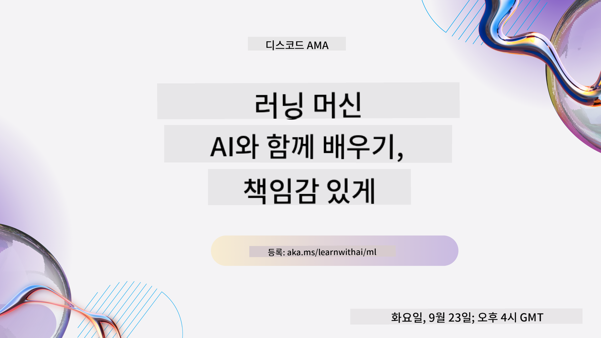
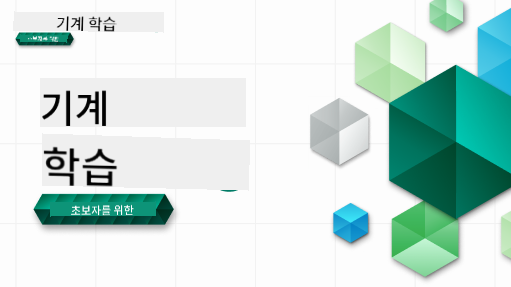

<!--
CO_OP_TRANSLATOR_METADATA:
{
  "original_hash": "7a13afb3674838f557d61f8d67e4d5f8",
  "translation_date": "2025-10-24T08:59:42+00:00",
  "source_file": "README.md",
  "language_code": "ko"
}
-->

### 🌐 다국어 지원

#### GitHub Action을 통해 지원 (자동화 및 항상 최신 상태 유지)

<!-- CO-OP TRANSLATOR LANGUAGES TABLE START -->
[아랍어](../ar/README.md) | [벵골어](../bn/README.md) | [불가리아어](../bg/README.md) | [버마어 (미얀마)](../my/README.md) | [중국어 (간체)](../zh/README.md) | [중국어 (번체, 홍콩)](../hk/README.md) | [중국어 (번체, 마카오)](../mo/README.md) | [중국어 (번체, 대만)](../tw/README.md) | [크로아티아어](../hr/README.md) | [체코어](../cs/README.md) | [덴마크어](../da/README.md) | [네덜란드어](../nl/README.md) | [에스토니아어](../et/README.md) | [핀란드어](../fi/README.md) | [프랑스어](../fr/README.md) | [독일어](../de/README.md) | [그리스어](../el/README.md) | [히브리어](../he/README.md) | [힌디어](../hi/README.md) | [헝가리어](../hu/README.md) | [인도네시아어](../id/README.md) | [이탈리아어](../it/README.md) | [일본어](../ja/README.md) | [한국어](./README.md) | [리투아니아어](../lt/README.md) | [말레이어](../ms/README.md) | [마라티어](../mr/README.md) | [네팔어](../ne/README.md) | [노르웨이어](../no/README.md) | [페르시아어 (파르시)](../fa/README.md) | [폴란드어](../pl/README.md) | [포르투갈어 (브라질)](../br/README.md) | [포르투갈어 (포르투갈)](../pt/README.md) | [펀자브어 (구르무키)](../pa/README.md) | [루마니아어](../ro/README.md) | [러시아어](../ru/README.md) | [세르비아어 (키릴)](../sr/README.md) | [슬로바키아어](../sk/README.md) | [슬로베니아어](../sl/README.md) | [스페인어](../es/README.md) | [스와힐리어](../sw/README.md) | [스웨덴어](../sv/README.md) | [타갈로그어 (필리핀)](../tl/README.md) | [타밀어](../ta/README.md) | [태국어](../th/README.md) | [터키어](../tr/README.md) | [우크라이나어](../uk/README.md) | [우르두어](../ur/README.md) | [베트남어](../vi/README.md)
<!-- CO-OP TRANSLATOR LANGUAGES TABLE END -->

#### 커뮤니티에 참여하세요

현재 Discord에서 AI 학습 시리즈가 진행 중입니다. [Learn with AI Series](https://aka.ms/learnwithai/discord)를 통해 2025년 9월 18일부터 30일까지 함께하세요. 데이터 과학을 위한 GitHub Copilot 사용 팁과 트릭을 배울 수 있습니다.

# 초보자를 위한 머신러닝 - 커리큘럼

> 🌍 세계 문화를 통해 머신러닝을 탐구하며 세계를 여행하세요 🌍

Microsoft의 Cloud Advocates는 **머신러닝**에 관한 12주, 26강의 커리큘럼을 제공합니다. 이 커리큘럼에서는 주로 Scikit-learn 라이브러리를 사용하여 **클래식 머신러닝**이라고 불리는 것을 배우며, 딥러닝은 [AI for Beginners 커리큘럼](https://aka.ms/ai4beginners)에서 다룹니다. 이 강의는 ['Data Science for Beginners' 커리큘럼](https://aka.ms/ds4beginners)과 함께 학습할 수 있습니다.

세계 여러 지역의 데이터를 활용하여 이러한 클래식 기술을 적용하며 우리와 함께 세계를 여행하세요. 각 강의에는 강의 전후 퀴즈, 강의 완료를 위한 작성 지침, 솔루션, 과제 등이 포함되어 있습니다. 프로젝트 기반 학습 방법을 통해 새로운 기술을 효과적으로 익힐 수 있습니다.

**✍️ 저자들에게 깊은 감사** Jen Looper, Stephen Howell, Francesca Lazzeri, Tomomi Imura, Cassie Breviu, Dmitry Soshnikov, Chris Noring, Anirban Mukherjee, Ornella Altunyan, Ruth Yakubu, Amy Boyd

**🎨 일러스트레이터들에게도 감사** Tomomi Imura, Dasani Madipalli, Jen Looper

**🙏 Microsoft Student Ambassador 저자, 리뷰어, 콘텐츠 기여자들에게 특별히 감사드립니다** 특히 Rishit Dagli, Muhammad Sakib Khan Inan, Rohan Raj, Alexandru Petrescu, Abhishek Jaiswal, Nawrin Tabassum, Ioan Samuila, Snigdha Agarwal

**🤩 Microsoft Student Ambassadors Eric Wanjau, Jasleen Sondhi, Vidushi Gupta에게 R 강의에 대한 특별한 감사!**

# 시작하기

다음 단계를 따라주세요:
1. **저장소 포크하기**: 이 페이지 오른쪽 상단의 "Fork" 버튼을 클릭하세요.
2. **저장소 클론하기**: `git clone https://github.com/microsoft/ML-For-Beginners.git`

> [이 과정에 대한 추가 리소스를 Microsoft Learn 컬렉션에서 확인하세요](https://learn.microsoft.com/en-us/collections/qrqzamz1nn2wx3?WT.mc_id=academic-77952-bethanycheum)

> 🔧 **도움이 필요하신가요?** 설치, 설정 및 강의 실행과 관련된 일반적인 문제에 대한 해결책은 [문제 해결 가이드](TROUBLESHOOTING.md)를 확인하세요.

**[학생들](https://aka.ms/student-page)**, 이 커리큘럼을 사용하려면 전체 저장소를 자신의 GitHub 계정으로 포크하고 혼자 또는 그룹과 함께 연습을 완료하세요:

- 강의 전 퀴즈로 시작하세요.
- 강의를 읽고 각 지식 확인에서 멈추고 반성하며 활동을 완료하세요.
- 강의 내용을 이해하며 프로젝트를 만들어보세요. 솔루션 코드를 실행하지 않고도 가능하지만, 해당 코드는 각 프로젝트 기반 강의의 `/solution` 폴더에서 확인할 수 있습니다.
- 강의 후 퀴즈를 풀어보세요.
- 도전을 완료하세요.
- 과제를 완료하세요.
- 강의 그룹을 완료한 후 [토론 게시판](https://github.com/microsoft/ML-For-Beginners/discussions)을 방문하여 적절한 PAT 루브릭을 작성하며 "소리 내어 학습"하세요. 'PAT'는 학습을 더욱 심화하기 위해 작성하는 루브릭입니다. 다른 PAT에 반응하여 함께 학습할 수도 있습니다.

> 추가 학습을 위해 [Microsoft Learn](https://docs.microsoft.com/en-us/users/jenlooper-2911/collections/k7o7tg1gp306q4?WT.mc_id=academic-77952-leestott) 모듈과 학습 경로를 따라가기를 권장합니다.

**교사들**, 이 커리큘럼을 활용하는 방법에 대한 [제안](for-teachers.md)을 포함시켰습니다.

---

## 비디오 워크스루

일부 강의는 짧은 형식의 비디오로 제공됩니다. 이 비디오들은 강의 내에서 확인할 수 있으며, Microsoft Developer YouTube 채널의 [ML for Beginners 재생 목록](https://aka.ms/ml-beginners-videos)에서 확인할 수 있습니다. 아래 이미지를 클릭하세요.

---

## 팀 소개

**Gif 제작** [Mohit Jaisal](https://linkedin.com/in/mohitjaisal)

> 🎥 위 이미지를 클릭하면 프로젝트와 제작자들에 대한 비디오를 볼 수 있습니다!

---

## 교육 방법론

이 커리큘럼을 제작하면서 두 가지 교육 원칙을 선택했습니다: **프로젝트 기반**으로 실습을 진행하며 **빈번한 퀴즈**를 포함하는 것입니다. 또한, 이 커리큘럼은 공통 **테마**를 포함하여 일관성을 제공합니다.

콘텐츠가 프로젝트와 연계되도록 함으로써 학생들에게 더 흥미로운 학습 경험을 제공하며 개념의 유지력을 높일 수 있습니다. 또한, 수업 전 저위험 퀴즈는 학생이 주제를 학습할 의도를 설정하게 하고, 수업 후 퀴즈는 개념의 추가적인 유지력을 보장합니다. 이 커리큘럼은 유연하고 재미있게 설계되었으며 전체 또는 일부를 선택하여 학습할 수 있습니다. 프로젝트는 작게 시작하여 12주 과정이 끝날 때 점점 복잡해집니다. 이 커리큘럼은 또한 ML의 실제 응용에 대한 후기를 포함하고 있어 추가 학점으로 사용하거나 토론의 기초로 활용할 수 있습니다.

> 우리의 [행동 강령](CODE_OF_CONDUCT.md), [기여](CONTRIBUTING.md), [번역](TRANSLATIONS.md), [문제 해결](TROUBLESHOOTING.md) 지침을 확인하세요. 건설적인 피드백을 환영합니다!

## 각 강의에는 다음이 포함됩니다

- 선택적 스케치 노트
- 선택적 보충 비디오
- 비디오 워크스루 (일부 강의만 해당)
- [강의 전 준비 퀴즈](https://ff-quizzes.netlify.app/en/ml/)
- 작성된 강의
- 프로젝트 기반 강의의 경우, 프로젝트를 구축하는 단계별 가이드
- 지식 확인
- 도전 과제
- 보충 읽기 자료
- 과제
- [강의 후 퀴즈](https://ff-quizzes.netlify.app/en/ml/)

> **언어에 대한 참고 사항**: 이 강의는 주로 Python으로 작성되었지만 일부는 R로도 제공됩니다. R 강의를 완료하려면 `/solution` 폴더로 이동하여 R 강의를 찾으세요. R 강의는 .rmd 확장자를 포함하며, 이는 `Markdown 문서`에 `코드 청크`(R 또는 다른 언어)와 `YAML 헤더`(PDF와 같은 출력 형식을 안내)를 포함하는 것으로 간단히 정의할 수 있습니다. 따라서 코드, 출력 및 생각을 Markdown에 기록할 수 있어 데이터 과학을 위한 훌륭한 저작 프레임워크로 작용합니다. 또한, R Markdown 문서는 PDF, HTML 또는 Word와 같은 출력 형식으로 렌더링될 수 있습니다.

> **퀴즈에 대한 참고 사항**: 모든 퀴즈는 [Quiz App 폴더](../../quiz-app)에 포함되어 있으며, 총 52개의 퀴즈가 각 3개의 질문으로 구성되어 있습니다. 강의 내에서 링크되어 있지만, `quiz-app` 폴더의 지침을 따라 로컬에서 실행하거나 Azure에 배포할 수 있습니다. 

| 강의 번호 |                             주제                              |                   강의 그룹                   | 학습 목표                                                                                                             |                                                              연결된 강의                                                               |                        저자                        |
| :-----------: | :------------------------------------------------------------: | :-------------------------------------------------: | ------------------------------------------------------------------------------------------------------------------------------- | :--------------------------------------------------------------------------------------------------------------------------------------: | :--------------------------------------------------: |
|      01       |                머신 러닝 소개                                  |      [Introduction](1-Introduction/README.md)       | 머신 러닝의 기본 개념을 배워보세요                                                                                              |                                             [Lesson](1-Introduction/1-intro-to-ML/README.md)                                             |                       Muhammad                       |
|      02       |                머신 러닝의 역사                                |      [Introduction](1-Introduction/README.md)       | 이 분야의 역사적 배경을 배워보세요                                                                                              |                                            [Lesson](1-Introduction/2-history-of-ML/README.md)                                            |                     Jen and Amy                      |
|      03       |                 공정성과 머신 러닝                             |      [Introduction](1-Introduction/README.md)       | 학생들이 ML 모델을 구축하고 적용할 때 고려해야 할 공정성에 관한 중요한 철학적 문제는 무엇일까요?                                  |                                              [Lesson](1-Introduction/3-fairness/README.md)                                               |                        Tomomi                        |
|      04       |                머신 러닝 기술                                  |      [Introduction](1-Introduction/README.md)       | ML 연구자들이 ML 모델을 구축할 때 사용하는 기술은 무엇일까요?                                                                   |                                          [Lesson](1-Introduction/4-techniques-of-ML/README.md)                                           |                    Chris and Jen                     |
|      05       |                   회귀 소개                                    |        [Regression](2-Regression/README.md)         | 회귀 모델을 위해 Python과 Scikit-learn을 시작해보세요                                                                            |         [Python](2-Regression/1-Tools/README.md) • [R](../../2-Regression/1-Tools/solution/R/lesson_1.html)         |      Jen • Eric Wanjau       |
|      06       |                북미 호박 가격 🎃                               |        [Regression](2-Regression/README.md)         | ML 준비를 위해 데이터를 시각화하고 정리해보세요                                                                                  |          [Python](2-Regression/2-Data/README.md) • [R](../../2-Regression/2-Data/solution/R/lesson_2.html)          |      Jen • Eric Wanjau       |
|      07       |                북미 호박 가격 🎃                               |        [Regression](2-Regression/README.md)         | 선형 및 다항 회귀 모델을 구축해보세요                                                                                           |        [Python](2-Regression/3-Linear/README.md) • [R](../../2-Regression/3-Linear/solution/R/lesson_3.html)        |      Jen and Dmitry • Eric Wanjau       |
|      08       |                북미 호박 가격 🎃                               |        [Regression](2-Regression/README.md)         | 로지스틱 회귀 모델을 구축해보세요                                                                                               |     [Python](2-Regression/4-Logistic/README.md) • [R](../../2-Regression/4-Logistic/solution/R/lesson_4.html)      |      Jen • Eric Wanjau       |
|      09       |                          웹 앱 🔌                              |           [Web App](3-Web-App/README.md)            | 학습된 모델을 사용하기 위한 웹 앱을 구축해보세요                                                                                 |                                                 [Python](3-Web-App/1-Web-App/README.md)                                                  |                         Jen                          |
|      10       |                 분류 소개                                      |    [Classification](4-Classification/README.md)     | 데이터를 정리, 준비, 시각화하고 분류를 소개합니다                                                                                | [Python](4-Classification/1-Introduction/README.md) • [R](../../4-Classification/1-Introduction/solution/R/lesson_10.html)  | Jen and Cassie • Eric Wanjau |
|      11       |             맛있는 아시아 및 인도 요리 🍜                      |    [Classification](4-Classification/README.md)     | 분류기를 소개합니다                                                                                                             | [Python](4-Classification/2-Classifiers-1/README.md) • [R](../../4-Classification/2-Classifiers-1/solution/R/lesson_11.html) | Jen and Cassie • Eric Wanjau |
|      12       |             맛있는 아시아 및 인도 요리 🍜                      |    [Classification](4-Classification/README.md)     | 더 많은 분류기를 배워보세요                                                                                                     | [Python](4-Classification/3-Classifiers-2/README.md) • [R](../../4-Classification/3-Classifiers-2/solution/R/lesson_12.html) | Jen and Cassie • Eric Wanjau |
|      13       |             맛있는 아시아 및 인도 요리 🍜                      |    [Classification](4-Classification/README.md)     | 모델을 사용하여 추천 웹 앱을 구축해보세요                                                                                       |                                              [Python](4-Classification/4-Applied/README.md)                                              |                         Jen                          |
|      14       |                   클러스터링 소개                              |        [Clustering](5-Clustering/README.md)         | 데이터를 정리, 준비, 시각화하고 클러스터링을 소개합니다                                                                          |         [Python](5-Clustering/1-Visualize/README.md) • [R](../../5-Clustering/1-Visualize/solution/R/lesson_14.html)         |      Jen • Eric Wanjau       |
|      15       |              나이지리아 음악 취향 탐구 🎧                      |        [Clustering](5-Clustering/README.md)         | K-Means 클러스터링 방법을 탐구해보세요                                                                                          |           [Python](5-Clustering/2-K-Means/README.md) • [R](../../5-Clustering/2-K-Means/solution/R/lesson_15.html)           |      Jen • Eric Wanjau       |
|      16       |        자연어 처리 소개 ☕️                                    |   [Natural language processing](6-NLP/README.md)    | 간단한 봇을 구축하며 NLP의 기본을 배워보세요                                                                                    |                                             [Python](6-NLP/1-Introduction-to-NLP/README.md)                                              |                       Stephen                        |
|      17       |                      일반적인 NLP 작업 ☕️                      |   [Natural language processing](6-NLP/README.md)    | 언어 구조를 다룰 때 필요한 일반적인 작업을 이해하며 NLP 지식을 심화해보세요                                                      |                                                    [Python](6-NLP/2-Tasks/README.md)                                                     |                       Stephen                        |
|      18       |             번역 및 감정 분석 ♥️                               |   [Natural language processing](6-NLP/README.md)    | 제인 오스틴과 함께 번역 및 감정 분석을 배워보세요                                                                               |                                            [Python](6-NLP/3-Translation-Sentiment/README.md)                                             |                       Stephen                        |
|      19       |                  유럽의 로맨틱 호텔 ♥️                        |   [Natural language processing](6-NLP/README.md)    | 호텔 리뷰를 활용한 감정 분석 1                                                                                                  |                                               [Python](6-NLP/4-Hotel-Reviews-1/README.md)                                                |                       Stephen                        |
|      20       |                  유럽의 로맨틱 호텔 ♥️                        |   [Natural language processing](6-NLP/README.md)    | 호텔 리뷰를 활용한 감정 분석 2                                                                                                  |                                               [Python](6-NLP/5-Hotel-Reviews-2/README.md)                                                |                       Stephen                        |
|      21       |            시계열 예측 소개                                    |        [Time series](7-TimeSeries/README.md)        | 시계열 예측을 소개합니다                                                                                                        |                                             [Python](7-TimeSeries/1-Introduction/README.md)                                              |                      Francesca                       |
|      22       | ⚡️ 세계 전력 사용 ⚡️ - ARIMA를 활용한 시계열 예측             |        [Time series](7-TimeSeries/README.md)        | ARIMA를 활용한 시계열 예측                                                                                                     |                                                 [Python](7-TimeSeries/2-ARIMA/README.md)                                                 |                      Francesca                       |
|      23       |  ⚡️ 세계 전력 사용 ⚡️ - SVR을 활용한 시계열 예측              |        [Time series](7-TimeSeries/README.md)        | 서포트 벡터 회귀를 활용한 시계열 예측                                                                                          |                                                  [Python](7-TimeSeries/3-SVR/README.md)                                                  |                       Anirban                        |
|      24       |             강화 학습 소개                                     | [Reinforcement learning](8-Reinforcement/README.md) | Q-Learning을 활용한 강화 학습 소개                                                                                             |                                             [Python](8-Reinforcement/1-QLearning/README.md)                                              |                        Dmitry                        |
|      25       |                 피터가 늑대를 피하도록 도와주세요! 🐺          | [Reinforcement learning](8-Reinforcement/README.md) | 강화 학습 Gym                                                                                                                  |                                                [Python](8-Reinforcement/2-Gym/README.md)                                                 |                        Dmitry                        |
|  Postscript   |            실제 ML 시나리오 및 응용                            |      [ML in the Wild](9-Real-World/README.md)       | 고전적인 ML의 흥미롭고 놀라운 실제 응용 사례                                                                                   |                                             [Lesson](9-Real-World/1-Applications/README.md)                                              |                         Team                         |
|  Postscript   |            RAI 대시보드를 활용한 ML 모델 디버깅               |      [ML in the Wild](9-Real-World/README.md)       | 책임 있는 AI 대시보드 구성 요소를 활용한 머신 러닝 모델 디버깅                                                                  |                                             [Lesson](9-Real-World/2-Debugging-ML-Models/README.md)                                              |                         Ruth Yakubu                       |

> [이 과정에 대한 추가 리소스를 Microsoft Learn 컬렉션에서 확인하세요](https://learn.microsoft.com/en-us/collections/qrqzamz1nn2wx3?WT.mc_id=academic-77952-bethanycheum)

## 오프라인 액세스

[Docsify](https://docsify.js.org/#/)를 사용하여 이 문서를 오프라인으로 실행할 수 있습니다. 이 저장소를 포크하고, [Docsify 설치](https://docsify.js.org/#/quickstart)를 로컬 머신에 설치한 후, 이 저장소의 루트 폴더에서 `docsify serve`를 입력하세요. 웹사이트는 로컬호스트의 포트 3000에서 제공됩니다: `localhost:3000`.

## PDF

링크가 포함된 커리큘럼 PDF를 [여기](https://microsoft.github.io/ML-For-Beginners/pdf/readme.pdf)에서 확인하세요.

## 🎒 다른 과정들

우리 팀은 다른 과정도 제작합니다! 확인해보세요:

### Azure / Edge / MCP / Agents

---

### 생성형 AI 시리즈

[-9333EA?style=for-the-badge&labelColor=E5E7EB&color=9333EA)](https://github.com/microsoft/Generative-AI-for-beginners-dotnet?WT.mc_id=academic-105485-koreyst)
[-C084FC?style=for-the-badge&labelColor=E5E7EB&color=C084FC)](https://github.com/microsoft/generative-ai-for-beginners-java?WT.mc_id=academic-105485-koreyst)
[-E879F9?style=for-the-badge&labelColor=E5E7EB&color=E879F9)](https://github.com/microsoft/generative-ai-with-javascript?WT.mc_id=academic-105485-koreyst)

---

### 핵심 학습
  
  
  
  
  
  
  

---

### Copilot 시리즈  
  
  
  

## 도움 받기  

AI 앱을 구축하다가 막히거나 질문이 있다면 다음 커뮤니티에 참여하세요:  

  

제품 피드백을 제공하거나 구축 중 오류가 발생하면 다음을 방문하세요:  

  

---

**면책 조항**:  
이 문서는 AI 번역 서비스 [Co-op Translator](https://github.com/Azure/co-op-translator)를 사용하여 번역되었습니다. 정확성을 위해 최선을 다하고 있지만, 자동 번역에는 오류나 부정확성이 포함될 수 있습니다. 원본 문서의 원어 버전을 권위 있는 출처로 간주해야 합니다. 중요한 정보의 경우, 전문적인 인간 번역을 권장합니다. 이 번역 사용으로 인해 발생하는 오해나 잘못된 해석에 대해 책임을 지지 않습니다.