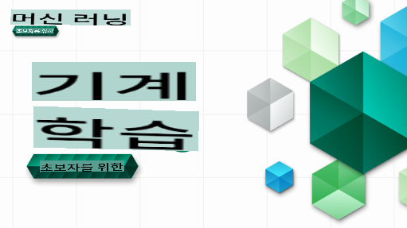

# 초보자를 위한 머신 러닝 - 커리큘럼

> 🌍 세계 문화를 통해 머신 러닝을 탐험하는 여행을 떠나보세요 🌍

Microsoft의 클라우드 옹호자들이 **머신 러닝**에 대한 12주, 26강 커리큘럼을 제공하게 되어 기쁩니다. 이 커리큘럼에서 주로 Scikit-learn 라이브러리를 사용하여 **클래식 머신 러닝**을 배우게 되며, 심화 학습은 [초보자를 위한 AI 커리큘럼](https://aka.ms/ai4beginners)에서 다룹니다. 이 강의와 함께 ['초보자를 위한 데이터 과학' 커리큘럼](https://aka.ms/ds4beginners)도 활용해보세요!

세계 각지의 데이터를 이용하여 이 클래식 기술을 적용하면서 우리와 함께 세계를 여행하세요. 각 강의에는 강의 전후의 퀴즈, 강의 완성에 필요한 서면 지침, 솔루션, 과제 등이 포함되어 있습니다. 프로젝트 기반 학습법을 통해 새로운 기술을 습득하면서 배울 수 있습니다.

**✍️ 저자들에게 깊은 감사의 인사를 전합니다** Jen Looper, Stephen Howell, Francesca Lazzeri, Tomomi Imura, Cassie Breviu, Dmitry Soshnikov, Chris Noring, Anirban Mukherjee, Ornella Altunyan, Ruth Yakubu, 그리고 Amy Boyd

**🎨 일러스트레이터들에게도 감사드립니다** Tomomi Imura, Dasani Madipalli, 그리고 Jen Looper

**🙏 특별히 Microsoft Student Ambassador 저자, 리뷰어, 그리고 콘텐츠 기여자들에게 감사드립니다**, 특히 Rishit Dagli, Muhammad Sakib Khan Inan, Rohan Raj, Alexandru Petrescu, Abhishek Jaiswal, Nawrin Tabassum, Ioan Samuila, 그리고 Snigdha Agarwal

**🤩 R 강의에 도움을 준 Microsoft Student Ambassadors Eric Wanjau, Jasleen Sondhi, 그리고 Vidushi Gupta에게도 특별히 감사드립니다!**

# 시작하기

다음 단계를 따르세요:
1. **저장소 포크하기**: 이 페이지 오른쪽 상단의 "Fork" 버튼을 클릭하세요.
2. **저장소 클론하기**: `git clone https://github.com/microsoft/ML-For-Beginners.git`

> [이 강좌에 대한 추가 리소스는 Microsoft Learn 컬렉션에서 확인하세요](https://learn.microsoft.com/en-us/collections/qrqzamz1nn2wx3?WT.mc_id=academic-77952-bethanycheum)

**[학생들](https://aka.ms/student-page)**, 이 커리큘럼을 사용하려면 전체 저장소를 자신의 GitHub 계정으로 포크하고 혼자 또는 그룹과 함께 연습을 완료하세요:

- 강의 전 퀴즈부터 시작하세요.
- 강의를 읽고 활동을 완료하세요. 각 지식 점검에서 멈추고 생각해보세요.
- 솔루션 코드를 실행하지 않고 강의를 이해하여 프로젝트를 시도하세요. 그러나 해당 코드는 각 프로젝트 기반 강의의 `/solution` 폴더에 있습니다.
- 강의 후 퀴즈를 풀어보세요.
- 도전을 완료하세요.
- 과제를 완료하세요.
- 강의 그룹을 완료한 후 [토론 게시판](https://github.com/microsoft/ML-For-Beginners/discussions)에 방문하여 적절한 PAT 루브릭을 작성하여 "소리 내어 학습"하세요. 'PAT'는 학습을 촉진하기 위해 작성하는 루브릭입니다. 다른 PAT에 반응하여 함께 학습할 수 있습니다.

> 추가 학습을 위해 이 [Microsoft Learn](https://docs.microsoft.com/en-us/users/jenlooper-2911/collections/k7o7tg1gp306q4?WT.mc_id=academic-77952-leestott) 모듈과 학습 경로를 따르기를 권장합니다.

**교사들**, 이 커리큘럼을 사용하는 방법에 대한 [몇 가지 제안](for-teachers.md)을 포함시켰습니다.

---

## 비디오 워크스루

일부 강의는 짧은 형식의 비디오로 제공됩니다. 이 비디오는 강의 내에 인라인으로 포함되어 있거나, [Microsoft Developer YouTube 채널의 초보자를 위한 머신 러닝 재생 목록](https://aka.ms/ml-beginners-videos)에서 이미지를 클릭하여 찾을 수 있습니다.

---

## 팀 소개

**Gif by** [Mohit Jaisal](https://linkedin.com/in/mohitjaisal)

> 🎥 위 이미지를 클릭하여 프로젝트와 창작자들에 대한 비디오를 확인하세요!

---

## 교육 방법론

이 커리큘럼을 만들 때 두 가지 교육 원칙을 선택했습니다: **프로젝트 기반** 학습과 **빈번한 퀴즈**를 포함하는 것입니다. 또한, 이 커리큘럼에는 일관성을 위해 공통 **주제**가 있습니다.

프로젝트와 연계된 콘텐츠를 보장함으로써 학습 과정은 학생들에게 더 흥미롭고 개념의 유지율이 높아집니다. 또한, 수업 전 낮은 부담의 퀴즈는 학생이 주제를 학습할 의도를 설정하고, 수업 후 두 번째 퀴즈는 추가적인 개념 유지율을 보장합니다. 이 커리큘럼은 유연하고 재미있게 설계되었으며 전체 또는 일부를 수강할 수 있습니다. 프로젝트는 작게 시작하여 12주 사이클이 끝날 때 점점 복잡해집니다. 이 커리큘럼에는 ML의 실제 응용에 대한 후기가 포함되어 있으며, 이는 추가 학점으로 사용하거나 토론의 기초로 사용할 수 있습니다.

> 우리의 [행동 강령](CODE_OF_CONDUCT.md), [기여](CONTRIBUTING.md), 그리고 [번역](TRANSLATIONS.md) 지침을 확인하세요. 건설적인 피드백을 환영합니다!

## 각 강의에는 다음이 포함됩니다

- 선택적 스케치 노트
- 선택적 보충 비디오
- 비디오 워크스루 (일부 강의만 해당)
- 강의 전 워밍업 퀴즈
- 서면 강의
- 프로젝트 기반 강의를 위한 단계별 가이드
- 지식 점검
- 도전 과제
- 보충 읽기 자료
- 과제
- 강의 후 퀴즈

> **언어에 대한 주의 사항**: 이 강의는 주로 Python으로 작성되었지만, 많은 강의가 R로도 제공됩니다. R 강의를 완료하려면 `/solution` 폴더로 이동하여 R 강의를 찾으세요. 이들은 .rmd 확장자를 포함하며, 이는 **R Markdown** 파일을 나타냅니다. 이는 코드(R 또는 다른 언어)와 출력 형식을 안내하는 `YAML header` (PDF 등) 및 `Markdown document`을 포함하는 문서입니다. 따라서 데이터 과학을 위한 저작 프레임워크로서 훌륭하며, 코드를 출력과 함께 작성하고 생각을 Markdown으로 기록할 수 있습니다. 게다가, R Markdown 문서는 PDF, HTML 또는 Word와 같은 출력 형식으로 렌더링될 수 있습니다.

> **퀴즈에 대한 주의 사항**: 모든 퀴즈는 [퀴즈 앱 폴더](../../quiz-app)에 포함되어 있으며, 각 퀴즈는 3개의 질문으로 구성된 52개의 퀴즈로 이루어져 있습니다. 이들은 강의 내에서 링크되어 있지만, 퀴즈 앱을 로컬에서 실행할 수 있습니다. `quiz-app` 폴더의 지침을 따라 로컬에서 호스트하거나 Azure에 배포하세요.

| 강의 번호 |                             주제                              |                   강의 그룹                   | 학습 목표                                                                                                             |                                                              링크된 강의                                                               |                        저자                        |
| :-----------: | :------------------------------------------------------------: | :-------------------------------------------------: | ------------------------------------------------------------------------------------------------------------------------------- | :--------------------------------------------------------------------------------------------------------------------------------------: | :--------------------------------------------------: |
|      01       |                머신 러닝 소개                |      [소개](1-Introduction/README.md)       | 머신 러닝의 기본 개념을 배우세요                                                                                |                                             [강의](1-Introduction/1-intro-to-ML/README.md)                                             |                       Muhammad                       |
|      02       |                머신 러닝의 역사                 |      [소개](1-Introduction/README.md)       | 이 분야의 역사를 배우세요                                                                                         |                                            [강의](1-Introduction/2-history-of-ML/README.md)                                            |                     Jen and Amy                      |
|      03       |                 공정성과 머신 러닝                  |      [소개](1-Introduction/README.md)       | 학생들이 ML 모델을 구축하고 적용할 때 고려해야 할 중요한 철학적 문제는 무엇입니까? |                                              [강의](1-Introduction/3-fairness/README.md)                                               |                        Tomomi                        |
|      04       |                기계 학습을 위한 기법들                        |      [Introduction](1-Introduction/README.md)       | ML 연구자들이 ML 모델을 구축하기 위해 사용하는 기법은 무엇일까요?                                                               |                                          [Lesson](1-Introduction/4-techniques-of-ML/README.md)                                           |                    Chris and Jen                     |
|      05       |                   회귀 소개                                   |        [Regression](2-Regression/README.md)         | 회귀 모델을 위해 Python과 Scikit-learn을 시작해보세요                                                                       |         <ul><li>[Python](2-Regression/1-Tools/README.md)</li><li>[R](../../2-Regression/1-Tools/solution/R/lesson_1.html)</li></ul>         |      <ul><li>Jen</li><li>Eric Wanjau</li></ul>       |
|      06       |                북미 호박 가격 🎃                              |        [Regression](2-Regression/README.md)         | ML 준비를 위해 데이터를 시각화하고 정리하세요                                                                              |          <ul><li>[Python](2-Regression/2-Data/README.md)</li><li>[R](../../2-Regression/2-Data/solution/R/lesson_2.html)</li></ul>          |      <ul><li>Jen</li><li>Eric Wanjau</li></ul>       |
|      07       |                북미 호박 가격 🎃                              |        [Regression](2-Regression/README.md)         | 선형 및 다항 회귀 모델을 구축하세요                                                                                       |        <ul><li>[Python](2-Regression/3-Linear/README.md)</li><li>[R](../../2-Regression/3-Linear/solution/R/lesson_3.html)</li></ul>        |      <ul><li>Jen and Dmitry</li><li>Eric Wanjau</li></ul>       |
|      08       |                북미 호박 가격 🎃                              |        [Regression](2-Regression/README.md)         | 로지스틱 회귀 모델을 구축하세요                                                                                           |     <ul><li>[Python](2-Regression/4-Logistic/README.md) </li><li>[R](../../2-Regression/4-Logistic/solution/R/lesson_4.html)</li></ul>      |      <ul><li>Jen</li><li>Eric Wanjau</li></ul>       |
|      09       |                          웹 앱 🔌                             |           [Web App](3-Web-App/README.md)            | 학습된 모델을 사용하는 웹 앱을 구축하세요                                                                                  |                                                 [Python](3-Web-App/1-Web-App/README.md)                                                  |                         Jen                          |
|      10       |                 분류 소개                                     |    [Classification](4-Classification/README.md)     | 데이터를 정리하고 준비하고 시각화하세요; 분류 소개                                                                          | <ul><li> [Python](4-Classification/1-Introduction/README.md) </li><li>[R](../../4-Classification/1-Introduction/solution/R/lesson_10.html)  | <ul><li>Jen and Cassie</li><li>Eric Wanjau</li></ul> |
|      11       |             맛있는 아시아 및 인도 요리 🍜                    |    [Classification](4-Classification/README.md)     | 분류기 소개                                                                                                                 | <ul><li> [Python](4-Classification/2-Classifiers-1/README.md)</li><li>[R](../../4-Classification/2-Classifiers-1/solution/R/lesson_11.html) | <ul><li>Jen and Cassie</li><li>Eric Wanjau</li></ul> |
|      12       |             맛있는 아시아 및 인도 요리 🍜                    |    [Classification](4-Classification/README.md)     | 더 많은 분류기                                                                                                              | <ul><li> [Python](4-Classification/3-Classifiers-2/README.md)</li><li>[R](../../4-Classification/3-Classifiers-2/solution/R/lesson_12.html) | <ul><li>Jen and Cassie</li><li>Eric Wanjau</li></ul> |
|      13       |             맛있는 아시아 및 인도 요리 🍜                    |    [Classification](4-Classification/README.md)     | 모델을 사용하여 추천 웹 앱을 구축하세요                                                                                   |                                              [Python](4-Classification/4-Applied/README.md)                                              |                         Jen                          |
|      14       |                   클러스터링 소개                             |        [Clustering](5-Clustering/README.md)         | 데이터를 정리하고 준비하고 시각화하세요; 클러스터링 소개                                                                    |         <ul><li> [Python](5-Clustering/1-Visualize/README.md)</li><li>[R](../../5-Clustering/1-Visualize/solution/R/lesson_14.html)         |      <ul><li>Jen</li><li>Eric Wanjau</li></ul>       |
|      15       |              나이지리아 음악 취향 탐색 🎧              |        [Clustering](5-Clustering/README.md)         | K-Means 클러스터링 방법 탐구                                                                                           |           <ul><li> [Python](5-Clustering/2-K-Means/README.md)</li><li>[R](../../5-Clustering/2-K-Means/solution/R/lesson_15.html)           |      <ul><li>Jen</li><li>Eric Wanjau</li></ul>       |
|      16       |        자연어 처리 소개 ☕️         |   [Natural language processing](6-NLP/README.md)    | 간단한 봇을 만들어보며 NLP의 기본 개념 배우기                                                                             |                                             [Python](6-NLP/1-Introduction-to-NLP/README.md)                                              |                       Stephen                        |
|      17       |                      일반적인 NLP 작업 ☕️                      |   [Natural language processing](6-NLP/README.md)    | 언어 구조를 다룰 때 필요한 일반적인 작업을 이해하며 NLP 지식 심화                          |                                                    [Python](6-NLP/2-Tasks/README.md)                                                     |                       Stephen                        |
|      18       |             번역 및 감정 분석 ♥️              |   [Natural language processing](6-NLP/README.md)    | 제인 오스틴과 함께하는 번역 및 감정 분석                                                                             |                                            [Python](6-NLP/3-Translation-Sentiment/README.md)                                             |                       Stephen                        |
|      19       |                  유럽의 로맨틱 호텔 ♥️                  |   [Natural language processing](6-NLP/README.md)    | 호텔 리뷰를 통한 감정 분석 1                                                                                         |                                               [Python](6-NLP/4-Hotel-Reviews-1/README.md)                                                |                       Stephen                        |
|      20       |                  유럽의 로맨틱 호텔 ♥️                  |   [Natural language processing](6-NLP/README.md)    | 호텔 리뷰를 통한 감정 분석 2                                                                                         |                                               [Python](6-NLP/5-Hotel-Reviews-2/README.md)                                                |                       Stephen                        |
|      21       |            시계열 예측 소개             |        [Time series](7-TimeSeries/README.md)        | 시계열 예측 소개                                                                                         |                                             [Python](7-TimeSeries/1-Introduction/README.md)                                              |                      Francesca                       |
|      22       | ⚡️ 세계 전력 사용량 ⚡️ - ARIMA를 이용한 시계열 예측 |        [Time series](7-TimeSeries/README.md)        | ARIMA를 이용한 시계열 예측                                                                                              |                                                 [Python](7-TimeSeries/2-ARIMA/README.md)                                                 |                      Francesca                       |
|      23       |  ⚡️ 세계 전력 사용량 ⚡️ - SVR을 이용한 시계열 예측  |        [Time series](7-TimeSeries/README.md)        | 서포트 벡터 회귀를 이용한 시계열 예측                                                                           |                                                  [Python](7-TimeSeries/3-SVR/README.md)                                                  |                       Anirban                        |
|      24       |             강화 학습 소개             | [Reinforcement learning](8-Reinforcement/README.md) | Q-Learning을 통한 강화 학습 소개                                                                          |                                             [Python](8-Reinforcement/1-QLearning/README.md)                                              |                        Dmitry                        |
|      25       |                 피터가 늑대를 피하도록 도와주세요! 🐺                  | [Reinforcement learning](8-Reinforcement/README.md) | 강화 학습 Gym                                                                                                      |                                                [Python](8-Reinforcement/2-Gym/README.md)                                                 |                        Dmitry                        |
|  Postscript   |            실제 세계의 ML 시나리오 및 응용 프로그램            |      [ML in the Wild](9-Real-World/README.md)       | 고전적인 ML의 흥미롭고 놀라운 실제 응용 프로그램                                                               |                                             [Lesson](9-Real-World/1-Applications/README.md)                                              |                         Team                         |
|  Postscript   |            RAI 대시보드를 사용한 ML 모델 디버깅          |      [ML in the Wild](9-Real-World/README.md)       | Responsible AI 대시보드 구성 요소를 사용한 머신 러닝 모델 디버깅                                                              |                                             [Lesson](9-Real-World/2-Debugging-ML-Models/README.md)                                              |                         Ruth Yakubu                       |

> [이 과정의 추가 자료는 Microsoft Learn 컬렉션에서 확인하세요](https://learn.microsoft.com/en-us/collections/qrqzamz1nn2wx3?WT.mc_id=academic-77952-bethanycheum)

## 오프라인 접근

[Docsify](https://docsify.js.org/#/)를 사용하여 이 문서를 오프라인으로 실행할 수 있습니다. 이 저장소를 포크하고, 로컬 머신에 [Docsify 설치](https://docsify.js.org/#/quickstart)를 한 후, 이 저장소의 루트 폴더에서 `docsify serve`을 입력하세요. 웹사이트는 localhost의 포트 3000에서 제공됩니다: `localhost:3000`.

## PDFs
[여기](https://microsoft.github.io/ML-For-Beginners/pdf/readme.pdf)에서 링크가 포함된 커리큘럼의 PDF를 찾을 수 있습니다.

## 도움 요청

번역에 기여하고 싶으신가요? [번역 가이드라인](TRANSLATIONS.md)을 읽고 작업량 관리를 위한 템플릿 이슈를 [여기](https://github.com/microsoft/ML-For-Beginners/issues)에 추가해주세요.

## 다른 커리큘럼

우리 팀은 다른 커리큘럼도 제작합니다! 확인해보세요:

- [AI for Beginners](https://aka.ms/ai4beginners)
- [Data Science for Beginners](https://aka.ms/datascience-beginners)
- [**New Version 2.0** - Generative AI for Beginners](https://aka.ms/genai-beginners)
- [**NEW** Cybersecurity for Beginners](https://github.com/microsoft/Security-101??WT.mc_id=academic-96948-sayoung)
- [Web Dev for Beginners](https://aka.ms/webdev-beginners)
- [IoT for Beginners](https://aka.ms/iot-beginners)
- [Machine Learning for Beginners](https://aka.ms/ml4beginners)
- [XR Development for Beginners](https://aka.ms/xr-dev-for-beginners)
- [Mastering GitHub Copilot for AI Paired Programming](https://aka.ms/GitHubCopilotAI)

**면책 조항**:
이 문서는 기계 기반 AI 번역 서비스를 사용하여 번역되었습니다. 정확성을 위해 노력하고 있지만 자동 번역에는 오류나 부정확성이 포함될 수 있습니다. 원본 문서는 해당 언어로 작성된 문서를 권위 있는 자료로 간주해야 합니다. 중요한 정보의 경우 전문 인간 번역을 권장합니다. 이 번역 사용으로 인해 발생하는 오해나 오역에 대해 당사는 책임을 지지 않습니다.