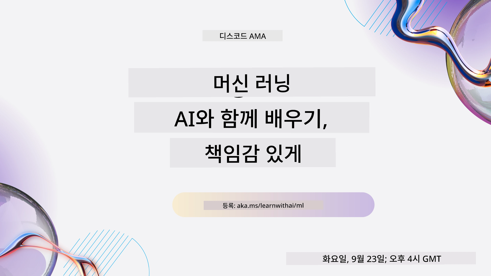
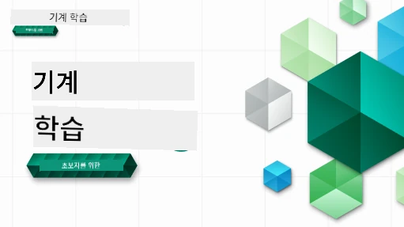

[](https://github.com/microsoft/ML-For-Beginners/blob/master/LICENSE)
[](https://GitHub.com/microsoft/ML-For-Beginners/graphs/contributors/)
[](https://GitHub.com/microsoft/ML-For-Beginners/issues/)
[](https://GitHub.com/microsoft/ML-For-Beginners/pulls/)
[](http://makeapullrequest.com)

[](https://GitHub.com/microsoft/ML-For-Beginners/watchers/)
[](https://GitHub.com/microsoft/ML-For-Beginners/network/)
[](https://GitHub.com/microsoft/ML-For-Beginners/stargazers/)

### 🌐 다국어 지원

#### GitHub Action을 통한 지원 (자동화 및 항상 최신 상태 유지)

<!-- CO-OP TRANSLATOR LANGUAGES TABLE START -->
[아랍어](../ar/README.md) | [벵골어](../bn/README.md) | [불가리아어](../bg/README.md) | [버마어 (미얀마)](../my/README.md) | [중국어 (간체)](../zh-CN/README.md) | [중국어 (번체, 홍콩)](../zh-HK/README.md) | [중국어 (번체, 마카오)](../zh-MO/README.md) | [중국어 (번체, 대만)](../zh-TW/README.md) | [크로아티아어](../hr/README.md) | [체코어](../cs/README.md) | [덴마크어](../da/README.md) | [네덜란드어](../nl/README.md) | [에스토니아어](../et/README.md) | [핀란드어](../fi/README.md) | [프랑스어](../fr/README.md) | [독일어](../de/README.md) | [그리스어](../el/README.md) | [히브리어](../he/README.md) | [힌디어](../hi/README.md) | [헝가리어](../hu/README.md) | [인도네시아어](../id/README.md) | [이탈리아어](../it/README.md) | [일본어](../ja/README.md) | [칸나다어](../kn/README.md) | [크메르어](../km/README.md) | [한국어](./README.md) | [리투아니아어](../lt/README.md) | [말레이어](../ms/README.md) | [말라얄람어](../ml/README.md) | [마라티어](../mr/README.md) | [네팔어](../ne/README.md) | [나이지리아 피진어](../pcm/README.md) | [노르웨이어](../no/README.md) | [페르시아어 (파르시)](../fa/README.md) | [폴란드어](../pl/README.md) | [포르투갈어 (브라질)](../pt-BR/README.md) | [포르투갈어 (포르투갈)](../pt-PT/README.md) | [펀자브어 (구르무키)](../pa/README.md) | [루마니아어](../ro/README.md) | [러시아어](../ru/README.md) | [세르비아어 (키릴문자)](../sr/README.md) | [슬로바키아어](../sk/README.md) | [슬로베니아어](../sl/README.md) | [스페인어](../es/README.md) | [스와힐리어](../sw/README.md) | [스웨덴어](../sv/README.md) | [타갈로그어 (필리핀)](../tl/README.md) | [타밀어](../ta/README.md) | [텔루구어](../te/README.md) | [태국어](../th/README.md) | [터키어](../tr/README.md) | [우크라이나어](../uk/README.md) | [우르두어](../ur/README.md) | [베트남어](../vi/README.md)

> **로컬 복제를 선호하나요?**
>
> 이 저장소에는 50개 이상의 언어 번역본이 포함되어 있어 다운로드 크기가 크게 증가합니다. 번역 없이 복제하려면 Sparse Checkout을 사용하세요:
>
> **Bash / macOS / Linux:**
> ```bash
> git clone --filter=blob:none --sparse https://github.com/microsoft/ML-For-Beginners.git
> cd ML-For-Beginners
> git sparse-checkout set --no-cone '/*' '!translations' '!translated_images'
> ```
>
> **CMD (Windows):**
> ```cmd
> git clone --filter=blob:none --sparse https://github.com/microsoft/ML-For-Beginners.git
> cd ML-For-Beginners
> git sparse-checkout set --no-cone "/*" "!translations" "!translated_images"
> ```
>
> 이렇게 하면 훨씬 빠른 다운로드로 코스 완료에 필요한 모든 것을 받을 수 있습니다.
<!-- CO-OP TRANSLATOR LANGUAGES TABLE END -->

#### 커뮤니티에 참여하세요

[](https://discord.gg/nTYy5BXMWG)

AI와 함께 배우는 Discord 시리즈가 진행 중입니다. 2025년 9월 18일부터 30일까지 [Learn with AI Series](https://aka.ms/learnwithai/discord)에서 자세히 배우고 참여하세요. GitHub Copilot을 활용한 데이터 과학 팁과 요령을 얻을 수 있습니다.



# 초보자를 위한 머신 러닝 - 교육 과정

> 🌍 세계 문화를 통해 머신 러닝을 탐험하며 세계 여행을 떠나세요 🌍

Microsoft의 클라우드 옹호자들이 <strong>머신 러닝</strong>에 관한 12주, 26개 강의 교육 과정을 제공합니다. 이 과정에서 주로 Scikit-learn 라이브러리를 사용하여 때로는 <strong>고전 머신 러닝</strong>이라 불리는 것을 배우며, 심층학습은 우리의 [AI for Beginners 교육 과정](https://aka.ms/ai4beginners)에서 다룹니다. 또한 이 강의들을 ['초보자를 위한 데이터 과학' 교육 과정](https://aka.ms/ds4beginners)과 함께 병행하는 것도 좋습니다!

전 세계 여러 분야의 데이터를 대상으로 이러한 고전적인 기법을 적용하며 여행하세요. 각 강의에는 사전 및 사후 퀴즈, 강의 실행을 위한 서면 안내, 해결책, 과제 등이 포함되어 있습니다. 프로젝트 기반 교육 방식은 새로운 기술을 '고착'시키는 검증된 방법으로 학습과 구축을 병행하게 도와줍니다.

**✍️ 저자분들께 진심으로 감사드립니다** Jen Looper, Stephen Howell, Francesca Lazzeri, Tomomi Imura, Cassie Breviu, Dmitry Soshnikov, Chris Noring, Anirban Mukherjee, Ornella Altunyan, Ruth Yakubu, Amy Boyd

**🎨 일러스트 담당자분들께도 감사드립니다** Tomomi Imura, Dasani Madipalli, Jen Looper

**🙏 특별 감사 🙏 Microsoft Student Ambassador 저자, 검토자, 콘텐츠 기여자분들께**, 특히 Rishit Dagli, Muhammad Sakib Khan Inan, Rohan Raj, Alexandru Petrescu, Abhishek Jaiswal, Nawrin Tabassum, Ioan Samuila, Snigdha Agarwal

**🤩 R 강의를 위해 도와주신 Microsoft Student Ambassadors Eric Wanjau, Jasleen Sondhi, Vidushi Gupta께도 특별히 감사드립니다!**

# 시작하기

다음 단계를 따르세요:
1. **저장소 포크**: 이 페이지 우측 상단의 "Fork" 버튼을 클릭하세요.
2. **저장소 클론**:   `git clone https://github.com/microsoft/ML-For-Beginners.git`

> 💡 **빠른 시작 팁:** Python을 로컬에 설치하지 않고 브라우저에서 시작하고 싶다면 [GitHub Codespaces](https://github.com/features/codespaces)를 사용하여 클라우드 개발 환경을 만드세요. 초록색 **Code** 메뉴를 열고 <strong>Codespaces</strong>를 선택하여 codespace를 생성한 후 각 강의에 필요한 종속성을 설치하세요.

> [Microsoft Learn 모음에서 이 코스의 모든 추가 자료를 확인하세요](https://learn.microsoft.com/en-us/collections/qrqzamz1nn2wx3?WT.mc_id=academic-77952-bethanycheum)

> 🔧 **도움이 필요하신가요?** 설치, 설정, 강의 실행 시 일반적인 문제 해결책을 [문제 해결 가이드](TROUBLESHOOTING.md)에서 확인하세요.


<strong>[학생](https://aka.ms/student-page)</strong>은 이 교육 과정을 사용하려면 전체 저장소를 자신의 GitHub 계정에 포크하여 혼자 또는 그룹과 함께 연습 문제를 완료하세요:

- 사전 강의 퀴즈부터 시작하세요.
- 강의를 읽고 각 지식 점검마다 멈추어 반영하며 활동을 완료하세요.
- 강의 내용 이해를 바탕으로 프로젝트를 직접 작성해 보세요. 다만 각 프로젝트용 강의 내 `/solution` 폴더에서 해결책 코드를 볼 수 있습니다.
- 사후 강의 퀴즈를 치르세요.
- 챌린지를 완료하세요.
- 과제를 완료하세요.
- 한 강의 그룹이 끝나면 [토론 게시판](https://github.com/microsoft/ML-For-Beginners/discussions)에 방문하여 해당 PAT 루브릭을 작성해 '소리 내어 배우기'에 참여하세요. PAT는 학습을 증진하기 위해 작성하는 진도 평가 도구입니다. 또한 다른 PAT에 반응하여 함께 배울 수 있습니다.

> 추가 학습을 위해 [Microsoft Learn](https://docs.microsoft.com/en-us/users/jenlooper-2911/collections/k7o7tg1gp306q4?WT.mc_id=academic-77952-leestott) 모듈과 학습 경로를 추천합니다.

**교사 분들께**, 이 교육 과정을 활용하는 방법에 대한 [몇 가지 제안](for-teachers.md)을 포함했습니다.

---

## 비디오 강의

일부 강의는 짧은 형태의 비디오로 제공됩니다. 강의 내에서 모든 영상을 보거나, 아래 이미지를 클릭해 [Microsoft Developer YouTube 채널의 ML for Beginners 재생목록](https://aka.ms/ml-beginners-videos)에서 확인할 수 있습니다.

[](https://aka.ms/ml-beginners-videos)

---

## 팀을 소개합니다

[](https://youtu.be/Tj1XWrDSYJU)

**Gif 제작자** [Mohit Jaisal](https://linkedin.com/in/mohitjaisal)

> 🎥 위 이미지를 클릭해 프로젝트와 제작진에 관한 비디오를 시청하세요!

---

## 교수법

이 교육 과정을 만들면서 두 가지 교수 원칙을 선택했습니다: 실습 위주의 **프로젝트 기반** 학습과 <strong>자주 퀴즈 보기</strong>입니다. 추가로, 이 과정에는 통일감을 주기 위한 공통 <strong>주제</strong>가 있습니다.

내용이 프로젝트와 일치하도록 하여 학생들이 더 몰입하고 개념 이해를 높이도록 구성했습니다. 강의 전의 낮은 부담의 퀴즈는 학생에게 학습 의도를 설정해 주며, 강의 후 퀴즈는 기억을 더 강화합니다. 이 과정은 유연하고 재미있게 구성되어 전체 또는 부분적으로 수강할 수 있습니다. 프로젝트들은 처음에는 단순하다가 12주 주기 끝에는 점점 복잡해집니다. 또한 이 과정에는 머신 러닝의 실제 적용에 관한 부록이 포함되어 있어 추가 학점이나 토론 자료로 사용할 수 있습니다.

> 우리의 [행동강령](CODE_OF_CONDUCT.md), [기여 안내](CONTRIBUTING.md), [번역](..), [문제 해결](TROUBLESHOOTING.md) 지침을 확인하세요. 여러분의 건설적인 피드백을 환영합니다!

## 각 강의에는 다음이 포함됩니다

- 선택적 스케치노트
- 선택적 보조 비디오
- 비디오 워크스루 (일부 강의에만)
- [강의 전 워밍업 퀴즈](https://ff-quizzes.netlify.app/en/ml/)
- 서면 강의
- 프로젝트 기반 강의의 경우 프로젝트 제작 단계별 안내
- 지식 점검
- 챌린지
- 보조 독서 자료
- 과제
- [강의 후 퀴즈](https://ff-quizzes.netlify.app/en/ml/)

> **언어에 관한 안내**: 이 강의들은 주로 Python으로 작성되어 있지만, 많은 강의가 R로도 제공됩니다. R 강의를 완료하려면 `/solution` 폴더로 가서 R 강의를 찾으세요. 이들은 `.rmd` 확장자를 가진 **R 마크다운** 파일로, 이는 `코드 청크`(R 또는 다른 언어)와 `YAML 헤더`(PDF 등의 출력 방식 지정)를 포함하는 `마크다운 문서`로 정의할 수 있습니다. 따라서 코드, 결과물, 생각을 Markdown으로 기록할 수 있어 데이터 과학 분야에서 훌륭한 저작 프레임워크 역할을 합니다. 게다가, R 마크다운 문서는 PDF, HTML, Word 같은 출력 형식으로 렌더링될 수 있습니다.

> **퀴즈에 관한 안내**: 모든 퀴즈는 [퀴즈 앱 폴더](../../quiz-app)에 포함되어 있으며, 총 52개의 퀴즈가 세 문제씩 있습니다. 강의 내에서 링크되어 있지만 퀴즈 앱은 로컬에서도 실행할 수 있습니다; `quiz-app` 폴더 내 설명을 따라 로컬 호스팅하거나 Azure에 배포하세요.

| 강의 번호 |                             주제                              |                   강의 그룹                   | 학습 목표                                                                                                             |                                                              연결된 강의                                                               |                        저자                        |
| :-----------: | :------------------------------------------------------------: | :-------------------------------------------------: | ------------------------------------------------------------------------------------------------------------------------------- | :--------------------------------------------------------------------------------------------------------------------------------------: | :--------------------------------------------------: |
|      01       |                머신러닝 소개                |      [소개](1-Introduction/README.md)       | 머신러닝의 기본 개념을 배워보세요                                                                                |                                             [수업](1-Introduction/1-intro-to-ML/README.md)                                             |                       Muhammad                       |
|      02       |                머신러닝의 역사                 |      [소개](1-Introduction/README.md)       | 이 분야의 역사를 배워보세요                                                                                         |                                            [수업](1-Introduction/2-history-of-ML/README.md)                                            |                     Jen and Amy                      |
|      03       |                 공정성과 머신러닝                  |      [소개](1-Introduction/README.md)       | ML 모델을 구축하고 적용할 때 고려해야 하는 중요한 철학적 이슈는 무엇일까요? |                                              [수업](1-Introduction/3-fairness/README.md)                                               |                        Tomomi                        |
|      04       |                머신러닝 기법                 |      [소개](1-Introduction/README.md)       | ML 연구자들이 ML 모델을 만들기 위해 사용하는 기법은 무엇일까요?                                                                       |                                          [수업](1-Introduction/4-techniques-of-ML/README.md)                                           |                    Chris and Jen                     |
|      05       |                   회귀 소개                   |        [회귀](2-Regression/README.md)         | 회귀 모델을 위한 Python과 Scikit-learn 시작                                                                  |         [Python](2-Regression/1-Tools/README.md) • [R](../../2-Regression/1-Tools/solution/R/lesson_1.html)         |      Jen • Eric Wanjau       |
|      06       |                북미 호박 가격 🎃                |        [회귀](2-Regression/README.md)         | ML 준비를 위한 데이터 시각화 및 정리                                                                                  |          [Python](2-Regression/2-Data/README.md) • [R](../../2-Regression/2-Data/solution/R/lesson_2.html)          |      Jen • Eric Wanjau       |
|      07       |                북미 호박 가격 🎃                |        [회귀](2-Regression/README.md)         | 선형 및 다항 회귀 모델 구축                                                                                   |        [Python](2-Regression/3-Linear/README.md) • [R](../../2-Regression/3-Linear/solution/R/lesson_3.html)        |      Jen and Dmitry • Eric Wanjau       |
|      08       |                북미 호박 가격 🎃                |        [회귀](2-Regression/README.md)         | 로지스틱 회귀 모델 구축                                                                                               |     [Python](2-Regression/4-Logistic/README.md) • [R](../../2-Regression/4-Logistic/solution/R/lesson_4.html)      |      Jen • Eric Wanjau       |
|      09       |                          웹 앱 🔌                          |           [웹 앱](3-Web-App/README.md)            | 훈련된 모델을 사용할 웹 앱 구축                                                                                       |                                                 [Python](3-Web-App/1-Web-App/README.md)                                                  |                         Jen                          |
|      10       |                 분류 소개                 |    [분류](4-Classification/README.md)     | 데이터 정리, 준비, 시각화; 분류 소개                                                            | [Python](4-Classification/1-Introduction/README.md) • [R](../../4-Classification/1-Introduction/solution/R/lesson_10.html)  | Jen and Cassie • Eric Wanjau |
|      11       |             맛있는 아시아 및 인도 요리 🍜             |    [분류](4-Classification/README.md)     | 분류기 소개                                                                                                     | [Python](4-Classification/2-Classifiers-1/README.md) • [R](../../4-Classification/2-Classifiers-1/solution/R/lesson_11.html) | Jen and Cassie • Eric Wanjau |
|      12       |             맛있는 아시아 및 인도 요리 🍜             |    [분류](4-Classification/README.md)     | 추가 분류기                                                                                                                | [Python](4-Classification/3-Classifiers-2/README.md) • [R](../../4-Classification/3-Classifiers-2/solution/R/lesson_12.html) | Jen and Cassie • Eric Wanjau |
|      13       |             맛있는 아시아 및 인도 요리 🍜             |    [분류](4-Classification/README.md)     | 모델을 활용한 추천 웹 앱 구축                                                                                    |                                              [Python](4-Classification/4-Applied/README.md)                                              |                         Jen                          |
|      14       |                   클러스터링 소개                   |        [클러스터링](5-Clustering/README.md)         | 데이터 정리, 준비, 시각화; 클러스터링 소개                                                                |         [Python](5-Clustering/1-Visualize/README.md) • [R](../../5-Clustering/1-Visualize/solution/R/lesson_14.html)         |      Jen • Eric Wanjau       |
|      15       |              나이지리아 음악 취향 탐구 🎧              |        [클러스터링](5-Clustering/README.md)         | K-평균 클러스터링 방법 탐색                                                                                           |           [Python](5-Clustering/2-K-Means/README.md) • [R](../../5-Clustering/2-K-Means/solution/R/lesson_15.html)           |      Jen • Eric Wanjau       |
|      16       |        자연어 처리 소개 ☕️         |   [자연어 처리](6-NLP/README.md)    | 간단한 봇을 만들어 NLP 기본 배우기                                                                             |                                             [Python](6-NLP/1-Introduction-to-NLP/README.md)                                              |                       Stephen                        |
|      17       |                      일반적인 NLP 과제 ☕️                      |   [자연어 처리](6-NLP/README.md)    | 언어 구조를 다룰 때 필요한 일반 과제를 이해하며 NLP 지식 심화                          |                                                    [Python](6-NLP/2-Tasks/README.md)                                                     |                       Stephen                        |
|      18       |             번역 및 감정 분석 ♥️              |   [자연어 처리](6-NLP/README.md)    | Jane Austen과 함께하는 번역 및 감정 분석                                                                             |                                            [Python](6-NLP/3-Translation-Sentiment/README.md)                                             |                       Stephen                        |
|      19       |                  유럽의 로맨틱 호텔 ♥️                  |   [자연어 처리](6-NLP/README.md)    | 호텔 리뷰를 활용한 감정 분석 1                                                                                         |                                               [Python](6-NLP/4-Hotel-Reviews-1/README.md)                                                |                       Stephen                        |
|      20       |                  유럽의 로맨틱 호텔 ♥️                  |   [자연어 처리](6-NLP/README.md)    | 호텔 리뷰를 활용한 감정 분석 2                                                                                         |                                               [Python](6-NLP/5-Hotel-Reviews-2/README.md)                                                |                       Stephen                        |
|      21       |            시계열 예측 소개             |        [시계열](7-TimeSeries/README.md)        | 시계열 예측 소개                                                                                         |                                             [Python](7-TimeSeries/1-Introduction/README.md)                                              |                      Francesca                       |
|      22       | ⚡️ 세계 전력 사용량 ⚡️ - ARIMA를 활용한 시계열 예측 |        [시계열](7-TimeSeries/README.md)        | ARIMA를 활용한 시계열 예측                                                                                              |                                                 [Python](7-TimeSeries/2-ARIMA/README.md)                                                 |                      Francesca                       |
|      23       |  ⚡️ 세계 전력 사용량 ⚡️ - SVR을 활용한 시계열 예측  |        [시계열](7-TimeSeries/README.md)        | 서포트 벡터 회귀기를 활용한 시계열 예측                                                                           |                                                  [Python](7-TimeSeries/3-SVR/README.md)                                                  |                       Anirban                        |
|      24       |             강화 학습 소개             | [강화 학습](8-Reinforcement/README.md) | Q-러닝을 활용한 강화 학습 소개                                                                          |                                             [Python](8-Reinforcement/1-QLearning/README.md)                                              |                        Dmitry                        |
|      25       |                 피터가 늑대를 피하도록 도와주세요! 🐺                  | [강화 학습](8-Reinforcement/README.md) | 강화 학습 체육관                                                                                                      |                                                [Python](8-Reinforcement/2-Gym/README.md)                                                 |                        Dmitry                        |
|  후기   |            실제 ML 시나리오 및 응용            |      [현실 속 ML](9-Real-World/README.md)       | 고전적인 ML의 흥미롭고 의미 있는 실제 적용 사례                                                               |                                             [수업](9-Real-World/1-Applications/README.md)                                              |                         팀                         |
|  후기   |            책임감 있는 AI 대시보드를 사용하는 ML 모델 디버깅            |      [현실 속 ML](9-Real-World/README.md)       | 책임감 있는 AI 대시보드 컴포넌트를 사용한 머신러닝 모델 디버깅                                                              |                                             [수업](9-Real-World/2-Debugging-ML-Models/README.md)                                              |                     Ruth Yakubu                      |

> [이 과정의 추가 모든 자료는 Microsoft Learn 컬렉션에서 찾을 수 있습니다](https://learn.microsoft.com/en-us/collections/qrqzamz1nn2wx3?WT.mc_id=academic-77952-bethanycheum)

## 오프라인 접근

[Docsify](https://docsify.js.org/#/)를 사용하면 이 문서를 오프라인에서 실행할 수 있습니다. 이 저장소를 포크하고, 로컬 머신에 [Docsify](https://docsify.js.org/#/quickstart)를 설치한 후, 이 저장소의 루트 폴더에서 `docsify serve`를 입력하세요. 웹사이트는 localhost의 3000 포트에서 서비스됩니다: `localhost:3000`.

## PDF

링크가 포함된 커리큘럼 PDF는 [여기](https://microsoft.github.io/ML-For-Beginners/pdf/readme.pdf)에서 찾을 수 있습니다.


## 🎒 기타 과정

저희 팀은 다른 과정도 제작합니다! 확인해보세요:

<!-- CO-OP TRANSLATOR OTHER COURSES START -->
### LangChain
[](https://aka.ms/langchain4j-for-beginners)
[](https://aka.ms/langchainjs-for-beginners?WT.mc_id=m365-94501-dwahlin)
[](https://github.com/microsoft/langchain-for-beginners?WT.mc_id=m365-94501-dwahlin)
---

### Azure / Edge / MCP / 에이전트
[](https://github.com/microsoft/AZD-for-beginners?WT.mc_id=academic-105485-koreyst)
[](https://github.com/microsoft/edgeai-for-beginners?WT.mc_id=academic-105485-koreyst)
[](https://github.com/microsoft/mcp-for-beginners?WT.mc_id=academic-105485-koreyst)
[](https://github.com/microsoft/ai-agents-for-beginners?WT.mc_id=academic-105485-koreyst)

---
 
### 생성 AI 시리즈
[](https://github.com/microsoft/generative-ai-for-beginners?WT.mc_id=academic-105485-koreyst)
[-9333EA?style=for-the-badge&labelColor=E5E7EB&color=9333EA)](https://github.com/microsoft/Generative-AI-for-beginners-dotnet?WT.mc_id=academic-105485-koreyst)
[-C084FC?style=for-the-badge&labelColor=E5E7EB&color=C084FC)](https://github.com/microsoft/generative-ai-for-beginners-java?WT.mc_id=academic-105485-koreyst)
[-E879F9?style=for-the-badge&labelColor=E5E7EB&color=E879F9)](https://github.com/microsoft/generative-ai-with-javascript?WT.mc_id=academic-105485-koreyst)

---
 
### 핵심 학습
[](https://aka.ms/ml-beginners?WT.mc_id=academic-105485-koreyst)
[](https://aka.ms/datascience-beginners?WT.mc_id=academic-105485-koreyst)
[](https://aka.ms/ai-beginners?WT.mc_id=academic-105485-koreyst)
[](https://github.com/microsoft/Security-101?WT.mc_id=academic-96948-sayoung)
[](https://aka.ms/webdev-beginners?WT.mc_id=academic-105485-koreyst)
[](https://aka.ms/iot-beginners?WT.mc_id=academic-105485-koreyst)
[](https://github.com/microsoft/xr-development-for-beginners?WT.mc_id=academic-105485-koreyst)

---
 
### Copilot 시리즈
[](https://aka.ms/GitHubCopilotAI?WT.mc_id=academic-105485-koreyst)
[](https://github.com/microsoft/mastering-github-copilot-for-dotnet-csharp-developers?WT.mc_id=academic-105485-koreyst)
[](https://github.com/microsoft/CopilotAdventures?WT.mc_id=academic-105485-koreyst)
<!-- CO-OP TRANSLATOR OTHER COURSES END -->

## 도움 받기

머신러닝을 배우거나 AI 애플리케이션을 만드는 동안 막히거나 질문이 있으면 걱정하지 마세요 — 도움이 준비되어 있습니다.

다른 학습자 및 개발자와 토론에 참여하고, 질문하고, 아이디어를 공유할 수 있습니다.

- 질문하고 다른 사람들과 함께 배우기 위해 커뮤니티에 참여하세요
- 머신러닝 개념과 프로젝트 아이디어를 토론하세요
- 경험 많은 개발자의 지도를 받으세요

지원하는 커뮤니티는 기술을 성장시키고 문제를 더 빠르게 해결하는 훌륭한 방법입니다.

[Microsoft Foundry Discord 커뮤니티](https://discord.gg/nTYy5BXMWG)

버그, 오류가 발생하거나 개선 제안이 있는 경우, 이 저장소에서 <strong>이슈</strong>를 열어 문제를 보고할 수도 있습니다.

제품 피드백을 위해 또는 기존 커뮤니티 게시물을 검색하려면 개발자 포럼을 방문하세요:

[](https://aka.ms/foundry/forum)

## 추가 학습 팁

- 각 수업 후 노트북을 복습하여 더 잘 이해하세요.
- 직접 알고리즘을 구현해 연습하세요.
- 학습한 개념을 사용해 실제 데이터셋을 탐색해보세요.

---

<!-- CO-OP TRANSLATOR DISCLAIMER START -->
**면책 조항**:
이 문서는 AI 번역 서비스 [Co-op Translator](https://github.com/Azure/co-op-translator)를 사용하여 번역되었습니다. 정확성을 기하기 위해 노력하고 있으나, 자동 번역은 오류나 부정확한 부분이 있을 수 있음을 유의하시기 바랍니다. 원본 문서의 원어본이 권위 있는 자료로 간주되어야 합니다. 중요한 정보의 경우, 전문가의 인간 번역을 권장합니다. 이 번역 사용으로 인해 발생하는 오해나 잘못된 해석에 대해 당사는 책임을 지지 않습니다.
<!-- CO-OP TRANSLATOR DISCLAIMER END -->