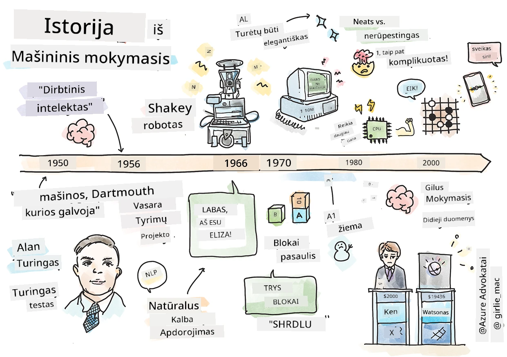
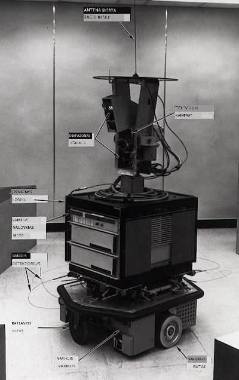
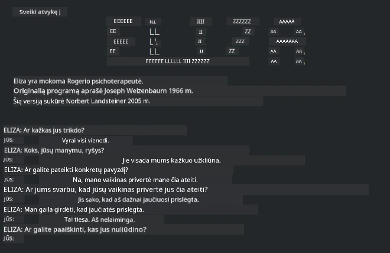

# Mašininio mokymosi istorija

> Sketchnote autorius [Tomomi Imura](https://www.twitter.com/girlie_mac)

## [Priešpaskaitinis testas](https://ff-quizzes.netlify.app/en/ml/)

---

> 🎥 Spustelėkite paveikslėlį aukščiau, kad peržiūrėtumėte trumpą šio pamokos vaizdo įrašą.

Šioje pamokoje aptarsime pagrindinius mašininio mokymosi ir dirbtinio intelekto istorijos etapus.

Dirbtinio intelekto (DI) istorija kaip sritis yra glaudžiai susijusi su mašininio mokymosi istorija, nes algoritmai ir kompiuteriniai pasiekimai, kurie sudaro mašininio mokymosi pagrindą, prisidėjo prie DI vystymosi. Reikėtų prisiminti, kad nors šios sritys kaip atskiros tyrimų sritys ėmė formuotis penktajame dešimtmetyje, svarbūs [algoritminiai, statistiniai, matematiniai, skaičiavimo ir techniniai atradimai](https://wikipedia.org/wiki/Timeline_of_machine_learning) vyko ir prieš tai bei sutapo su šiuo laikotarpiu. Iš tiesų, žmonės šiais klausimais svarstė jau [šimtus metų](https://wikipedia.org/wiki/History_of_artificial_intelligence): šiame straipsnyje aptariamos įžvalgos, kurios lėmė 'mąstančios mašinos' idėją.

---
## Svarbūs atradimai

- 1763, 1812 [Besų teorema](https://wikipedia.org/wiki/Bayes%27_theorem) ir jos pirmtakai. Ši teorema ir jos taikymai sudaro išvados pagrindą, aprašydami įvykio tikimybę remiantis ankstesne informacija.
- 1805 [Mažiausių kvadratų teorija](https://wikipedia.org/wiki/Least_squares), sukurta prancūzų matematikos Adrien-Marie Legendre. Šią teoriją susipažinsite mūsų regresijos skyriuje, ji padeda duomenų pritaikymui.
- 1913 [Markovo grandinės](https://wikipedia.org/wiki/Markov_chain), pavadintos rusų matematiko Andrejaus Markovo vardu, jos naudojamos apibūdinti galimų įvykių seką priklausomai nuo ankstesnės būsenos.
- 1957 [Perceptronas](https://wikipedia.org/wiki/Perceptron) – linijinis klasifikatorius, kurį sukūrė amerikiečių psichologas Frankas Rosenblattas, tai pažanga giliosios mokymosi srityje.

---

- 1967 [Artimiausias kaimynas](https://wikipedia.org/wiki/Nearest_neighbor) – algoritmas, iš pradžių sukurtas maršrutų žymėjimui. Mašininio mokymosi kontekste jis naudojamas modeliams atpažinti.
- 1970 [Atgalinis sklidimas](https://wikipedia.org/wiki/Backpropagation) naudojamas [tiesiai einamųjų neuroninių tinklų](https://wikipedia.org/wiki/Feedforward_neural_network) mokymui.
- 1982 [Rekurentiniai neuroniniai tinklai](https://wikipedia.org/wiki/Recurrent_neural_network) yra dirbtiniai neuroniniai tinklai, kilę iš tiesiai einamųjų tinklų, kurie sukuria laiko grafus.

✅ Atlikite mažą tyrimą. Kokios kitos datos jums atrodo svarbios mašininio mokymosi ir DI istorijoje?

---
## 1950: Mašinos, kurios mąsto

Alanas Turingas, išskirtinė asmenybė, kuri 2019 m. [balsuojant visuomenei](https://wikipedia.org/wiki/Icons:_The_Greatest_Person_of_the_20th_Century) buvo išrinkta didžiausiu XX a. mokslininku, priskiriamas sąvokos 'mašina, gebanti mąstyti' pagrindų kūrimui. Jis susidūrė su skepticizmu ir savo reikalavimu gauti empirinius šios sąvokos įrodymus, iš dalies sukurdamas [Turinigo testą](https://www.bbc.com/news/technology-18475646), kurį apžvelgsite mūsų NLP pamokose.

---
## 1956: Dartmoutho vasaros tyrimų projektas

"Dartmoutho vasaros tyrimų projektas dirbtinio intelekto srityje buvo lemiamas įvykis DI kaip mokslo šakai," ir būtent čia buvo sukurta sąvoka 'dirbtinis intelektas' ([šaltinis](https://250.dartmouth.edu/highlights/artificial-intelligence-ai-coined-dartmouth)).

> Mokymosi arba bet kuris kitas intelekto bruožas gali būti aprašytas taip tiksliai, kad mašina galėtų jį imituoti.

---

Projekto vadovas, matematikos profesorius Johnas McCarthy tikėjosi „remtis prielaida, kad kiekvienas mokymosi ar bet kokio kito intelekto bruožas gali būti aprašytas taip tiksliai, kad mašiną būtų galima sukurti imituoti jį.“ Dalyvavo ir kitos šios srities žvaigždės, kaip Marvinas Minsky.

Šis seminaras laikomas paskatinusiu ir parėmusiu įvairius pokalbius apie „simbolinių metodų kilimą, sistemų, orientuotų į ribotas sritis (ankstyvųjų ekspertų sistemas), bei dedukcines sistemas prieš indukcines sistemas.“ ([šaltinis](https://wikipedia.org/wiki/Dartmouth_workshop)).

---
## 1956–1974: „Auksiniai metai“

Nuo penktojo dešimtmečio iki septintojo pradžios vyravo optimizmas, tikintis, kad DI išspręs daug problemų. 1967 m. Marvinas Minsky drąsiai teigė: „Per vieną kartą ... problema sukurti 'dirbtinį intelektą' bus iš esmės išspręsta.“ (Minsky, Marvin (1967), Computation: Finite and Infinite Machines, Englewood Cliffs, N.J.: Prentice-Hall)

Natūralios kalbos apdorojimo tyrimai klestėjo, paieška buvo tobulinama ir efektyvinama, sukurta „mikro-pasaulio“ sąvoka, kur paprasta kalba suteikiamos užduotys buvo atliktos paprastu būdu.

---

Tyrimai buvo gerai finansuojami valstybinių agentūrų, skaičiavimo ir algoritmų pažanga padėjo kurti intelektualias mašinas. Kai kurios iš jų apima:

* [Shakey robotas](https://wikipedia.org/wiki/Shakey_the_robot), kuris galėjo manevruoti ir protingai spręsti, kaip atlikti užduotis.

    
    > Shakey 1972 m.

---

* Eliza, ankstyvas „chatterbot“, galėjo bendrauti su žmonėmis ir veikti kaip primityvus „terapeutas“. Apie Elizą sužinosite NLP pamokose.

    
    > Elizos versija, pokalbių botas

---

* „Blokų pasaulis“ buvo mikro-pasaulio pavyzdys, kur blokai buvo kraunami ir rūšiuojami, ir buvo galima eksperimentuoti mokant mašinas priimti sprendimus. Pažanga, paremta tokiomis bibliotekomis kaip [SHRDLU](https://wikipedia.org/wiki/SHRDLU), padėjo pažengti kalbos apdorojimo srityje.

    

    > 🎥 Spustelėkite paveikslėlį aukščiau, norėdami peržiūrėti vaizdo įrašą: Blokų pasaulis su SHRDLU

---
## 1974–1980: „DI žiema“

Iki septintojo dešimtmečio pabaigos tapo aišku, kad palaikyti „intelektualių mašinų“ kūrimo sudėtingumą buvo nuvertinta, o pažadai dėl turimos skaičiavimo galios buvo perdėti. Finansavimas pūtė, o pasitikėjimas šia sritimi sumažėjo. Kai kurios problemos, kurios pakenkė pasitikėjimui, buvo:
---
- **Ribotumai**. Skaičiavimo galia buvo pernelyg ribota.
- **Kombinatorinė sprogimas**. Parametrų, kuriuos reikėjo apmokyti, skaičius eksponentiškai augo, kai buvo keliami vis nauji reikalavimai kompiuteriams, o skaičiavimo galia ir galimybės neaugo tokiu pat tempu.
- **Duomenų stoka**. Duomenų trūko, todėl buvo sunku testuoti, kurti ir tobulinti algoritmus.
- **Ar mes užduodame tinkamus klausimus?**. Patys klausimai pradėjo kelti abejonių. Tyrėjai sulaukė kritikos dėl savo požiūrio:
  - Turinigo testai buvo kritikuojami, tarp kitų idėjų pateikiant 'kinų kambario teoriją', kuri teigia, kad „programavimas skaitmeniniam kompiuteriui gali sukurti įspūdį, kad jis supranta kalbą, tačiau negali suteikti tikro supratimo.“ ([šaltinis](https://plato.stanford.edu/entries/chinese-room/))
  - Kilo etiniai klausimai dėl dirbtinių intelektų, tokių kaip „terapeutas“ ELIZA, įvedimo į visuomenę.

---

Tuo pačiu metu formavosi įvairios DI mokyklos. Buvo nustatytas skirtumas tarp ["netvarkingų" ir „tvarkingų“ DI](https://wikipedia.org/wiki/Neats_and_scruffies) praktikų. _Netvarkingi_ laboratorijos valandų valandas tobulindavo programas, kol jos duodavo norimus rezultatus. _Tvarkingos_ laboratorijos „dėmesį sutelkė į logiką ir formalių problemų sprendimą“. ELIZA ir SHRDLU buvo žinomi _netvarkingi_ sistemos pavyzdžiai. Aštuntajame dešimtmetyje, kai prasidėjo poreikis daryti MM sistemas atkartojamas, _tvarkingas_ požiūris palaipsniui įgavo pirmaujančią poziciją, nes jo rezultatai lengviau paaiškinami.

---
## 1980-ieji: Ekspertinės sistemos

Ši sritis augo, ir 1980-aisiais aiškiau matėsi jos nauda verslui, taip pat sparčiai plito „ekspertinės sistemos“. „Ekspertinės sistemos buvo vienos iš pirmųjų tikrai sėkmingų dirbtinio intelekto (DI) programinės įrangos rūšių.“ ([šaltinis](https://wikipedia.org/wiki/Expert_system)).

Šios sistemos iš esmės buvo _hibridinės_, dalinai sudarytos iš taisyklių variklio, apibrėžiančio verslo reikalavimus, ir išvados variklio, kuris rėmėsi taisyklių sistema norėdamas daryti naujas išvadas.

Šiuo laikotarpiu taip pat didėjo dėmesys neuroniniams tinklams.

---
## 1987–1993: DI „atšilimas“

Specializuotos ekspertinės sistemos aparatūra tapo pernelyg specializuota ir konkuravo su asmeniniais kompiuteriais. Kompiuterijos demokratizacija prasidėjo, ir tai galiausiai atvėrė kelią didžiųjų duomenų sprogimui.

---
## 1993–2011

Šis laikotarpis atvėrė naują erą MM ir DI spręsti problemas, kilusias dėl duomenų ir skaičiavimo galios trūkumo. Duomenų kiekis pradėjo sparčiai didėti ir tapo plačiau prieinamas, ypač atsiradus išmaniesiems telefonams apie 2007 m. Skaičiavimo galia augo eksponentiškai, o algoritmai evoliucionavo kartu. Sritis įgavo brandos, o praeities laisvų dienų laikotarpis pradėjo virsti tikra disciplina.

---
## Dabartis

Šiandien mašininis mokymasis ir DI paliečia beveik kiekvieną mūsų gyvenimo dalį. Ši era reikalauja atsargaus rizikų ir galimų algoritmų poveikio žmogaus gyvenimui supratimo. Kaip teigė Microsoft atstovas Brad Smith, „Informacinės technologijos kelia klausimus, kurie liečia esmines žmogaus teisių apsaugas kaip privatumas ir žodžio laisvė. Šie klausimai didina atsakomybę technologijų bendrovėms, kurios kuria šiuos produktus. Mūsų nuomone, jie taip pat reikalauja apgalvotos valstybės reguliacijos ir priimtinų naudojimo normų kūrimo“ ([šaltinis](https://www.technologyreview.com/2019/12/18/102365/the-future-of-ais-impact-on-society/)).

---

Dar nėra aišku, ką ateitis atneš, bet svarbu suprasti šias kompiuterines sistemas bei jų naudojamą programinę įrangą ir algoritmus. Tikimės, kad šis mokymų planas padės jums geriau suprasti ir priimti savarankiškus sprendimus.

> 🎥 Spustelėkite paveikslėlį aukščiau, norėdami peržiūrėti vaizdo įrašą: Yann LeCun aptaria giluminio mokymosi istoriją šioje paskaitoje

---
## 🚀Iššūkis

Pasinerkite į vieną iš šių istorinių momentų ir sužinokite daugiau apie juos sukūrusius žmones. Čia yra įdomių asmenybių, o jokie moksliniai atradimai neįvyko kultūriniame vakuume. Ką jūs atrandate?

## [Paskaitos pabaigos testas](https://ff-quizzes.netlify.app/en/ml/)

---
## Peržiūra ir savarankiškas mokymasis

Štai ką verta žiūrėti ir klausyti:

[Šis podcast'as, kuriame Amy Boyd aptaria AI evoliuciją](http://runasradio.com/Shows/Show/739)

---

## Užduotis

[Sukurkite laiko juostą](assignment.md)

---

<!-- CO-OP TRANSLATOR DISCLAIMER START -->
**Atsakomybės apribojimas**:
Šis dokumentas buvo išverstas naudojant dirbtinio intelekto vertimo paslaugą [Co-op Translator](https://github.com/Azure/co-op-translator). Nors siekiame tikslumo, prašome atkreipti dėmesį, kad automatiniai vertimai gali turėti klaidų ar netikslumų. Originalus dokumentas jo gimtąja kalba laikomas autoritetingu šaltiniu. Svarbiai informacijai rekomenduojama naudoti profesionalų žmogiškąjį vertimą. Mes neatsakome už jokius nesusipratimus ar neteisingą interpretaciją, kilusią naudojantis šiuo vertimu.
<!-- CO-OP TRANSLATOR DISCLAIMER END -->