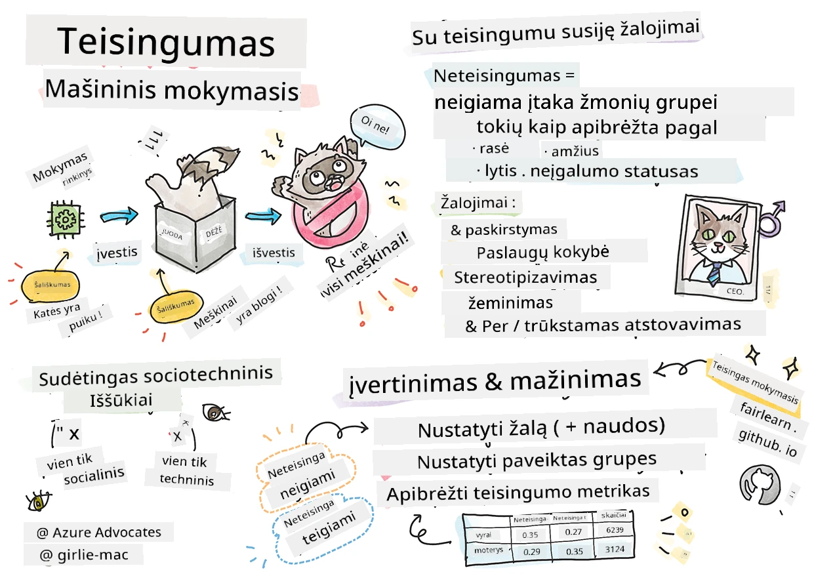

# Atsakingos dirbtinio intelekto mašininio mokymosi sprendimų kūrimas
 

> Sketchnote pateikė [Tomomi Imura](https://www.twitter.com/girlie_mac)

## [Išankstinis viktorinos testas](https://ff-quizzes.netlify.app/en/ml/)
 
## Įvadas

Šiame kurse pradėsite atrasti, kaip mašininis mokymasis gali paveikti ir jau veikia mūsų kasdienį gyvenimą. Jau dabar sistemos ir modeliai dalyvauja kasdieniniame sprendimų priėmime, pavyzdžiui, sveikatos diagnozėse, paskolų patvirtinime ar sukčiavimo aptikime. Todėl svarbu, kad šie modeliai veiktų gerai ir suteiktų patikimus rezultatus. Kaip ir bet kuri programinė įranga, DI sistemos gali neišpildyti lūkesčių arba sukelti nepageidaujamą rezultatą. Todėl būtina sugebėti suprasti ir paaiškinti DI modelio elgseną.

Įsivaizduokite, kas gali nutikti, kai duomenys, kuriais kūrėjate šiuos modelius, trūksta tam tikrų demografinių grupių, pavyzdžiui, pagal rasę, lytį, politinę nuostatą, religiją arba disproporcingai atstovauja tokias grupes. O kaip kai modelio rezultatai interpretuojami taip, tarsi jie palankiai vertintų tam tikrą demografinę grupę? Kokia to pasekmė programai? Be to, kas nutinka, kai modelis sukelia neigiamą poveikį ir yra kenksmingas žmonėms? Kas atsakingas už DI sistemos elgesį? Į šiuos klausimus atsakysime šiame kurse.

Šioje pamokoje jūs:

- Ugdysite suvokimą apie teisingumo svarbą mašininiame mokymesi ir su tuo susijusias žalas.
- Susipažinsite su praktika tirti išskirtinius atvejus ir neįprastas situacijas, siekiant užtikrinti patikimumą ir saugumą.
- Suprasite, kodėl svarbu įgalinti visus, kuriant įtraukiąsias sistemas.
- Išnagrinėsite, kaip svarbu apsaugoti privatumo ir duomenų saugumą.
- Sužinosite apie stiklinės dėžutės veikimo principą, paaiškinant DI modelių elgseną.
- Suprasite, kaip atsakomybė yra būtina kuriant pasitikėjimą DI sistemomis.

## Reikalavimai iš anksto

Prieš pradedant rekomenduojame pereiti per "Atsakingo DI principus" mokymosi kelią ir peržiūrėti žemiau pateiktą vaizdo įrašą tema:

Sužinokite daugiau apie atsakingą DI naudodamiesi šiuo [Mokymosi keliu](https://docs.microsoft.com/learn/modules/responsible-ai-principles/?WT.mc_id=academic-77952-leestott)

> 🎥 Spustelėkite aukščiau esančią nuotrauką, jei norite žiūrėti vaizdo įrašą: Microsoft požiūris į atsakingą DI

## Teisingumas

DI sistemos turėtų visus vertinti teisingai ir vengti paveikti panašias žmonių grupes skirtingai. Pavyzdžiui, kai DI sistemos pateikia rekomendacijas gydymo, paskolų ar įdarbinimo klausimais, jos turėtų daryti tokias pačias rekomendacijas visiems su panašiais simptomais, finansine padėtimi ar profesiniais kvalifikacijomis. Kiekvienas iš mūsų, kaip žmonių, turime paveldėtų šališkumų, kurie veikia mūsų sprendimus ir veiksmus. Šie šališkumai gali būti matomi duomenyse, kuriais mokosi DI sistemos. Tokia manipuliacija kartais įvyksta netyčia. Dažnai sunku sąmoningai suprasti, kada duomenyse įvedamas šališkumas.

**„Neteisingumas“** apima neigiamą poveikį arba „žalą“ žmonių grupėms, apibrėžtoms pagal rasę, lytį, amžių ar neįgalumo statusą. Pagrindinės žalos, susijusios su teisingumu, gali būti skirstomos į:

- **Paskirstymas**, pvz., kai pirmenybė teikiama lyčiai ar etninei grupei.
- **Paslaugos kokybė**. Jei duomenys yra mokomi tik vienam scenarijui, tačiau realybė yra daug sudėtingesnė, tai lemia prastai veikiančią paslaugą. Pavyzdžiui, muilo dozatorius, kuris neatskiria žmonių su tamsesne oda. [Šaltinis](https://gizmodo.com/why-cant-this-soap-dispenser-identify-dark-skin-1797931773)
- **Gėdinimas**. Neteisingai kritikuoti ir etiketėmis apklijuoti kažką ar kažką. Pavyzdžiui, vaizdų žymėjimo technologija tapo žinoma dėl tamsios odos žmonių nuotraukų klaidingo žymėjimo kaip gorilų.
- **Perdėta ar nepilna atstovybė**. Mintis, kad tam tikra grupė nėra matoma tam tikroje profesijoje, ir bet koks paslaugų ar funkcijų, kurios tai skatina, palaikymas prisideda prie žalos.
- **Stereotipai**. Priskirti iš anksto apibrėžtoms grupėms tam tikras savybes. Pavyzdžiui, anglų ir turkų kalbų vertimo sistema gali netiksliai versti žodžius, turinčius lyčių stereotipų atspalvį.

> vertimas į turkų kalbą

> vertimas atgal į anglų kalbą

Kuriant ir testuojant DI sistemas, turime užtikrinti, kad DI būtų teisingas ir nesukurtų šališkų ar diskriminuojančių sprendimų, kurių taip pat neleidžiama priimti žmonėms. Užtikrinti teisingumą DI ir mašininiame mokymesi yra sudėtinga sociotechninė užduotis.

### Patikimumas ir saugumas

Norint užmegzti pasitikėjimą, DI sistemos turi būti patikimos, saugios ir nuoseklios tiek įprastomis, tiek netikėtomis sąlygomis. Svarbu žinoti, kaip DI sistemos elgsis įvairiose situacijose, ypač kai tai išimtys. Kuriant DI sprendimus reikia skirti daug dėmesio įvairių galimų situacijų, su kuriomis DI sprendimai gali susidurti, valdymui. Pavyzdžiui, autonominis automobilis turi pirmiausia rūpintis žmonių saugumu. Todėl automobilį valdančiam DI reikia apsvarstyti visas galimas situacijas, su kuriomis automobilis gali susidurti, tokių kaip naktis, perkūnija ar pūgos, vaikai bėgantys per gatvę, gyvūnai, kelio darbai ir pan. Kaip gerai DI sistema gali patikimai ir saugiai susidoroti su skirtingomis sąlygomis, rodo duomenų mokslininko ar DI kūrėjo numatymo lygį projektuojant ar testuojant sistemą.

> [🎥 Spustelėkite čia, jei norite žiūrėti vaizdo įrašą: ](https://www.microsoft.com/videoplayer/embed/RE4vvIl)

### Įtraukumas

DI sistemas reikėtų kurti taip, kad jos įtrauktų ir įgalintų visus. Kuriant ir diegiant DI sistemas, duomenų mokslininkai ir DI kūrėjai identifikuoja ir šalina galimas kliūtis, kurios gali netyčia pašalinti žmones. Pavyzdžiui, pasaulyje yra 1 milijardas neįgaliųjų. Besivystantis DI jiems leidžia lengviau pasiekti daug informacijų ir galimybių kasdieniniame gyvenime. Pašalinus kliūtis, atsiveria galimybės inovuoti ir kurti geresnes DI produktų patirtis, naudingas visiems.

> [🎥 Spustelėkite čia, jei norite žiūrėti vaizdo įrašą: įtraukumas DI](https://www.microsoft.com/videoplayer/embed/RE4vl9v)

### Saugumas ir privatumas

DI sistemos turėtų būti saugios ir gerbti žmonių privatumą. Žmonės mažiau pasitiki sistemomis, kurios kelia grėsmę jų privatumui, informacijai ar gyvybėms. Mokant mašininio mokymosi modelius, mes pasikliaujame duomenimis, kad gautume geriausius rezultatus. Svarbu atsižvelgti į duomenų kilmę ir vientisumą. Pavyzdžiui, ar duomenys buvo pateikti vartotojo, ar yra viešai prieinami? Toliau dirbant su duomenimis svarbu kurti DI sistemas, galinčias apsaugoti konfidencialią informaciją ir atsilaikyti prieš atakas. Su DI plėtra vis svarbiau ir sudėtingiau apsaugoti privatumą bei svarbią asmeninę ir verslo informaciją. Privatumo ir duomenų saugumo klausimai yra itin svarbūs DI, nes prieiga prie duomenų yra būtina DI sistemoms tiksliai ir pagrįstai prognozuoti bei priimti sprendimus apie žmones.

> [🎥 Spustelėkite čia, jei norite žiūrėti vaizdo įrašą: saugumas DI](https://www.microsoft.com/videoplayer/embed/RE4voJF)

- Kaip industrija, padarėme didelę pažangą privatumo ir saugumo srityje, ypač reguliuojant tokias sritis kaip GDPR (Bendrasis duomenų apsaugos reglamentas).
- Tačiau DI sistemose turime pripažinti įtampą tarp poreikio turėti daugiau asmens duomenų, kad sistemos būtų personalizuotos ir efektyvios, ir tarp privatumo reikalavimų.
- Kaip ir interneto sukūrimo laikais, matome stiprų saugumo problemų augimą, susijusį su DI.
- Tuo pačiu metu DI naudojamas saugumui gerinti. Pavyzdžiui, dauguma šiuolaikinių antivirusinių programų šiandien naudoja DI heuristikas.
- Turime užtikrinti, kad mūsų duomenų mokslas harmoningai dera su pačiomis naujausiomis privatumo ir saugumo praktikomis.

### Skaidrumas
DI sistemos turėtų būti suprantamos. Svarbi skaidrumo dalis yra paaiškinti DI sistemų ir jų komponentų elgseną. Geresnis DI sistemų supratimas reikalauja, kad suinteresuotosios šalys suprastų, kaip ir kodėl jos veikia, kad galėtų atpažinti galimas našumo problemas, saugumo ir privatumo rizikas, šališkumus, pašalinimo praktikas ar nepageidaujamus rezultatus. Taip pat manome, kad tie, kurie naudoja DI sistemas, turėtų būti sąžiningi ir atviri apie tai, kada, kodėl ir kaip juos diegia. Taip pat apie sistemų, kurias jie naudoja, apribojimus. Pavyzdžiui, jei bankas naudoja DI sistemą, remiantį jo paskolų vartotojams sprendimus, svarbu peržiūrėti rezultatus ir suprasti, kurie duomenys daro įtaką sistemos rekomendacijoms. Vyriausybės jau pradeda reguliuoti DI įvairiose pramonės šakose, todėl duomenų mokslininkai ir organizacijos privalo paaiškinti, ar DI sistema atitinka reguliavimo reikalavimus, ypač jei rezultatai nepageidaujami.

> [🎥 Spustelėkite čia, jei norite žiūrėti vaizdo įrašą: skaidrumas DI](https://www.microsoft.com/videoplayer/embed/RE4voJF)

- Kadangi DI sistemos yra labai sudėtingos, sunku suprasti, kaip jos veikia, ir interpretuoti rezultatus.
- Šis supratimo trūkumas veikia tai, kaip šios sistemos valdomos, įdiegiamos ir dokumentuojamos.
- Dar svarbiau, šis supratimo trūkumas įtakoja sprendimus, priimamus remiantis šiomis sistemomis gautais rezultatais.

### Atsakomybė
 
Žmonės, kurie kuria ir diegia DI sistemas, turi būti atsakingi už tai, kaip jų sistemos veikia. Atsakomybės poreikis ypač svarbus jautrių technologijų, tokių kaip veido atpažinimas, naudojimo atvejais. Pastaruoju metu veido atpažinimo technologijos paklausa auga, ypač teisėsaugos institucijų, kurios mato jos potencialą, pavyzdžiui, ieškant dingusių vaikų. Tačiau šios technologijos galėtų būti panaudotos vyriausybės, keliant pavojų piliečių pagrindinėms laisvėms, pavyzdžiui, nuolat stebint konkrečius asmenis. Todėl duomenų mokslininkai ir organizacijos turi prisiimti atsakomybę už tai, kaip jų DI sistema veikia individų arba visuomenės atžvilgiu.

> 🎥 Spustelėkite aukščiau esančią nuotrauką, jei norite žiūrėti vaizdo įrašą: Perspėjimai dėl masinio stebėjimo per veidų atpažinimą

Galutinis vienas didžiausių klausimų mūsų kartai, kaip pirmai kartai, kuri diegia DI visuomenei, yra kaip užtikrinti, kad kompiuteriai liktų atsakingi žmonėms ir kaip užtikrinti, kad kompiuterius kuriantys žmonės liktų atsakingi visuomenei.

## Poveikio vertinimas

Prieš mokant mašininio mokymosi modelį svarbu atlikti poveikio vertinimą, norint suprasti DI sistemos paskirtį; kokia yra numatyta paskirtis; kur ji bus diegiama; ir kas naudosis sistema. Tai padeda peržiūrėtojams ar testuotojams žinoti, kokius veiksnius reikia atsižvelgti, identifikuojant galimas rizikas ir numatomąsias pasekmes.

Atlikdami poveikio vertinimą atkreipkite dėmesį į šias sritis:

* **Neigiamas poveikis individams.** Svarbu žinoti apie bet kokius apribojimus ar reikalavimus, neleistiną naudojimą ar žinomas ribotumus, kurie gali paveikti sistemos veikimą, kad sistema nebūtų naudojama kenksmingai žmonėms.
* **Duomenų reikalavimai.** Suprasti, kaip ir kur sistema naudos duomenis, leidžia peržiūrėtojams įvertinti visus duomenų reikalavimus, kurių reikia laikytis (pvz., GDPR ar HIPAA duomenų taisykles). Taip pat svarbu patikrinti, ar duomenų šaltinis ir kiekis yra pakankami mokymui.
* **Poveikio santrauka.** Surinkite galimų žalos atvejų sąrašą, kurie gali kilti naudojant sistemą. Per visą ML gyvavimo ciklą patikrinkite, ar šios problemos buvo sumažintos ar pašalintos.
* **Taikytini tikslai** kiekvienam iš šešių pagrindinių principų. Įvertinkite, ar kiekvieno principo tikslai buvo pasiekti ir ar yra kokių nors spragų.

## Atsakingas DI derinimas

Kaip ir derinant programinę įrangą, DI sistemos derinimas yra būtinas procesas, skirtas nustatyti ir išspręsti sistemas veikimo problemas. Daugelis veiksnių gali lemti, kad modelis neveikia taip, kaip tikėtasi ar neatsakingai. Tradiciniai modelio veikimo rodikliai yra kiekybiniai agregatai, nepakankami analizuoti, kaip modelis pažeidžia atsakingo DI principus. Be to, mašininio mokymosi modelis yra juodoji dėžė, kurios sunku suprasti, kas lemia rezultatą ar paaiškinti klaidą. Vėliau šiame kurse išmoksime naudoti Atsakingo DI skydelį, padedantį derinti DI sistemas. Šis skydelis suteikia holistinį įrankį duomenų mokslininkams ir DI kūrėjams atlikti:

* **Klaidų analizę.** Nustatyti modelio klaidų pasiskirstymą, galintį paveikti sistemos teisingumą ar patikimumą.
* **Modelio apžvalgą.** Atrasti, kur modelio veikime yra skirtumų duomenų grupėse.
* **Duomenų analizę.** Suprasti duomenų pasiskirstymą ir nustatyti galimą šališkumą duomenyse, galintį sukelti problemas su teisingumu, įtraukumu ir patikimumu.
* **Modelio interpretuojamumą.** Suprasti, kas veikia ar įtakoja modelio prognozes. Tai padeda paaiškinti modelio elgseną, kas svarbu skaidrumui ir atsakomybei.

## 🚀 Iššūkis
 
Siekiant išvengti žalos, turėtume:

- turėti įvairių fonų ir požiūrių tarp sistemų kūrėjų
- investuoti į duomenų rinkinius, atspindinčius mūsų visuomenės įvairovę
- kurti geresnius metodus visame mašininio mokymosi gyvavimo cikle, skirtus atsakingo DI aptikimui ir taisymui

Pagalvokite apie realias situacijas, kai modelio nepatikimumas akivaizdus modelio kūrime ir naudojime. Ką dar turėtume apsvarstyti?

## [Viktorinos testas po paskaitos](https://ff-quizzes.netlify.app/en/ml/)

## Apžvalga ir savarankiškas mokymasis
 

Šioje pamokoje jūs sužinojote pagrindus apie teisingumo ir neteisingumo sąvokas mašininiame mokyme.  
 
Peržiūrėkite šį seminarą, kad giliau suprastumėte temas: 

- Atsakingo DI siekis: Principų taikymas praktikoje, pristato Besmira Nushi, Mehrnoosh Sameki ir Amit Sharma

> 🎥 Spauskite aukščiau esantį paveikslėlį vaizdo įrašui: RAI Toolbox: Atvirojo kodo įrankių rinkinys atsakingam DI kūrimui, pristato Besmira Nushi, Mehrnoosh Sameki ir Amit Sharma

Taip pat skaitykite: 

- „Microsoft“ RAI išteklių centras: [Responsible AI Resources – Microsoft AI](https://www.microsoft.com/ai/responsible-ai-resources?activetab=pivot1%3aprimaryr4) 

- „Microsoft“ FATE tyrimų grupė: [FATE: Fairness, Accountability, Transparency, and Ethics in AI - Microsoft Research](https://www.microsoft.com/research/theme/fate/) 

RAI įrankių rinkinys: 

- [Responsible AI Toolbox GitHub saugykla](https://github.com/microsoft/responsible-ai-toolbox)

Skaitykite apie Azure Machine Learning įrankius siekiant užtikrinti teisingumą:

- [Azure Machine Learning](https://docs.microsoft.com/azure/machine-learning/concept-fairness-ml?WT.mc_id=academic-77952-leestott) 

## Užduotis

[Tyrinėkite RAI įrankių rinkinį](assignment.md)

---

<!-- CO-OP TRANSLATOR DISCLAIMER START -->
**Atsakomybės apribojimas**:
Šis dokumentas buvo išverstas naudojant dirbtinio intelekto vertimo paslaugą [Co-op Translator](https://github.com/Azure/co-op-translator). Nors siekiame tikslumo, prašome atkreipti dėmesį, kad automatiniai vertimai gali turėti klaidų ar netikslumų. Originalus dokumentas jo gimtąja kalba laikomas autoritetingu šaltiniu. Svarbiai informacijai rekomenduojama naudoti profesionalų žmogiškąjį vertimą. Mes neatsakome už jokius nesusipratimus ar neteisingą interpretaciją, kilusią naudojantis šiuo vertimu.
<!-- CO-OP TRANSLATOR DISCLAIMER END -->