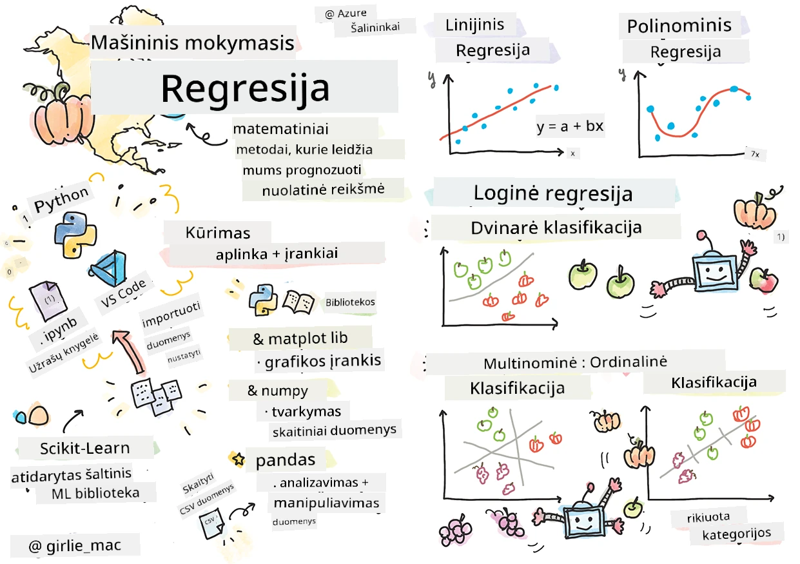
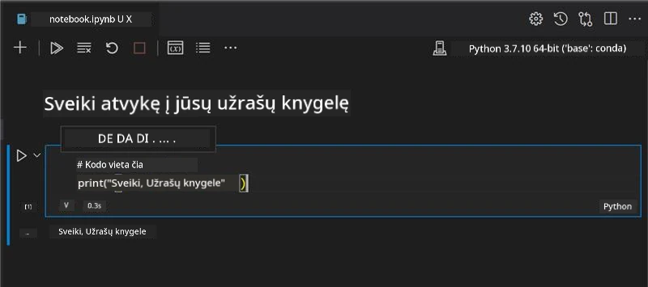
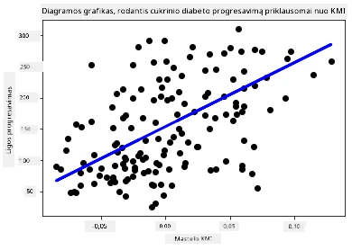

# Pradėkite dirbti su Python ir Scikit-learn regresijos modeliams



> Sketchnote autorius [Tomomi Imura](https://www.twitter.com/girlie_mac)

## [Priešpaskaitinis testas](https://ff-quizzes.netlify.app/en/ml/)

> ### [Ši pamoka prieinama R kalba!](../../../../2-Regression/1-Tools/solution/R/lesson_1.html)

## Įvadas

Šiose keturiose pamokose jūs sužinosite, kaip kurti regresijos modelius. Apie ką jie trumpai bus paaiškinta netrukus. Tačiau prieš imdamiesi darbo įsitikinkite, kad turite tinkamus įrankius procesui pradėti!

Šioje pamokoje išmoksite:

- Konfigūruoti savo kompiuterį vietiniams mašininio mokymosi uždaviniams.
- Dirbti su Jupyter Notebooks.
- Naudoti Scikit-learn įskaitant įdiegimą.
- Tyrinėti linijinę regresiją per praktinę užduotį.

## Įdiegimai ir konfigūravimas

[](https://youtu.be/-DfeD2k2Kj0 "Pradedantiesiems ML - Paruoškite savo įrankius mašininio mokymosi modelių kūrimui")

> 🎥 Paspauskite paveikslėlį aukščiau trumpam vaizdo įrašui, kaip konfigūruoti kompiuterį ML darbams.

1. **Įdiekite Python**. Įsitikinkite, kad jūsų kompiuteryje įdiegtas [Python](https://www.python.org/downloads/). Python bus naudojamas daugelyje duomenų mokslo ir mašininio mokymosi uždavinių. Dauguma kompiuterių sistemų jau turi Python diegimą. Taip pat yra naudingų [Python kodo paketų](https://code.visualstudio.com/learn/educators/installers?WT.mc_id=academic-77952-leestott), kurie kai kuriems naudotojams palengvina diegimo procesą.

   Kai kuriems Python naudojimams reikalingos skirtingos programinės įrangos versijos, todėl naudinga dirbti [virtualioje aplinkoje](https://docs.python.org/3/library/venv.html).

2. **Įdiekite Visual Studio Code**. Įsitikinkite, kad jūsų kompiuteryje įdiegtas Visual Studio Code. Vadovaukitės instrukcijomis, kaip [įdiegti Visual Studio Code](https://code.visualstudio.com/) baziniam diegimui. Šiame kurse naudosite Python Visual Studio Code aplinkoje, taigi verta susipažinti, kaip [konfigūruoti Visual Studio Code](https://docs.microsoft.com/learn/modules/python-install-vscode?WT.mc_id=academic-77952-leestott) Python kūrimui.

   > Prisijaukinkite Python per šį [Learn modulių](https://docs.microsoft.com/users/jenlooper-2911/collections/mp1pagggd5qrq7?WT.mc_id=academic-77952-leestott) rinkinį.
   >
   > [](https://youtu.be/yyQM70vi7V8 "Python konfigūravimas Visual Studio Code")
   >
   > 🎥 Paspauskite paveikslėlį aukščiau video peržiūrai: Python naudojimas VS Code aplinkoje.

3. **Įdiekite Scikit-learn**, vadovaudamiesi [šiais nurodymais](https://scikit-learn.org/stable/install.html). Kadangi reikia naudoti Python 3 versiją, rekomenduojama naudoti virtualią aplinką. Jei diegiate biblioteką M1 Mac kompiuteryje, puslapyje pateikti specialūs nurodymai.

1. **Įdiekite Jupyter Notebook**. Jums reikės [įdiegti Jupyter paketą](https://pypi.org/project/jupyter/).

## Jūsų ML kūrimo aplinka

Jūs naudosite **užrašų knygutes** (notebooks) kurti Python kodui ir mašininio mokymosi modeliams. Tokio tipo failai yra įprasta priemonė duomenų mokslininkams, juos galima atpažinti pagal plėtinį `.ipynb`.

Užrašų knygutės yra interaktyvi aplinka, leidžianti programuotojui tiek rašyti kodą, tiek pridėti pastabas ir dokumentaciją aplink kodą, kas yra ypač naudinga eksperimentiniams ar moksliniams projektams.

[](https://youtu.be/7E-jC8FLA2E "Pradedantiesiems ML - Paruoškite Jupyter Notebooks pradėti kurti regresijos modelius")

> 🎥 Paspauskite paveikslėlį aukščiau trumpam vaizdo įrašui dirbant su šia užduotimi.

### Užduotis - dirbti su užrašų knygute

Šiame aplanke rasite failą _notebook.ipynb_.

1. Atidarykite _notebook.ipynb_ Visual Studio Code programoje.

   Jūsų darbui bus paleistas Jupyter serveris su Python 3+. Užrašų knygutėje rasite vietas, kurias galima `vykdyti` – kodų blokai. Galite vykdyti kodo bloką paspausdami mygtuką, kuris atrodo kaip paleidimo mygtukas (play).

1. Paspauskite `md` ikoną ir pridėkite šiek tiek markdown: **# Sveiki atvykę į savo užrašų knygutę**.

   Toliau įrašykite šiek tiek Python kodo.

1. Įveskite kodą **print('hello notebook')** kodo bloke.
1. Paspauskite rodyklę, kad paleistumėte kodą.

   Turėtumėte pamatyti išspausdintą eilutę:

    ```output
    hello notebook
    ```



Galite tarp kodo įterpti komentarus, kad dokumentuotumėte savo užrašų knygutę.

✅ Pagalvokite minutei, kaip skiriasi interneto programuotojo darbo aplinka nuo duomenų mokslininko.

## Pradėkime naudoti Scikit-learn

Dabar, kai Python jau sukonfigūruotas jūsų vietinėje aplinkoje ir esate patogiai susipažinęs su Jupyter užrašų knygutėmis, pažinkime Scikit-learn (tai tariama `sci` kaip `science`). Scikit-learn suteikia [išsamų API](https://scikit-learn.org/stable/modules/classes.html#api-ref), kuris padės atlikti ML užduotis.

Pagal jų [svetainę](https://scikit-learn.org/stable/getting_started.html), „Scikit-learn yra atvirojo kodo mašininio mokymosi biblioteka, kuri palaiko prižiūrimą ir neprižiūrimą mokymąsi. Taip pat ji teikia įvairius įrankius modeliui pritaikyti, duomenims apdoroti, modeliui pasirinkti ir įvertinti bei daug kitų priemonių.“

Šiame kurse naudosite Scikit-learn ir kitus įrankius kurtumėte mašininio mokymosi modelius tradicinėms mašininio mokymosi užduotims atlikti. Sąmoningai vengėme neurologinių tinklų ir giluminio mokymosi temų, nes jos geriau aptariamos mūsų būsimoje „AI pradedantiesiems“ programoje.

Scikit-learn leidžia lengvai kurti ir vertinti modelius. Ji daugiausia orientuota į skaitmeninius duomenis ir turi kelis paruoštus naudoti rinkinius, skirtus mokymuisi. Taip pat siūlo iš anksto sukurtus modelius studentų praktikai. Pirmiausia pažvelkime, kaip įkelti iš anksto paruoštus duomenis ir naudoti integruotą estimator modelį su Scikit-learn paprastiems duomenims.

## Užduotis - jūsų pirmoji Scikit-learn užrašų knygutė

> Ši pamoka įkvėpta [linijinės regresijos pavyzdžio](https://scikit-learn.org/stable/auto_examples/linear_model/plot_ols.html#sphx-glr-auto-examples-linear-model-plot-ols-py) Scikit-learn svetainėje.


[](https://youtu.be/2xkXL5EUpS0 "Pradedantiesiems ML - Jūsų pirmasis linijinės regresijos projektas Python kalba")

> 🎥 Paspauskite paveikslėlį aukščiau trumpam video, kaip atlikti šią užduotį.

Failo _notebook.ipynb_ šioje pamokoje langelyje išvalykite visas ląsteles paspausdami šiukšliadėžės piktogramą.

Šioje dalyje naudosite nedidelį diabetui skirtų duomenų rinkinį, kuris įtrauktas į Scikit-learn mokymosi reikmėms. Įsivaizduokite, kad norite patikrinti gydymo poveikį diabetikams. Mašininio mokymosi modeliai galėtų padėti nustatyti, kurie pacientai geriau reaguos į gydymą, remiantis įvairių kintamųjų deriniais. Net ir paprastas regresijos modelis, vizualizuotas, gali parodyti informaciją apie kintamuosius, kurie padėtų organizuoti teorinius klinikinius tyrimus.

✅ Yra daug regresijos metodų, o kurį pasirinkti priklauso nuo ieškomo atsakymo. Jei norite numatyti galimą žmogaus ūgį pagal amžių, naudotumėte linijinę regresiją, nes ieškote **skaitmeninės reikšmės**. Jei domina, ar tam tikros virtuvės tipas yra veganiškas ar ne, ieškote **kategorijos priskyrimo**, tad naudotumėte logistinio regresijos metodą. Apie logistinę regresiją sužinosite vėliau. Pagalvokite apie klausimus, kuriuos galima užduoti duomenims, ir kuris metodas būtų tinkamesnis.

Pradėkime šį darbą.

### Importuokite bibliotekas

Šiai užduočiai importuosime kelias bibliotekas:

- **matplotlib**. Tai naudingas [grafikų braižymo įrankis](https://matplotlib.org/), kurį naudosime linijinės diagramos braižymui.
- **numpy**. [numpy](https://numpy.org/doc/stable/user/whatisnumpy.html) yra naudinga biblioteka skaitmeninių duomenų tvarkymui Python kalboje.
- **sklearn**. Tai [Scikit-learn](https://scikit-learn.org/stable/user_guide.html) biblioteka.

Importuokite šias bibliotekas, kad padėtų jums atlikti užduotis.

1. Įrašykite šį importo kodą:

   ```python
   import matplotlib.pyplot as plt
   import numpy as np
   from sklearn import datasets, linear_model, model_selection
   ```

   Viršuje jūs importuojate `matplotlib`, `numpy` ir iš `sklearn` importuojate `datasets`, `linear_model` ir `model_selection`. `model_selection` naudojama duomenims skirstyti į treniruočių ir testavimo rinkinius.

### Diabeto duomenų rinkinys

Integruotas [diabeto duomenų rinkinys](https://scikit-learn.org/stable/datasets/toy_dataset.html#diabetes-dataset) apima 442 mėginius apie diabetą su 10 požymių, iš kurių kai kurie yra:

- amžius: metai
- KMI: kūno masės indeksas
- kraujospūdis: vidutinis kraujo spaudimas
- s1 tc: T-ląstelės (tam tikros baltųjų kraujo ląstelių rūšys)

✅ Šiame rinkinyje požymis „lytis“ yra svarbus diabetui tyrinėti. Daugelis medicininių duomenų rinkinių apima tokias dvejetaines klasifikacijas. Pagalvokite, kaip tokios kategorizacijos gali išskirti tam tikras gyventojų grupes iš gydymo galimybių.

Dabar įkelkite X ir y duomenis.

> 🎓 Prisiminkite, kad tai yra prižiūrimas mokymasis, ir mums reikia pavadinto tikslo „y“.

Naujoje kodo ląstelėje įkelkite diabeto duomenų rinkinį kviesdami `load_diabetes()`. Parametras `return_X_y=True` reiškia, kad `X` bus duomenų matrica, o `y` – regresijos tikslas.

1. Įtraukite spausdinimo komandas, kad parodytumėte duomenų matricos formą ir pirmą elementą:

    ```python
    X, y = datasets.load_diabetes(return_X_y=True)
    print(X.shape)
    print(X[0])
    ```

    Gaunate tuple (kelių reikšmių krepšelį). Čia pirmos dvi tuple reikšmės priskiriamos atitinkamai `X` ir `y`. Daugiau apie [tuple](https://wikipedia.org/wiki/Tuple) sužinosite čia.

    Matyti, kad duomenų rinke yra 442 elementai, kiekvienas sudarytas iš 10 elementų masyvo:

    ```text
    (442, 10)
    [ 0.03807591  0.05068012  0.06169621  0.02187235 -0.0442235  -0.03482076
    -0.04340085 -0.00259226  0.01990842 -0.01764613]
    ```

    ✅ Pagalvokite apie ryšį tarp duomenų ir regresijos tikslo. Linijinė regresija prognozuoja ryšius tarp požymio X ir tikslo y. Ar rasite šiame dokumente [pasiekiamą tikslą](https://scikit-learn.org/stable/datasets/toy_dataset.html#diabetes-dataset) diabeto duomenų rinkiniui? Ką šis rinkinys demonstruoja su tuo tikslu?

2. Toliau pasirinkite dalį duomenų piešimui – 3-ią stulpelį. Tai atliekama naudojant `:` visiems eilutėms ir stulpelio indeksą (2). Duomenis taip pat galima pertvarkyti į dvimatį masyvą, reikalingą braižymui, panaudojant `reshape(n_rows, n_columns)`. Jei vienas parametras yra -1, atitinkama dimensija apskaičiuojama automatiškai.

   ```python
   X = X[:, 2]
   X = X.reshape((-1,1))
   ```

   ✅ Bet kada spausdinkite duomenis, kad patikrintumėte jų formą.

3. Kai duomenys paruošti piešimui, pažiūrėkime, ar mašina gali padėti nustatyti logišką ribą tarp skaičių šiame rinkinyje. Tam turite padalinti ir duomenis (X), ir tikslą (y) į testavimo ir treniruočių rinkinius. Scikit-learn leidžia paprastai tai atlikti; galite nurodyti, kur skirti testavimo duomenis.

   ```python
   X_train, X_test, y_train, y_test = model_selection.train_test_split(X, y, test_size=0.33)
   ```

4. Dabar galite apmokyti savo modelį! Įkelkite linijinės regresijos modelį ir apmokykite naudodami `X` ir `y` treniruočių rinkinius per `model.fit()`:

    ```python
    model = linear_model.LinearRegression()
    model.fit(X_train, y_train)
    ```

    ✅ `model.fit()` yra funkcija, kurią rasite daugelyje ML bibliotekų, pavyzdžiui, TensorFlow.

5. Tuomet, sukūrę prognozę testavimo duomenims, naudokite funkciją `predict()`. Ji bus naudojama brėžti linijai tarp duomenų grupių.

    ```python
    y_pred = model.predict(X_test)
    ```

6. Dabar laikas parodyti duomenis diagramoje. Matplotlib yra labai naudingas įrankis šiam tikslui. Sukurkite taškų diagramą (scatterplot) su visais X ir y testiniais duomenimis ir pagal prognozę nubrėžkite liniją tinkamiausioje vietoje tarp modelio duomenų grupių.

    ```python
    plt.scatter(X_test, y_test,  color='black')
    plt.plot(X_test, y_pred, color='blue', linewidth=3)
    plt.xlabel('Scaled BMIs')
    plt.ylabel('Disease Progression')
    plt.title('A Graph Plot Showing Diabetes Progression Against BMI')
    plt.show()
    ```

   


   ✅ Šiek tiek pagalvokite, kas čia vyksta. Tiesė eina per daug mažų duomenų taškų, bet ką ji tiksliai daro? Ar galite matyti, kaip turėtumėte naudoti šią liniją, kad nuspėtumėte, kur naujas, nematytas duomenų taškas turėtų tilpti susiejant su grafiko y ašimi? Pabandykite žodžiais apibūdinti šio modelio praktinį naudojimą.

Sveikiname, jūs sukūrėte savo pirmąjį tiesinės regresijos modelį, padarėte su juo prognozę ir pavaizdavote ją grafike!

---
## 🚀Iššūkis

Nubraižykite kitą kintamąjį iš šio duomenų rinkinio. Užuomina: redaguokite šią eilutę: `X = X[:,2]`. Atsižvelgiant į šio duomenų rinkinio tikslą, ką galite sužinoti apie diabeto ligos progresavimą?
## [Paskaitos po testas](https://ff-quizzes.netlify.app/en/ml/)

## Peržiūra ir savarankiškas mokymasis

Šiame vadove dirbote su paprasta tiesine regresija, o ne vienkryptia ar daugiakryptia tiesine regresija. Truputį paskaitykite apie skirtumus tarp šių metodų arba pažiūrėkite [šį vaizdo įrašą](https://www.coursera.org/lecture/quantifying-relationships-regression-models/linear-vs-nonlinear-categorical-variables-ai2Ef)

Skaitykite daugiau apie regresijos sąvoką ir pagalvokite, kokius klausimus galima atsakyti naudojant šią techniką. Pasirinkite šį [vadovą](https://docs.microsoft.com/learn/modules/train-evaluate-regression-models?WT.mc_id=academic-77952-leestott), kad gilintumėte supratimą.

## Namų darbai

[Kitas duomenų rinkinys](assignment.md)

---

<!-- CO-OP TRANSLATOR DISCLAIMER START -->
**Atsakomybės apribojimas**:
Šis dokumentas buvo išverstas naudojant dirbtinio intelekto vertimo paslaugą [Co-op Translator](https://github.com/Azure/co-op-translator). Nors siekiame tikslumo, prašome atkreipti dėmesį, kad automatiniai vertimai gali turėti klaidų ar netikslumų. Originalus dokumentas jo gimtąja kalba laikomas autoritetingu šaltiniu. Svarbiai informacijai rekomenduojama naudoti profesionalų žmogiškąjį vertimą. Mes neatsakome už jokius nesusipratimus ar neteisingą interpretaciją, kilusią naudojantis šiuo vertimu.
<!-- CO-OP TRANSLATOR DISCLAIMER END -->