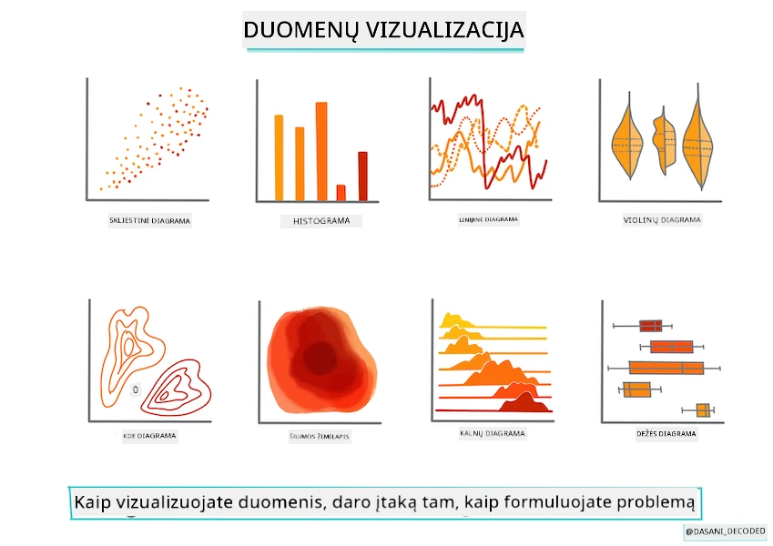
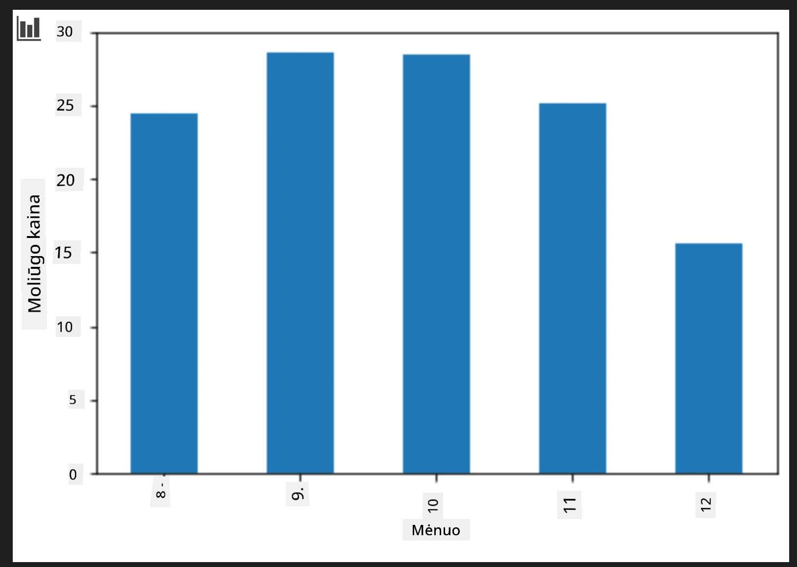
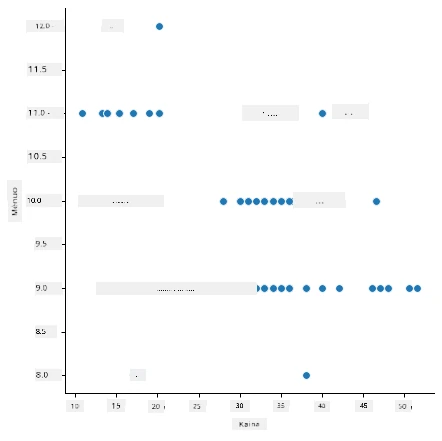
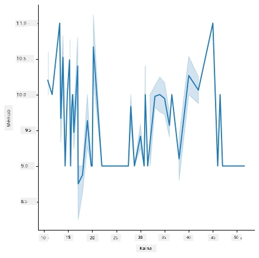
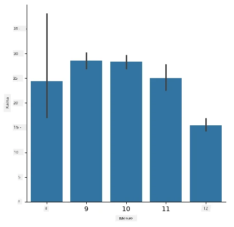
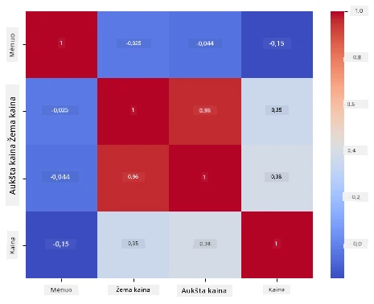

# Sukurkite regresijos modelį naudodami Scikit-learn: paruoškite ir vizualizuokite duomenis



Infografika parengė [Dasani Madipalli](https://twitter.com/dasani_decoded)

## [Priešpaskaitos testas](https://ff-quizzes.netlify.app/en/ml/)

> ### [Šios pamokos versija yra R kalba!](../../../../2-Regression/2-Data/solution/R/lesson_2.html)

## Įvadas

Dabar, kai turite įrankius, reikalingus pradėti kurti mašininio mokymosi modelius su Scikit-learn, esate pasirengę pradėti kelti klausimus savo duomenims. Dirbant su duomenimis ir taikant ML sprendimus, labai svarbu suprasti, kaip užduoti tinkamą klausimą, kad tinkamai atskleistumėte savo duomenų rinkinio potencialą.

Šioje pamokoje sužinosite:

- Kaip paruošti duomenis modeliui kurti.
- Kaip naudoti Matplotlib duomenų vizualizacijai.
- Kaip naudoti Seaborn išraiškingesnei duomenų vizualizacijai.

## Kaip tinkamai užduoti klausimą savo duomenims

Klausimas, į kurį norite gauti atsakymą, nulems, kokias ML algoritmų rūšis naudosite. O atsakymo kokybė labai priklausys nuo jūsų duomenų pobūdžio.

Peržiūrėkite [duomenis](https://github.com/microsoft/ML-For-Beginners/blob/main/2-Regression/data/US-pumpkins.csv), pateiktus šiai pamokai. Galite atidaryti šį .csv failą VS Code. Greitas įvertinimas iškart rodo, kad yra tuščių reikšmių ir mišinių tarp tekstinių ir skaitinių duomenų. Taip pat yra keistas stulpelis „Package“, kuriame duomenys yra mišrūs: 'sacks', 'bins' ir kitos reikšmės. Iš tiesų šie duomenys yra šiek tiek chaotiški.

[](https://youtu.be/5qGjczWTrDQ "ML pradedantiesiems – kaip analizuoti ir valyti duomenų rinkinį")

> 🎥 Spustelėkite aukščiau esantį paveikslėlį, kad peržiūrėtumėte trumpą vaizdo įrašą apie šios pamokos duomenų paruošimą.

Iš tiesų, nėra dažna, kad gautumėte duomenų rinkinį, kuris būtų visiškai paruoštas naudojimui ir mašininio mokymosi modeliui sukurti. Šioje pamokoje išmoksite, kaip paruošti žalius duomenis naudojant standartines Python bibliotekas. Taip pat išmoksite įvairias duomenų vizualizavimo technikas.

## Atvejo analizė: „moliūgų rinka“

Šiame aplanke rasite .csv failą pagrindiniame `data` aplanke, vadinamą [US-pumpkins.csv](https://github.com/microsoft/ML-For-Beginners/blob/main/2-Regression/data/US-pumpkins.csv), kuriame yra 1757 duomenų eilutės apie moliūgų rinką, suskirstytos pagal miestus. Tai žali duomenys, išgauti iš [Specialty Crops Terminal Markets Standard Reports](https://www.marketnews.usda.gov/mnp/fv-report-config-step1?type=termPrice), kuriuos platina Jungtinių Valstijų Žemės ūkio departamentas.

### Duomenų paruošimas

Šie duomenys yra viešojo naudojimo. Juos galima atsisiųsti daugybėje atskirų failų, po vieną už miestą, iš USDA svetainės. Kad nesusidarytų per daug atskirų failų, mes sujungėme visų miestų duomenis į vieną lentelę, taigi šiek tiek jau _paruošėme_ duomenis. Dabar pažvelkime į duomenis iš arčiau.

### Moliūgų duomenys – pirminės išvados

Ką pastebite apie šiuos duomenis? Jau matėte, kad yra mišinių – tekstų, skaičių, trūkstamų reikšmių ir keistų duomenų, kuriuos reikia suprasti.

Kokį klausimą galite užduoti šiems duomenims, naudodami regresijos techniką? Galbūt „Numatykite moliūgo kainą pardavimo mėnesį“. Vėl peržiūrint duomenis, reikia atlikti tam tikrus pakeitimus, kad sukurtumėte tinkamą duomenų struktūrą šiai užduočiai.
## Pratimai – analizuokite moliūgų duomenis

Naudosime [Pandas](https://pandas.pydata.org/), (pavadinimas reiškia `Python Data Analysis`) – labai naudingą įrankį duomenų formavimui, kad analizuosime ir paruoštume šiuos moliūgų duomenis.

### Pirmiausia – patikrinkite, ar nėra trūkstamų datų

Pirma reikės patikrinti, ar nėra trūkstamų datų:

1. Konvertuokite datas į mėnesio formatą (tai yra JAV datos, todėl formatas yra `MM/DD/YYYY`).
2. Ištraukite mėnesį į naują stulpelį.

Atidarykite _notebook.ipynb_ failą Visual Studio Code ir importuokite lentelę į naują Pandas dataframe objektą.

1. Naudokite funkciją `head()`, kad peržiūrėtumėte pirmas penkias eilutes.

    ```python
    import pandas as pd
    pumpkins = pd.read_csv('../data/US-pumpkins.csv')
    pumpkins.head()
    ```

    ✅ Kurią funkciją naudotumėte, norėdami peržiūrėti paskutines penkias eilutes?

1. Patikrinkite, ar dabartiniame dataframe nėra trūkstamų duomenų:

    ```python
    pumpkins.isnull().sum()
    ```

    Yra trūkstamų duomenų, bet galbūt tai neturės didelės reikšmės atliekant užduotį.

1. Kad būtų patogiau dirbti su dataframe, pasirinkite tik reikalingus stulpelius naudodami `loc` funkciją, kuri iš originalaus dataframe išrenka grupę eilučių (pirmasis parametras) ir stulpelių (antrasis parametras). Žymėjimas `:` žemiau reiškia „visas eilutes“.

    ```python
    columns_to_select = ['Package', 'Low Price', 'High Price', 'Date']
    pumpkins = pumpkins.loc[:, columns_to_select]
    ```

### Antra – nustatykite vidutinę moliūgo kainą

Pagalvokite, kaip nustatyti vidutinę moliūgo kainą tam tikram mėnesiui. Kokius stulpelius pasirinktumėte šiai užduočiai? Patarimas: reikės 3 stulpelių.

Sprendimas: imkite vidurkį iš `Low Price` ir `High Price` stulpelių, kad užpildytumėte naują stulpelį Price, o Date stulpelį konvertuokite taip, kad jis rodytų tik mėnesį. Laimei, pagal aukščiau atliktą patikrą, trūkstamų duomenų apie datas ir kainas nėra.

1. Norėdami apskaičiuoti vidurkį, pridėkite šį kodą:

    ```python
    price = (pumpkins['Low Price'] + pumpkins['High Price']) / 2

    month = pd.DatetimeIndex(pumpkins['Date']).month

    ```

   ✅ Drąsiai spausdinkite bet kokius duomenis su `print(month)`, jei norite patikrinti.

2. Dabar nukopijuokite konvertuotus duomenis į naują Pandas dataframe:

    ```python
    new_pumpkins = pd.DataFrame({'Month': month, 'Package': pumpkins['Package'], 'Low Price': pumpkins['Low Price'],'High Price': pumpkins['High Price'], 'Price': price})
    ```

    Spausdinant dataframe pamatysite švarų, tvarkingą duomenų rinkinį, ant kurio galėsite kurti naują regresijos modelį.

### Bet palaukite! Čia yra keletas keistenybių

Pažvelgus į `Package` stulpelį matyti, kad moliūgai parduodami įvairiomis formomis. Kai kurie parduodami '1 1/9 bushel' matmenimis, kai kurie – '1/2 bushel', kai kurie – už vienetą, kai kurie – už svarą, o kai kurie – didelėse dėžėse, kurių plotis skirtingas.

> Moliūgų svoris atrodo sunkiai nuosekliai matuojamas

Iš pradinių duomenų matyti, kad viskas, kur `Unit of Sale` lygu 'EACH' arba 'PER BIN', taip pat turi `Package` tipą per colį, per dėžę arba „kiekvieną“. Moliūgus sunku nuosekliai pasverti, tad filtruokime juos pasirinkdami tik tuos moliūgus, kurių `Package` stulpelyje yra žodis 'bushel'.

1. Pridėkite filtrą failo viršuje, po pradiniu .csv importu:

    ```python
    pumpkins = pumpkins[pumpkins['Package'].str.contains('bushel', case=True, regex=True)]
    ```

    Jei dabar spausdinsite duomenis, matysite, kad gaunate tik apie 415 eilučių, kurių duomenys apie moliūgus pagal bushelį.

### Bet palaukite! Dar reikia vieno žingsnio

Pastebėjote, kad kiekvienos eilutės bushelio kiekis skiriasi? Reikia normalizuoti kainas, kad jos būtų nurodytos už vieną bushelį, tad atlikite matematinius veiksmus, kad standartizuotumėte kainas.

1. Pridėkite šias eilutes po bloko, kuris kuria new_pumpkins dataframe:

    ```python
    new_pumpkins.loc[new_pumpkins['Package'].str.contains('1 1/9'), 'Price'] = price/(1 + 1/9)

    new_pumpkins.loc[new_pumpkins['Package'].str.contains('1/2'), 'Price'] = price/(1/2)
    ```

✅ Pasak [The Spruce Eats](https://www.thespruceeats.com/how-much-is-a-bushel-1389308), bushelio svoris priklauso nuo produkto tipo, nes tai tūrio matas. „Pavyzdžiui, vienas bushelis pomidorų turėtų sverti 56 svarus... Lapai ir žalumynai užima daugiau vietos, bet sveria mažiau, todėl vienas špinatų bushelis sveria tik 20 svarų.“ Viskas gana sudėtinga! Neskaičiuokime konversijos iš bushelio į svarą, o vertinkime kainas pagal bushelį. Visa ši moliūgų bushelių analizė parodo, kaip svarbu suprasti savo duomenų prigimtį!

Dabar galite analizuoti vieneto kainą pagal jų bushelio matavimą. Jei dar kartą atspausdinsite duomenis, matysite, kaip jie yra standartizuoti.

✅ Ar pastebėjote, kad moliūgai, parduodami per pusę bushelio, yra labai brangūs? Ar galite suprasti, kodėl? Patarimas: mažieji moliūgai kainuoja gerokai daugiau nei didieji, tikriausiai todėl, kad jų bushelyje yra daug daugiau, atsižvelgiant į neišnaudotą vietą, kurią užima didelis didelis moliūgas.

## Vizualizavimo strategijos

Duomenų mokslininko vaidmuo yra parodyti, kokie duomenys yra ir kokios jų savybės. Tam dažnai kuriami įdomūs vaizdai, diagramos ir grafikai, kurie atskleidžia santykius ir spragas, kurias kitaip sunku pastebėti.

[](https://youtu.be/SbUkxH6IJo0 "ML pradedantiesiems – kaip vizualizuoti duomenis su Matplotlib")

> 🎥 Spustelėkite paveikslėlį aukščiau, norėdami peržiūrėti trumpą vaizdo įrašą apie šios pamokos duomenų vizualizaciją.

Vizualizacijos taip pat padeda nustatyti, kokia mašininio mokymosi technika yra tinkamiausia duomenims. Pavyzdžiui, taškinė diagrama, kuri atrodo kaip sekanti liniją, rodo, kad duomenys gali būti tinkami linijinei regresijai.

Viena iš bibliotekų duomenų vizualizacijai, kuri gerai veikia Jupyter užrašų knygelėse, yra [Matplotlib](https://matplotlib.org/) (kurią jau matėte ankstesnėje pamokoje).

> Gaukite daugiau patirties su duomenų vizualizacija šiuose [mokymuose](https://docs.microsoft.com/learn/modules/explore-analyze-data-with-python?WT.mc_id=academic-77952-leestott).

## Pratimai – eksperimentuokite su Matplotlib

Pabandykite sukurti pagrindines diagramas, kad parodytumėte ką tik sukurtą dataframe. Ką rodo paprasta linijinė diagrama?

1. Importuokite Matplotlib failo viršuje, po Pandas importo:

    ```python
    import matplotlib.pyplot as plt
    ```

1. Perpaleiskite visą užrašų knygelę.
1. Apačioje pridėkite langelį, kad nupieštumėte duomenis kaip dėžutės diagramą:

    ```python
    price = new_pumpkins.Price
    month = new_pumpkins.Month
    plt.scatter(price, month)
    plt.show()
    ```

    

    Ar ši diagrama naudinga? Ar kažkas jus nustebino?

    Ji nėra ypač naudinga, nes tik rodo jūsų duomenis kaip pasklidusius taškus tam tikrame mėnesyje.

### Padarykite ją naudingą

Kad diagramos rodytų naudingus duomenis, dažnai reikia duomenis kažkaip sugrupuoti. Pabandykime sukurti diagramą, kur y ašis rodo mėnesius, o duomenys rodo jų pasiskirstymą.

1. Pridėkite langelį, kuris sukurs grupinę stulpelinę diagramą:

    ```python
    new_pumpkins.groupby(['Month'])['Price'].mean().plot(kind='bar')
    plt.ylabel("Pumpkin Price")
    ```

    

    Tai naudingesnė duomenų vizualizacija! Ji rodo, kad aukščiausia moliūgų kaina yra rugsėjį ir spalį. Ar tai atitinka jūsų lūkesčius? Kodėl ar kodėl ne?

## Pratimai – eksperimentuokite su Seaborn

Matplotlib yra galinga, bet sukurti paruoštą diagramą gali prireikti daug kodo. [Seaborn](https://seaborn.pydata.org/) yra biblioteka, sukurta _virš_ Matplotlib, skirta statistinei duomenų vizualizacijai. Ji tiesiogiai dirba su Pandas dataframe objektais, taiko patrauklius numatytuosius stilius ir leidžia kurti informatyvias diagramas su daug mažiau kodo. Kadangi Seaborn grąžina Matplotlib objektus, vis dar galite naudoti viską, ką jau žinote apie Matplotlib, rezultatui tikslinti.

> Jei dar neturite įdiegę Seaborn, įdiekite jį su `pip install seaborn`.

1. Importuokite Seaborn užrašų knygelės viršuje, po kitų importų. Paprastai jis importuojamas kaip `sns`:

    ```python
    import seaborn as sns
    ```

### Taškinės diagramos santykiams atskleisti

Svarbi duomenų tyrimo dalis prieš kuriant modelį – ieškoti _santykių_ tarp kintamųjų. [Taškinė diagrama](https://en.wikipedia.org/wiki/Scatter_plot) yra vienas geriausių įrankių tokiam tikslui: jei taškai atrodo kertantys liniją, gali būti, kad du kintamieji yra susiję, o tai rodo, kad linijinės regresijos modelis gali veikti.

1. Atkurkite ankstesnę kainos ir mėnesio taškinę diagramą, šį kartą naudodami Seaborn funkciją [`relplot()`](https://seaborn.pydata.org/generated/seaborn.relplot.html) (santykinė diagrama), kuri tiesiogiai dirba su jūsų dataframe stulpeliais:

    ```python
    sns.relplot(x="Price", y="Month", data=new_pumpkins)
    ```

    

    Atkreipkite dėmesį, kaip jūs perduodate _stulpelių pavadinimus_ ir dataframe, o Seaborn pats sukuria ašių etiketes.

2. Galite pakeisti į linijinę diagramą, perduodami `kind="line"`. Seaborn net piešia šešėlinę juostą, rodančią pasitikėjimo intervalą aplink liniją:

    ```python
    sns.relplot(x="Price", y="Month", kind="line", data=new_pumpkins)
    ```

    

    Šie duomenys yra gana triukšmingi, todėl linijinė diagrama nėra aiškiausias pasirinkimas čia – bet tai rodo, kaip lengvai galite keisti diagramų tipus Seaborn.

### Stulpelinės diagramos rodant pasiskirstymus


Anksčiau jūs rankiniu būdu grupavote duomenis, kad sukurtumėte juostinę diagramą su Matplotlib. Seaborn funkcija [`catplot()`](https://seaborn.pydata.org/generated/seaborn.catplot.html) (kategorinė diagrama) gali atlikti grupavimą ir agregavimą už jus. Pagal numatytuosius nustatymus `kind="bar"` rodo kiekvienos kategorijos vidurkį su juoda linija, nurodančia pasitikėjimo intervalą.

1. Sukurkite juostinę diagramą, rodančią vidutinę kainą per mėnesį:

    ```python
    sns.catplot(x="Month", y="Price", data=new_pumpkins, kind="bar")
    ```

    

    Tai patvirtina, ką matėte su Matplotlib – kainos pasiekia piką apie rugsėjį ir spalių – tačiau Seaborn taip pat vizualizuoja, kiek kaina _svyruoja_ kiekvieno mėnesio viduje.

### Karštųjų taškų žemėlapiai rodantys koreliacijas

Sklaidos diagramos lygina po du kintamuosius. Turint kelias skaitines stulpelius, [karštųjų taškų žemėlapis](https://en.wikipedia.org/wiki/Heat_map) leidžia iš karto matyti ryšio stiprumą tarp _kiekvienos_ poros stulpelių. Tai įprastas būdas pastebėti, kurie bruožai yra labiausiai koreliuoti prieš pasirenkant, ką naudoti modeliui (ir vėliau tokio tipo diagrama naudojama rodyti painiavos matricas klasifikacijoje).

1. Sukurkite koreliacijos matricą su Pandas, tada nupieškite ją naudodami Seaborn funkciją [`heatmap()`](https://seaborn.pydata.org/generated/seaborn.heatmap.html). Parinktis `annot=True` išspausdina koreliacijos reikšmes kiekviename langelyje:

    ```python
    correlations = new_pumpkins[['Month', 'Low Price', 'High Price', 'Price']].corr()
    sns.heatmap(correlations, annot=True, cmap="coolwarm")
    ```

    

    Reikšmės, artimos `1` (arba `-1`), reiškia, kad stulpeliai yra stipriai _linijiškai_ koreliuoti. Pastebėkite, kaip `Low Price` ir `High Price` beveik idealiai koreliuojasi. O štai `Month` rodo tik silpną tiesinę koreliaciją su kaina – nors juostinė diagrama aukščiau atskleidė aiškų sezonišką piko laikotarpį rugsėjį ir spaly. Tai svarbi pamoka: koreliacijos koeficientas matuoja tik _tiesines_ priklausomybes, todėl gali nepastebėti sezoninių ar kitaip nelinijinių modelių. ✅ Kodėl naudinga pažvelgti tiek į karštųjų taškų žemėlapį, tiek į diagramas, kaip juostinė diagrama, prieš nusprendžiant, kuriuos stulpelius naudoti?

### Matplotlib ar Seaborn?

Abu bibliotekos verta žinoti:

- **Matplotlib** suteikia smulkią kontrolę kiekvienam diagramos elementui ir yra pagrindas, ant kurio statomos beveik visos kitos Python braižymo bibliotekos.
- **Seaborn** siūlo aukštesnio lygio funkcijas ir patrauklius numatytus nustatymus statistinėms diagramoms, tiesiogiai dirba su duomenų rėmeliais ir dažnai yra greitesnis atliekant tyrinėjamuosius duomenų analizės darbus.

Dažniausias darbo eiga – naudoti Seaborn greitam duomenų tyrinėjimui, o tada pereiti prie Matplotlib, kai reikia pritaikyti detales.

---

## 🚀Iššūkis

Tyrinėkite skirtingus Matplotlib ir Seaborn siūlomus vizualizacijos tipus. Kokie tipai labiausiai tinka regresijos uždaviniams?

## [Paskaitos pabaigos testas](https://ff-quizzes.netlify.app/en/ml/)

## Apžvalga ir savarankiškas mokymasis

Pažiūrėkite į daugybę būdų vizualizuoti duomenis. Sudarykite įvairių turimų bibliotekų sąrašą ir pažymėkite, kurios geriausiai tinka tam tikroms užduotims, pavyzdžiui, 2D vizualizacijoms prieš 3D vizualizacijas. Ką atrandate?

## Namų darbai

[Vizualizacijos tyrinėjimas](assignment.md)

---

<!-- CO-OP TRANSLATOR DISCLAIMER START -->
**Atsakomybės apribojimas**:
Šis dokumentas buvo išverstas naudojant dirbtinio intelekto vertimo paslaugą [Co-op Translator](https://github.com/Azure/co-op-translator). Nors siekiame tikslumo, prašome atkreipti dėmesį, kad automatiniai vertimai gali turėti klaidų ar netikslumų. Originalus dokumentas jo gimtąja kalba laikomas autoritetingu šaltiniu. Svarbiai informacijai rekomenduojama naudoti profesionalų žmogiškąjį vertimą. Mes neatsakome už jokius nesusipratimus ar neteisingą interpretaciją, kilusią naudojantis šiuo vertimu.
<!-- CO-OP TRANSLATOR DISCLAIMER END -->