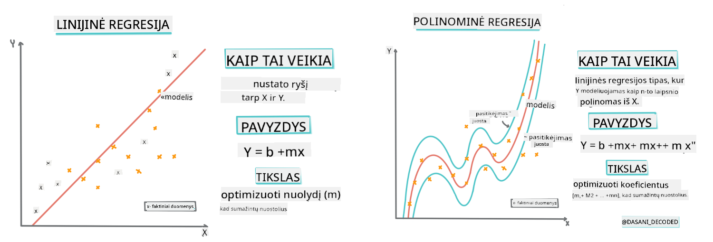
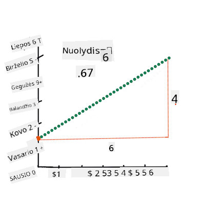
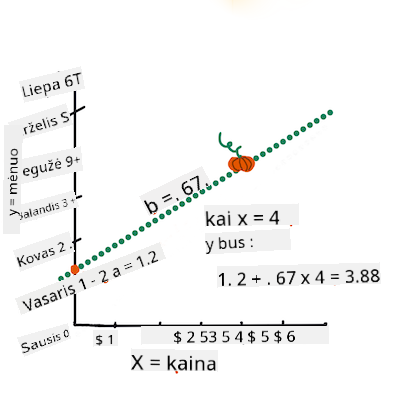

<!--
CO_OP_TRANSLATOR_METADATA:
{
  "original_hash": "2f88fbc741d792890ff2f1430fe0dae0",
  "translation_date": "2025-09-03T16:18:11+00:00",
  "source_file": "2-Regression/3-Linear/README.md",
  "language_code": "lt"
}
-->
# Sukurkite regresijos modelį naudodami Scikit-learn: keturi regresijos būdai


> Infografikas sukurtas [Dasani Madipalli](https://twitter.com/dasani_decoded)
## [Klausimynas prieš paskaitą](https://gray-sand-07a10f403.1.azurestaticapps.net/quiz/13/)

> ### [Ši pamoka pasiekiama ir R kalba!](../../../../2-Regression/3-Linear/solution/R/lesson_3.html)
### Įvadas

Iki šiol jūs tyrinėjote, kas yra regresija, naudodami pavyzdinius duomenis iš moliūgų kainų duomenų rinkinio, kurį naudosime visoje šioje pamokoje. Taip pat vizualizavote duomenis naudodami Matplotlib.

Dabar esate pasiruošę gilintis į regresiją mašininio mokymosi kontekste. Nors vizualizacija leidžia suprasti duomenis, tikroji mašininio mokymosi galia slypi _modelių mokyme_. Modeliai mokomi naudojant istorinius duomenis, kad automatiškai užfiksuotų duomenų priklausomybes, ir jie leidžia prognozuoti rezultatus naujiems duomenims, kurių modelis dar nematė.

Šioje pamokoje sužinosite daugiau apie du regresijos tipus: _paprastą linijinę regresiją_ ir _polinominę regresiją_, kartu su kai kuriais matematiniais pagrindais, kurie yra šių metodų pagrindas. Šie modeliai leis mums prognozuoti moliūgų kainas, atsižvelgiant į skirtingus įvesties duomenis.

[](https://youtu.be/CRxFT8oTDMg "ML pradedantiesiems - suprasti linijinę regresiją")

> 🎥 Spustelėkite aukščiau esančią nuotrauką, kad peržiūrėtumėte trumpą vaizdo įrašą apie linijinę regresiją.

> Visame šioje mokymo programoje mes darome prielaidą, kad turite minimalias matematikos žinias, ir siekiame, kad ji būtų prieinama studentams iš kitų sričių. Todėl atkreipkite dėmesį į pastabas, 🧮 išnašas, diagramas ir kitus mokymosi įrankius, kurie padės suprasti.

### Būtinos žinios

Iki šiol turėtumėte būti susipažinę su moliūgų duomenų struktūra, kurią mes nagrinėjame. Šiuos duomenis galite rasti iš anksto įkeltus ir iš anksto išvalytus šios pamokos _notebook.ipynb_ faile. Faile moliūgų kaina pateikiama už bušelį naujame duomenų rėmelyje. Įsitikinkite, kad galite paleisti šiuos užrašų knygeles Visual Studio Code aplinkoje.

### Pasiruošimas

Primename, kad įkeliame šiuos duomenis tam, kad galėtume užduoti jiems klausimus.

- Kada geriausias laikas pirkti moliūgus?
- Kokia kaina galima tikėtis už miniatiūrinių moliūgų dėžę?
- Ar verta pirkti juos pusės bušelio krepšiuose ar 1 1/9 bušelio dėžėse?
Tęskime duomenų tyrimą.

Ankstesnėje pamokoje sukūrėte Pandas duomenų rėmelį ir užpildėte jį dalimi originalaus duomenų rinkinio, standartizuodami kainas pagal bušelį. Tačiau tai leido surinkti tik apie 400 duomenų taškų ir tik rudens mėnesiams.

Pažvelkite į duomenis, kurie iš anksto įkelti šios pamokos pridedamame užrašų knygelėje. Duomenys yra iš anksto įkelti, o pradinė sklaidos diagrama sudaryta, kad parodytų mėnesio duomenis. Galbūt galime gauti šiek tiek daugiau informacijos apie duomenų pobūdį, juos dar labiau išvalydami.

## Linijinės regresijos linija

Kaip sužinojote 1 pamokoje, linijinės regresijos tikslas yra sugebėti nubrėžti liniją, kad:

- **Parodytų kintamųjų ryšius**. Parodytų ryšį tarp kintamųjų
- **Darytų prognozes**. Tiksliai prognozuotų, kur naujas duomenų taškas atsidurtų santykyje su ta linija.

Tipiška **mažiausių kvadratų regresija** nubrėžia tokio tipo liniją. Terminas „mažiausi kvadratai“ reiškia, kad visi duomenų taškai aplink regresijos liniją yra kvadratuojami ir tada sudedami. Idealiu atveju galutinė suma yra kuo mažesnė, nes norime mažo klaidų skaičiaus arba `mažiausių kvadratų`.

Tai darome, nes norime modeliuoti liniją, kuri turi mažiausią bendrą atstumą nuo visų mūsų duomenų taškų. Taip pat kvadratuojame terminus prieš juos sudėdami, nes mums rūpi jų dydis, o ne kryptis.

> **🧮 Parodykite matematiką**
>
> Ši linija, vadinama _geriausiai tinkama linija_, gali būti išreikšta [lygtimi](https://en.wikipedia.org/wiki/Simple_linear_regression):
>
> ```
> Y = a + bX
> ```
>
> `X` yra „paaiškinamasis kintamasis“. `Y` yra „priklausomas kintamasis“. Linijos nuolydis yra `b`, o `a` yra y-ašies perėjimo taškas, kuris nurodo `Y` reikšmę, kai `X = 0`.
>
>
>
> Pirmiausia apskaičiuokite nuolydį `b`. Infografikas sukurtas [Jen Looper](https://twitter.com/jenlooper)
>
> Kitaip tariant, remiantis mūsų moliūgų duomenų pradiniu klausimu: „prognozuoti moliūgo kainą už bušelį pagal mėnesį“, `X` reikštų kainą, o `Y` reikštų pardavimo mėnesį.
>
>
>
> Apskaičiuokite `Y` reikšmę. Jei mokate apie 4 dolerius, tai turi būti balandis! Infografikas sukurtas [Jen Looper](https://twitter.com/jenlooper)
>
> Matematiniai skaičiavimai, kurie apskaičiuoja liniją, turi parodyti linijos nuolydį, kuris taip pat priklauso nuo perėjimo taško, arba kur `Y` yra, kai `X = 0`.
>
> Šių reikšmių skaičiavimo metodą galite stebėti [Math is Fun](https://www.mathsisfun.com/data/least-squares-regression.html) svetainėje. Taip pat apsilankykite [mažiausių kvadratų skaičiuoklėje](https://www.mathsisfun.com/data/least-squares-calculator.html), kad pamatytumėte, kaip skaičių reikšmės veikia liniją.

## Koreliacija

Dar vienas terminas, kurį reikia suprasti, yra **koreliacijos koeficientas** tarp duotų X ir Y kintamųjų. Naudodami sklaidos diagramą, galite greitai vizualizuoti šį koeficientą. Diagrama, kurioje duomenų taškai išsidėstę tvarkinga linija, turi aukštą koreliaciją, tačiau diagrama, kurioje duomenų taškai išsidėstę chaotiškai tarp X ir Y, turi žemą koreliaciją.

Geras linijinės regresijos modelis bus tas, kuris turi aukštą (artimesnį 1 nei 0) koreliacijos koeficientą, naudojant mažiausių kvadratų regresijos metodą su regresijos linija.

✅ Paleiskite šios pamokos pridedamą užrašų knygelę ir pažiūrėkite į sklaidos diagramą, kurioje mėnuo susietas su kaina. Ar duomenys, susiję su mėnesiu ir moliūgų pardavimo kaina, atrodo turintys aukštą ar žemą koreliaciją, remiantis jūsų vizualine sklaidos diagramos interpretacija? Ar tai pasikeičia, jei naudojate smulkesnį matą, pvz., *metų dieną* (t. y. dienų skaičių nuo metų pradžios)?

Žemiau pateiktame kode darome prielaidą, kad išvalėme duomenis ir gavome duomenų rėmelį, vadinamą `new_pumpkins`, panašų į šį:

ID | Mėnuo | Metų diena | Veislė | Miestas | Pakuotė | Maža kaina | Aukšta kaina | Kaina
---|-------|-----------|---------|------|---------|-----------|------------|-------
70 | 9 | 267 | PIE TYPE | BALTIMORE | 1 1/9 bušelio dėžės | 15.0 | 15.0 | 13.636364
71 | 9 | 267 | PIE TYPE | BALTIMORE | 1 1/9 bušelio dėžės | 18.0 | 18.0 | 16.363636
72 | 10 | 274 | PIE TYPE | BALTIMORE | 1 1/9 bušelio dėžės | 18.0 | 18.0 | 16.363636
73 | 10 | 274 | PIE TYPE | BALTIMORE | 1 1/9 bušelio dėžės | 17.0 | 17.0 | 15.454545
74 | 10 | 281 | PIE TYPE | BALTIMORE | 1 1/9 bušelio dėžės | 15.0 | 15.0 | 13.636364

> Duomenų valymo kodas pateiktas [`notebook.ipynb`](notebook.ipynb). Atlikome tuos pačius valymo veiksmus kaip ir ankstesnėje pamokoje, ir apskaičiavome `Metų diena` stulpelį naudodami šią išraišką:

```python
day_of_year = pd.to_datetime(pumpkins['Date']).apply(lambda dt: (dt-datetime(dt.year,1,1)).days)
```

Dabar, kai suprantate linijinės regresijos matematiką, sukurkime regresijos modelį, kad pamatytume, ar galime prognozuoti, kuri moliūgų pakuotė turės geriausias moliūgų kainas. Kažkas, perkantis moliūgus šventiniam moliūgų sodui, gali norėti šios informacijos, kad galėtų optimizuoti savo moliūgų pakuočių pirkimus sodui.

## Ieškome koreliacijos

[](https://youtu.be/uoRq-lW2eQo "ML pradedantiesiems - ieškome koreliacijos: linijinės regresijos raktas")

> 🎥 Spustelėkite aukščiau esančią nuotrauką, kad peržiūrėtumėte trumpą vaizdo įrašą apie koreliaciją.

Iš ankstesnės pamokos turbūt pastebėjote, kad vidutinė kaina skirtingais mėnesiais atrodo taip:


Tai rodo, kad turėtų būti tam tikra koreliacija, ir galime pabandyti treniruoti linijinį regresijos modelį, kad prognozuotume ryšį tarp `Mėnuo` ir `Kaina`, arba tarp `Metų diena` ir `Kaina`. Štai sklaidos diagrama, rodanti pastarąjį ryšį:

 

Pažiūrėkime, ar yra koreliacija, naudodami `corr` funkciją:

```python
print(new_pumpkins['Month'].corr(new_pumpkins['Price']))
print(new_pumpkins['DayOfYear'].corr(new_pumpkins['Price']))
```

Atrodo, kad koreliacija yra gana maža, -0.15 pagal `Mėnuo` ir -0.17 pagal `Metų diena`, tačiau gali būti kita svarbi priklausomybė. Atrodo, kad yra skirtingos kainų grupės, atitinkančios skirtingas moliūgų veisles. Norėdami patvirtinti šią hipotezę, nubrėžkime kiekvieną moliūgų kategoriją naudodami skirtingą spalvą. Perduodami `ax` parametrą `scatter` funkcijai, galime nubrėžti visus taškus toje pačioje diagramoje:

```python
ax=None
colors = ['red','blue','green','yellow']
for i,var in enumerate(new_pumpkins['Variety'].unique()):
    df = new_pumpkins[new_pumpkins['Variety']==var]
    ax = df.plot.scatter('DayOfYear','Price',ax=ax,c=colors[i],label=var)
```

 

Mūsų tyrimas rodo, kad veislė turi didesnį poveikį bendrai kainai nei faktinė pardavimo data. Tai galime pamatyti naudodami stulpelinę diagramą:

```python
new_pumpkins.groupby('Variety')['Price'].mean().plot(kind='bar')
```

 

Sutelksime dėmesį tik į vieną moliūgų veislę, „pie type“, ir pažiūrėsime, kokį poveikį data turi kainai:

```python
pie_pumpkins = new_pumpkins[new_pumpkins['Variety']=='PIE TYPE']
pie_pumpkins.plot.scatter('DayOfYear','Price') 
```
 

Jei dabar apskaičiuosime koreliaciją tarp `Kaina` ir `Metų diena` naudodami `corr` funkciją, gausime maždaug `-0.27` - tai reiškia, kad treniruoti prognozavimo modelį yra prasminga.

> Prieš treniruojant linijinį regresijos modelį, svarbu įsitikinti, kad mūsų duomenys yra švarūs. Linijinė regresija neveikia gerai su trūkstamomis reikšmėmis, todėl verta atsikratyti visų tuščių langelių:

```python
pie_pumpkins.dropna(inplace=True)
pie_pumpkins.info()
```

Kitas požiūris būtų užpildyti tuščias reikšmes vidutinėmis reikšmėmis iš atitinkamo stulpelio.

## Paprasta linijinė regresija

[](https://youtu.be/e4c_UP2fSjg "ML pradedantiesiems - linijinė ir polinominė regresija naudojant Scikit-learn")

> 🎥 Spustelėkite aukščiau esančią nuotrauką, kad peržiūrėtumėte trumpą vaizdo įrašą apie linijinę ir polinominę regresiją.

Norėdami treniruoti mūsų linijinį regresijos modelį, naudosime **Scikit-learn** biblioteką.

```python
from sklearn.linear_model import LinearRegression
from sklearn.metrics import mean_squared_error
from sklearn.model_selection import train_test_split
```

Pradėsime atskirdami įvesties reikšmes (funkcijas) ir laukiamą rezultatą (etiketę) į atskirus numpy masyvus:

```python
X = pie_pumpkins['DayOfYear'].to_numpy().reshape(-1,1)
y = pie_pumpkins['Price']
```

> Atkreipkite dėmesį, kad turėjome atlikti `reshape` įvesties duomenims, kad linijinės regresijos paketas juos suprastų teisingai. Linijinė regresija tikisi 2D masyvo kaip įvesties, kur kiekviena masyvo eilutė atitinka įvesties funkcijų vektorių. Mūsų atveju, kadangi turime tik vieną įvestį, mums reikia masyvo su forma N×1, kur N yra duomenų rinkinio dydis.

Tada turime padalyti duomenis į treniravimo ir testavimo duomenų rinkinius, kad galėtume patikrinti savo modelį po treniravimo:

```python
X_train, X_test, y_train, y_test = train_test_split(X, y, test_size=0.2, random_state=0)
```

Galiausiai, faktinis linijinės regresijos modelio treniravimas užtrunka tik dvi kodo eilutes. Apibrėžiame `LinearRegression` objektą ir pritaikome jį mūsų duomenims naudodami `fit` metodą:

```python
lin_reg = LinearRegression()
lin_reg.fit(X_train,y_train)
```

`LinearRegression` objektas po `fit`-inimo turi visus regresijos koeficientus, kuriuos galima pasiekti naudojant `.coef_` savybę. Mūsų atveju yra tik vienas koeficientas, kuris turėtų būti apie `-0.017`. Tai reiškia, kad kainos atrodo šiek tiek mažėjančios laikui bėgant, bet ne per daug, maždaug 2 centais per dieną. Taip pat galime
Mūsų klaida atrodo susijusi su 2 taškais, tai yra ~17%. Nelabai gerai. Kitas modelio kokybės rodiklis yra **determinacijos koeficientas**, kurį galima gauti taip:

```python
score = lin_reg.score(X_train,y_train)
print('Model determination: ', score)
```  
Jei reikšmė yra 0, tai reiškia, kad modelis neatsižvelgia į įvesties duomenis ir veikia kaip *blogiausias linijinis prognozuotojas*, kuris tiesiog yra rezultatų vidutinė reikšmė. Reikšmė 1 reiškia, kad galime tobulai prognozuoti visus numatomus rezultatus. Mūsų atveju determinacijos koeficientas yra apie 0.06, kas yra gana žema reikšmė.

Taip pat galime nubrėžti testavimo duomenis kartu su regresijos linija, kad geriau suprastume, kaip regresija veikia mūsų atveju:

```python
plt.scatter(X_test,y_test)
plt.plot(X_test,pred)
```  


## Polinominė regresija

Kitas linijinės regresijos tipas yra polinominė regresija. Nors kartais tarp kintamųjų yra linijinis ryšys – kuo didesnis moliūgo tūris, tuo didesnė kaina – kartais šių ryšių negalima pavaizduoti kaip plokštumos ar tiesės.

✅ Štai [keletas pavyzdžių](https://online.stat.psu.edu/stat501/lesson/9/9.8) duomenų, kuriems galėtų būti taikoma polinominė regresija.

Pažvelkite dar kartą į ryšį tarp datos ir kainos. Ar šis sklaidos grafikas atrodo kaip toks, kurį būtinai reikėtų analizuoti tiesės pagalba? Ar kainos negali svyruoti? Tokiu atveju galite išbandyti polinominę regresiją.

✅ Polinomai yra matematinės išraiškos, kurios gali susidėti iš vieno ar daugiau kintamųjų ir koeficientų.

Polinominė regresija sukuria kreivę, kuri geriau atitinka nelinijinius duomenis. Mūsų atveju, jei įvesties duomenyse įtrauksime kvadratinį `DayOfYear` kintamąjį, turėtume galėti pritaikyti savo duomenis parabolinei kreivei, kuri turės minimumą tam tikru metų momentu.

Scikit-learn turi naudingą [pipeline API](https://scikit-learn.org/stable/modules/generated/sklearn.pipeline.make_pipeline.html?highlight=pipeline#sklearn.pipeline.make_pipeline), leidžiantį sujungti skirtingus duomenų apdorojimo žingsnius. **Pipeline** yra **vertintojų** grandinė. Mūsų atveju sukursime pipeline, kuris pirmiausia prideda polinomines savybes prie mūsų modelio, o tada treniruoja regresiją:

```python
from sklearn.preprocessing import PolynomialFeatures
from sklearn.pipeline import make_pipeline

pipeline = make_pipeline(PolynomialFeatures(2), LinearRegression())

pipeline.fit(X_train,y_train)
```  

Naudojant `PolynomialFeatures(2)` reiškia, kad įtrauksime visus antro laipsnio polinomus iš įvesties duomenų. Mūsų atveju tai tiesiog reikš `DayOfYear`<sup>2</sup>, bet turint du įvesties kintamuosius X ir Y, tai pridės X<sup>2</sup>, XY ir Y<sup>2</sup>. Jei norime, galime naudoti aukštesnio laipsnio polinomus.

Pipeline galima naudoti taip pat, kaip ir originalų `LinearRegression` objektą, t.y. galime `fit` pipeline, o tada naudoti `predict`, kad gautume prognozės rezultatus. Štai grafikas, rodantis testavimo duomenis ir aproksimacijos kreivę:


Naudojant polinominę regresiją, galime gauti šiek tiek mažesnį MSE ir aukštesnį determinacijos koeficientą, bet ne žymiai. Reikia atsižvelgti į kitas savybes!

> Galite pastebėti, kad mažiausios moliūgų kainos stebimos kažkur apie Heloviną. Kaip tai paaiškintumėte?

🎃 Sveikiname, ką tik sukūrėte modelį, kuris gali padėti prognozuoti pyraginių moliūgų kainą. Tikriausiai galite pakartoti tą pačią procedūrą visiems moliūgų tipams, bet tai būtų varginantis darbas. Dabar išmokime, kaip įtraukti moliūgų veislę į mūsų modelį!

## Kategorinės savybės

Idealiame pasaulyje norėtume sugebėti prognozuoti kainas skirtingoms moliūgų veislėms naudodami tą patį modelį. Tačiau `Variety` stulpelis šiek tiek skiriasi nuo tokių stulpelių kaip `Month`, nes jame yra ne skaitinės reikšmės. Tokie stulpeliai vadinami **kategoriniais**.

[](https://youtu.be/DYGliioIAE0 "ML pradedantiesiems - Kategorinių savybių prognozės naudojant linijinę regresiją")

> 🎥 Spustelėkite aukščiau esančią nuotrauką, kad peržiūrėtumėte trumpą vaizdo įrašą apie kategorinių savybių naudojimą.

Čia galite pamatyti, kaip vidutinė kaina priklauso nuo veislės:


Norėdami atsižvelgti į veislę, pirmiausia turime ją konvertuoti į skaitinę formą, arba **užkoduoti**. Yra keli būdai, kaip tai padaryti:

* Paprastas **skaitinis kodavimas** sukurs skirtingų veislių lentelę, o tada pakeis veislės pavadinimą indeksu toje lentelėje. Tai nėra geriausia idėja linijinei regresijai, nes linijinė regresija naudoja faktinę indekso skaitinę reikšmę ir prideda ją prie rezultato, padaugindama iš tam tikro koeficiento. Mūsų atveju ryšys tarp indekso numerio ir kainos yra aiškiai nelinijinis, net jei užtikrinsime, kad indeksai būtų išdėstyti tam tikra tvarka.
* **Vieno karšto kodavimo** metodas pakeis `Variety` stulpelį į 4 skirtingus stulpelius, po vieną kiekvienai veislei. Kiekviename stulpelyje bus `1`, jei atitinkama eilutė priklauso tam tikrai veislei, ir `0` kitu atveju. Tai reiškia, kad linijinėje regresijoje bus keturi koeficientai, po vieną kiekvienai moliūgų veislei, atsakingi už "pradinę kainą" (arba "papildomą kainą") tai konkrečiai veislei.

Žemiau pateiktas kodas rodo, kaip galime vieno karšto kodavimo būdu užkoduoti veislę:

```python
pd.get_dummies(new_pumpkins['Variety'])
```  

 ID | FAIRYTALE | MINIATURE | MIXED HEIRLOOM VARIETIES | PIE TYPE  
----|-----------|-----------|--------------------------|----------  
70 | 0 | 0 | 0 | 1  
71 | 0 | 0 | 0 | 1  
... | ... | ... | ... | ...  
1738 | 0 | 1 | 0 | 0  
1739 | 0 | 1 | 0 | 0  
1740 | 0 | 1 | 0 | 0  
1741 | 0 | 1 | 0 | 0  
1742 | 0 | 1 | 0 | 0  

Norėdami treniruoti linijinę regresiją, naudodami vieno karšto kodavimo būdu užkoduotą veislę kaip įvestį, tiesiog turime tinkamai inicializuoti `X` ir `y` duomenis:

```python
X = pd.get_dummies(new_pumpkins['Variety'])
y = new_pumpkins['Price']
```  

Likęs kodas yra toks pat, kaip ir tas, kurį naudojome aukščiau linijinei regresijai treniruoti. Jei tai išbandysite, pamatysite, kad vidutinė kvadratinė klaida yra maždaug tokia pati, tačiau gauname daug aukštesnį determinacijos koeficientą (~77%). Norėdami gauti dar tikslesnes prognozes, galime atsižvelgti į daugiau kategorinių savybių, taip pat į skaitines savybes, tokias kaip `Month` ar `DayOfYear`. Norėdami gauti vieną didelį savybių masyvą, galime naudoti `join`:

```python
X = pd.get_dummies(new_pumpkins['Variety']) \
        .join(new_pumpkins['Month']) \
        .join(pd.get_dummies(new_pumpkins['City'])) \
        .join(pd.get_dummies(new_pumpkins['Package']))
y = new_pumpkins['Price']
```  

Čia taip pat atsižvelgiame į `City` ir `Package` tipą, kas suteikia MSE 2.84 (10%) ir determinaciją 0.94!

## Viskas kartu

Norėdami sukurti geriausią modelį, galime naudoti kombinuotus (vieno karšto kodavimo būdu užkoduotus kategorinius + skaitinius) duomenis iš aukščiau pateikto pavyzdžio kartu su polinomine regresija. Štai visas kodas jūsų patogumui:

```python
# set up training data
X = pd.get_dummies(new_pumpkins['Variety']) \
        .join(new_pumpkins['Month']) \
        .join(pd.get_dummies(new_pumpkins['City'])) \
        .join(pd.get_dummies(new_pumpkins['Package']))
y = new_pumpkins['Price']

# make train-test split
X_train, X_test, y_train, y_test = train_test_split(X, y, test_size=0.2, random_state=0)

# setup and train the pipeline
pipeline = make_pipeline(PolynomialFeatures(2), LinearRegression())
pipeline.fit(X_train,y_train)

# predict results for test data
pred = pipeline.predict(X_test)

# calculate MSE and determination
mse = np.sqrt(mean_squared_error(y_test,pred))
print(f'Mean error: {mse:3.3} ({mse/np.mean(pred)*100:3.3}%)')

score = pipeline.score(X_train,y_train)
print('Model determination: ', score)
```  

Tai turėtų suteikti geriausią determinacijos koeficientą, beveik 97%, ir MSE=2.23 (~8% prognozės klaida).

| Modelis | MSE | Determinacija |  
|---------|-----|---------------|  
| `DayOfYear` Linijinis | 2.77 (17.2%) | 0.07 |  
| `DayOfYear` Polinominis | 2.73 (17.0%) | 0.08 |  
| `Variety` Linijinis | 5.24 (19.7%) | 0.77 |  
| Visos savybės Linijinis | 2.84 (10.5%) | 0.94 |  
| Visos savybės Polinominis | 2.23 (8.25%) | 0.97 |  

🏆 Puikiai padirbėta! Jūs sukūrėte keturis regresijos modelius per vieną pamoką ir pagerinote modelio kokybę iki 97%. Paskutinėje regresijos dalyje išmoksite apie logistinę regresiją, skirtą kategorijoms nustatyti.

---

## 🚀Iššūkis

Išbandykite kelis skirtingus kintamuosius šiame užrašų knygelėje, kad pamatytumėte, kaip koreliacija atitinka modelio tikslumą.

## [Po paskaitos testas](https://gray-sand-07a10f403.1.azurestaticapps.net/quiz/14/)

## Apžvalga ir savarankiškas mokymasis

Šioje pamokoje išmokome apie linijinę regresiją. Yra ir kitų svarbių regresijos tipų. Perskaitykite apie Stepwise, Ridge, Lasso ir Elasticnet metodus. Geras kursas, norint sužinoti daugiau, yra [Stanfordo statistinio mokymosi kursas](https://online.stanford.edu/courses/sohs-ystatslearning-statistical-learning).

## Užduotis

[Sukurkite modelį](assignment.md)  

---

**Atsakomybės apribojimas**:  
Šis dokumentas buvo išverstas naudojant AI vertimo paslaugą [Co-op Translator](https://github.com/Azure/co-op-translator). Nors siekiame tikslumo, prašome atkreipti dėmesį, kad automatiniai vertimai gali turėti klaidų ar netikslumų. Originalus dokumentas jo gimtąja kalba turėtų būti laikomas autoritetingu šaltiniu. Kritinei informacijai rekomenduojama profesionali žmogaus vertimo paslauga. Mes neprisiimame atsakomybės už nesusipratimus ar neteisingus interpretavimus, atsiradusius naudojant šį vertimą.