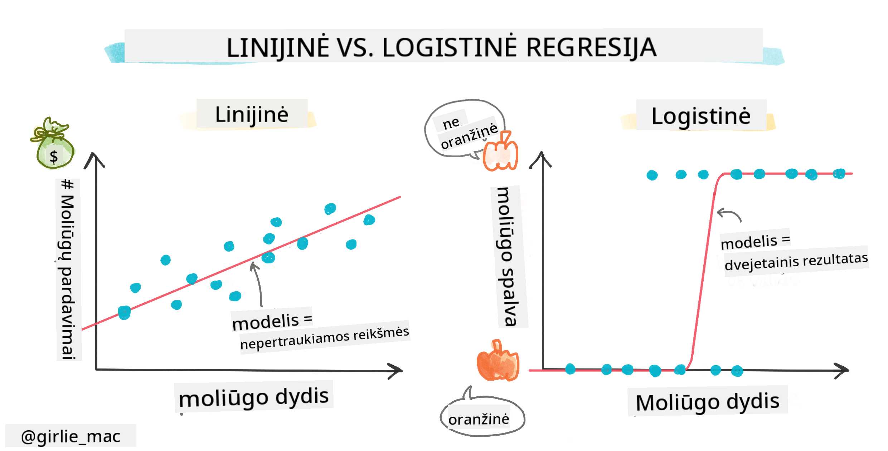
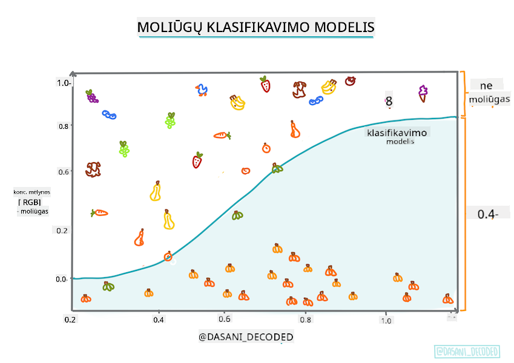
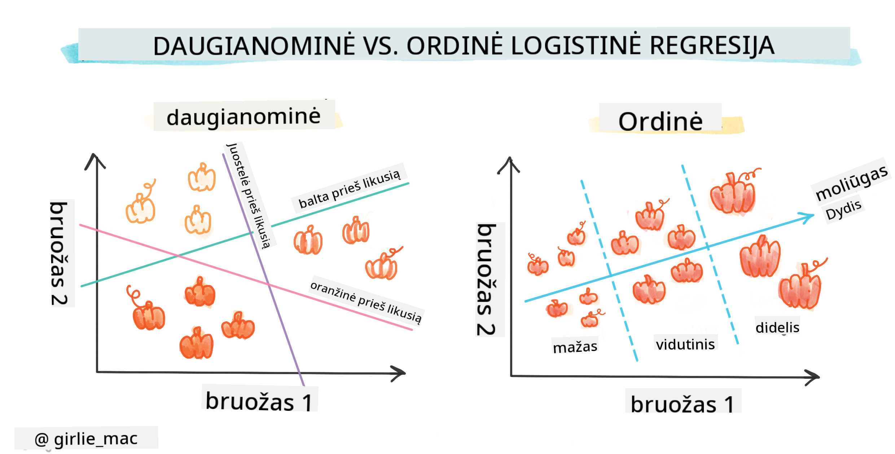
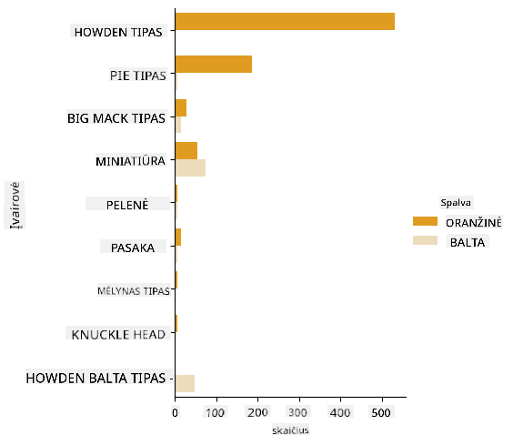
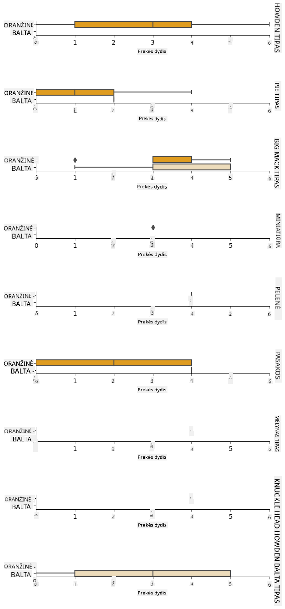
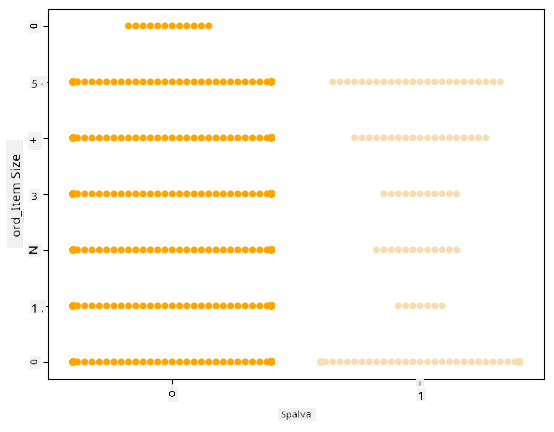
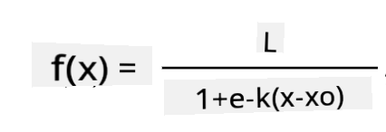
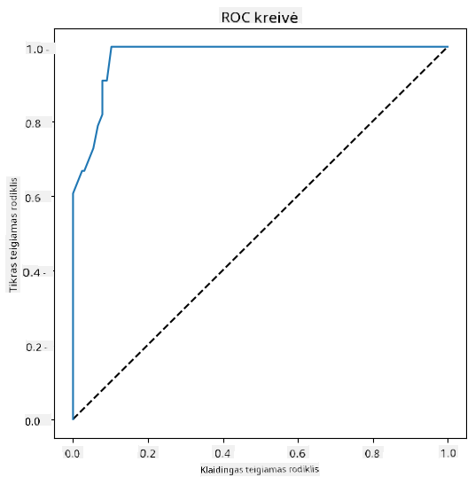

<!--
CO_OP_TRANSLATOR_METADATA:
{
  "original_hash": "72b5bae0879baddf6aafc82bb07b8776",
  "translation_date": "2025-09-03T16:25:42+00:00",
  "source_file": "2-Regression/4-Logistic/README.md",
  "language_code": "lt"
}
-->
# Logistinė regresija kategorijoms prognozuoti



## [Prieš paskaitą atlikite testą](https://gray-sand-07a10f403.1.azurestaticapps.net/quiz/15/)

> ### [Ši pamoka taip pat prieinama R kalba!](../../../../2-Regression/4-Logistic/solution/R/lesson_4.html)

## Įvadas

Šioje paskutinėje pamokoje apie regresiją, vieną iš pagrindinių _klasikinių_ mašininio mokymosi technikų, aptarsime logistinę regresiją. Ši technika naudojama norint atrasti dėsningumus, leidžiančius prognozuoti dvejetaines kategorijas. Ar šis saldainis yra šokoladas, ar ne? Ar ši liga yra užkrečiama, ar ne? Ar šis klientas pasirinks šį produktą, ar ne?

Šioje pamokoje sužinosite:

- Naują biblioteką duomenų vizualizacijai
- Logistinės regresijos technikas

✅ Gilinkite savo supratimą apie darbą su šio tipo regresija šiame [mokymosi modulyje](https://docs.microsoft.com/learn/modules/train-evaluate-classification-models?WT.mc_id=academic-77952-leestott)

## Prieš pradedant

Dirbdami su moliūgų duomenimis, jau esame pakankamai susipažinę su jais, kad pastebėtume vieną dvejetainę kategoriją, su kuria galime dirbti: `Spalva`.

Sukurkime logistinį regresijos modelį, kuris prognozuotų, kokia spalva greičiausiai bus tam tikras moliūgas (oranžinis 🎃 ar baltas 👻).

> Kodėl kalbame apie dvejetainę klasifikaciją pamokoje apie regresiją? Tik dėl lingvistinio patogumo, nes logistinė regresija yra [iš tikrųjų klasifikacijos metodas](https://scikit-learn.org/stable/modules/linear_model.html#logistic-regression), nors ir pagrįstas linijine metodologija. Sužinokite apie kitus duomenų klasifikavimo būdus kitoje pamokų grupėje.

## Apibrėžkime klausimą

Mūsų tikslams išreikšime tai kaip dvejetainį klausimą: „Balta“ arba „Ne balta“. Mūsų duomenų rinkinyje taip pat yra „dryžuota“ kategorija, tačiau jos pavyzdžių yra nedaug, todėl jos nenaudosime. Ji vis tiek išnyksta, kai pašaliname trūkstamas reikšmes iš duomenų rinkinio.

> 🎃 Smagus faktas: baltus moliūgus kartais vadiname „vaiduoklių“ moliūgais. Juos nėra lengva išskaptuoti, todėl jie nėra tokie populiarūs kaip oranžiniai, bet atrodo labai įdomiai! Taigi, galėtume reformuluoti savo klausimą kaip: „Vaiduoklis“ arba „Ne vaiduoklis“. 👻

## Apie logistinę regresiją

Logistinė regresija skiriasi nuo linijinės regresijos, apie kurią jau mokėtės, keliais svarbiais aspektais.

[](https://youtu.be/KpeCT6nEpBY "Pradedantiesiems apie ML - Logistinės regresijos supratimas mašininio mokymosi klasifikacijai")

> 🎥 Spustelėkite aukščiau esančią nuotrauką, kad peržiūrėtumėte trumpą vaizdo įrašą apie logistinės regresijos apžvalgą.

### Dvejetainė klasifikacija

Logistinė regresija nepasiūlo tų pačių galimybių kaip linijinė regresija. Pirmoji pateikia prognozę apie dvejetainę kategoriją („balta arba ne balta“), o antroji gali prognozuoti tęstines reikšmes, pavyzdžiui, atsižvelgiant į moliūgo kilmę ir derliaus nuėmimo laiką, _kaip kils jo kaina_.


> Infografikas sukurtas [Dasani Madipalli](https://twitter.com/dasani_decoded)

### Kitos klasifikacijos

Yra ir kitų logistinės regresijos tipų, įskaitant daugianarę ir eilinę:

- **Daugianarė**, kuri apima daugiau nei vieną kategoriją - „Oranžinė, Balta ir Dryžuota“.
- **Eilinė**, kuri apima tvarkingas kategorijas, naudingas, jei norime logiškai išdėstyti rezultatus, pavyzdžiui, mūsų moliūgus, kurie yra išdėstyti pagal ribotą dydžių skaičių (mini, mažas, vidutinis, didelis, labai didelis, ypač didelis).



### Kintamieji NETURI būti koreliuoti

Prisiminkite, kaip linijinė regresija geriau veikė su labiau koreliuotais kintamaisiais? Logistinė regresija yra priešinga – kintamieji neturi būti suderinti. Tai tinka šiems duomenims, kuriuose koreliacijos yra gana silpnos.

### Reikia daug švarių duomenų

Logistinė regresija pateiks tikslesnius rezultatus, jei naudosite daugiau duomenų; mūsų mažas duomenų rinkinys nėra optimalus šiai užduočiai, todėl tai turėkite omenyje.

[](https://youtu.be/B2X4H9vcXTs "Pradedantiesiems apie ML - Duomenų analizė ir paruošimas logistinei regresijai")

✅ Pagalvokite apie duomenų tipus, kurie geriausiai tiktų logistinei regresijai

## Užduotis – sutvarkykite duomenis

Pirmiausia šiek tiek išvalykite duomenis, pašalindami trūkstamas reikšmes ir pasirinkdami tik kai kuriuos stulpelius:

1. Pridėkite šį kodą:

    ```python
  
    columns_to_select = ['City Name','Package','Variety', 'Origin','Item Size', 'Color']
    pumpkins = full_pumpkins.loc[:, columns_to_select]

    pumpkins.dropna(inplace=True)
    ```

    Visada galite pažvelgti į savo naują duomenų rėmelį:

    ```python
    pumpkins.info
    ```

### Vizualizacija – kategorinis grafikas

Iki šiol jūs jau įkėlėte [pradinį užrašų knygelę](./notebook.ipynb) su moliūgų duomenimis ir išvalėte ją taip, kad išsaugotumėte duomenų rinkinį, kuriame yra keli kintamieji, įskaitant `Spalvą`. Vizualizuokime duomenų rėmelį užrašų knygelėje naudodami kitą biblioteką: [Seaborn](https://seaborn.pydata.org/index.html), kuri yra sukurta ant Matplotlib, kurį naudojome anksčiau.

Seaborn siūlo įdomių būdų vizualizuoti jūsų duomenis. Pavyzdžiui, galite palyginti duomenų pasiskirstymą pagal kiekvieną `Variety` ir `Color` kategoriją kategoriniame grafike.

1. Sukurkite tokį grafiką naudodami `catplot` funkciją, naudodami mūsų moliūgų duomenis `pumpkins` ir nurodydami spalvų žymėjimą kiekvienai moliūgų kategorijai (oranžinė arba balta):

    ```python
    import seaborn as sns
    
    palette = {
    'ORANGE': 'orange',
    'WHITE': 'wheat',
    }

    sns.catplot(
    data=pumpkins, y="Variety", hue="Color", kind="count",
    palette=palette, 
    )
    ```

    

    Stebėdami duomenis galite pamatyti, kaip `Spalva` duomenys susiję su `Variety`.

    ✅ Atsižvelgiant į šį kategorinį grafiką, kokius įdomius tyrimus galite įsivaizduoti?

### Duomenų paruošimas: požymių ir etikečių kodavimas
Mūsų moliūgų duomenų rinkinyje visi stulpeliai yra tekstiniai. Nors žmonėms dirbti su kategoriniais duomenimis yra intuityvu, mašinoms tai nėra taip paprasta. Mašininio mokymosi algoritmai geriau veikia su skaičiais. Todėl kodavimas yra labai svarbus duomenų paruošimo etapas, nes jis leidžia paversti kategorinius duomenis į skaitinius, neprarandant jokios informacijos. Geras kodavimas padeda sukurti gerą modelį.

Požymių kodavimui yra du pagrindiniai kodavimo tipai:

1. Ordinalinis koduotojas: jis gerai tinka eiliniams kintamiesiems, kurie yra kategoriniai kintamieji, kurių duomenys turi loginę tvarką, kaip `Item Size` stulpelis mūsų duomenų rinkinyje. Jis sukuria žemėlapį, kuriame kiekviena kategorija yra atvaizduojama skaičiumi, kuris atitinka kategorijos tvarką stulpelyje.

    ```python
    from sklearn.preprocessing import OrdinalEncoder

    item_size_categories = [['sml', 'med', 'med-lge', 'lge', 'xlge', 'jbo', 'exjbo']]
    ordinal_features = ['Item Size']
    ordinal_encoder = OrdinalEncoder(categories=item_size_categories)
    ```

2. Kategorinis koduotojas: jis gerai tinka nominaliems kintamiesiems, kurie yra kategoriniai kintamieji, kurių duomenys neturi loginės tvarkos, kaip visi kiti požymiai, išskyrus `Item Size`, mūsų duomenų rinkinyje. Tai yra vieno karšto kodavimo metodas, kuris reiškia, kad kiekviena kategorija yra atvaizduojama dvejetainiu stulpeliu: koduotas kintamasis yra lygus 1, jei moliūgas priklauso tai `Variety`, ir 0, jei ne.

    ```python
    from sklearn.preprocessing import OneHotEncoder

    categorical_features = ['City Name', 'Package', 'Variety', 'Origin']
    categorical_encoder = OneHotEncoder(sparse_output=False)
    ```
Tada `ColumnTransformer` naudojamas keliems koduotojams sujungti į vieną žingsnį ir pritaikyti juos tinkamiems stulpeliams.

```python
    from sklearn.compose import ColumnTransformer
    
    ct = ColumnTransformer(transformers=[
        ('ord', ordinal_encoder, ordinal_features),
        ('cat', categorical_encoder, categorical_features)
        ])
    
    ct.set_output(transform='pandas')
    encoded_features = ct.fit_transform(pumpkins)
```
Kita vertus, norint užkoduoti etiketę, naudojame scikit-learn `LabelEncoder` klasę, kuri yra pagalbinė klasė, padedanti normalizuoti etiketes, kad jos turėtų tik reikšmes tarp 0 ir n_classes-1 (čia, 0 ir 1).

```python
    from sklearn.preprocessing import LabelEncoder

    label_encoder = LabelEncoder()
    encoded_label = label_encoder.fit_transform(pumpkins['Color'])
```
Kai užkoduojame požymius ir etiketę, galime juos sujungti į naują duomenų rėmelį `encoded_pumpkins`.

```python
    encoded_pumpkins = encoded_features.assign(Color=encoded_label)
```
✅ Kokie yra ordinalinio koduotojo privalumai `Item Size` stulpeliui?

### Analizuokite kintamųjų tarpusavio ryšius

Dabar, kai paruošėme savo duomenis, galime analizuoti požymių ir etiketės tarpusavio ryšius, kad suprastume, kaip gerai modelis galės prognozuoti etiketę pagal požymius.
Geriausias būdas atlikti tokią analizę yra duomenų vizualizavimas. Naudosime Seaborn `catplot` funkciją, kad vizualizuotume `Item Size`, `Variety` ir `Color` tarpusavio ryšius kategoriniame grafike. Norėdami geriau vizualizuoti duomenis, naudosime užkoduotą `Item Size` stulpelį ir neužkoduotą `Variety` stulpelį.

```python
    palette = {
    'ORANGE': 'orange',
    'WHITE': 'wheat',
    }
    pumpkins['Item Size'] = encoded_pumpkins['ord__Item Size']

    g = sns.catplot(
        data=pumpkins,
        x="Item Size", y="Color", row='Variety',
        kind="box", orient="h",
        sharex=False, margin_titles=True,
        height=1.8, aspect=4, palette=palette,
    )
    g.set(xlabel="Item Size", ylabel="").set(xlim=(0,6))
    g.set_titles(row_template="{row_name}")
```


### Naudokite „swarm“ grafiką

Kadangi `Color` yra dvejetainė kategorija (Balta arba Ne), jai reikia „[specialaus požiūrio](https://seaborn.pydata.org/tutorial/categorical.html?highlight=bar) vizualizacijai“. Yra ir kitų būdų vizualizuoti šios kategorijos ryšį su kitais kintamaisiais.

Galite vizualizuoti kintamuosius šalia vienas kito naudodami Seaborn grafikus.

1. Išbandykite „swarm“ grafiką, kad parodytumėte reikšmių pasiskirstymą:

    ```python
    palette = {
    0: 'orange',
    1: 'wheat'
    }
    sns.swarmplot(x="Color", y="ord__Item Size", data=encoded_pumpkins, palette=palette)
    ```

    

**Atkreipkite dėmesį**: aukščiau pateiktas kodas gali sugeneruoti įspėjimą, nes Seaborn nepavyksta atvaizduoti tokio kiekio duomenų taškų „swarm“ grafike. Galimas sprendimas yra sumažinti žymeklio dydį naudojant „size“ parametrą. Tačiau atkreipkite dėmesį, kad tai gali paveikti grafiko skaitomumą.

> **🧮 Parodykite matematiką**
>
> Logistinė regresija remiasi „maksimalaus tikėtinumo“ koncepcija, naudojant [sigmoidines funkcijas](https://wikipedia.org/wiki/Sigmoid_function). Sigmoidinė funkcija grafike atrodo kaip „S“ formos kreivė. Ji priima reikšmę ir priskiria ją intervalui tarp 0 ir 1. Jos kreivė taip pat vadinama „logistine kreive“. Jos formulė atrodo taip:
>
> 
>
> kur sigmoidės vidurys yra ties x = 0, L yra kreivės maksimali reikšmė, o k yra kreivės staigumas. Jei funkcijos rezultatas yra didesnis nei 0,5, atitinkama etiketė bus priskirta klasei „1“ iš dvejetainio pasirinkimo. Jei ne, ji bus priskirta klasei „0“.

## Sukurkite savo modelį

Sukurti modelį, skirtą šiai dvejetainiai klasifikacijai, yra stebėtinai paprasta naudojant Scikit-learn.

[](https://youtu.be/MmZS2otPrQ8 "Pradedantiesiems apie ML - Logistinė regresija duomenų klasifikacijai")

> 🎥 Spustelėkite aukščiau esančią nuotrauką, kad peržiūrėtumėte trumpą vaizdo įrašą apie logistinės regresijos modelio kūrimą

1. Pasirinkite kintamuosius, kuriuos norite naudoti savo klasifikacijos modelyje, ir padalykite mokymo ir testavimo rinkinius, iškviesdami `train_test_split()`:

    ```python
    from sklearn.model_selection import train_test_split
    
    X = encoded_pumpkins[encoded_pumpkins.columns.difference(['Color'])]
    y = encoded_pumpkins['Color']

    X_train, X_test, y_train, y_test = train_test_split(X, y, test_size=0.2, random_state=0)
    
    ```

2. Dabar galite apmokyti savo modelį, iškviesdami `fit()` su savo mokymo duomenimis, ir išspausdinkite jo rezultatą:

    ```python
    from sklearn.metrics import f1_score, classification_report 
    from sklearn.linear_model import LogisticRegression

    model = LogisticRegression()
    model.fit(X_train, y_train)
    predictions = model.predict(X_test)

    print(classification_report(y_test, predictions))
    print('Predicted labels: ', predictions)
    print('F1-score: ', f1_score(y_test, predictions))
    ```

    Pažvelkite į savo modelio rezultatų lentelę. Ji nėra bloga, atsižvelgiant į tai, kad turite tik apie 1000 eilučių duomenų:

    ```output
                       precision    recall  f1-score   support
    
                    0       0.94      0.98      0.96       166
                    1       0.85      0.67      0.75        33
    
        accuracy                                0.92       199
        macro avg           0.89      0.82      0.85       199
        weighted avg        0.92      0.92      0.92       199
    
        Predicted labels:  [0 0 0 0 0 0 0 0 0 0 0 0 0 0 0 0 0 0 0 0 1 0 0 1 0 0 0 0 0 0 0 0 1 0 0 0 0
        0 0 0 0 0 1 0 1 0 0 1 0 0 0 0 0 1 0 1 0 1 0 1 0 0 0 0 0 0 0 0 0 0 0 0 0 0
        1 0 0 0 0 0 0 0 1 0 0 0 0 0 0 0 1 0 0 0 0 0 0 0 0 1 0 1 0 0 0 0 0 0 0 1 0
        0 0 0 0 0 0 0 0 0 0 0 0 0 0 0 0 0 0 0 0 0 1 0 0 0 0 0 0 0 0 1 0 0 0 1 1 0
        0 0 0 0 1 0 0 0 0 0 1 0 0 0 0 0 0 0 0 0 0 0 0 0 0 0 0 0 0 0 0 0 0 0 0 0 1
        0 0 0 1 0 0 0 0 0 0 0 0 1 1]
        F1-score:  0.7457627118644068
    ```

## Geresnis supratimas naudojant painiavos matricą

Nors galite gauti rezultatų lentelę su [terminais](https://scikit-learn.org/stable/modules/generated/sklearn.metrics.classification_report.html?highlight=classification_report#sklearn.metrics.classification_report), išspausdindami aukščiau pateiktus elementus, galbūt galėsite geriau suprasti savo modelį naudodami [painiavos matricą](https://scikit-learn.org/stable/modules/model_evaluation.html#confusion-matrix), kuri padeda suprasti, kaip modelis veikia.

> 🎓 „[Painiavos matrica](https://wikipedia.org/wiki/Confusion_matrix)“ (arba „klaidų matrica“) yra lentelė, kuri išreiškia jūsų modelio tikrus ir klaidingus teigiamus bei neigiamus rezultatus, taip įvertinant prognozių tikslumą.

1. Norėdami naudoti painiavos matricą, iškvieskite `confusion_matrix()`:

    ```python
    from sklearn.metrics import confusion_matrix
    confusion_matrix(y_test, predictions)
    ```

    Pažvelkite į savo modelio painiavos matricą:

    ```output
    array([[162,   4],
           [ 11,  22]])
    ```

Scikit-learn painiavos matricose eilutės (ašis 0) yra tikros etiketės, o stulpeliai (ašis 1) yra prognozuotos etiketės.

|       |   0   |   1   |
| :---: | :---: | :---: |
|   0   |  TN   |  FP   |
|   1   |  FN   |  TP   |

Kas čia vyksta? Tarkime, mūsų modelis yra prašomas klasifikuoti moliūgus į dvi dvejetaines kategorijas: „balta“ ir „ne balta“.

- Jei jūsų modelis prognozuoja, kad moliūgas nėra baltas, ir jis iš tikrųjų priklauso kategorijai „ne balta“, tai vadiname tikru neigiamu (TN), parodytu viršutiniame kairiajame kampe.
- Jei jūsų modelis prognozuoja, kad moliūgas yra baltas, bet jis iš tikrųjų priklauso kategor
Kaip painiavos matrica susijusi su tikslumu ir atšaukimu? Atminkite, kad aukščiau pateiktoje klasifikacijos ataskaitoje buvo nurodytas tikslumas (0.85) ir atšaukimas (0.67).

Tikslumas = tp / (tp + fp) = 22 / (22 + 4) = 0.8461538461538461

Atšaukimas = tp / (tp + fn) = 22 / (22 + 11) = 0.6666666666666666

✅ Klausimas: Remiantis painiavos matrica, kaip sekėsi modeliui? Atsakymas: Ne blogai; yra nemažai teigiamų neigiamų atvejų, tačiau taip pat keletas klaidingų neigiamų atvejų.

Grįžkime prie terminų, kuriuos matėme anksčiau, pasitelkdami painiavos matricos TP/TN ir FP/FN žymėjimą:

🎓 Tikslumas: TP/(TP + FP) Reikšmingų atvejų dalis tarp gautų atvejų (pvz., kurie žymėjimai buvo gerai pažymėti)

🎓 Atšaukimas: TP/(TP + FN) Reikšmingų atvejų dalis, kurie buvo gauti, nesvarbu, ar jie buvo gerai pažymėti, ar ne

🎓 f1-rezultatas: (2 * tikslumas * atšaukimas)/(tikslumas + atšaukimas) Tikslumo ir atšaukimo svertinis vidurkis, geriausias rezultatas yra 1, o blogiausias – 0

🎓 Palaikymas: Kiekvieno gauto žymėjimo pasikartojimų skaičius

🎓 Tikslumas: (TP + TN)/(TP + TN + FP + FN) Procentas žymėjimų, kurie buvo tiksliai numatyti pavyzdyje.

🎓 Makro vidurkis: Neįvertintas kiekvieno žymėjimo metrikų vidurkio skaičiavimas, neatsižvelgiant į žymėjimų disbalansą.

🎓 Svertinis vidurkis: Kiekvieno žymėjimo metrikų vidurkio skaičiavimas, atsižvelgiant į žymėjimų disbalansą, sveriant juos pagal palaikymą (tikrų atvejų skaičių kiekvienam žymėjimui).

✅ Ar galite pagalvoti, kurią metriką reikėtų stebėti, jei norite, kad jūsų modelis sumažintų klaidingų neigiamų atvejų skaičių?

## Vizualizuokite šio modelio ROC kreivę

[](https://youtu.be/GApO575jTA0 "ML pradedantiesiems - Logistinės regresijos našumo analizė su ROC kreivėmis")

> 🎥 Spustelėkite aukščiau esančią nuotrauką, kad peržiūrėtumėte trumpą vaizdo įrašą apie ROC kreives

Atlikime dar vieną vizualizaciją, kad pamatytume vadinamąją „ROC“ kreivę:

```python
from sklearn.metrics import roc_curve, roc_auc_score
import matplotlib
import matplotlib.pyplot as plt
%matplotlib inline

y_scores = model.predict_proba(X_test)
fpr, tpr, thresholds = roc_curve(y_test, y_scores[:,1])

fig = plt.figure(figsize=(6, 6))
plt.plot([0, 1], [0, 1], 'k--')
plt.plot(fpr, tpr)
plt.xlabel('False Positive Rate')
plt.ylabel('True Positive Rate')
plt.title('ROC Curve')
plt.show()
```

Naudodami Matplotlib, nubrėžkite modelio [Gavimo veikimo charakteristikos](https://scikit-learn.org/stable/auto_examples/model_selection/plot_roc.html?highlight=roc) arba ROC kreivę. ROC kreivės dažnai naudojamos norint pamatyti klasifikatoriaus išvestį pagal tikrus ir klaidingus teigiamus atvejus. „ROC kreivėse paprastai Y ašyje vaizduojamas tikrų teigiamų atvejų rodiklis, o X ašyje – klaidingų teigiamų atvejų rodiklis.“ Taigi kreivės staigumas ir erdvė tarp vidurio linijos ir kreivės yra svarbūs: norite kreivės, kuri greitai kyla aukštyn ir virš linijos. Mūsų atveju pradžioje yra klaidingų teigiamų atvejų, o tada linija tinkamai kyla aukštyn ir virš.



Galiausiai naudokite Scikit-learn [`roc_auc_score` API](https://scikit-learn.org/stable/modules/generated/sklearn.metrics.roc_auc_score.html?highlight=roc_auc#sklearn.metrics.roc_auc_score), kad apskaičiuotumėte faktinę „Plotą po kreive“ (AUC):

```python
auc = roc_auc_score(y_test,y_scores[:,1])
print(auc)
```
Rezultatas yra `0.9749908725812341`. Kadangi AUC svyruoja nuo 0 iki 1, norite didelio rezultato, nes modelis, kuris 100% tiksliai numato, turės AUC lygią 1; šiuo atveju modelis yra _gana geras_.

Būsimose klasifikacijos pamokose sužinosite, kaip iteruoti, kad pagerintumėte savo modelio rezultatus. Bet kol kas – sveikiname! Jūs baigėte šias regresijos pamokas!

---
## 🚀Iššūkis

Logistinėje regresijoje yra daug ką išnagrinėti! Tačiau geriausias būdas mokytis yra eksperimentuoti. Suraskite duomenų rinkinį, kuris tinka tokio tipo analizei, ir sukurkite modelį. Ką sužinote? Patarimas: pabandykite [Kaggle](https://www.kaggle.com/search?q=logistic+regression+datasets) ieškoti įdomių duomenų rinkinių.

## [Po paskaitos testas](https://gray-sand-07a10f403.1.azurestaticapps.net/quiz/16/)

## Apžvalga ir savarankiškas mokymasis

Perskaitykite pirmuosius kelis [šio Stanfordo dokumento](https://web.stanford.edu/~jurafsky/slp3/5.pdf) puslapius apie praktinius logistinės regresijos panaudojimo būdus. Pagalvokite apie užduotis, kurios geriau tinka vienam ar kitam regresijos tipui, kuriuos studijavome iki šiol. Kas veiktų geriausiai?

## Užduotis

[Pakartokite šią regresiją](assignment.md)

---

**Atsakomybės apribojimas**:  
Šis dokumentas buvo išverstas naudojant dirbtinio intelekto vertimo paslaugą [Co-op Translator](https://github.com/Azure/co-op-translator). Nors siekiame tikslumo, atkreipiame dėmesį, kad automatiniai vertimai gali turėti klaidų ar netikslumų. Originalus dokumentas jo gimtąja kalba turėtų būti laikomas autoritetingu šaltiniu. Kritinei informacijai rekomenduojama naudotis profesionalių vertėjų paslaugomis. Mes neprisiimame atsakomybės už nesusipratimus ar klaidingus aiškinimus, kylančius dėl šio vertimo naudojimo.