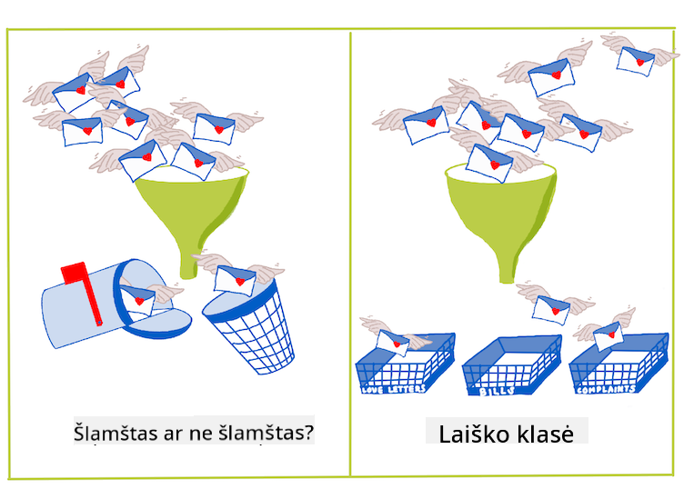
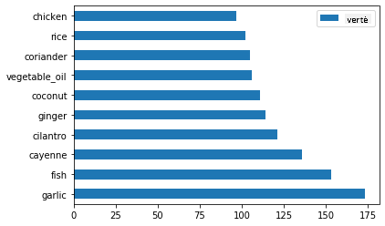
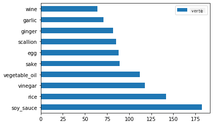
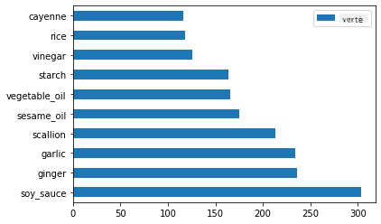
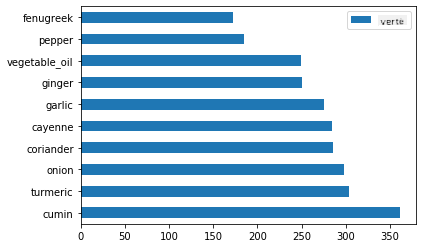
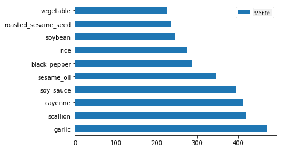

<!--
CO_OP_TRANSLATOR_METADATA:
{
  "original_hash": "76438ce4e5d48982d48f1b55c981caac",
  "translation_date": "2025-09-03T18:12:31+00:00",
  "source_file": "4-Classification/1-Introduction/README.md",
  "language_code": "lt"
}
-->
# Įvadas į klasifikaciją

Šiose keturiose pamokose tyrinėsime vieną iš pagrindinių klasikinio mašininio mokymosi sričių – _klasifikaciją_. Naudosime įvairius klasifikacijos algoritmus su duomenų rinkiniu apie nuostabią Azijos ir Indijos virtuvių įvairovę. Tikimės, kad esate alkani!


> Švęskime pan-Azijos virtuves šiose pamokose! Vaizdas sukurtas [Jen Looper](https://twitter.com/jenlooper)

Klasifikacija yra [prižiūrimo mokymosi](https://wikipedia.org/wiki/Supervised_learning) forma, kuri turi daug bendro su regresijos metodais. Jei mašininis mokymasis yra apie vertybių ar pavadinimų numatymą naudojant duomenų rinkinius, tada klasifikacija paprastai skirstoma į dvi grupes: _dvejetainė klasifikacija_ ir _daugiaklasė klasifikacija_.

[](https://youtu.be/eg8DJYwdMyg "Įvadas į klasifikaciją")

> 🎥 Spustelėkite aukščiau esantį vaizdą, kad peržiūrėtumėte vaizdo įrašą: MIT profesorius John Guttag pristato klasifikaciją

Prisiminkite:

- **Linijinė regresija** padėjo numatyti ryšius tarp kintamųjų ir tiksliai prognozuoti, kur naujas duomenų taškas pateks santykyje su ta linija. Pavyzdžiui, galėjote numatyti, _kokia bus moliūgo kaina rugsėjį, palyginti su gruodžiu_.
- **Logistinė regresija** padėjo atrasti „dvejetaines kategorijas“: esant tam tikrai kainai, _ar šis moliūgas yra oranžinis, ar neoranžinis_?

Klasifikacija naudoja įvairius algoritmus, kad nustatytų kitus būdus, kaip priskirti duomenų tašką tam tikrai etiketei ar klasei. Dirbkime su šiais virtuvės duomenimis ir pažiūrėkime, ar, stebėdami ingredientų grupę, galime nustatyti jų kilmės virtuvę.

## [Prieš paskaitą skirtas testas](https://gray-sand-07a10f403.1.azurestaticapps.net/quiz/19/)

> ### [Ši pamoka taip pat prieinama R kalba!](../../../../4-Classification/1-Introduction/solution/R/lesson_10.html)

### Įvadas

Klasifikacija yra viena iš pagrindinių mašininio mokymosi tyrėjo ir duomenų mokslininko veiklų. Nuo paprastos dvejetainės vertės klasifikacijos („ar šis el. laiškas yra šlamštas, ar ne?“) iki sudėtingos vaizdų klasifikacijos ir segmentavimo naudojant kompiuterinį matymą – visada naudinga sugebėti rūšiuoti duomenis į klases ir užduoti jiems klausimus.

Moksliniu požiūriu, jūsų klasifikacijos metodas sukuria prognozavimo modelį, kuris leidžia susieti įvesties kintamuosius su išvesties kintamaisiais.



> Dvejetainės ir daugiaklasės problemos, kurias sprendžia klasifikacijos algoritmai. Infografikas sukurtas [Jen Looper](https://twitter.com/jenlooper)

Prieš pradėdami duomenų valymo, vizualizavimo ir paruošimo ML užduotims procesą, sužinokime šiek tiek daugiau apie įvairius būdus, kaip mašininis mokymasis gali būti naudojamas duomenims klasifikuoti.

Klasifikacija, kilusi iš [statistikos](https://wikipedia.org/wiki/Statistical_classification), naudoja tokias ypatybes kaip `smoker`, `weight` ir `age`, kad nustatytų _tikimybę susirgti X liga_. Kaip prižiūrimo mokymosi technika, panaši į anksčiau atliktas regresijos užduotis, jūsų duomenys yra pažymėti, o ML algoritmai naudoja tuos žymenis, kad klasifikuotų ir prognozuotų duomenų rinkinio klases (arba „ypatybes“) ir priskirtų jas grupei ar rezultatui.

✅ Pagalvokite apie duomenų rinkinį apie virtuves. Ką galėtų atsakyti daugiaklasis modelis? Ką galėtų atsakyti dvejetainis modelis? O jei norėtumėte nustatyti, ar tam tikra virtuvė greičiausiai naudoja ožragę? O jei norėtumėte sužinoti, ar, gavę dovanų maišelį su žvaigždiniu anyžiumi, artišokais, žiediniais kopūstais ir krienais, galėtumėte sukurti tipišką indišką patiekalą?

[](https://youtu.be/GuTeDbaNoEU "Beprotiški paslaptingi krepšeliai")

> 🎥 Spustelėkite aukščiau esantį vaizdą, kad peržiūrėtumėte vaizdo įrašą. Visa laidos „Chopped“ esmė yra „paslaptingas krepšelis“, kuriame šefai turi pagaminti patiekalą iš atsitiktinių ingredientų. Tikrai ML modelis būtų padėjęs!

## Sveiki, „klasifikatoriau“

Klausimas, kurį norime užduoti apie šį virtuvių duomenų rinkinį, iš tikrųjų yra **daugiaklasis klausimas**, nes turime keletą galimų nacionalinių virtuvių, su kuriomis galime dirbti. Atsižvelgiant į ingredientų rinkinį, kuriai iš šių daugelio klasių duomenys priklausys?

Scikit-learn siūlo keletą skirtingų algoritmų, kuriuos galima naudoti duomenims klasifikuoti, priklausomai nuo problemos, kurią norite išspręsti. Kitose dviejose pamokose sužinosite apie keletą šių algoritmų.

## Užduotis – išvalykite ir subalansuokite savo duomenis

Pirmoji užduotis prieš pradedant šį projektą yra išvalyti ir **subalansuoti** savo duomenis, kad gautumėte geresnius rezultatus. Pradėkite nuo tuščio _notebook.ipynb_ failo, esančio šio aplanko šaknyje.

Pirmiausia reikia įdiegti [imblearn](https://imbalanced-learn.org/stable/). Tai yra Scikit-learn paketas, kuris leis geriau subalansuoti duomenis (apie šią užduotį sužinosite netrukus).

1. Norėdami įdiegti `imblearn`, paleiskite `pip install`, kaip parodyta:

    ```python
    pip install imblearn
    ```

1. Importuokite reikalingus paketus, kad galėtumėte importuoti savo duomenis ir juos vizualizuoti, taip pat importuokite `SMOTE` iš `imblearn`.

    ```python
    import pandas as pd
    import matplotlib.pyplot as plt
    import matplotlib as mpl
    import numpy as np
    from imblearn.over_sampling import SMOTE
    ```

    Dabar esate pasiruošę importuoti duomenis.

1. Kitas žingsnis – importuoti duomenis:

    ```python
    df  = pd.read_csv('../data/cuisines.csv')
    ```

   Naudojant `read_csv()` bus perskaitytas csv failo _cusines.csv_ turinys ir patalpintas į kintamąjį `df`.

1. Patikrinkite duomenų formą:

    ```python
    df.head()
    ```

   Pirmosios penkios eilutės atrodo taip:

    ```output
    |     | Unnamed: 0 | cuisine | almond | angelica | anise | anise_seed | apple | apple_brandy | apricot | armagnac | ... | whiskey | white_bread | white_wine | whole_grain_wheat_flour | wine | wood | yam | yeast | yogurt | zucchini |
    | --- | ---------- | ------- | ------ | -------- | ----- | ---------- | ----- | ------------ | ------- | -------- | --- | ------- | ----------- | ---------- | ----------------------- | ---- | ---- | --- | ----- | ------ | -------- |
    | 0   | 65         | indian  | 0      | 0        | 0     | 0          | 0     | 0            | 0       | 0        | ... | 0       | 0           | 0          | 0                       | 0    | 0    | 0   | 0     | 0      | 0        |
    | 1   | 66         | indian  | 1      | 0        | 0     | 0          | 0     | 0            | 0       | 0        | ... | 0       | 0           | 0          | 0                       | 0    | 0    | 0   | 0     | 0      | 0        |
    | 2   | 67         | indian  | 0      | 0        | 0     | 0          | 0     | 0            | 0       | 0        | ... | 0       | 0           | 0          | 0                       | 0    | 0    | 0   | 0     | 0      | 0        |
    | 3   | 68         | indian  | 0      | 0        | 0     | 0          | 0     | 0            | 0       | 0        | ... | 0       | 0           | 0          | 0                       | 0    | 0    | 0   | 0     | 0      | 0        |
    | 4   | 69         | indian  | 0      | 0        | 0     | 0          | 0     | 0            | 0       | 0        | ... | 0       | 0           | 0          | 0                       | 0    | 0    | 0   | 0     | 1      | 0        |
    ```

1. Gaukite informacijos apie šiuos duomenis, iškviesdami `info()`:

    ```python
    df.info()
    ```

    Jūsų rezultatas atrodo taip:

    ```output
    <class 'pandas.core.frame.DataFrame'>
    RangeIndex: 2448 entries, 0 to 2447
    Columns: 385 entries, Unnamed: 0 to zucchini
    dtypes: int64(384), object(1)
    memory usage: 7.2+ MB
    ```

## Užduotis – sužinokite apie virtuves

Dabar darbas tampa įdomesnis. Sužinokime duomenų pasiskirstymą pagal virtuves.

1. Atvaizduokite duomenis stulpeliais, iškviesdami `barh()`:

    ```python
    df.cuisine.value_counts().plot.barh()
    ```

    

    Yra ribotas virtuvių skaičius, tačiau duomenų pasiskirstymas yra netolygus. Galite tai ištaisyti! Prieš tai darydami, tyrinėkite šiek tiek daugiau.

1. Sužinokite, kiek duomenų yra kiekvienai virtuvei, ir išspausdinkite:

    ```python
    thai_df = df[(df.cuisine == "thai")]
    japanese_df = df[(df.cuisine == "japanese")]
    chinese_df = df[(df.cuisine == "chinese")]
    indian_df = df[(df.cuisine == "indian")]
    korean_df = df[(df.cuisine == "korean")]
    
    print(f'thai df: {thai_df.shape}')
    print(f'japanese df: {japanese_df.shape}')
    print(f'chinese df: {chinese_df.shape}')
    print(f'indian df: {indian_df.shape}')
    print(f'korean df: {korean_df.shape}')
    ```

    Rezultatas atrodo taip:

    ```output
    thai df: (289, 385)
    japanese df: (320, 385)
    chinese df: (442, 385)
    indian df: (598, 385)
    korean df: (799, 385)
    ```

## Ingredientų atradimas

Dabar galite gilintis į duomenis ir sužinoti, kokie yra tipiški ingredientai kiekvienai virtuvei. Turėtumėte pašalinti pasikartojančius duomenis, kurie sukelia painiavą tarp virtuvių, todėl sužinokime apie šią problemą.

1. Sukurkite funkciją `create_ingredient()` Python kalba, kad sukurtumėte ingredientų duomenų rėmelį. Ši funkcija pradės pašalindama nenaudingą stulpelį ir rūšiuos ingredientus pagal jų skaičių:

    ```python
    def create_ingredient_df(df):
        ingredient_df = df.T.drop(['cuisine','Unnamed: 0']).sum(axis=1).to_frame('value')
        ingredient_df = ingredient_df[(ingredient_df.T != 0).any()]
        ingredient_df = ingredient_df.sort_values(by='value', ascending=False,
        inplace=False)
        return ingredient_df
    ```

   Dabar galite naudoti šią funkciją, kad gautumėte idėją apie dešimt populiariausių ingredientų pagal virtuvę.

1. Iškvieskite `create_ingredient()` ir atvaizduokite, iškviesdami `barh()`:

    ```python
    thai_ingredient_df = create_ingredient_df(thai_df)
    thai_ingredient_df.head(10).plot.barh()
    ```

    

1. Padarykite tą patį japonų duomenims:

    ```python
    japanese_ingredient_df = create_ingredient_df(japanese_df)
    japanese_ingredient_df.head(10).plot.barh()
    ```

    

1. Dabar kinų ingredientams:

    ```python
    chinese_ingredient_df = create_ingredient_df(chinese_df)
    chinese_ingredient_df.head(10).plot.barh()
    ```

    

1. Atvaizduokite indiškus ingredientus:

    ```python
    indian_ingredient_df = create_ingredient_df(indian_df)
    indian_ingredient_df.head(10).plot.barh()
    ```

    

1. Galiausiai atvaizduokite korėjietiškus ingredientus:

    ```python
    korean_ingredient_df = create_ingredient_df(korean_df)
    korean_ingredient_df.head(10).plot.barh()
    ```

    

1. Dabar pašalinkite dažniausiai pasitaikančius ingredientus, kurie sukelia painiavą tarp skirtingų virtuvių, iškviesdami `drop()`:

   Visi mėgsta ryžius, česnaką ir imbierą!

    ```python
    feature_df= df.drop(['cuisine','Unnamed: 0','rice','garlic','ginger'], axis=1)
    labels_df = df.cuisine #.unique()
    feature_df.head()
    ```

## Subalansuokite duomenų rinkinį

Dabar, kai išvalėte duomenis, naudokite [SMOTE](https://imbalanced-learn.org/dev/references/generated/imblearn.over_sampling.SMOTE.html) – „Sintetinis mažumos perėmimo metodas“ – kad juos subalansuotumėte.

1. Iškvieskite `fit_resample()`, ši strategija generuoja naujus pavyzdžius interpoliacijos būdu.

    ```python
    oversample = SMOTE()
    transformed_feature_df, transformed_label_df = oversample.fit_resample(feature_df, labels_df)
    ```

    Subalansavę duomenis, gausite geresnius rezultatus klasifikuodami juos. Pagalvokite apie dvejetainę klasifikaciją. Jei dauguma jūsų duomenų priklauso vienai klasei, ML modelis dažniau prognozuos tą klasę, tiesiog todėl, kad jai yra daugiau duomenų. Subalansavus duomenis, pašalinamas šis disbalansas.

1. Dabar galite patikrinti etikečių skaičių pagal ingredientą:

    ```python
    print(f'new label count: {transformed_label_df.value_counts()}')
    print(f'old label count: {df.cuisine.value_counts()}')
    ```

    Jūsų rezultatas atrodo taip:

    ```output
    new label count: korean      799
    chinese     799
    indian      799
    japanese    799
    thai        799
    Name: cuisine, dtype: int64
    old label count: korean      799
    indian      598
    chinese     442
    japanese    320
    thai        289
    Name: cuisine, dtype: int64
    ```

    Duomenys yra švarūs, subalansuoti ir labai skanūs!

1. Paskutinis žingsnis – išsaugoti subalansuotus duomenis, įskaitant etiketes ir ypatybes, naujame duomenų rėmelyje, kurį galima eksportuoti į failą:

    ```python
    transformed_df = pd.concat([transformed_label_df,transformed_feature_df],axis=1, join='outer')
    ```

1. Galite dar kartą peržiūrėti duomenis naudodami `transformed_df.head()` ir `transformed_df.info()`. Išsaugokite šių duomenų kopiją, kad galėtumėte naudoti būsimose pamokose:

    ```python
    transformed_df.head()
    transformed_df.info()
    transformed_df.to_csv("../data/cleaned_cuisines.csv")
    ```

    Šis naujas CSV failas dabar yra pagrindiniame duomenų aplanke.

---

## 🚀Iššūkis

Ši mokymo programa apima keletą įdomių duomenų rinkinių. Peržiūrėkite `data` aplankus ir pažiūrėkite, ar kuriuose nors yra duomenų rinkinių, tinkamų dvejetainiam arba daugiaklasiam klasifikavimui? Kokius klausimus užduotumėte šiam duomenų rinkiniui?

## [Po paskaitos skirtas testas](https://gray-sand-07a10f403.1.azurestaticapps.net/quiz/20/)

## Peržiūra ir savarankiškas mokymasis

Išnagrinėkite SMOTE API. Kokiais atvejais jis geriausiai naudojamas? Kokias problemas jis sprendžia?

## Užduotis 

[Susipažinkite su klasifikacijos metodais](assignment.md)

---

**Atsakomybės apribojimas**:  
Šis dokumentas buvo išverstas naudojant AI vertimo paslaugą [Co-op Translator](https://github.com/Azure/co-op-translator). Nors siekiame tikslumo, prašome atkreipti dėmesį, kad automatiniai vertimai gali turėti klaidų ar netikslumų. Originalus dokumentas jo gimtąja kalba turėtų būti laikomas autoritetingu šaltiniu. Kritinei informacijai rekomenduojama naudoti profesionalų žmogaus vertimą. Mes neprisiimame atsakomybės už nesusipratimus ar klaidingus interpretavimus, atsiradusius dėl šio vertimo naudojimo.