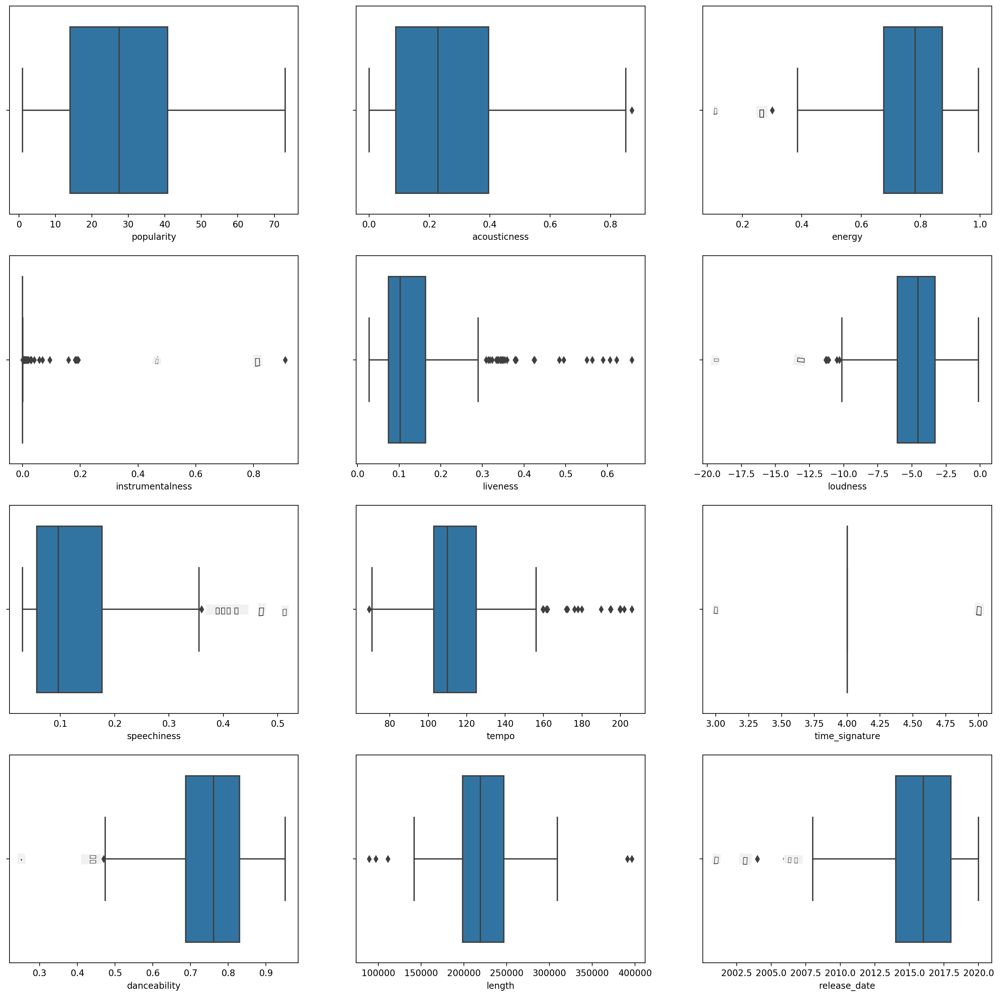
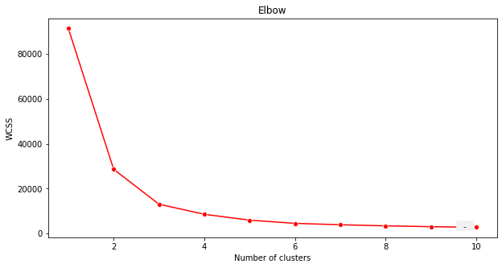
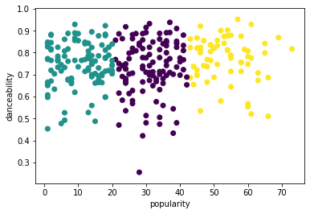
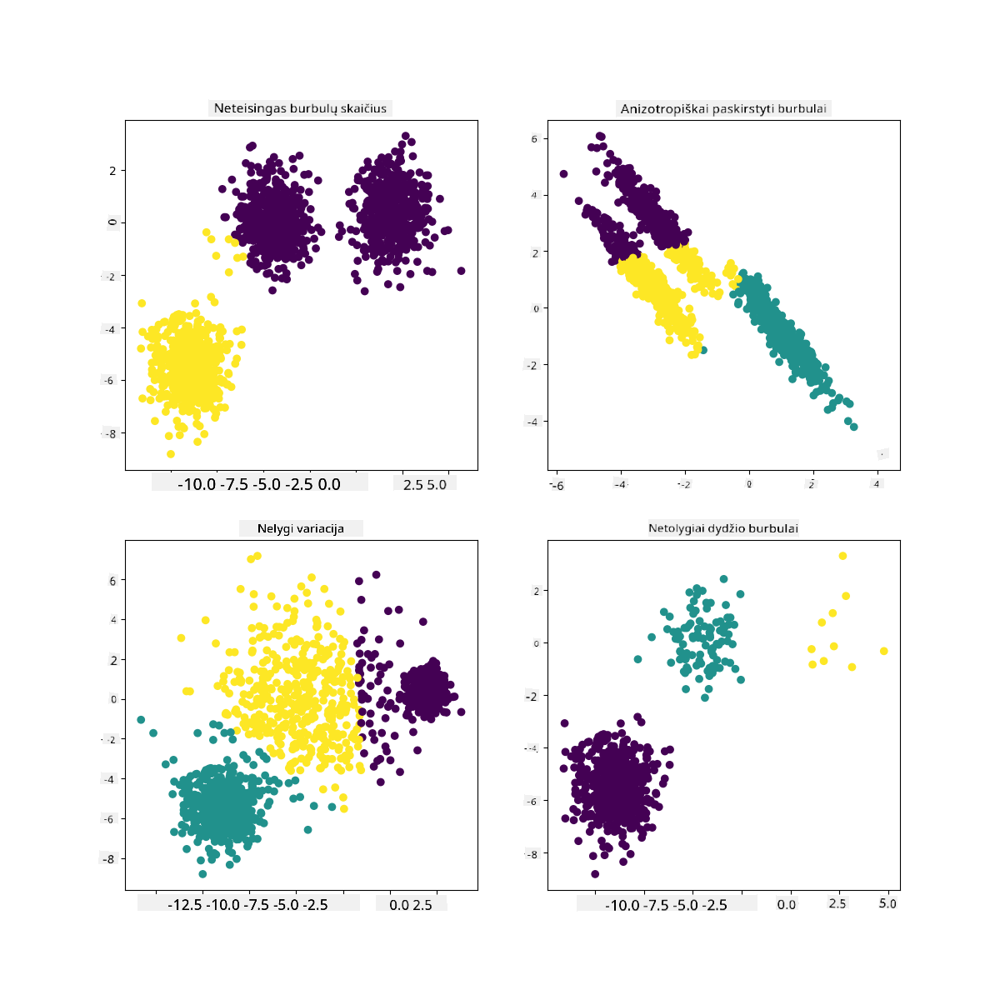

<!--
CO_OP_TRANSLATOR_METADATA:
{
  "original_hash": "085d571097d201810720df4cd379f8c2",
  "translation_date": "2025-09-03T17:17:09+00:00",
  "source_file": "5-Clustering/2-K-Means/README.md",
  "language_code": "lt"
}
-->
# K-Means klasterizacija

## [Prieš paskaitos testą](https://gray-sand-07a10f403.1.azurestaticapps.net/quiz/29/)

Šioje pamokoje išmoksite kurti klasterius naudodami Scikit-learn ir anksčiau importuotą Nigerijos muzikos duomenų rinkinį. Aptarsime K-Means klasterizacijos pagrindus. Atminkite, kad, kaip sužinojote ankstesnėje pamokoje, yra daug būdų dirbti su klasteriais, o pasirinktas metodas priklauso nuo jūsų duomenų. Išbandysime K-Means, nes tai yra dažniausiai naudojama klasterizacijos technika. Pradėkime!

Sąvokos, kurias išmoksite:

- Silueto įvertinimas
- Alkūnės metodas
- Inercija
- Dispersija

## Įvadas

[K-Means klasterizacija](https://wikipedia.org/wiki/K-means_clustering) yra metodas, kilęs iš signalų apdorojimo srities. Jis naudojamas duomenų grupėms padalyti ir suskirstyti į 'k' klasterius, remiantis stebėjimų serija. Kiekvienas stebėjimas veikia taip, kad duomenų taškas būtų priskirtas artimiausiam 'vidurkiui' arba klasterio centrui.

Klasteriai gali būti vizualizuojami kaip [Voronoi diagramos](https://wikipedia.org/wiki/Voronoi_diagram), kurios apima tašką (arba 'sėklą') ir atitinkamą regioną.


> Infografika sukūrė [Jen Looper](https://twitter.com/jenlooper)

K-Means klasterizacijos procesas [vykdomas trijų žingsnių procese](https://scikit-learn.org/stable/modules/clustering.html#k-means):

1. Algoritmas pasirenka k skaičių centrinių taškų, imdamas mėginius iš duomenų rinkinio. Po to jis kartoja:
    1. Priskiria kiekvieną mėginį artimiausiam centroidui.
    2. Sukuria naujus centroidus, apskaičiuodamas visų mėginių, priskirtų ankstesniems centroidams, vidutinę vertę.
    3. Tada apskaičiuoja skirtumą tarp naujų ir senų centroidų ir kartoja, kol centroidai stabilizuojasi.

Vienas K-Means metodo trūkumas yra tas, kad reikia nustatyti 'k', tai yra centrinių taškų skaičių. Laimei, 'alkūnės metodas' padeda nustatyti gerą pradinę 'k' vertę. Netrukus tai išbandysite.

## Būtinos sąlygos

Dirbsite su šios pamokos [_notebook.ipynb_](https://github.com/microsoft/ML-For-Beginners/blob/main/5-Clustering/2-K-Means/notebook.ipynb) failu, kuriame yra duomenų importavimas ir preliminarus valymas, atliktas ankstesnėje pamokoje.

## Pratimai - pasiruošimas

Pradėkite dar kartą peržiūrėdami dainų duomenis.

1. Sukurkite dėžutės diagramą, iškviesdami `boxplot()` kiekvienai stulpeliui:

    ```python
    plt.figure(figsize=(20,20), dpi=200)
    
    plt.subplot(4,3,1)
    sns.boxplot(x = 'popularity', data = df)
    
    plt.subplot(4,3,2)
    sns.boxplot(x = 'acousticness', data = df)
    
    plt.subplot(4,3,3)
    sns.boxplot(x = 'energy', data = df)
    
    plt.subplot(4,3,4)
    sns.boxplot(x = 'instrumentalness', data = df)
    
    plt.subplot(4,3,5)
    sns.boxplot(x = 'liveness', data = df)
    
    plt.subplot(4,3,6)
    sns.boxplot(x = 'loudness', data = df)
    
    plt.subplot(4,3,7)
    sns.boxplot(x = 'speechiness', data = df)
    
    plt.subplot(4,3,8)
    sns.boxplot(x = 'tempo', data = df)
    
    plt.subplot(4,3,9)
    sns.boxplot(x = 'time_signature', data = df)
    
    plt.subplot(4,3,10)
    sns.boxplot(x = 'danceability', data = df)
    
    plt.subplot(4,3,11)
    sns.boxplot(x = 'length', data = df)
    
    plt.subplot(4,3,12)
    sns.boxplot(x = 'release_date', data = df)
    ```

    Šie duomenys yra šiek tiek triukšmingi: stebėdami kiekvieną stulpelį kaip dėžutės diagramą, galite matyti anomalijas.

    

Galėtumėte peržiūrėti duomenų rinkinį ir pašalinti šias anomalijas, tačiau tai padarytų duomenis gana minimaliais.

1. Šiuo metu pasirinkite, kuriuos stulpelius naudosite klasterizacijos pratyboms. Pasirinkite tuos, kurie turi panašius diapazonus, ir užkoduokite `artist_top_genre` stulpelį kaip skaitinius duomenis:

    ```python
    from sklearn.preprocessing import LabelEncoder
    le = LabelEncoder()
    
    X = df.loc[:, ('artist_top_genre','popularity','danceability','acousticness','loudness','energy')]
    
    y = df['artist_top_genre']
    
    X['artist_top_genre'] = le.fit_transform(X['artist_top_genre'])
    
    y = le.transform(y)
    ```

1. Dabar turite nuspręsti, kiek klasterių taikysite. Žinote, kad yra 3 dainų žanrai, kuriuos išskyrėme iš duomenų rinkinio, todėl pabandykime 3:

    ```python
    from sklearn.cluster import KMeans
    
    nclusters = 3 
    seed = 0
    
    km = KMeans(n_clusters=nclusters, random_state=seed)
    km.fit(X)
    
    # Predict the cluster for each data point
    
    y_cluster_kmeans = km.predict(X)
    y_cluster_kmeans
    ```

Matote išspausdintą masyvą su numatytais klasteriais (0, 1 arba 2) kiekvienai duomenų rėmelio eilutei.

1. Naudokite šį masyvą, kad apskaičiuotumėte 'silueto įvertinimą':

    ```python
    from sklearn import metrics
    score = metrics.silhouette_score(X, y_cluster_kmeans)
    score
    ```

## Silueto įvertinimas

Ieškokite silueto įvertinimo, artimo 1. Šis įvertinimas svyruoja nuo -1 iki 1, ir jei įvertinimas yra 1, klasteris yra tankus ir gerai atskirtas nuo kitų klasterių. Vertė, artima 0, reiškia persidengiančius klasterius, kurių mėginiai yra labai arti kaimyninių klasterių sprendimo ribos. [(Šaltinis)](https://dzone.com/articles/kmeans-silhouette-score-explained-with-python-exam)

Mūsų įvertinimas yra **.53**, taigi vidutinis. Tai rodo, kad mūsų duomenys nėra ypač tinkami šio tipo klasterizacijai, tačiau tęskime.

### Pratimai - modelio kūrimas

1. Importuokite `KMeans` ir pradėkite klasterizacijos procesą.

    ```python
    from sklearn.cluster import KMeans
    wcss = []
    
    for i in range(1, 11):
        kmeans = KMeans(n_clusters = i, init = 'k-means++', random_state = 42)
        kmeans.fit(X)
        wcss.append(kmeans.inertia_)
    
    ```

    Čia yra keletas dalių, kurias verta paaiškinti.

    > 🎓 diapazonas: Tai yra klasterizacijos proceso iteracijos.

    > 🎓 random_state: "Nustato atsitiktinių skaičių generavimą centroidų inicializavimui." [Šaltinis](https://scikit-learn.org/stable/modules/generated/sklearn.cluster.KMeans.html#sklearn.cluster.KMeans)

    > 🎓 WCSS: "klasterio viduje esančių kvadratų suma" matuoja vidutinį kvadratinį atstumą visų taškų klasteryje iki klasterio centro. [Šaltinis](https://medium.com/@ODSC/unsupervised-learning-evaluating-clusters-bd47eed175ce).

    > 🎓 Inercija: K-Means algoritmai bando pasirinkti centroidus, kad sumažintų 'inerciją', "matą, kaip viduje nuoseklūs yra klasteriai." [Šaltinis](https://scikit-learn.org/stable/modules/clustering.html). Vertė pridedama prie wcss kintamojo kiekvienoje iteracijoje.

    > 🎓 k-means++: [Scikit-learn](https://scikit-learn.org/stable/modules/clustering.html#k-means) galite naudoti 'k-means++' optimizaciją, kuri "inicializuoja centroidus taip, kad jie (paprastai) būtų toli vienas nuo kito, todėl rezultatai greičiausiai bus geresni nei atsitiktinė inicializacija."

### Alkūnės metodas

Anksčiau spėjote, kad, kadangi taikote 3 dainų žanrus, turėtumėte pasirinkti 3 klasterius. Bet ar tai tiesa?

1. Naudokite 'alkūnės metodą', kad įsitikintumėte.

    ```python
    plt.figure(figsize=(10,5))
    sns.lineplot(x=range(1, 11), y=wcss, marker='o', color='red')
    plt.title('Elbow')
    plt.xlabel('Number of clusters')
    plt.ylabel('WCSS')
    plt.show()
    ```

    Naudokite `wcss` kintamąjį, kurį sukūrėte ankstesniame žingsnyje, kad sukurtumėte diagramą, rodančią, kur yra 'alkūnės' lenkimas, kuris nurodo optimalų klasterių skaičių. Galbūt tai **tikrai** yra 3!

    

## Pratimai - klasterių vaizdavimas

1. Išbandykite procesą dar kartą, šį kartą nustatydami tris klasterius, ir pavaizduokite klasterius kaip sklaidos diagramą:

    ```python
    from sklearn.cluster import KMeans
    kmeans = KMeans(n_clusters = 3)
    kmeans.fit(X)
    labels = kmeans.predict(X)
    plt.scatter(df['popularity'],df['danceability'],c = labels)
    plt.xlabel('popularity')
    plt.ylabel('danceability')
    plt.show()
    ```

1. Patikrinkite modelio tikslumą:

    ```python
    labels = kmeans.labels_
    
    correct_labels = sum(y == labels)
    
    print("Result: %d out of %d samples were correctly labeled." % (correct_labels, y.size))
    
    print('Accuracy score: {0:0.2f}'. format(correct_labels/float(y.size)))
    ```

    Šio modelio tikslumas nėra labai geras, o klasterių forma suteikia užuominą, kodėl.

    

    Šie duomenys yra per daug nesubalansuoti, per mažai koreliuoti, o stulpelių reikšmių variacija yra per didelė, kad klasteriai būtų gerai suformuoti. Iš tiesų, klasteriai, kurie susiformuoja, tikriausiai yra stipriai paveikti arba iškreipti trijų žanrų kategorijų, kurias apibrėžėme aukščiau. Tai buvo mokymosi procesas!

    Scikit-learn dokumentacijoje galite matyti, kad modelis, kaip šis, su klasteriais, kurie nėra gerai apibrėžti, turi 'dispersijos' problemą:

    
    > Infografika iš Scikit-learn

## Dispersija

Dispersija apibrėžiama kaip "vidutinė kvadratinių skirtumų nuo vidurkio vertė" [(Šaltinis)](https://www.mathsisfun.com/data/standard-deviation.html). Šio klasterizacijos problemos kontekste tai reiškia, kad mūsų duomenų rinkinio skaičiai linkę per daug nukrypti nuo vidurkio.

✅ Tai puikus momentas pagalvoti apie visus būdus, kaip galėtumėte ištaisyti šią problemą. Ar verta dar labiau koreguoti duomenis? Naudoti kitus stulpelius? Išbandyti kitą algoritmą? Užuomina: Pabandykite [normalizuoti duomenis](https://www.mygreatlearning.com/blog/learning-data-science-with-k-means-clustering/) ir išbandyti kitus stulpelius.

> Pabandykite šį '[dispersijos skaičiuoklę](https://www.calculatorsoup.com/calculators/statistics/variance-calculator.php)', kad geriau suprastumėte šią sąvoką.

---

## 🚀Iššūkis

Praleiskite šiek tiek laiko su šiuo užrašų knygeliu, koreguodami parametrus. Ar galite pagerinti modelio tikslumą, dar labiau išvalydami duomenis (pvz., pašalindami anomalijas)? Galite naudoti svorius, kad suteiktumėte daugiau reikšmės tam tikriems duomenų mėginiams. Ką dar galite padaryti, kad sukurtumėte geresnius klasterius?

Užuomina: Pabandykite normalizuoti duomenis. Užrašų knygelėje yra komentaruose pateiktas kodas, kuris prideda standartinį mastelio keitimą, kad duomenų stulpeliai būtų panašesni pagal diapazoną. Pastebėsite, kad nors silueto įvertinimas sumažėja, 'alkūnės' grafiko lenkimas tampa lygesnis. Taip yra todėl, kad paliekant duomenis nenormalizuotus, duomenys su mažesne dispersija turi didesnę įtaką. Skaitykite daugiau apie šią problemą [čia](https://stats.stackexchange.com/questions/21222/are-mean-normalization-and-feature-scaling-needed-for-k-means-clustering/21226#21226).

## [Po paskaitos testą](https://gray-sand-07a10f403.1.azurestaticapps.net/quiz/30/)

## Apžvalga ir savarankiškas mokymasis

Pažvelkite į K-Means simuliatorių [tokį kaip šis](https://user.ceng.metu.edu.tr/~akifakkus/courses/ceng574/k-means/). Galite naudoti šį įrankį, kad vizualizuotumėte mėginių duomenų taškus ir nustatytumėte jų centroidus. Galite redaguoti duomenų atsitiktinumą, klasterių skaičių ir centroidų skaičių. Ar tai padeda jums suprasti, kaip duomenys gali būti grupuojami?

Taip pat peržiūrėkite [šį Stanfordo K-Means vadovą](https://stanford.edu/~cpiech/cs221/handouts/kmeans.html).

## Užduotis

[Išbandykite skirtingus klasterizacijos metodus](assignment.md)

---

**Atsakomybės apribojimas**:  
Šis dokumentas buvo išverstas naudojant AI vertimo paslaugą [Co-op Translator](https://github.com/Azure/co-op-translator). Nors siekiame tikslumo, prašome atkreipti dėmesį, kad automatiniai vertimai gali turėti klaidų ar netikslumų. Originalus dokumentas jo gimtąja kalba turėtų būti laikomas autoritetingu šaltiniu. Kritinei informacijai rekomenduojama profesionali žmogaus vertimo paslauga. Mes neprisiimame atsakomybės už nesusipratimus ar klaidingus interpretavimus, atsiradusius naudojant šį vertimą.