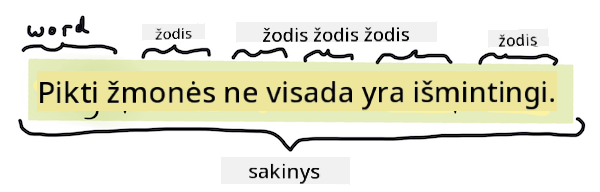
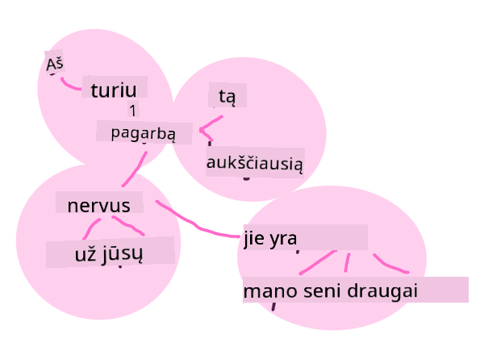
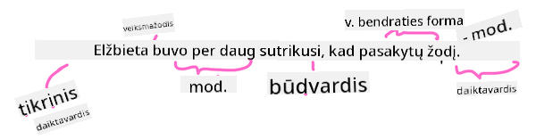

<!--
CO_OP_TRANSLATOR_METADATA:
{
  "original_hash": "6534e145d52a3890590d27be75386e5d",
  "translation_date": "2025-09-03T18:46:27+00:00",
  "source_file": "6-NLP/2-Tasks/README.md",
  "language_code": "lt"
}
-->
# Dažniausios natūralios kalbos apdorojimo užduotys ir technikos

Daugumai *natūralios kalbos apdorojimo* užduočių tekstas, kurį reikia apdoroti, turi būti suskaidytas, išanalizuotas, o rezultatai saugomi arba lyginami su taisyklėmis ir duomenų rinkiniais. Šios užduotys leidžia programuotojui nustatyti teksto _prasmę_, _ketinimą_ arba tiesiog _terminų ir žodžių dažnį_.

## [Prieš paskaitą: testas](https://gray-sand-07a10f403.1.azurestaticapps.net/quiz/33/)

Pažvelkime į dažniausiai naudojamas technikas tekstui apdoroti. Kartu su mašininio mokymosi metodais šios technikos padeda efektyviai analizuoti didelius tekstų kiekius. Tačiau prieš taikant ML šioms užduotims, pirmiausia supraskime problemas, su kuriomis susiduria NLP specialistai.

## NLP būdingos užduotys

Yra įvairių būdų analizuoti tekstą, su kuriuo dirbate. Yra užduočių, kurias galite atlikti, ir per šias užduotis galite suprasti tekstą bei padaryti išvadas. Paprastai šios užduotys atliekamos nuosekliai.

### Tokenizacija

Tikriausiai pirmas dalykas, kurį dauguma NLP algoritmų turi padaryti, yra suskaidyti tekstą į tokenus arba žodžius. Nors tai skamba paprastai, skyrybos ženklų ir skirtingų kalbų žodžių bei sakinių ribų apskaita gali būti sudėtinga. Gali tekti naudoti įvairius metodus, kad nustatytumėte ribas.


> Tokenizuojamas sakinys iš **Puikybė ir prietarai**. Infografiką sukūrė [Jen Looper](https://twitter.com/jenlooper)

### Įterpimai

[Žodžių įterpimai](https://wikipedia.org/wiki/Word_embedding) yra būdas konvertuoti tekstinius duomenis į skaitinę formą. Įterpimai atliekami taip, kad žodžiai, turintys panašią reikšmę arba dažnai vartojami kartu, būtų grupuojami.


> "Aš labai gerbiu jūsų nervus, jie yra mano seni draugai." - Žodžių įterpimai sakiniui iš **Puikybė ir prietarai**. Infografiką sukūrė [Jen Looper](https://twitter.com/jenlooper)

✅ Išbandykite [šį įdomų įrankį](https://projector.tensorflow.org/), kad eksperimentuotumėte su žodžių įterpimais. Paspaudus ant vieno žodžio, rodomos panašių žodžių grupės: 'žaislas' grupuojasi su 'disney', 'lego', 'playstation' ir 'konsolė'.

### Analizė ir kalbos dalių žymėjimas

Kiekvienas tokenizuotas žodis gali būti pažymėtas kaip kalbos dalis – daiktavardis, veiksmažodis ar būdvardis. Sakinys `greitas raudonas lapė peršoko per tingų rudą šunį` gali būti pažymėtas kaip lapė = daiktavardis, peršoko = veiksmažodis.



> Analizuojamas sakinys iš **Puikybė ir prietarai**. Infografiką sukūrė [Jen Looper](https://twitter.com/jenlooper)

Analizė yra žodžių tarpusavio ryšių atpažinimas sakinyje – pavyzdžiui, `greitas raudonas lapė peršoko` yra būdvardis-daiktavardis-veiksmažodis seka, kuri yra atskirta nuo `tingus rudas šuo` sekos.

### Žodžių ir frazių dažniai

Naudinga procedūra analizuojant didelį tekstų kiekį yra sukurti žodžių ar frazių, kurios jus domina, žodyną ir nustatyti, kaip dažnai jos pasirodo. Frazė `greitas raudonas lapė peršoko per tingų rudą šunį` turi žodžio `the` dažnį 2.

Pažvelkime į pavyzdinį tekstą, kuriame skaičiuojame žodžių dažnį. Rudyard Kipling eilėraštis „The Winners“ turi šią eilutę:

```output
What the moral? Who rides may read.
When the night is thick and the tracks are blind
A friend at a pinch is a friend, indeed,
But a fool to wait for the laggard behind.
Down to Gehenna or up to the Throne,
He travels the fastest who travels alone.
```

Kadangi frazių dažniai gali būti jautrūs arba nejautrūs didžiosioms raidėms, frazė `draugas` turi dažnį 2, `the` – 6, o `keliauja` – 2.

### N-gramos

Tekstas gali būti suskaidytas į tam tikro ilgio žodžių sekas: vieno žodžio (unigramos), dviejų žodžių (bigramos), trijų žodžių (trigramos) ar bet kokio žodžių skaičiaus (n-gramos).

Pavyzdžiui, `greitas raudonas lapė peršoko per tingų rudą šunį` su n-gramų skaičiumi 2 sukuria šias n-gramas:

1. greitas raudonas  
2. raudonas lapė  
3. lapė peršoko  
4. peršoko per  
5. per tingų  
6. tingus rudas  
7. rudas šuo  

Tai galima lengviau vizualizuoti kaip slankų langelį per sakinį. Čia pateikiama n-gramų su 3 žodžiais vizualizacija, kur n-grama paryškinta kiekviename sakinyje:

1.   <u>**greitas raudonas lapė**</u> peršoko per tingų rudą šunį  
2.   greitas **<u>raudonas lapė peršoko</u>** per tingų rudą šunį  
3.   greitas raudonas **<u>lapė peršoko per</u>** tingų rudą šunį  
4.   greitas raudonas lapė **<u>peršoko per tingų</u>** rudą šunį  
5.   greitas raudonas lapė peršoko **<u>per tingų rudą</u>** šunį  
6.   greitas raudonas lapė peršoko per <u>**tingų rudą šunį**</u>  


> N-gramų vertė 3: Infografiką sukūrė [Jen Looper](https://twitter.com/jenlooper)

### Daiktavardžių frazių ištraukimas

Daugumoje sakinių yra daiktavardis, kuris yra sakinio subjektas arba objektas. Anglų kalboje jis dažnai identifikuojamas kaip turintis 'a', 'an' arba 'the' prieš jį. Subjekto ar objekto identifikavimas sakinyje, ištraukiant daiktavardžių frazę, yra dažna NLP užduotis, kai bandoma suprasti sakinio prasmę.

✅ Sakinys "Aš negaliu nustatyti valandos, vietos, žvilgsnio ar žodžių, kurie padėjo pagrindą. Tai buvo per seniai. Aš buvau viduryje, kol supratau, kad pradėjau." Ar galite identifikuoti daiktavardžių frazes?

Sakinyje `greitas raudonas lapė peršoko per tingų rudą šunį` yra 2 daiktavardžių frazės: **greitas raudonas lapė** ir **tingus rudas šuo**.

### Nuotaikos analizė

Sakinys ar tekstas gali būti analizuojamas pagal nuotaiką, arba kaip *pozityvus* ar *negatyvus* jis yra. Nuotaika matuojama *poliarumu* ir *objektyvumu/subjektyvumu*. Poliarumas matuojamas nuo -1.0 iki 1.0 (negatyvus iki pozityvus), o objektyvumas nuo 0.0 iki 1.0 (labiausiai objektyvus iki labiausiai subjektyvus).

✅ Vėliau sužinosite, kad yra įvairių būdų nustatyti nuotaiką naudojant mašininį mokymąsi, tačiau vienas būdas yra turėti žodžių ir frazių sąrašą, kurias žmogaus ekspertas priskyrė pozityvioms arba negatyvioms, ir taikyti tą modelį tekstui, kad apskaičiuotumėte poliarumo balą. Ar matote, kaip tai veiktų kai kuriose situacijose, o kitose – ne taip gerai?

### Linksniavimas

Linksniavimas leidžia paimti žodį ir gauti jo vienaskaitą arba daugiskaitą.

### Lemmatizacija

*Lema* yra šakninis arba pagrindinis žodis žodžių rinkiniui, pavyzdžiui, *skrido*, *skrenda*, *skraidymas* turi lematą – veiksmažodį *skristi*.

Taip pat yra naudingų duomenų bazių NLP tyrėjams, ypač:

### WordNet

[WordNet](https://wordnet.princeton.edu/) yra žodžių, sinonimų, antonimų ir daugelio kitų detalių duomenų bazė kiekvienam žodžiui įvairiomis kalbomis. Ji yra nepaprastai naudinga, kai bandoma kurti vertimus, rašybos tikrintuvus ar bet kokio tipo kalbos įrankius.

## NLP bibliotekos

Laimei, jums nereikia kurti visų šių technikų patiems, nes yra puikių Python bibliotekų, kurios daro NLP daug prieinamesnį programuotojams, nespecializuojantiems natūralios kalbos apdorojime ar mašininio mokymosi srityje. Kitos pamokos apima daugiau pavyzdžių, tačiau čia sužinosite keletą naudingų pavyzdžių, kurie padės atlikti kitą užduotį.

### Užduotis - naudojant `TextBlob` biblioteką

Naudokime biblioteką TextBlob, nes ji turi naudingų API, skirtų šioms užduotims spręsti. TextBlob "remiasi [NLTK](https://nltk.org) ir [pattern](https://github.com/clips/pattern) pagrindais ir gerai veikia su abiem." Ji turi nemažai ML integruoto savo API.

> Pastaba: Naudingas [Greito starto](https://textblob.readthedocs.io/en/dev/quickstart.html#quickstart) vadovas yra prieinamas TextBlob ir rekomenduojamas patyrusiems Python programuotojams.

Kai bandoma identifikuoti *daiktavardžių frazes*, TextBlob siūlo kelias ištraukimo parinktis.

1. Pažvelkite į `ConllExtractor`.

    ```python
    from textblob import TextBlob
    from textblob.np_extractors import ConllExtractor
    # import and create a Conll extractor to use later 
    extractor = ConllExtractor()
    
    # later when you need a noun phrase extractor:
    user_input = input("> ")
    user_input_blob = TextBlob(user_input, np_extractor=extractor)  # note non-default extractor specified
    np = user_input_blob.noun_phrases                                    
    ```

    > Kas čia vyksta? [ConllExtractor](https://textblob.readthedocs.io/en/dev/api_reference.html?highlight=Conll#textblob.en.np_extractors.ConllExtractor) yra "Daiktavardžių frazių ištraukiklis, naudojantis ConLL-2000 mokymo korpusą." ConLL-2000 reiškia 2000 metų Konferenciją apie kompiuterinį natūralios kalbos mokymąsi. Kiekvienais metais konferencija rengė dirbtuves, skirtas sudėtingai NLP problemai spręsti, o 2000 m. tai buvo daiktavardžių frazių ištraukimas. Modelis buvo apmokytas naudojant Wall Street Journal, su "15-18 skyriais kaip mokymo duomenimis (211727 tokenų) ir 20 skyriumi kaip testavimo duomenimis (47377 tokenų)". Procedūras galite peržiūrėti [čia](https://www.clips.uantwerpen.be/conll2000/chunking/) ir [rezultatus](https://ifarm.nl/erikt/research/np-chunking.html).

### Iššūkis - tobulinkite savo botą su NLP

Ankstesnėje pamokoje sukūrėte labai paprastą klausimų ir atsakymų botą. Dabar padarykite Marvin šiek tiek empatiškesnį, analizuodami jūsų įvestį pagal nuotaiką ir pateikdami atsakymą, atitinkantį nuotaiką. Taip pat turėsite identifikuoti `daiktavardžių frazę` ir paklausti apie ją.

Jūsų žingsniai kuriant geresnį pokalbių botą:

1. Spausdinkite instrukcijas, patariančias vartotojui, kaip bendrauti su botu  
2. Pradėkite ciklą  
   1. Priimkite vartotojo įvestį  
   2. Jei vartotojas paprašė išeiti, tada išeikite  
   3. Apdorokite vartotojo įvestį ir nustatykite tinkamą nuotaikos atsakymą  
   4. Jei nuotaikoje aptinkama daiktavardžių frazė, padarykite ją daugiskaitą ir paprašykite daugiau informacijos apie tą temą  
   5. Spausdinkite atsakymą  
3. Grįžkite į 2 žingsnį  

Čia yra kodo fragmentas, skirtas nustatyti nuotaiką naudojant TextBlob. Atkreipkite dėmesį, kad yra tik keturi *nuotaikos atsako gradientai* (galite pridėti daugiau, jei norite):

```python
if user_input_blob.polarity <= -0.5:
  response = "Oh dear, that sounds bad. "
elif user_input_blob.polarity <= 0:
  response = "Hmm, that's not great. "
elif user_input_blob.polarity <= 0.5:
  response = "Well, that sounds positive. "
elif user_input_blob.polarity <= 1:
  response = "Wow, that sounds great. "
```

Čia pateikiamas pavyzdinis išvesties vadovas (vartotojo įvestis prasideda >):

```output
Hello, I am Marvin, the friendly robot.
You can end this conversation at any time by typing 'bye'
After typing each answer, press 'enter'
How are you today?
> I am ok
Well, that sounds positive. Can you tell me more?
> I went for a walk and saw a lovely cat
Well, that sounds positive. Can you tell me more about lovely cats?
> cats are the best. But I also have a cool dog
Wow, that sounds great. Can you tell me more about cool dogs?
> I have an old hounddog but he is sick
Hmm, that's not great. Can you tell me more about old hounddogs?
> bye
It was nice talking to you, goodbye!
```

Viena galimų užduoties sprendimų yra [čia](https://github.com/microsoft/ML-For-Beginners/blob/main/6-NLP/2-Tasks/solution/bot.py)

✅ Žinių patikrinimas

1. Ar manote, kad empatiški atsakymai galėtų „apgauti“ žmogų, kad jis manytų, jog botas iš tikrųjų jį supranta?  
2. Ar daiktavardžių frazės identifikavimas daro botą labiau „įtikinamą“?  
3. Kodėl daiktavardžių frazės ištraukimas iš sakinio yra naudingas dalykas?  

---

Įgyvendinkite botą iš ankstesnio žinių patikrinimo ir išbandykite jį su draugu. Ar jis gali juos apgauti? Ar galite padaryti savo botą labiau „įtikinamą“?

## 🚀Iššūkis

Paimkite užduotį iš ankstesnio žinių patikrinimo ir pabandykite ją įgyvendinti. Išbandykite botą su draugu. Ar jis gali juos apgauti? Ar galite padaryti savo botą labiau „įtikinamą“?

## [Po paskaitos: testas](https://gray-sand-07a10f403.1.azurestaticapps.net/quiz/34/)

## Apžvalga ir savarankiškas mokymasis

Kitose pamokose sužinosite daugiau apie nuotaikos analizę. Tyrinėkite šią įdomią techniką straipsniuose, tokiuose kaip šie [KDNuggets](https://www.kdnuggets.com/tag/nlp)

## Užduotis 

[Padarykite botą kalbantį](assignment.md)

---

**Atsakomybės apribojimas**:  
Šis dokumentas buvo išverstas naudojant dirbtinio intelekto vertimo paslaugą [Co-op Translator](https://github.com/Azure/co-op-translator). Nors siekiame tikslumo, atkreipiame dėmesį, kad automatiniai vertimai gali turėti klaidų ar netikslumų. Originalus dokumentas jo gimtąja kalba turėtų būti laikomas autoritetingu šaltiniu. Dėl svarbios informacijos rekomenduojame profesionalų žmogaus vertimą. Mes neprisiimame atsakomybės už nesusipratimus ar klaidingus aiškinimus, kylančius dėl šio vertimo naudojimo.