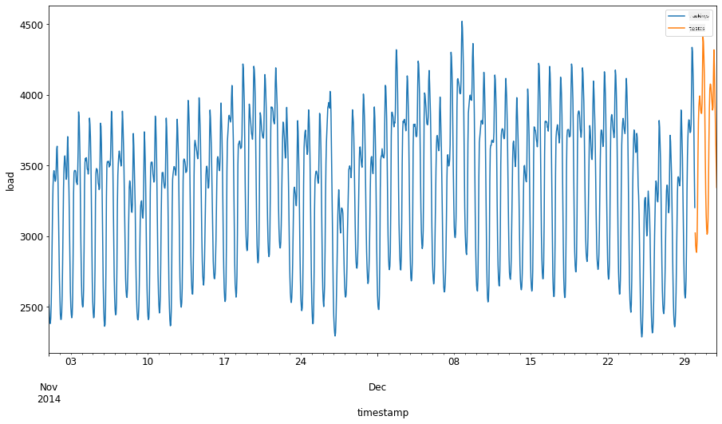
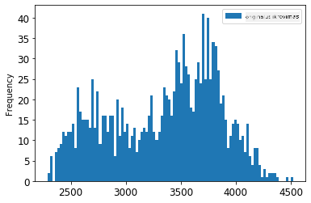
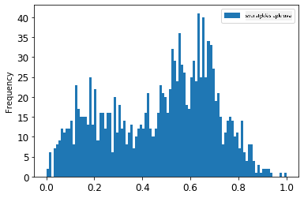
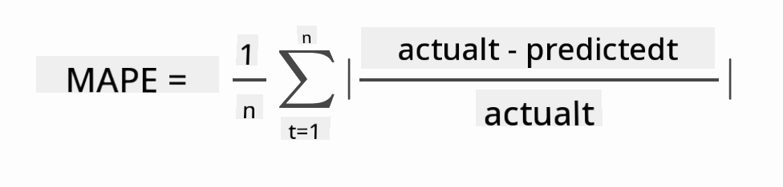

<!--
CO_OP_TRANSLATOR_METADATA:
{
  "original_hash": "2f400075e003e749fdb0d6b3b4787a99",
  "translation_date": "2025-09-03T16:46:42+00:00",
  "source_file": "7-TimeSeries/2-ARIMA/README.md",
  "language_code": "lt"
}
-->
# Laiko eilučių prognozavimas su ARIMA

Ankstesnėje pamokoje sužinojote apie laiko eilučių prognozavimą ir įkėlėte duomenų rinkinį, rodantį elektros apkrovos svyravimus per tam tikrą laikotarpį.

[](https://youtu.be/IUSk-YDau10 "Įvadas į ARIMA")

> 🎥 Spustelėkite aukščiau esančią nuotrauką, kad peržiūrėtumėte vaizdo įrašą: Trumpas ARIMA modelių pristatymas. Pavyzdys pateiktas R kalba, tačiau koncepcijos yra universalios.

## [Prieš pamokos testas](https://gray-sand-07a10f403.1.azurestaticapps.net/quiz/43/)

## Įvadas

Šioje pamokoje sužinosite apie specifinį būdą kurti modelius naudojant [ARIMA: *A*uto*R*egressive *I*ntegrated *M*oving *A*verage](https://wikipedia.org/wiki/Autoregressive_integrated_moving_average). ARIMA modeliai ypač tinka analizuoti duomenis, kurie rodo [ne-stacionarumą](https://wikipedia.org/wiki/Stationary_process).

## Bendros sąvokos

Norint dirbti su ARIMA, reikia suprasti keletą pagrindinių sąvokų:

- 🎓 **Stacionarumas**. Statistiniame kontekste stacionarumas reiškia duomenis, kurių pasiskirstymas nesikeičia, kai jie perkelti laike. Ne-stacionarūs duomenys rodo svyravimus dėl tendencijų, kurias reikia transformuoti, kad būtų galima analizuoti. Pavyzdžiui, sezoniškumas gali sukelti duomenų svyravimus, kuriuos galima pašalinti taikant „sezoninį diferencijavimą“.

- 🎓 **[Diferencijavimas](https://wikipedia.org/wiki/Autoregressive_integrated_moving_average#Differencing)**. Diferencijavimas statistiniame kontekste reiškia procesą, kurio metu ne-stacionarūs duomenys transformuojami į stacionarius, pašalinant jų nekonstantinę tendenciją. „Diferencijavimas pašalina laiko eilutės lygio pokyčius, panaikindamas tendencijas ir sezoniškumą, taip stabilizuodamas laiko eilutės vidurkį.“ [Shixiong et al straipsnis](https://arxiv.org/abs/1904.07632)

## ARIMA laiko eilučių kontekste

Išskaidykime ARIMA dalis, kad geriau suprastume, kaip ji padeda modeliuoti laiko eilutes ir atlikti prognozes.

- **AR - AutoRegressive (autoregresija)**. Autoregresiniai modeliai, kaip rodo pavadinimas, „žvelgia atgal“ laike, analizuodami ankstesnes jūsų duomenų reikšmes ir darydami prielaidas apie jas. Šios ankstesnės reikšmės vadinamos „atsilikimais“ (lags). Pavyzdžiui, duomenys, rodantys mėnesinius pieštukų pardavimus. Kiekvieno mėnesio pardavimų suma būtų laikoma „kintamuoju, kuris evoliucionuoja“ duomenų rinkinyje. Šis modelis kuriamas kaip „evoliucionuojantis kintamasis yra regresuojamas pagal savo ankstesnes (t. y., ankstesnes) reikšmes.“ [wikipedia](https://wikipedia.org/wiki/Autoregressive_integrated_moving_average)

- **I - Integrated (integracija)**. Skirtingai nuo panašių „ARMA“ modelių, „I“ ARIMA modelyje reiškia jo *[integruotą](https://wikipedia.org/wiki/Order_of_integration)* aspektą. Duomenys yra „integruoti“, kai taikomi diferencijavimo žingsniai, siekiant pašalinti ne-stacionarumą.

- **MA - Moving Average (slankusis vidurkis)**. [Slankiojo vidurkio](https://wikipedia.org/wiki/Moving-average_model) aspektas šiame modelyje reiškia išvesties kintamąjį, kuris nustatomas stebint dabartines ir ankstesnes atsilikimų reikšmes.

Esmė: ARIMA naudojama tam, kad modelis kuo tiksliau atitiktų specifinę laiko eilučių duomenų formą.

## Užduotis - sukurkite ARIMA modelį

Atidarykite [_/working_](https://github.com/microsoft/ML-For-Beginners/tree/main/7-TimeSeries/2-ARIMA/working) aplanką šioje pamokoje ir suraskite [_notebook.ipynb_](https://github.com/microsoft/ML-For-Beginners/blob/main/7-TimeSeries/2-ARIMA/working/notebook.ipynb) failą.

1. Paleiskite užrašų knygelę, kad įkeltumėte `statsmodels` Python biblioteką; jums jos reikės ARIMA modeliams.

1. Įkelkite reikalingas bibliotekas.

1. Dabar įkelkite dar kelias bibliotekas, naudingas duomenų vizualizavimui:

    ```python
    import os
    import warnings
    import matplotlib.pyplot as plt
    import numpy as np
    import pandas as pd
    import datetime as dt
    import math

    from pandas.plotting import autocorrelation_plot
    from statsmodels.tsa.statespace.sarimax import SARIMAX
    from sklearn.preprocessing import MinMaxScaler
    from common.utils import load_data, mape
    from IPython.display import Image

    %matplotlib inline
    pd.options.display.float_format = '{:,.2f}'.format
    np.set_printoptions(precision=2)
    warnings.filterwarnings("ignore") # specify to ignore warning messages
    ```

1. Įkelkite duomenis iš `/data/energy.csv` failo į Pandas duomenų rėmelį ir peržiūrėkite:

    ```python
    energy = load_data('./data')[['load']]
    energy.head(10)
    ```

1. Nubraižykite visus turimus energijos duomenis nuo 2012 m. sausio iki 2014 m. gruodžio. Neturėtų būti jokių staigmenų, nes šiuos duomenis matėme ankstesnėje pamokoje:

    ```python
    energy.plot(y='load', subplots=True, figsize=(15, 8), fontsize=12)
    plt.xlabel('timestamp', fontsize=12)
    plt.ylabel('load', fontsize=12)
    plt.show()
    ```

    Dabar sukurkime modelį!

### Sukurkite mokymo ir testavimo duomenų rinkinius

Dabar jūsų duomenys įkelti, todėl galite juos padalyti į mokymo ir testavimo rinkinius. Modelį treniruosite naudodami mokymo rinkinį. Kaip įprasta, kai modelio mokymas bus baigtas, jo tikslumą įvertinsite naudodami testavimo rinkinį. Turite užtikrinti, kad testavimo rinkinys apimtų vėlesnį laikotarpį nei mokymo rinkinys, kad modelis negautų informacijos iš ateities laikotarpių.

1. Mokymo rinkiniui priskirkite dviejų mėnesių laikotarpį nuo 2014 m. rugsėjo 1 d. iki spalio 31 d. Testavimo rinkinys apims dviejų mėnesių laikotarpį nuo 2014 m. lapkričio 1 d. iki gruodžio 31 d.:

    ```python
    train_start_dt = '2014-11-01 00:00:00'
    test_start_dt = '2014-12-30 00:00:00'
    ```

    Kadangi šie duomenys atspindi kasdienį energijos suvartojimą, yra stiprus sezoniškumo modelis, tačiau suvartojimas labiausiai panašus į suvartojimą artimiausiomis dienomis.

1. Vizualizuokite skirtumus:

    ```python
    energy[(energy.index < test_start_dt) & (energy.index >= train_start_dt)][['load']].rename(columns={'load':'train'}) \
        .join(energy[test_start_dt:][['load']].rename(columns={'load':'test'}), how='outer') \
        .plot(y=['train', 'test'], figsize=(15, 8), fontsize=12)
    plt.xlabel('timestamp', fontsize=12)
    plt.ylabel('load', fontsize=12)
    plt.show()
    ```

    

    Todėl, naudojant palyginti mažą laiko langą duomenų mokymui, turėtų pakakti.

    > Pastaba: Kadangi funkcija, kurią naudojame ARIMA modelio pritaikymui, naudoja vidinio mėginio validaciją mokymo metu, validacijos duomenis praleisime.

### Paruoškite duomenis mokymui

Dabar reikia paruošti duomenis mokymui, atlikdami filtravimą ir duomenų skalavimą. Filtruokite savo duomenų rinkinį, kad būtų įtraukti tik reikalingi laikotarpiai ir stulpeliai, ir skalavimas, kad duomenys būtų pateikti intervale 0,1.

1. Filtruokite originalų duomenų rinkinį, kad būtų įtraukti tik minėti laikotarpiai kiekvienam rinkiniui ir tik reikalingas stulpelis „load“ bei data:

    ```python
    train = energy.copy()[(energy.index >= train_start_dt) & (energy.index < test_start_dt)][['load']]
    test = energy.copy()[energy.index >= test_start_dt][['load']]

    print('Training data shape: ', train.shape)
    print('Test data shape: ', test.shape)
    ```

    Galite matyti duomenų formą:

    ```output
    Training data shape:  (1416, 1)
    Test data shape:  (48, 1)
    ```

1. Skalaukite duomenis, kad jie būtų intervale (0, 1).

    ```python
    scaler = MinMaxScaler()
    train['load'] = scaler.fit_transform(train)
    train.head(10)
    ```

1. Vizualizuokite originalius ir skalautus duomenis:

    ```python
    energy[(energy.index >= train_start_dt) & (energy.index < test_start_dt)][['load']].rename(columns={'load':'original load'}).plot.hist(bins=100, fontsize=12)
    train.rename(columns={'load':'scaled load'}).plot.hist(bins=100, fontsize=12)
    plt.show()
    ```

    

    > Originalūs duomenys

    

    > Skalauti duomenys

1. Dabar, kai sukalibravote skalautus duomenis, galite skalauti testavimo duomenis:

    ```python
    test['load'] = scaler.transform(test)
    test.head()
    ```

### Įgyvendinkite ARIMA

Atėjo laikas įgyvendinti ARIMA! Dabar naudosite anksčiau įdiegtą `statsmodels` biblioteką.

Dabar reikia atlikti kelis žingsnius:

   1. Apibrėžkite modelį, iškviesdami `SARIMAX()` ir perduodami modelio parametrus: p, d ir q parametrus, taip pat P, D ir Q parametrus.
   2. Paruoškite modelį mokymo duomenims, iškviesdami funkciją `fit()`.
   3. Atlikite prognozes, iškviesdami funkciją `forecast()` ir nurodydami žingsnių skaičių (prognozės „horizontą“).

> 🎓 Kam skirti visi šie parametrai? ARIMA modelyje yra 3 parametrai, kurie padeda modeliuoti pagrindinius laiko eilutės aspektus: sezoniškumą, tendenciją ir triukšmą. Šie parametrai yra:

`p`: parametras, susijęs su autoregresiniu modelio aspektu, kuris įtraukia *praeities* reikšmes.
`d`: parametras, susijęs su integruota modelio dalimi, kuris veikia *diferencijavimo* (🎓 prisiminkite diferencijavimą 👆?) kiekį, taikomą laiko eilutei.
`q`: parametras, susijęs su slankiojo vidurkio modelio dalimi.

> Pastaba: Jei jūsų duomenys turi sezoniškumo aspektą - kaip šie duomenys - , naudojame sezoninį ARIMA modelį (SARIMA). Tokiu atveju reikia naudoti kitą parametrų rinkinį: `P`, `D` ir `Q`, kurie apibūdina tuos pačius ryšius kaip `p`, `d` ir `q`, bet atitinka modelio sezoniškumo komponentus.

1. Pradėkite nustatydami pageidaujamą horizonto reikšmę. Pabandykime 3 valandas:

    ```python
    # Specify the number of steps to forecast ahead
    HORIZON = 3
    print('Forecasting horizon:', HORIZON, 'hours')
    ```

    Pasirinkti geriausias ARIMA modelio parametrų reikšmes gali būti sudėtinga, nes tai šiek tiek subjektyvu ir užima daug laiko. Galite apsvarstyti galimybę naudoti funkciją `auto_arima()` iš [`pyramid` bibliotekos](https://alkaline-ml.com/pmdarima/0.9.0/modules/generated/pyramid.arima.auto_arima.html).

1. Kol kas pabandykite keletą rankinių pasirinkimų, kad rastumėte gerą modelį.

    ```python
    order = (4, 1, 0)
    seasonal_order = (1, 1, 0, 24)

    model = SARIMAX(endog=train, order=order, seasonal_order=seasonal_order)
    results = model.fit()

    print(results.summary())
    ```

    Spausdinama rezultatų lentelė.

Jūs sukūrėte savo pirmąjį modelį! Dabar reikia rasti būdą jį įvertinti.

### Įvertinkite savo modelį

Norėdami įvertinti savo modelį, galite atlikti vadinamąją `walk forward` validaciją. Praktikoje laiko eilučių modeliai yra pertreniruojami kiekvieną kartą, kai atsiranda naujų duomenų. Tai leidžia modeliui atlikti geriausią prognozę kiekviename laiko žingsnyje.

Pradėdami nuo laiko eilutės pradžios, naudodami šią techniką, treniruokite modelį mokymo duomenų rinkinyje. Tada atlikite prognozę kitame laiko žingsnyje. Prognozė įvertinama pagal žinomą reikšmę. Mokymo rinkinys tada išplečiamas, kad būtų įtraukta žinoma reikšmė, ir procesas kartojamas.

> Pastaba: Turėtumėte išlaikyti fiksuotą mokymo rinkinio langą efektyvesniam mokymui, kad kiekvieną kartą, kai pridedate naują stebėjimą prie mokymo rinkinio, pašalintumėte stebėjimą iš rinkinio pradžios.

Šis procesas suteikia tikslesnį modelio veikimo įvertinimą praktikoje. Tačiau tai kainuoja skaičiavimo išteklius, nes reikia sukurti tiek daug modelių. Tai priimtina, jei duomenys yra maži arba modelis paprastas, tačiau gali būti problema dideliu mastu.

„Walk-forward“ validacija yra aukso standartas laiko eilučių modelių vertinimui ir rekomenduojama jūsų projektams.

1. Pirmiausia sukurkite testavimo duomenų tašką kiekvienam HORIZON žingsniui.

    ```python
    test_shifted = test.copy()

    for t in range(1, HORIZON+1):
        test_shifted['load+'+str(t)] = test_shifted['load'].shift(-t, freq='H')

    test_shifted = test_shifted.dropna(how='any')
    test_shifted.head(5)
    ```

    |            |          | load | load+1 | load+2 |
    | ---------- | -------- | ---- | ------ | ------ |
    | 2014-12-30 | 00:00:00 | 0.33 | 0.29   | 0.27   |
    | 2014-12-30 | 01:00:00 | 0.29 | 0.27   | 0.27   |
    | 2014-12-30 | 02:00:00 | 0.27 | 0.27   | 0.30   |
    | 2014-12-30 | 03:00:00 | 0.27 | 0.30   | 0.41   |
    | 2014-12-30 | 04:00:00 | 0.30 | 0.41   | 0.57   |

    Duomenys yra horizontaliai perkelti pagal jų horizonto tašką.

1. Atlikite prognozes savo testavimo duomenims, naudodami šį slankiojo lango metodą cikle, kurio dydis atitinka testavimo duomenų ilgį:

    ```python
    %%time
    training_window = 720 # dedicate 30 days (720 hours) for training

    train_ts = train['load']
    test_ts = test_shifted

    history = [x for x in train_ts]
    history = history[(-training_window):]

    predictions = list()

    order = (2, 1, 0)
    seasonal_order = (1, 1, 0, 24)

    for t in range(test_ts.shape[0]):
        model = SARIMAX(endog=history, order=order, seasonal_order=seasonal_order)
        model_fit = model.fit()
        yhat = model_fit.forecast(steps = HORIZON)
        predictions.append(yhat)
        obs = list(test_ts.iloc[t])
        # move the training window
        history.append(obs[0])
        history.pop(0)
        print(test_ts.index[t])
        print(t+1, ': predicted =', yhat, 'expected =', obs)
    ```

    Galite stebėti mokymo procesą:

    ```output
    2014-12-30 00:00:00
    1 : predicted = [0.32 0.29 0.28] expected = [0.32945389435989236, 0.2900626678603402, 0.2739480752014323]

    2014-12-30 01:00:00
    2 : predicted = [0.3  0.29 0.3 ] expected = [0.2900626678603402, 0.2739480752014323, 0.26812891674127126]

    2014-12-30 02:00:00
    3 : predicted = [0.27 0.28 0.32] expected = [0.2739480752014323, 0.26812891674127126, 0.3025962399283795]
    ```

1. Palyginkite prognozes su faktine apkrova:

    ```python
    eval_df = pd.DataFrame(predictions, columns=['t+'+str(t) for t in range(1, HORIZON+1)])
    eval_df['timestamp'] = test.index[0:len(test.index)-HORIZON+1]
    eval_df = pd.melt(eval_df, id_vars='timestamp', value_name='prediction', var_name='h')
    eval_df['actual'] = np.array(np.transpose(test_ts)).ravel()
    eval_df[['prediction', 'actual']] = scaler.inverse_transform(eval_df[['prediction', 'actual']])
    eval_df.head()
    ```

    Rezultatas
    |     |            | timestamp | h   | prediction | actual   |
    | --- | ---------- | --------- | --- | ---------- | -------- |
    | 0   | 2014-12-30 | 00:00:00  | t+1 | 3,008.74   | 3,023.00 |
    | 1   | 2014-12-30 | 01:00:00  | t+1 | 2,955.53   | 2,935.00 |
    | 2   | 2014-12-30 | 02:00:00  | t+1 | 2,900.17   | 2,899.00 |
    | 3   | 2014-12-30 | 03:00:00  | t+1 | 2,917.69   | 2,886.00 |
    | 4   | 2014-12-30 | 04:00:00  | t+1 | 2,946.99   | 2,963.00 |

    Stebėkite valandinius duomenis: prognozė, palyginti su faktine apkrova. Koks tikslumas?

### Patikrinkite modelio tikslumą

Patikrinkite savo modelio tikslumą, išbandydami jo vidutinę absoliučią procentinę paklaidą (MAPE) visose prognozėse.
> **🧮 Parodykime matematiką**
>
> 
>
> [MAPE](https://www.linkedin.com/pulse/what-mape-mad-msd-time-series-allameh-statistics/) naudojamas parodyti prognozės tikslumą kaip santykį, apibrėžtą aukščiau pateikta formule. Skirtumas tarp faktinių ir prognozuotų reikšmių yra padalijamas iš faktinių reikšmių.
>
> „Absoliuti šios skaičiavimo vertė yra sumuojama kiekvienam prognozuotam taškui laike ir padalijama iš pritaikytų taškų skaičiaus n.“ [wikipedia](https://wikipedia.org/wiki/Mean_absolute_percentage_error)
1. Išreikškite lygtį kode:

    ```python
    if(HORIZON > 1):
        eval_df['APE'] = (eval_df['prediction'] - eval_df['actual']).abs() / eval_df['actual']
        print(eval_df.groupby('h')['APE'].mean())
    ```

1. Apskaičiuokite vieno žingsnio MAPE:

    ```python
    print('One step forecast MAPE: ', (mape(eval_df[eval_df['h'] == 't+1']['prediction'], eval_df[eval_df['h'] == 't+1']['actual']))*100, '%')
    ```

    Vieno žingsnio prognozės MAPE:  0.5570581332313952 %

1. Atspausdinkite daugiapakopės prognozės MAPE:

    ```python
    print('Multi-step forecast MAPE: ', mape(eval_df['prediction'], eval_df['actual'])*100, '%')
    ```

    ```output
    Multi-step forecast MAPE:  1.1460048657704118 %
    ```

    Geriausia yra mažas skaičius: atsižvelkite į tai, kad prognozė, kurios MAPE yra 10, reiškia 10% paklaidą.

1. Tačiau, kaip visada, tokį tikslumo matavimą lengviau suprasti vizualiai, todėl nubraižykime grafiką:

    ```python
     if(HORIZON == 1):
        ## Plotting single step forecast
        eval_df.plot(x='timestamp', y=['actual', 'prediction'], style=['r', 'b'], figsize=(15, 8))

    else:
        ## Plotting multi step forecast
        plot_df = eval_df[(eval_df.h=='t+1')][['timestamp', 'actual']]
        for t in range(1, HORIZON+1):
            plot_df['t+'+str(t)] = eval_df[(eval_df.h=='t+'+str(t))]['prediction'].values

        fig = plt.figure(figsize=(15, 8))
        ax = plt.plot(plot_df['timestamp'], plot_df['actual'], color='red', linewidth=4.0)
        ax = fig.add_subplot(111)
        for t in range(1, HORIZON+1):
            x = plot_df['timestamp'][(t-1):]
            y = plot_df['t+'+str(t)][0:len(x)]
            ax.plot(x, y, color='blue', linewidth=4*math.pow(.9,t), alpha=math.pow(0.8,t))

        ax.legend(loc='best')

    plt.xlabel('timestamp', fontsize=12)
    plt.ylabel('load', fontsize=12)
    plt.show()
    ```

    

🏆 Labai gražus grafikas, rodantis modelį su geru tikslumu. Puikus darbas!

---

## 🚀Iššūkis

Pasigilinkite į būdus, kaip patikrinti laiko eilučių modelio tikslumą. Šioje pamokoje aptarėme MAPE, tačiau ar yra kitų metodų, kuriuos galėtumėte naudoti? Ištirkite juos ir pateikite pastabas. Naudingą dokumentą galite rasti [čia](https://otexts.com/fpp2/accuracy.html)

## [Po paskaitos testas](https://gray-sand-07a10f403.1.azurestaticapps.net/quiz/44/)

## Apžvalga ir savarankiškas mokymasis

Šioje pamokoje aptariami tik pagrindiniai laiko eilučių prognozavimo su ARIMA aspektai. Skirkite laiko gilinti savo žinias, peržiūrėdami [šį saugyklą](https://microsoft.github.io/forecasting/) ir įvairius modelių tipus, kad sužinotumėte kitus būdus kurti laiko eilučių modelius.

## Užduotis

[Naujas ARIMA modelis](assignment.md)

---

**Atsakomybės apribojimas**:  
Šis dokumentas buvo išverstas naudojant AI vertimo paslaugą [Co-op Translator](https://github.com/Azure/co-op-translator). Nors siekiame tikslumo, prašome atkreipti dėmesį, kad automatiniai vertimai gali turėti klaidų ar netikslumų. Originalus dokumentas jo gimtąja kalba turėtų būti laikomas autoritetingu šaltiniu. Kritinei informacijai rekomenduojama profesionali žmogaus vertimo paslauga. Mes neprisiimame atsakomybės už nesusipratimus ar klaidingus interpretavimus, atsiradusius dėl šio vertimo naudojimo.