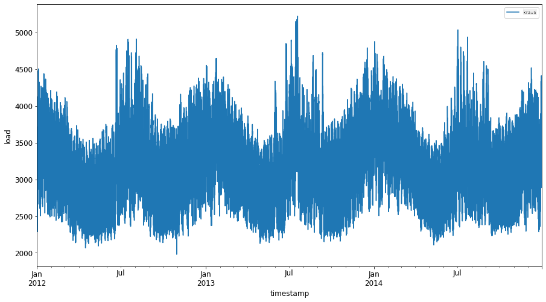
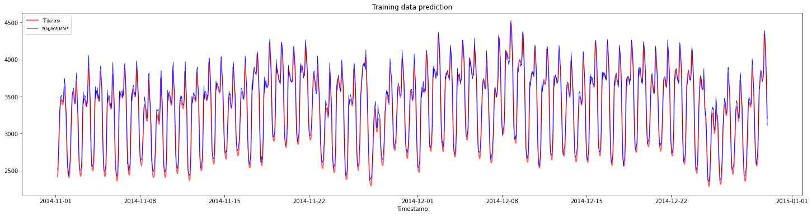
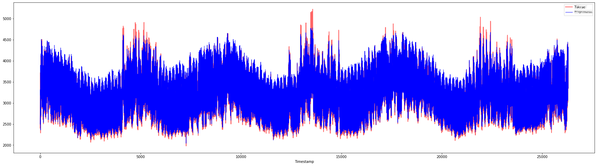

<!--
CO_OP_TRANSLATOR_METADATA:
{
  "original_hash": "f80e513b3279869e7661e3190cc83076",
  "translation_date": "2025-09-03T16:57:34+00:00",
  "source_file": "7-TimeSeries/3-SVR/README.md",
  "language_code": "lt"
}
-->
# Laiko eilučių prognozavimas naudojant Support Vector Regressor

Ankstesnėje pamokoje sužinojote, kaip naudoti ARIMA modelį laiko eilučių prognozėms. Dabar susipažinsite su Support Vector Regressor modeliu, kuris yra regresijos modelis, skirtas tęstiniams duomenims prognozuoti.

## [Prieš paskaitos testas](https://gray-sand-07a10f403.1.azurestaticapps.net/quiz/51/) 

## Įvadas

Šioje pamokoje sužinosite, kaip kurti modelius naudojant [**SVM**: **S**upport **V**ector **M**achine](https://en.wikipedia.org/wiki/Support-vector_machine) regresijai, arba **SVR: Support Vector Regressor**.

### SVR laiko eilučių kontekste [^1]

Prieš suprantant SVR svarbą laiko eilučių prognozėse, svarbu žinoti šiuos pagrindinius konceptus:

- **Regresija:** Prižiūrimo mokymosi technika, skirta tęstinių reikšmių prognozavimui pagal pateiktą įvestį. Idėja yra pritaikyti kreivę (arba liniją) funkcijų erdvėje, kurioje yra maksimalus duomenų taškų skaičius. [Spauskite čia](https://en.wikipedia.org/wiki/Regression_analysis) norėdami sužinoti daugiau.
- **Support Vector Machine (SVM):** Prižiūrimo mokymosi modelis, naudojamas klasifikacijai, regresijai ir anomalijų aptikimui. Modelis yra hiperplokštuma funkcijų erdvėje, kuri klasifikacijos atveju veikia kaip riba, o regresijos atveju kaip geriausiai tinkanti linija. SVM dažnai naudoja branduolio funkciją, kad transformuotų duomenų rinkinį į aukštesnės dimensijos erdvę, kurioje jie tampa lengviau atskiriami. [Spauskite čia](https://en.wikipedia.org/wiki/Support-vector_machine) norėdami sužinoti daugiau apie SVM.
- **Support Vector Regressor (SVR):** SVM tipas, skirtas rasti geriausiai tinkamą liniją (SVM atveju tai yra hiperplokštuma), kurioje yra maksimalus duomenų taškų skaičius.

### Kodėl SVR? [^1]

Ankstesnėje pamokoje sužinojote apie ARIMA, kuris yra labai sėkmingas statistinis linijinis metodas laiko eilučių duomenims prognozuoti. Tačiau daugeliu atvejų laiko eilučių duomenys turi *nelinijiškumą*, kurio negali apdoroti linijiniai modeliai. Tokiais atvejais SVM gebėjimas atsižvelgti į duomenų nelinijiškumą regresijos užduotyse daro SVR sėkmingą laiko eilučių prognozėse.

## Užduotis - sukurti SVR modelį

Pirmieji keli duomenų paruošimo žingsniai yra tokie patys kaip ankstesnėje pamokoje apie [ARIMA](https://github.com/microsoft/ML-For-Beginners/tree/main/7-TimeSeries/2-ARIMA). 

Atidarykite [_/working_](https://github.com/microsoft/ML-For-Beginners/tree/main/7-TimeSeries/3-SVR/working) aplanką šioje pamokoje ir suraskite [_notebook.ipynb_](https://github.com/microsoft/ML-For-Beginners/blob/main/7-TimeSeries/3-SVR/working/notebook.ipynb) failą.[^2]

1. Paleiskite notebook ir importuokite reikalingas bibliotekas: [^2]

   ```python
   import sys
   sys.path.append('../../')
   ```

   ```python
   import os
   import warnings
   import matplotlib.pyplot as plt
   import numpy as np
   import pandas as pd
   import datetime as dt
   import math
   
   from sklearn.svm import SVR
   from sklearn.preprocessing import MinMaxScaler
   from common.utils import load_data, mape
   ```

2. Įkelkite duomenis iš `/data/energy.csv` failo į Pandas dataframe ir peržiūrėkite: [^2]

   ```python
   energy = load_data('../../data')[['load']]
   ```

3. Nubraižykite visus turimus energijos duomenis nuo 2012 m. sausio iki 2014 m. gruodžio: [^2]

   ```python
   energy.plot(y='load', subplots=True, figsize=(15, 8), fontsize=12)
   plt.xlabel('timestamp', fontsize=12)
   plt.ylabel('load', fontsize=12)
   plt.show()
   ```

   

   Dabar sukurkime SVR modelį.

### Sukurkite mokymo ir testavimo duomenų rinkinius

Kai duomenys yra įkelti, galite juos padalinti į mokymo ir testavimo rinkinius. Tada pertvarkysite duomenis, kad sukurtumėte laiko žingsnių pagrindu sudarytą duomenų rinkinį, kuris bus reikalingas SVR. Modelį treniruosite su mokymo rinkiniu. Kai modelio mokymas bus baigtas, įvertinsite jo tikslumą mokymo rinkinyje, testavimo rinkinyje ir visame duomenų rinkinyje, kad pamatytumėte bendrą našumą. Turite užtikrinti, kad testavimo rinkinys apimtų vėlesnį laikotarpį nei mokymo rinkinys, kad modelis negautų informacijos iš ateities laikotarpių [^2] (situacija, vadinama *permokymu*).

1. Paskirkite dviejų mėnesių laikotarpį nuo 2014 m. rugsėjo 1 d. iki spalio 31 d. mokymo rinkiniui. Testavimo rinkinys apims dviejų mėnesių laikotarpį nuo 2014 m. lapkričio 1 d. iki gruodžio 31 d.: [^2]

   ```python
   train_start_dt = '2014-11-01 00:00:00'
   test_start_dt = '2014-12-30 00:00:00'
   ```

2. Vizualizuokite skirtumus: [^2]

   ```python
   energy[(energy.index < test_start_dt) & (energy.index >= train_start_dt)][['load']].rename(columns={'load':'train'}) \
       .join(energy[test_start_dt:][['load']].rename(columns={'load':'test'}), how='outer') \
       .plot(y=['train', 'test'], figsize=(15, 8), fontsize=12)
   plt.xlabel('timestamp', fontsize=12)
   plt.ylabel('load', fontsize=12)
   plt.show()
   ```

   

### Paruoškite duomenis mokymui

Dabar turite paruošti duomenis mokymui, atlikdami filtravimą ir mastelio keitimą. Filtruokite savo duomenų rinkinį, kad būtų įtraukti tik reikalingi laikotarpiai ir stulpeliai, ir mastelio keitimas, kad duomenys būtų pateikti intervale 0,1.

1. Filtruokite originalų duomenų rinkinį, kad būtų įtraukti tik minėti laikotarpiai kiekvienam rinkiniui ir tik reikalingas stulpelis 'load' bei data: [^2]

   ```python
   train = energy.copy()[(energy.index >= train_start_dt) & (energy.index < test_start_dt)][['load']]
   test = energy.copy()[energy.index >= test_start_dt][['load']]
   
   print('Training data shape: ', train.shape)
   print('Test data shape: ', test.shape)
   ```

   ```output
   Training data shape:  (1416, 1)
   Test data shape:  (48, 1)
   ```
   
2. Mastelio keitimas mokymo duomenims į intervalą (0, 1): [^2]

   ```python
   scaler = MinMaxScaler()
   train['load'] = scaler.fit_transform(train)
   ```
   
4. Dabar mastelio keitimas testavimo duomenims: [^2]

   ```python
   test['load'] = scaler.transform(test)
   ```

### Sukurkite duomenis su laiko žingsniais [^1]

SVR atveju transformuojate įvesties duomenis į formą `[batch, timesteps]`. Taigi, pertvarkote esamus `train_data` ir `test_data`, kad atsirastų nauja dimensija, kuri nurodo laiko žingsnius.

```python
# Converting to numpy arrays
train_data = train.values
test_data = test.values
```

Šiame pavyzdyje pasirenkame `timesteps = 5`. Taigi, modelio įvestys yra duomenys pirmiems 4 laiko žingsniams, o išvestis bus duomenys 5-ajam laiko žingsniui.

```python
timesteps=5
```

Mokymo duomenų konvertavimas į 2D tensorą naudojant įdėtą sąrašų supratimą:

```python
train_data_timesteps=np.array([[j for j in train_data[i:i+timesteps]] for i in range(0,len(train_data)-timesteps+1)])[:,:,0]
train_data_timesteps.shape
```

```output
(1412, 5)
```

Testavimo duomenų konvertavimas į 2D tensorą:

```python
test_data_timesteps=np.array([[j for j in test_data[i:i+timesteps]] for i in range(0,len(test_data)-timesteps+1)])[:,:,0]
test_data_timesteps.shape
```

```output
(44, 5)
```

Įvesties ir išvesties pasirinkimas iš mokymo ir testavimo duomenų:

```python
x_train, y_train = train_data_timesteps[:,:timesteps-1],train_data_timesteps[:,[timesteps-1]]
x_test, y_test = test_data_timesteps[:,:timesteps-1],test_data_timesteps[:,[timesteps-1]]

print(x_train.shape, y_train.shape)
print(x_test.shape, y_test.shape)
```

```output
(1412, 4) (1412, 1)
(44, 4) (44, 1)
```

### Įgyvendinkite SVR [^1]

Dabar laikas įgyvendinti SVR. Norėdami sužinoti daugiau apie šį įgyvendinimą, galite kreiptis į [šią dokumentaciją](https://scikit-learn.org/stable/modules/generated/sklearn.svm.SVR.html). Mūsų įgyvendinimui laikomės šių žingsnių:

  1. Apibrėžkite modelį, iškviesdami `SVR()` ir perduodami modelio hiperparametrus: kernel, gamma, c ir epsilon
  2. Paruoškite modelį mokymo duomenims, iškviesdami funkciją `fit()`
  3. Atlikite prognozes, iškviesdami funkciją `predict()`

Dabar sukuriame SVR modelį. Čia naudojame [RBF branduolį](https://scikit-learn.org/stable/modules/svm.html#parameters-of-the-rbf-kernel) ir nustatome hiperparametrus gamma, C ir epsilon kaip 0.5, 10 ir 0.05 atitinkamai.

```python
model = SVR(kernel='rbf',gamma=0.5, C=10, epsilon = 0.05)
```

#### Modelio pritaikymas mokymo duomenims [^1]

```python
model.fit(x_train, y_train[:,0])
```

```output
SVR(C=10, cache_size=200, coef0=0.0, degree=3, epsilon=0.05, gamma=0.5,
    kernel='rbf', max_iter=-1, shrinking=True, tol=0.001, verbose=False)
```

#### Modelio prognozės [^1]

```python
y_train_pred = model.predict(x_train).reshape(-1,1)
y_test_pred = model.predict(x_test).reshape(-1,1)

print(y_train_pred.shape, y_test_pred.shape)
```

```output
(1412, 1) (44, 1)
```

Jūs sukūrėte savo SVR! Dabar reikia jį įvertinti.

### Įvertinkite savo modelį [^1]

Norėdami įvertinti, pirmiausia grąžinsime duomenis į pradinį mastelį. Tada, norėdami patikrinti našumą, nubraižysime originalų ir prognozuotą laiko eilučių grafiką bei atspausdinsime MAPE rezultatą.

Grąžinkite prognozuotus ir originalius duomenis į pradinį mastelį:

```python
# Scaling the predictions
y_train_pred = scaler.inverse_transform(y_train_pred)
y_test_pred = scaler.inverse_transform(y_test_pred)

print(len(y_train_pred), len(y_test_pred))
```

```python
# Scaling the original values
y_train = scaler.inverse_transform(y_train)
y_test = scaler.inverse_transform(y_test)

print(len(y_train), len(y_test))
```

#### Patikrinkite modelio našumą mokymo ir testavimo duomenyse [^1]

Iš duomenų rinkinio išgauname laiko žymes, kad parodytume x ašyje mūsų grafike. Atkreipkite dėmesį, kad naudojame pirmus ```timesteps-1``` reikšmes kaip įvestį pirmai išvesčiai, todėl išvesčių laiko žymės prasidės po to.

```python
train_timestamps = energy[(energy.index < test_start_dt) & (energy.index >= train_start_dt)].index[timesteps-1:]
test_timestamps = energy[test_start_dt:].index[timesteps-1:]

print(len(train_timestamps), len(test_timestamps))
```

```output
1412 44
```

Nubraižykite mokymo duomenų prognozes:

```python
plt.figure(figsize=(25,6))
plt.plot(train_timestamps, y_train, color = 'red', linewidth=2.0, alpha = 0.6)
plt.plot(train_timestamps, y_train_pred, color = 'blue', linewidth=0.8)
plt.legend(['Actual','Predicted'])
plt.xlabel('Timestamp')
plt.title("Training data prediction")
plt.show()
```



Atspausdinkite MAPE mokymo duomenims

```python
print('MAPE for training data: ', mape(y_train_pred, y_train)*100, '%')
```

```output
MAPE for training data: 1.7195710200875551 %
```

Nubraižykite testavimo duomenų prognozes

```python
plt.figure(figsize=(10,3))
plt.plot(test_timestamps, y_test, color = 'red', linewidth=2.0, alpha = 0.6)
plt.plot(test_timestamps, y_test_pred, color = 'blue', linewidth=0.8)
plt.legend(['Actual','Predicted'])
plt.xlabel('Timestamp')
plt.show()
```


Atspausdinkite MAPE testavimo duomenims

```python
print('MAPE for testing data: ', mape(y_test_pred, y_test)*100, '%')
```

```output
MAPE for testing data:  1.2623790187854018 %
```

🏆 Jūs pasiekėte labai gerą rezultatą testavimo duomenų rinkinyje!

### Patikrinkite modelio našumą visame duomenų rinkinyje [^1]

```python
# Extracting load values as numpy array
data = energy.copy().values

# Scaling
data = scaler.transform(data)

# Transforming to 2D tensor as per model input requirement
data_timesteps=np.array([[j for j in data[i:i+timesteps]] for i in range(0,len(data)-timesteps+1)])[:,:,0]
print("Tensor shape: ", data_timesteps.shape)

# Selecting inputs and outputs from data
X, Y = data_timesteps[:,:timesteps-1],data_timesteps[:,[timesteps-1]]
print("X shape: ", X.shape,"\nY shape: ", Y.shape)
```

```output
Tensor shape:  (26300, 5)
X shape:  (26300, 4) 
Y shape:  (26300, 1)
```

```python
# Make model predictions
Y_pred = model.predict(X).reshape(-1,1)

# Inverse scale and reshape
Y_pred = scaler.inverse_transform(Y_pred)
Y = scaler.inverse_transform(Y)
```

```python
plt.figure(figsize=(30,8))
plt.plot(Y, color = 'red', linewidth=2.0, alpha = 0.6)
plt.plot(Y_pred, color = 'blue', linewidth=0.8)
plt.legend(['Actual','Predicted'])
plt.xlabel('Timestamp')
plt.show()
```



```python
print('MAPE: ', mape(Y_pred, Y)*100, '%')
```

```output
MAPE:  2.0572089029888656 %
```

🏆 Labai gražūs grafikai, rodantys modelį su geru tikslumu. Puikiai padirbėta!

---

## 🚀Iššūkis

- Pabandykite keisti hiperparametrus (gamma, C, epsilon) kurdami modelį ir įvertinkite duomenis, kad pamatytumėte, kurie hiperparametrų rinkiniai duoda geriausius rezultatus testavimo duomenyse. Norėdami sužinoti daugiau apie šiuos hiperparametrus, galite kreiptis į dokumentą [čia](https://scikit-learn.org/stable/modules/svm.html#parameters-of-the-rbf-kernel). 
- Pabandykite naudoti skirtingas branduolio funkcijas modelyje ir analizuokite jų našumą duomenų rinkinyje. Naudingą dokumentą galite rasti [čia](https://scikit-learn.org/stable/modules/svm.html#kernel-functions).
- Pabandykite naudoti skirtingas `timesteps` reikšmes, kad modelis galėtų pažvelgti atgal ir atlikti prognozę.

## [Po paskaitos testas](https://gray-sand-07a10f403.1.azurestaticapps.net/quiz/52/)

## Apžvalga ir savarankiškas mokymasis

Ši pamoka buvo skirta supažindinti su SVR taikymu laiko eilučių prognozavimui. Norėdami sužinoti daugiau apie SVR, galite kreiptis į [šį tinklaraštį](https://www.analyticsvidhya.com/blog/2020/03/support-vector-regression-tutorial-for-machine-learning/). Ši [scikit-learn dokumentacija](https://scikit-learn.org/stable/modules/svm.html) pateikia išsamesnį paaiškinimą apie SVM apskritai, [SVR](https://scikit-learn.org/stable/modules/svm.html#regression) ir kitus įgyvendinimo aspektus, tokius kaip skirtingos [branduolio funkcijos](https://scikit-learn.org/stable/modules/svm.html#kernel-functions), kurias galima naudoti, ir jų parametrai.

## Užduotis

[Naujas SVR modelis](assignment.md)

## Kreditas

[^1]: Tekstą, kodą ir rezultatus šioje dalyje pateikė [@AnirbanMukherjeeXD](https://github.com/AnirbanMukherjeeXD)
[^2]: Tekstas, kodas ir rezultatai šioje dalyje paimti iš [ARIMA](https://github.com/microsoft/ML-For-Beginners/tree/main/7-TimeSeries/2-ARIMA)

---

**Atsakomybės apribojimas**:  
Šis dokumentas buvo išverstas naudojant AI vertimo paslaugą [Co-op Translator](https://github.com/Azure/co-op-translator). Nors siekiame tikslumo, prašome atkreipti dėmesį, kad automatiniai vertimai gali turėti klaidų ar netikslumų. Originalus dokumentas jo gimtąja kalba turėtų būti laikomas autoritetingu šaltiniu. Kritinei informacijai rekomenduojama naudoti profesionalų žmogaus vertimą. Mes neprisiimame atsakomybės už nesusipratimus ar klaidingus interpretavimus, atsiradusius dėl šio vertimo naudojimo.